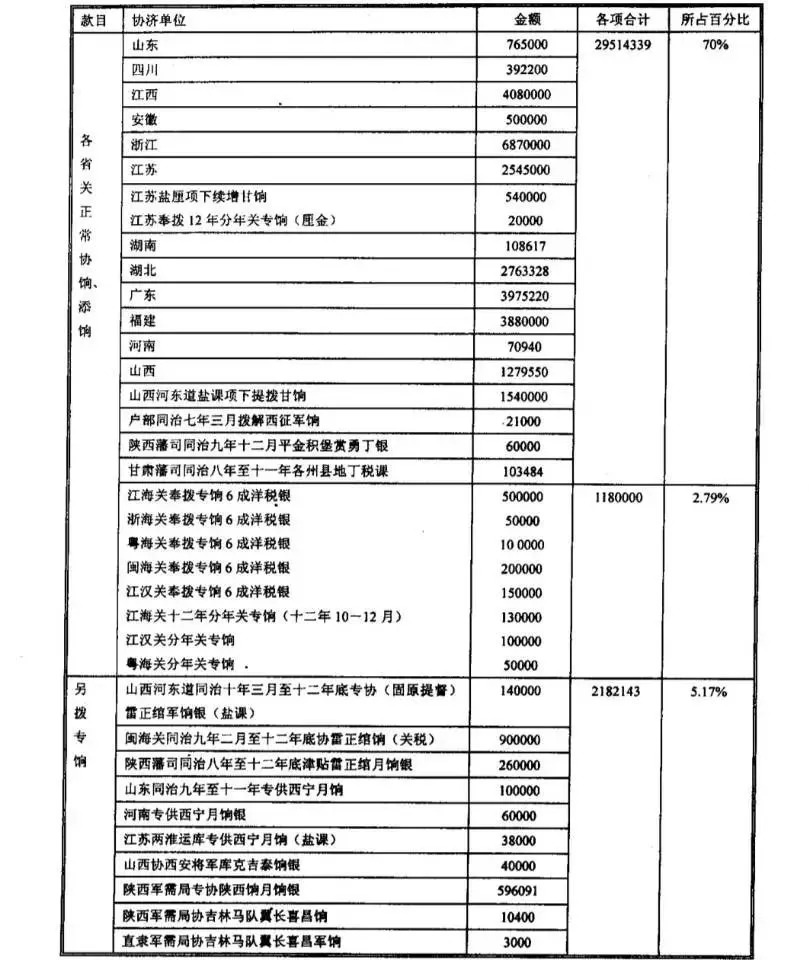
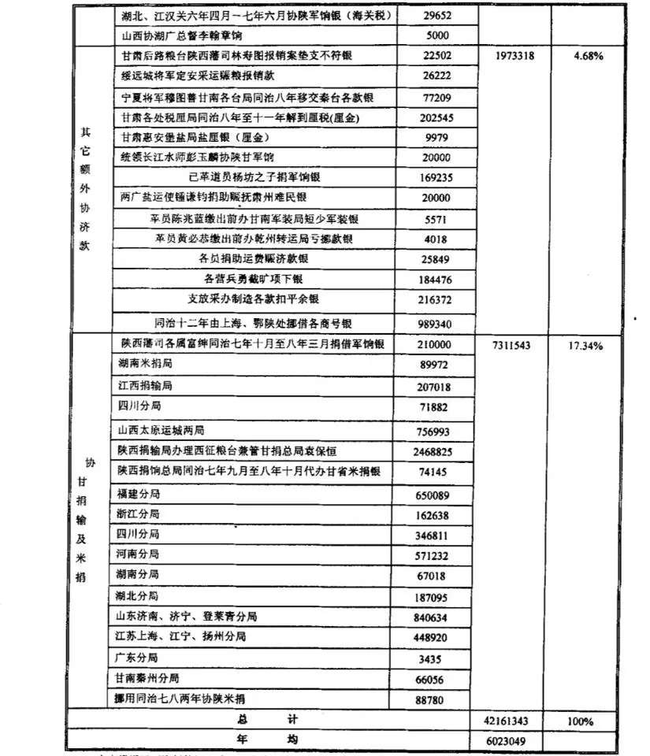

- [晚清沧海事 第二版 上卷 B](#晚清沧海事-第二版-上卷-b)
  - [大河九曲](#大河九曲)
  - [小强之死](#小强之死)
  - [曾参杀人](#曾参杀人)
  - [两杆大烟枪（上）](#两杆大烟枪上)
  - [两杆大烟枪（下）](#两杆大烟枪下)
  - [蝴蝶效应](#蝴蝶效应)
  - [西北偏北](#西北偏北)
  - [总得有人站出来](#总得有人站出来)
  - [走在历史前面的人](#走在历史前面的人)
  - [太阳照常升起](#太阳照常升起)
  - [命运之神](#命运之神)
  - [末路狂凶](#末路狂凶)
  - [征途漫漫](#征途漫漫)
  - [三甲集传奇](#三甲集传奇)
  - [兵伐古道](#兵伐古道)
  - [冰髅血沙](#冰髅血沙)
  - [回头是岸](#回头是岸)
  - [鏖战河湟（修改）](#鏖战河湟修改)
  - [霜血铁衣](#霜血铁衣)
  - [二桃杀三士](#二桃杀三士)
  - [战河西定关内，破教宦安穆民](#战河西定关内破教宦安穆民)

# 晚清沧海事 第二版 上卷 B

作者：罗马主义

## 大河九曲

黄鼎的这群川军，在其他人看来，简直就是一群霍比特人和半兽人的组合。

大部分川军士兵，比他们的枪高不了多少，而且和霍比特人一样，他们喜欢叼根长长的旱烟杆，士兵们抽的是呛呛的烟叶，将官们抽的都是香香的鸦片。

川军士兵的最大乐趣就是，将官抽鸦片的时候，他们聚在周围。如果将官深吸一口鸦片，然后吐了出去，士兵们就会全都伸长了脖子，使劲的去呼吸那些飘着的烟雾，然后露出一副心满意足的样子。

这样的军队能打仗？除了左宗棠以外，其他人看着，心里直摇头的。而且川军里还有一群特殊的士兵，人人穿着披风，帽子上有一个长长的角，据说叫做天菩萨，没事就坐在那里，围成一圈喝酒，喝醉了就地一躺，裹着披风，呼呼呼的就直接进入了梦乡。

更夸张的是，他们居然还在使用冷兵器，拿着式样独特的双股叉，大环刀，背着木制的十字弩，看着花里胡哨，稀奇古怪，活像一群半兽人。

大家好奇的一问，原来是彝族士兵。这都什么年代了，拿着这些破铜烂铁有个屁用，除非他们是一群超级英雄。

不过虽然没人瞧得起川军，但是有一点让他们很纳闷，那就是为什么只有他们，在被几万骑兵围得严严实实的战场上，成建制的突围而出，而且毫发无损，没人说得清楚。更别提为什么张宗禹独独从战线上给他们开了一条缝？更让众人百思不得其解。

虽然大家一脑袋的问号，但是更多的人觉得，川军不过就是走了狗屎运而已，千万别以为这帮人真有什么用处。

而皖军则是一支介于绿营和团练之间的军队，看着就更让大家摇头，里面的人站没站相，坐没坐相，很多军官连马都不会骑，居然还坐轿子，一看就是一群乱七八糟的乌合之众，这些人真上了战场，大家只求他们别添乱就行，至于其他的，那就拉倒吧。

因此除了左宗棠对他们非常器重以外，其他人觉得，大帅这真也是够可怜的了，厚着脸皮还要去笼络这些酒囊饭袋，实在是无奈之举。哎，有总比没有好，能来这鬼地方，已经是很给面子了，你难道还想挑肥拣瘦？

毕竟自从左宗棠把西捻军围在陕西以后，再三请求朝廷，命令周围的省份派兵支援，可是左等右等，除了他在四川的好朋友骆秉章，率先派了川军来，剩下就是捻军的原产地，安徽派来的皖军。

而其他省份虽然都答应的很好，但是部队却总是在迷路，所以无论如何也走不到潼关，因此在旁人看来，能来的就实在是够义气了，其他你还想啥？

探子们传来了很多的情报，据说张宗禹准备要南下四川，有传言说，他花了两块钱，在收破烂的那里，买了一本武功秘籍，结果中大奖了，这书是真迹，当年邓艾留下来的，记载了邓艾入四川的那条路，可以直接绕过川军防守严密的剑门关，一下就能到绵竹，进入成都平原。

这情报让左宗棠感到揪心，关键是，据说那本书是孤本，因此没人知道张宗禹要走的那条路在哪里，这样自然也就没法防守。

所以，千万不能让他去陕南，因为这事很可能是真的，三国演义上写的就有。

因此左宗棠连西安都不敢去，亲自在渭河一线，部署防御，防止张宗禹南下。

虽然他现在总共有了4万多军队，但能打的部队，也就是他和刘松山手下，加起来不到两万人的部队。剩下的川军和皖军，怎么看都怎么不靠谱。

而穆斯林这段时间又非常的猖狂，在甘陕交界一带，连续的攻城掠寨，杀人放火。

告急的文书，雪片一样的飞到他这儿来，但是如果不论大事小事，都让他从围困捻军的前线抽调兵力，那他就无法确保在围住捻军的前提下，同时对捻军进行进攻。

但是地方官员谁管你这么多事啊？！只要城墙底下出现了戴白帽的，管他人多人少，自己能不能守得住，先发个告急文书给左宗棠，如果来的慢了，那就给中纪委写封检举信，谈谈左宗棠同志的懒政问题。

无奈，这口水太多，他实在招架不住。只好把一些川军调去，清剿穆斯林叛军，又把雷正绾重新启用，让他设法牵制一下甘肃的宗教极端分子。

这样一来，他只剩下了不到3万的军队，进攻是没办法了，只能设法把对方围住。

他必须要在将近几百公里长的河防上，防止4万多捻军骑兵，渡河南下，这可不是个简单的事。

所以每天带着部队，和对面的捻军一起练长跑，就成了他的日常工作。

问题是别人是四条腿，这边是两条腿，天天这么跑，士兵就吃不消了。

而且如果每天都要跑马拉松，又不发个奖牌，给点奖金之类的，那就实在有点折磨人了。

所以很快就没人愿意跑了，可是不跑的话，如果捻军从自己的防区渡河南下，左宗棠说了，从谁那儿过的，就要谁的命。

所以没办法，军官们必须拿着刺刀把士兵从被窝里逼出来，然后一起去跑马拉松。可是如果老是靠拿刺刀逼着大家跑的话，离哗变也就不远了。

左宗棠也不是不知道，老这么让两条腿的和四条腿的比脚程，实在不是个办法。

他也试图收集一些骡马，培养一支骑兵部队。可是他发现他带来的南方人，实在不是这块料，练了一两个月，除了摔断了很多人的腿，剩下的，也就是勉强能坐在马上不掉下来，跺跺小碎步而已。

至于像捻军那样，驾马奔驰，骑马射击，在马上劈刺砍杀，连想都不要想。看来没有一个一年半载的，这骑兵是练不成的。

除了这些，军费问题也让他头痛，李鸿章那边花钱太多，朝廷根本顾不上他，欠他的军费已经有好几百万两了。

不但欠他钱，而且大家还躲着他。发个朋友圈也不给他点个赞，都装作没看着，为啥呢？

原因很简单，太俗气，每天发的帖子都是众筹，不是要粮，要钱，就是要人，也不谈谈人生，谈谈理想，谈谈这个世界很大，我想去看看，这些高雅的哲学问题，多无趣。

但是，左宗棠可着急死了，自己手下这只天天跑马拉松的军队，本来就一肚子火了，如果再火上浇油，欠饷不发，哗变就只是时间而已了。

所以现在，左宗棠一和别人见面，就想去翻别人的口袋，看看里面有没有钱，能不能借给自己，搞的大家都躲着他走。

钱！钱！钱！有钱能使鬼推磨，没钱难倒英雄汉，左宗棠已经发现，如果再不想办法搞到钱的话，最多到年底，他就和杨岳斌是一个下场。

……

张宗禹最近也很不顺，进入河南和山西的路已经被堵死，而他现在所在的这块区域里，已经被他刮了好几遍，油星子都没有一点点了。

更让他紧张的是，左宗棠新带来的部队，装备了很多他没有见过的东东，好吓人好吓人的。

有一次，他们找到了一个河水很浅的渡口，可以直接骑马过去，对面只有50多个湘军防守。

于是他派人在河这边，先放洋枪压制对方，然后安排了500多人的马队，渡河冲击对方。

河只有几十米宽，他的骑兵队从几百米外冲过去打败对方几十个人，放在平常，是绝对没有任何问题的。但是这一次，意外发生了。

他从来没有见过这么猛的火力，就好像对方不是50个人，50支枪，而是500个人，500支枪射出来的一样，特别是有一个枪，大的像炮一样，转着管子的喷火，居然把他500多人的骑兵队全部打倒，让他大惊失色。

后来他又在其他几个地方试了一下，都是大同小异，他都吃了大亏，陆陆续续的又损失了几千人。

而且有一次，双方隔河相望，相距三四百米，突然枪声大作，对方竟然开枪打倒了他们十几个人，这是什么鬼？吓得他们连忙后退。

后来，他派人半夜去摸了对方一个哨兵，夺了一把这样的枪，发现这枪是从屁股后面上子弹，而且不是散药，是装好了的金属弹壳，居然可以打到八九百米外，这让张宗禹冷汗直冒。

看到了这种枪以后，张宗禹懂了，再逃不出陕西，肯定就要死在这里了。

好在他的水果刀很给力，现在他已经从穆斯林那里，知道了一个他们这些南方人，永远想不到的故事，他终于有机会逃出陕西了。

不过他还必须要等，现在是8月份，还要再等两个月，他才能动身。在这期间，他必须迷惑对方，让对方不知道他的真实想法。

于是他每到一个地方，就假装向当地人打听去汉中的路，而且还故意让手下的人到处散布，他们知道一条进入四川的秘密通道，就是三国演义里邓艾走的那条路。

除此之外，他还让他的士兵，到处散布他们已经断粮了的消息。他想让左宗棠觉得，已经没有必要主动进攻他们了。只要困住他们，他们就必须向北或者向西跑了。

到目前为止，他发现他的计谋很成功，左宗棠死死地守住了渭河和泾河，生怕他南下，而他则故意在周围来回的运动，装出一副非常着急南下的样子，让左宗棠坚定他自己的判断。

……

8月末9月初，陕西下起了连续的暴雨，所有的河水都开始暴涨，田地一片泥泞，双方都只有躲在帐篷里，等着天晴了。

对于左宗棠来说，暴雨是一个好消息，让他暂时喘了口气。因为他已经没有钱了，现在他可以理直气壮的撒个谎了，把发不出饷银，归结于因为暴雨，把路冲断了，押钞车没法及时运到，这个无懈可击的理由。

同时士兵也不用每天去跑马拉松了，可以留在营帐里好好的休息一段时间了，这样怒气也就小一些了。

万幸的是，和杨岳斌不同，左宗棠还有一个胡雪岩，虽然这家伙爱吃回扣，手脚也不那么干净，但他却很有路子，在最关键的时候，总能帮左宗棠搞到钱，让他转危为安。

对于左宗棠来说，有时候胡雪岩比千军万马更重要，现在他来信说，他天天纠缠不休，磨破了嘴皮，终于说服了洋人，相信他有实力还钱，于是从英国的丽和洋行借了120万两白银，可以解左宗棠的燃眉之急。

而且他又空手套白狼，赊购了一大批后膛洋枪，给洋人打了个白条，说好半年之内给钱，下个月货就可以送到，这样刘松山部也可以换装了，这实在是重大利好，全体鸟枪换炮！

当雨天结束的时候，一个更大的好消息传来了，耗资巨大的东捻战事，终于结束了，李鸿章的淮军彻底消灭了东捻军主力，俘虏了首领赖文光，朝廷终于可以把注意力，转向陕西了，下个月就可以划拨给他一部分欠饷了。

另外山西和河南的粮食，今年丰收，困扰他许久的军粮问题，可以得到部分缓解。

再加上从前线收到的情报，据传张宗禹部已经断粮，而且现在正好是秋收不久，这场大雨，让张宗禹没法从容的到处去抢粮，这会加重他的危机。

所以左宗棠只要拉好了这张网，扎紧口袋，冬天到来的时候，就可以彻底解决问题了。

真是天助我也，左宗棠觉得，事情已经开始向着好的方向发展了，剩下的，就是完美收官了。

……

张宗禹也松了一口气，他的部队进驻陕西以来，一直就被人追着打，一天都没来的及休整，现在，他要等着大雨养养膘，等雨停了，他就要给大家说拜拜了。

雨终于停了，天气也迅速转冷，河水已经又变得很浅，大地也变得很坚硬了。

银子和粮食很快就运到了左宗棠的军营，士兵们又高兴了，刘松山部也完成了换装，左宗棠决定要收网了。

于是全军越过了渭河和泾河，包围了张宗禹的大营，顺利的超乎想象，横行中原十几年的捻军，似乎就要退出历史舞台了。

在密集的炮火准备以后，敌营里面哭爹喊娘的，大群的男男女女往外狂奔，但是这些人，怎么都是走路的，没有骑马的，难道捻军就饿的把他们的马全都杀完了吗？

接着这些人就跪在地上，磕头求饶，没有表现出半点要抵抗的样子。于是士兵们围了上去，很轻松的，就把这些人全抓住了，一看，怎么全是本地的老百姓啊？

原来，这些当地人，有儿女的，儿女都被捻军掳走了，没有儿女的，全部被当场杀死。

捻军威胁这些被掳走儿女的人，如果他们老老实实的在营里住十天，每日要多升火，多放烟子，时候一到，就放了他们的儿女和他们团圆。

如果他们不老老实实的在里头住着，向清军通风报信的话，就把他们的儿女全部杀光。

然后捻军趁着夜色，悄悄的人含枚，马勒口，而且把马蹄全都包了起来，3万多人，无声无息的就消失了。

第二天一早，清军的侦查兵远远看到，捻军大营里炊烟依然升起，而且人来人往的，所以根本就没有想到，捻军早就金蝉脱壳了。

左宗棠得到这个消息以后，大惊失色。这几万人突然全体消失了，太可怕了！

他赶紧派人去查看潼关和黄河渡口，结果沿途都没有发现敌人。

这样他就更着急了，难道对方学会了土遁，越过了他们，到了他们背后南下了，于是他又派人在南边四处查看，结果也没有见到敌军的踪影。

连续十多天，捻军就这样人间蒸发了，左宗棠提心吊胆，坐卧难安，四处派人去寻找。

就在他惴惴不安的时候，陕北方向发来了告急文书，大股捻军攻克了绥德。

左宗棠听到了这个消息以后，反而松了一口气，浑身上下一下就轻松了，原来去陕北了？！太好了，陕北连年饥荒，捻军这是自投罗网，看来运气来了，挡都挡不住啊，左宗棠开心的笑了。

于是他命令刘松山部的湘军，和郭宝昌部的皖军，一起北上，继续把捻军向西北方向赶，赶得离中原越远越好，打不死他们，也把这帮家伙全都饿死。

然后他又让刘典率领自己的部队，带着川军一起，去认认真真的剿灭穆斯林叛军。

而他自己，终于也可以进省城西安了，去官场会会，这帮还没有见过面儿，就告他黑状的刺头们。
……
张宗禹悄悄地穿过了群山，进入了陕北，攻下了绥德。他终于松了一口气，这一路上他没有被任何人发现，为了确保这一点，他杀死了所有遇到的山民。

之所以八九月份不走，主要是他担心，万一在这些群山之中，遇到了山洪暴发，而后面又有追兵堵截的话，那他这个假阎王，就要去见真阎王了。

而且他也知道，如果让左宗棠提前洞察他的意图，紧跟着他进入山区，那他就非常的危险。

因为一旦进入了山区，他的骑兵就没有了用武之地，更多的变成了累赘。万一遇到了点意外被耽搁了，他的3万人，在狭小的山谷里，肯定会被湘军用先进的武器射杀殆尽。

所以他必须要确保自己和湘军要有足够的距离，神不知鬼不觉的渡过这片群山，进入陕北。

已经打了15年的仗了，能够活到现在的，都不是一般人！

张宗禹从小阎王都变成了老阎王了，捻军所有名震天下的胜仗，要不是他参与过的，要不就是他打的，这绝对不是一个巧合。这人最大的优点，就是擅长用计。

他这个金蝉脱壳之计，用的非常好，一点儿都没有露出破绽，而且他北上的最终目的，身为南方人的左宗棠和刘松山，绝对想不到。

接着他还做了件事，派人去找了极端穆斯林叛乱势力，也就是教主和陕西穆斯林那帮人，把这个新打下的城，送给他们作为礼物。

而且张宗禹派去的人，还非常诚恳的表示，愿意和他们和解，放弃一切前嫌，以后保证不再拿刀割教主的使者了，在陕北大地上，他愿做马前卒，帮他们攻城略地，从此以后，大家可以齐心协力，同舟共济。

他知道这么大的诱惑，那帮贪心的穆斯林们受不了，一定会火速赶来，抢点残羹剩饭。

而他就要离开这个鬼地方了，最后时刻，他也要耍耍他们，来而不往非礼也。

极端宗教恐怖分子们，很就快来了，人数非常的多，张宗禹忍不住笑了，依然是那副很傻很天真的样子。

……

左宗棠高高兴兴的进了西安城，带着胜利者的微笑，他接受了当地官员们的宴请。

而且他还命令，把西安城内最著名的阿訇和回绅请来赴宴，当然，这让其他的满汉官员和士绅们，非常的不爽，他们中间有很多人，遭此大难，早就对伊斯兰教痛恨不已，都是主张彻底消灭伊斯兰教的。

宴会上，左宗棠首先告诉大家，他来不是剿穆斯林的，而是剿匪的，他的政策是，不问是汉人还是穆斯林，只问是良民还是匪徒？

是匪徒的，他一定要剿灭，是良民的，一定会受到保护，不论他们是汉民还是穆斯林。而且他要求大家以后，不要再用剿回这个字眼。

当他宣布完这个政策，那些整日战战兢兢的阿訇和回绅们，激动得热泪盈眶，立刻伏地跪拜，高呼青天大老爷，让左宗棠觉得自己这个政策，有点立竿见影的效果。

然后大家就坐在一起，愉快的聚餐，聊聊陕西风土人情，从吃的，用的，穿的，到天气。

有一个人讲到这陕北的冷啊，冷的不得了，尿尿的时候要带根棍子，好把冰柱敲断。最多到11月末，黄河就会结冰，且非常的结实，上面都可以行车骑马，好玩的很。

左宗棠听到这里，顿时觉得五雷轰顶，他大吃一惊，喝了一半的酒，一口喷出：“什么，黄河都会结冰？”作为一个南方人，他实在想象不出来，这样大的一条河会被冻住。

“中计了，张宗禹要跑了！”左宗棠现在心急如焚，这饭吃不下去了，他立刻派人连夜送出了两份800里加急的文书，一份给刘松山，让他堵住张宗禹去黄河的路。另一份给山西，让他们火速派兵，守住冰冻段的河面。

然后他推开了屋门，外面一阵寒气袭来，他发现已经有雪花在飘了。他望着雪花，沉默良久，最终无奈的叹了口气，他知道一切都已经晚了。

现在他要去做的，就是写一份请罪的奏折，作为惩罚，请太后免去他的一切职务，但是给他个机会，让他继续留在这个位置。

他被张宗禹耍了，像他这么倔的人，怎么能吞得下这口气，他一定要灭了捻军，平定穆斯林叛乱……

刘松山赶到了绥德，他发现敌军都还在城里没跑，这让他有点意外，又非常高兴，于是他令人立刻包围住城市，开始炮击。

很快，城里的敌人就扛不住了，打开各个城门，骑着马向外冲，但是迎接他们的是加特林机枪和斯潘塞弹仓步枪，3000多名骑兵，只有一百多人侥幸逃脱，其他的全部被击毙。

留在城里的人，很快就全部投降了，但是让刘松山意外的是，没有一个捻军，全部是穆斯林。

这一切都是张宗禹给穆斯林们的“礼物”。毕竟，他来这里是他们请来的，所以要走的时候，他必须回报他们一些。

……

冒着满天的大雪，张宗禹最后一个跨过了冰冻的黄河。他终于离开了黄土高原，这个让他伤心之地。

6万多人入陕，短短的一年多时间里，就只剩下3万余人了，让他悲痛不已。

踏上山西的土地没有多久，就有人跑来告诉他，这里的城市毫无防备，前锋已经攻下了山西的吉县，钱满粮多，女人也不少，兄弟们都高兴坏了。

张宗禹已经很久没有听到过这句话了，他高兴了，笑道：“走，今天一醉方休，哈哈哈……”风雪中，他开心的笑声传得很远很远。

朝廷很快下旨，免去左宗棠一切官衔和爵位，保留职务，让他戴罪立功。入陕的第一战，左宗棠以完败告终。

现在他带着兵离开了潼关，暂时离开了陕西，但他肯定还是要回来的，完成他未竟的事业，他下定了这个决心。

坏消息现在像雪片一样的传来，张宗禹一路攻破了山西多座城市，而且还把山西的军马场给抢了，他的队伍又壮大了，现在已经恢复到了4万多人，更可怕的是，他现在每一个骑兵都有两三匹马，他一天轻松可以机动上百公里。

而左宗棠所率领的湘军，却靠着两条腿在走路，他们要怎样才能追得上张宗禹，围住并歼灭他们呢？他能想得出好办法吗？狡猾的张宗禹，会不会又出奇招呢？

## 小强之死

张宗禹靠近了卢沟桥，北京城里立刻紧张了起来。其实西太后也并不是很慌张，只不过是几个骑兵骚扰郊外而已，没什么了不起的！他们又没有洋枪洋炮，而北京城墙又这么厚，根本就不用担心他们。

但是让她没有想到的是，她随后下的一道命令，却让北京城炸开了锅。她命令各旗的成年男丁，一律自备武器马匹，到各个旗主那里去报名，准备出城迎敌。

这下可捅了马蜂窝，命令一出，全城立刻哀嚎一片，每家每户的旗人，都吓得瑟瑟发抖，一起抱头痛哭，还有不少人，当场就心脏病发作，翘了辫子。

所有有头有脸的满洲皇亲国戚们，全都跑进宫去，在慈禧的金丝楠地板上，留下了一大堆鼻涕眼泪，进行示威，搞得慈禧很心痛。

他们要西太后收回成命，使不得这招，这么多年来旗人都没打过仗了，这出城和如狼似虎的捻军打，无异于羊入虎口，千万别断了满人的血脉，如果不听，他们就来这儿流更多的鼻涕眼泪，把她的金丝楠地板全部泡烂。

这把西太后气得，肺都要炸了。她本来想借这个机会，重振一下满族武装，免得朝廷的军权，全都掌握在汉族大臣的手里。

没想到自己的这些同胞，现在怎么都变成了一群窝囊废，她只是说准备出城迎敌，没有说立刻出城迎敌，这就全都吓得尿裤子了，怎么对得起当年那些叱咤风云，英明神武的列祖列宗？

经不住这帮家伙又哭又闹，再加上心痛金丝楠地板，西太后做了一个让步，既然你们这些老头子都没种了，那年轻人总应该还行吧，城外有左宗棠的湘军罩着，总不至于出多大的事吧？！于是她命令所有城内的旗人，每家出一个年轻人去神机营，还是要出去历练历练。

没想到出兵那一天，变成了出殡，还没有走出正阳门，就哭的晕倒了一片，队伍也走不动了，全都坐在那比谁的声音大，嗓门好。

这果然吵的西太后心神不宁，越听越烦躁，于是下令道：“别在这儿制造噪音了，都给我滚回家去，就你丫这群孙子，除了会玩鸟耍雀雀，还会干什么？真是丢人现眼！”

从此以后，一直到清代灭亡，西太后再也没有提过满人当兵的事情，实在是被这次搞伤心了。

事情闹成这样，西太后的心里实在是窝火，这事搞得她太丢人，她得找人出出气。

于是她宣布，李鸿章剿捻不力，撤职，左宗棠剿捻不力，撤职，哦，搞忘了，好像已经撤了，那就再撤一遍，命令他们两个戴罪立功，必须在一个月之内消灭捻军。

当然，他俩就是一个月内没有灭了捻军，她也得把他们两个官复原职，没办法呀，谁让自家的七大姑八大姨都那么不争气。

事情是怎么搞到这个地步的？全都是因为左宗棠的倔脾气上来了，非要灭了张宗禹。他认定了，要想平定西北穆斯林叛乱，收复新疆，就必须要先消灭捻军。

不消灭捻军，大清国就永远没有足够的钱，同时打赢两场战争，西北的军队，就永远吃不饱饭。一支天天吃不饱饭的军队，永远不可能打胜仗。这就是他的前任失败的根本原因。

所以他必须要消灭张宗禹！而要想消灭张宗禹，光靠他一个是没有办法的，实力不够，必须要另一个人出手，才能干好这件事。

但是他和这个人有过节，曾经在当年揭过这个人短，检举过这个人谎报战功的事。所以这个人现在绝对不会帮他，而且还巴不得拆他的台。

所以他想来想去，想出了一个险招，一个逼着这个人，非出手不可的办法，但是这个险招，他谁也不能说，否则就是大逆不道之罪。那么这个险招究竟是什么内容呢？

……

张宗禹冲出了陕西，还没有几天，他就变得又不爽了，不是他不想爽，而是左宗棠闹得他没法爽。

虽然他的骑兵跑得飞快，一下子就把湘军甩得老远。可是出来当强盗是为了啥？不就是为了舒舒服服的抢一把，然后再高高兴兴的爽一下吗？

他可以一下子把左宗棠甩出去一两天，甚至三四天的路程，但是他总得停下来去抢一把，而且要抢的时候，他总得把部队都散开，散得越开越好，这样才能人人都有肉吃。

可是左宗棠这样穷追不舍，短则一二天，长就三四天，他就必须收队，又开始跑，因为左宗棠又追上来了，一点都不爽。

他刚入山西的时候，大家都不知道小阎王来了，所以没有防备，让他搂草打兔子，连吃带裹。

可是消息马上就传遍了四方，大家都防着他了，听说他靠近了，大家都收拾好金银细软，粮食财物，躲在城里头去，紧闭城门；离城远的，就躲到的村镇寨子里去，拉起吊桥；实在没地方躲的，也跑到山里藏着。

这样一来，张宗禹就不好办了。如果把人都散开了，一天两天时间太紧，就连一个普通的村寨也来不及攻，抢不到什么东西。

如果全都聚集在一起，到是能攻下一些城镇，抢到一点东西，但是僧多粥少，没意思，嗨不起来。

所以他把背后的左宗棠，恨得牙痒痒，要收拾一下这些穷追不舍的湖南人，怎么这么缺心眼儿，非要跟他的骑兵玩龟兔赛跑。

他不知道的是，湘军自从他的祖师爷曾国藩创立以来，就是以缺心眼儿著称的。他们打仗从来不玩花哨的，我要追你，就要把你追到哭，我要围你，就要把你围到死。

湘军的口号就是打呆仗，明白的告诉你，不和你玩心眼，就是要像个呆子一样的和你耗。

虽然在此之前，湘军在西北，一直都表现的不如人意，但多半是因为军粮供应的问题。这人是铁，饭是钢，一顿不吃饿得慌，饿着肚子，大家觉悟就没法高。

所以这一回到中原，饭能吃得饱，饷能给得足，湘军立刻又变成了一支纪律严明，韧性十足的铁军。而左宗棠现在也把张宗禹看的清清楚楚，“小子，你不就诡计多吗？来吧，谁怕谁！”

左宗棠可不是一般人，一次挫折对他来说，不过是小菜一碟，当年他连进士都没有考起，都混到快50岁了，才好不容易做了别人一个幕僚，还被同事诬陷，要不是咸丰耳朵不好，他还不知道是不是早就把脑袋耍飞了？！所以，这是何等有韧性的一个人？张宗禹很快就发现，他惹了最不该惹的人。

为了彻底消灭张宗禹，左宗棠最后一次，尝试用正常手段来解决问题，他给朝廷再次上了一份奏疏，要求周围的各省一起派兵，设法把张宗禹围住，虽然他知道这写了也是白写，但是结果还是让他有点寒心。

山西巡抚赵长龄，在他自己管理的地盘上打仗，结果刚出太原，部队就跑得只剩几十个人了，吓得他只有回太原呆着，不敢出门，不过这是他自己说的，谁也不知道是真是假。

河南提督宋庆，带着豫军，每次一走到山西边上，要不是想起来，家里还炖着汤，忘了关火了；要不就是她老婆的妈病了，得回去照顾。所以他真的很想帮忙，但就是总有事儿耽搁了。

至于河南的另一支部队，张曜率领的嵩武军，据说正在苦练内功，因为有人说他们的统领张曜，“目不识丁”，所以，他正在努力的提高素质，等他学会了读书认字，再来看看左宗棠给他的信上，到底写了些什么？

而山西大同和河北的古北口，都驻有重兵，是清代的北方军事重镇。但是现在给对方打电话总是占线，发个微信也不回，派人上门去找，领导不是下乡视察，就是进京汇报工作去了。

这些人来不来，其实也没有什么大不了，也帮不上多少忙。左宗棠最需要帮忙的人，那个最能打的，听到他再次战事吃紧，嘿嘿，直接就把部队放假了，然后等着看他的笑话，琢磨着在他追悼会上的发言。

你们不仁，别怪我不义。为了天下太平，为了大清早日安定，为了天下黎民百姓，对不起了，别怪我把诸位都拉下水了！

于是左宗棠下令，全军做好准备，进入张宗禹的伏击圈，反正他喜欢给我们下套，咱们就让他套，看他能不能套住我们。

张宗禹还是老套路，先是假装力战不支，狂奔数日之后，串入河南北部，找几片林子躲着，等湘军一过去，就赶紧冒了出来，把湘军给围了。

张宗禹要打一个歼灭战，灭了这个一路跟着他追，怎么甩也甩不掉的左宗棠，然后越过黄河南下，去江南吃香喝辣的了。

而左宗棠就等着他这一招呢，他现在要做的，就是要把张宗禹彻底打服，摧毁他的信心，然后让张宗禹从此以后，就像老鼠见了猫，只敢在他面前逃跑，不敢在他面前乱动。

准备好了的湘军，是从来不怕包围的，当年曾国荃就是一个人孤军钉在南京城下，任凭太平天国的几十万军队随便围。现在左宗棠也只带了不到5000人，硬是要钻张宗禹布下的网，一个由4万多铁骑组成的网。

当左宗棠的湘军进入了包围圈以后，张宗禹一挥手，他的精锐骑兵红孩儿，就率先从侧后发起了进攻，不过这只红孩儿部队和僧格林沁的那只不同。

他们冒充的不是洋人，冒充的是妖怪。这些人都是一些十五六岁到十七八岁的青年男子，全身上下红衣红裤红头巾，背一把缠着红布的大砍刀，手持一杆一丈多长的红缨枪，再用一个红色的盾牌护身，骑着一匹枣红马，列队疾驰，就像一团烈火，从地面飘过。

正前方和两侧，假装逃跑的敌军中，有一部分人下了马，推出早就藏在附近的独轮鸡公车，开始排成一排往这边冲，车上装着一个厚厚的木盾，上面裹着浇了水的棉被，据说这样子弹是打不透的。其他的骑兵手持长矛大刀，也有一部分人拿着洋枪，躲在后面，准备靠近了再冲击。

张宗禹心想，今天要是再灭不了你，那实在是没天理了！可惜的是，天理不在他这边。

只看见左军中，中法军官开始一阵狂呼：“蓝家阿婆，蓝家阿婆，飞呀！飞呀！”

有读者奇怪了，这些人喊些啥呀？我先给你讲一个故事，有一次醇亲王带着几个满族高官，去检阅李鸿章的军队，看见李鸿昌的淮军军官高呼：“蓝家阿婆”。士兵就排列整齐；军官们又高呼：“扶得马骑。”士兵就开始列队向前走。

于是醇亲王和几个满族高官都非常的奇怪，就忍不住问李鸿章：“中堂大人，这是你们的家乡话吗？”

李鸿章一听，不高兴了：“俺们老家安徽，好歹也是礼仪之邦，怎么会说这么土的话呢？这是英吉利方言！”

淮军用英语指挥战斗这事，是被众多清史资料记载了的，包括上面这些喊法。当然，左宗棠的湘军喊的是法语，不过没有资料记载，他们具体怎么喊的。

不好意思，又扯远了。

“飞呀！飞呀！”就是开火的意思。如果武器只差一代，动动脑子，特别是像张宗禹这么聪明脑袋，还是可以弥补一点的，但是如果武器差了两代，再怎么聪明也就等于零了。

打了不到20分钟，张宗禹全军崩溃，是真的崩溃了，绝不是假装的。他引以为豪的红孩儿马队，第一次冲到半路后退了，因为他们真的扛不住了！面对着加特林机枪的弹雨，看着周围的人不断被打下马，精神崩溃只是时间而已。

而他精心想出来的土坦克，也没有奏效。被左宗棠新购的一种短筒臼炮，现代迫击炮的前身，打得落花流水。这种炮虽然是曲射的，但是射速太快，一会儿就把土盾和土盾后面的马队全部炸散了。

张宗禹的人倒是没有死多少，但是胆全被拈了，信心彻底没了！这样精心的设围都没法打，张宗禹决定不和左宗棠玩儿了。

惹不起还躲不起？他要彻底甩开他，跑的远远的，给自己一点空间，好让他考虑一下这段感情。

现在西边是刘松山，南面是左宗棠，谁都打不过。他只有一个地方可以跑，而这个方向，就是左宗棠故意留给他的，当然，这是一个绝对不能说出来的秘密。

于是，奔跑吧，兄弟。张宗禹决定朝东北方向跑，他马不停蹄，连跑了十天十夜，越过了太行山，进入了河北。

这正是左宗棠希望的，当张宗禹出现在北京城外的时候，再也没有人能袖手旁观了。

于是西太后怒了，问李鸿章：“你的兵怎么还在山东？不是让你去山西的吗？”

“什么？累了？都在休假？全体撤职，什么时候灭了捻军，什么时候再官复原职，不准休假！”

又问直隶总督官文：“为什么不调古北口的军队去山西？调兵文书没有准备好？撤职！你回去慢慢准备到死。”

再问河南巡抚和河南提督：“你俩智商有多低？这么近都找不着路？撤职！”

撤职！撤职！撤职！这一天撤职的诏书发出了几十份。只有灭了捻军，才能官复原职，否则从重惩处。

再也没有人可以扮天真扮可爱，装傻装无辜了。李鸿章，丁宝桢，崇厚，宋庆，刘秉璋，善庆，温德勒克西，这些前段时间都消失了的军政大员，都突然一下冒了出来，从各个地方带队前来。

虽然所有的人都在心里骂左宗棠，特别是李鸿章，这个他得罪过的人，更是对他极度的不满，但是，至少表面上，还是要装出一份万分努力的样子，这就达到了左宗棠希望的效果。

慈禧又做了最后一次努力，她想借各路大军云集北京城下的机会，恢复满人对兵权的控制，化危机为机遇。

于是她就让恭亲王做了总指挥，又把那个高干子弟都兴阿叫来，去做前线总指挥，希望多少有一个满洲贵族来掺和一下。

但是恭亲王绰号叫鬼子六，他心里一清二楚，要想重新掌握兵权，根本是痴心妄想，于是就推说政务繁忙，留在京城里，管管后勤，对军事上绝不插手，他知道插手也没人听。

而高干子弟都兴阿，却参不透这一层，居然傻乎乎的带着一队圆明园的保安，500个骑兵，来到了保定前线，同崇厚率领的两千天津洋枪队汇合，也想争点话语权。

但是10万大军中，2万多是左宗棠的部队，5万多是李鸿章的部下，剩下的两万多人，和湘军淮军也有千丝万缕的关系，唯独和都兴阿没有一点儿关系。

所以大家聚在一起开会的时候，根本没有人鸟他，既没有人向他汇报工作，也没有人听他发言，所有的人都只看李鸿章和左宗棠的脸色办事。

最后都兴阿终于明白了，自己名义上为领军三大臣之首，但是就凭那一群圆明园的保安，分量不够，一切都是靠实力说话，然后他只有灰溜溜的回到了北京城。
就像他来的时候，没有被人注意到一样，他走的时候，同样也没有被人注意到。

这么折腾了一阵以后，慈禧也终于明白了，一切已经无可挽回，未来的帝国，全要靠汉人的军事力量来支撑了，为了平衡李鸿章和左宗棠这两支力量的发展，她任命左宗棠为前线总指挥。

但是左宗棠心里明白，他所做的一切，就是为了让李鸿章出手，没有淮军的支援，他没有能力消灭张宗禹。

李鸿章虽然安排了他的军队前来，但是他的心里有一千个不愿意，一万个不高兴，如果再由左宗棠作为统帅，他绝对不会全力相助。

而左宗棠这么做，并不是为了争名夺利，他是为了国家和民族，为了匡扶天下。于是他就主动联系曾国藩，请他为两个人说和，给李鸿章一个台阶下，让他出面主持剿捻大局，自己则全力辅助。

而李鸿章这个人，也是识大局的，他也知道，捻军一日不平，天下一日不得安宁，于是曾国藩一劝，他也就坡下驴，口头上原谅了左宗棠，亲自主持了战局，全力投入了平捻的战斗。

于是，张宗禹和捻军的故事，终于真正可以进入尾声了，只要李鸿章的五万淮军和左宗棠的二万湘军合作，大清帝国的两支最强战队联手，他就无路可走了，而这看起来绝不可能发生的事，左宗棠终于做到了！

虽然，这是一种让大家都非常不高兴的方式做到的，但是只要能做对的事，左宗棠是从来不在乎大家高不高兴的，这就是他的风格。

剩下的故事，就是消灭东捻军的翻版，只是速度更快而已，淮军精锐乘坐轮船和汽艇机动，拦在张宗禹的前方，其他部队堵住另外方向上的路口，逼迫他只能走入遇设的方向。

除了皖军，鲁军这样的地方部队以外，主力的淮军和湘军，张宗禹都打不过。虽然在逃跑的路上，他精心策划了好几次漂亮的伏击战，甚至有一次把皖军的一个分支，卓胜军团团围住，统领郭宝昌挨了一刀，又中了一枪，眼看就要全军覆灭的时候，刘松山赶到，又把他打了个大败。

不是他不努力，实在是武器性能悬殊太大，左宗棠的湘军中，至少有一半以上的士兵，装备的是后膛步枪，而李鸿章的淮军，几乎全部都是后膛步枪，而且还有大量的后膛炮，而张宗禹的部队只有冷兵器和燧发枪，已经相差了两代，这已经不是经验和勇敢可以弥补的了。

所以不论张宗禹怎样的左冲右突，妙计百出，最后还是被逼入了山东半岛，挤压在运河，黄河和淮河构成的水系之间，失去了机动优势。而且他也无法突围，因为湘军和淮军在正面作战中，分分钟都可以秒杀他。

虽然他在这样一个狭小的区域内，依然不断的逃跑，求生，再逃跑，再求生，但是跑着跑着，周围的人变得越来越少。

直到有一天，在一场暴雨过后，河水暴涨，他被追兵逼的无路可逃，只能纵马跳入了徒骇河，被河水卷走。

有人说他被淹死了，也有人说他成功逃脱了，躲在了山东胜利油田附近，从此隐姓埋名。但这一切都不重要了，属于他的时代已经结束了

捻军的平定，意味着中国内地的战乱基本结束，老百姓终于可以有机会开始休养生息了，对于清王朝来说，这意味着它终于挺过了最艰难的时刻。

现在朝廷终于可以集中精力，对付云南和西北的穆斯林叛乱了。

而慈禧到了这个时候，也理清了思路，她终于想明白了，左宗棠所作所为的意图，如果不是他为了社稷和百姓，宁愿冒着大逆不道的指控，不顾自身风险，甘愿得罪众多大臣，做出这样孤注一掷的举动的话，这件事就不会这么快的解决。

所以她打内心里的感激左宗棠，更加的欣赏他，不仅让他官复原职，而且允许他骑马通过紫禁城，隆重的接见了他，然后就发生了那场著名的对话，关于几年能平定穆斯林叛乱的问题。

就在左宗棠准备回到西北的时候，教主也没有闲着，他不断的搜集左宗棠的情报，搜集的越多，越让他觉得，他面临的这个对手，将是前所未有的棘手。

不过，教主也不是等闲之辈，他是前所未有的大奸大恶之徒。这么多天来，他也准备了一整套连环计，想好了一整套组合拳，来对付左宗棠。

他给左宗棠挖了好几个大坑，每一个坑，都能消灭一个杨岳斌，穆图善这个级别的对手，他相信，即使左宗棠才高八斗，躲过了前面的一个两个坑，也躲不过后面的第三个第四个坑，他要给他当头一棒，而且是闷棒，一定要敲在后脑勺上。

到目前为止，教主还没有失过手，过往所有的人，都倒在了他的阴谋诡计之下，那么左宗棠能独善其身吗？

## 曾参杀人

就在左宗棠平定了西捻，重回陕西后不久，让他万万没有想到，他忽然变成了北京城里的话题人物，网红。

也不知道哪来的狗仔队，刨出了一大堆他自己都不知道的八卦，有些还非常的耸人听闻。

比如有人说：“左宗棠可真不是个玩意，听说他每顿饭都要吃一百零一道菜，比西太后还多吃一道菜，每天晚上都要睡十个女人，比皇上还多睡九个，皇上都舍不得用伟哥，可是他都是一盒一盒的往肚子里倒的。

西北的军费，全被他挥霍了，士兵们现在天天喝西北风，喝得肚子都鼓鼓的，里面全是怨气，马上就要爆发了，不信？咱们走着瞧，西北马上就要发生军队哗变了。”

又有人说：“穆图善才是朝廷的大忠臣，左宗棠根本就是一个大奸臣，本来穆图善已经把西北安定了下来，可是没想到左宗棠非要把这里搅乱，好让自己浑水摸鱼。

这家伙居心不良，故意挑起民族矛盾，偶尔有一二个穆斯林犯罪，他非说是全体穆斯林叛乱，谁都知道他是想骗朝廷的钱，趁机拥兵自重，骨子里是准备图谋不轨。我把丑话先说在这里，信不信由你，要不了多久他就会造反。”

还有人说：“西北官场，现在都是湖南人，和左宗棠穿一条裤子，就算不是湖南人，也被他收买了，这帮人拉帮结派，欺上瞒下，集体腐败，早晚会出大事。”

慢慢的，连贩夫走卒，市井百姓都知道了，满清国的第一大奸臣，就是左宗棠，所以大家一见面的第一句话就是：“元芳，这事你怎么看？你觉得左宗棠这个大奸臣，还会误国多久？！”

这些风声，当然也免不了会传到西太后的耳朵里，不光是太监们会向她嚼舌头，就是那些满清贵族们，来陪她唠唠嗑时，也难免时不时的会提提，左宗棠的“花边新闻”。

西太后一开始的时候，不信这些，她觉得谣言止于智者，自己智商多高呀，当然也就不信谣不传谣了。

可是谎言重复一百遍，难免也会变成真理。听的多了，西太后的心里，忍不住有点犯嘀咕，左宗棠会不会真的在坑哀家呢？

没想到怕啥来啥，不久之后，左宗棠真的出事了，就像那些传言所预言的一样，特别准。

看来真是无风不起浪，不仅太后这么想，大臣们也这么想，弹劾左宗棠的奏章，立刻蜂拥而至，就像一块块板砖，全都向他拍了过去。

到了这个地步，西太后终于觉得，这邪有时候也是不能不信的，虽然左宗棠看起来勤勤恳恳，任劳任怨，一副劳模的架势，没想到居然也是一个奸臣，这可如何是好？

左宗棠再一次被推到了风口浪尖，命运的安危悬于一线。大家都说，走自己的路，让别人无路可走！可是左宗棠，怎么老是把自己也搞得无路可走？

这究竟是怎么一回事呢？说来话长，让我们从头慢慢讲起。

当左宗棠第二次入陕的时候，他才发现，他之前的很多想法，其实都是纸上谈兵，落不到实处，问题远远比他想的更复杂。

最初的时候，他想通过剿抚并举的方法，来解决陕西的穆斯林问题。所以他提出了只剿匪，不剿回的口号，很快就有流串在甘肃的陕西穆斯林，找人和他私下接触，表示愿意向他投降，但条件是，允许他们回到陕西老家，安心务农。

而且愿意投降的人数量还不少，很多人甚至还愿意放弃信教，只要能让他们回老家，因为除了极少数死硬分子，像白彦虎这种，其他大部分人都不愿意再在甘肃挨饿，盼望着早日回归故土。

可是左宗棠忽然发现，这样的一个要求，他根本就没有办法满足。因为仗已经打了六年多了，在开战的第二和第三个年头，陕西穆斯林叛党就被多隆阿驱离了陕西，而他们的土地和房产，也被各地的政府，当做抚恤金，赔偿给了那些受害者的家属。

现在，他们要回陕西，左宗棠却没有地方可以安置他们，因为这个政策早在他来之前就已经执行四年多了，涉及上百万人口，现在如果要想让这些人，把地退出来还给穆斯林，无异于虎口拔牙。

而且，当年穆斯林叛乱，屠杀其他民族所留下的深仇大恨，也不是他左宗棠一句话能抹得去的，好多地方的官吏乡绅，听到准备招抚极端分子的这个传闻，立刻跑来找左宗棠，痛哭流涕，劝他千万不能这么做，有些人甚至当着他的面发誓赌咒，就算是赔上一条命，也要报仇雪恨，绝不和极端分子和平共处。

而且他们向左宗棠提起当年发生的故事，恐怖分子是如何毫无人性的残杀当地百姓的，说到凄惨之处，无不垂头顿足，哀嚎不已，让左宗棠不知道说什么是好。

所以，作为穆斯林投降条件的回到陕西老家，根本就行不通，而不让他们回到陕西，他们就不愿意投降，要死战到底，因此招安陕西穆斯林这条路，算是彻底被堵死了。

陕西穆斯林问题要解决，只能在军事上先把他们彻底打服，让他们无条件可谈，才能考虑下一步的安置问题，毕竟，你不可能把所有的人都杀完，那不是政府干的事，那是伊斯兰恐怖分子们才会做的事。

而另一方面，左宗棠又发现，甘肃很多地区和陕北的一些汉人，也变成了朝廷的敌人，这让他始料未及，穆图善从来没有向朝廷汇报过这事。

这些人怎么会变成了朝廷的敌人的呢？让我们拿董福祥来举一个例子进行说明，这个人可是当时最大的流寇首领。

“崆峒飞雪招人醉，花容水意留香客”，听着很美，可是实际上却不是这么回事儿，甘肃是标标准准的地薄民穷。

甘肃环县的大户人家董福祥，自幼擅长使刀弄棍，据说武艺很好，至于是不是崆峒派，练没练过七伤拳，那就无辑可考了，但总之是一个很厉害的角色。

本来他也是一守法的良民，可是同治穆斯林叛乱发生以后，陕西穆斯林进入了甘肃，到处杀掠抢劫，董福祥一看形势不妙，附近又没有官军，为了自保平安，他也成立了一个“还乡团”。

没想到他聚集的这群人还真能打，什么穆斯林土匪之类的，见谁灭谁，从此，再也没有人敢到他附近来抢粮。

这下一来二去的，名声大噪，周围的汉人，也都纷纷来投奔他，而他又豪侠仗义，有点像宋江，于是这人越聚越多，居然聚了几十万，接着，为了解决这么多哥们的吃饭问题，他就只能真的当了宋江。

甘肃环县到2016年，常住人口才30万左右，是国家扶贫工作的重点县，虽然号称是全国产粮先进县，我查了下资料，丰年的亩产水平，也就最多相当于，川西平原普通年份亩产的1/2弱，因此即使到现在，也养活不了那么多人。

所以，没吃的怎么办？出去抢呗！到哪儿去抢呢？西北诸省中最富的地方是哪里？当然是陕西，而董福祥他们离陕北最近，所以除了穆斯林，他们也在陕北攻城略地。

除了董福祥，甘肃还产生了另外一些汉族流寇，比如著名的有张福满，扈彰之类，形成的原因跟董福祥都是一样，最初都是为了在宗教屠杀中自保，然后人越聚越多，最后无饭可吃，于是就四处抢掠，目标一般都是陕西，尤其是陕北，因为靠的近。

最可怕之处在于，这些人有点像病毒，他们每到一个地方，就破坏了当地的生产，然后这里的人，就只有两个选项，要么被杀死饿死，要么去当流寇，再去抢别人，让别人再去考虑这两个选择，所以流民越卷越多，已经发展到陕西境内。

左宗棠出陕追捻之前，让刘厚基带领灞桥之战残余的老湘军，在陕北主要负责剿匪，黄鼎的川军和雷正绾的老湘军，主要负责剿穆斯林，刘典带领的新湘军，负责到处支援。

当左宗棠平定了捻军，再次回到了陕西的时候，忽然发现这里的局势，已经恶化得不是一般化了，甘肃已经全省皆匪，普通老百姓，不当匪就活不下去了。

所以他赶快让刚刚加入的张曜带了一只部队守住榆林，又让另一支新来的豫军宋庆，带领着河南兵守住了黄河，防止流寇这个病毒传到山西去。

对于流寇，左宗棠可不敢掉以轻心，想当年，大明就是被陕西的流寇李自成，张献忠推翻的，而现在西北流寇的规模，已经接近明末的水平。

不过他很快又发现另外一个问题，对于流寇来说，军事胜利解决不了任何问题。不论你击溃他们多少回，活捉过他们多少的首领，只要你不把他们的吃饭问题解决了，他们还是要继续闹事的，这就是明末，怎么剿也不剿绝流寇的根本原因。

所以左宗棠一方面命令刘松山从山西渡过黄河，先从军事上去压制住陕北的流寇，另一方面，他必须马上解决钱和粮的问题，才能安置被裹挟的流民，否则无论刘松山打了多少个胜仗，都等于零。

而一说到钱，人和人之间的关系，立刻就变得很俗气，再加上因为捻军的事，左宗棠几乎把周围所有省份的官员都得罪完了，现在他又回过头来，需要求周围的人了，好吧，这帮家伙要是不给你小鞋穿，那真是太阳从西边出来了，

很快，左宗棠又面临着钱尽粮绝的地步。

就在左宗棠正在焦头烂额之际，他还没有见过面的敌人，西北穆斯林叛乱的始作俑者，教主对他出手了，当然，一如既往，用的是阴招。

教主现在已经改名叫马朝清了，和穆图善打得火热。在左宗棠外出剿捻的时候，朝廷任命穆图善代理陕甘总督，成了西北的一把手。

他把招安教主作为了他的主要政绩，在教主的帮助下，他治下的宁夏显得很太平，不过实际上，他的政令出不了他的总督府，各地的实际权力，包括官吏的任免，都由新教掌控，宁夏已经变成了一个由教主控制的，事实上的伊斯兰国。

按照左宗棠后来的说法，照穆图善这个搞法，教主已经和当年西夏的创建者，李继迁或者李德明没有什么区别了，他和大清之间的关系，就是西夏李元昊他爸李德明和宋朝之间的关系，独立只是时间问题了。

而教主这个家伙，现在表面上规规矩矩，没事就去搞搞慈善，捐个几千两银子，几万斤麦子，修修河道，赈济灾民之类，然后再由穆图善给他发个奖状，看起来活脱脱的一个守法企业家的形象。

但是他暗地里却勾结捻军，遥控陕西穆斯林，因为只有世道越乱，他的投降才越显得有价值，他也才能获得更多的政治利益。

当左宗棠被调任陕甘总督以后，教主凭借着敏锐的直觉，立刻知道他无法操控左宗棠，特别是当左宗棠平定了捻军，回到陕西以后，他很可能失去他最大的保护伞穆图善。

因为在左宗棠离去的这段时间里，穆图善纵容教主，对流寇和穆斯林叛军，毫无作为，自然让西北的局势变得日益恶化，而他又欺上瞒下，隐瞒不报，再加上左宗棠的眼里又容不得沙子，他早晚会被揭穿，因此仕途堪忧。

所以现在教主必须出手，帮穆图善一把，更重要的是为了救他自己。教主虽然没有打过仗，不过，杀人并不一定需要用刀子，教主自然有其他办法。

他最大的长处，不在于他的武力有多强，而是他有一个庞大的情报网，数量众多的托，可以为他造势。

作为一个装神弄鬼的骗子，教主最擅长的，就是让别人相信，他想让别人相信的东西。而能够让别人相信的最好的办法，就是先预言，再实现。

教主之所以被信徒们信服，就是因为他说的事，通常都会发生。比如，他说你这两天，会有意外之财，结果你一出门就捡到了一百块钱，你会不会觉得他挺神？其实是他故意丢在那里，让你捡的。

然后你多半会回来又给他一千块钱，请教他更多的事情，骗子通常都是用这些办法，来掌控人的心理。

所以现在教主要做的事情，就是让朝廷相信，穆图善是一个忠臣，左宗棠是个奸臣。而且他要先预言这些事情，在北京城里散布，然后再让其中的一两件变成现实，这样左宗棠就翻不了身了，干这种事，教主实在是驾轻就熟。

左宗棠现在还一门心思的往前走，教主已经悄悄地在他面前挖了个坑，但是左宗棠现在还一无所知，他正在为了钱和粮的事情，到处当叫花子，又到处碰墙，搞的自己一鼻子都是灰。

挫折，挫折，不断的受挫折，这帮家伙都在给他小鞋穿，说好了给他五十万两银子的，他高高兴兴地派人去拿，结果只有5万两，耍你一下又咋滴？说好了三天就给他二十万担粮，可是过了一个月，都还没有音讯。

左宗棠有时候真的也很无奈，就好像这个国家的事情，只是他一个人的事情，和其他人毫无关系一样。而且他也不能什么事都上报朝廷，找西太后做主，那他也就不是一个为国分忧的栋梁了！

有一天早上，他照了照镜子，发现自己这段时间为了钱和粮的问题，头发又白了一大堆，看看自己现在的长相，实在是不招人喜欢。

忽然他灵机一动，心想，你们不就是讨厌这张脸吗？没关系，我不找你们要钱了，我请朝廷专门设一个职务，换个脸来找你们要钱。

而且我要找的负责这件事的人，一定让你们和他拉不下脸来，要么和他关系不错，要么就不愿意得罪他，这样，我的粮食问题和钱的问题就可以解决了。

想到这里，他对自己的想法非常满意，必须晒一晒，于是火速发了一个朋友圈，再为自己点了一个大大的赞。

于是他立刻@西太后，让朝廷专门设了一个官，负责监督西北战事的粮草和银钱转运，而且特别指定，要袁保恒来负责，担任钦差大臣。

袁保恒是谁呢？就是后来大名鼎鼎的袁世凯他叔父，这个人跟中纪委，财政部，总装后勤以及各省领导的关系都不错，而且他做事又负责认真，只要他出马，大家肯定都要给面子。

钱和粮食的问题，从此终于解决了！左宗棠松了一口大气，没想到好消息又接踵而至，刘松山也不出意外的击败了董福祥部，而且招降了他们，人还真不少，居然有30多万。

现在有了钱，这事自然就好办了。左宗棠命令刘松山把投降的人中，一万多最精锐的年轻人，编入了部队，由董福祥带领，归刘松山指挥，去吃皇粮。

剩下的人中间，每家出一个壮丁加入转运局，为军队当挑夫挣工资，每天给粟米一斤半，便钱60文，盐菜钱30文，一共90文，能确保这家人不至于饿死。

这些转运局每隔十几里设一个，每局有500多个家庭，家里的人除了去当挑夫以外，剩下的人先安排在转运局附近屯垦，每人每天给粟米半斤，等军队击退了甘肃董志塬一带的陕西穆斯林以后，再让他们回庆阳，环县，固原，平凉老家复耕。

依照这个办法，先在军事上打掉流寇的自信，再在经济上解决他们的吃饭问题，陕西终于算是安定下来了。

可是，让左宗棠万万没有想到的是，就在一切都向好的方向发展的同时，他已经不知不觉的，掉进了教主给他挖的坑。

在这些被收编的流寇中，混入了大量的教主的间谍，说得更准确些，就是教主的托们，这些人一个个都能说会道，而且会装神弄鬼，战前就是靠着这帮人，教主变成了西北的大V。

那个时候的湘军士兵，基本上都是文盲，中间有不少人的脑子都不怎么好用，对这些人的花言巧语，蛊惑欺骗，基本上毫无抵抗力，很快就对这些人崇拜得不得了，而且开始言听计从。

恰好这个时候，为了管理方便，刘松山把这一部分被教主的间谍渗透的军营，分给了部将高连升，让他单独行动，同时又把另外几个被教主的间谍渗透的营，留在了绥德到甘肃一线，保卫交通要道。

然后，就在刘松山的大部队开赴甘肃，准备平定陕西穆斯林的时候，教主的间谍们出手了。

他们鼓动士兵，以要求提高待遇为名，挑拨士兵找营官闹事，营官当然不同意，然后这帮人就趁机煽风点火，鼓噪士兵哗变，在夜黑风高之时，杀死了留守的湘军将领高连升和其他一些人。

刘松山得知消息以后，立刻回兵平叛，前后只用了不到五天时间，就彻底解决了所有问题，而且规模也不大，总共也就处死了一百多个叛兵，后果也不是很严重，教主的间谍们，早就从营房里溜之夭夭了。

但是，这些并不重要，重要的是，传言会如期发生，这就足以证明，所有关于左宗棠的那些传说，很可能都是真的，这就是教主要的效果。

现在北京城里的人，耳朵里天天听左宗棠的坏话，都听出了茧来，几乎人人都知道，由于左宗棠贪污腐败，克扣军饷，西北的军队马上就要叛乱了，所以当刘松山的部队，发生哗变的消息传到北京的时候，几乎所有的人都认为，左宗棠这个奸臣，终于露出了马脚。

为了火上浇油，再给左宗棠致命一击，教主又用了大把的银子，通过北京城的金爷，买通了一些官僚，开始弹劾左宗棠。

御史宋邦僡奏言：左宗棠办事不力，应该立刻撤换，由穆图善接任，而且他带来的湘军这些南方兵，一个个贪图享受，怕苦怕累，过不惯北方的生活，所以应该就地解散，改成由由穆图善在本地招募部队，来解决问题。

侍郎宋晋，御史毛昶熙也上奏说，左宗棠党性不强，作风不端，能力太差，他主持的西北工作，完全就是一堆烂摊子，应该立刻撤换他，改成由李鸿章指派淮军将领来担当大任。

现在舆论几乎一边倒，而且由于左宗棠历来清廉正直，办事认真，又因为剿捻的事，得罪了一大帮人，所以几乎没有一个人替他说好话。

一时间，京城的干部群众，都在朋友圈转发这条消息，一大堆公众号立刻跑来蹭热点，纷纷发文呼吁，必须立即对左宗棠进行双规，让中纪委彻底调查他的犯罪事实，决不能让这个大奸臣，继续胡作非为。

慈禧太后现在也犹豫了，为什么传言这么准？难道左宗棠真的贪污军饷，腐败堕落，导致士兵哗变吗？既然这个传言应验了，那么会不会其它的传言也是真的，只是现在还没有发作，被他们刻意掩盖了而已？

她想了很久以后，觉得左宗棠似乎不是这样的人，她怕自己像崇祯皇帝一样，听信了谗言，错杀了忠臣袁崇焕，但她又怕自己真的受了蒙蔽，轻信了贾似道这样的奸臣，任用了董卓这样的坏人，断送了大清的国运。

这可是她执政以来，备受煎熬的时刻。这个决定太重大了，她拿不定主意，于是她决定去问一个人，一个她觉得可以信任的人，来做出最后的决定！

但是，慈禧要问的这个人，其实和左宗棠有很深的过节，他会不会趁机要了左宗棠的命呢？

## 两杆大烟枪（上）

要说这大西北战场上，左宗棠麾下的军队里，最被人看不上眼的，就是黄鼎的川军和雷正绾的老湘军。

前面说过，黄鼎的川军，人首先就长得奇怪，一个个都是矮大紧，活似一群霍比特人，而剩下的彝族士兵，更是奇装异服，武器样式怪异，好似一群半兽人。

更令人惊讶的是，不论是彝兵还是汉兵，人人都叼着一杆大烟枪，一路走一路吞云吐雾，不是咳嗽吐痰，就是哈气连天，看起来像痨病鬼一样，所以谁见谁摇头。

而雷正绾这个中江老表带的部队，更是诡异，前半截你看着还正常，可是一看后半截，我的妈呀，后勤的大车上，装的不仅仅是粮草弹药，还有婆娘娃儿，而且一扎营的话，大家就凑在一起搓麻将，这是集体出游还是打仗啊？

所以呢，想都不用想，这次围攻董家塬陕西穆斯林盘踞的老巢，主攻任务，自然分配给了军纪严明，武器又好的刘松山和刘典的部队，我们以后就简称他们为二刘。

而黄鼎和雷正绾的这两支杂牌军，不出意外的，也就是被安排了跟着打打杂，负责在外围拉一个封锁线，捡捡漏，抓抓俘虏之类的。

1869年的2月间，虽然黄土高原上，依然是寒风料峭，但是自从左宗棠左大帅来了以后，这供粮的问题，穿衣的问题，终于被解决了。所以大家吃的饱饱的，穿得暖暖的，自然也就不觉得寒冷了。

雷黄这两支看起来让人诧异的奇葩部队，各有六七千人，按计划在甘陕交界的长武县会师了，然后一同前往董家塬，准备和二刘的部队会合。

双方的将领都是四川人，老乡见老乡，两眼泪汪汪，再加上满口老子龟儿子的交流一番，自然倍感亲切。

左宗棠分给雷黄两支部队的任务都不重，所以他们全无压力，自然心情放松，于是就手牵着手，愉快的聊着天，高高兴兴的散着步，向甘肃出发了。

但是让他们万万没有想到的是，他们成了这场战役的主角，绝对主角。

他们现在还不知道的是，他们已经被重重包围了，而且他们的对手，将是有史以来，武器最好，兵力最强大的一支穆斯林军，而这支穆斯林军的唯一目的，就是团灭他们。

他们能逃的出生天吗？看起来很悬！

事情怎么会是这样呢？原来，这都是教主精心安排的一场大阴谋，彻底打垮左宗棠的连环计，消灭黄鼎和雷正绾，这将是最后的收官之作。

按照教主的计划，首先是在北京散布谣言，败坏左宗棠的声誉。然后再策动兵变，迫使计划前往围攻董志塬的刘松山和刘典部，半路回军平叛。

这样，只要截住二刘派出的通知雷黄的信使，让雷黄他俩，孤军深入，那么，教主就可以派出在董志塬的所有陕西穆斯林军，围住这两支弱旅，全歼他们。

教主的计划，现在已经成功了一半，陕北发生的军队哗变，已经在政治上沉重的打击了左宗棠，被他买通的言官已经纷纷上书，要求严惩左宗棠，搞得西太后压力山大，犹豫不决，举棋不定。

如果他再能如愿消灭雷黄二军，在战场上打败左宗棠，必然朝野震撼，就算他左宗棠的命再硬，西太后再信任他，再想玩政治平衡，左宗棠也不可能不倒台。

到了那个时候，朝廷很可能就会任用穆图善，担任陕甘总督，被迫采纳穆图善的策略，全面招抚西北穆斯林叛乱势力，在政治上做出巨大让步，最终失去西北的控制权。

那样的话，西北，将变成他教主的西北，他要建立的伊斯兰国，就有希望了，即使达不到这一步，退一万步讲，如果换一个人来的话，也需要时间适应，这就能为他赢得时间，让他有机会把生米煮成熟饭。

所以教主本来绝对有资格，争夺中国近代史上四大恶人之首，毕竟他的“成就”，肯定都应该是“名垂”青史的，杀了三千万人，差一点把云南、甘肃、陕西、宁夏、青海和新疆从中国分裂出去，试问在的中国的近代史上，还有谁能比他更大奸大恶？！

不过教主也一定很郁闷，如此“丰功伟绩”，竟然被从当代的历史书中，硬生生的抹掉，就好像他从来都没有存在过一样，如此重要的一段历史，大概在《晚清沧海事》能出版之前，也会被永远的尘封在故纸堆里。

估计教主会很疑惑，其实我也想问一个问题，究竟是谁做出了这样的决定？难道宗教政策可以大过历史事实吗？刻意掩盖宗教极端分子的分裂历史，美化他们的暴恐活动，这些人到底是站在谁的立场上？

这就像我们一方面指责日本的右翼分子，修改教科书，掩盖日本在侵华战争中，对中国人民犯下的滔天罪行；而另一方面，我们中的某些人，却又把比日本鬼子还要恐怖几千倍、上万倍的宗教极端分子，供上神坛，对他们极力的美化，对他们所犯下的滔天罪行，彻底掩盖，这对得起那些被杀害了的千千万万的中国人民吗？这对得起那些为此浴血奋战，挽救了中国的民族英雄们吗？

说起来都是一肚子的愤慨，本书是迄今为止，唯一一部揭露了这段历史真相的纪实文学，可是在出版的过程中，却受到了重重的阻力，经常让人有骂娘的冲动。我有一种预感，如果未来继续在这条错误的路上走下去，那历史总有一天会重演，那些阻止本书出版的人，他们就是真正的民族罪人。

……

到目前为止，局势完全按照教主的计划在进行。教主准确的知道了左宗棠的调兵计划，因为说起来，教主和左宗棠现在都是体制内的人，教主的公开身份，是宁夏副将。

当然，左宗棠是不会告诉教主任何用兵计划的，但是穆图善有可能会告诉他，穆图善是西北的第二把手，什么事都瞒不住他的，而且他觊觎陕甘总督这个职位多年了，一直为了朝廷不断的派来空降干部，独独不选他而愤愤不平，所以自然而然的，他也巴不得左宗棠栽跟头，搞不好就会故意把情报泄露给教主。

即使穆图善有最起码的原则，不告诉教主这些军事机密，教主一样有办法，了解内情。

这么多年来，他在甘陕一带经营的庞大情报网，也不是吃素的，绝对有能力把左宗棠的一举一动，调查得清清楚楚，更不要说这次几万大军的调动了，那是绝对掩盖不住的。

所以，按照教主的指示，在二刘出发前往董志塬，恰好走到半路上的时候，潜伏在陕北军营中，教主的间谍们，如期发动了哗变，杀死了部分留守的军官，又故意派人去给二刘通风报信。

然后不出所料，刘松山和刘典一听到这个消息，赶忙回军去救火，他们派出通知雷黄的信使，自然也不出意外的，被教主的人，成功的在路上拦截了。

这些对教主来说，不过是小菜一碟，毕竟到处都是他的眼线。

所以现在，雷正绾和黄鼎这两个瓜娃子，正懵懂无知，高高兴兴的走入了伏击圈，他们俩要面对的，正是所有陕西穆斯林的精锐。

为了打赢这场仗，教主可是下了血本的。自从他向穆图善诈降以后，他成了宁夏的实际控制人，而且掌握了宁夏最赚钱的资源，盐业。

在清代，盐业是国家最重要的税收来源，我们知道的，后来那些著名的山西票号，最初都是从贩盐开始的。

而教主的商号本来就遍布甘肃，青海，蒙古，新疆，北京和山东，甚至在黑龙江也有据点，现在又有了盐业，自然锦上添花，越做越大。

这几年里，他利用朝廷集中精力剿捻，无暇西顾的时机，养精蓄锐，集中精力赚钱，他的资产就像滚雪球一样，快速的增加。

然后他用这些钱，一方面花重金，把金积堡地区打造成了一个堡垒密布，防守严密的独立王国，另一方面，他又通过沿海的回商们，向洋人们购买了大量的枪支弹药，大大增强了自身的实力。

他有一条秘密贸易通道，可以把这些枪支弹药，从天津转运入河北，再运到蒙古，最后又从蒙古转运回了宁夏，这几年里，一直畅通无阻。

现在，为了彻底扳倒左宗棠，他豁出去了，把这些原来准备用于防守金积堡地区的洋枪，大部分都投入了这次战役。

就在一个月以前，他出动了1500只骆驼，向董志塬的陕西穆斯林军，运送了大量的枪支弹药和粮食，他要让他们在这场决定性的战役中，有着最佳的装备，充足的物资。

现在白彦虎，崔伟，禹得彦，郝明堂，禹生彦，马长顺等等，陕西穆斯林的所有的精锐，已经倾巢而出，把黄鼎和雷正绾围得水泄不通，只等最后的收网了。

一切都在他的掌控中，教主得意的捻须而笑，这一仗结束以后，清廷很可能会心灰意懒，放弃西北，他的伊斯兰国就有望了。
……
雷正绾本来也算湘军的一个名将，历经大小战役无数，一向是很能打的，从来没有吃过败仗，多隆阿带兵的时候，他可是军中的第三号人物，西北地区的绝对主力。

原来的他也是牛逼轰轰的，看谁都瞧不上眼儿，可是，自从上次哗变以后，他也开始灰溜溜的夹起尾巴做人，而且他的部队，士气也受到了很大的影响，整个就蔫了。

再加上墙倒众人推，雷正绾的黑历史，全被大家挖了出来，什么投机取巧，擅长奉迎，抽鸦片，包小妾，纵容士兵携带眷属等等，简直不胜枚举，好多人都觉得雷正绾光杀头都是不够，就算不灭九族，也该千刀万剐。

而且，名声比他好的多的陶茂林和刘蓉，都被罢官，削职为民了，他雷正绾名声这么差，不从重处理，于情于理也说不过去呀？！

所以，当左宗棠传他到西安问话的时候，他的三妻四妾们，抱着他哭成了一块，他连棺材都买好了，唯一能想的，就是一个怎么样的死法了。

没想到他战战兢兢的来了西安以后，左宗棠并没有问他哗变的事情，反而是问了他很多甘肃的风土人情，地形地貌，叛军的内部构成等等问题。

直到末了，左宗棠才问他，别人说你打仗的时候带着家眷，此事可当真？

雷正绾本来想否认的，在给朝廷的奏章里，他一直在否认这些指控，但是想到左宗棠大人是出了名的喜欢刨根问底，眼里容不得沙子，瞒他多半是瞒不住的，于是犹豫了半天，他点头承认了。

出乎意料的是，左宗棠并没有立刻指责他，只是问他为什么要这么做？雷正绾接下来的回答，挽救了自己的前途。

他给左宗棠是这样说的：“大人，你也是带兵出身的，我也就不瞒你了。最初跟着多隆阿在陕西，所有的人都发了点小财，这一有了钱以后，大家就觉得命就值钱了，就不想打仗了。

后来入甘以后，经常吃不饱肚子，又离家万里，就更加人心思归了。

好多人揣着钱，心里烧的慌，都怕夜长梦多，哪天钱会没有了，所以急着想趁手里有点钱，回家修房子，娶媳妇，从上到下，没得哪个不想回家，于是逃兵就越来越多。

所以，只要这帮人手里有点钱，他们就绝不会安心在这里打仗。我必须想个办法让他们把钱花了。想来想去，我觉得女人是最能帮男人花钱的，而且也是最能拴住男人心的。

因此，我就带头买了些当地女子，也鼓励官兵去买，这样一来，官兵就不再寂寞了，心中也有了寄托，二来一旦有了女人帮忙，这钱几下就不够用了，所以只能老老实实的当兵吃饷。

而且我每次出去作战，之所以要把家眷都带上，也是为了防止士兵们临阵脱逃，他们要是往后一退，他们的老婆娃儿就要遭殃，所以他们不敢往后退，只有拼死作战。

这要是在其他地方，我绝对不会出此下策，可是在这个鬼地方，实在是没办法呀。”

听他说完，左大人似乎并不是很惊讶，只是淡淡的笑了笑：“所以你的兵哗变了，都能追的回来，而他们则办不到。”

最后，他得到了一个意想不到的结果，撤职留用，戴罪立功，这让他简直大喜过望。

不仅仅如此，更让他意外的事，虽然他不是左大人的嫡系，但左大人也没有把他当外人看，派专人敦促，解决了他的粮食和军饷问题，让他的部队恢复了元气。

现在，除了武器没有换装以外，他觉得其他的一切都已经恢复了正常，当然，在很多人眼里，他依然是一个渣渣。

……

慈禧太后虽然这几天心里很乱，为了左宗棠到底能不能用？！纠结不已，但是年轻时候的她，还是精明强干的，当她静下来，仔细的看了一会弹劾左宗棠的奏章，不由的发现这事有点不对劲。

这哗变的消息，是穆图善用800里加急传来的，虽然说他有专折奏事的权力，但这么着急的揭上司的短，也未免有点太不符合官场的惯例了吧？

至于这言官的弹劾速度，更加的神奇。这奏报前脚才到，后脚他们就上书弹劾，难道这写文章不要时间的呀？特别是过节之前，应酬这么多，天天喝的二醉二醉的，实在来不及更新。莫非这帮言官，他们早就准备好了？这事有蹊跷。

但是转念又一想，慈禧又觉得很不踏实，毕竟京城里很早就流传着左宗棠的种种是非，她也有所耳闻，会不会是大家早就知道真相了，只有她一个人被瞒着不知情，所以她才觉得这一切稍微有点儿奇怪呢？

这左思右想，害的她一夜睡不着觉，于是第二天一早，她就派人去请，她在朝廷上最相信的一个人，也是最正直的一个人，她希望这个人能帮她明辨是非，那么这个人是谁呢？

这个人就是曾国藩。

两人一见面，西太后特意给曾国藩安排好座，看了茶，然后开始故作轻松的聊聊天气，讨论讨论火山灰对航班安全的影响，又谈谈如何保持身体健康，强调下不吃转基因食物的重要性，东拉西扯，最后终于把话题落到了左宗棠身上。

曾国藩一听要讨论左宗棠，微微一笑，似乎早就知道了西太后的意图，但是出乎意料的，他给了西太后一个牛头不对马嘴的回答，他是怎么说的呢？
……

莫急，我们稍等下再说西太后和曾国藩聊天的事，现在我们先来讲讲，雷黄二人走到哪儿了。

这个时候，他们刚刚越过了长武县，已经进入了甘肃，所在的地方，是一种非常独特的地形，叫做塬。

塬就是山顶上的一块大平地，只有黄土高原才有。它的特点是，四面都是陡峭的坡，上面却是平的，大小不等，小的只有几公里长，几百米宽，大的可能有上百公里长，几公里宽。

在这种地形上，最适合打歼灭战。以前西夏的李元昊，就是在这种地形上，多次歼灭了宋军主力，从此一跃而起，建立了西夏国。

现在，教主也打算重复这个故事。而黄鼎和雷正绾，就是他下酒的菜。当然，穆斯林是不喝酒的！

雷黄两人走着走着，忽然发现怎么老是看不见二刘，周围却有很多的穆斯林在出没。最后，他们发现走不动了，前面有很多穆斯林凶神恶煞的堵住了路。

粗略数了一下，正面至少有四五万人，抄到他们背后的也有一两千人，全部加起来，是他们两个人部队的三倍左右。

让他俩最担心的是，好像穆斯林中有一大部分人，都是背着洋枪的，和他们两个人一样的洋枪，恩菲尔德1853式，一副来者不善的架势。

看起来一场大战在所难免，虽然这两个人一脸的懵逼，怀疑自己走错了路，怎么会没有遇到二刘，却遇到了这么一大堆穆斯林？实在是意料之外，但两人也得赶紧应付。

于是，这两个人立刻布阵，雷正绾摆了一个矩形的长方阵，把辎重和家眷放在正中，把炮兵放在地势稍高之处，一切井井有条，一看就是个经验丰富的老手。

但是等他布置完毕，回头一看，黄鼎的川军，居然排成了两列长蛇阵，间隔很宽不说，而且侧翼还是由手持冷兵器的彝军防守，这把雷正绾吓得出了一身冷汗，于是火速策马去找黄鼎。

“你娃这个样子搞要不得！你不弄个方阵，拿给骑兵一冲，你娃就瓜西流了！”雷正绾赶紧跑去告诫黄鼎。

“莫要虚火，你娃懂不起，杀猪杀屁眼，各有各的杀法。”没想到黄鼎理都不理他。

就在雷正绾着急的时候，白彦虎和其他穆斯林们，看着川军的阵型，也都乐了，这不是找死吗？！

于是他们很快做出了决定，用骑兵冲击彝族军队防御的侧翼，用炮兵轰击雷正绾的方阵，并派出少量的军队佯攻，牵制他的兵力，防止他支援川军。

然后手持洋枪的士兵们，重点攻击川军，和他们对射，一旦对方队形混乱，立刻由埋伏在洋枪队后方的两万多骑兵发动冲锋，彻底歼灭黄鼎的川军，然后再来收拾了雷正绾。

一切都安排得完美无缺，穆斯林军看来就要创造历史了，他们是否能重演李元昊的故事呢？
……

左宗棠现在恨不得自己能有三头六臂，这两天在西安，正忙着和袁保恒两个人算账，这要用钱的地方实在是太多了，需要的粮食数，简直是一个天文数字，如何调配？给谁不给谁？实在是伤透了脑筋。

前段时间，和陕西穆斯林的谈判破裂，所以，这进攻董志塬的仗是非打不可了，他安排好了各军的进军路线以后，本来是准备亲临前线指挥的，可是收服了董福祥以后，几十万流民的安置问题，却把他给拖住了。

哪些地方安置多少流民，需要多少安置经费，由谁来负责？这大大小小的官吏，争得个你死我活，都想从中间揩把油。

而左宗棠既要把流民安置好，也要尽全力防止贪污腐败，避免安置工作的失败。这些官场斗争，耗了他太多的精力，让他实在脱不开身，所以前线指挥的事情，就委托给了刘松山。

就在他每天忙得屁滚尿流，连吃个饭，喝口水都需要挤时间的时候，陕北军队哗变的消息，也传到了他这里，虽然规模不大，而且刘松山和刘典已经去处理了，但是还是引起了他的极大关注。

因为这事实在有点奇怪，以往的哗变，都是因为缺钱少粮，但这次，供应充足，而且是任务最轻松的留守部队，这就有点莫名其妙了，因为前面我们说过，湘军的待遇，是清军里最高的，所以闹待遇问题，这就很不正常了，感觉是有人蓄意煽动的。

最近怪事挺多的，左宗棠已经得知了，京城里到处都散播着对他不利的谣言，联想到这次的哗变，让他感觉到，是有只黑手在背后操作，一股看不见的恶势力，正企图把他打倒。

特别是，这事发生在二刘出兵的半路上，太蹊跷了，让他总觉得哪里有点不对劲。

他把二刘的报告，又拿了过来，一遍一遍的看，突然他发现，刘松山通知了黄鼎和雷正绾，他要回军平叛，可是却没有告知黄鼎和雷正绾该怎么做，是进是退还是原地待命。

按理来说，这两个人会立刻来征求他的意见，可是，他却没有收到他们的报告。

越想越不对劲，左宗棠拿出地图一看：“不好，要出大事！”他一下子就明白过来了，原来这是一个连环计，玩的是调虎离山，黄鼎和雷正绾危险了，他必须要马上想办法，去救他们俩，那么他还来得及吗？他能有办法吗？

……

黄土塬上，几万穆斯林军也正在布阵。雷正绾骑在马上，拿出了千里眼，也就是双筒望远镜，观察着穆斯林军的举动，他看见穆斯林军纷纷下了马，开始列阵，手里也都拿着洋枪，粗略数了一下，居然有四五千杆。

接着，他看见他们正在从后面拉上来一个个大家伙，12磅的阿姆斯特朗前膛炮，一门，两门……居然有16门，这些都是当年陶茂林军哗变时，被穆斯林捡去的那些大家伙。

雷正绾感到了真正的压力，虽然天气很冷，北风像刀子一样的，但他还是冒出了很多的冷汗。

穆斯林军开始进攻了，禹生彦率领5000多骑兵，卷起了漫天的尘土，呐喊着冲向了川军由3000多彝族士兵防守的侧翼，雷正绾看见，还没有等骑兵靠近，那些彝族士兵就开始向后跑了……

## 两杆大烟枪（下）

如果禹生彦带领的5000穆斯林骑兵，在冲锋之前多想一个问题，为什么在灞桥之战中，独独黄鼎麾下的川军和彝军，在4万多捻军骑兵的包围下，毫发无损，全身而退？也许他们就不会这么鲁莽，选择彝军作为突破口。

张宗禹可是个杀人不眨眼的小阎王，捻军骑兵的战斗力，那可是清朝末年，冷兵器之王，足足甩出穆斯林骑兵好几条街。

就连成吉思汗的子孙，大名鼎鼎的铁帽子王僧格林沁，他带领的近二万原汁原味的蒙古骑兵，都被张宗禹砍了个干净。

而且在灞桥之战中，他们还曾经围歼了一万多湘军，这是连太平天国都没有做到过的事！以张宗禹这么强的战斗力，却独独放过了黄鼎麾下的川军和彝军，这中间难道没有什么玄机吗？

当然，如果禹生彦他们会思考，他们也就不会参加这场叛乱了，更不会出现在今天这个冲锋现场，所以，一切都是命数。

5000多穆斯林骑兵，在禹生彦的带领下，排成了一个正面宽200多米的密集纵队，举着刀，挺着矛，冲向了川军左翼最顶端的部分。

这里是彝军防守的地方，根据间谍们的情报，他们的武器主要是双股叉，短柄刀之类的，只有少量的人背得有弩，而且看起来射程也不远，完全不足为虑。

本来黄鼎的部下，只有几百彝族士兵，但是这群人特别幸运，在和太平天国扶王陈得才的战斗中，以及后来和张宗禹的战斗中，几乎都没有什么损失。

而且来到西北以后，他们也不觉得这里很艰苦，反而觉得比家乡大凉山还好，因为那里的条件比陕西还艰苦，而且这里有政府管吃管住，除了时不时的出去打打仗，大部分时间都在晒太阳，不用给土司干活，轻松安逸。

而且打仗对他们来说，也不算什么大不了的事儿，在大凉山的时候，隔三差五的，他们就要帮土司去参加各种大大小小的械斗，一样的惊心动魄，关键纯粹是白干，没有任何收益。

但是在这里参加战斗，不仅仅可以领饷银，而且可以抢掠一些财物，虽然银子和抢来的财物，有很大一部分会被管家收走，但是有总比没有好，所以大家都很开心。

而管家也发现这是一个生财之道，就报告给了土司，于是土司就派了更多的人来拿工资，把这当成了他的创收项目，所以陆陆续续的，黄鼎的部队里，就有了3000多人的彝兵。

现在，穆斯林骑兵把他们当成了鱼腩，准备蹂躏他们，生生的吞掉他们。

穆斯林骑兵决定把冲击的正面缩小一些，尽量靠边，离阵线中央的川军远点，尽量避开他们的洋枪火力，减少不必要的损失，集中精力，击溃这些手持冷兵器的半兽人。

就在他们冲到一半的路上，他们发现，骑兵冲击宽度上的所有彝军，都已经开始逃跑了，而且跑得飞快，川军的一字长蛇阵的最左边，开始折弯了。

所有的穆斯林都笑了，心中暗想，你们跑得再快，难道还有我们的马快吗？于是，所有的骑兵都冲向了溃退的彝兵，跟着他们就追了下去，卷起了漫天的尘土。

追着追着，这场冲锋的领导者，18寨首领之一的禹生彦，忽然发现有点不对劲，这老彝胞们不是在逃跑，而是在转弯，他们实际上是把面对着骑兵的一字长蛇阵，转了90度，变成了和骑兵平行的一字长蛇阵。

前面我们说了，他们作战的地方，是一个叫做塬的特殊地形，这种地形就好像是一座大山被削平了，四周都是悬崖，上面是一块平地。

所以，彝军假装逃跑，实际上是在转弯，穆斯林骑兵落入了一个陷阱，一侧是悬崖，一侧是彝军，他们的正前方没人了！

现在穆斯林变成了骑兵游行，相当于列队从几百米长的彝军战线前通过，让彝族士兵们检阅，“彝族首长好！”“穆斯林同志辛苦啦！”

就在这个时候，欢声雷动，掌声四起，一阵密集的鲜花彩带飞了过来，为阅兵的士兵们加油……额，不好意思，搞错了，是鹅卵石。

丢石头，这不是小孩子干的事情吗？让穆斯林们万万没有想到的是，这可是彝军的独门绝技。

他们扔的小石头，都是专门选过的，装在布袋子里头，需要的时候，拿出来夹在一个皮绳中间，然后用手快速的旋转，他们觉得差不多的时候，会突然松开皮绳的一端，然后小石头就准确的飞了出去。

他们扔的不仅远，而且准头好，说打鼻子不打眼，个个都是没羽箭张清。一时间仙女散花，穆斯林们被打得鼻青脸肿，好多人都被打下了马，急需前往医院整形，剩下的人则是吓的抱头鼠窜，谁也没有想到，还有这种玩法。

而且跑着跑着，他们又发现，前面的通道越来越窄，想勒住马，免得冲下了崖，但是由于马蹄溅起的尘土太大，后面的人根本就不知道前面发生了什么，依然拼命的往前冲，结果几百号人和马，被挤下了悬崖。

看着大部分骑兵都挤进了窄小的通道，动弹不得，彝军挥舞起了钢叉，一边乱戳，一边把穆斯林们往崖下逼。

现在穆斯林们把侧面全都暴露给了彝兵，一下子变得毫无还手之力，不是被连人带马的挤下悬崖，就是被钢叉捅了个对穿对过。

这5000骑兵的指挥者禹生彦，也是一不留神，身上被钢叉一戳，扎出了四个洞，开始向外咕咕的冒血，而他只有两个手，所以怎么也堵不过来，最终血尽人亡。

他死的时候，应该想起了他听过的一个传说，只可惜，他现在才能明白其中的含义。

据说张宗禹在灞桥围住湘军那天，看见黄鼎的部队外围，彝军排成了一个锥子阵，手舞钢叉，步伐整齐，移动迅速，不声不响的向包围圈冲了过来。

久经战阵的张宗禹一看，顿时感觉到寒意阵阵，杀气冲天。他立刻判定，这帮人不好对付，没有必要硬拼。于是令旗一挥，让出了一条缺口，由着彝军冲了出去。

可是旁边的穆斯林向导大惑不解，问为什么不杀了这帮人？张宗禹只是哈哈一笑，说道：“你看这腊月寒冬，冰天雪地的，这些人居然赤足而行，又不是汉人，想来也是生活不易，被逼而来，所以我不忍心杀他们。”

没想到这话，把穆斯林们忽悠了，现在让他们付出了巨大的代价，也让后世的好多历史学家们，特别是左派的研究者们，感动的泪流满面，一致认为，这是张宗禹有革命觉悟，懂得民族团结的明证！事实证明，捻军就是一股革命力量！

不好意思，又扯远了。现在左线的局势，出现了一个大逆转，变成了彝军拿着钢叉，劝着穆斯林们跳崖：“你看，多么蓝的天哪，走过去你就会融化在蓝天里，朝仓不是跳下去了吗，唐塔也跳下去了，现在你也跳下去，跳呀，快跳啊！”
……

几天前，千里之外的北京城，西太后问曾国藩，让他谈谈对左宗棠的看法，曾国藩想了想，微微一笑，他是这样对西太后说的。

“刘松山这个人就是一个活雷锋，他是一个焦裕禄式的好干部，这点你也是知道的。”

西太后一听，点了点头，确实如此。西北这么苦，他这个级别的干部，除了刘松山以外，再也没有人主动报名去了，论道德品质，人人都要对他翘一个大拇指。

“刘松山在我麾下的时候，非常注意洁身自好。”曾国藩接着又说道：“其他人也许会碍于面子，和一些不三不四的人交往，刘松山若遇到了品行不端之人，即使是比他官品更高的，也会拂袖而去，绝不接触。”

“所以，能和刘松山相处的人，是怎么样的人，应该可以猜得到的。”
……

物以类聚，人以群分，这话绝对的不错。所以刘松山愿意跟着左宗棠，那左宗棠就一定是个正确的人。

因此黄鼎既然是左宗棠的好友派来的人，那他一定就不会差到哪儿去，而雷正绾，既然被左宗棠留了下来，那也一定有值得留下来的道理。

西安城里，左宗棠想了一夜，最后下定决心，把已经写好的发给刘典的调令，放在烛火上烧掉。他觉得雷正绾和黄鼎不会失败，他不能派刘典去支援。

如果他派刘典去支援，对方肯定会逃跑，这样对方就会化整为零，和他打游击，要消灭对方就难上加难。

现在不如将计就计，让对方去围雷正绾和黄鼎，打一场消耗战，彻底消耗掉陕西穆斯林的主力，他相信雷黄二人肯定应付得了这件事，他对他们两个有信心！

那么，他的这个想法正确吗？
……

寒风里，看着对面一眼都望不到头的小白帽，川军的士兵们牙齿都在打颤，不知道是冷的还是吓的。

黄鼎听到了这骨头咔咔咔的撞击声，在他的军中响成了一片，快成了交响乐，于是立刻下了马，招呼士兵：“大家把烟都烧起，烧起，听我给你们摆一下！”

于是所有的士兵都拿出了烟杆，手抖脚抖的装上了烟丝，点燃了火，吞云吐雾之后，刚才那阵儿打击乐的声音，才稍微小了一点点。

“对面的穆斯林是我们的三倍，我们要一个弄他们三个，你们虚不虚火？”黄鼎笑着问大家，有些士兵说有点虚火，有些士兵说不虚火，还有些人不开腔。

“虽然我们是一打三，但是如果一枪一个，只要三枪就可以把他们全部洗白，这个帐大家都是算得清楚的。

关键是他们脑子有病，你们说这帮穆斯林，放着马不骑，偏偏要下来走路，和我们比枪法，你们说，他们是不是一群瓜娃子？”

所有的士兵都赞同的笑了，一起说道：“对头！”

“所以一点儿都不用虚火，这群龟儿子，我们随便弄他们。”黄鼎接着又说：“记到，过会儿装火药的时候，千万不要撒了，不然枪打起就没得力了。子弹要捅到底，千万不要忘了塞纸，不然子弹就滑出来了，这下就搞个串串了，晓得不？！”

“晓得！”士兵们齐声回答。

“枪拿起来莫要乱抠，要瞄准了才放，子弹是拿来打人的，不是拿来听声响的，记到没有？”

“记到了！”士兵们又齐声应和道。

这个时候，对面的穆斯林们正在向麦加方向磕拜，阿訇们开始诵经，声音洪亮，阴阳顿挫，宛如一首歌声。

黄鼎听了一会儿，回过头来对士兵们说：“狗日的嗓门好大，隔得这么远，都听得清清楚楚，等会儿把他捉到，弄到川江上去喊号子，肯定要些人来比噢！”

士兵们全都哈哈大笑，开始七嘴八舌的议论了起来，气氛一下就活跃起来了。

……

在雷正绾的对面，穆斯林们把大炮刚推入了阵地，就对着雷正绾的方阵，进行了一次齐射。

炮弹嗖嗖的飞了过来，有些打在阵地前，有些从头顶上飞了过去，还有几颗打中了阵地，造成了一些伤亡。

不过看到这架势，雷正绾却反而放下了心，他摘下帽子，擦掉了额头上的冷汗，深深的吐了一口气，他知道，今天的炮战他肯定会赢，因为对方只是会放炮而已。

这样的敌人和他可不在一个境界上，他马上就可以吊打他，让他们知道一下，那个时代最先进的炮兵战术是什么样的，他要给他们上一堂炮术教学课。

他对着自己的炮队做了一个手势，于是一门炮开始发炮，这一炮是测距用的，而且一定要打短，不能打长。因为打长了看不见弹着点，下一门炮就无法修正。

这一炮射出去以后，果然落在了敌阵前，雷正绾用望远镜一看，测算了一下距离，又给了炮队一个手势。

于是下一门炮开炮，这一炮就打得离对方很近了。雷正绾观察了以后，说了一组数字，剩下的炮兵，按他说的调好炮。

他一挥手，炮兵开始依次放炮，而不是像穆斯林那样，没有规律的，大家想放就放，这样的目的，是方便每门炮观察自己的弹着点，进行校准。

这一轮射击过去以后，立刻摧毁了穆斯林的好几门炮，打中了一个弹药堆，炸得穆斯林的炮兵阵地人仰马翻，就算是打歪了的炮弹，也偏的不远。

每一炮射出去以后，雷正绾手下的其他几个军官，也拿着单筒望远镜，观察弹着点，然后指挥炮兵加减装药量，改变了俯仰角。

结果对射了十几轮，用了不到半个小时，雷正绾就把对方的炮兵彻底打熄火了。所以，这洋枪洋炮，绝不是有就可以，会放就行，其中的窍门，只有内行才知道，而雷正绾就是这个内行，所以左宗棠才要留下他。

不过这些都是些小便宜而已，离战争分出胜负，还早得很，穆斯林的主力，还没有开始进攻。

冲击川军的左翼失败以后，穆斯林们付出了2000多名骑兵的代价，学会了张宗禹只看了一眼就明白的道理，别打彝兵的主意，这帮人不好惹。

而且他们还学会了一条，在塬上作战时，和平原作战有着本质的不同，随时要记着，两边儿都是悬崖，骑兵千万不要玩侧翼进攻，否则就变成了跳崖比赛。

虽然受了这些挫折，但是他们毕竟还有四五万人，这点儿痛无伤大雅，陕西穆斯林的首领们又聚在一起商量了一阵，重新调整了战术。

他们要把排在中央，准备攻击川军的洋枪兵，抽出一部分，向左横移，去攻击冷兵器的彝兵，另一部分则继续牵制川军。

这一招很狠，彝军虽然很猛，但是初战胜利，很大程度上，是他们正确运用了地形的结果。

虽然他们的冷兵器作战能力很强，小石头扔得又准，但是他们也不是神，在洋枪面前，一样也是血肉之躯。

所以他们要么后退，要么川军移动过来支援他们，可是无论做什么，都会造成队形混乱，这样两万多穆斯林骑兵一冲，基本上就可以奠定胜局了。

可惜的是，等他们想明白的时候，雷正绾早就想明白了，而且已经开始行动了，比穆斯林们更快，更及时。

虽然在甘肃混了很久，但都是小打小闹，在塬这个特殊的地形上，打这个级别的会战，他也是第一次，但是问题是，打会战，他可不是第一次了，当年和陈玉成交手的时候，规模可比这个大得多了，他知道下一步该干什么。

现在他已经明白了，在塬上，骑兵是不能包抄两翼的，那干嘛还需要方阵呢？而且既然没有侧翼的忧虑，我就可以主动进攻啊！

于是他立刻改变了阵型，派出一列纵队，贴着悬崖前进，另外一部分排成横列向前平推，这样他的阵型就变成了一个L型，他面前的敌人，都要面临前方和侧方交叉火力的射击。

黄鼎也不是等闲之辈，他参加过当年湘军和扶王陈得才在汉中的大会战，而且也击败过陕西境内的李蓝起义军，更熬过了张宗禹对湘军的大屠杀，所以，雷正绾一变阵，他立刻心领神会，予以配合。

清军突然主动出击，全线压了过来，大大出乎穆斯林军的意料，而且现在雷正绾的炮兵也腾出了手，开始全力轰击穆斯林军马队的集结地，这时穆斯林们最大的问题暴露出来了，前线没有一个最高指挥官。

白彦虎，崔伟，陈林等等陕西穆斯林的叛军首领，都听教主的，但是互相之间没有一个隶属关系。如果清军呆在原地，等着他们打，他们可以慢慢商量。可是清军突然发起了进攻，他们就乱了。

在炮火的轰击下，有一部分马队向后退了，另一部分马队冲向了雷正绾，立刻被湘军的交叉火力打得落花流水，也开始乱窜。

而穆斯林的洋枪队刚刚分了兵，一部分向左开始移动，没想到川军就主动压了上来，和留下来的穆斯林洋枪队开始了对射。

这川军虽然看起来个子矮小，不堪一击的样子，但是实际上他们都是久经战阵，打过扶王陈得才的太平军和李蓝起义军的。

虽然大家都用的是同一种枪，但川军的枪法和装弹速度，远远不是才练了几天的穆斯林洋枪队可以比的，所以每一次对射以后，川军只倒下了几个人，而穆斯林的洋枪队则是倒下了一大片。

向左移动的穆斯林洋枪队还没走远，看见中央战线支持不住了，也没了主意，一部分继续向左走，一部分又跑回去增援，顿时乱成了一团。

而彝军这个时候也突然发力，左侧的阵线开始向前冲，他们的正前方，就是刚才死里逃生的禹生彦的骑兵余部，现在已经是惊弓之鸟，看见彝军冲了过来，掉头就跑。

他们这一跑不打紧，后面的骑兵不知道前面发生了什么事儿，也掉过头来跟着跑，而右侧的骑兵这个时候也被雷正绾打垮，退向了左侧，也被裹挟着一起逃跑，顿时全军崩溃。

穆斯林的洋枪队，本来就快扛不住了，回头一看后面都在跑，于是也慌了神，丢下枪就开始跑，川军立刻全线冲锋。

于是战场上诡异的一幕出现了，步兵追着骑兵跑，小矮矮撵着大汉打。

什么是风声鹤唳？什么是草木皆兵？穆斯林马上就体会了这两个成语的精确含义。他们很快就发现，不论他们怎么跑。只要刚一坐下来喘口气，彝兵就出现在他们不远之处，让他们没法休息，只好站起身来，又继续跑。

而后面的川军和湘军，现在也只有一个愿望，追上彝兵，好叫他们停下来，让大家歇口气，可是他们怎么样也追不上彝兵，所以也只有跟着跑。

于是这一下，整个甘肃都跑起了马拉松，而且是没日没夜的跑，不是一天两天，是连续十多天如此，所有的陕西穆斯林都崩溃了，他们现在只有一个愿望，以最快的速度逃往金积堡。

可是就是这样一个愿望，好多人也实现不了，白彦虎就是其中一个悲催的家伙，由于他先跑回董志塬去接家眷，就这么稍一耽误，结果忽然发现，彝军不知怎么的，居然跑到他前面去了，而且把去金积堡的路给堵住了，后面的雷黄两军马上就要追上来了，于是他急中生智，从两军的缝隙中找了一个空子，转身跑向了河池地区。

就这么马不停蹄的连追了十多天，最后黄鼎和雷正绾，终于在快到灵州的路上，追上了彝军，他们每个人现在都有几大包的战利品，实在是背不动了，所以都躺在路边吞云吐雾。

……

就在西太后仍在品味曾国藩那番话的深意的时候，太监来报，西北大捷，左军收复了大半个甘肃，董志塬，庆阳，镇原堡，固原，环县等等，全部在十多天内被光复，击毙穆斯林极端分子三万余人，大小首领上百人，缴获骡马两万余头，军械无数……

京城内顿时欢声雷动，左宗棠的角色，忽然从人人唾骂的大奸臣，变成了人人称颂的大英雄，一天之间，就来了一个180度的大转弯。

这两只大烟枪，最被人瞧不起的雷黄二军，居然只用了十多天的时间，就把五年多来都解决不了的问题，就这么搞定了。

所以，人不可貌相，海水不可斗量，别以为抽烟的人都是那种：“鼻泷口水，冒充老鬼，牙齿焦黄，装作内行”。在识货的人眼里，他俩就是有真本事的人，可以信赖的人！而左宗棠，就是那个识货的人。

望着一茬又一茬逃入金积堡的陕西穆斯林，教主感到有点心惊肉跳，他知道，下一个目标就是自己了。

这个时候，他的儿子马耀邦给他出了一个主意：“不如我们把陕西穆斯林组织起来，越过蒙古，直接进入华北，出现在北京城下，这样在军事上虽然意义不大，但是在政治上可以狠狠的打击一下左宗棠，你看如何？”

教主想了一会儿，摇了摇头说道：“不用，还没有到那个地步，我还有一计，必能奏效！”

然后他咬了咬牙，恶狠狠的说道：“左宗棠，别得意的太早，咱俩走着瞧！”

那么这个大奸大恶的家伙，又想出了什么更可怕的诡计呢？

## 蝴蝶效应

美国气象学家爱德华·罗伦兹，在1963年提交给纽约科学院的一篇论文中说：“一只南美洲亚马逊河流域里，热带雨林中的蝴蝶，偶尔扇动几下翅膀，可以在两周以后，引起美国得克萨斯州的一场龙卷风。”

而一件看起来和你八竿子都打不到的事，最后通过鬼使神差的连锁反应，居然能决定你的命运，这就是所谓的蝴蝶效应，而左宗棠这个时候，大概也想不到他的命运，居然和一大群，他一直到死都不知道是谁的人，联在了一起。

西班牙的伊莎贝拉二世女王，到了谈婚论嫁的年龄，却不能自己做主，她要和谁结婚，那由不得她，完全是大国政治博弈的结果。

斗争的最后结局，法国占了上风，她被迫悲催的嫁给了一个不愿意做她老公，却想做他“姐姐”的丈夫。

更加可怜的是，虽然伊莎贝拉二世女王长相平平，但是却身体健康，需求旺盛，而她的“姐姐”丈夫，却只对“帅锅”感兴趣，所以她只能靠出轨，来解决生理需求。

于是整个西班牙的皇宫里就乱了套，每一位男人，都被如饥似渴的女王和她的丈夫注视着，要不就要去陪女王睡，要不就要去陪她丈夫睡，而且据说女王逢人就上，绝不挑食。

但是大家千万可不要想入非非，以为这是一件美事，虽然我们今天看她的画像，人似乎长得还是马马虎虎，但是很可能，那是已经严重被ps过的。

因为有一则记载说，有一位御医，不幸被女王看上了，于是女王强迫他行鱼水之欢，但是据说女王长相恐怖，而且吃相不好，那个医生最后忍无可忍，夺路而逃，一出门就吐了一地，可以想象，女王实际上长得有多丑。

所以，过着如此荒淫无耻的生活，自然所治理的国家，也乱的一塌糊涂，25年中，西班牙更换了34届政府，颁布了7部宪法，发生了15次暴动，最后终于在1868年9月，她被一次政变推翻下台，匆匆的跑到了巴黎避难。

顺便提一句，当时的欧洲皇族们基本上都是亲戚，而且大都出自哈布斯堡家族。

这样一个人，左宗棠终其一生，也不知道她的存在，那么她是怎么影响到左宗棠的命运呢？别急，这是几件事情交织起来的结果，让我们一件一件的来交代，需要几章的时间，才能把它们串起来。

法国人的天主教会来到中国以后，到处给人讲木匠耶稣的故事，说他是一个网红，希望大家成为他的粉丝，而且要成为脑残粉。

可是在当时的中国人眼里，一个木匠当网红，干的只是四处跑江湖吹牛皮，又不是励志读书的故事，自然不会得到大家尊重的。

再加上太平天国运动，造成了中国将近一亿人的死亡，而且据说洪秀全就是那个木匠的兄弟，他俩都是一个爸爸生出来的，所以大部分的正人君子，本能的就会觉得天主教是一个邪教。

所以传教士们磨破了嘴皮子，到处求人加粉，可是除了那些抱着坏心思，想找个洋人当靠山的泼皮无赖，社会上的边缘人士以外，没有什么在社会上站得住脚的人，愿意加入教会。

可是当时又没有互联网，更没有什么微博，论坛，抖音之类，传教士如果想要靠卖萌耍宝求关注，那显然也是办不到的，而且即使有，最多也只能就像罗玉凤和芙蓉姐姐一样，成为人们饭后茶余的笑料。

和佛教不同，大家讲一个缘字，有缘就聚在一起，没缘大家就一拍两散，各不相扰。天主教是非常执着的，非要叫你信它才行。

既然传统的方法行不通，传教士们就开始观察中国社会缺什么？需要什么？让他们能快速募集到大量的粉丝。

很快，他们就发现，中国人对科学知识一无所知，特别是在医学方面，简直是落后的掉渣，居然相信什么补肾可以治阳痿，吃人血馒头可以治痨病，完全处于落后蒙昧之中。

而当时的西方，拉瓦锡早就奠定了化学基础，巴斯德已经发现了细菌，知道了大部分疾病的治病原理，至于人体结构，各个器官是干什么用的，早已经明白的八九不离十了。

所以他们已经学会了用一氧化二氮来做麻醉剂用，给病人开刀做手术，已经可以熟练的治疗急性阑尾炎。

同时由于化学技术的发展，他们还掌握了阿司匹林，奎宁，碘酒，还有各种各样乌七八糟的硫化物和砷化物的制造方法，能治疗一些头痛脑热以及心血管和皮肤疾病，还有疟疾之类的传染病，甚至能治疗一些简单的癌症。

所以教会开始开医院，为中国人低价，甚至免费治病，条件就是让中国人听他们讲木匠耶稣的故事，然后成为耶稣的粉丝。

虽然这个时候西医还不完善，但是治疗结果，早已甩了中医几条街，所以对于当时的中国人来说，简直是药到病除，神奇的一塌糊涂。

所以大家纷纷都在猜测，他们的神药到底是什么制成的？那么这件事又和左宗棠有什么关系呢？当然有，我们说的每一件事，都是一只不同的蝴蝶，在扇动翅膀。

还有一只蝴蝶，听起来似乎更不相干。林肯颁布了宅地法，推进了美国的西进运动，内战结束以后，大量的人涌进了美国西部。

很快，他们就在加利福尼亚，科罗拉多和内华达一带，发现了大量的金矿，于是轰轰烈烈的淘金热兴起，美国成了世界上最大的产金国。

由于大量的黄金涌入市场，为英国早就开展的金本位制度，奠定了物质基础，西方列强逐渐把黄金作为主要的货币手段，白银的地位开始日渐下降，价格也逐步探底，出现了过剩。

而这个时候的欧洲，还发生了一件重要的事情，普鲁士击败了奥地利，统一了德国北方，但是南方还剩下四个小邦国，在法国的保护之下，没有纳入德意志的版图，对此，普鲁士的铁血宰相，俾斯麦耿耿于怀。

而在中国国内，另外一只小蝴蝶扇了扇翅膀，把雷黄大捷的消息，不仅仅彻底冲淡，而且导致左宗棠陷入了全面的危机。

大家不知道还记不记得，那个曾经上访的杜文秀，现在已经是大理伊斯兰国的苏丹，就是国王的意思。

两年前，就在清廷集中精力和捻军作战的时候，内地空虚之际，他派出了20多万大军，计划先拿下昆明，然后进攻四川，最终把整个穆斯林叛乱区域，全部连成一片。

这个计划听起来雄心勃勃，而且杜文秀的部队，装备要远远好于西北的穆斯林叛军，他们从英国的殖民地缅甸，购买了大量的洋枪，趁云南的另一支军队，岑毓英的滇军被派往贵州平叛的同时，发动了这场气势汹汹的进攻，大有势不可挡的架势。

当时留守昆明的，是穆斯林将领马现，很多人都担心他靠不住，因为他也曾经参加了当初的云南穆斯林叛乱，围攻昆明，逼死了前任总督恒春。

而且后来他还曾经和杜文秀联手，重创过清军，最终在总督徐之铭的招抚下，加入了清廷这一边，但是以前也是劣迹斑斑，很多人对他还是怀有戒心的。

当杜文秀的大军逼近昆明的时候，很多人担心他会倒向杜文秀，而且杜文秀也亲自给他写信，劝说他看在共同信仰的基础上，再加上昔日战友的情分，重新加入穆斯林叛军，共同创建伊斯兰国。

当时马现的军队，只有杜文秀大军的一个零头，而且手下的很多穆斯林将领，都暗中准备投降杜文秀。

但是马现在关键时刻，不为所动，他当众发誓，誓死效忠朝廷，坚决保卫昆明，城在人在，绝不投降。

在获悉部分守城穆斯林将领，图谋与杜文秀叛军做内应后，他毫不犹豫的将他们一网打尽，其中包括副将合国安、参将马学林、守备马云龙等等，都是他的乡党，但他毫不留情，全部将他们当场处死。

然后他带领手下的各种信仰的士兵，面对敌军的重重包围，坚守孤城，拖住了杜文秀的大军，一年后，终于在岑毓英的支援下，打败了杜文秀的东征大军，彻底扭转了云南的战局走向。

所以，当捷报传到北京的时候，朝廷大喜过望，后来慈禧还多次接见了他，并请他在慈宁宫看戏，而且还特意为他准备了清真食品。

就在左宗棠收复董志塬的捷报传来的同时，马现和岑毓英，也在云南战场上，取得了节节胜利，正在攻向杜文秀的老巢大理。

所以，朝廷上的很多大臣，忽然觉得既然信仰伊斯兰教的马现，可以迷途知返，重新精忠报国，那么西北的教主为什么就不可以呢？穆图善的说法也不是完全没有道理的嘛。

而且更重要的是，云南的军费花销，只是西北的一个零头，当然，这里也有一些客观原因，首先，云南物产丰富，吃饭问题并不严重，不需要从外地大量输入粮食。

其次，云南矿产丰富，特别是拥有丰富的铜矿，铸出来就是钱，所以基本上能自给自足，不会给朝廷添加太多的负担。

但是很多人并不这么想，他们觉得问题的根本在于，左宗棠在西北，只是一味的用强，没有使用好以夷制夷这招，所以什么事都必须亲力亲为，靠朝廷的兵去解决，自然花费巨大，步步维艰。

这一年，左宗棠的直接军费已经花了570万两。如果算上流民的安置费用，各地的运粮送饷派兵的间接费用，全部支出已经超过了千万，因此虽然同样取得了胜利，但却和云南的开支，形成了鲜明的反差。

而且在这一年，朝廷的全部收入还不到7000万两，除去正常开支以后，全部的盈余都投入西北战场还不够，还得向洋人举债，才能勉强维持，所以可以想象，压力有多大。

因此，虽然左宗棠在战场上取得了胜利，处理流民问题也获得了进展，但是朝廷的财政却快扛不住了。

而左宗棠在这个时候，正准备乘胜进攻，拿下金积堡，又面临着大量花钱，这让很多大臣们担心，旷日持久的战争，会不会导致清廷的财政破产？

一旦入不敷出，就不可避免的要向农民加税，基层的官吏，很可能借机搜刮，这样很容易造成官逼民反，让好不容易刚刚稳定下来的内地，再次陷入动荡，很可能会诱发新的叛乱，那样就得不偿失了。

不仅仅大臣们有这个担心，西太后一样也是忧心重重，面对着案头，西北堆积如山的要钱报告，慈禧也在想，能不能有一个省钱的办法来解决这些问题？

所以，在这种氛围下，马现的胜利，就显得意义特别重大，很多人把云南军费开支小的原因，归结到了以穆斯林制穆斯林策略的成功，他们很希望在西北，也用这个办法，来解决财政危机问题。

因此，虽然收复了董志塬，击溃了陕西穆斯林主力，让大家短暂的高兴了一下，但是很快，大家全都又为了钱的问题，皱起了眉头，越来越多的人，开始支持穆图善的方案，觉得这才是解决西北问题的最佳出路。

慈禧其实也是很想采纳穆图善的方案的，但是她有一个先决条件，那就是教主只是癣疥之疾，而不是心腹大患，更不能是李元昊那种人物，不然的话，招抚就成了饮鸩止渴，这不仅仅是她的看法，也是朝廷其他几位重要大臣的看法，但是远在千里之外的北京城，她们又该如何去搞清真相呢？

……

左宗棠现在也是压力山大，花了这么多钱，他也肉痛得紧，虽然每一分每一厘，都是为国分忧，他用的问心无愧，但是他也知道，他不能再有丝毫的拖延，必须赶在朝廷撑不下去之前，尽快解决金积堡，否则的话，一旦弄出了又一个西夏国，他就成了千古罪人。

所以他不停的向朝廷申请增兵，现在他的军队，又增加了一大堆奇葩，张曜和宋庆，就是两个新来的人，一个被称为天下第一耙耳朵，另一个则是一个战术专家。

先说这天下第一耙耳朵，那可不是人人都能当的，他可是慈禧太后钦定的。这人生在捻军之乡，自小练成了一身好功夫，远近闻名。

出乎意料的是，他并没有去参加张乐行的捻军暴力流串犯团伙，反而去跑了二派，干上了联防这个很有前途的职业。

由于工作努力，积极上进，不久，这个小伙子就被转正了，而且年纪轻轻就变成了厅级领导，当上了河南省的布政使。

这下春风得意马蹄轻，一时好不风光，没想到中央督查组来豫视察，传达中央精神的大会上，忽然有人发现这小伙看文件的时候，怎么倒着拿？

这就引起了中纪委同志的注意，于是，督察组的负责人就写了几个字，放在他面前，问他，你觉得这个人怎么样？

没想到这小伙顿时脸胀得通红，支支吾吾了半天以后说：“这个人我不熟。”中纪委的同志又问他：“你确定吗？这个人你不熟？”他点了点头，确定了，然后中纪委的同志对他说，这是你的名字哦。

这下，一出悲剧就上演了，中纪委督察组在督查报告中指出，河南省选拔干部有严重问题，居然把目不识丁的人，提拔成厅级领导，严重违反了组织纪律，必须立刻纠正。

虽然领导再三求情说，这小伙立了很多功劳，可是还是不行，因为上级说的也很有道理啊，你当联防不认识字可以，你当了公安厅厅长还不认识字，连中央文件都看不懂，那是绝对不行的。

于是立刻被下撸两级，改为联防大队长，这可是晴空霹雳，当头一棒啊。于是这小伙暗下决心，痛定思痛，开始了艰苦卓绝的扫盲工程。

首先他想，你们不是说我不认识字吗，那我就干脆给自己刻个章，上面写着目不识丁四个大字，以后我经手的文件全都盖这个章，这样就能时时提醒自己。

然后呢，他就要找一个老师来教他识字，那么找谁好呢？这左思右想之后，他猛然一拍大腿，想起来了，老婆大人啊！老婆大人可是名门闺秀，不但上得了厅堂，下得了厨房，而且还读书识字的。

于是他马上就跑回家和老婆商量：“老婆大人，能不能从今天开始占用一点你宝贵的时间，你少打点麻将，教我读书啊？”

老婆一想，我招你惹你了，我这多忙啊，白天要帮你花钱，晚上还要陪你睡觉。现在你把娱乐时间也给我挤去了，24小时工作，这违反了劳动法呀！

于是他老婆就说，去把搓衣板拿来，跪在上面，给我磕三个响头，拜我为师，否则就别来烦我。

没想到这小伙真就跪在搓衣板上，“啪啪啪”就磕了三个响头，从此拜老婆为师，认真学习，不到一年，就开口成章了：“床前明月光，地上鞋两双，举手去开灯，大家全光光。”

这个小伙子，就叫张曜，后来跟着左宗棠西征回来，正要论功行赏的时候，没想到又有人对慈禧说，他没文化，别给他大官做。

于是他大声喊冤，慈禧太后一听就说，别急，这还不容易分辨？！于是就亲自在金銮殿上考了他一下，没想到他抬起笔来，不到一个时辰就写了一篇千字文。

慈禧太后一看，哎呀，这字写的娟娟小楷，漂亮着呢！于是就问他，这跟谁学的呀？张曜就据实回答，跟老婆学的。

慈禧太后一听，高兴坏了，就对着诸位大臣说：“看见了没有，一个人要想进步，就要懂得尊重女同志，学会看女同志的脸色生活，这样就会成为一个好同志的！”

于是，张曜就被封为了山东巡抚，一下子变成了封疆大吏，后来又被委以重任，负责治理黄河，再也没有人敢嘲笑他是文盲了。

据说后来有一天，他特意拿了1000两银子，去送给那个当年说他目不识丁的中纪委干部，感谢他的鼓励和支持，这让对方脸上青一阵白一阵的，不知如何是好，居然一时被传为了佳话。

另外一个人就是宋庆，这人虽然不是淮军，但是和李鸿章关系不错，算是半个淮军吧。前面我们提到过他，就是剿捻的时候，只要不是河南的事儿，他就不想管的那个家伙。

现在朝廷也把他派来了，跟着左宗棠混，你可不要小看这个人，他所带领的这支部队叫做毅军，后来和袁世凯的新军，共同构成了清末朝廷的两大军事支柱。

宋庆这人最大的本事，就是喜欢研究西洋军事理论，而且爱往中间加点中国特色，然后发表为学术研究报告，有点学院派的气质。现在留下来的清宫档案中，《毅军陆操图》就是出自他的手笔。

在这本阵图中，宋庆把西洋阵法和中国的五行相结合，创造了一个非常著名的连环枪击阵，设计的非常合理，在单位时间内，可以投射最大量的子弹，效率比西洋标准的线式三列阵型还高，让现在的中外古代战术研究家，也忍不住要对他点个赞。

更重要的是，在这本阵图中，他把如何行军，如何扎营，如何前进，如何后退，全部都规范化了，这对当时的中国军队来说，那也是一次革命性的进步。

与此同时，原来多隆阿的部下金顺，现在也归左宗棠直接指挥。

金顺这人，祖上也是有军功的，是个地道的八旗子弟，可是他命不好，从小父母双亡。然后田产又被一帮恶毒的亲戚霸占了去，从此跟着继母，相依为命。

你要知道，清代的旗人，不但有国家赏的地，作为固定资产，而且每个月国家是要发工资的，时代不同，数目有所差别，但是穿衣吃饭是足够的。

所以大部分的旗人，衣食无忧，很快就沦落为一帮只会提笼架鸟的家伙，除了每天聚在一起，吹吹牛，喝喝茶，发发朋友圈，其他什么都不想做，更不会有人去参军打仗的。

但是金顺却是一个绝对的例外，他居然成了一个穷人，为了养活自己和继母，没有办法，年纪轻轻，只有去参军打仗。

而且因为穷，离开了军队就没法生活，所以他打仗勇猛，让周围的人都刮目相看。到了清代晚期，这旗人不要说打仗了，就是听到枪响，没有被吓尿的，那绝对都算英雄了。

而像金顺这种旗人出身，居然还能骑马射箭，并且还特别能打的人，立刻引起了领导的重视，很快就被树立为典型，一路提拔，成为了一个远近闻名的骑兵将领。

所以人们常说，一个人年轻时候吃点苦，未必是什么坏事，反倒是从小生在蜜罐里，将来很可能成不了气候，金顺就证明了这句话是有道理的。

张曜和金顺都是杰出的骑兵将领，而宋庆的部队则是一支洋枪洋炮武装的现代化军队，他们加起来有接近3万多人。

再加上新收服的董福祥，现在左宗棠已经有了六七万人，军费开支简直是一个天文数字，就在他再次提出为攻打金积堡要钱要兵的时候，天天为了钱的事情，快要搞崩溃的慈禧，突然无名火起，写了一篇文章训斥他，大意是：

“你为啥非要去打金积堡？非要去灭了教主？你能不能给我一个靠得住的说法？！

你要知道，为了支持你在西北作战，我用了11个省的税赋在支持你，压力很大你知道吗？

你知道现在老娘住的房子，都是破破烂烂的，上次被英法联军弄坏的地方，我一直都舍不得花钱去修。

我和东宫娘娘，已经好多年都没有买过时装了，现在提的包，穿的衣服全是A货，每一分钱都省出来，让你用在西北战场。

可是你现在，每天除了要钱还是要钱，西北的问题，你到底多久才能解决？我们娘俩对你这么信任，你可千万不能辜负我们。

所以你一定要摸着良心告诉我，你现在所采取的一切手段，是最好的解决方法吗？”

左宗棠看着这封信，大汗淋漓，他知道，西北战场，如此巨大的财政消耗，让朝廷马上就要掏空口袋了，很可能最终因为钱的原因，被迫姑息了叛乱的穆斯林，那样就贻害无穷了，所以为了国家和民族负责，他必须马上发动进攻金积堡的战役，但是这又谈何容易啊？！

就在他紧锣密鼓的准备进攻的同时，教主也没有闲着，这次他又想出了一整套更高明的计策，准备在政治和军事上双重打击左宗棠，他是怎么安排的呢？还有那些蝴蝶，它们振动的翅膀，会产生什么样的效应呢？

## 西北偏北

伊莎贝拉二世女王，是法国大革命中，那个被砍了头的路易十六国王的老婆，玛丽王后的外甥女，她们都是哈布斯堡家族的成员。

大概由于长期的近亲结婚，很多哈布斯堡家族的成员，都智商低下，据说她的姑妈也是昏庸无比，传说有一次，法国某地发生了大饥荒，官员向路易十六报告，当地的老百姓都没有面包吃了，结果站在旁边的玛丽王后插了一句嘴，问那个汇报的官员：“为什么他们不吃蛋糕？”于是因为这句话，她被记入了历史，成为了经典。

虽然都是二逼女青年，不对，这个时候伊莎贝拉二世女王的年纪，已经不小了，她都生了九个孩子了，活着的还有五个，当然，没有一个是她老公的，不过伊莎贝拉二世女王，还是要比她的姑妈幸运得多，她在政变中保住了脑袋，成功的逃到了法国。

然后在当时的法国皇帝拿破仑三世的庇护下，到法国西南部的比亚里兹居住。虽然流亡在外，但她一直贼心不死，日夜思念着复辟自己的王位。

但是经过多次努力，不停的失败之后，她终于明白了一个道理，西班牙人已经恨透了她，绝对不会接受她回去。

虽然如此，但是当时的欧洲人，还是把共和制看成了洪水猛兽，所以西班牙还是需要有一个国王的，没有一个国王，政变者就缺乏政治上的合法性，自然也是寝食难安。

于是她就和国内的政变者商量，你们名不正，言不顺，说起来也是大逆不道，而且现在看起来也是下定决心，不想和我上床了，既然这样，我们能不能各退一步，我宣布退位，让我的儿子阿方索12世担任国王。

国内的政变者们一口答应，但是伊莎贝拉二世显然和她的姑妈一样，智商偏低，她被国内的政变者耍了，相信了对方的口头承诺，当她宣布退位以后，国内的政变者们，终于松了一口气，他们变得名正言顺，可以重新拥立国王了。

但是他们并不打算履行约定，让伊莎贝拉二世女王的儿子阿方索十二世继位，他们害怕，将来他长大了以后，万一拥有了实权，会来报复他们，所以他们准备另外从哈布斯堡家族请一个人来当皇帝，而他们看上的最佳人选，就是普鲁士国王威廉一世的堂兄。

这件事自然引起了法国国王，拿破仑三世的关注，西班牙是法国的势力范围，决不能允许普鲁士插手，因此，他派出使者，要求普鲁士的威廉一世皇帝，去劝说他的堂兄，放弃争夺西班牙王位，让意大利的另一位法国波旁皇族的后裔，继承西班牙国王大位。

虽然普鲁士的威廉一世国王，在拿破仑三世的压力之下，已经口头答应劝说堂弟，放弃争夺西班牙王位，但早已对法国不满已久的普鲁士首相俾斯麦，觉得机会来了，他开始蠢蠢欲动，也想要借这个机会，统一德国，于是，他决定要搞点阴谋诡计了。

几乎就在女王宣布退位的同时，在中国的天津，一个叫水火会的民间组织，抓住了一个人贩子，名字叫做武兰珍，在他的身上搜出了迷药。

偷小孩卖钱的家伙，干的是天底下最恶毒的勾当，历来是大家最痛恨的，于是，众人立刻把武兰珍绑了起来，一顿暴打，要他坦白罪行，说清楚偷了多少小孩，都卖到哪里去了？

这个水火会，有人说是民间治安消防组织，也有人说带一点黑社会性质，总之也是一个狠角色，一阵拳打脚踢之后，人贩子武兰珍自然熬痛不住，立刻哭爹喊娘，求爷爷告奶奶的叫饶，一五一十的把自己的犯罪事实，交代的清清楚楚。

这一下子把大家惊呆了，原来这个家伙是受了天主教堂里一个管事的教民，名字叫做王三的家伙指派，来给教会的育婴堂偷小孩做药的。

于是大家立刻恍然大悟，原来，前一段时间，天津发生了瘟疫，死了不少的人，有人在天津郊外的乱坟岗里，发现了很多七零八落的小孩尸体，一打听，原来是天主教会的育婴堂里，也死了30多个小孩，被埋在了这个乱坟岗里，由于埋的浅，被野狗刨了出来。

但是问题是，大家发现这些尸体都是残缺不全的，于是都起了疑心。有一些被天主教会的医院，抢了生意的老中医，更是愤愤不平的说，天主教会，肯定是挖了小孩的器官，拿内脏做药的，所以自然他们的药，比我们的药灵，你看这些七零八落的小孩尸体，就是证据，不是我们中医不行，那是因为他们敢伤天害理。

一时间舆论大哗，惊动了官府，急忙也派人来查验了，但是仵作说，这些小孩的尸体是被野狗扯烂的，并不是生前被人割成这样的，于是官府立刻出面辟谣，叫大家不要听信传言，渐渐的，这事儿也就不了了之了，但是所有人的心里，却总觉得有些不对头。

现在人贩子武兰珍这么一供述，大家一下子都想起了这件事，天哪，原来传言是真的。这一下国仇家恨全都涌上了心头，洋鬼子如此灭绝人性，惨无人道，如今人证物证俱在，绝不能放过他们。

于是众人急忙押着武兰珍，直奔县衙，一路上互相奔走相告，听到的人，无不义愤填膺，全部涌向了官署，要政府给个说法，决不能再包庇洋人作恶……

生命不止，挖坑不止，这就是教主的座右铭。左宗棠你跳过了一个坑，没事，我再给你挖一个，就是和你死磕，早晚要让你掉进去。

有时候我看史料的时候，都忍不住有点同情这家伙，坏点子真多，每次都是政治军事双管齐下，设计的丝丝入扣，巧妙不已。

这家伙若是放在朝廷里，绝对是个能吏，肯定能混到封疆大吏，所以左宗棠认为这家伙有点像当年建立西夏的奠基者，李德明和李元昊，绝对不是冤枉他。

半年多以前，教主也很焦虑，虽然他从很多渠道得知，由于巨额的财政压力，清廷中很多大臣，都支持维持现状，见好就收，没有必要再打了，他们建议，以左宗棠的军事压力做后盾，让穆图善推进他的招抚工作，这样花钱最少，最容易达到效果，先把西北稳下来再说，一味的打下去的话，到哪去找那么多钱，来填这个无底洞？！

而且听说朝廷还发了上谕，让左宗棠暂缓进攻，解释清楚自己的行动计划，看来慈禧太后也动摇了，朝廷很可能改弦易辙，重新考虑西北问题的解决方案。

可是传言虽然都是些好消息，但是对面的左宗棠，却丝毫没有要变化的意思，军事行动也是越来越紧迫。

他已经派出雷正绾和黄鼎，从甘肃逼了过来，张曜和金顺沿着黄河西岸在靠近，刘松山的部队从陕北出发，先锋已经离自己很近。

“哎”，教主叹了一口气，他已经知道，自己正面对的，是一个什么样的对手，这个对手只要认为自己是在做对的事，那就绝不会在乎任何阻挠，也不在乎自己个人的得失。

打是不可避免的了，但是他也知道，自己和陕西穆斯林都不擅长野战，可是在他马上要实行的这个大计划中，野战是最关键的一环，现在他必须找外援了。

只有这群外援，擅长野战，而这群外援，却是他最不想惊动的人。

他拿起一个和田玉雕成的大印章，犹豫了一下，这个章是当年他们串通起事时，发誓奉他为最高首领的信物，他从来都没有敢用，因为一旦被人发现，他的幕后主谋身份，就彻底暴露了。

按理来说，召唤其他人，他完全用不上这个，他在信徒中的地位，远比清朝皇帝在人们的心中还要高。皇帝最多管人活着时候的事，但是他却不仅仅要管人活着时候的事，死了以后也归他管，这样谁敢不听他的？

千万别以为我在神话他，在某个平行世界中，他的后代传人，第某代守教人，其实就是后来的教主，在1993年的时候，在某某地区，为了“血性信仰”，和另一个教派，进行了一场规模宏大的暴力械斗，打死了几十个人，打伤的不计其数。

当地政府根本就束手无策，直接惊动中央，派出军队制止暴乱后，光是缴获的枪支就有几千把，十几门自制的大炮和大量的炮弹，吓人不吓人？

你想不到吧，就在政府眼皮子底下，他们居然有了这么强大的武力，而且还秘密造了大炮，到底有什么图谋，天才知道。

但是你猜猜，最后当局是怎么处理的？是左宗棠的风格还是穆图善的手法？

当局考虑再三，只抓了很少几个人，一个死刑都没有敢判！他的后代传人，曾经担任过某副州长，某大代表，某协副主席的械斗组织者，仅仅只被关了十五年以后，就放了出来，前几年死的时候，当局送了10万慰问金，还有30万信徒，在吴忠市（就是金积堡附近）给他送葬！

如果当局当年敢判他的传人死刑，立刻就是一场现代版的西北回乱，绝对没有任何意外，想想我前面提到过的苏四十三起义，最初发生的原因，就是认为当局处理教派纷争不公，最后发动暴乱，四处攻城略地，屠杀不信教的人，末了乾隆四处调兵遣将，费了九牛二虎之力，才平定下去。

所以我要说的就是，任何一个时代里，穆图善的做法才是正常选择，而且最容易获得上下赞同，况且，这种做法究竟对不对，也不是一句话两句话，能说得清楚的，放在任何时候，也是公说公有理，婆说婆有理，很难辨清是非。

所以你不觉得上面那个事，就是按穆图善的方式处理的吗？当时先强调维稳，别捅了大漏子，以后的事以后再说，更何况到时候自己早就调走了，管那么多干吗？

所以左宗棠绝对是个另类，他要彻底解决问题，绝不敷衍搪塞，捅多大的漏子他都愿意担当，这那里是一般官员能理解的？！所以，你才能想明白他有多难！

好了，扯远了，就此打住，我说的是某个平行世界里的事，请千万不要对号入座。

教主现在要找的外援，偏偏是一群他恰好管不着的人，现在已经到了生死关头，管不了那么多了，他必须要在战场上击败左宗棠一次，那样左宗棠肯定就会被替换，所以这个险，他现在必须冒了。

教主给印章上沾满印泥，在几封传帖上清清楚楚的盖了上去。就在这个时候，一个心腹走了进来告诉他：“花旗国的夏普士枪运到了。”

左宗棠本来并不想立刻对金积堡动手，他已经获得了充分的情报，知道这几年教主已经修了450多个堡垒，其中一些关键地点的堡垒，城墙厚度超过了10米，普通的9磅12磅野战炮，基本毫无威胁。

所以最好的方案，是把所有的军队一起开上去，慢慢把他们围住，再把32磅的攻城重炮拉上去，耐心的一座座的轰跨这些堡垒，这样就可以用最小的伤亡解决战斗。

可是，这样就需要筹集大量的军粮，而且要确保粮道安全，另外还需要要翻山越岭，开路架桥，才能把重炮运上去，一切都需要时间，但是他现在，却已经没有时间了。

因为这样打，要花的钱是个天文数字，现在就已经快把朝廷逼疯了，再向朝廷伸手，很可能朝廷真的就会采纳穆图善的意见，变相放弃西北了。

更重要的是，从朝廷发来的上谕看，慈禧动摇了，不想打了！让他说理由，纯属找借口准备停战。

这种事，只要不想打了，无论他说的理由有多中肯，总会有人能想出更冠冕堂皇的理由来反驳他，这种口水仗，永远分不出个高低，所以他必须当机立断，造成既成事实再说。

可是如果要立刻动手，那就只有打攻坚战了，架云梯，爬城墙，这样要造成大量的伤亡和损失，底下的人会干吗？

左宗棠把手下的人挨着数了一遍，又翻过来数了一遍，不由的长叹一声，只有一个人会认真去做，道德模范刘松山，其他人全部都会阳奉阴违。

左宗棠打开了金积堡的地图，反反复复的看，不论从那个方向攻到主堡，至少要先攻下4、5座大堡，几十座小堡。

攻完外围的堡，刘松山的军队至少要损失三分之一到一半，而主堡，高30米，宽10米，周长4500米，靠爬云梯，估计把刘松山的部队全部耗完，都不一定攻的下来。

该怎么办呢？左宗棠已经度过了几个不眠之夜，他这个小诸葛，能拿的出锦囊妙计吗？

黄鼎又立了大功，左宗棠让他去打通从董志塬到金积堡的粮道，扫平周围所有的土匪，特别是孙百万兄弟，他们人数众多，行事比极端穆斯林暴徒还残忍，威胁巨大。

有人就提醒左宗棠，孙百万兄弟全是骑兵，官军一来就跑，官军一走他们就到处去抢，黄鼎他们全是步兵，就算彝军的脚力好，那也快不过马呀！为什么不派金顺张曜他们这些骑兵去解决问题？

左宗棠却不以为然，他对众人说：“这事只有黄鼎能在十天之内解决，其他人几个月都解决不了，等着瞧吧。”

果然不出所料，没几天黄鼎就传来捷报，活捉了孙百万兄弟。原来黄鼎按左宗棠的吩咐，把全军一分为二，一半装作挑夫，一半装作押运的士兵，假装从孙百万兄弟的巢穴镇远堡边上过。

孙百万的匪帮一看，原来是运粮队，押运的全是步兵，装备也不好，于是就把所有匪徒都召集到一起，准备明天去抢一票。

可是没想到，当天晚上，黄鼎就摸黑连续赶了十几里地，围了他们，天还没亮，就把他们全都包了饺子。

这时候大家才想明白，如果派骑兵去，会把对方吓跑，化整为零，在这绵绵不绝的黄土高原上，你到那里去抓他们？而其他部队的步兵，又没有悄无声息，夜奔十几里地的本领，所以大家不由的心服口服，佩服左公真会用兵。

现在黄鼎又和老搭档雷正绾合兵一处，前往金积堡的外围咽喉，青铜峡设垒，但是左宗棠给他两人的命令，却让这两人怎么也看不明白。

不过考虑到自从跟了左公以后，基本没有出过岔子，而且左公一向英明，下这个命令，自然有他的道理。所以两人虽然满腹狐疑，讨论了半天，最后还是决定，依左公之计而行。

……

白彦虎最近变得威望很高，投奔他的人越来越多，话说上次董志塬之战，虽然一败涂地，但是乱军之中，只有跟着白彦虎的人，全都毫发无损。

而且白彦虎抢在彝军之前赶到了董志塬，把所有部下的家属全部带齐，虽然因此行动缓慢，但是由于他领导有方，几次躲过了清军的合围，最后成功的逃到了河州，这让大家越来越觉得，他才是个人物。

现在，他拿着教主的传帖，交给了当地的伊斯兰教首领马占鳌，但是马占鳌看完以后，秋风黑脸，长吁短叹，就是不给个回话。

前面我们说过，河州马占鳌他们的祖先，是老教的创世人马来迟点化的藏族部落，祖上都过的是游牧生活。作为吐蕃人的后裔，战头力自然比白彦虎这些汉族血统的穆斯林强悍的多。

但是老教历史上没有反过朝廷，一直都是受朝廷优待的，在他们看来，新教才是他们的敌人，他们是不愿意去踩这趟浑水的。

但是教主的影响力实在太大了，老教的首领们要是敢不参加这次叛乱，他们就会变成全体穆斯林的公敌，所以他们不敢不向教主宣誓效忠。

看着马占鳌不说话，白彦虎忍不住催促他：“咋样吗？行不行你给句话！”

马占鳌摇摇头苦笑着说：“你们这些娃子不知道深浅，长毛和捻子比我们强的多，都被朝廷给灭了，教主真以为自己是李元昊，要搞哈里发国，他做梦去吧！”

“算了算了，我也是被你们害了，犯了这诛九族的罪，既然以前同意了，那就派人和你一起去。”

……

金顺和张曜看着左宗棠的命令，两个人直犯嘀咕，这命令的内容，让人丈二和尚，摸不着头脑。金顺忍不住问张曜：“哥们，你说咱俩要按这命令做，御史会不会参咱们?”

“那是肯定的！”张曜也一边看一边摇头：“千万不能把这个命令搞丢了，不然将来说不清楚。”

……

左宗棠已经出招了，教主也没有闲着，到底谁棋高一着，很快就要见分晓了。

就在这个时候，陕西境内，一小群化装成汉人的穆斯林正昼伏夜出，他们沿着小路，绕开了关卡，来到了陕西东部，华阴，大荔潼关一带。

这些人是教主的点睛之笔，按照教主的计划，首先对于最能打的刘松山，教主安排金积堡地区，采取固守堡垒，坚壁清野的策略，拖住刘松山的部队，不和他正面交战。

到时候现任甘肃巡抚穆图善，必然会向朝廷上奏，参左宗棠不按照朝廷规定，擅自挑起冲突，耗费公帑，加大左宗棠的政治压力，而左宗棠面临朝廷指责，很可能为了尽快解决问题，就会逼刘松山爬云梯攻坚，这样就可以迅速消耗刘松山的兵力，然后等着他被消耗的差不多了，找个机会反戈一击，彻底消灭刘松山。

与此同时，他会让白彦虎带领河州骑兵，把防守黄河的张曜和金顺的防线撕开一个裂口，让宁夏银川一带，更加骁勇善战的穆斯林南下，围住雷正绾和黄鼎，争取全歼他们。

而他的点睛之笔，将是派一些陕西穆斯林，秘密重新潜入陕西，利用他们熟悉家乡情况的特点，昼伏夜出，白天隐蔽起来，每天晚上就在陕西东部的城市周围，开枪放炮，喊打喊杀，做出假装要攻击这些城市的样子。

这些地方官必然就会吓得屁滚尿流，向朝廷报告受到了穆斯林攻击这一情况，然后被他买通的御史，就会趁机上奏，参左宗棠已经战败，穆斯林已经攻入陕西，要求立即换人。

……

几个月之后，北京城里，西太后看着穆图善的奏报，心里有点不爽，说好了让你左宗棠先汇报后行事的，你怎么不打招呼，就擅自开始让刘松山进攻教主？

西太后正准备和军机处讨论一下，如何处理这件事的时候，没想到一封又一封的坏消息突然接踵而至。

穆图善800里加急奏报，白彦虎率领河州叛回骑兵，击溃了张曜和金顺，撕开了他们对金积堡的包围，大量的宁夏穆斯林涌入金积堡，支援教主。

张耀和金顺已经失去了对部队的控制，溃兵到处抢割农民庄稼，甚至放火烧田，残害百姓，荼毒生灵，罪不可赦。

穆图善800里加急奏报又到，雷正绾和黄鼎在青铜峡筑垒失败，被宁夏穆斯林叛军团团围住，形势危急，很可能会被全歼。

陕西800里加急奏报也送到了，大荔，渭河，华阴等县被叛回围攻，急需增援。

看到这一封又一封的加急奏报，西太后和军机大臣们，全都懵了！极端分子怎么都越过了西安，打到陕西东部了，难道全线崩溃了？

面对这样险恶的形势，朝臣们忍不住开始七嘴八舌的指责左宗棠，揭他的黑历史。

有人指出，以前就有民谣说，左宗棠不是个东西，你看果不其然。当初就有预言说他贪污腐败，带兵必然会叛乱，结果真就发生了叛乱。

现在他在西北，故意置穆图善努力营造的和平局面于不顾，单方面挑起民族冲突，目的就是拥兵自重，动机不纯啊！这些民谣里早就说过。

又有人说，左宗棠这个人沽名钓誉，故意挑起民族冲突，打这个仗，他的目的是什么？不就是想青史留名吗？！可他这是花着朝廷的钱，给自己脸上贴金，这人太卑鄙无耻了。

还有人说，左宗棠想沽名钓誉，没关系，只要他有本事，可是你看现在，全线崩溃，一下子又回到了解放前，他还吹自己是小诸葛，可他连赵括都不如，就是一个马谡，斩他十回都不为过。

看着眼前的奏章，听着朝臣们的议论，西太后心里的戾气，是越来越浓，就在这个时候，又有一道800里加急军报送到，前线总指挥，肃州镇总兵，广东陆路提督刘松山阵亡。

听到这个消息，朝廷一下子就炸开了锅，这条消息坐实了前面的推测，左宗棠全线崩溃，显然打了一个大败仗，所有的人都认为，这是一个不争的事实，而西太后的心也沉到了水底。

“哎，看来哀家真是用错了人。”慈禧太后长叹了一口气，她下令：“着李鸿章处理西北事务，刘铭传任陕西巡抚，速带40营淮军，租洋轮船运到武昌，星夜赶赴陕西，接管西北前线军事，钦此。”

那么西北前线究竟发生了什么事？左宗棠到底在搞什么鬼？西班牙的王位之争和天津的人贩子被抓，到底和左宗棠有什么关系？

## 总得有人站出来

书接上回，水火会的人把武兰珍抓到县衙以后，知县刘杰一听案情，吓了一大跳，赶紧亲自去审问这个人贩子。

“你和教堂的人见过几次面？具体是什么时间？”

“那个王三长得是什么样子？具体多大岁数？”

“你们在哪里见面的？具体的地点在哪里？”

“你们每次的银钱交易是怎么做的，数量多少？是银子还是铜钱？都用在哪儿去了？”

问着问着，县太爷发现不对劲，这个人贩子的说法颠三倒四，同样的问题问几遍以后，每次回答都不一样，于是县太爷灵机一动，就问人贩子：

“既然你去过教堂很多次，那你就说说教堂里都有些什么？”

“你每次从哪个门进去的？那个门是铁门还是木门？上面都有些什么装饰？”

这几个问题一问完，县太爷立刻了然于胸，这个人贩子显然是屈打成招，胡乱诬陷，因为县太爷去过教堂，拜访过里面的法国人谢福音牧师，而且去过不止一次，所以对里面的情形一清二楚，而这个人贩子是满嘴跑火车，一件也没有说准。

但是县太爷刚想当面戳穿这个人贩子，一抬头，看见县衙外面人头窜动，足足围了几千人，全都在那喊打喊杀，不由得惊出了一身冷汗，他知道，如果他现在敢说出这个人贩子是在说谎，天主堂根本就是清白的话，那么这群人肯定会冲进来，把他当成卖国贼打死。

于是他急中生智，给大家说：“这事涉及外交，我说了不算，你们在这等着，我去找领导来解决”。

紧接着他就跑去找了天津知府张光藻，把案情详详细细的给张光藻做了一个介绍。

知府大人一听，也是头大如斗，赶紧又叫来了其他官员，一起商量。商量来商量去，大家都觉得这事儿难办。

如果据实向围观的老百姓说，老百姓肯定不信，一定会认为当官的奴颜媚骨，害怕得罪洋人，置老百姓的生死于不顾，那样肯定会激起暴乱。

可是不这么做，洋人他们也得罪不起，更何况别人本来就是无辜的。这可如何是好，大家七嘴八舌，讨论了半天，急得像热锅上的蚂蚁，团团乱转。

最后不知道谁出了一个馊主意，要么大家一起出面，压着人贩子武兰珍，去教堂当面对质，到时候真相大白，围观的人自然也就会散去。

这个主意听着不错，可是他们忘了一点，自从第二次鸦片战争以后，洋人进入天津已经十多年了，这期间，由于有治外法权做靠山，很多洋鬼子有恃无恐，欺压老百姓，双方的矛盾早已势同水火。

现在真相是什么？其实早已没有人关心，大家就是要出一口气。带着人贩子去教堂当面对质，数千人围在教堂前，那可是一大堆火药桶，稍不留神就会闹出大事。

那究竟该怎么做呢？其实你问我，我也不知道，反正去教堂对质，肯定是下下之策，但是天津的官员想破脑袋，也没有想出其他应对之招，最后就选了这个下下之策。

于是天津知府张光藻带着一大群官员，压着人贩子武兰珍，来到了天津望海楼法国天主教堂前，拿着他之前的口供，当面印证。

于是上万人跑来围观，水泄不通的围了天津望海楼教堂，对质的结果自然是无话可说，当场印证了人贩子武兰珍全部都是瞎说。

但是问题是要有人信，虽然证据确凿无疑，但是还是有人在人群里煽动，认为是政府做假，故意掩埋真相，除非让大家进去查看一下，否则还是不能善罢甘休。

法国神父一看，乱哄哄的上万人，自然不同意随便什么人都可以入内查看，于是就有人就开始鼓噪，还有些人开始向教堂丢石块，局势顿时乱作一团。

一看情况不妙，教堂里就有人跑去报告了法国领事丰大业，这家伙本来就是一个二杆子，仗着战胜国的地位，一向飞扬跋扈，根本瞧不起中国人。

他一听到教堂被围了，中国的官吏又处理不力，立刻暴跳如雷，就跑去找天津的最高行政长官，三口通商大臣完颜崇厚，指着崇厚的鼻子乱骂，口水喷了他一脸，要他立刻派兵镇压。

崇厚其实也一直关心着这事，而且他听到底下的人汇报说，虽然现在局面有点乱。但是当地的官员都在场，没人敢直接冲击教堂，老百姓也就是发泄发泄愤怒，不会出什么大事，忍一忍，天黑了自然就会散去，这事儿也就过去了。

于是崇厚也就把这个意思，原封原样的讲给法国领事丰大业，事情已经闹成这样了，不出也出了，现在也就只能忍一忍了，等大家肚子饿了，总得回家吃饭吧，不可能永远在那围着，所以也不用太担心。崇厚还特别并向丰大业保证，人没有散去，官员绝对不走，不会出什么大事。

俗话说，一个巴掌拍不响，如果换一个人，可能也就接受了崇厚的说法，但是法国领事丰大业，是个一贯目中无人，蹬鼻子上脸，欺人太甚的家伙，非要逼着三口通商大臣完颜崇厚，立刻派出洋枪队去镇压。

无论崇厚好说歹说，他就是不听，最后把崇厚也说火了，就撂摊子说，如果你非要我派兵，那行，我就给你两个巡捕，你去镇压吧。

没想到法国领事丰大业，勃然大怒，居然从腰中拔出手枪，对着崇厚就是一枪，当然不是真打，是打的崇厚背后的花瓶，结果碎渣子把崇厚的脸给划伤了。

于是众人赶紧把他拦腰抱住，推出门去，说起来崇厚也真是窝囊，被人欺负成这样了，屁也没敢放一个，这也怪不了他，国家积贫积弱，没有底气，他这个三口通商大臣，也只能做缩头乌龟。

而这个法国领事丰大业，依然怒气未消，又带着秘书西门，气冲冲地赶往了望海楼天主教堂现场，路上碰见了天津知县刘杰，又是劈头盖脸的一阵乱骂。

天津知县刘杰这个时候，也早就窝了一肚子气，整整一天提心吊胆，四处低声下气的劝老百姓回家，累得汗流浃背，嘴都说干了，生怕惹出什么大事儿，破坏了维稳局面。

眼看着大家的火气渐渐熄了下来，人群渐渐开始有人散去，正说要喘口气呢，没想到遇见法国领事丰大业，不问青红皂白，一来就问候了他老母，外加祖宗三代。

于是他再也忍不住了，当场爆发，就和法国领事丰大业吵了起来，又引起了人群的围观，没想到法国领事丰大业这个家伙真不是个玩意，居然拔出手枪，对着他就是一枪。

天津知县刘杰眼疾手快，往旁边一闪，躲过了这一枪，结果他的仆人，被当场打死。

这一下火药堆被点燃了，所有围观的群众，全被激怒了，围住法国领事丰大业，就是一阵群殴，把他和秘书西门两个人当场打死。

而这个时候，在场的所有的人全都红了眼，集体变得歇斯底里，官员们再也拦不住了，所有的人呐喊着冲进了教堂，把里面的人杀个干干净净，然后又放了一把火，把教堂烧个精光。

这还不解气，他们又冲进了不远处的法国领事馆，还有其他国家开办的教堂，肆意烧杀，好多看热闹的外国人也挨了误伤，一时天下震惊。

很快，七国驻华公使联合向清廷总理衙门提交抗议，外国人的联合舰队，也驶向了天津，眼看又一场战争，已经迫在眉睫。

而就在这个时候，慈禧为了西北的战局，整天提心吊胆，睡不着觉。虽然李鸿章带着刘铭传，统领40营淮军，两万余人，正在赶赴西北战场，但这已经是大清王朝压箱底的宝贝了，千万不能再有闪失。

所以，当天津教案爆发以后，朝野震动，而且洋人的抗议文件，措辞强硬，无异于最后通牒，据说法国的拿破仑三世皇帝龙颜震怒，已经准备远征，面对如此局势，慈禧也是紧张的坐卧不安。

而满朝文武，在这个时候，既不识相，也不给力。他们纷纷上书，认为外国人欺人太甚，唯有一战，才能维护尊严，一个个都像打了鸡血一样。

而慈禧心里清楚，打？拿什么打！在海上，根本就不是别人对手，在路上，所有的精锐都在西北，即使调回京城，也未必打得过别人。

更何况，国库早就空了，全靠洋人借款才能勉力维持，别说打仗了，如果和洋人把关系搞僵了，一旦资金周转不灵，紧急的时候，洋人不借钱给朝廷，单单一个财政危机，就能压垮大清帝国。

所以慈禧心里一清二楚，只有谈判是唯一的出路，而谈判要想成功，就意味着必须要赔款道歉，处理当事人，在当前的舆论环境下，谁去谁就会被当做卖国贼，这可如何是好，谁又愿意去呢？

与此同时，她也想知道，几个月前，在西北到底发生了什么？左宗棠真的全线崩溃了吗？

……

为什么我们总是诱饵？雷正绾和黄鼎有点想不通。其实我们很能打的，难道仅仅是因为我们都是四川人，看起来有点矮矬穷，所以大家就要欺负我们？

不管他们怎么想，反正左宗棠就是把他们当成包子往外丢，而穆斯林们也总把他们当成兔子整，才过了半年，就忘了董志塬大捷是他俩打的，这也太不尊重人了吧！

可是世事有时候就是这么诡异，教主的计划依然是，围歼雷正绾和黄鼎，而左宗棠给他俩的指示却是，装死但是不能死，而且要让穆斯林们觉得他俩马上就要死，但是总也咽不下最后一口气。

雷正绾和黄鼎一听，我俩是实力派，不是演技派好不好？！要死不死，这怎么演啊？左宗棠一听，不会演，去看抗日神剧，正面人物中了很多枪以后，咋表现的，你们就会演了。

教主的军事部署是，对于刘松山，一个字“躲”，你不是武器好，士兵素质高吗？没有关系，反正你也没有带重炮，我就不和你打，死守堡垒。

除非你愿意来爬云梯，那就陪你硬碰硬，但这种玩法，你的火力优势也没有多大用。

对于金顺和张曜，你们不是要封锁我们吗？没关系，用河州骑兵和他们对砍，那些人也不是吃素的，肯定可以撕开包围圈，让宁夏甘肃各地的穆斯林援军，进入金积堡。

而对于雷正绾和黄鼎，既然你俩最弱，所以我还是得专门收拾你俩。

你们不是打算筑垒包围我们？没关系，我们可以将计就计，一方面从正面派宁夏各地来的援军攻击他俩，然后再传帖通知从平凉到灵州固原一带的所有穆斯林，从后面包围他们，断了他们的粮路，彻底围歼他们。

如果张曜和金顺要来救援，用河州骑兵挡住他们，如果刘松山愿意来救，那就太好了，这样就解了金积堡的围，不就是传说中的围魏救赵吗？大家撤了就是。

如果他不来救，那就对不起了，这次一定要灭了雷正绾和黄鼎，这样大的军事失利，左宗棠肯定倒台。

多好的安排，看起来天衣无缝，完美无缺。但是魔高一尺，道高一丈，没有二把刷子，左宗棠敢说自己是小诸葛吗？

左宗棠看见朝廷的上谕以后，立刻下定决心，必须马上就打，不能给主和派任何机会。但是怎么打，其实他心里也没数。

爬云梯是绝对不可以考虑的，你拿升官发财做鼓励，让大家爬个一次两次可以，可是要攻下金积堡，那必须让大家爬几十次，这摆明了就是让大家去送死。

士兵又不是傻瓜，没人会蠢到自愿不要命，如果你非要拿枪逼着他们天天爬，那结果想都不用想，他们会直接调转枪口，一枪就把你崩了！所以这招万万使不得。

爬云梯行不通，运重炮又来不及，一连几天，左宗棠搜肠刮肚，苦思冥想，也找不出一个好办法来。

这一天，负责钱粮的袁保恒，抱着账本来给他汇报工作，开口的第一句话就是：“大帅，你常说这西北打仗的第一要务，就是粮食，所以我把这话牢记在心里，最近我又筹集了……”

“等等……你刚才说的第一句话，对，粮食！我有办法了！哈哈哈”左宗棠突然一拍大腿，高兴的笑了起来，把袁宝恒吓了一大跳。

没笑多久，左宗棠忽然又不笑了，皱起了眉头，这一惊一乍的，看的袁宝恒是目瞪口呆的。

“继续说，小午兄。”左宗棠又变得无精打采，心不在焉，让袁宝恒接着聊，可是袁宝恒却忘了自己要说什么，想了半天才想起来，他是来给左宗棠送大米的。

“大人，你是南方人，来这儿天天吃面肯定不习惯，我特意收集了一些金积堡一带产的大米，改善改善大人的胃口，这可是贡米啊，当年康熙帝最喜欢吃的东西。”袁保恒说道。

“什么？宁夏产大米？而且产在金积堡一带？我以为他们种的都是小麦呢。”左宗棠不由吃了一惊，这他可没有听说过。

“小麦也种，水稻也种，金积堡一带，因为靠近秦渠汉渠，所以种水稻更多一些。”袁保恒接着又说道：“因为这里天气冷，所以水稻长得比较慢，但是产量也高，不像小麦，7月底就收割了，而水稻却要到9月底10月初才收割，所以颗粒特别大，味道特别香。”

左宗棠忽然眼前一亮，追问袁宝恒道：“你确定是9月底10月初才收割？”

袁保恒点了点头：“我问清楚了的，确实如此。”

左宗棠忽然兴奋的一拍桌子，站了起来，抱拳对着天拱了拱手，长舒了一口气：“真是天佑我大清，教主，汝命休矣！”

……

金积堡在黄河的东面，金顺和张曜带领的部队，在黄河的西面，他们的主要任务是挡住宁夏府，就是今天的银川，那里的穆斯林南下支援金积堡。

从陕西延安向西偏北走，就能到达陕西和宁夏的交界处，这里有一个关键的地方，叫做花马池。再向西走，就到达了金积堡。

为什么花马池很重要？因为这里归属于宁夏的盐池县，听名字就知道这里产盐，而盐在西北，和钱就是同一个意思。

教主之所以有钱买武器修堡寨，就是因为他控制了这里，所以刘松山的第一个任务，就是夺回这里，断了教主的经济来源。

可是由于包括花马池在内，以及再往东去金积堡的路上，都是穆图善招抚了的地区。所以为了刘松山该不该占花马池，以及还可不可以再向前走的问题，穆图善和左宗棠打了一阵子文书官司，还闹到了朝廷上。

结果刘松山就在这里耽搁了半个多月，左宗棠一看就着急了，他给刘松山说，不要理他，有事我担着，你就以追剿陕西穆斯林叛匪为名义，立即出发，如果当地的穆斯林主动攻击你，你就照我教你的计策而行。

如果他们不攻击你，你就以搜查陕西叛乱穆斯林为名义，强行进入他们的寨堡，逼他们动手，越快越好，万万拖不得。

于是刘松山立刻出发，全军奔向金积堡，这个时候已经快到1869年7月了，金积堡之战，正式全面开打。

这一切都在教主的预料之中，他并不感到意外，于是他命令一部分陕西穆斯林骑兵，绕到刘松山的后方，袭扰他的后勤补给路线，而正面所有的堡寨，一律闭门不出，看他怎么办。

白彦虎带领的数千名河州骑兵，和他自己的陕西穆斯林骑兵，一共上万人，及时的赶到了金积堡。这让教主非常的高兴，于是他命令他们迅速的渡过黄河，去攻击金顺和张曜的部队。

结果白彦虎带领的河州骑兵，果然名不虚传，战斗力爆棚，一下子就把金顺和张曜的骑兵冲得七零八落，把他们的防线撕开了一个大口子，这样几万银川一带的穆斯林，顺利的渡过了黄河，前往支援金积堡。

这些人到了金积堡以后，教主立刻安排他们赶往青铜峡，去挡住了正在筑垒的雷正绾和黄鼎，而从定西，固原，平凉一带，收到教主传帖的的穆斯林，也及时赶到，堵住了他俩的退路。

一切都按照教主的计划，顺利地的在发展，唯一的变数就是刘松山，可是只要我坚守不出，他又能奈我何呢？教主难免有点得意，心想，谁才是小诸葛，恐怕我比左宗棠更有资格一些。

所有左宗棠的敌人，通常都会低估左宗棠，因为他看起来总是慢半拍。可是这半拍，就是为了故意踩你脚的，而且一定要踩得你痛不欲生。

话说这金积堡一带的穆斯林，看见刘松山的大军到来，全都躲入了寨堡。等着刘松山来攻，但是刘松山理都不理他们，直接就放火烧他们城外的庄稼，烧不着的，就派人拿镰刀去割。

这下穆斯林全都傻了眼了，你毁了庄稼，我们吃什么呀？教主给的剧本里，没有这么写呀！你们怎么瞎演起来了呢？导演，导演，这是怎么回事儿？

教主也懵了，说好了湘军纪律森严，秋毫无犯，而刘松山又是道德模范，你们怎么能这么干呢？这是祸害老百姓啊！

导演懵了，金积堡周围的群众演员，一下子也不知道该怎么演了。

于是有些堡寨的穆斯林，就冲了出来阻止刘松山的部队烧毁农作物，这样自然是飞蛾扑火，不但人被消灭了，寨子也就被顺手攻陷了。

而另外一些堡寨，白天不敢出来阻止，就晚上出来偷偷的抢割，管它熟还是没熟，有总比没有好。

可是这些湘军特坏，他们先把堡寨周围的农作物破坏掉，把远处的给你留着，你看着他们白天走远了，可是当你晚上出去收庄稼的时候，他们的骑兵就会突然出现，把穆斯林挡在城外，这样自然又是人寨两空。

如此一来二去之间，一不留神，刘松山几乎兵不血刃，居然连续攻下了几十座寨子，而这段时间表现的最好的，就是新收纳的董福祥部，他们的骑兵特别管用，让刘松山忍不住写信给左宗棠，夸奖董福祥的演技好，将来可以当大明星。

刘松山一路势如破竹，让教主顿时乱了方寸，慌乱之中，他的儿子马耀邦给他出了个主意，不如咱们把秦渠的水放了，挡住刘松山，教主没有细想，就采纳了这个方案。

可是教主刚一放水，马上反应过来，这是昏招，立刻派人去马五寨，让把水关了。而刘松山一看教主放水，猛得反应过来，这样毁了他们的庄稼，效率更高，于是立刻带兵直扑马五寨。

教主稍一定神，把整个事想了一下，他的头，嗡的一下就大了，不好！中计了！

左宗棠这是要断他的粮。金顺和张曜那里是被打败的，他们是故意放开缺口，这样银川的几万穆斯林，到了金积堡，就可以吃掉教主很多粮。

而张曜和金顺在黄河西边烧粮抢粮，根本就不是溃兵所为，就是为了让银川一带也缺粮，将来教主就无处买粮。

至于雷正绾和黄鼎，他们两个边打边退，装作不支，目的是吸引教主招集更多的穆斯林，去围攻他们，而这些穆斯林的粮食，全部要靠金积堡补给。

这各地的穆斯林援军，将近十万张嘴，一下子就把金积堡历年的存粮和今年的夏小麦几乎全部吃完，原本收了稻子还可以支撑，如果不出意外，还能有所盈余，可是现在……

教主突然感到天旋地转，居然眼前一黑，晕了过去……

慈禧要派人去处理天津教案，可是却没人愿意出面，所有那些喊打喊杀的人，这时却集体沉默，其实很多人心里一清二楚，怎么处理天津教案，无非要么是打，要么是和。

但是打拿什么打？除了极少数楞头青，朝里有经验的大臣，虽然嘴巴上也迎合着社会舆论，一个个都做出宁愿舍身取义，也绝不低头的架势，但是心里谁都知道，那是鸡蛋碰石头，而要去谈和，那就准备当卖国贼吧。

所以自然而然的，没人愿意去干这个吃力不讨好的事，到了具体安排谁去做这件事的时候，所有那些刚才还侃侃而谈，义愤填膺的家伙，全都闭上了嘴，低下了头，就好像完全和他们无关一样。

这帮人的小心思，慈禧自然也是心知肚明，但是她又不能揭穿，因为她也不能说出主和这句话，不然她就成了昏君宋高宗赵构了，虽然是女版的，但是一样会遗臭万年。

而她又不能乱点鸳鸯谱，如果不明白她心意的人，很可能会把事情搞砸，把帝国推向万劫不复的深渊。

虽然她在朝堂上不断的给大家使眼色，又不断的说些双关语，来暗示大家，可是所有的人都在装傻，没人愿意提一点谈和的意思，一个个都把胸口拍得砰砰响，作出拼死一战的架势，把慈禧气得差点晕过去。

就在这个时候，曾国藩站了出来，他表示愿意出面去解决天津教案，慈禧终于松了一口气，她知道她不用暗示他什么，他一定会做出最佳的选择。

但是他向慈禧提了一个条件，要她务必答应一件事，因为这一去，他肯定会身败名裂，被全国人民所唾骂，但是，和他要做的那件事相比，这一切值得付出，这是一件什么事呢？值得他愿意为此，付出这么大的代价呢？！

当他被委任为钦差大臣，负责去解决天津教案的消息传出来以后，他的亲朋好友，门人故吏，弟子学生，全都跑来劝他，谁都知道那是一个坑，他们一个个痛哭流涕，劝他不要自毁英名。

但是他只是淡淡的说了一句：“总得有人站出来。”

……

袁保恒听完了左宗棠的计划后，不由得抚掌叫好，可是他想了一会儿以后，又发现这中间有点问题，于是他不由得皱起了眉头，忧虑的就对左宗棠说：

“大帅，你这计策是釜底抽薪，实在是妙到极点！可是有个问题，这烧粮之事，有违圣贤之道，你恐怕也不便上奏说明，如果不说明这一层缘由，外人是不容易看明白的，恐怕会觉得你打了一个大败仗，这样会对你不利的呀！”

左宗棠沉默良久，凝视远方，然后长叹一声，说了一句跟曾国藩一样的话：“总得有人站出来！”

然后他接着说道：“在眼前的情况下，实在是没有第二条路可以走！被人误解一阵子，看来是在所难免的了，但是最终的结果，一定会证明我的所作所为是正确的，更何况，和社稷江山，天下百姓相比，我个人的荣辱不值一提！千秋功罪，自有后人评说，我只要问心无愧就好！”

那么愿意为了国家和民族站出来的曾国藩和左宗棠，他们最终会有什么样的结局呢？

## 走在历史前面的人

这个世界上最难做的事情 就是替别人收拾烂摊子，不要说难做，而且是绝对的吃力不讨好。

议和就是替别人收拾烂摊子，做这种事，不管你做得多好，解决了多大的问题，但是从古到今，都不会落一个好名声，不信我就给你举一个例子看看。

西汉初年，刘邦死了以后，吕太后专权，她刚一上台，就遇到了一个大麻烦，匈奴的冒顿单于给她写了一封信，大意是这样说的。

“听说你老公死了，这事儿挺好，他老是占着茅坑不拉屎，不和你搞床上运动，早就该死了。我在隔壁，想当老王，已经等了很久了，听说你长得还行，现在一个人也挺寂寞，而我这个人呢，好就好在床上功夫不错，精力也总是发泄不完，要不这样，咱俩结个伴，一起睡一睡，我保证能满足你！”

匈奴王冒顿的这封信，在他们自己看来，并没有什么，因为当时他们的哥哥死了，老婆自然就被弟弟继承，而刘邦和匈奴王冒顿之前在合约里，既然约为兄弟，那么向吕后求亲，自然也在情理之中。

但是在当时的汉人看来，这简直是奇耻大辱。假如你恰好穿越回去，又是一个汉朝的大臣，知道了这封信的内容以后，你该有一个什么样的反应呢？

如果你够聪明的话，那一定是要表现出一副义愤填膺，痛不欲生，非要和匈奴势不两立的架势。

为什么要这么做呢？因为只有这样才能表现出你爱吕后，你和她是站在一个战壕的，她受了气，就是你受了气，所以如果她说她气的吃不下饭，那你就是更加火冒三丈，甚至就是刚吃了饭，一想到这事儿，就气得要把吃下去的东西，也全都吐出来。

当然，真相是什么？并不重要，打不打得过？也不重要，重要的是你要站对立场。

哪怕可能实际上，你是酒饱饭足，浑身上下正舒舒服服，但是你也得装出这副样子，将来吕后会记得，你这个家伙不错，在我最困难的时候，他是挺我的，其他人也会觉得，嗯，不错，你这个人是挺有骨气的，这是官场的处世之道。

所以当时在朝廷上表现得最激烈的，就是以樊哙为首的一帮大臣，他们在那里大呼小叫，说是给他们10万兵，他们就要去把匈奴灭了，替吕后找回面子，其他的朝臣也跟着瞎起哄，都说非打不可。

可是真的能打吗？谁心里都清楚，不能打，为什么？很简单，打不赢！

你要知道，经过了秦末农民战争，中原人口锐减，百废待兴，根本就没有实力去支持打这样一场大仗，你可以想一想，后来经过了文景之治，国家富得流油了以后，汉武帝为了打败匈奴，都差点把国家搞破产，而这个时候的国力，根本就不能跟汉武帝的时候相提并论，所以根本想都不要想了。

而且这个时候，中原还没有进行军事革命，依然是以战车为主的作战方式，就在不久之前，英明神武的汉高祖刘邦，率领了32万大军，居然也被匈奴骑兵，围在白登七天七夜，无计可施，差点全军覆没。

最后全靠陈平的反间计，去给冒顿的老婆看中原的美女图，引起了她的危机意识，让她妒火中烧，给冒顿吹了吹枕头风，才侥幸突围的。

那你樊哙有何德何能，本事能大得过刘邦？你凭什么说你率领10万大军，就能打得败冒顿的匈奴骑兵，替吕后找回面子？

当然，大家心里都清楚，但是所有的人都装傻，你千万别以为樊哙和这帮人智商低，你想想樊哙在鸿门宴上，那个装猪吃象的表演，是智商低的人干的事儿吗？而且经过了汉初的大清洗，刘邦屠杀功臣，能活下来的人，哪个不是人精？

所以这个时候，其实就是考验一个王朝，有没有栋梁之材的时候，有没有愿意为了全天下，挺身而出的人的时候。

这在很多情况下，就会决定一个王朝的命数，有人愿意挺身而出，这个王朝就会活下去，老百姓就会过上幸福日子，相反，如果没有人愿意挺身而出，那么亡国也就为时不远了

比如明朝末年，也遇到了这样的情况，当时明朝面临着两线作战，既要和努尔哈赤皇太极打，又要和李自成，张献忠打。

当时所有有点儿见识的人都知道，这样无论在经济上还是军事上，两线作战，肯定是撑不下去的，要想真正的解决这个问题，就应该和满人议和，大不了就割地赔款，然后集中精力去打张献忠和李自成，这样明朝才能有机会，以后的事以后再说吧。

崇祯心里也知道该这样做，可是就是没有大臣愿意替他出头，后来他好不容易找到了一个人，同意悄悄的替他去和皇太极谈条件，可是没有想到，后来事情泄露以后，这个人却不愿意承担责任，反而到处说，是崇祯主使他这么干的。

但是崇祯作为皇帝，他不能表现的软弱，那样人心就彻底散了，所以他唯一的出路，就是把这个人杀了来表现他坚持到底的决心，可是这样，也就堵死了挽救明朝的唯一机会，最终导致了它的覆灭。

所以对于每一个时代，最大的不幸，就是没有愿意担当的人，而幸运的朝代，总是有人愿意出来担当。

汉朝是幸运的，当时主政的陈平就愿意出来担当，他就驳斥樊哙这些人，你们既然这么能打，当时在白登被围的时候，你们不是也在现场吗？没有看见你们有什么表现吗？不是照样怂的跟孙子一样，无计可施吗？

于是在他的坚持之下，吕后就给匈奴王冒顿写了一封信，大意是这样的：“你的好意我领了，可是现在呢，我其实已经停水停电，老的没法和你一起做床上运动了，不但头发都快掉光了，脑门儿亮的让你晚上睡不着觉，而且一嘴的假牙，万一咱俩一打kiss，牙齿掉了把你噎着了怎么办？不如这样，我把我开的奔驰车送给你，没事你去兜兜风怎么样？”

陈平选择了当时唯一正确之路，认怂！忍了！因为和亲政策，汉代通过不断的休养生息，逐渐的蓄积力量，最终到了汉武帝的时候，一举击溃了匈奴。

可是陈平这么做，在历史上却没有留下什么好名声，后代的好多史学家，给他的评论都是，这个人脑子虽然挺好用，但是办事全靠小聪明，气节不全，不喜欢走正路。

最后他死了的时候，给了一个谥号“献候”，这在中国古代可不是什么好字，想想汉朝最后一个皇帝，就是叫汉献帝。

其实你仔细想想，要不是按陈平这个方案做，真的意气用事，去和匈奴打，汉朝可能早就被匈奴灭了，我们现在都不能叫自己汉人了，可能全都叫匈人了，一个个胸大无脑。

这样大的功劳，可是最后，大家却说他不愿意走正路，只会耍小聪明，那啥又是正路呢？

所以，敢于实事求是，有担当的人，未必会落到什么好下场，更不要说好名声了。

陈平算是下场不错的了，毕竟他那个时候，儒学还没有占据统治地位，到了后来，儒学兴起，饿死事小，失节事大，这成了大家的价值观以后，所有实事求是，委曲求全的人，全都被骂得一文不值，狗血喷头。

所以，像和辽国签下了檀渊之盟的宋真宗，和金国签订合约的宋高宗赵构，在中国的传统语境下，那都是昏君的代表，而且是昏的不能再昏的家伙，至于那些实际操作的人，肯定就是奸臣中奸臣。

这些人真的都是错了吗？都真有那么坏吗？其实也未必，至少他们化解了干戈，让老百姓过上了安稳日子，如果一味的喊打喊杀，那么出钱出命的又是谁呢？还不是老百姓！

特别是一个朝代，在虚弱的时候，这种实事求是的精神，就更加重要，如果都变成了明朝末年那样，所有的人都是嘴炮和喷子，没有人愿意实事求是地去解决问题，那么亡国灭种，也就是不可避免的了。

所以曾国藩现在要去做的这件事，风险有多大，你们就可以想象的出来。

因为干议和这种事，一定是一个朝代最不光彩的事，总是因为打不过人家，或者被人家打痛了，怕了，认怂了，所以才去议和的，所以将来史书写这事的时候，总得找一个替罪羊，通常是谁去干的这个事，谁就是倒霉鬼，至于真正原因是什么，那反而倒没有人注意了。

那这些曾国藩不知道吗？他当然知道，你想想他是什么人？一个理学家，杰出的政治家，不仅仅饱读诗书，又有那么多年的实践政治经验，他怎么会没有想到结果？

可是为什么他要这么做呢？因为他要实现一个更宏大的抱负，他需要得到朝廷当权者的支持。

那么这个更宏大的抱负，具体是什么事儿呢？派留学生出国！这在当时，说起来也是石破天惊，大逆不道之事。

现在我们听到这事，好像觉得不算什么，当代人只要稍微有点儿钱的，对子女寄予期望的，都希望他们出国去走一走，见识一下世面，这是好事，大家求之不得的事，甚至好多家长，省吃俭用的，也要支持子女去国外留学，就是为了他们将来有更好的出路。

为什么我们会这么想？因为这里有一个关键因素，那就是我们大家都一致认同，西方在科学技术，人文教育，政治制度等等许多方面，领先于我们，去那里可以学到很多，特别是我们在国内学不到的东西。

可是在清代，大家可不这么想，我们是中华，他们是夷狄，我们的文明比他们先进好不好？

你可能会觉得，不对呀，明明洋鬼子在第一次和第二次鸦片战争中，打得大清帝国，抱头鼠窜，狼狈不堪，圆明园都被人家烧了，你凭什么说你比人家先进？

可是当时的人并不这么看，夷狄有什么了不起的？他们不过就是武力强而已！你要知道在中国历史上，什么匈奴，突厥，蒙古之类的，经常打的中原王朝抬不起头，可是从来没有人说，他们的文明比我们先进，他们无非就是武器好一些，战斗力强一点，可是就文明的本质来说，比我们中原的儒家文化那是差远了。

所以洋鬼子也是一样，没有什么了不起的，不就是有洋枪洋炮吗？这就像当年的那些夷狄们一样，拥有骑兵的优势，马多，汉人马少，没有骑兵而已。

这没有什么大不了的！我们过去只要多养马，然后再发挥自己的经济和政治优势，就可以打败这些夷狄，现在无非是多学着造点洋枪洋炮，不是一样可以打败他们吗？

所以搞洋务运动，学着造枪造炮，反对的人并不多，可是你要派人去出国留洋，去学外国所有的文化知识，这性质就不一样了！

你这是什么居心？难道你认为我们中华文明不行了？孔子的那一套不灵了？你要这么做，那就是背离了主流价值观，威胁到社会稳定，无父无母，籔祖忘宗，大逆不道。

可是曾国藩到了晚年，他真的就觉得，原来那一套确实不行了，你要想让中国赶上世界的脚步，摆脱积弱积贫的困境，就必须全面向西方学习，而且还必须原汁原味的去学。

所以曾国藩已经不满足于，只是向西方学点技术，造点洋轮船，修几座兵工厂，搞搞洋务运动，他要培养一群完全不同于传统的现代化人才，就像他当年组建的湘军一样，必须要有根本性的突破。

所以到了这个时候，他已经意识到人才是最重要的，因此他打算派中国的小孩去西方学习，而且要从小就去，持续不断的去，将来这些学会西方知识的人，成千上万的回到中国，社会的风气就会变化，那中国自然就会成功。

所以他的眼界是远远超越过了当时的其他人的，有人说晚清四杰，曾国藩，李鸿章，左宗棠，张之洞，这里面张之洞有点儿勉强，和其他三个人相差较远。

虽然过去都认为，他们三个人可以相提并论，曾国藩是最有政治眼光的，李鸿章是最有外交才能的，而左宗棠，则是他们三个人中最能打的，而我要客观的说，曾国藩高于他们两个人，他在认知境界上是不一样的。

有人可能会说不对呀，在我们看过的曾国藩的书里头，不是这么写的呀，都说他是一个保守派，中国传统文化的卫道士，怎么忽然又变成了一个改革派呢？

曾国藩一开始确实是一个保守派，和当时的另外一个顽固保守派大V ，倭仁那一伙人是一个鼻孔出气的。

他们这伙人的特点就是，自恃道德完人，眼高手低，见谁都挑刺，最擅长打嘴炮，曾国藩早年的时候，连皇帝都敢喷，当着皇帝的面说了一大堆坏话，差点把皇帝气晕过去。

后来曾国藩为了剿灭太平天国，回家办团练，第一次出山的时候，也是这个德性，试图让所有的人，都和他保持一个道德水准，最喜欢到处说教和挑别人的毛病，动不动就上书参奏别人，他觉得，只要大家都能达到一个很高的道德水平，世界上的万事万物，自然而然都可以被解决了。

但是你可以想象，在现实中，曾国藩这一套显然是玩不过去的，因为在其他人看来，你这不就是想出风头，无底线装逼吗？

所以一开始的时候，他几乎把所有的人都得罪完了，是个人都想办法排挤他，整他，因为大家都是有七情六欲的，偶尔玩玩高尚可以，但是你不能天天玩高尚，这就属于太装了。

所以他最初在长沙的时候，就和大家搞不好，到处挑别人的刺儿，连巡抚骆秉章都不支持他，甚至有一次，要不是他跑得快，差点被一群恨他的绿营兵暴揍一顿，险些丢了小命。

后来去了江西，上级也是不停的给他穿小鞋，而且还发动群众孤立他，因为大家都看不惯他，你想想，现实中，如果我们觉得哪个人是装逼犯的话，我们不都是这么整他吗？

所以他第一次出山，碰得头破血流，最后被迫灰溜溜的回家守孝，这让他明白了一个道理，靠道德解决不了任何问题。

所以他第二次出山的时候，知道道德这东西，只能拿来约束自己，但是你不能拿它来作为和其他人相处的准则，更不能靠它来解决现实中的问题。

所以换句话说，他也就只能跟着大家一起同流合污，学坏了，对于什么贪污受贿，谎报军功等等不良风气，他也就睁一只眼闭一只眼，只要你把该做的事儿做好了，他就都容忍了。

这样在第二次出山的时候，终于有一大群人愿意跟着他一起拼命了，而且他也终于在官场上如鱼得水，官运亨通了，这样他才能够真正的办实事了。

所以你可以看到，曾国藩最后能办大事，并不是那些铺天盖地的成功学书上写的那样，完全靠道德的力量，他是本着一种实事求是的态度来解决问题的。

而大部分这些所谓的成功学书里，关于他成功背后原因的总结，往往是说的他第一段出山时的处事方法，那恰恰让他碰了一鼻子灰，你照着那个学，自然越学越傻。

所以很多人说，为什么曾国藩的书读得越多，道路就越坎坷，下场就越凄惨，就是这个道理，他都没有走通，你怎么可能走得通？

所以早期一些言必谈曾国藩的企业家，最后很多都进了大狱，就连最喜欢一字一句细读曾国藩语录，对曾国藩崇拜得五体投地的蒋介石，最后也丢了江山，就是这个道理。

因为曾国藩其实一直在变，到了后期，他意识到，真正让他平定了太平天国的，并不是什么传统的儒家思想，道德力量，而是洋枪洋炮这些西洋玩意。

特别是，他后期受到了中国第一个留美学生，耶鲁大学毕业的容闳影响很大，容闳长期在美国生活，后来做了曾国藩的幕僚，他对西方的介绍，那是原汁原味的，让曾国藩开阔了眼界，增长了见识，甚至有可能产生了向往之情。

所以曾国藩觉得，如果中国的年轻人都能像容闳一样，见识过西方，真正掌握了西学的真谛，那么中国就有希望了，因此虽然是容闳提出的，派年轻人去美国学习的建议，但是曾国藩却完全赞同。

当然，作为他这么老练的政治家，他也不会公开说出他的想法的，他知道这会遇到多大的阻力，所以，他愿意去解决天津教案，一方面是出于道德担当，另一方面，也是为了让自己有大恩于慈禧，得到她的支持，实现这个计划，所以，他愿意去扛这个黑锅，总得有人站出来。

这个时候的曾国藩，身体已经大不如前，一个眼睛已经失明，而且还很可能患了肝癌，随时都处于病痛的折磨之中，但他依然决然的，带着容闳，冒着身败名裂的风险，前往天津，那么他最后能解决问题吗？

……

而几个月前，西北到底发生了什么事呢？那就是俗话中所说的，计划不如变化快。

教主最初想出了一个完美的计策，本来想借这个计划，彻底打败左宗棠的。可是左宗棠也不是吃素的，他可没有打算照着教主的剧本演，见招拆招，别出心裁的设计了一盘大棋，结果教主发现他上当了，左宗棠要断他的粮，这完全在他的计划之外。

第一个回合，教主落了下风，但是打仗就和下棋一样，你不按照教主写的剧本演，那教主又凭什么按照你写的剧本演呢？

教主已经从最初的慌乱中缓了过来，现在他想明白了，他还没有死透，只要在春耕之前把刘松山打出去，他就还有机会撑过去。

他细细的想了一下，发现了一个大问题，其实到现在为止，穆斯林从来没有跟刘松山正面打过一仗，只是传说他很强，但到底是不是这样，其实没人知道。

现在没有其他办法了，那就硬碰硬的打吧。打的赢，一切问题都解决了，打不赢，该死人就死人吧，反正早晚都会有人饿死。

那究竟该怎么打呢？刘松山的火力优势是摆在那里的，他的部队不仅仅有大量的阿姆斯特朗前膛炮，还有少量新式的克虏伯后膛行军炮。

而且在他的部队中，几乎完全装备的，都是清一色的洋枪，其中至少有一大半的士兵，都装备着后膛枪，而且还有大量最新式的，连发速射后膛枪，少量的加特林机枪，这正面对决是无法打的，那该怎么办呢？

现在轮到教主开始睡不着觉了，“刘松山，刘松山，刘松山……”这个名字不停的在教主的脑子里徘徊，连续几天的彻夜无眠，苦思冥想之后，他突然眼前一亮，有了，他想到了办法。

……

刘松山已经占领了永宁洞，控制了山水沟，这里有几条渠水经过，刘松山命令部下全部掘开，淹掉了大片农田，比放火烧，镰刀割，快多了。

但是穆斯林吃一堑，长一智，也学狡猾了，现在刘松山烧也罢，淹也罢，再也没有人理他了，都站在城上看热闹，绝不出来，就好像不关他们的事一样。

这下战事就陷入了僵持状态，按照左宗棠的计划，现在只有开始漫长的等待了，就在这个时候，他遇到了一件麻烦事。

教主命令灵州城里的穆斯林，再次叛乱，血洗了灵州城，杀死了知州钟兰和前署知州尹泗在内的数万官民，断了刘松山的粮道，让他的供应也陷入紧张之中。

但是最让刘松山郁闷的是，穆图善居然给朝廷上了一份奏折说：“刘松山滥杀无辜，激其走险，恐难收拾……”

把灵州丢了的责任赖在他头上，明明刘松山去都没有去过灵州城，城里的穆斯林都是穆图善他自己招抚的，这些人再次叛乱和刘松山有什么关系？

接着还有一个绥远将军安定，大概是一个旗人，刘松山听都没有听过的家伙，外加几个御史，也一起参奏刘松山滥杀无辜，激起穆斯林叛乱，要求朝廷处分。

一边打仗，还一边有人拖后腿，光是左宗棠一个人帮他解释都还不够，幸好有同样也是旗人的宁夏将军金顺，帮他上书证明，才把这帮家伙挡了回去，不过这件事，也把刘松山搞的披头散发，压力山大。

其实这是教主经过重新考虑之后，新想出的应对之招，他决定先拿下灵州城，一方面断了刘松山的粮道，另一方面，穆图善为了推卸责任，肯定会告刘松山的黑状。

这样不管结果如何，刘松山都面临着强大的政治压力，这样他也就不能完全按照左宗棠的计划，稳扎稳打，光在寨子外面烧烧粮，放放水，必须要向朝廷表现点什么，而教主就是要造成他这个心态，从中加以利用。

……

雷正绾和黄鼎，现在渐渐也有点儿扛不住了，这出乎左宗棠的意料，本来他以为刘松山进入金积堡一带以后，大肆破坏庄稼，教主应该明白是什么意思了，所以他很可能会抽兵回去，集中兵力，先把刘松山打出去，这样雷黄二人可以顺势跟进，围住金积堡外围。

但是没想到，教主现在表现出一副死猪不怕开水烫的架势，还在源源的增兵，而且越来越多，一副非灭了雷黄两人的架势，教主究竟在想干什么？左宗棠也开始思考了起来，他也必须做出应对之招。

雷黄两人虽然准备的很充足，但是围攻他们的穆斯林越来越多，弹药的消耗超过了预期，而且他们的粮道也被彻底断了。

所以雷正绾和黄鼎两个人就商量，要不要他俩都往后退一点，黄鼎退的快一些，先把粮道打通，雷正绾断后，避免混乱。

但是他俩不知道的是，白彦虎带领的河州骑兵已经从黄河对岸撤了回来，正在向他们两个扑来。

教主这么做其实是有用意的，他已经参透了左宗棠的计策，知道雷黄两人是诱饵，但他决定将计就计，还是要尽全力的进攻他们，这样在金积堡一带的刘松山，就会有两个反应，第一个是觉得穆斯林的主力全在攻打雷黄二人，在他周围是安全的。

第二个是会让他着急，担心雷黄二人的战况，害怕他们撑不下去，想更快的解决问题，必须做点什么，而一旦刘松山有这个想法，教主就有机会了。

而如果左宗棠觉得雷黄二人撑不住了，必然会派兵增援，这样如果他对刘松山的计策得手，开始全力围攻刘松山的部队的时候，左宗棠将无兵可调，他就可以一举反败为胜。

教主在准备实行他的大阴谋之前，悄悄的把陕西穆斯林中最精锐的骑兵和步兵，马政和和崔伟的部队全部收拢集结，为了确保他们绝对卖命，还让他们把眷属全部送到了金积堡。

然后他又把各寨中所有能打的陕西穆斯林，全部都悄悄聚集到离刘松山部队最近的堡寨中去，又从自己的各个堡中，抽调了几万人聚集到金积堡一带，他要和刘松山拼了，现在他要走他最后一步，关键的一招了。

左宗棠把指挥所前移到了平凉，并且让穆图善来这里和他交接了关防，免得这家伙拿着陕甘总督的大印，唧唧歪歪的在背后拖后腿。

而且顺便他要把穆图善手下几只部队的指挥权拿过来，这些都是当年多隆阿留下来的。

除了简敬临的老湘军，特别还有曹克忠的部队，大家还记得当年中了教主化学武器的那只部队吗？曹克忠后来病重辞职，部队由徐文秀带领。

到目前为止，一切都还按照左宗棠的计划在运行。唯一让人感到有点不解的是，教主看来也疯了，他也不管缺不缺粮了，还在使劲的招呼周围的穆斯林围攻雷黄二人，仗的规模越来越大，所以左宗棠必须收集所有一切可用的兵力，准备投入战场，增援雷黄二人。

刘松山收到了一个报告，马五寨的穆斯林愿意投降，献出寨子，而且还愿意提供教主当年密谋造反的证据，但是一定要听刘松山一个亲口担保，饶过他们寨子里所有的人，那么他们还能说服更多的人投降。

这个消息太重要了，刘松山立刻同意去亲自招抚他们，有了这个证据，就可以堵住朝廷中一切反对派的口，而且马五寨离金积堡很近，如果一旦起了示范作用，周围的堡寨很可能也会望风而降，这样金积堡必然士气崩溃，很可能就能提前解决问题。

这天一大清早，刘松山用望远镜观察了一下马五寨的情况，只见有三个老年回绅，正跪在寨门外三百米的地方，年纪很大，而且也没有武器，看来不构成威胁。

刘松山又观察了一下周围，平坦开阔，没有任何可以藏人的地方，城墙上也没有大炮，刘松山知道穆斯林也有恩菲尔德1853式前膛来复步枪和米尼弹，但那东西在这个距离上打不准。

就在他前来接受穆斯林投降之前，从小就和穆斯林打交道的董福祥，苦苦的劝他，千万别信穆斯林的话，十有八九都是坑，但是问题是这个诱惑太大了，如果万一是真的，这场仗可以少死很多人，就提前结束，所以刘松山不能不去。

但是董福祥的提醒，还是让他多长了一个心眼，在去之前，还是反复的查看了周围的地形，但是实在看不出，像是有什么埋伏的样子。

于是刘松山带着十几个骑兵一起跃马上前，三个穆斯林立刻磕头如捣蒜，口呼青天大老爷。然后递上了一封信，说是教主谋反的证据。

刘松山打开信一看，是教主写给他的参领马重三的函件，下面盖着一个印章，上面印着：“统领宁夏两河等地方军机军务大总戎马”，这立刻让刘松山喜出望外，开始认真的看函件的内容。

就在刘松山认真看信的时候，城墙上悄悄伸出了几十杆美国夏普斯1859式后膛来复步枪，这种枪使用定装枪弹，有效射程是900米左右 ，所有的枪全部瞄准看信的人，刘松山，然后一阵齐射，只见刘松山应声落马。

教主站在金积堡的城墙上，焦急的等待着结果，然后他听见了枪响，接着马五寨升起狼烟。

教主长出了一口气，知道他得手了，他已经想清楚了，现在的情况下，刘松山肯定会中他诈降的计，他只要能如愿击杀了刘松山，湘军突然之间群龙无首，必然陷入混乱，然后他派出所有的伏兵，乘机全力猛攻，就有了反败为胜的机会。

为了实现这件事，他特意请来河州金爷手下的叉子枪手，一群猎户，这些人枪法娴熟，目力极好，他们日夜苦练这种最新从花旗国运来的来复枪，很快就掌握了在这个距离上的射击技术，现在，他终于得偿所愿了。

教主摊开双手，念经感谢真主，又向麦加方向跪拜，然后下令点燃狼烟，一座一座的寨子都生起了狼烟。

陕西穆斯林首领马政和身穿红衣，头戴白帽，骑着青骢战马，率领一万多早已埋伏在湘军周围的骑兵，发动了冲锋。陕西穆斯林另一个首领崔伟带领了两万多名步兵，也从各个寨子里冲出，一起呐喊着冲向了湘军，一时间湘军大乱。

……

雷正绾和黄鼎也遇到了麻烦，这两个人在往后退的过程中，没有协调好，结果突然遇到了白彦虎率领的河州骑兵冲击，被分隔包围。

好在两个人经验丰富，虽然受到了一些损失，但是还是分别成功的组成了方阵，虽然穆斯林一时拿他们也没办法，但他们俩也彻底动弹不得了，情况不妙，左宗棠不得已，只有立刻派出了后备部队，前去支援他俩，现在他手上已经无兵可用了。
……

局势突然被大反转了，战局不利的消息，被穆图善第一时间报告给了北京，然后就发生了前文提到的那些事情，于是朝廷决定，派李鸿章带领刘铭传率领40营淮军，前往陕甘前线，计划由他取代左宗棠，总理西北政务，刘铭传负责前线军事总指挥。

几个月以后，就在曾国藩前往天津去处理教案的时候，淮军已经从武汉下船，进入河南，马上就要到达潼关了。

这几个月里，西北前线又发生了些什么事？大家并不清楚。但是所有的人都知道，左宗棠的政治生命即将完结，他将会是又一个倒在教主手下的人吗？

就在这个时候，欧洲那边，西班牙王位之争也是越演越烈，伊莎贝拉二世女王退位以后，西班牙的篡权者喜不自胜，立刻指示报纸透露出来这条消息，以及他们准备请普鲁士亲王，担任西班牙新任国王，他们有了新靠山这条喜讯。

本来这事只是在贵族上层圈子里，互相倾扎，勾心斗角，秘密交易的勾当，现在突然之间，变得路人皆知。

整个法国社会，一听到这个消息，全都炸了锅，就连路旁的妓女，餐厅里的侍者，也在讨论这件事情。

大家一致认为，西班牙是法国的势力范围，西班牙女王也是法国波旁王朝的直系后代，如果让一个普鲁士亲王去把西班牙抢了去，那么实在太丢法国人的脸，而拿破仑三世皇帝，就不配称自己是拿破仑的后代，最好赶快滚蛋走人。

面对空前沸腾的民意，拿破仑三世也感到压力山大，他开始加大了嗓门，恐吓普鲁士的威廉一世国王，让他绝不能够插手西班牙王位，否则兵戎相见。

而普鲁士的威廉一世国王，则是犹犹豫豫，刚开始的时候，他被俾斯麦说服了，同意支持他的堂兄去当西班牙国王，接着，他又觉得拿破仑三世的嗓门太大，吵得他不舒服。

而且法军参加克里米亚战争时候，表现的也很凶猛，所以他对拿破仑三世的武力威胁，还是很当一回事的，于是又决定不支持他的堂兄，去当西班牙国王。

他这样变来变去的态度，让拿破仑三世也很抓狂，因为他吃不准，明天再睡一觉以后，威廉一世是不是又有了新主意？

考虑再三，拿破仑三世觉得还是要再听他保证一次比较放心，于是就派法国大使，又去找威廉一世，让他再次确认他的保证。

而这个时候，威廉一世正在一个温泉里度假，只是想泡在暖烘烘的热水里，睡一个舒服觉，但是法国大使却不停的逼逼叨叨，在他旁边不断的要他保证，绝不变卦，而且要一遍一遍的重复，确保他不会忘记。

这把威廉一世给搞烦躁了，说一次不就行了吗，我老妈都没有你这么啰嗦，于是他就拍了一份电报，向他的首相俾斯麦抱怨，法国人怎么这么碎碎念呀，我都已经答应了他们的要求，他们却还在要我重复。

我连泡一个澡都得不到清静，你能不能把这个法国大使劝走，等我过完了黄金周假期，到柏林上班的时候，再听他磨叽。

而这个时候，俾斯麦正在家里举行家宴，他收到这个电报以后，忽然发现这是一个机会。于是他就问在座的普鲁士总参谋长毛奇，我们到底打不打的过法国人。

毛奇是一个很严谨的人，而且是现代战争的奠基者之一，他认真的考虑了一会儿以后，给了俾斯麦一个肯定的回答，打得过。

于是俾斯麦喜出望外，他跑到了书房，决定对这封电报做一点点修改，改变几个措辞，然后他又派秘书把这封电报抄文，送给了报社，他知道，他这么一改以后，一件翻天覆地的大事，就要发生了……

## 太阳照常升起

就在刘松山被打下马的那一瞬间，所有的湘军士兵全都傻了。因为刘松山对他们来说，不仅仅是统帅，也是他们的精神支柱。

和其他部队不同，刘松山部实际上很少打硬仗，很少有伤亡。因为刘松山在战场上，名气太大了，实际上已经成了战神的代名词。

虽然很多人并没有真的跟他交过手，但是只要听到他来了，大家的正常反应，要不就是跑了，要不就是躲起来，没有人会选择和他做对手，更没人会去和他死磕，所以他的部队，一般总是追着别人打。

而正因为老是追着别人去欺负，所以就显得更加强大，反过来也让神话变得更加神，以至于所有的将士，都相信只要刘松山在，他们就是战无不胜的。

所以他们是西北军中的明珠，总是更加被宠爱，更加被呵护，他的部队总是能得到最好的装备，最优的粮饷，以及最多的赞誉。

每一个刘松山的手下，无论走到哪里，只要一报自己的老大是刘松山，就立刻被人高看一眼，而周围其他部队的，也会不自觉的，感觉似乎矮了一头下去。

所以当刘松山坠下马时，每一个湘军士兵都崩溃了，他们从来都没有想到，他们的神也会倒下。

就在所有的湘军士兵，目瞪口呆，大脑死机的那一刻，穆斯林骑兵已经发动了全面的冲锋。

离穆斯林最近的一些营队，已经被穆斯林骑兵冲得七零八落，士兵在田野里四处乱窜，无助的乱跑，有的被战马撞倒，有的被骑兵砍杀。

而相隔较远的一些营队，就像一堆堆呆呆的企鹅，站在那里，只是傻傻的看着一切，不知道自己该干什么。

教主站在金积堡的城墙上，看着这一切，欢欣鼓舞，他不断的诵经感谢真主，更感谢自己的妙计，胜利的天平已经向他倾斜，他觉得自己，马上就要完胜左宗棠了，在西北大地上，他才是能笑到最后的人。

金积堡外的战场上，就在这短短的一眨眼工夫，刘松山的部队，就已经有好几名营官，稀里糊涂的倒在了穆斯林的刀下，一半以上的士兵，都在无目的的瞎跑，眼看就要全军覆没了……

曾国藩来到了天津以后，经过一番调查，立刻就搞清楚了事实的真相，但是没想到，他刚一公布结论，马上就成为了全国人民的公敌。

这是怎么回事呢？原来，曾国藩发现，这事的起因，就是因为天津的老百姓愚昧无知，居然相信什么，天主教会拿小孩的器官，去做药引子这种谣言，然后无理取闹，围攻教堂，由此引发了这场冲突。

于是，他就决定先发一个安民告示，把这件事情的来龙去脉讲清楚，给这个事情来一个官方定性，可是没有想到，这一下就捅了马蜂窝，顿时舆论哗然，所有的人都骂他是汉奸卖国贼。

你可能会诧异了，难道他做的不对吗？他做的当然没有错，但是问题是，其他人可不这么看这件事，他们认为，事情是法国人挑起的，如果不是法国领事丰大业蛮横无理，先开枪伤人，怎么会发生这件事呢？所以，责任不在天津市民，全部都在法国人那一方。

而现在，你曾国藩不仅罔顾事实，不去据理力争，还一味的袒护洋人，指责自己的同胞，把奋起自卫说成是寻衅滋事，你不是汉奸卖国贼，你又是什么呢？

这些人为什么会这么看问题？其实一点儿都不奇怪，因为他们都怀着满腔的爱国主义热情，来看待这件事。

而什么是爱国主义呢？说简单一点，就是我们和别人打交道的时候，只想着自己，凡事我们都是对的，别人都是错的，只能是我们占便宜，决不能是我们吃亏。

而什么是极端爱国主义呢？那就是不仅仅我们要占便宜，而且还要占大便宜，如果对方不同意，那对不起，揍他们。

当然，这不是说爱国主义不好，爱国主义绝对是一个好东西，如果大家都不爱国，那这个国家就不可能强大。

但是凡事都有两面性，如果你在处理国际关系上时，死抱着一个爱国主义不放的话，那就相当于人和人打交道过程中，你抱着极端利己主义和人谈事，其结果可想而知。

所以在这种情况下，曾国藩居然说是天津市民不对，责任在我们这一方，让我们输了理，占不着便宜，那大家就觉得，曾国藩不爱国。

这要是换了一般人，面对着这样强大的舆论压力，估计立刻就手足无措了，只会屈从于沸沸扬扬的所谓民意，同洋人胡搅蛮缠，非要辩出一个是非高低，那结果肯定是针尖对麦芒，事态会越演越烈，最后就只能刀枪相见，造成不可收拾的后果。

但是曾国藩知道，他是来解决问题的，不是来激化矛盾的，况且不管怎么说，是你中国人杀了对方几十个人，烧了对方的教堂，自己只死了一个人，这是事实。

如果你非要强词夺理，为这件事找理由，那这事儿也就没法解决了，这个后果，大清可承担不起，所以曾国藩的解决方法很简单，就事论事，杀人偿命，烧房子赔钱。

一开始法国人也是气势汹汹的，要价很高，曾国藩就先不急着跟他们谈，他先去找那些挨了误伤的其他外国人谈，先把这些国家摆平了，确定出一个赔钱的标准，然后再拿这个条件去和法国人谈。

这样法国人就不好说什么了，因为其他国家的人都接受了这个条件，说明这个条件是合理的，你法国人要是不接受，那就是不讲理，对不对？

在这次谈判中，由于曾国藩的翻译是容闳，他在美国生活过很久，对西洋人的那一套价值观，一清二楚。

所以他给曾国藩做参谋，整个事就办得有理有节，最后，双方很快达成协议，决定处死当天杀人的18个暴徒，充军流放25人，并将天津知府张光藻、知县刘杰革职充军发配到黑龙江，赔偿外国人的损失46万两白银。

消息传到北京以后，慈禧太后大喜过望，这比她原来预估的心里价码可低多了，在此之前发生的杀害洋人的事情，除了惩办凶手以外，一个人通常都要赔几十万两的银子，而这次二十几个外国人被杀，她原以为要赔出一个天文数字来，没想到就这么轻轻松松就解决了。

可是慈禧太后还没有来得及笑出声来，朝廷上的大臣们一听到这个消息后，全都炸了锅，个个都是义愤填膺，认为曾国藩你会不会办事啊？！明明是该外国人向我们赔礼道歉，补偿我们的损失，怎么你却搞成了我们向外国人赔钱，还要屠杀自己的同胞？！

所以大家都气得不得了，一致认定，曾国藩就是一个卖国贼，这是一份卖国协定，奇耻大辱，丢了中华上邦的颜面，绝不接受，必须和法国开战。

慈禧太后被当头浇了一盆冷水，心里也是气得不行，她想，如果这份协定都不合理，那什么协定才算合理？合着我们动手杀了别人，还要别人向我们赔礼道歉，这不是谈判解决问题，是欺负人好不好，照你们那个想法，那非得跟别人打一仗不可了？！

可是想当年，法国人和英国人来火烧圆明园的时候，你们这帮家伙都在哪里？再打，拿什么打？看来不把这紫禁城也烧了，你们不高兴是不是？合着烧的不是你们家，你们不心痛是不是？

可是朝野内外，到处都是求战之声，至于究竟怎么打，打不打得赢，从哪里调军队？从哪里筹钱？具体的这些细节问题，可能产生的后果，偏偏没人关心。

一个个只是发誓赌咒，说这是吃了大亏了，必须打，现在全国上下，团结一心，同仇敌概，绝不能贪生怕死，必须要拼死一战，一洗国耻。

在这种舆论环境之下，所有的人都生怕别人说自己是胆小鬼，卖国贼，全都跟着附和，朝堂上下，没有一个人支持曾国藩，这可把慈禧太后急坏了，你们这是逼着我往火坑里跳啊！这该怎么办呢？

……

再说俾斯麦这边，他究竟把电报改了些什么呢？原来，威廉一世的原文，是让他把法国大使劝走，别在那里啰啰嗦嗦，影响他度假，如果法国大使实在不放心，可以等他回到柏林上班的时候，再慢慢谈也不迟。

可是到了俾斯麦的笔下，就变成了另外一番味道，大意是，普鲁士国王威廉一世认为，法国皇帝拿破仑三世，目前处于更年期，一天到晚，神经兮兮，派来的大使，也患有经前综合症，随时都语无伦次，烦躁不安，看来法国人都有病，所以我决定，不和这些老娘们谈了，让她们立刻滚蛋，以后再也不想见她们的面了。

然后他就把这份修改过的电文，让报纸立刻发表，消息迅速传遍了整个欧洲。法国皇帝拿破仑三世看到以后，差点没有气晕过去。

而法国的民众也受不了了，这简直是侮辱了伟大的法兰西民族，士可忍，孰不可忍，必须教训一下傲慢的德国佬，让他们学会说人话。

于是，英明神武的法国皇帝拿破仑三世，顺应民意，向普鲁士正式宣战！然后亲率50万大军，浩浩荡荡的开赴普法边境。

……

就在这个时候，李鸿章和刘铭传带领的40营淮军，已经到达了潼关，正准备加速赶往甘肃前线，接替左宗棠。

但是李鸿章突然收到了北京发来的800里加急文书，让他星夜启程，迅速赶回北京，而刘铭传和40营淮军，则先留在陕西待命，至于是否接替左宗棠，等候命令。

这是怎么回事呢？原来，朝廷上那帮喷子，越闹越上瘾，现在更是蹬鼻子上眼，非要慈禧太后，马上否决曾国藩的处理方案，严惩曾国藩，同时立刻和法国开战。

可是慈禧太后知道，这使不得呀，这是找死呀！但是放眼望去，朝廷上却没有一个人敢站出来，公开支持她，所以她必须要找一个明白人来当她的政治援军，而且还得有足够的能力来摆平这件事。

就在这个时候，有人给他出了个主意，这事如果要想顺利解决，非李鸿章莫属，慈禧太后一听，对呀，李鸿章肯定会站在她这一边，于是她立刻发出800里加急文书，调李鸿章先别管西北的事了，马上回北京，先处理这个迫在眉睫的危机。

结果李鸿章就被调走了，可是为什么刘铭传也不用马上带着40营淮军，去甘肃了呢？他也是能力超强，号称天下第一能打的名将，就算李鸿章不在，他也可以去甘肃前线呀，当然，这也是有原因的。

话说袁保恒知道了左宗棠的计策以后，一方面是高兴，西北之战，终于看见了曙光，另一方面却也是担忧，他知道左宗棠这个人办事认真，凡事认死理，得罪的人真不少，平常就是没有事，大家都还想挑他的刺儿，现在他下的这盘大棋，这内幕一般人是看不明白的，而且以左宗棠的脾气，也不屑于向别人去解释，万一被他的政敌利用，坏了大事，那可就不好了。

所以袁保恒在后方，一直也是提心吊胆，时时刻刻都注意着朝廷的动向，果然，不出他的预料，还真就出事了，朝廷把左宗棠连贬了两级，而且派李鸿章和刘铭传前来的西北，摆明了就是准备替换左宗棠。

于是袁保恒再也坐不住了，他觉得必须做点什么，因为他相信，只有左宗棠，才是解决西北问题的最佳人选，而他的那一套方案，也是最佳方案，其他人来了，未必能比他做得好，甚至有可能把事情搞砸。

可是要如何才能帮一下左宗棠呢？让他能按自己的想法继续进行下去呢？这事确实也不好办，因为左宗棠的那一套计划，都是不能摆在台面上说的，属于政治不正确的。

这事袁保恒想了很久，他倒是想出了一个办法，但是他一直却不想用，因为那有点不光彩，况且他和李鸿章的关系也非常好，也不想得罪他。

但是现在已经火烧眉毛了，再不用就来不及了，所以犹豫再三以后，他提笔给北京的一个人写了一封信，他知道这封信能为左宗棠赢得时间，证明自己的能力，那么这个人到底是谁呢？

……

李鸿章一回到北京，就发现铺天盖地的，到处都是骂曾国藩的标语，就连湖南会馆外面，也贴了一副对联，嘲弄曾国藩。

上面大意是这样说的，曾国藩是古今中外，最阴险的奸臣，如果他早死一年的话，大家还以为他真是郭子仪转世，中兴名臣，那就被他蒙骗了，可是他晚死了几天，结果暴露了他的马脚，原来是秦桧复活，出来就是为了祸国殃民的。

李鸿章无奈的只能摇摇头，他隐隐约约的觉得，这事不那么简单，就算有那么一群人，是出于爱国激情，对曾国藩的决定表示不满，可是如果没有上层的支持，那这事也闹不了这么大。

那么李鸿章的想法对不对呢？他还真没猜错，确实有那么一大群守旧派，早就对曾国藩李鸿章看不顺眼了，他们觉得再不打压一下这些人，皇权就不稳了。

虽然慈禧太后并不抱有这种想法，因为对她来说，这是玩火，万一弄巧成拙，就会烧到自己的身上来。

可是那些满清的权贵并不这么想，他们想借这个机会，把新兴的曾国藩和李鸿章这些汉族势力彻底搞臭，把军政大权重新掌握到自己的手里来。

李鸿章发现，让他回来，说起来是给慈禧太后站台，可是稍有不慎，那就变成了跳火坑，那么是谁给慈禧出的这个主意呢？原来是翁同龢，他为什么要这么做呢？说来话长，我们后面慢慢给大家讲。

……

再回到西北战场上，就在陕西穆斯林马政和的骑兵，把湘军冲得七零八落的时候，突然有一支骑兵，大约有一千多人，冲了过来，为首的一个人，直奔马政和，对着他劈面就是一刀。

马政和吓了一跳，侧身闪开。他忽然觉得这个人身影很熟，回头一看，居然是董福祥，顿时怒不可遏：“好你小子，当了朝廷的走狗，看我先弄死你”。

这个想法不仅仅出现在马政和的脑袋里，所有的陕西穆斯林骑兵也都产生了同样的想法。这几年在黄土高原上，他们和董福祥之间的恩恩怨怨太多了。

接着所有的陕西穆斯林骑兵，都放下了眼前的湘军，调转了马头，开始去围攻董福祥和他的一千多骑兵。

于是董福祥在前面跑，一万多骑兵在后面追，隆隆的马蹄声，让整个大地都在颤抖，飞溅的尘土遮天蔽日，声竭力嘶的呐喊，撕心裂肺的哀嚎，让人胆战心惊。

就在湘军乱成一团，眼看就要全军覆没的时候，上天终于开眼了，它让中国近代史上最伟大的一个“军神”，从此登上舞台，为中国的统一和领土完整，立下了汗马功劳，那么这个人是谁呢？

他就是大名鼎鼎的刘锦棠，虽然你可能没听说过，但是今天的新疆之所以还在中国的版图里，全是因为他，以后我们会详细的聊聊他。

不过在这个时候，刘锦棠仅仅只是湘军中的一个后勤军官，和其他人一样，最初听到士兵们在狂呼，“大帅中枪了”！“大帅阵亡了”！他也蒙了。然后就遭到了陕西穆斯林骑兵的冲击，他也跟着大家一起乱跑。

就在陕西穆斯林骑兵调转了马头，去攻击董福祥的那一刹那，电光石火之间，刘锦棠突然一下子明白了，现在挽救全军的责任，已经落在了他的肩上。

于是他突然张开嗓子喊，“大帅有令，结圆阵”！然后他还让周围的亲兵跟着一起喊，接着他扯下了一个依然傻乎乎骑在马上，不知所措的传令兵，翻身上马，纵马在乱军中狂驰，一边大喊：“大帅有令，结圆阵”！

然后他冲到了中军帐前，大声的呵斥那些呆若木鸡的鼓手和号手，命令他们立刻击鼓吹号，同时跑到刘松山的帐前，举起大旗开始挥舞。

“大帅有令……”原来大帅没有死呀，士兵们忽然觉得又有了寄托，再加上听到了军号和战鼓的声音，又看见中军大旗正在挥舞，所有的士兵都放下了一颗心，停止了乱窜，在多年训练出来的本能驱使下，回到了各自的战位。

教主最初看见陕西穆斯林的骑兵，把湘军冲的七零八落，心中忍不住一阵又一阵的激动，胜利就在眼前，而且一定是一场名垂青史的歼灭战。

然后他又惊讶的看见陕西穆斯林忽然调转了马头，放下眼前的湘军，转身去攻打董福祥，接着湘军停止了乱窜，开始结阵了，他急的张开了嘴，大口的喘气，全身颤抖，下巴都合不起来了，心几乎也快停止了跳动。

于是他激动的对他儿子马耀邦说：“你去把马政和那个蠢货给我喊回来，别理董福祥，去攻湘军，攻湘军！”然后他又开始紧张的念经，摊开双手，看着上天，祈求他的神，再给他一次机会。

但是看来他的神抛弃了他，胜利之门只开了一个小缝，让他瞟了一眼，然后就关上了。

刘松山的湘军，武器装备上比穆斯林先进两个时代，全军清一色洋枪洋炮，而且大部分是夏普和德雷赛单发后膛步枪，斯潘塞和亨利式连发步枪，还有少量的加特林机枪。

虽然有点像今天的印度军队，装备的是万国造的大杂烩。可是却全都是当时世界上，能买到的所有最先进的武器，这是红顶商人胡雪岩，在上海的十里洋场，花大价钱为左宗棠淘来的。

所以当马政和的骑兵再回来的时候，事态已经发生了转换，他们变成了待宰的羔羊，湘军在刘锦棠的组织下，已经结阵成功，现在迎接他们的，是密集的弹雨，冲锋已经变成了毫无意义的送死。

他们要为那一刻的错误决定，付出沉重的代价，马政和和数千名骑兵，被密集的弹雨刷下了战马，成千上万名拿着大刀长矛，抬枪，鸟铳和少量洋枪的步兵，倒在了他们多年来耕种的土地上，变成了肥料。

在留下了数不清的尸体以后，穆斯林崩溃了，大家掉过头来，一哄而散，拼命的逃回自己的堡寨。

于是刘锦棠命令，攻下马五寨，替刘松山报仇。士兵们集中了所有的火炮狂轰寨门，又架起了云梯，冒着一锅锅倒下来的沸油，劈头盖脸砸下来的砖瓦，不计死伤的向上猛攻。

仇恨是如此之强，无需动员，也没有人能挡的住他们，他们爬上了墙头，砍倒了他们见到的每一个人，攻入了寨门，放火烧掉了每一样能烧掉的东西。

教主站在金积堡的城墙上，呆呆的听着马五寨里的哀嚎，看着马五寨里的大火，一夜未眠，直到天亮，大火已渐渐熄灭，他依然站在城墙上，望着马五寨的残垣断壁出神。

他的儿子马耀邦过来告诉他，湘军已经连夜撤退，退出了金积堡地区。他只是哦了一声，然后依然呆呆的站在那里，没有任何反应。

……

再说北京城里，慈禧太后见到李鸿章后的第一件事，果然就是要他出面解决天津教案，没想到李鸿章一口就答应了，这大大出乎慈禧的意料，让她心里感激的不得了。

不过李鸿章提了一个条件，如果他需要人帮忙的话，不论是任何人，都必须无条件的跟他去，慈禧现在一脑子只想着快点把这事解决了，一听这个条件，想都不想，连忙答应。

看见李鸿章这么爽快，朝廷上的大臣，却在暗自冷笑，大家心里都在想，这个家伙怎么这么傻呢？一点政治敏感都没有，看来果然不过是一个政治暴发户而已，等他回来的时候，一样的身败名裂，不由的大家都在幸灾乐祸。

李鸿章有那么傻吗？他一点儿都没有发现这是一个坑吗？当然不是，他狡猾的要死，他早就敏锐的感觉到，有人想借机整垮他和曾国藩，不过他有对策，按他自己的说法，那叫做痞子腔，实际上就是耍无赖。

干这样的正经事，耍无赖有用吗，那要看是谁耍的，怎么耍的，这也是要有技巧的。

他出发前的第一件事，就是去拜访各个保守派的大臣，那些叫得最响的人，然后一见面，就请这些人给他出主意，当然，这些人肯定是出馊主意，都是让他怎样和法国人较劲的，喊打喊杀的办法，借机捉弄他。

但是李鸿章却摆出一副装猪吃象的架势，一脸的虔诚，听完这些人的馊主意以后，立刻装出一副茅塞顿开的样子，大声叫好，然后拉住对方的袖子说：

“大哥，高招，让小弟我茅塞顿开，佩服的五体投地，这样，现在咱俩一起去见慈禧太后，要求一起去天津，你负责实施这个建议，主持全面工作，我来给你打下手，搞后勤，怎么样？”

对方一听他这么说，立刻被吓得魂飞魄散，脸刷的一下就白了，赶忙推辞，这玩意在嘴上说说没关系，如果真的去了天津，敢和外国人这样叫板，万一酿成战争，再打个败仗，那慈禧太后不灭了他九族才怪。

所以对方肯定坚决推辞，而李鸿章也故意装傻，不依不饶，坚持要拉对方去见慈禧，不停的吹捧对方，“大哥，这样的高招，你不在现场，我可用不好啊，所以你必须去。”

一来二往的，看见把对方都吓得要尿裤子了，李鸿章就给对方找一个台阶下，：“大哥，小弟的才能不如你，你又不肯亲自去，你这些高招我肯定办不到，要么你看看，我最低应该达到一个什么要求？”

这样一来，对方就不敢再胡说八道了，就赶忙对李鸿章说，要不听听你的意见？李鸿章看见时机差不多了，就说：“要不这样，咱们尽可能的向你的目标努力，如果实在不行，也就只能采纳曾国藩的方案了，你看怎么样？”

对方现在自然不敢多言多语，急忙连声附和，最后，李鸿章再给他来一招狠的，出门的时候在撂下一句话：“今天听君一席话，胜读十年书啊，一会我就把你这个意思，汇报给慈禧太后，她老人家一定也会赞同你这个看法的。”

说完之后，立刻扬长而去，搞得对方哑巴吃黄连，这下在朝堂上，就算是李鸿章一字不变，照着曾国藩的协议做了，他也不敢再攻击李鸿章了，因为他现在这个表态，已经被上报给慈禧了，到时候再变，那就是和慈禧作对了，他可没这个胆儿。

就这样，李鸿章把那些骂的最凶的，想要借机整他们的保守派，全部拜访了一遍，果然不出他所料，这帮人全都是一群怂货，上不得台面，一个个都被他用这一招制服。

这样，李鸿章终于可以放放心心的去天津了，只要他做的比曾国藩好一点点，那就是大胜，即使不行，被迫只能接受曾国藩的协议，那也没人敢骂他了。

……

西北战场上，天刚麻麻亮，但是雷正绾和黄鼎的心情异常沉重，昨天一天，穆斯林们像疯了一样，对他们两个发起了空前猛烈的进攻。

要不是出发之前，两军各得了一千多只美制杠杠式弹仓步枪，黄鼎的彝军也全部改装成了火枪兵，换装了恩菲尔德1853式步枪，他们很可能就看不到今天的太阳了。

但是他们也已经几乎耗完了所有的弹药，今天他们必须要和对方拼刺刀了，也许真的就要为国尽忠了，很可能今天，就是他们最后的一天了。

太阳已经从黄土高坡上升起，两人的阵前，到处都躺满了死尸和死马，苍蝇在嗡嗡的乱飞。士兵早已经列好了队，他们做好了决死的准备。

太阳越升越高，包围了他们二个多月的穆斯林，却左等右等也不出现。士兵们开始有些不耐烦了，有些士兵已经开始骂骂咧咧的。

“龟儿子些，搞些啥子名堂？紧到不出现，要弄就快点儿来塞，再等老子就要冒火了。”

看见四周突然变得静悄悄的，雷正绾和黄鼎一样也很诧异。他们派出了搜索队，四处查看，但是一个穆斯林也见不到了。

穆斯林都跑了，我们打赢了！听到这个消息，所有的士兵都激动热泪盈眶，高声欢呼起来，黄鼎下令，把好吃的都弄出来，今天打牙祭。

几天前，白彦虎急急忙忙的来到了金积堡，找到了教主，他也不顾礼仪了，劈头盖脸就问：“总阿訇，怎么还没有把粮给我们送上来，我们都已经断粮半个月了，现在全靠杀马吃，有些地方都在吃人肉了，你要再不送来，我们就没办法继续围雷正绾和黄鼎了，只要再加一把劲儿，他俩马上就要崩溃了。”

但是他发现教主似乎已经蔫儿了，失去了往日的自信，再也没有那种运筹帷幄，睥睨天下的感觉，变得又老又憔悴。

“没粮了。”教主头也没抬，目光呆滞的望着墙角，不知道在想些什么。

其实白彦虎也知道，这个秋天金积堡没有收成，都被刘松山给毁了，但是他只是觉得教主应该底子很厚，没想到这么快就耗完了。

白彦虎一时感到泄气，也坐了下来，过了很久，他对教主说：“要不我们放弃金积堡，带着所有的人前往西宁和河州，死守六盘山，另外再寻找机会。”

可是教主并不回答他，只是嘴里不停的念念叨叨的说：“我本是一个念经人，从来没有想当皇帝的呀……我本是一个念经人，从来没有想当皇帝的呀……”

白彦虎默默的望着教主，过了很久，他摇了摇头，叹了口气，然后走出了门外，对着所有的穆斯林说：“金积堡已经完了，愿意跟我走的，现在就出发”。

……

夜深了，左宗棠依然在烛火之下，处理着各类文书，他看着一封封各地发来的战报，长舒了一口气，他知道，他的战略已经成功了，只剩下最后一击，就可以打垮金积堡了。

不过，虽然他度过了艰难时刻，但是很可能，他也享受不到胜利的喜悦了，尽管李鸿章已经回北京了，但是刘铭传还留在陕西，随时可能取代他。

万一真的发生了，他所做的一切努力，就很可能被大家所忽略，大家所能记得的，都是他的那些挫折和磨难，而无视他的心血，他的汗水，他也将无处申辩，蒙受不白之冤。

这一年，他已经59岁了，从他50岁踏入江湖的那一年开始，他经历了太多的风风雨雨，有屈辱也有荣耀，现在这一切，即将嘎然而至，很可能，他将以一个失败者的面目，客死他乡，想到这些，不由得让他心里，百感交集！

蜡烛即将烧尽，窗外已响起了鸡鸣，左宗棠心情沉重，又是一夜无眠，他索性推门走出屋外，呼吸一下清晨的空气。

望着天边的鱼肚白，越来越灿烂的朝霞，他忽然觉得，心底的阴霾被一扫而光，心情又开朗了起来，太阳总会升起的！

## 命运之神

人生的成就，大部分要凭借努力，但是最关键的时候，也得靠点运气。历史上有多少人，努力了半天，结果在即将成功的最后一刻，被别人抢去了功劳，被迫黯然离去，消失在历史的长河之中，无影无踪。

左宗棠本来也应该是这个下场，但是没有想到，远在欧洲的一场战争帮了他大忙，当李鸿章来到天津的时候，他继续和外国人打起了“痞子腔”。

不知道到底是这个痞子腔起了作用，还是因为德法两国正式开战，法国无暇顾及远在欧亚大陆另一端的一点点小事，他们突然之间，从穷凶极恶，气焰嚣张，变得彬彬有礼。

李鸿章说他又查了一遍，有两个人是冤枉的，法国人说：“好，冤枉就冤枉吧，那就别杀他们了”。

李鸿章又说，对中国的官员处罚的太重了一点点 法国人就说：“好吧，你说啥就算啥吧，那就从轻处理吧。”

李鸿章一看，咦，法国人这么好说话，看来是他们受不了我的痞子腔，那我就再耍点小聪明吧。于是他就用16个死刑犯，换了天津教案中，被判了死刑的民众，结果法国人也就装聋卖傻，睁一只眼，闭一只眼，随便他怎么瞎折腾。

至于赔的钱呢，本来也不多，所以李鸿章也就没有再多谈这个问题。当然，李鸿章并不知道，这个时候普鲁士和法国已经开打了，如果他要知道的话，开出更高点的条件，估计法国人也会接受。

当消息传回北京城的时候，慈禧太后赶忙抓紧这个机会，给大家说，你们看，李鸿章多会办事啊，现在条件好多了，大家应该同意了吧？

不过说实话，李鸿章的协议和曾国藩的协议相比，除了少杀两个人以外，其他基本上没有什么变化。

但是由于李鸿章出发之前，都挨个收拾过这些家伙，所以他们现在只能皮笑肉不笑的鼓掌说：“牛逼，牛逼，能干的不得了，赶快让他去西北吧，再把穆斯林叛乱的问题一起解决了吧。”

这帮人心想，既然斗不过你，那就折腾死你呗。可是慈禧太后不干了，她觉得像李鸿章这么能干的人，必须留在身边，随时处理点应急事物，不然的话，朝廷上全是一堆草包，那怎么能行？！

那既然把李鸿章留在北京了，是不是就应该让刘铭传去取代左宗棠呢？这时候有一个人跳了出来，坚决反对大家的这个想法，而且还说了刘铭传一大堆坏话，不仅仅如此，他还私下去给慈禧做工作，千方百计的打消她这个念头。

这个人是谁呢？原来是翁同龢，他为什么要这样做呢？说来话长。

原来他和李鸿章还有曾国藩两个人，可是有杀父害兄之仇的，早就对这两个人恨之入骨，之前我们在介绍陈玉成和苗沛霖的时候，讲过这个故事。

前面说了，朝廷以为左宗棠全线崩溃了，打了个大败仗，为了稳住阵脚，彻底解决西北问题，就派李鸿章前往陕西，准备取代左宗棠，收拾局面。

这个时候，翁同龢听说西北的战局吃紧，非常难打，心里还暗暗高兴，等着看李鸿章的笑话。

可是没有多久以后，他收到了袁保恒的一封来信，信里有意无意的，向他透露了左宗棠的计划，他再把朝廷的奏报拿来仔细一看，马上就醒悟过来，原来左宗棠没有打败，这一切都是他的诱敌之计。

这一下可把他给气坏了，天哪！李鸿章这不是去赴汤蹈火，而是去摘桃子，曾国藩平定了太平天国，李鸿章平定了捻军，现在又解决了西北问题，那岂不是又立下了盖世奇功，而且还掌握了天下的所有兵马，一旦得胜回朝，肯定变成了炙手可热，权倾朝野的家伙。

他越想越气，如果真是这样，一方面，从此以后，他再也没有机会找这两个人的晦气了，一辈子都要仰人鼻息，被他们两个踩在脚底下，爬不起来。

另一方面，站在他的那个世界观来看，如果天下的兵权都归于了李鸿章，万一这个家伙有一天图谋不轨，连一个约束他的人都没有，这也是他受不了的。

于是他就琢磨，必须得把这事儿给它坏了。恰好在这个时候，发生了天津教案，曾国藩受命前去解决，翁同龢觉得，机会来了。

虽然他当面不说什么，装着跟慈禧一条心，想两下把这事儿解决了，可是背地里，他却到处去放风：“哥们，你说曾国藩这个家伙真是能干啊，不但打仗是一把好手，现在还能解决外交问题，上次他打下南京，朝廷就欠了他的，没有兑现当年咸丰皇帝说过的，谁打下了南京，就给谁封王，这次再立了大功回来，恐怕就糊弄不过去了吧，光封一个王都不行了，还得是摄政王。”

他这样一吹风，朝廷里的保守派，特别是那些满清贵族们，都是心里一紧，那曾国藩岂不成了曹操了？

其实就是他不说，那帮人也早就担心这事了，现在他再到处煽煽阴风，点点鬼火，大家更是觉得这个问题非常严重，很多人觉得这已经危及到社稷安危了，不出手不行了。

所以他们必须给曾国藩使绊子，千方百计的煽动舆论，提出了一系列根本实现不了的目标，如果曾国藩照着做，那他就是个傻逼，自然碰的一鼻子灰，如果曾国藩不这么做，那就攻击他不爱国，是汉奸。

果然不出所料，曾国藩本着实事求是的态度，其实做了一个很好的和平方案，但是这并不重要，大家还是可以继续攻击他，他做的不够好，是不爱国，是个卖国贼，大奸臣，其实可以做得更好。

反正什么算是做得好，这也没有一个标准可以评判，大家可以自说自话。

慈禧太后虽然内心很满意，可是舆论压力太大，如果她非要一意孤行，支持曾国藩的方案，那就成了昏君他妈，女版的赵构了，所以她必须找政治同盟，来帮她解决这个困境。

这就是翁同龢要的效果，他就可以借机玩个一石二鸟之计，劝说慈禧把李鸿章调回来解决这件事，一方面可以不让他去摘桃子，另一方面又可以借机把他搞臭。

可是没想到李鸿章棋高一着，对内对外，都玩一套“痞子腔”，先把几个主要的保守派全都收拾了，再加上运气又好，恰好又碰上了普法战争开打，法国人无心谈判，想两下快速解决，所以多少找回了一些面子。

而且李鸿章和曾国藩还真有点不一样，他可是放得下脸，悄悄地派人收买了一大堆言官，刚把结果送回北京，立刻就有一大群人鼓掌叫好，到处宣传他有多牛。

当然，这就和今天那些去机场迎接歌星的粉丝一样，是按表演项目收费的，送鲜花给多少钱，哭晕给多少钱，喊的声音嘶哑给多少钱，那都是有价的。

虽然向翁同龢这样的内行知道，这都是李鸿章这家伙拿银子砸出来的，可是外面的人看不明白，马上就跟风，大家都说他了不起。

而慈禧早就想息事宁人，一看有人捧场，马上就下旨肯定了这份协议，嘉奖李鸿章，于是他一下子就变成了民族英雄，朝廷上的大红人，社会上人人钦佩的偶像。

结果，翁同龢偷鸡不成，反蚀了一把米，有苦说不出，打落了牙齿，只能往肚子里吞，谁让对方智商高呢？！

可是一波未平，一波又起，朝廷里又在讨论，让刘铭传去接替左宗棠，这一下，翁同龢更是急火攻心，他和刘铭传也是势不两立的，决不能让他去摘桃子，这又是怎么回事呢？

话说刘铭传这个人，怎么看也不像那个时代的人，他的思想和行为，在当时的人看来，简直就是一个怪物，所以大家不仅仅觉得他脸上有麻子，而且脑袋有包。

他有很多稀奇古怪的想法，一天到晚见人就念叨着要造轮船，造铁路，而且要大炼钢铁，造蒸汽机。这让当时的人，都觉得这家伙是中了洋鬼子的邪。

不仅仅如此，他也不太注重体统，打仗的时候，让士兵学着趴在地下前进，躺在地上开枪，被其他将领嘲笑，毫无气节可言。

而且他不相信人的力量，坚持唯武器论。当别人用前膛枪的时候，他就开始用后膛枪，当别人用后膛枪的时候，他就开始用弹仓步枪，特别能折腾，特别能花钱。

不仅仅如此，他还到处宣传他这种不健康的思想，他在给朝廷写的奏折里说：“湘军老将扭是前功，语以后膛枪炮，恒鄙夷不屑，即于法交锋，实叹格林炮，黎意枪运用之灵，命中之远。”
（格林炮，就是加特林机关枪，黎意枪，是由美国人詹姆斯·帕里·黎意设计，一种连发后膛步枪，最远射程可达1200码。清军购买的原装货有弹仓，国内仿制的去掉了弹仓，变成了单发。）

如果说这个人有什么优点，就是打仗特厉害，而且他打的都是硬仗。所以平常大家都把他当成神经病，但是一打仗的时候，就立刻又想起了他，指望着他上前去耍菜刀。

所以如果西北战场真的失利了，谁最有资格去替代左宗棠呢？还真是非刘铭传莫属。

那么他和翁同龢有什么过节呢？让翁同龢这么恨他？

刘铭传这个人，本来在安徽老家混黑社会，手下有一帮小弟。后来李鸿章离开了曾国藩，在上海开山立派，创立淮军的时候，把他从家乡招了过来。

淮军打下常州的时候，这家伙抢到了一个国宝，叫做“虢季子白盘”，光绪皇帝的老师翁同龢知道了以后，就想问他借来看一看，替他鉴定下真假。

翁同龢这个人，虽然人品不怎么好，但是学问绝对是一流的，他是著名的金石学家，书法家，考据学家，在中国近代史上，那可是响当当的。

像这样的人，通常都比较喜欢捡破烂，翻垃圾桶，没事就在旧货市场里瞎转悠。所以他一听说刘铭传得到这个宝物以后，兴奋的不得了，就想收归己有。

如果换作别人，只要他放出这句话来，对方立刻就连夜快马送入京师。

因为他和他爸，那都是皇帝的老师，天天都有机会跟慈禧太后两个聊聊天，更不要说小皇帝将来长大了，那肯定最听的就是他的话，所以谁敢不巴结他！

但是刘铭传不这么想，因为大家都知道，他脑子有包，他随后做的事，让周围所有的人都目瞪口呆。他直接问翁同龢：“请问你拿去鉴定了以后，会不会我就要不回来了？”

这直接把这个翁同龢气得七窍生烟，当时就想发火，官场里，哪有这样处事的？！

但是翁同龢实在太爱这个盘子了，就忍了这口气，又派人来说：“行，算你狠！开个价吧，我绝不还价！”

按说翁大人几时花钱买过东西呀？这可给够了面子了，但是大家猜他说啥？他说：“这盘子和我有感情，我可不喜欢第三者插足。”
（1950年，他的后代把这个盘子无偿捐给了中国国家博物馆）

后来为了这个事，翁同龢就整过他一次，大家知道，平定东捻军，名义上李鸿章是总指挥，但实际上，他主要负责行政和后勤，真正在前线指挥打仗的，却是刘铭传。

后来平定西捻军，实际上出力最多的也还是刘铭传，因为淮军的装备，远远好过左宗棠军的装备，所以自然而然的，他们是战场上的主力。

可是这么大的功劳，到了最后封赏的时候，按理说，他应该排在李鸿章和左宗棠之后，就算混不到伯爵，至少也应该安排一个子爵吧？！

可是就在这个时候，突然冒出了一大堆人上奏，说他贪污军饷，滥杀无辜，谎报军功，虐待士兵，总之就是一个头上长疮，脚下流脓的坏家伙。

最后，虽然曾国藩和李鸿章极力保荐，却也只封了个一等男爵，气的他直接辞职不干，跑回老家种地去了。

当然谁都知道，这是翁同龢在背后捣的鬼。

这次朝廷以为左宗棠打败了，派李鸿章去前线，和穆斯林真刀真枪的干，马上又把他想起来了，毕竟大家心里都知道，虽然他脑子有包，但是真的打起仗的时候，还得靠这种人。

而刘铭传对这个机会，其实也是非常重视的，因为他知道，派李鸿章去，主要是为了在政治上和左宗棠交接，毕竟他的级别不够。

但是前线的军事指挥，肯定还是由他来负责的，而且这一次，他还没有出发，朝廷就给他了一个代理陕西巡抚当着，直接就变成了封疆大吏，和以前的军职完全不同，清代一品的军职，见了二品的巡抚，那也是要磕头的。

所以他觉得受到了重视，心里还是非常感激的。

如果他能尽快平定西北穆斯林叛乱，将来的陕甘总督，很可能就是他的囊中之物，下一步离进入政治局就不远了。

这样，他就有机会彻底施展他的抱负了，去修铁路，造工厂，虽然他脑子有包，但也是一个活生生的人，也是有想法的。

刘铭传这个人，虽然很多人不喜欢他，但是曾国藩非常器重他。

据说有这样一件轶事。有一次，曾国藩请淮军将领吃饭，席后，特意给每人来了一份元宵。

等到大家都吃完了以后，曾国藩问：“诸位，你们刚才吃的碗里有几个元宵，你们知道吗？”

结果所有的人都面面相觑，谁脑子有病啊，吃碗元宵还去数有几个？

结果刘铭传就脑子有包，他居然准确的把元宵数量说了出来，从此让曾国藩对他刮目相看，以后见人就说：“脸上有麻子的家伙是个帅才啊”。
（看来下次有领导请我吃饭，我也得把吃了几个饺子，元宵数清楚，但是千万别上面条，那我就直接昏倒。）

所以，刘铭传在这次出征之前，特地来北京拜访了曾国藩，请他指点，怎么样才能干好这件事。

曾国藩嘱咐他，其他你都行，不用我提醒。但是有一点，你一定要和翁同龢搞好关系，在官场里，要想真正做一点事，为国家分点忧，光有本事是远远不够的，还需要尽可能的处理好人际关系。

于是他就想，曾国藩说得有理，翁同龢不是老惦着我那个大盘子，要搞考古学术研究吗？那我就给他整几个拓片，免得他老嫌我有点抠门。

但是让他万万没有想到的是，结果他这么一做，反而把翁同龢彻底得罪了，从此发誓和他势不两立，这是怎么回事呢？

原来，当初刘铭传既不让翁同龢鉴定，也不把盘子卖给他，让翁同龢很生气。

但是他后来又细细一想，觉得有没有另外一种可能性，那就是，这个家伙没有文化，捡了一个古人的夜壶，当作了国宝，现在也许知道了，怕丢人，所以不好意思拿出来呢？

虽然越想越觉得很可能是这么回事，这才合情合理，让他稍微好过了一点，但是心里头还是不爽，憋着一口恶气，总想找机会整一下刘铭传。

所以在李鸿章平定了捻军，朝廷论功行赏的时候，他还是忍不住，背地里偷偷黑了刘铭传一把，让他没有封到子爵，只封了一个男爵。

可是朝廷下令刘铭传西征以后，这家伙居然托人送来两张虢季子白盘的拓片，翁同龢一看，差点儿气晕了过去。

真迹，百分之百的真迹，而且绝对是稀世罕见的国宝。翁同龢心想，你送我拓片啥意思？向我示威？你意思是你要发达了，将来好来报复我？

翁同龢越想越不是滋味，这刘铭传号称淮军第一能打的名将，本来他就能打，再加上左宗棠已经快要成功了，万一他一去就摘了桃子，顺势平定了西北，又收复了新疆，这回来岂不是要成了军机大臣？那将来还有我的好日子过吗？

而且更可气的是，这刘铭传的后台老板李鸿章，现在又成了朝廷的大红人，将来刘铭传又手握重兵，那岂不是可以一手遮天，我们之间的深仇大恨，再也没有报复的机会了！

所以翁同龢越想越气，虽然忙乎了半天，不但没有整倒李鸿章，反而让他借机得利，如果再整不到你刘铭传，那活着实在是没啥意思了，所以他必须联合一群保守势力，全力挺左宗棠，坚决不能让刘铭传接手。

你看，这个世界上吊诡的事情就在这里，人和人之间，常常是很难互相理解的，刘铭传本想去缓和关系，结果反而激怒了翁同龢，所以呢，同一件事，不同的人看法还真不一样。

同样，我们今天也很难理解，金积堡里教主的一些想法，早在一年多以前，董志塬战役结束以后，教主就命令他的部下，李德仓向清朝政府投降，躲在地处偏僻的张家川，保留教派的火种。

看来自从左宗棠进入西北以后，教主就已经预感到他可能会彻底失败，所以才预先留下了后手。

可是接下来他做的事情，大家就看不明白了，那就是大部分的精壮极端分子，已经跟着白彦虎逃往河州，金积堡陷入了外无援军，内无余粮，四面被围的困境之后，教主却做出了一个反常的举动。

他开始叫外地的一些新教首领，前往金积堡，准备和他一起赴死，按照他们的说法，叫做：“舍西德。”

这里头就有我们前面向大家介绍过的，北京城的金爷，这些人听到他的召唤以后，立刻抛家弃子，欣然前往金积堡，准备和他一起赴死。

为什么他一方面要留下教派血脉，一方面又要叫一些各地的首领前来赴死？说实话，刚看到这些史料的时候，我琢磨了半天，也没有想明白。

直到后来，我遇到了一个非常了解穆斯林的朋友，他给我讲，什么是“舍西德”，他说，那是为了留下仇恨的种子，在宗教极端分子快要失败的时候，通常会这么做。

他的目的是，要让每一个地区的教众都知道，他们最爱的人，被异教徒给杀害了，所以，他们必须有一天，来报这个仇，这就是“舍西德”。对于一切选择了极端道路的宗教来说，仇恨就是最好的凝聚力。

因此为什么他们要大老远的，跑到西北来送死，那就是他们的使命！不然怎么能让那些生活在和平和安逸之中的教徒，感受的到仇恨呢？！

因此不要说刘铭传和翁同龢之间互相不能理解，我们也无法理解教主这些人的思维，同样，当时的人，也无法理解曾国藩他在想些什么。

按理说，在天津教案中，大家都骂你是卖国贼，那你就离外国人远一点吧，免得一不小心，污水又溅到了自己的身上吧？！

可是他偏不！天津教案刚一尘埃落地，他就和李鸿章联名上奏，要求执行容闳提出来的赴美留学幼童计划。

按照这个计划，连续15年，每年都要派出一批中国留学生去美国学习，和美国人同吃同住，全部读美国的常春藤名校，而且学成归来之后，直接授予秀才的功名。

当所有的人都得知了曾国藩这个想法以后，大家都觉得他是不是得了失心疯了？尽管大家照例唾沫四溅，气势汹汹的激烈阻挡，但是这一次，由于西太后欠了李鸿章和曾国藩太多的人情，所以破例立刻就批准通过了。

可惜的是，一年之后，曾国藩就离开了人世，这个项目失去了最坚定的支持者，四年之后，他这个唯一可以挽救中国命运的计划，在当时最有远见的解决方案，被废除了。

虽然只执行了短短的四年时间，而且仅仅只有一百多人赴美留学，但是这个计划，依然光彩夺目，为中国培养了众多的人才。

第一批返回的21名学生均被送入电局学传电报，第二、三批学生由中国当时的新式企业如福州船政局、上海机器局留用23名外，其余50名分赴天津水师、机器、电报、鱼雷局等处当差。

这批留美幼童后来分散到政界、军界、实业界、知识界等各个领域；在他们中，有铁路工程师詹天佑、开滦煤矿矿冶工程师吴仰曾、北洋大学校长蔡绍基、清华大学校长唐国安、民初国务总理唐绍仪、清末交通总长梁敦彦，成为中国近代历史上的知名人物。

这才仅仅执行了四年！100多个人赴美留学！就出了这么多人才，想想看，这是什么概念？

如果按照曾国藩的想法，连续15年的话，人变了，中国肯定会发生变化，走上一条完全不同的道路，不再会有近百年的辛酸……哎！历史通常都是一声叹息……

可惜的是，没有人真正的理解了曾国藩的想法，也没有人有他那样的远见，人和人之间，虽然都生活在同一个世界上，但是互相之间很难理解。

同样，大家也不理解左宗棠，就在刘松山战死后不久，他给朝廷来了一封奏章，声称已经全线胜利，同时请朝廷授予刘锦棠四品文职，负责统领刘松山全军。

为什么要给刘锦棠四品文职？前面说过，因为在中国传统的封建社会，文职要比武职高的多，也更受人尊重，有利于他统领全军。

可是文书刚一到北京，立刻朝堂上就是骂声一片，都说左宗棠真不要脸，主将战死，全军退出了金积堡，都这样了，你还说你打了胜仗，我们都替你害臊。

可是左宗棠申辩说，刘松山之死，确实是一个悲剧，但既然是在战场之上，那么生生死死，都是正常，不然怎么叫战场呢。

刘锦棠在打胜了以后，率领全军退出金积堡一带，也是非常明智的选择，毕竟失去了主帅，需要重组战斗序列，现在他们已经重新回到了金积堡一带。

而且雷正绾和黄鼎，原来归刘松山节制的卓胜军郭宝昌部，现在由其弟金运昌带领，都已经进入了金积堡一带，参加对余下堡垒的围攻。

现在我们已经挖了几道壕沟，把金积堡一带，围得水泄不通，而且架起了炮台，日夜轰击堡垒之内，穆斯林已经断粮将近半年，最多到年底，必然投降。

一旦解决了金积堡问题，剩下的穆斯林叛军将群龙无首，我就可以腾出手来，去解决河州和西宁的穆斯林叛乱问题，虽然还有很多艰难险阻，但是最大的障碍已经解决。

朝廷上的大臣，特别是李鸿章的淮系官员，以及一大堆没事就喜欢瞎起哄的言官，听到他这个说法，立刻大加讥讽，说左宗棠的脸皮之厚，已经可以跟城墙的拐角相提并论。

他们这么做，一方面是不相信左宗棠，另一方面，也是为了让刘铭传能够尽快的接替左宗棠，毕竟大家都是一伙的。

说实话，这个时候全亏了翁同龢，虽然他的动机，完全是另外一个目的，但是他也组织了一帮人，帮着左宗棠说话，只要是李鸿章那一派人想做的事，他就一定要去做对。

而且他还有一招最狠的，就是每当两宫皇太后，去看他给小皇帝上课的时候，他就专门给小皇帝讲，历代的奸臣如何篡权的故事，最关键的第一招，就是独揽兵权和行政权，所以千万不能让一个大臣坐大，必须要有人制衡。

那小皇帝就会问，那我们朝里的大臣，有没有人独揽兵权的呢？每到这个时候，翁同龢就微笑不语，看着书不说话。

小皇帝得不到回答，就会忍不住去问两宫皇太后，老练的慈禧自然会说没有，有点傻的慈安，有时候就会说，李鸿章现在的权力就有点大。

说者无意，听者有心，多来几回，还是影响了慈禧，让她觉得，这话还真有点儿道理，确实值得注意，再加上翁同龢不断的说左宗棠的好话，所以慈禧迟迟没有安排刘铭传接替左宗棠，一直处于犹豫之中。

而就在这个时候，美国的黄金产量频创新高，世界各国的银价不断下跌，急需寻找出路。

而当时的世界上，各国都在搞金本位，白银唯一的去处，就是中国。

就在这个时候，中国南方的战乱已经结束几年了，经济已经得到了恢复，再加上通商口岸的大量开放，以生丝和茶叶为代表的进出口贸易，急速增长，海关和各地的厘金收入倍增，突然之间，财政状况变得好了起来，尽管大清的官员，谁也不知道，为什么突然有钱了。

虽然左宗棠的开支依然是一个天文数字，但是相比于一年之前，压力还是小了很多，所以说钱的时候，大家对左宗棠的恨意也就小了很多。

再说刘铭传到了陕西，一直在那傻等，到底让不让他去替换左宗棠，始终没有一个明确的指示，他只是听说，朝廷上为这事，争的你死我活。

又过了没多久，黑他的行动又开始了，什么谎报军功，苛扣军饷，贪污钱财，作风不正，一盆又一盆的污水，开始往他身上泼。

开始，他还极力为自己辩护，毕竟他啥也没做，一直留在陕西傻等，可是到了后来，他发现喷到脸上的唾沫星子，简直擦都擦不及。

不久之后，传来了金积堡被攻克的消息，左宗棠不但官复原职，而且又变成了朝廷的大英雄，他知道自己无望了，又被耍了，于是一怒之下愤而辞职，又回老家去了。

后来朝廷又有一次招他出山，让他领兵到东北去对抗老毛子，那一次，他差一点干成一件盖世奇功。

话说到了1880年，沙俄重兵屯集在东北和西北周围，准备有所行动。这下可把老佛爷西太后给急坏了，若是东北有所闪失，那可是断了清朝的龙脉啊。

于是她召开军机会议，大家开始七嘴八舌的推荐人选，但是西太后都不满意，于是就问李鸿章：“你怎么不派你手下最能打的那个刘铭传去呢？”

还没有等李鸿章回话，翁大人就赶快先奏报一句：“这个刘铭传因为犯案已被革职，而且他其实也就是一个怂包，离开了洋枪洋炮连仗都不会打。而且他的兵打仗的时候特别胆小，站都不敢站起来，都是趴在地上放枪，实在有损国体军威。”

于是西太后回过头来问恭亲王：“是这样吗？你不是说此人是天下第一名将吗？”

恭亲王清了清嗓子，干咳了两下回答道：“他怎么打仗我不知道，但是我只知道捻军作乱了十几年，前后折损了几十员大将，连蒙古亲王僧格林沁也死于剿捻，但是他一出马，立刻就彻底剿平了西捻，从此天下终于太平了。”

于是西太后对李鸿章说：“赶快把这个人给我找回来，让他带兵去东北打仗”。

按理说皇恩浩荡，刘铭传应该感激涕零，提高了思想觉悟，从此变得正常点儿了吧？但是不，他依然脑子有包！

虽然他连夜奉诏进京，但是他在朝廷上说的话，让大家全体晕倒。

他给西太后说：“老毛子，西洋人咱们都不用怕，只要咱们修四条铁路，一条从北京到东北，一条从北京到山东，一条从北京经河南到武汉，再修一条到兰州的，从此咱大清就再也不受洋人欺负了！”

这话一说完，老佛爷刚喝了一半的水，就直接被呛了出来：“他们说你脑子有包，我看了一下，只是你脸上的麻子比较大而已，还算不上包，但是你刚才说的话，就实在有点秀逗了。我叫你带兵去打老毛子，你怎么跑来跟我说修铁路?”

这个刘铭传并不慌张，他耐心的给老佛爷西太后解释道：“你知道翁大人他们最爱说的一句话就是，咱们大清只要万众一心，4万万同胞只要一人吐把口水，都可以把那洋人淹死。”

“但是太后，你想过没有？咱大清虽然人多，可是都住在天南地北，但是洋人每次闹事，都是坐着轮船，集中在一起从一个地方来，所以每次打仗，反倒是敌众我寡，咱们虽然人多口水多，可是用不上啊。”

“如果有了铁路，我们只要把军营修在铁路周围，哪里发生了战事，立刻就可以倾全国之力前往，这样就会无往而不胜！”

西太后听刘铭传这么一解释，好像也挺有道理。于是就下旨了，召开全体朝臣大会，讨论修铁路的问题。

这就是著名的《筹建铁路以图自强折》，刘铭传挑起的铁路修建问题，实际上是晚清历史上的最重大的转折点，其意义远远超过了戊戌变法。

今天我们大家都知道，要想富，先修路。因为一旦有了铁路，先不说众所周知的经济和军事作用，最重要的是，人们的活动范围就会变大，视野就会开阔，新的思想就会迅速的普及，这会触动整个社会的根本变革，就像今天的互联网一样。

实际上现在很多西方历史学家都认为，欧美社会的根本变革，是铁路促成的。在没有修建铁路以前，欧美社会虽然有了一些新思想，但是传播的范围很有限。

而一旦开始修建铁路，邮政变得容易，就必然会出现报纸，而一旦有了报纸，整个社会就会受到各类新思潮的冲击，人们的观点就会迅速的转变，西方的历史学家研究发现，一个地方一旦有了铁路，这里的人最多只需要十年的时间，就会不再坚信封建迷信思想，可以一定程度上的，接受现代工业文明思想。

而且刘铭传以他的二百五风格，说出了洋务派大臣们一直想说，却不敢大声说的梦想。因为修铁路在清朝，一直是一个很禁忌的话题，总有人觉得，那些洋玩意儿不利于我大清的风水，而且会帮助洋人控制中国。

不过到了刘铭传提出修铁路的时候，大臣们也已经见过了很多新鲜的西洋玩意了，很多人还出访过西洋，思想已经不那么保守了，除了洋枪洋炮以外，西洋的火轮船都买了好几条，既然火轮船大家都坐得，那火车有什么坐不得呢？慈禧太后公开召集大家讨论火车的修建方案，就说明火车本身已经不是问题了。

这个时候离甲午战争的爆发还有十多年的时间，如果国家开始全面建设铁路，必然带动工业化发展，那么历史就可能会改写，很可能我们现在都还是大清帝国的臣民。

但是国运啊！国运！刚开始辩论的时候，洋务派明显占了上风。比如一些大臣说火车隆隆的响声会坏了风水，洋务派就反驳说轮船也会有汽笛声，没见它坏了风水啊。

又有一些大臣说，修建铁路的话，要占了农民的地，伤害农民的利益。但是洋务派说，这些农民就可以变成了工人，收入会变得更多呀。

还有大臣说，修建铁路要花很多钱，我们没有那么多钱呀。但是洋务派反驳说，如果我们派5万余淮军前往东北，那里地广人稀，至少每年需要40万人进行后勤支援，所花的银两远远超过了修铁路要用的钱。

而且铁路本身还可以用于民用运输，还能挣钱，不管花了多少钱，将来都能收的回来。单纯派兵出去，钱花了就是永远花出去了，没有任何收益。

随着辩论的深入，保守派的理由都显的滑稽愚昧和不堪一击，西太后和恭亲王都已经明显倾向于修铁路了，眼看就要大功告成了，这时候翁大人出手了，他只简单的说了几句话，就彻底扭转了局势。

他说：“刘大人的方案看起来不错，但是有一个问题，这些铁路都通向北京，如果有人谋反的话，那么就可以轻松勾结全国各地的叛党，朝发夕至，大清将危也！提这个方案的人，究竟是什么居心呢？”

这真是不怕流氓坏，就怕流氓有文化，看似轻飘飘的几句话，一下子捅到了清廷的痛点，淮军分散在全国各地，要想作乱，其实也是很困难的。可是一旦有了铁路的话，几十万淮军就可以朝发夕至，这大清的江山到底是姓爱新觉罗还是姓李呢？这就很难说了。你们淮系提这个修铁路，到底是何居心？

这话当然大家谁都没有明说，可是所有的人立刻都联想到这一层，于是洋务派们全体立刻都闭了嘴，不敢再为铁路说好话。而刘铭传连兵都不敢带了，立刻跑回家避祸去了。

于是，大清帝国再次痛失良机，第一次是曾国藩的人才计划，第二次是刘铭传的修铁路计划，这些都比日本人早很多。

所以，大清最后的亡国，也怪不得别人，命运之神，曾经向它打开过大门，只是他们从来不曾发觉。

如果读以前的历史学家说的话，我们都会以为是清廷的愚昧无知，害怕新事物，所以不愿意修铁路，但是其实你细想一下，清廷连军舰大炮都敢买，一个铁路有什么不敢修的？只是因为大部分的历史学家们，根本就没有看明白这段历史而已！

刘铭传后来在中法战争中又再次复出，终于立下了大功，他击败了登陆的法军，保住了台湾，被朝廷委任为第一任台湾巡抚。

他在任期间，终于可以干他长期以来想干的事儿了，不但修建了铁路，而且开办了学校，建立了工厂，完善了台湾的海防，总之做了很多好事。

特别值得称道的是，中国第一条电线，第一部电话，第一座油矿，第一座铁桥，都是他主持修建的，在他的治理下，台湾从中国最落后的一个省，变成了中国最现代化的一个省，可惜后来全部被日本人捡了便宜。

即使在今天，台湾民进党执政，大搞去中国化的前提下，还有很多的道路和学校，以他的名字命名，台湾海军现在还有一艘佩里级护卫舰，也是用的他的名字命名的。

刘铭传以铁路为依托，进行机动作战的思想，和德国著名的军事家小毛奇几乎是同时产生的，他非常的善于学习，从安徽乡下到上海以后，虽然从来没有参加过大规模正规军战斗，只是观摩了华尔洋枪队的战法，就立刻悟出了步炮协同作战的要点，实施以后，效果极佳。

刘铭传只是一个农民出身，基本不识字，在他从官场第一次隐退以后，才开始学习文化，但他不读旧式的四书五经，专门学习翻译的西方著作，为后来的复出，打下了深厚的知识基础。

他想到和做的事，远远超出了同时代的其他人，所以中国人其实还是很厉害的，从来都是牛人辈出。可惜像他这类的牛人太少，另外的那些聪明人，总是把精力放在了争权夺利上。

所以说要做大事，光是靠努力还是不够的，确实还是要靠点运气，刘铭传就运气不好，而左宗棠确实运气不错，虽然他一度山穷水尽，但是靠着一连串的蝴蝶效应，绝处逢生，他终于熬了过来。

那么教主最后的日子是怎么度过的呢？河州西宁的平叛，能够一帆风顺吗？白彦虎最后的下场是怎样的呢？

## 末路狂凶

金积堡之战，堪称是中国近代战争史上，斗智斗勇的典范，可惜却几乎不为人所知，实在是让人惋惜不已。

一开始左宗棠打了一整套迷踪拳，露出无数的破绽，引诱教主不停的四处募集军队，企图一举打垮左宗棠。

结果教主却被左宗棠带到了沟里去，因为清军根本就没打算在战场上和教主决胜负，而是要借机耗空他的粮食，让他尝尝，什么叫做坐吃山空！

而教主也不愧是一代大奸大恶之徒，明知中计，干脆一不做二不休，将计就计，一度重创了诱敌的雷正绾和黄鼎，把他两个人逼出了峡口，团团围住，又设计暗算了刘松山，打算趁乱全歼湘军。

结果搞得不明真相的朝廷，把左宗堂连降三级，还罢了雷正绾的官，给他一个停职留用的处分，如果不是刘锦棠的横空出世，雷正绾和黄鼎的坚韧不已，今天的四川和陕西，可能就是中国的边疆了，至于左宗棠，也就不会被梁启超称为，五百年来第一伟人了。

所以在战后论功的时候，左宗棠向朝廷首推的就是刘锦棠，其次是黄鼎，然后就是雷正绾，他们三个人的丰功伟绩，完全有资格写入中学历史课本。

那么教主是不是就此完蛋了呢？高手过招，哪有这么简单！如果你以为，使出了六脉神剑和火焰刀，就已经是高手过招的顶点了，那你就大错特错了，天底下还有更厉害的易筋经和乾坤大挪移。

教主既然是这场惊天大叛乱的幕后黑手，那他可就不仅仅是凶神恶煞，穷凶极恶，无恶不作，而是彻彻底底的恶贯满盈，是真正的天下恶人之首。

所以他在经过短暂的慌乱和崩溃以后，很快又缓了过来，决心要顽抗到底，那他还能有什么办法呢？

一个就是他的老套路，葵花宝典，玩阴的，要想成功，必先自宫。从背后捅左宗棠的刀子。那他是怎么做的呢？

一是又玩起了假投降，试图让朝廷知道，他从来都是好人一枚，所有的责任，全部都在男方。

二是打起了悲情牌，试图挑起舆论战，把左宗棠描述成一个残忍无比的大恶人，那他是怎么做的呢？

很简单，你左宗棠不是够狠吗？你要烧我的粮食断我的炊吗？好，那咱们就干脆把它变成一个公众事件，让不明真相的吃瓜群众，一起来评评理，看看舆论会不会放过你。

于是西北的官员，又开始有人给朝廷上奏，说教主一直就想投降朝廷，从来没有反叛之心，之所以和政府打的难解难分，那全是被左宗棠逼的，为什么呢？

原因很简单，左宗棠派军烧人家的庄稼，不给人家留活路，你说这是人干的事吗？你说人家不反能行吗？

那么这些奏书到了朝廷以后，会是什么反应呢？很简单，一片哗然！

好多以圣母婊自居的大臣们，都觉得左宗棠这事做的不地道，也不管前线的实际情况，纷纷站在道德的高地上谴责左宗棠，说朝廷以仁义治天下，你怎么能这么作？

权且不说左宗棠你是不是沽名钓誉，逼良为娼，就算教主是十恶不赦之徒，那要打要杀，你冲着他去呀，你这烧老百姓的粮食算是什么事？根本是为官不仁。

他们觉得，如果教主算是一个大恶人，那么左宗棠简直就是一个十恶不赦的大坏官，他造成的危害，比教主还要大十倍百倍。

于是很多人又开始建言，还是赶紧把左宗棠这个家伙换了算了。

你可千万不要小看这舆论的压力，这汹涌而来的口水，压的慈禧太后都差点扛不住了，大臣们纷纷要求派人去调查这事，无论如何也要让对方先春耕，同时如果对方确实愿意投降，那就应该立刻接受，为什么呢？仁者无敌吗！

所以舆论大部分都是盲目的，自古至今都是如此。

左宗棠再次被逼到了墙角，在三月初七给朝廷的奏折里，他不得不对这个问题作出回应，一方面他强调，打仗烧对方的粮草，这是自古以来就有的做法，没有什么可指责的，清军做的对。

另一方面，他也不得不承认，这种事只能是在对外国作战的时候，才能这么做，在本国作战的时候，是不可以的。然后他又强调，说我烧对方的庄稼，谁看见了？有证据吗？反正我没干过。

然后他又说，现在叛军之所以濒临崩溃，就是因为缺粮的缘故，教主说投降，纯粹是缓兵之计，我们即将大功告成，没有必要再派人来调查处理这事……

唉！这大概是左宗棠逻辑最混乱的一篇奏章了，从这里我们也可以看得出，左宗棠有多难。

在真实的世界里，和穷凶极恶之徒讲仁义道德，那简直就是与虎谋皮，找死的节奏。可是这和朝廷里的那些圣母婊，又怎么扯得清楚呢？

不过左宗棠最终还是做出了让步，让刘锦棠暂停进攻，没有干扰金积堡的春耕，一方面是为了平息这场口水战，另一方面，春耕毕竟不是夏收，金积堡的粮荒并没有被缓解，将来这长出来的粮食，他教主也未必能收得到。

但这事让教主又看到了希望，他决定死扛到底了，那么他能得逞吗？

左宗棠也决定，再不能给教主一点点机会了，面对这样的敌人，你只要稍有一个疏忽，肯定就是满盘皆输，后果不堪设想。

简短的休整以后，清军兵分两路，再次发动了对金积堡的进攻。这一次，左宗棠可是要霸王硬上弓，直接干教主。他准备一举扫清外围的堡垒，直接围困金积堡，是什么让左宗棠又有了这样的底气呢？

那就是克虏伯野战炮的到来，这种在德法战争中大放光彩的线膛后膛炮，被从上海运到了西北前线，一部分装备了刘锦棠部，一部分装备了徐文秀部，它们被左宗棠寄予厚望，能不能轰垮金积堡外围的要塞，就全靠它们了。

于是黄鼎、雷正绾和徐文秀，从中路沿着峡口展开进攻，刘锦棠和金运昌，率军沿北路重回金积堡中心地带。

但是道高一尺，魔高一丈，教主在这段时间也没有闲着，他和俄国人接上了线，在这段时间里，通过蒙古走私了大量的俄制伯丹单发后膛步枪，少量俄制野战炮，火力也有了质的飞跃，他也要做拼死的搏斗，熬垮左宗棠。

战斗再次大规模的爆发，为了应对粮食危机，教主干脆把大部分的人全都派了出去，让他们化整为零，在甘肃宁夏全境展开进攻，到左宗棠的后方去解决吃饭问题。

这招非常狠，教主确实是个厉害的角色，本来按照正常人的想法，左宗棠大军来攻，应该防守的人越多越好，可是教主知道，自己已经没有多少粮食了，人越多崩溃的越快，干脆来招恶人断腕！

更何况大西北地广人稀，清军那点人根本就拦不住他们，这样左宗棠就必须从前线调出部队，到后方去剿匪，就能为教主赢得时间，只要再过几个月，麦子就又熟了，他就又有机会了。

那么这个战术有效吗？还真是给左宗棠造成了很大的麻烦，不仅仅是拖慢了他进攻的速度，更重要的是引来了政治上的非难，面对漫天遍野的告急文书，朝廷始终对左宗棠的各种说法，表示极大的怀疑，在北京城里，到处都流传着他已经全面战败的谣言，让换掉他的呼声越来越高。

既要对付狡猾的敌人，又要应付朝廷的责难，这要是常人，早就乱了方寸，即使不直接崩溃，很可能也重度抑郁了。

可惜的是，教主面对的是左宗棠，他不是常人，他很快就理清了，如何对付这些乱窜的极端分子。还是粮食，控制住关键的有粮地区，极端分子们再疯狂，他们也不可能靠吃土度日。

教主的伎俩再次被挫败，不过他也不在乎，因为他也需要减少这些吃饭的嘴，只有让这些人去送死，剩下的人才能撑得下去，这本来就是他计划中的一部分。

仅仅只花了几个月的时间，后方敌人就被肃清了，决战的时候终于来到了，但是仗依然不好打。因为剩下的极端分子们，都是被教主彻底洗了脑的人，早已六亲不认，全都疯狂到了极点。

面对清军的进攻，这些人坚决血战到底，一旦堡寨被攻破，或者被清军包围的时候，他们绝不投降，反而是杀光所有的家眷，然后剩下的人，就会集体发动自杀式冲锋。

大家想一想，什么人后来也干过这种事？就是那些万恶的日本军国主义分子。所以这仗打的有多艰难，大家可想而知。在西北的每一仗，几乎都是硫磺岛战役的翻版。

攻打金积堡的战役，更准确的比喻，有点像攻克柏林的战役，那边是一个街道一个街道的争夺，这边是一个堡寨一个堡寨的激战，从各个方向攻入金积堡，都需要穿越几十个堡寨，没有捷径可走。

面对如此疯狂的敌人，战斗异常的漫长和残酷，虽然清军有了克虏伯火炮，能够轰垮对方的寨墙，摧毁寨内的房屋，可是接下来进入巷战，还是需要士兵挨家挨户的搜索，而大量的极端分子，时不时的就会成群结队，从断痕残瓦中冲了出来，肉搏战几乎就是家常便饭。

不仅仅如此，极端分子几乎夜夜都会从城墙上爬下来，对清军的阵地发动反突袭，而且他们现在也装备了大量的洋枪，很多枪手也会埋伏在沟壑草丛里，从两三百米外，对清军进行冷枪狙击，专打清军的军官，让清军损失惨重。

这种战术，已经很接近现代战争了，双方都为了适应这种战争的变化，付出了惨重的代价。湘军总兵简敬临，在行军过程中，就因为骑在马上过于显眼，被隔着湖面的极端分子狙击手，连续击中两枪，当场毙命。这仅仅在一年前，几乎还是天方夜谭般的事情。

时间很快就进入了六月，双方又开始为了争夺小麦收割，展开了激烈的战斗，由于清军的粮食供应也很困难，所以这一次没有人放火烧粮食了，双方都拼命的抢割庄稼，阻止对方收割庄稼，最后刘锦棠率领的湘军占了上风，金积堡的夏小麦，几乎全都落入了他的囊中。

左宗棠给朝廷上的奏章越来越长，这是因为战斗越来越零碎，越来越密集，在越来越多的杀敌数字背后，清军的阵亡名单也越来越长。

教主的日子很难过，左宗棠的位子也摇摇欲坠，双方都在咬紧牙关……

最后一场大规模的战役，在古灵州城下爆发，雷正绾、黄鼎和徐文秀率领的中路军，迎战上万名装备精良的叛军，这一仗打的异常激烈，对方的骑兵反复突击，步兵冒死冲锋，在洋枪和火炮的掩护下，几次冲入了清军阵地，展开了异常激烈的白刃战，就连主将雷正绾都亲自挥刀上阵，黄鼎手下的营官，也有多人被对方的洋枪击中。

最后全靠徐文秀部，利用克虏伯大炮猛烈开火，最终打垮了敌军。叛军终于全军覆没，只有十余名骑兵逃走，在付出了重大的伤亡之后，清军的中路军，终于成功的攻到了金积堡城下，和刘锦棠会师了。

金积堡终于被合围了，西北大地，此时已经是秋风瑟瑟了，春季种下的粮食，教主一颗也没有收到，又全被清军抢走了，金积堡已经彻底没有任何机会了，那么教主愿意放下屠刀了吗？

不，他还心存幻想，他一方面继续耍着诈降的花招，一方面在等着天边的奇迹，那么他在等待什么奇迹呢？

在回答这个问题之前，我们有必要谈一谈，教主策划的这场穆斯林极端势力大叛乱，对中国究竟产生了什么样的深远影响？

我们知道，在鸦片战争以后，中国爆发了两场规模巨大的内战，一场是太平天国运动，而另一场就是西北穆斯林极端势力大叛乱。

太平天国运动让中国损失了接近1亿人口，而西北穆斯林极端势力大叛乱，则导致了三千万人被屠杀。

虽然两场战争都异常的血腥，都是中国近代史上的一场大悲剧，但是两场战争对中国带来的影响，却是截然不同的。

如果我们抛开那些让人刻骨铭心的数字，单讲这两场战争给中国后来带来的影响，我们不得不承认，太平天国运动在一定程度上重塑了中国，给中国带来了机遇，是有一定的进步意义的。

而西北穆斯林大叛乱，则是一场纯粹的分裂运动，毫无意义的内耗，它拖垮了大清王朝，让中华民族陷入了近百年的痛苦和屈辱的深渊，为什么我们会做出这样的结论呢？

一切还是要从第一次鸦片战争说起，客观的讲，对当时的清朝人来说，这不过是一场加强版的倭寇骚扰而已，它不足以惊醒，依然在沉睡中的中国人，让他们还在做着天朝上国的迷梦。

但是随后爆发的太平天国运动，让大清王朝的腐朽和没落暴露无遗，随后爆发的第二次鸦片战争，更是震撼了中国的精英阶级，让他们深刻的意识到，这个世界已经彻底的不一样了。

所以从一八六零年开始，以曾国藩，李鸿章，左宗棠和恭亲王为代表的开明派，已经意识到了，因循守旧就是死路一条，必须要有选择的向洋人学习。

而最先进入中国的，就是洋枪和洋炮，还有洋人雇佣军。已经走投无路的大清王朝，靠开外挂打败了太平天国，死里逃生，这让他们更加坚定了，向洋人学习的决心。

假如1862年没有爆发穆斯林大叛乱，以及1864年的新疆没有沦陷，1863年左右，江南就开始了重建，到了1866年以后，中国就会全面的进入和平时期。

那么大清会走上哪一条路呢？很明显，中国肯定会比日本，先完成现代化改革，为什么我们会这么说呢？

原因很简单，在十九世纪六十年代中期，中国的改革势力空前强大，当时的慈禧年富力强，一心要为她的亲生儿子，打造一个太平盛世，非常的开明务实，恭亲王，曾国藩，李鸿章，左宗棠，洋务派四巨头全都大权在握，几乎所有的各省都抚大员，不是湘系就是淮系，他们都有强烈的改革意愿。

再加上刚刚经历了内战，朝廷的危机意识也非常的强，而且以书呆子为主的保守派，当时都是靠边站的，所以政治气氛对改革非常有利。

而且当时保守派最关心的问题，是削藩的成功与否，也就是曾李左等人，愿不愿意放下手中的兵权，去换取政治地位的问题。在当时只要不拥兵自重，搞不搞改革，根本就没人关心。

因此你看这个时期，恭亲王搞同文馆，翻译外国人的书籍，找外国人当大使，曾国藩派容闳去美国购买机器，建立安庆制造局，左宗棠搞福建船政学堂，搞马尾造船厂，李鸿章搞江南制造局，还有洋务派一起搞的海军舰队，也就是后来上当受骗的阿斯本舰队，几乎都没有遇到多大的阻力，因为当时主要的政治矛盾不在这里。

所以这和日本西南战争结束以后的局面很类似，改革派可以大展拳脚。而且当时中国的国际机遇非常好，首先是当时的各国都在搞金本位制，再加上轰轰烈烈的美国淘金运动，让白银的价格一再下跌，让以白银结算的中国产品，出口急剧增加。

再加上英国当时还没有完全搞定印度，在中亚又和沙俄争的你死我活，法国和普鲁士之间矛盾重重，还无心顾及越南，日本也没有能力在朝鲜搞事，而美国对中国又非常友好，所以是千载难逢的发展良机。

因此中国如果没有马化龙，没有穆斯林极端势力，即便有捻军闹一闹，那也不足为虑，中国会发生什么事情呢？

那么左宗棠就不会去西北，他在福建搞得恐怕就不止一家船厂，一个船政学堂，毕竟这只花了他一年的时间，如果他有更多的时间的话，他又会建立多少企业，多少现代学校呢？

那可是1866年呀，离改变中国命运的甲午战争，还有将近30年。

你要知道，即使在西北繁忙的战事中，他还抽空建立了兰州兵工厂，兰州毛呢厂，到处推广用蒸汽机打井，如果他能专心致志地做这些事，他会做得有多好？

而李鸿章提出建设现代海军的计划，也是早在1868年左右，但是真正的北洋水师，一直被拖到了1888年才完成，整整耽误了二十年，更别提他的其它规划了，包括江南造船厂的扩建和轮船公司的成立等等。

而曾国藩的人才培养计划，也早在1868年就提出了，这个时候离他去世还有4年的时间，再加上当时的中美关系极好，被派出去的恐怕就不止100来人了，这会产生多大的影响？！

还有刘铭传的修铁路计划，张树声的政治改革提议等等……，太多太多的不一样了，如果没有爆发穆斯林大叛乱的话，我估计今天的朝鲜韩国和越南，依然在使用中文，中国早在百年前，就崛起成为世界的强国了。

可是这一切的一切，都因为马化龙策划的这一场穆斯林大叛乱，变得烟消云散。

这不仅仅是因为所有的钱，都被花在了西北战场，让改革派的所有梦想，都化成了一场泡影，更重要的是，一代人的生命也因此被耗去，国际局势也从此发生了天翻地覆的变化，中国再也没有机会了。

为了平定穆斯林叛乱，中国又多打了十多年的仗，天文数字般的战争开支，压的大清的财政，一直就没有喘过气来，甚至要靠向外国人借款，才能勉强度日。

在这种情况下，什么造舰队，修工厂，派人出国留学……全都成了水中花，镜中月，即使能勉强实施的，在捉襟见肘的财政之下，自然也成不了什么气候。

而且我们还要知道一个严重后果，为了解决西北问题耗费的天量资金中，有大量的外国借款，这些钱用了很长的时间才还清，因此清朝政府的财政状况，一直就没有彻底好转过，间接影响到了后来的甲午战争。

而且因为多打了十年的仗，熬死了曾国藩，也熬死了慈禧的儿子，前者让大清丧失了理想，失去了旗帜；后者让慈禧变了一个人，从一个一心要为儿子，打造一个大好江山的能干妈妈，变成了一个天天为了权力，算计来算计去的阴险女人。

同样因为多打了十多年的仗，恭亲王也失势了，左宗棠也垂垂老矣，不久于人世。李鸿章变成了一个老油条，从内战中走出来的那一派实干家，早已经凋零枯萎，朝廷上换成了以翁同龢为首的保守派，嘴炮党。

接下来国际风云形势剧变，法国人从普法战争中缓过了气，开始入侵越南，接下来又和中国人打了一仗，英国人为了遏制俄国，选择了扶持日本人，作为它在远东的代理人，而美国也开始搞起了排华法案，大清从此再也没有机会了。

所以中国近代历史的走向，因为马化龙的出现，因为穆斯林极端势力的登场，失去了至关重要的十年，从此彻底走向深渊，走向了万劫不复，走向了百年艰难。

而反观日本，他们是非常的幸运，由于没有一个游离在大和民族主流价值观之外的宗教，少了一大堆极端分子，所以日本人打完了内战以后，就开始了长期的和平，虽然仅仅只是比中国多了十年，但这是决定性的十年。

因此宗教问题是一个大问题，中国随后的百年苦难，四分五裂，极端宗教势力，是难咎其责的。即使是在今天，它依然在拖中国的后腿，在中国的边疆制造不稳定，西方世界能天天拿着新疆说事，难道不就是一个明证吗？

因此我们还能允许一个宗教，继续凌驾在宪法之上，政府之上，人民之上，甚至中华文明之上，享受不被检视的特权吗？一个不准批评，不准讨论，只准歌功颂德的宗教，不正是极端思想最好的庇护所吗？

任何一个宗教，一旦进入中国，它就不能拒绝融入中华文明，更不能拒绝剔除其中的极端主义思想的糟粕，历史的教训，就血淋淋的摆在那里，难道我们还能继续姑息养奸吗？

所以任何宗教都不能享受特权，不论是它的教义还是既往的历史，都应该大白于天下，接受每一个中国人的检视，这正是我写作本书的目的。

那些依然抱着老观念，阻碍本书出版的单位，请你们认真的反思一下，是不是应该为了国家和民族的未来，展现出一点勇气？

扯远了，书归正传，金积堡被围困之后，教主却迟迟不愿真正的投降，于是清军沿着金积堡修了几条壕沟，把它死死的围住。

但是金积堡的城墙又厚又高，而且是夯土制成，克虏伯大炮虽然威力强大，但是七十五毫米的口径，却无法将它轰塌，于是清军修建起炮台，开始日夜不停的轰击城内，每个月都发射了700多发炮弹，这在当时是一个惊人的数字。

城内几乎所有的房屋都被轰垮，就连教主也被弹片划伤了耳朵，但是他死扛着还是不投降，那他到底这是在等什么呢？

一是在等着左宗棠被撤换，二是在等着英国出兵，这又是怎么回事呢？

原来云南的极端势力首领杜文秀，在这个时候也陷入了绝境，伪苏丹国的首都大理，也被清军重重围困，在此之前，他的义子刘道衡，眼看着云南和西北的战局江河日下，于是异想天开的构思了一个惊人的计划，这就是著名的《上杜公书》。

这是一个什么计划呢？根据著名的历史学家，白寿彝先生收集到的一份资料里的描述，为了挽回最后的失败，极端宗教分子们决定卖国求荣。

这份文件的内容大意是，西北的穆斯林叛乱首领和我达成了一致意见，建议杜文秀仿效吴三桂，请英法出兵，瓜分中国，全国各地的穆斯林叛军，将予以配合。

一旦英法联军登陆，西北叛乱穆斯林，将兵分两路，一路越过蒙古，直接进攻北京，另外一路占领陕西，出潼关，进入中原，然后潜伏在山东，河南，北京和其他地方的穆斯林，作为内应，一起发动叛乱……

好险恶的用心！其实今天的很多宗教极端分子，依然在干着同样的事情。

考虑到当时的交通条件，这次密谋活动，应该发生在金积堡之战前，董志塬之战后。为什么非要杜文秀出面呢？那是因为，当时英国在云南大理伊斯兰国，设立了政治和经济联络处。

根据法国人安邺在《印度支那探险记》这本书里记载，大理国弥漫着浓浓的原教旨主义气味，英国人在这里设立了政治和经济联络处，一些新出的欧洲地图，已经把云南单独印成了一个国家。

杜文秀同意了刘道衡的建议，于是和英国人沟通，得到了英国驻缅甸政府的积极回应，随后杜文秀派出了包括刘道衡在内的访英卖国使团。

英国政府接待了使团，他们安排使团通过了缅甸，一路护送到印度的加尔各答，然后在这里坐船前往英国伦敦，向女皇和她的政府介绍这个计划，争取他们对这个计划的支持。

但是英国人在反复衡量了以后，认为和清朝政府交好，获得的利益更大，所以他们拒绝了公开支持穆斯林叛乱。

而且教主也撑不到那一天了，他中了左宗棠的计，消耗完了粮食，而在西北打仗，粮食就是一切，所以，在被围困了接近半年之后，黍桔，草根，杂牛皮和死尸都吃完了，他彻底熬不下去了，于是就只能投降了。

1870年11月16日，这个挑起了中国近代史上，最血腥的一场极端势力叛乱的罪魁祸首，新教首领马化龙，终于跪在了刘锦棠面前，这一次，他总算是无条件的投降了，等待他的将会是什么呢？

## 征途漫漫

教主终于落网了，那么左宗棠该如何处理他呢？

听到这个说法，也许大家会很惊讶，难道有不杀教主的理由吗？

先不说他挑起的这场叛乱，给中国带来了多大的伤害，仅仅只是他个人直接犯下的罪行，就已经达到了令人发指的地步。至少有一百万人左右，被他亲自参与或者直接下令屠杀。

远的不说，仅仅就在金积堡周围，单是攻破固原县城，他的手下就屠城杀了20多万人，而攻破平凉，他的手下又屠城杀了十多万人，这次为了调动刘松山救援灵州，他的手下不仅仅把灵州城里面的10多万人全部杀光，还掳走了当地几万妇女

这些妇女被他们掳回了金积堡一带，供他们日夜淫乐，自从断粮以后，他们就一直靠吃人肉为生，而战争最后结束时，这些妇女全都没有了下落，你可以想象，她们的遭遇有多么的骇人听闻。

所以还有不杀他的理由吗？真是没有！那我们还废话什么呢？

可是现实中的问题，往往没有这么简单，就连左宗堂为了如何处理马化龙，也伤透了脑筋，为什么会这样呢？

一切还得从伊斯兰教的特性谈起，伊斯兰教作为一个整体，在世界政治舞台上，那可不仅仅是肾虚，而是全身都虚，说它是个打酱油的，那都是抬举它了。

可是在社会层面，它恐怕又是这个世界上，最顽强的宗教。有人曾经说过，如果世界末日来临，那么最后剩下的一个人，一定是个穆斯林。

这两句话听起来牛头不对马嘴，这又该怎么解释呢？

说起来伊斯兰教自从它诞生的那一天起，就决定了作为一个整体，它是毫无前途的。它的各个教派之间，花在互相仇恨，互相拆台上的心思，远远超过了，他们用来对付共同敌人的精力。伊斯兰教的核心文化，从某种意义上来说，就是内耗。

至于为什么会这样，有兴趣的朋友，可以去看看我在归因论中，“阿拉伯人为什么是战五渣”一文，在这里我就不重复了，因为要讲清楚这个问题，今天就不能谈其它的事情了，毕竟这不是我们这个故事的主线，大家只要知道这个结论就好。

所以不论是过去还是现在，极端分子打着伊斯兰教旗号发动的各种叛乱，你通常找不到一个正常意义上的领导人，他们都是自立山头，各自为战，表现出一种去中心化的结构，即使在今天依然如此。

比如至今仍没有结束的叙利亚内战中，最强大的反叛力量，一度就是ISIS，但是巴格达迪并不是叙利亚反政府武装的总指挥，虽然ISIS被打败了，但是叙利亚的极端势力，却依然非常的活跃。

至于在利比亚的内战中，更是遍地都是司令和将军，虽然他们曾经都有共同的敌人卡扎菲，但是如果要想让他们协调一致，共同行动，那纯粹是痴人做梦，即便是他们背后的金主也做不到。

所以美国人在阿富汗经常很困惑，明明和塔利班“代表”刚刚签订了和平协定，可是接下来马上又遭到了“塔利班”的攻击，塔利班的“代表”到底能不能“代表”塔利班，美国人也是一脸的懵逼。

更别提整个伊斯兰世界，虽然有一个共同的敌人以色列，可是大家对犹太人的恨意，还远远比不上沙特人要搞死伊朗人的决心。

所以虽然伊斯兰世界，人口和经济规模加起来比以色列大几十倍，可是即便是有苏联的支持，也依然被以色列打得满地找牙，按在地下随意摩擦，根本原因，是他们永远也无法真正的团结起来。

因此从这个意义上来说，伊斯兰教是一个最没有希望的宗教，在今后的世界舞台上，看不出有任何可能性，能让穆斯林国家领衔主演。

虽然历史上，曾经有一些穆斯林国家也强大过，比如奥斯曼土耳其，但支撑它走向强盛的根本力量，却和伊斯兰教，没有一分钱的关系。

就拿奥斯曼土耳其来说，它最能打的军队，是从东正教抓来的希腊奴隶，组成的禁卫军；它的治国能人，大部分是“归化”了伊斯兰教的意大利人，还有那些“卑鄙下贱”的犹太人，正是依靠这些非穆斯林的帮助，奥斯曼帝国一度曾经能够呼风唤雨。

而奥斯曼帝国为什么后来会衰落了？原因同样很简单，因为它丧失了吸引和控制力，没有办法源源不断的引入非穆斯林，所以当它只能用穆斯林来管理穆斯林国家的时候，那结局就是断崖式的下跌。

所以伊斯兰教只有在它刚刚诞生的时候，短暂地闪了一下光，随后在大部分的岁月里，它对人类文明的进步毫无贡献，更多的时候，是扮演一个搅屎棍的角色。

那么我们是不是因此就可以小瞧伊斯兰教了呢？恰恰相反，正是由于这种四分五裂的特性，又让伊斯兰教无比强大，正因为它的不团结，导致它没有中心，而一个没有中心的政治力量，你是无法把它击败的。

对于这个观点，有人也许会表示反对，伊拉克不就是被美国击败了吗？利比亚不是也完蛋了吗？

不错，萨达姆确实输得很惨，卡扎菲也死得很可怜，但是他们从来都不是伊斯兰原教旨主义者，他们搞的是民族主义，他们建立了一个权力中心，一旦有了中心，那他们在外来的强国面前，不过就是别人的一道下酒菜而已。

真正纯粹的伊斯兰教组织，其实是无法被消灭的。就像美国人虽然可以击毙本拉登，炸死巴格达迪，但它消灭不了基地组织，无论少了谁，基地组织都会一直生存下去。

同样美国也无法击败塔利班，无论美国在战场上消灭了多少阿富汗人，但是阿富汗永远都会有塔利班，为什么会这样呢？

因为真正原汁原味的伊斯兰教叛乱组织，都是去中心化的，你砍掉一个头，它又会伸出另外一个头。

所以无论多么强大的帝国，不论是曾经日不落的大英帝国，还是拥有着滚滚装甲洪流的苏维埃帝国，又或者是今天号称世界老大的美国，为什么都搞不定一个小小的阿富汗？

恰恰是因为它足够落后，足够的接近伊斯兰教的本来面目，所以它是无敌的。

而左宗棠在当时，也面临着同样的问题。虽然他历经千辛万苦，终于打败了马化龙，可是离最终的胜利，还有万里之遥。

西北各地的穆斯林叛乱组织，现在依然多如牛毛，有河州的马占鳌，西宁的马桂源，河西走廊的马四，乌鲁木齐的妥得麟，库车的黄和卓，南疆的阿古柏……，数不胜数。

所以左宗棠在西北遇到的问题，其实和当时大英帝国在阿富汗遇到的问题是相同的，无论你取得多少场辉煌的胜利，可是只要有一场失败，一切就会重新回到了起点。

而现在左宗棠手里的马化龙，似乎让左宗棠看见了一个，解决这些问题的捷径。

因为马化龙是一个基因变异的产物，他突破了伊斯兰极端分子的一般规则，他不仅仅能指挥新教的极端分子，也能控制陕西的穆斯林叛党，甚至还能调动河州的穆斯林匪帮，他和云南的杜文秀，乌鲁木齐的妥得麟，都有着说不清道不明的关系。

所以如果能利用马化龙的影响力，来招降这些叛党，似乎也是一个不错的选项。

因此他忍不住给朝廷上了一个奏折，建议暂缓处决马化龙，那么马化龙会不会因此而死里逃生呢？左宗棠能不能达到目的呢？

但是接下来发生的现实，让这个美丽的肥皂泡还没有被吹起，就已经被彻底的打碎，马化龙根本就不是真心投降！

虽然马化龙上缴了五十六门重炮，一千多支火绳枪，200多支抬枪，180支洋枪，还有无数的冷兵器，看起来诚意满满，可是却让刘锦棠狐疑满腹，因为他在战场上感受到的敌人火力，根本就不止这一点点。

于是他反复的盘问马化龙，但是对方坚称已经上交了所有的武器，可是刘锦棠坚信，自己的判断没有错，于是他派人对金积堡，进行了拉网式的搜查，不漏过一草一木。

这一搜不得了，一下子就发现了1200只洋枪，还有大量的洋炮，这说明马化龙毫无诚意，接下来发生的事情，更是彻底打破了左宗棠的幻想。

虽然马化龙已经被俘，可是他手下的党徒只要一看见他，立刻就跪地不起，如果马化龙不开口，无论清军怎样打骂，甚至以杀头做威胁，可是这些人全都一动不动，毫不在意，实在是太可怕了。

左宗棠终于明白了，他若是稍有一个不慎，敢给马化龙一个机会的话，那对方立刻就会卷土重来，过去所有的付出，瞬间就会灰飞烟灭。

所以他不再抱有幻想，对于这个大奸大恶之徒，他只有一个处理方法，那就是彻底的斩草除根，杀奸立威！

但这也让左宗棠再次陷入了险境，他必须在一个地形和阿富汗一样复杂，面积大的多的地方，去对付人数更多，种类更复杂的宗教极端分子，他的目标，就是要把它们彻底消灭干净。

这又是一个几乎不可能完成的任务，因为就在同时代，当时世界上最强大的英国军队，在阿富汗面对相同的战场态势，同样的穆斯林极端分子，结果却是一败涂地。

为了征服阿富汗，1842年，英国出动远征军38,000人，竟然全军覆没，仅有一人生还，1881年，数万英军再次大败而回，损失超过3000人。

所以左宗棠的这个目标，就是让当时的英国人来做，显然也完成不了，那么左宗棠能做得到吗？

还有他即将面临的对手，又是一些什么人呢？

……

“都被剐了？”

“是的，父子叔侄都被剐了！”

“被灭族了？”

“是的，被灭族了！”

听到了探子传来教主的下场以后，聚集在清真寺里的河州穆斯林首领和陕西穆斯林首领，开始在白彦虎的带领下，挥舞着手臂，用阿拉伯语大声的呼喊“吉哈德”（圣战），“舍西德”（殉道者），不断的高声重复，全体就像打了鸡血一样，兴奋异常。

马占鳌虽然也跟着大家一起在喊，但是明显的忧思重重，心不在焉。他发现还有一个人，虽然也跟着大家一起喊，但是目光却在瞟他。

这个正在观察马占鳌动静的人，就是马千龄。在这场穆斯林大叛乱中，并不是所有的人都是心甘情愿，很多人也是被逼上梁山的，马千龄就是这样的一个人。

说起来，马千龄也是一个很传奇的人物，他家世代都是虔诚的穆斯林，独独马千龄这个人，不那么拘泥小节，能和其他不信教的人也打得火热。

他家世代为农，但是他对种地，却一点儿兴趣都没有。年轻的时候他就相信一句话，“世界很大，我要去看看”，于是开始到处当盲流。

河州地处甘肃，宁夏和青海的交界处，汉藏蒙回杂居，民族矛盾重重，别人都搞不好这些关系，但他却如鱼得水，在汉藏蒙回之间当倒爷。

不过由于没啥本钱，再加上为人又大方，喜欢呼朋唤友，吃吃喝喝，结果越倒越穷，最后只好去替别人押货为生。

但是他这个人运气特别好，首先在年轻的时候，不知道从哪里弄来了一把洋枪，据说是柯尔特转轮手枪，这个东西可是稀罕货，恐怕当时西北的官军也没有见过。

由于有了这把利器，于是他就改行当了镖师。有一次，他在押镖的路上，遇到了一对新婚的蒙古人，男的叫做尤物，听起来好像很迷人的样子，于是马千龄就招呼他们同行。

结果走到了半路上，马千龄才发现，这尤物不仅名字迷人，仇家也多的吓人，喊打喊杀的，要取了尤物的命。

同行的人都不愿惹事，纷纷和尤物划清了界限，避到了一边。独独马千龄站了出来，亮出了柯尔特左轮手枪，他要替尤物打抱不平。

尤物的仇家都没有见过这玩意，看见马千龄拿着柯尔特左轮手枪比比划划，一副很嚣张的样子，心想，这小白帽是不是脑子有病？拿个铁疙瘩，看起来像个秤砣，又像个油壶，居然也敢出头，实在是病入膏肓了。

于是这群人举着刀斧，一拥而上，要手刃马千龄和尤物夫妇，砍下这三个怪胎的脑袋。

紧接着发生的事，就是马千龄扣动了扳机，一枪一个，撂倒了三四个人，剩下的十几个人，全都吓傻了，这马千龄手上的油壶这么厉害，肯定是有妖术，于是全部转身落荒而逃。

马千龄的这一次英雄义举，彻底改变了他的人生。

原来这尤物不叫尤物，叫做尤务，是一个蒙古大酋长的儿子，他的媳妇是另一个大酋长的女儿。

这两家人听说马千龄救了他们的儿女，感激涕零，不但给了他一大笔的钱，而且还给了他很多生意做。

从此马千龄发了，屌丝逆袭，成大款了。而且他还上了回布斯排行榜，名列河州第一，不但娶了四房漂亮的老婆，而且还生了一大堆儿子，个个都很能干，后来全成了西北军阀他爸，有好几个还为国捐躯，是真正的爱国英雄。

由此可见，以后路见不平，一定要拔刀相助，当然，如果没带菜刀，只带了指甲刀，又要另当别论了。

这样的人生经历，让马千龄和普通的穆斯林相比，有着不同的视野，考虑事物更周全，不像那些天天窝在山沟里，没见过世面的人，那样极端。

同治年穆斯林叛乱爆发以后，他做了几件事情，让很多人都觉得他是个浦志高！叛徒！回奸！

首先，新教阿訇们四下串联，到处宣传要推翻清政府，建立伊斯兰国，号召大家有钱出钱，有力出力，准备武装斗争。

而这时，马千龄不仅不出钱，不出力，还在一边说怪话，说新教阿訇们是痴心妄想，这是带着大家往火坑里跳，迟早要把大家害得家破人亡。

说说也就罢了，后来大家都起事了，他也搞了一个民团，可是却仅仅只知道看家护院，不仅仅不参加集体活动，去攻打州府，居然连异教徒也不杀。

有人看不下去了，觉得要搞点实际行动，帮他提高提高认识，替他清理清理，他那个地方的异教徒，于是就来了几千陕西穆斯林，准备血洗他所在的官亭县。

没想到大家一来，就找不着汉人了，满城都是男的小白帽，女的戴头巾，而且都有阿訇担保，等着大家一走，小白帽和头巾又都不见了，大家想穿啥就穿啥。

世上没有不透风的墙，不久这事儿传了出去，很多教徒们都不高兴了，大家都觉得，你不就有几个破钱儿吗？你算老几？居然想干扰阻碍伟大的伊斯兰圣战事业，你还想不想活了？

于是，不少人就动了除掉他的念头，马千龄听到了风声，自知形势不妙，赶紧花钱求太平，把家产的大部分都送给了超级能打的马占鳌，获得了他的保护。

后来相处的久了，马千龄发现，原来马占鳌跟他的观点完全相同。

马占鳌出生在宗教世家，花寺门宦，虎夫耶派。年轻的时候，去西安大学习巷清真寺求学，也是见过世面的。

由于清政府在鸦片战争爆发以后，执政能力逐步下降，新教开始了半公开的活动，当马占鳌执掌教权以后，他面临的最大危机，就是来自新教的竞争。

因为老教缺乏激情，相对比较理性，又比较保守，自然也就没有新教那样有刺激，特别具有蛊惑性，所以信徒一直不断的被新教挖走。

为了扭转颓势，守住自己的地盘，避免教众的进一步流失，在新旧教争最激烈的时候，年轻的马占鳌，为了收买人心，曾经一度散尽了自己的家财。

不仅仅如此，他还组织了教团武装，驱逐新教的传教者，处处和新教针锋相对，他的这些举措，在老教之中，令人耳目一新，让人对他刮目相看，使他获得了很高的声望。

所以对于新教组织的这场穆斯林建国活动，他哪有什么心情参加！清廷才是他真正的保护伞，新教成功之时，就是老教灭亡之日。所以他才不愿意去参加这场造反。

话虽这么说，可是他一拖再拖，到了最后，他也拖不下去了，因为周围的穆斯林都反了，如果他不反，他也就别想活了。

所以，当各地的新老教阿訇，都要他拿一个态度出来时，他也不敢再推三阻四，被迫同意了服从教主的指挥，举兵造反。

可是一开始，他却阳奉阴违，按兵不动，迟迟不去进攻河州城。最后，教主为了要他的投名状，派了白彦虎，带领着几万名陕西穆斯林，来到河州，逼马占鳌动手。

在扭扭捏捏了半天以后，马占鳌和白彦虎约法三章，河州城里的4万多汉人，愿意信奉伊斯兰教的，一律不杀，这些汉人，就被称作了随教汉人。

白彦虎最初也是同意了的，可是没有多久，他就开始抢掠这些随教的汉人，夺走他们的粮食，强奸他们的女人。

于是有一些随教的汉人，受不了这样的欺压，就逃到了山里，白彦虎一不做二不休，就追到了山里，把这4万人杀了个精光，然后到处宣称，是马占鳌帮忙一起杀的，让马占鳌脱不了干系。

不仅仅如此，让马占鳌更加不爽的是，白彦虎自从董志塬战败后，再次来到河州，就在河州到处宣传圣战，宣传他那些激进的思想，让很多老教的信徒，也开始质疑马占鳌，对伊斯兰圣战的诚意到底有多少？这影响到了马占鳌的权威。

所以马千龄知道，马占鳌和他一样，都是身不由己地被卷入了这场叛乱。当众人散去以后，马千龄快步追上了马占鳌，对他说：“魁峰兄，你得做主呀，得赶快投降呀，不然大家的下场都和马化龙……”

马占鳌赶紧堵住他的嘴，看了看周围，然后小声说道：“小声点儿，别让老陕们听到了，到我家去说。”

……

金积堡之战，是左宗棠一生中最困难的时间，消耗了他太多的精力，他一直在强撑着。战后不久，他就陷入了病痛的折磨中。当年在福建惹下的疟疾，最近又复发了，一冷一热的，高烧不断，虽然用金鸡霜纳止住了病情，但是他的身体，正变得越来越虚弱。

他已经过了60岁了，是一个标标准准的老人了。他的身体正变的越来越差，而且，还有更多悲痛的讯息，在不断的打击着他。

不久之前，老家又传来消息，陪伴他一生的老妻也去世了，虽然这让他无比的悲伤，而他却不能回家看一眼。

但是比起伤痛，有更多让他烦心的事，有些甚至让他很气愤。

金积堡之战结束后没有多久，朝廷里又开始了热火朝天的批斗他的运动，所有的人都又开始找他的麻烦，原因很简单，他的巨额军费开支，让大家什么事也做不了。

而且金积堡之战的胜利，让很多人觉得，剩下的不过是一些小股的土匪，没有必要再这样大动干戈了，所以很多的人，现在都只关心一个问题，那就是左宗棠什么时候，可以不向朝廷要钱了。

虽然朝廷的财政情况一直在好转，但是大家想做的事更多，所以朝廷上没有人看他顺眼，也就不足为怪了。

除了这些问题，他现在还面临很多现实的困境。刘锦棠送刘松山的灵柩回湖南老家去了，还带走了5000多老弱伤兵，这支最能打的部队，暂时只能处于休整状态。

黄鼎的父亲死了，他本人也病倒了，张曜，金顺，雷正绾的部队暂时也出动不了，毕竟金积堡之战打的空前惨烈，各个部队都伤筋动骨，现在急需整顿休养，而且他们还要扫除甘肃东部的流寇，这也不是一件小事。

他现在能用的机动部队，只有以前多隆阿留下来的曹克忠部，曹克忠病退后，由傅先宗，徐文秀分别率领，现在他们要担负起进攻河州的重任。

本地的甘军战斗力极弱，中间有以前穆图善招抚的大量穆斯林叛军，左宗棠一直很担心这支部队的忠诚性，他现在派自己的一个老部下周开锡去整编。

当然，也有好消息，四川给了一笔钱，买了很多德国军火，指定武装川军，他派黄鼎的部下徐占彪，从黄鼎的军中选出了5500人，去接收这批武器，据说全是德莱塞步枪和克虏伯后膛炮，马上就要训练好了。

……

昏黄的油灯下，马千龄对马占鳌说：“教主被围到了撑不下去才投降，实在是不明智啊。不仅仅自己全家80多口男丁被杀了，而且底下的兄弟，据说也有1800多人被斩首，我们不能步这个后尘啊！”

“这我知道。”马占鳌皱着眉头，忧心重重的点了点头，接着又说道：“可是左宗棠刚刚打了一个大胜仗，心气高傲着呢，我们现在去投降，未必能得到一个好条件！”

“哎……”马千龄也长叹了一口气：“悔不该当初和教主他们搅在一起，魁峰兄，那你说现在该怎么办呢？”

“先要把白彦虎他们赶走。”马占鳌拈了拈胡子，略带焦虑的继续说道：“如果我们要降，白彦虎他们在这里，我们是怎么也做不到的，他们到时候肯定会捣乱。”

“松坪兄，”马占鳌对着马千龄继续说道：“现在他们陕西穆斯林几万人赖在我们这里，我们做什么事，都得听他们的意见，看他们的脸色。”

“而且你也知道，我们也养不起他们这么多人，如果他们留在这里，早晚大家都没饭吃。”

“可我也不能硬赶他们，如果逼急了，大家翻脸，他们都是些亡命徒，恐怕立刻就会发生火拼，虽然我并不怕他们，可是大敌当前，总不能自相残杀吧。”

“所以松坪兄，你是我们这里最足智多谋的人，能不能想出一个妙计来，把这些瘟神都送走？”

马千龄听到马占鳌这么说，陷入了沉思，想了一会儿以后，他对马占鳌说：“我倒是有一个办法，也许能行。”

……

除了军事上的问题，左宗棠现在还有一件事情，也很着急，就是金积堡投降的陕西穆斯林和本地穆斯林的安置问题。

金积堡之战打到后期的时候，各个堡寨都已经断粮，有一些堡寨，奉教主的命令，开寨投降，对于这些人，除了那些首恶分子，必须被坚决处死以外，还有很多普通的老弱妇幼，需要安排善后。

左宗棠现在已经有了方案，叛乱的穆斯林绝对不能够再回原籍住，而且还必须分散开来，远离汉族居住区，同时也不能再靠近城市和交通要道，但是还要让他们能够生存下去。

想清楚了是一回事，找到这样的地方又是另一回事，那个时候，根本就没有什么详细的地图，全靠本地官员推荐，然后左宗棠再派人去看。

费了九牛二虎的功夫，最后终于找到了两个理想的地方，一个叫做圣女川，另一个叫做化平川。

这两个地方有一个共同的特点，就是活得下去，但是活不好，后来生活在这里的人，慢慢的繁衍扩散，遍布了今天整个西海固一带，直到今天，依然是全国最贫困的地区。

西海固地区，1972年被联合国粮食开发署，确定为最不适宜人类生存的地区之一。

当初一共有一万二千多名金积堡地区的穆斯林，一万多名陕西地区的穆斯林被安排在这里，到了现在，又已经变成了上百万人口。

这一带的穆斯林，一直到今天还实行一种奇怪的祈祷方式，他们点头和摇头56次，纪念教主被俘的56天。

教主的坟墓，按照他们的说法，叫做拱北，也就是纪念堂的意思吧，在教主的死亡地，修得庄严肃穆，直到今天，除了当地人，大量来自中亚和新疆的伊斯兰教徒，也来朝拜他。

说到这里，我觉得还是美国人比较聪明，他们把本拉登的尸体丢到海里，免得将来有基地分子去修纪念堂，让他变成了圣人。

至于被教主直接下令屠杀的，大约有100多万普通汉族老百姓，现在早已被人们忘记，更没有人去为他们修纪念馆，而且在当代的历史著述中，这些都被刻意的回避，真是让人无语。

……

马占鳌送走了马千龄以后，回到了屋内，家里的女眷立刻围了上来，打听教主一家的结果。

大家听到教主和他的全部儿子，都被凌迟处死，他的亲戚全被斩首，未成年的儿子全被阉割，所有的女眷全部送到福建，给官兵当了奴隶。

所有的人听到这些，都沉默不语，接着有人开始呜呜的哭了起来，接着所有的人都哭了起来，马占鳌觉得心里很烦，他能理解，所有的人都担心各自的命运，他走进了书房，忍不住题诗一首：

龙战乾坤血未销，彼天何事纵天骄?
祗堪孽境留冤狱，安有爰书载赦条。
舆论至公千载定，君门虽大九重遥。
公然杀将屠城事，说与妻孥破寂寥。

写完了以后，他走到了院子里，久久的望着夜空，他在想，打肯定是打不赢的，即使赢得了一场两场，终将失败，降现在未必能得到好结果，这可如何是好呢？

## 三甲集传奇

历史并不一定都是必然，有时候也是偶然。清末的穆斯林叛乱，本来可能不会这么严重，一个意外改变了历史进程。

马来迟的第四代孙子马桂源，一个十几岁的小毛孩，接任了花寺门宦的教主，循化厅总约，大该类似于今天自治区主席的一个职务，世袭五品顶戴，绰号顶子太爷。

这个人的出现改变了历史，同治元年，第一个拥护马化龙的号召，跳出来造反的人，居然是他，那年他才19岁，这个举动彻底颠覆了老教的传统。

本来自从清代建国以来，老教的正常玩法是，每次新教搞叛乱，老教都站在旁边看热闹。

等着清军把硬仗都打完了，快要摘桃子的时候，老教再出兵，站在清廷一边，装模作样的比划几下，然后就可以狠捞点好处，这才是老教的正常套路。

如果不出意外，立刻就会被政府树立为模范宗教代表，进入政协人大，去北京开开两会之类的，站在代表通道上，对记者讲讲如何领会中央精神，搞好民族团结的重要性。

运气好的，还能混个人大副委员长，政协副主席之类干干。

自从马桂源祖爷爷以来，老教一直都是这样做事，把这作为生存策略，每次都大获成功。

他家也因此成为了世袭的自治区领导，顶子太爷，本来可以世世代代的富贵下去，可是世事无常，没想到几十年之后，这招保命安身的不败之计，被这小子给毁了。

历史上关于马桂源的出生日期有很多争论，大部分的历史学家，都认为他生在1843年，但也有个别的历史学家，认为他出生在1813年。

生的早点晚点，有这么重要吗？非常重要，如果他生在1813年，西北穆斯林叛乱就不会死那么多人了，可惜历史往往就是由于一连串的偶然组成的，看看马桂源的举动，我可以负责任的说，他肯定是生在1843年。

因为你接着看他下面做的一连串无厘头的举动，你就知道他是个二百五，楞头青了。

西北爆发穆斯林大叛乱以后，身为自治区的领导马桂源，先是派自己手下的小伙伴儿马尕三，又名马文义，带领教众在这一年，包围了青海首府西宁。

然后他拿刀逼着青海办事大臣玉通，给慈禧太后上奏，要求委任他为西宁知府，让他的兄弟马本源，为青海军区司令。

对于这种举动，青海办事大臣玉通傻了，因为在他本来的对策里，就有升这俩人的职，让他们出兵帮忙，实现以穆制穆，这是人人都知道的套路。

可是你现在怎么突然秀逗了，不等着我上门去求你，反而自己跳了出来，拿刀逼着我要这个，本来就要给你的官，那性质就变了，你这是造反，诛九族的罪。

所以马占鳌和其他一大帮老教的阿訇，也看不懂教主马桂源的举动，无奈的直摇头，发现教主这小子太幼稚，别说没有政治眼光，纯粹就是不懂事。

因为新教一造反，朝廷为了安抚老教，寻求他们的帮助，天经地义的就会升马桂源的官，顺带还会捎上教中一大帮兄弟，马占鳌肯定也可以跟着沾点儿光，但你现在突然拿刀去抢，这不是瞎搞吗？

远在几千里外的清廷，当时也搞不清楚这边的实际情况，但是感觉青海办事大臣玉通这个行动很合理，是典型的以穆制穆，所以立刻盖章通过。

接着马桂源又主动表态，支持马化龙作为全体穆斯林同志的领导，并且让老教中的每一个阿訇都表态，愿意效忠马化龙，为伊斯兰建国事业，抛头颅，洒热血。

很多人都觉得他这是作死，不知道马化龙给他灌了什么迷魂汤，让他放弃老教教主之尊，甘心俯首帖耳，当马化龙的小弟。

所以你说这是一个19岁的人做的事呢，还是一个49岁的人做的事儿呢？

最重要的是，马桂源在这场活动中，得不到任何好处，他本来就是政府认可的，西北地区穆斯林的最高宗教首领，自治区主席，他还想得到什么？

所以马占鳌和马千龄想，既然马化龙能忽悠你，把你当枪使，我们为什么就不可以呢？

于是马千龄代表马占鳌，专程跑到了西宁，向马桂源报告了一个天大的好消息！

全体新老教群众，一致认为，马桂源同志出身好，作风好，能力强，应该成为马化龙同志的继任者，未来伊斯兰国的哈里发。

你别说，这马桂源作为红四代，智商比红三代的金三胖，就是差了很多，果然好忽悠，随便挖一个坑，他就会往里边跳。

对于这个新头衔，马桂源欣然受之，而且对于马千龄建议他秘密定都西宁，也表示深合朕意。

接下来马千龄骑驴就势，顺杆子往上爬，建议马桂源加大对首都的防护力度，把陕西穆斯林全部调到西宁周围，接受马桂源的统一指挥，彰显哈里发的荣耀。

马桂源一听很高兴，马千龄同志，你说的很有理！于是立刻修书几封，盖上西宁知府的大印，分别发给白彦虎，崔伟，和其他陕西穆斯林的头目们，让他们速速带兵北上，来拱卫京畿。

事情这么顺利，让马千龄有点点小意外，看来将来有需要的时候，这种智商的人，还是可以再拿来垫垫背，挡挡枪，当当踏脚石的，谁让他傻呢。

其实马占鳌说想赶走白彦虎他们的时候，马千龄心里就已经知道，马占鳌说的原因根本就不重要，真正的原因是，马占鳌害怕，朝廷把他当成了马化龙第二。

因为马化龙一倒，西北剩下的主要叛乱区域，河州，西宁，肃州这三块地方，不用深想，就知道朝廷会怎么处理。无非是严惩首恶，胁从不问。

谁是首恶？陕西穆斯林在谁那，谁就是首恶，如果你想辩解，那是不可能的，道理很简单，你不是首恶，陕西穆斯林为啥跑到你那去了，听你的指挥？

对于首恶，朝廷一定是全面围困，重兵进攻，即使聪明如马化龙那样，也是一点机会都没有，要杀要剐，都是朝廷说了算。

所以陕西穆斯林不走，马占鳌这个首恶的锅，就背定了。

而且换一个角度看，朝廷就是要抚，也轮不着他马占鳌，自然是老教的教主马桂源了。

一来他教内的地位比马占鳌高，二来实际上他也没干多少坏事，无非就是拿刀威胁了上级要官，暴力强迫西宁的汉族，全体皈依了伊斯兰教，还有就是把西宁东关的大清真寺，修得比城墙还高。

至于马尕三带兵干的坏事，他是可以不认，反正马尕三现在已经得病死了，何况他还真的，从来也没有去过现场。

再加上他本来也是自治区领导，父兄三代长期混迹官场，积累了不少人脉，如果上下打点一下，蒙混过关的概率还是很高的。

所以，算来算去，该挨千刀万剐的，还是马占鳌，因为马占鳌还出兵参加了金积堡之战，虽然说是被白彦虎逼的，但这是抹不掉的事实。

既然这黑锅是你马桂源整来的，凭什么让别人替你背？所以马千龄提出来黑一把马桂源，马占鳌立刻举双手赞同。

马桂源现在被马千龄一忽悠，黑锅物归原主，他就变成了主谋，首恶分子，河州就变成了胁从，这样一来，马占鳌他们就有机会了。

不过在马占鳌看来，光找到人背黑锅还不够，还必须能顽抗几下，让对方觉得你有价值，打你太费力，才会愿意招降你，不然的话，轻轻松松就把你灭了，对方也懒得把你当回事了，那下场肯定是任人宰割了。

所以马占鳌带着他的表弟马海晏，开始检查河州的防护，他们很清楚，对方的最佳进攻路线，就是沿着今天的康临高速公路，从康家崖越过洮河，沿三甲集镇一直攻过太子寺。

马海晏这个人，我们必须要记住他，这到不仅仅因为他是一个神枪手，而且还能在奔跑中剧烈颠簸的马背上，给前膛火绳枪装药装弹，连续射击，这招绝技，当时几乎没人能做得到。

更不是因为这项绝技，曾经迷倒了一位富家小姐，灰屌丝遇到了白马公主，一下子嫁入了豪门，从此也成了河州的一个风云人物。

真正的原因是，他的子孙们，都特别的有出息，后来名震西北的马家军阀中，最有实力的几个，都是他的后人。民国时期，西北军政长官这个职务，长期被他的孙子们垄断。

这天他在来的路上，就不断的给马占鳌讲，董福祥这小子如何的发迹了，据说左宗棠把金积堡赏给了他，他的部下所有人的家眷，全都从穷得掉渣的环县，迁到了富得流油，号称塞上江南的金积堡去了，实在是走了狗屎运。

马占鳌一听，立刻知道了他弦外之意，他又多了一个同盟军，但是当着其他阿訇的面，他也不敢点穿，因为脑袋有包，中毒很深的人也不是少数。

……

左宗棠收到了一份最新情报，从金积堡溃逃的陕西穆斯林，在河州小作停留以后，全部前往了西宁，攻克了周围很多汉人的堡寨，烧杀劫掠，并且开始在大小峡口筑垒，看来打算是长期留在西宁了。

这个情况让左宗棠稍微感到有点儿意外，因为在他看来，马桂源就是一个富二代，只知道吃饭砸锅的傻帽，他重点要对付的是马占鳌，凭直觉，他觉的这个人有点老奸巨猾。

可是根据现在这份情报，马桂源才是真正的大boss，马占鳌只是下面的狗腿子，仔细想想，好像也挺合理。

毕竟马桂源是花寺门宦的教主，马占鳌只是地区的阿訇，两人的地位不可同日而语，而且根据当地官员的说法，马桂源好像比马占鳌先造反，这样看来，他要花心思对付的，应该是马桂源而不是马占鳌。

这大概是左宗棠在整个西北战役期间，唯一的一次错判，当然也有客观原因，这段时间，他身体不好，疟疾反复发作，人一直昏昏沉沉，稍微清醒点，就忙着写奏章，做安排。

再加上因为钱的事，他又成了朝廷里的众矢之的。朝廷不想给谁钱，就拿左宗棠出来当挡箭牌，谁拿不到钱，就拿左宗棠当出气筒，写奏章骂他，所以八竿子都打不到的事儿，最后也会扯到左宗棠头上了。

因此几乎所有的人，都觉得自己有资格问问左宗棠，你怎么还没有把西北叛乱搞定？你到底一天到晚在搞什么？

所以左宗棠现在的压力，大得吓死人。他之所以迟迟没有进攻河州，其实是想一锤定音，等所有的部队都腾出手，他要布一张天罗地网，让马占鳌和陕西穆斯林插翅难飞。

而且最重要的一点，他想等刘锦棠回来，作为前敌总指挥，这样他才放心。

在得到了这个最新情报以后，左宗棠有点动摇了，昏昏沉沉中，他觉的似乎没有必要这样大费周章了，虽然不是一个非常好的时机，但是一直拖也不是个办法，总的对朝廷催促有一个交代。

因为不久之前，还发生了一件事，甘军发生了叛乱，围攻岷州，虽然这早在左宗棠的意料之中，而且已经妥善处理。但是还是成了朝廷上一些官员，攻击他的口实。

所以犹豫了半天以后，左宗棠最后终于决定，把大营移师到安定（定西）。派傅先宗，徐文秀和杨芳桂和其他几支杂牌部队，先试探性的进攻一下河州，缓解一下来自朝廷的压力。

……

三甲集镇，号称西北第一集，商业异常繁荣。这个地方是河州的入口，镇的东面几里路外，就是洮河渡口。

今天这里依然是一个著名的牲口毛皮集散市场，可是在十多年以前，这里曾经被称作小香港，贩毒，贩枪，卖淫，一度异常发达。

由于甘肃地区地处北纬30度至50度之间,属于半干旱地区，虽然种粮食困难，但是却非常适合罂粟和麻黄草之类，毒品原料植物的生长。

由于历史渊源，种植、吸食毒品在甘肃及其周边青海、四川、宁夏、内蒙等地的许多偏远山区，一直没有被彻底根除，在改革开放的早期，曾经死灰复燃。

特别是在甘南和临夏，一亩地如果种毒品的话，能够种近1万株罂粟，收购价大概为1亩地2万-3万元，由于得天独厚的气候和地理因素，罂粟一年能产3季。也就是说，只要种上一亩三分地的罂粟，一年就能进账接近10万元，这对于当时，年人均收入不足千元的山区贫困农民来说，无疑是一种难以抗拒的诱惑。

当时甘南的罂粟，主要由临夏人，也就是清代的河州人，到甘南山区去收购，然后和临夏产的罂粟一起，卖到甘谷县和岷县，再加工成粗制海洛因，俗称“黄皮”，最后销往全省各地，部分贩卖到其他省份。

据说，陕西铜川一带和内蒙一些地方的隐君子，一直爱抽甘肃产的“黄皮”，戏称为“绿色食品”。

一些毒贩发财之后，“荣归故里”、“大宴宾客”，成了当地农村的“英雄”、“榜样”，导致无数的贫困农民，有样学样，最终也走上了不归路。

临夏当时流传着“下云南，上前线(东部)，一来一去几十万，杀了脑袋也情愿”的说法，甚至出现了“杀了老子儿子干，杀了丈夫妻子干”的家族性贩毒现象。

2004年11月，京城最大的女毒枭马秀琴被判了死刑，据说就来自这里，总共贩卖毒品达到了13公斤，据说这是当年北京警方，有史以来查获毒品最多的一次。

不过这些都是陈年往事了，大家千万不要因此产生好奇，想去三甲集镇冒冒险，拜会一下江湖人士，如今这里只适合常规意义上的旅游，歪门邪道的人你早已看不见了。

在当地政府多年来的积极治理，严厉打击之下，外加扶贫工作的落实到位，公开贩毒卖枪的黑恶势力，早已灰飞烟灭，现在这里和全国其他地方一样，是一个安居乐业的好地方。

不好意思，刚才扯远了，现在言归正传。其实三甲集镇，在清代也是非常重要的贸易口岸，主要的贸易物品也是鸦片，皮毛，牲口和茶叶。

马占鳌和马海晏知道，这里是清军的必经之路，所以能不能守住河州的关键，就是能不能守住三甲集。那样怎样才能守住三甲集镇呢？

他们只做了一件事，就是用他们带来的一大车的绳子，交给当地的穆斯林商人，让他们拿到对岸康家崖附近的集市上去卖，把其他绳子都收回来，等清军到来的时候，只提供给他们这种绳子。

穆斯林商人看了看这个绳子，编织的很好，拉了一拉，发现很结实的样子，为什么要提供这种绳子给清军，这两个人的葫芦里卖的是什么药？穆斯林商人实在想不明白，不过他们拍了拍胸脯，保证把这出事做好。

其实这绳子，是由两种不同的麻纤维做成的，如果不沾水，它们的强度跟普通绳子差不多，可是一沾水以后，两种纤维，一种没事，另一种就会溶化掉，导致绳子的强度下降，用不了多久，它就会撕裂断开。

为啥要准备这种绳子呢？因为马占鳌知道，清军一定会从康家崖渡过洮河，进入三甲集镇，踏上去河州的通路。

要渡河就离不开造浮桥，要造浮桥就离不开找绳子，要找绳子，清军一定会到康家崖附近的集市去收集，所以马占鳌要先替清军准备好，确保他们用到“合适”的绳子。

这样清军在渡过浮桥的时候，人马踩踏不会有问题，但是在拉大炮和辎重的时候，用来捆扎浮桥的绳子就承受不住了，浮桥就会断开。

这样渡过河的部队，只有随身携带的少量粮草和弹药，而且没有火炮的支持，必然势单力孤。

然后马占鳌的河州骑兵，就可以趁这个机会，对这支孤军奋力一击，很可能就可以全歼他们，然后他就有了求抚的资本，再去和左宗棠谈谈条件。

……

时间已经到了同治十年，公元1871年的秋天，就在大清还深陷西北极端分子叛乱的泥潭的同时，沙俄又占领了伊犁，早已失控的新疆局势，现在更是雪上加霜，朝廷一封又一封的谕旨，督促左宗棠，尽快结束西北战役，早点打通去新疆的道路。

面对朝廷的重重压力，无奈之中，左宗棠只好匆忙开展了河州战役，让傅先宗和徐文秀以及杨芳桂，带领仅仅只有一万多人的军队，去对付实力不明的马占鳌，把试探性的进攻，改成了全面正式的进攻。

可是部队出发以后，左宗棠总觉得心里不踏实，由于刘锦棠还没有回来，黄鼎和雷正绾又抽不开身，这支军队没有一个让人信得过的总指挥，于是他又派了自己亲随的老湘军，装备更好的王德榜和杨世俊部，率领了四千多人前往增援。

这些人是他手里最后的机动部队了，本来是他的警卫队，没有了他们，左宗棠的中军大营，也唱起了空城计。

但是让左宗棠万万没有想到的，是这个安排从一开始，就带来了一连串意想不到的后果，这些后果最终差点给他带来灭顶之灾，这又是怎么回事呢？

先出发的徐文秀和杨芳桂，轻松的攻下了康家崖以后，在洮河水上架好了浮桥，开始渡河，杨芳桂带了一营人先渡了过去。

可是王德榜和杨世俊也赶到了，老成持重的王德榜到没有说什么，可是心高气傲的杨世俊，非要先过河，这徐文秀就不干了，凭什么你要先渡，让我后渡，这桥是我修的好不好？

没想到杨世俊也是振振有词，我们左大帅亲点的部队，专门就是来打前锋，所以我们得先过去，你们必须让路。

其实在这些冠冕堂皇的话背后，真实的原因是，大家都觉得，不过就是打些穷山沟里的、没见过世面土匪，普通的农村宗教极端分子，没有什么压力，走在前面的，可以多抢些战利品，走在后面，就只有喝西北风了。

所以先走后走，对当兵的来说，就是一个大问题。这三个人的级别都是差不多，谁也不服谁，于是就为了这一点小事，吵了起来。

……

再说马占鳌这边，在康家崖村佯装防守，和徐文秀假打了一下，就立刻撤到了河对面。接着就看见了徐文秀，开始在对面哼哧哼哧的砍树，到处拆门板，准备建浮桥。

没过几天，徐文秀的先头部队，乘着小船，半夜划过洮河来抢占渡口，马占鳌派去守渡口的人，故意装作不堪一击，四散而逃，徐文秀又轻松的得到了桥头堡。

于是徐文秀的部队就开始在两边打桩造浮桥，效率很高，没有几天就修好了。

马占鳌知道机会来了，他命令各乡各村的阿訇，带着自己的骑兵，埋伏在渡口周围，桥断为号，全力冲锋，奋勇杀敌，如果有畏缩不前的，无论是谁，战后一定要取其项上人头。

第二天一早，清军开始渡河，马占鳌心中暗喜，一切都在掌握之中，可是没有多久，对岸又来了两支军队，结果让人意外的是，渡河停止了，这让马占鳌丈二和尚，摸不着头脑。

太阳越升越高，都快到中午了，清军却只过来了四五百人，一营的样子。马占鳌拿出千里眼，观察着对面，只见几个清军将领聚在一起，手舞足蹈，一副很激动的样子。

又过了很久，对面好像停止了争吵。接着马占鳌注意到，清军开始整队，好像要恢复渡河了。

但是，马占鳌接着发现，要渡河的是一台两只牛拉着的辎重车，后面跟着的才是士兵，这不对呀，行军的顺序不是这样的呀！

马占鳌暗叫不好，他不知道对面发生了什么事，怎么会让一台牛车先上桥，他的心提到了嗓子眼儿，低声开始向真主祈求，桥千万别在现在就断了。

两只牛被士兵牵着，拉着沉重的辎重车，嘎吱嘎吱地走上了浮桥……

那么接下来会发生什么呢？

## 兵伐古道

1871年，普法战争终于尘埃落定，拿破仑三世被俘，法国割让阿尔萨斯，洛林给德国，赔偿50亿法郎。

不久之后，巴黎爆发了世界上第一次无产阶级起义，巴黎公社成立了。

新成立的德国，在颁布的刑法条例中，第175条明确规定，同性恋是一种罪行，其他欧洲国家也纷纷仿效，从此开始了近百年对同性恋的迫害。

不久之后，中日通商章程在天津签订，日本人当时也是土包子，对于国际关系，啥也不知道，结果中国意外获得了领事裁判权，也就是中国人在日本犯罪，由中国人自己审理。

这一年的10月24日，数百名美国白人围攻了洛杉矶的唐人街，抢劫并屠杀了那里的中国人，17个成年男人，一个不到十岁的小孩，被当众射杀或者活活的吊死。

最初裁定八个人有罪，但是一年以后，加利福尼亚最高法院作出终审判决，宣布所有的杀人者一律被无罪释放，从此以后，针对中国华工的种族屠杀，就在美国越演越烈……

天津教案，负责赔礼道歉的崇厚，在法国等了很久以后，终于见到了刚刚消灭了巴黎公社的新任法国总统梯也尔，他现在一头都是包，根本没有心思管远在天边的事，只是随便应付了一句，对崇厚说：“我们要的不是人头，而是要遵守条约。”

这一年晚一些的时候，一群日本精英，决定出门去看一看，世界到底长的是什么样的，这就是著名的岩仓使团。

不过有趣的是，他们在世界上转了一圈以后，发现德国是他们学习的对象，军国主义是他们的发展方向。

这和中国人很不同，大部分当时的中国精英，都喜欢美国，包括曾国藩，李鸿章还有恭亲王，以及后来的其他中国精英，比如孙中山之类，都对美国的思想很痴迷，很少有人喜欢欧洲的，这一点很耐人寻味。

顺便说一句，中国第一次派大使访问其他国家的时候，是在三年前，由美国驻华公使蒲安臣，全权代表大清帝国和其他国家建立外交关系……

时间已经到了晚秋，西北大地上的洮河水，也涨得很高，浮桥被冲得一摇一摇的，清军重新开始渡河，但是领头的居然是一头牛拉的辎重车。

这是怎么回事呢？原来徐文秀，王德榜，杨世俊吵了半天，最后想出了一个办法，别说谁先谁后了，一个人过一个营，轮流过。

于是三个人抽签，而杨世俊竟然抽了个头筹，他可以先过一个营，徐文秀心里老大的不乐意，于是就故意说，先过去的杨芳桂的人还没走完，他的辎重车过了杨世俊才能过。

而杨世俊得了便宜，也就卖个乖，没有表示异议。为了恶心下杨世俊，出出心中的闷气，徐文秀故意让人从杨芳桂的辎重队里，选了一台装得满满的，两只牛拉的辎重车，慢吞吞的在前面走。

这牛车吱吱渣渣的被拉上了浮桥，走出去还不到一半，用来绑木排浮箱的绳子，一下子全断了，牛车瞬间就落到了水里，浮桥也断成了几节，被水冲走。

早上最早过河的杨芳桂，先是看见河对面，王德榜和杨世俊的部队都赶到，接着又看见徐文秀和他们两个站在桥头吵架。

他猜得到他们在吵什么，他不想去趟这个浑水，于是就搬了个板凳，坐在桥这边晒太阳。

终于等到那边吵完了，重新列队，准备开始过河，于是他搭眼一望，但是接下来的事，让他大吃一惊。

“咦！”怎么会是一辆拉辎重的牛车走在最前头，就在他正在为了这件怪事抠脑袋的时候，桥断了。

他看着河里的断桥，目瞪口呆，还没有想明白这是怎么回事的时候，突然听到背后响起了隆隆的马蹄声，就好像山洪暴发。

回头一看，漫天尘土，遮天蔽日，不知道从哪里突然冒出来了上万名骑兵，以排山倒海之势向他们冲来。

他和先过来的这几百名士兵，看到这情景，全都吓傻了。

接着他看见边上的士兵，会游泳的，丢下枪就往河里跳，拼命的向回游，不会游泳的，就开始撒丫子的沿着河岸向两边跑。

他急忙大声的吆喝士兵，结阵！结阵！可是士兵们都像没头的苍蝇一样，到处乱串，根本就没有人听他的指挥，接着他就感到自己被战马冲倒，无数的马蹄从他身上踏过……

看到这个情况，让马占鳌感到很懊恼，精心布置的计划，居然被一个意外打断，而且只消灭了对方200多人，赶下河淹死了百把人，但是还是有一部分水性好的湘军，约莫有几十人，居然冒着冰冷刺骨的河水，游过了波涛汹涌的洮河，跑了。

虽然是一场大胜仗，而且开局就打死了对方一个总兵，但是并没有达到马占鳌的目的，也暴露了自己的实力，以后再给对方下套就不那么容易了，所以马占鳌很不开心，感觉运气太背。

马占鳌命令人把总兵的尸体收好，用最好的棺材盛上带走，然后他留下了一部分人，监视着河对面的清军动向，自己带领主力后退到三甲集镇，重新去想办法了。

左宗棠的疟疾终于好一点了，不再发烧和昏迷，又恢复了精神，然后他回想了一下这段时间做过的决定。

他立刻发现，不好，在病中，由于头脑不清楚，他接连出了好几个昏招，其中一个让他惊出了一身冷汗，进攻河州的部队，他居然没有安排一个前敌总指挥。

而且他发现，生病期间，他做出的判断绝对就是错误的，他根本不应该派出这几只不靠谱的军队，去攻打河州。

可是现在后悔已经来不及了，他必须立刻做出补救，派人去统领前线的这几支军队。

他看了看手头能用的人，忽然发现，居然无将可用。

刘锦棠还在路上，金顺，张曜，雷正绾，都在甘肃东部剿匪，清理交通线，宋庆还在陕西神木，黄鼎正在生病，能打的全都没有空。

这可如何是好？左宗棠把手下的人一遍又一遍的理过，忽然想起来，他在病中接到了曾国荃的一个推荐信，求他重新启用，原来的陕西按察使陈湜。

左宗棠发现，目前手头只有这个人可用，他的官衔比这些人都高，而且也是久经战阵，攻打过太平天国，也参加过围困天京的战役的湘军老将。

但是问题是，这个人有时候让人不太放心，上次左宗棠命令他防守黄河，阻止捻军张宗禹的偷渡时，他居然连黄河要结冰这样的大事，都没有调查清楚，或者是忘了向左宗棠汇报，也没有派人在结冰地段驻守，最后导致张宗禹逃出了陕西，所以左宗棠一怒之下，罢了他的官。

但是除了这一次失误，此人也没有在犯过其他什么错，而且还立过不少的战功，对于这样的一个老湘军将领，左宗棠也不能因为一次失误，就不再给他机会，更何况，现在似乎只有他是唯一合适的人选，可以担任前敌总指挥。

水平低点和没有前敌总指挥相比，后者更是要命的，如果群龙无首，政出多门，很有可能会导致全军覆没，所以左宗棠当机立断，命令陈湜立刻带领五营湘军，从固原出发，赶赴河州，担任总指挥。

命令下达以后，左宗棠觉得还是有点不放心，他又命令宋庆马上离开神木，向金积堡进军，驻守金积堡的董福祥，立刻停止整休，马上集结，开赴河州前线，利用熟悉当地风土人情的特点，协助陈湜。

……

马占鳌闷闷不乐的带着主力，离开了康家崖的战场，前往三甲集镇布防，走了没多远，他就看到对面来了一大队骑兵，为首的二个人，好面熟的样子，凑近一看，原来居然是白彦虎和郝明堂。

马占鳌和马千龄对视一眼，内心差点崩溃，一日之内竟然连触了两个霉头。

这俩人费尽心机，机关算尽，才把这些瘟神送走，怎么他们又回来了？！

原来，他们是闵殿臣请回来的。闵殿臣也是河州地区的一个重要人物，他是南乡的阿訇，势力也很大。

最初河州地区的回民准备叛乱的时候，考虑的两个领导人选，一个是马占鳌，另一个就是闵殿臣。

闵殿臣这个人比较极端，做事比较偏激，和新教的关系不明不白，所以老教的其他阿訇们对他不太放心，最后选择了老成持重的马占鳌。

和马占鳌不同的是，闵殿臣是真的相信他们能推翻清政府的统治，建立伊斯兰国的。所以他对那些在圣战中三心二意，随时想劈腿的投降派，是坚决要白刀子进，红刀子出的。

他和马占鳌的矛盾由来已久，最初拿下河州时，他就发现是马占鳌放跑了清廷官员，不愿对汉人搞大屠杀，这时他就已经看明白，马占鳌这家伙，纯粹就是一个投机分子，革命意志不坚定，随时都在给自己留后路。

后来闵殿臣和白彦虎屠杀随教汉人，马占鳌又跳出来阻挠，理由是别把事做绝！

不把事做绝，怎么建立伊斯兰国？马占鳌说这话，显然就挑明了他就是一个投降派。

当时闵殿臣就想宰了马占鳌，他连夜带着一帮极端派，围住了孤身在外的马占鳌，准备收了他的小命。

就在危急时刻，幸好当时有其他阿訇和马占鳌同行，出面劝说，而且马占鳌的手下听到了风声，很快就赶到了现场，他才没有得逞。

但是经过这件事以后，马占鳌被迫一度不再担任叛军首领，赋闲在家。

到了1868年，由于穆图善在担任代理陕甘总督期间，曾经派傅先宗攻下了临洮县，也就是狄道，摆出了一副似乎要进攻河州的样子。

这让河州的穆斯林叛军感到了压力，由于形势危急，在众人的再三请求下，他又再次出山。

但是穆图善当时只是做做样子，目的在于打通粮道，并不是真心围剿，所以危机很快就过去了。

但是闵殿臣对他复出这件事，心里一直耿耿于怀，他觉得马占鳌和水浒里的宋江就是一个人，随时都在准备投降，让这样的人带领河州的穆斯林，建立伊斯兰国，那是没指望了。

所以，一直以来，他就很留意马占鳌的一举一动，随时都想撕下他的假面具。

最近，他发现马占鳌和众所周知的投降派马千龄打得火热，突然搞了一个推荐马桂源成为未来哈里发的活动，这事味道太怪，闵殿臣一闻，就知道这俩人居心不良。

虽然推荐最高领导这事，闵殿臣是没有什么意见，可是接下来马千龄劝马桂源把陕西穆斯林调到西宁附近，加强防务，这就引起了他的警惕。

明明河州才是前线，人越多越好，而马千龄自废武功，马占鳌居然也举双手赞同，他俩安的什么心？

马桂源那个年轻人没心眼，可是闵殿臣这个老家伙心思雪亮。

想投降？没门！

于是闵殿臣私下给马桂源写了封信，也不说其它的，只是指出，要想加强西宁的防务，首先就要加强河州的防务，因为河州是西宁的门户，教主大人高瞻远瞩，一定能看明白这样做的必要性。

马桂源这人非常好忽悠，谁给他戴高帽子，谁最后一个和他说话，他就听谁的。

既然你们都说我高瞻远瞩，那我当然应该立刻派兵，前往河州咯。

所以白彦虎和郝明堂，带着几万陕西穆斯林和撒拉族援兵，又来到了河州。

而马占鳌和马千龄两个人看到他俩时，顿时就傻眼了，郁闷到了极点，但是却不能表现出来，打落了的牙齿，只能往肚里吞。

所以这两人脸上还是要挤出最灿烂的笑容，眼里一定是热泪盈眶，外加以最热情的方式，上前握手拥抱，嘴上还要不停的说着欢迎欢迎，虽然心里默默的，把他们的祖宗18代都问候了一遍。

现在情况又变得很不妙，死硬派的人数又超过了投降派，再加上战场上也出了意外，他俩只有暂时先忍着，另外找机会了。

……

河这边，徐文秀，王德榜和杨世俊三个人，在看见了河对面突然就冒出了上万名骑兵，瞬间就冲到了渡口边，一边震天的呐喊，一边疯狂的屠杀着几百名湘军士兵，那一刻，他们也是惊得目瞪口呆。

等他们回过神儿来，命令士兵架好大炮，准备轰击对岸时，一切就已经结束了，一万多名骑兵，全都不见了，就和来时一样的鬼魅。

岸边只有横七竖八躺着的尸体，河水里的血迹还没有散去，大地已经不再震动，除了呼呼的北风声，再也没有任何声响，就好像什么都没有发生过一样。

三个人都感到脊背发凉，头皮发麻，浑身上下都被冷汗湿透，有一种死里逃生的感觉，也不知是该喜还是该悲。

他们还不知道，是马占鳌在浮桥上动了手脚，只以为是自己运气好，牛车压断了浮桥，不然他们三个人的下场，也只能呵呵了。

一看前方是要打硬仗，三个人谁也不说要先渡河了，你推我，我推你，互相观望，在河边磨蹭了五六天。

傅先宗也从狄道，就是今天的临洮县赶到了，听说了这个事，又看到这三个人都不动，他也不想先动，大家就一起在康家崖附近磨蹭，直到陈湜赶到，有人提口袋了，全军这才运转正常，但是已经耽误了十来天。

……

马占鳌一看形势有变，立刻改变了策略，在对白彦虎的到来表示万分感激，并对他们的战斗力高度称赞以后，随即请他们留在三甲集镇，同时负责防守康家崖渡口。

而他自己则带着手下的人离开战场，决心回去当包工头，带领本地民工，在太子寺搞工程。

他要在太子寺挖几道壕沟，每条壕沟宽十米，深六米，而且要和周围连成一片，让清军插翅也飞不过去。

为什么要在太子寺修壕沟呢？因为我们看看地图就知道。从康家崖渡过洮河，进入三甲集镇再到太子寺，整个通路就是一个山间的谷地。

如果我们把它比成一个大口袋，太子寺就是袋底，三甲集镇就是袋口，所以只要扎牢袋底，再找个地方封住出口，谁进来谁倒霉。

不过马占鳌心里，其实还打着另外一个算盘，因为康家崖渡口一战，一击不中，暴露了实力，后面清军肯定会加倍的小心谨慎，接下来肯定都是硬仗了。

所以，既然白彦虎和闵殿臣他们来了，不如顺水推舟，让他们先打头阵，当一下炮灰，他可以保存实力，借机观察一下清军的实力，再想法子。

当然，马千龄这几天也没闲着，他虽然打仗不行，可是擅长聊天。

他的任务就是到处和大家吹吹牛，主要的内容就是，首先大肆吹嘘一下康家崖之战，强调马占鳌是如何的用兵如神，如何的能打，把他抬得高高的，成为大家心目中的偶像，同时也要让大家一定要心里有数，知道只有跟着马占鳌走，未来才有出路。

其次就是，再来讨论一下白彦虎他们这帮人，为什么会逃到了河州，而不是死守金积堡，独独让马化龙一个人去送死，这样的人，到底靠不靠得住？

特别是，之前听说清军来了，他们就跑到西宁去了，如今听说马占鳌打赢了，又赶紧从西宁跑来河州，所以到底是来蹭油水的呢？还是来帮忙的，大家可要多留点心。

马千龄还特别提醒大家注意，如果他们守不住康家崖渡口，那就说明他们不是来真心帮我们的，纯粹是来骗饭吃的。

为什么呢？你看咱们这帮人，没怎么打过仗，都守住了康家崖渡口，消灭了对方几百人，而且还干掉了对方一个总兵，说明这事并不难。

如果他们那帮人，装备比咱们好，战斗经验又比咱们丰富，反而守不住康家崖的话，又或者坚守的时间很短的话，都说明他们心不诚。

这事只要一发生，还说明了一件事，那就是南乡的阿訇闵殿臣，肯定是一个二货，一天到晚就只会喊口号，智商和地板一样高，不然他找的人怎么都不灵呢？所以咱们可得聪明点，多长一个心眼，千万别跟错了人。

舌头和刀枪，有时候是难分高下的……

陈湜虽然不是什么名将，但是也是久经战阵的，他对眼前这个情况，该怎么解决，还是有办法的，毕竟他也是一个专业人员。

根据战场上的情况，和周围的地形特点，他迅速作出了部署。

首先，他让徐文秀和杨世俊在渡口边架好大炮，准备轰击对岸的防守阵地，负责火力支援，同时派人制作木排，小船和羊皮筏子，做出一副要强渡的样子，吸引敌人注意。

其次，他暗地里却让傅先宗和王德榜带领一小部分精锐部队，昼夜兼程，出其不意，绕道河下游30公里左右的临洮县秘密渡河，然后再沿河北上，偷袭守卫康家崖渡口的穆斯林叛军。

然后，等到侧翼偷袭的部队赶到时，他指挥全军发动总攻，两面夹击，强渡洮河，夺取对面滩头阵地，然后再守住桥头堡，稳定下来以后，再重建浮桥，全军过河，进攻三甲集镇。

上次马占鳌偷袭得手，那全靠清军的大意，外加没有统一指挥，而现在白彦虎，郝明堂和闵殿臣，想要守住渡口，那就要真刀真枪的和对方干了。

虽然这几个人也很卖力，可是却不是陈湜的对手，毕竟陈湜也是老江湖了，对付他们几个，还是绰绰有余的。

白彦虎他们看见河对面的清军，摆出一副要强渡的架势，就信以为真，把主力全都摆在沿河一线，等待着清军半渡的时候，全力攻击。

但是清军只是虚晃一招，这边虽然隔三差五的，开炮轰击一下穆斯林叛军，通知一下对方自己的存在，然后又时不时的，经常把小船划到河中间，摆出一副要抢滩登陆的架势，但是一遇炮火就迅速的退了回去，只是虚晃一招，吸引他们几个人的注意力而已。

几天以后，傅先宗和王德榜的部队，秘密渡过了洮河，然后迅速沿河而上，突然出现在白彦虎他们的侧翼，打了他们一个措手不及。

而河这边的清军，一看穿插的部队赶到，立刻开始了真正的猛攻。

前几天稀稀拉拉的炮火，那都是逗白彦虎他们玩的，当傅先宗和王德榜出现在河对岸，突袭防守的穆斯林的时候，河这边的火炮，开始了真正的全力轰击。

铺天盖地的炮弹，把渡口边的堡垒全部轰垮，开花弹把防守的人一波一波的打倒，同时士兵们开始登上小船，木排和羊皮筏子，全力划向河对岸。

虽然傅先宗和王德榜率领的迂回部队，都是轻装，人数也不多，但是全是精选过的士兵，配的都是最好的洋枪，因此火力极猛，再加上出其不意，一下子就把穆斯林叛军打得大乱。

而河这边的炮火又异常猛烈，压制住了穆斯林叛军，让他们无法全力射击河里的小船，士兵迅速登岸，发动了冲锋。

在两侧清军的猛烈夹击之下，守卫渡口的穆斯林叛军顾此失彼，损失惨重，关键时刻，白彦虎又率先逃跑，于是全体顿时乱作一团，丢下了上千具尸体，抱头鼠窜，逃向了三甲集镇。

清军这次占领桥头堡以后，不再大意，立刻开始深挖战壕，高筑堡垒，巩固滩头阵地，防止敌人骑兵的冲击。

站稳了脚跟以后，清军才开始打桩修浮桥，由于汲取了上次的教训，这次每一件材料都被仔细检查过，浮桥修的是又稳又坚固。

一切都安排的井井有条，万无一失以后，大队的清军，这才鱼贯而过，全军旌旗招展，队列整齐，指挥有序，直扑三甲集镇。

虽然三甲集镇也有数万名穆斯林叛军守卫，他们躲在寨墙后面，试图拼死抵抗，但是这里四周是一片开阔地，寨墙又不厚，非常适合清军发挥火力优势，密集的炮火，轰的多处寨墙垮塌，城上的穆斯林叛军，被打的鬼哭狼嚎，几次徒劳的骑兵冲锋，全都被暴风骤雨般的枪弹横扫。

丢了康家崖渡口以后，闵殿臣感觉自己守不住三甲集镇，无奈只得派人向马占鳌求援，虽然两人素来不和，但是毕竟到了危机关头，马占鳌也只能抛弃前嫌，带领一队骑兵，连夜从太子寺赶往前线。

但是一到了三甲集镇，领教了清军凶猛的火力以后，不由得让他也倒抽了一口冷气，他知道在这种地形上，抵抗纯属无意义的送死，于是一天以后，他命令全部穆斯林叛军，立刻放弃三甲集镇，退往山区。

陈湜初战告捷，拿下了三甲集镇以后，就把这里定为了指挥部，然后命令傅先宗作为先锋兼前敌总指挥，杨世俊居中，徐文秀做后援，王德榜守卫临洮县，负责后勤支援。

于是，傅先宗率领六个提督，12个总兵，2万多人，全军气势汹汹，浩浩荡荡的直奔太子寺，开始了平定河州之战。

河州地区，就是今天的甘肃临夏回族自治区一带，是古代丝绸之路的要道。

这条古道从临洮过洮河，经三岔河、虎狼关、党川堡、新路坡，过大豁岘，经牛康家、十里墩、石坡梁，到嵻㟍城（今广河县城）；从嵻㟍城过夏水（广通河），经大夏古城，进入赵家沟，过红豁岘，经梁家寺、百豁岘（百和）、路盘到古枹罕（临夏市），这一带就是河州地区。

再从古枹罕北行，经北塬、银川，一路到安集，从炳灵寺附近的凤林渡过黄河，然后翻越漫天岭、王台、川城、马营，进入青海民和，直抵西宁。

另一路到大河家，从临津渡过黄河，经官亭、古鄯驿、民和，至西宁。从西宁再继续前行，一路走唐蕃古道，翻越日月山、倒淌河，去西藏、印度；一路经大通，翻越达坂山，出扁都口，到张掖。再经河西走廊、新疆去中亚西亚。

这条古道在秦汉时称为“狄枹古道”，是张骞开辟，是丝绸之路南线，不过说句实话，这条道路是非常的难走的，我们放了几个图片，大家可以看一看。

傅先忠带领的清军，很快就发现，河州的穆斯林叛军不好打，首先是地形险峻，这里进逼太子寺的路并不多，大部分都要翻山越岭，导致他们无法携带重炮前进，被迫把它们全都留在了三甲集镇。

其次是运粮困难，由于山路险峻，这里只能用牲口驮着粮食，从临洮出发，沿着山道，特别是必须经过新路坡才能送到前线，很容易被对方截断。

还有，这里的穆斯林和其他地方的也不一样，其他地方的穆斯林，本质上都是农民，一辈子都是背朝黄土面朝天，老实巴交的，从来没有耍枪使棒过，突然参加了叛军造反，实际上不过是聚在一起的羔羊而已。

可是河州这里的穆斯林就不一样了，由于地处山区，他们大部分都是猎户，个个都是神枪手，即使是种地的农民和畜牧户，为了防备野兽，也都备有枪支。

而且由于打猎的需要，这里的人对枪支的精度要求很高，所以大部分都是精准的燧发线膛枪，而且由于需求旺盛，所以有很多人从事枪支的制造，拥有大量的手工作坊，不但产量巨大，而且技艺精湛。

由于有大量的人拥有这门手艺，所以一直延续到建国以后，这里依然是西北地区黑枪的主要生产来源地，这种能力，一直到本世纪初，才被政府在打击黑枪的专项运动中，彻底摧毁。

而傅先宗所率领的清军，使用的不过也是前膛装的1853式线膛枪，唯一的区别就是他们用的火帽，不是燧发，射速更高一点，所以如果都是使用轻武器，他们并不比穆斯林占什么优势。

而装备了后膛枪的王德榜和陈湜的总共十营部队，却不敢进入山区，因为他们的弹药全靠进口，都是从上海千里迢迢运来的，存量不多。

攻城拔寨的时候，或者主力对决的时候，都是一战定胜负，这个缺点不严重，但是一旦到了山区，部队分成小股小股的，对付游击作战，面临永远也打不完的仗，子弹消耗太大，一旦后勤供应跟不上，到时候神枪也变成了烧火棍，那就叫天天不灵，叫地地不应了。

所以只有用老式洋枪的部队敢进入山区，因为到了这个时候，恩菲尔德一八五三式步枪，清朝已经可以自己生产弹药，供应充足，基本没有后顾之忧。

因此反而是装备了先进武器的湘军，只能五营留在了三甲集镇，五营留在了临洮县，起不了作用。

这样一来，清军由于没有了大炮和后膛枪的火力优势，进入山区以后，仗立刻就变得很难打，从三甲集镇到太子寺，虽然只有短短的六十来公里，但是激战了几个月，清军也从来没有真正的完全打通过。

总是刚把前面的敌人打跑，后面又出现了敌人，把后面的敌人打跑，前面又出现了敌人，山区里面，敌人太好隐蔽，很难抓到全歼敌人的机会。

而且粮道也一天都没有顺畅过，士兵总是吃了上顿没下顿，围绕着交通要道的新路坡，大豁峪，双方反反复复的争夺，粮道断了又通，通了又断，双方就这么耗着，时间很快就到了1872年。

……

马占鳌再和清军交手，开始变得输多赢少，他发现，湘军打仗一点都不含糊，面对面的硬碰硬，穆斯林是尝不到一点甜头的，而他们已经算是穆斯林里最能打的了，所以，他越来越感到前途堪忧。

而且还有一个巨大的危机阴影，正在不断的笼罩他，吞噬他，那就是粮仓里，日益见底的粮食，他们这里可是穷乡僻壤，本来就不富裕，和平时期，也只是勉强能满足温饱而已。

如今打仗的消耗更是巨大的，平常能吃一年的粮食，打仗最多几个月就耗没了，他们可没有多的余粮，来供他们这么挥霍。

更不要提清军沿路进攻，还抢走了很多牲畜财产，毁掉了众多房屋田园，就算打赢了，这样大的损失也是弥补不了的，所以，他越来越觉得要早点投降。

可是目前战场上的这种局势，继续这样拖下去，一方面，他没有机会，给自己求得一个好的投降条件，另一方面，他也是耗不过清军的，战败只是时间而已。

毕竟清军是有国家财力支持的，而他们只能靠自己，如果到春耕之前，他还不能取得决定性的胜利，精壮劳力不能投入生产的话，那么随之而来的饥荒，就会要了他们的命，他们的下场就和马化龙一模一样。

这年的2月，马占鳌知道，不能再拖下去了，他必须孤注一掷，集中优势力量，要么彻底切断清军的粮道，要么争取合围一支清军，全歼他们，完全扭转战场上的这种胶着势态。

他从各地邀约援军，包括撒拉族在内，聚集了几万人，准备全力猛攻党川铺和新路坡一带清军的补给线，寻机吃掉清军一部，扭转战场形势。

但是陈湜也不是吃素的，他也知道，新路坡一线，是一条生命线，所以派杨世俊聚集重兵，早就驻扎在附近，拼了命也的保住这条运输线的畅通。

2月1号，马占鳌命令太子寺阿訇马万有，趁着夜色，在党川铺，清军的交通线上筑起了两个堡垒。

2月2号，提督杨世俊就发现了穆斯林叛军的活动，立刻率领重兵赶到，攻下了这两座堡垒，然后留下偏将李占椿和何建威两人防守，自己继续追击逃离的穆斯林。

但是这是马占鳌的诱敌之计，结果他前脚刚走，上万穆斯林又后脚杀到，李占椿战死，何建威重伤，两座堡垒得而复失，粮道又被切断。

2月3号，杨世俊率兵回援，结果全军被围，好在他沉着应战，虽然数万穆斯林猛攻了他一个上午，但他坚守战线不出，虽然损失不小，但是阵脚未乱，一方面他伺机发动了反冲锋，一方面也紧急派人向陈湜求援

2月4号，清军张仲春赶来增援，试图在包围圈撕开一个缺口，杨世俊也借机全军出击，双方激战一天，一个山头一个山头的争夺，一方拼命突围，一方全力防守。

战斗异常残酷，杨世俊身负两伤，总兵张得志、游击陈有祥、董金城、都司洪明泰、守备韩凤鸣、主薄杨兴藻等人阵亡，依然没有撕开包围圈。

当然，穆斯林方面也损失惨重，撒拉族大头目马乡老，米一麻、马兆元等多人被击毙。

2月6日，马占鳌又调来援军，再次发动全面进攻，企图全歼杨世俊，但是激战了一天，虽然双方损失惨重，清军都司王照益和把总陈佩麟当场战死，但是马占鳌依然没有吃掉清军。

2月7日，陈湜派来的援军，由徐文秀带领，紧急从三甲集赶到，傅先宗也奉命从太子寺方向杀回，从背后攻击穆斯林军防线。

由于腹背受敌，马占鳌全线崩溃，杨世俊也趁机从内线发动反击，杀的穆斯林军丢盔卸甲，尸横遍野，终于彻底打通了交通线。

……

仗打到目前，虽然异常的艰苦，但是陈湜和傅先宗的表现，也算是中规中距，左宗棠还是满意的。

而且他现在也知道了，河州的穆斯林不好对付，战斗力远远强过宁夏的穆斯林。

虽然目前依然处于僵持状态，但他也没有更好的办法，只能这样了，因为他无法派更多的兵力进入山区，后勤补给不允许，狭窄的山路，决定了粮食的最大运输量，无法喂饱更多的人。

但是左宗棠并不着急，因为他知道，只要破坏了春耕，到了夏季，穆斯林的口粮吃完，也只能投降，所以时间是站在他这一方。

他现在的主要注意力，还是集中在金积堡之战的后期处理上，除了安置投降的穆斯林以外，大量被打散了的穆斯林，在甘肃四处流窜，也是一个让人头痛的问题，他的主力部队，被分散在很广泛的一个区域里，围剿这些流寇，他要随时的去协调他们。

左宗棠确实有不着急的理由，但是马占鳌可沉不住气了，仗是在他们家里打的，打碎的都是他们的瓶瓶罐罐，现在已经2月了，离春耕的时间不远了，留给他们的时间也不多了。

可是眼前他精心组织了一场围攻，最终却以惨败告终，看来简单的和清军硬碰硬的打，他们是没有机会的，那该怎么办呢？

马占鳌带着马海晏，马千龄和一群垂头丧气的穆斯林败兵，在呼啸的北风中，瑟瑟发抖，缓缓前行。

他们中很多人都挂了彩，不少人的父子兄弟，死在了刚刚发生的战斗中，一个个都心情沉重，正在退向太子寺。

一路上看到众人都很沉闷，马千龄为了缓和一下气氛，就指着一条被冻住的小溪说：“你看这天冷的，冰都冻的和钢一样硬，子弹打上去都会弹开。”

众人瞥了一眼小溪，但是没人有心思接他的话，又默默的向前走了一会儿，突然马海晏对马占鳌说：“我想到了一个办法……”

## 冰髅血沙

书接前回，马占鳌带着马海晏，马千龄和一群垂头丧气的穆斯林败兵，在呼啸的北风中，瑟瑟发抖，缓缓前行。

他们中很多人都挂了彩，不少人的父子兄弟，死在了刚刚发生的战斗中，一个个都心情沉重，正在退向太子寺。

一路上看到众人都很沉闷，马千龄为了缓和一下气氛，就指着一条被冻住的小溪说：“你看这天冷的，冰都冻的和钢一样硬，子弹打上去都会弹开。”

众人瞥了一眼小溪，但是没人有心思接他的话，又默默的向前走了一会儿，突然马海晏对马占鳌说：“我想到了一个办法，可以打败清军！”

听到他这么一说，众人的目光全都聚集到了他的身上，只见马海晏接着又说道：“如果我们用冰修一座堡垒，清军就攻不下来！”

听到他这么一说，众人本来充满了期待的眼光，立刻黯淡了下来，有些人摇了摇头，叹了口气，觉得他异想天开。

闵殿臣忍不住冷哼了一声，嘲讽的说道：“前几天你们说在新路坡修两个堡垒，就可以隔断清军的粮道，彻底消灭清军，大家都信了你们的话，从四面八方赶来，结果怎么样？还不是被清军攻了下来，那两个堡垒用了那么多的木材土方，你们也没有守住，差点被清军包了饺子，死了那么多人，现在你又在出什么馊主意！”

马千龄在旁边一听，立刻就不高兴了，反驳道：“什么叫我们没有守住，你们南乡的人又在干什么呢？”

闵殿臣也毫不示弱，马上反唇相讥道：“那是谁出的主意在新路坡和对方决战，难道是我们吗？”

马千龄一听，立刻火了，“你说这话是啥意思，当初是谁闹着要造反，建立伊斯兰国的，是谁造成了现在清兵来攻，难道是我们吗？”

双方越吵声音越大，有些人站在闵殿臣一边，有些人站在马千龄一边，双方吵得脸红脖子粗，有人已经把手按在了刀把上。

马占鳌开始一直没有说话，这时候他突然拨转马头，大喝一声：“都给我闭嘴，现在清军大兵压境，我们已经到了生死存亡的边缘，如果我们再不能团结一心，继续窝里斗的话，那就要灭族灭种了！”

马占鳌说完，怒视着众人，众人蹑服于他的声势，同时也知道他说的在理，于是都纷纷低下了头，闭上了嘴巴。

凌冽的寒风中，众人各怀心事，默默的继续向太子寺方向行进。

走了没多久，马海晏忍不住的又开口说道：“我们确实要改变一下战术，修冰堡来对付清军。”

看见他不合时宜的又开口说话，有些人面带愠怒的看着他，有些人则给他使眼色，让他闭嘴，但是马海晏却显得非常兴奋，仿佛没有看见大家的脸色，一点都没有要闭口的意思。

“大家听我说完，我们要想把清军打败，必须要把清军隔断成几截，各个歼灭，这个大家都同意吧？”

他看了看众人，发现大家默认了他这个说法，于是他接着又说道：

“但是问题是，我们现在的工事不行。土堡有个问题，如果清军集中火力，压制一个方向，一旦造成了那个方向重大伤亡的话，他们就可以从那个方向翻进土堡，因此我们不论怎么做，也不可能完全挡得住清军的火力，所以他们总有机会攻得进来。”

“但是如果我们修的是冰堡的话，就算他们压制住了我们，冰墙太滑，他们也不容易爬进来，这样我们就来得及重新分配人手，守住缺口。而且如果我们在冰堡前，再多洒一点水，周围再多结一些冰，他们要靠近都很难，冲急了就会滑倒，这样我们就能守得住。”

“如果我们能在敌人的要道上面修一些冰堡，把敌人隔成几段，敌人又攻不下来，那样我们就有机会了。”

众人听他说完，大家又想了一想，觉得似乎也蛮有道理的，于是都来了兴趣，开始议论纷纷，觉得这是一个好主意。

可是随着大家一深入讨论，马上就发现这个方案有很多问题，首先，最佳的隔断地点还是新路坡一带，那里是清军的粮草必经之路，而且沟深路窄，只要修几座冰堡，就可以隔断清军，但是有一个大问题，山顶上到哪里去找水？

有人提议，从山下运上去。可是马上就有人反对，修一座冰堡，那得需要多少水呀？到哪去找那么合适的水源，而且还要保证不能太远，不然水都冻成冰了。

其次，就算是有合适的水源，可以派人运过去，可是那需要多少的人手啊？怎么能避得过清军的耳目呢？

众人开始七嘴八舌的，提出各种建议，来解决这些问题，可是结果都不能让人满意。最紧要的关口，通常都没有水源，有水源的地方，又不是交通要道，众人苦思冥想了半天，也没有找到一个合适的地方。

马占鳌听着众人议论纷纷，没有说话，但是他的脑子也在飞快的旋转，考虑这个问题。他紧锁眉头，沉思良久以后，忽然眼前一亮，于是开口说道：“我们不去新路坡修，我们直接在烂泥沟修！”

“啊！”听到他这么一说，众人全都吃了一惊，烂泥沟一带，全都驻扎的是清军，十几座营盘，至少有数千人，去那里修不是找死啊？！

看着众人惊讶的表情，马占鳌缕了缕胡须，微微一笑，显出了一副成竹在胸的样子，他到底是怎么想的呢？

……

傅先宗是武童生出生，说起来也算是军事科班毕业，什么是武童生呢？古代的科举制度分成文科和武科，所谓科举制度，就是通过考试测试你的能力，来决定你能不能当官，说起来也是非常科学的，理论上武将都应该是武科出身。

武童生是武科最低的一个级别，看过周星驰的电影，《武状元苏乞儿》的人都知道，武科考试分为武试和文试，武试就是骑马射箭，耍大刀，举大石，测试你的武艺高低。

而文化考试呢，则是要默写孙子兵法之类古典兵书，同时还包括要写点战术方案之类的参谋作业。电影里周星驰只会耍大刀，虽然挺能打，但是没有文化，而且还不识字，策论考试只好作弊，最后被人揭发，因此被皇帝贬成了乞丐，由此可以看出，当时的考试还是非常严格的。

所以傅先宗以武童生的资格，加入多隆阿部下曹克忠的部队，也算是文凭比较高的人才，所以升迁很快，清军进入陕西以后，他就担任了曹克忠的副手。

在都兴阿当政期间，多隆阿的部队几乎土崩瓦解，陶茂林，雷正绾两军都发生了哗变，独独曹克忠的军队，在重重困难，万般危急之下，依然保持了完整统一，由此可见，他的部队素质还是非常高的。

后来曹克忠患病，回老家休养，他手下的部队就由穆图善安排，一分为二，分别由傅先宗和徐文秀带领。

傅先宗这个人打仗，也是很有两把刷子的，1866年8月21号，叛乱的穆斯林极端分子偷袭了巩昌县，突入城内，大肆屠杀城中的居民，有2000多人，被叛军围在钟楼之上。

当时傅先忠驻扎在距离巩昌县100公里外的通渭县附近，8月23号收到求援消息以后，连夜出动，急行军了一天一夜以后，24号夜间赶到。

靠近巩昌县的时候，他迅速派人做了一个侦查，结果发现穆斯林叛军数量众多，有上万人，自己则只带了千余人提前赶到，后面的大队人马，至少还需要一天才能赶到。

如果硬攻，恐怕自己人数太少，寡不敌众，如果等着大队人马到达，那么钟鼓楼上的人很可能就会守不住了。

就在危急之中，傅先宗灵机一动，想到了一个妙计，他让士兵全都化装成穆斯林的样子，大摇大摆的进了城，然后突然发动进攻，打了叛乱的穆斯林一个措手不及，击毙了对方数千人，夺回了巩昌城。

幸亏他当机立断，化装奇袭对方，否则就来不及了，被围在钟鼓楼上的2000多人，这个时候早已弹尽粮绝，无力再守，都准备放弃了，为了不被宗教极端分子凌辱，他们已经做好了集体自焚的准备。

为了感谢傅先宗及时施救的大恩，巩昌县的父老，特意立碑纪念他的功勋。巩昌县就是今天的陇西县。

1868年，渭源县被据称数量多达十余万的穆斯林叛军占领，威胁陕西到兰州的运输线安全，奉当时的代理陕甘总督穆图善的命令，傅先忠率兵3000余人，前去夺回渭源县，确保陕西到兰州交通线的安全。

这个时候，战局非常不利于清军，左宗棠还在山东和西捻军作战，雷正绾的部队也没有从哗变中恢复过来，本地的绿营兵里，有大量的穆斯林士兵，一旦开战，你根本就不能保证，他们到底帮谁。

因此，在甘肃境内，除了傅先宗之外，几乎没有一支可靠的，能机动作战的部队，所以他几乎是孤军深入。

他从通渭县驻地赶到渭源县的时候，发现敌军的数量虽然有所夸大，并没有10余万之多，但是七八万还是有的，而他只有3000多士兵。

当两军对阵的时候，看着对面密密麻麻的人群，犹如黑云压顶，傅先宗的军队，开始也吓得瑟瑟发抖，卫队营官麻得胜不听命令，率先后退，被傅先宗当场枪决，其他人这才没敢继续逃跑。

为了鼓舞士气，傅先宗不断的四处巡视讲演，同时又组织督战队，后退者必斩，终于才稳住了军心。

扎稳阵脚以后，傅先宗利用炮火优势，猛轰对方中军，结果对方虽然人多，但都是乌合之众，在密集的炮火轰击下，乱作一团，有些人开始逃跑。

傅先宗一看时机成熟，亲自率队冲锋，结果他的3000多人，击溃了对方七八万人，拿下了渭源县，然后他又乘胜追击，攻下了狄道，就是临洮县，占领县城的叛军首领马云，率领数千人跪在了他的脚下，当然，不是阿里巴巴的，那个长得像外星人的马云。

他因为这场大胜，被封为了凉州镇总兵，记名提督，现在，他是负责进攻太子寺的前线总指挥。

这天早上，天气非常的寒冷，北风已经呼啸了一晚，即使做在火炉边烤火，背后还是感觉凉嗖嗖的。

天刚麻麻亮，傅先宗走出营帐，他看见一群士兵指着远处，在那里议论纷纷，于是就上前查看。突然发现在他的军营之中，多出了几个堡垒。

堡垒并不奇怪，湘军无论走到哪里，一旦扎营，立刻就要挖战壕，修堡垒，防止敌人偷袭，全部都搞好了以后，才能埋锅做饭，休息睡觉。

所以湘军的营帐外面，通常都有一圈堡垒，也就是一圈土墙，这很正常。

可是问题是，傅先宗不记得自己，曾经安排哪支部队在这个位置扎营，难道是有人临时修建的吗？

虽然有点儿奇怪，但他并没有多想，因为他估计，应该是某支部队最新修建的，还没有来得及通知他，于是他就命令手下的传令兵：“你去看看，中间的那三座营垒是哪支部队修的？回来报告我”。然后自己就回到帐内，准备去吃早饭了。

结果他刚拿起饭碗，就听到外头一声枪响，他突然有一种不祥的预感，出大事了，他急忙三步并作两步，跑到帐外，看看发生了什么事儿。

来到了营帐外，他看见，他的传令兵倒在了新修的堡垒外，显然是被刚才听到的枪声击倒的。

他急忙拿出望远镜，仔细观察这三座营垒，发现他们的外墙，上面全部覆盖的是厚厚的冰层，外墙外面，也有很大一圈的地面，也结成了冰。

傅先宗发现，这可不是湘军的筑垒方式，他仔细的观察堡垒，但是里面的人显然都躲了起来，让他看不见到底是谁。

观察了很久以后，他发现对面堡垒的墙上，有几个小缺口，有人在那里向外观察，然后他仔细的观察那个人，不由的让他大吃一惊，他头上戴是的竟然是白帽子！天哪，这三座堡垒居然是穆斯林修的！

这是怎么回事呢？原来就在大家叽叽喳喳的议论，考虑在清军的粮道上修堡垒的时候，马占鳌突然想到，烂泥沟，就是现在清军驻扎的地方，那里曾经有一口井，在清军靠近的时候，他们悄悄的把井封了，避免被清军利用。

上次他去清军营帐周围侦查的时候，发现虽然到处都是清军的堡垒，但是独独被他们封掉的那口井周围，没有清军，说明那口井并没有被清军发现。

当马海晏把修理冰堡的好处，向众人说清楚了以后，马占鳌就突然想起了那口井，然后就接着产生了一个强烈的冲动，要在那口井附近修堡垒，至于为什么，其实他也没有想明白，因为，那只是一种直觉而已。

既然只是一种直觉，那就没有什么道理可言，所以当众人惊讶的问他，你把堡垒修到清军中心去，那不是送死吗？其实他也不知道该怎么回答，但是有一种强烈的预感，似乎在驱使着他，必须要这么做。

于是他故作深沉地理了理胡须，然后神秘的笑了一笑，接着说道：“不入虎穴，焉得虎子，这一招叫做黑虎掏心，到时候大家就知道它的效用了。”

然后他开始得意的放声大笑，来掩饰自己的这个决定，其实真相是，他自己也没有想明白，理由是什么，但是他决定，这次要跟着感觉走。

众人听了他这几句似是而非，充满了鸡汤味的话语后，又看到他那一副成竹在胸的样子，似乎也受到了鼓舞，于是跟着说道：“好，咱们就玩一个黑虎掏心，灭了清军这只猛虎。”

于是众人跟着他，直扑烂泥沟。这里是傅先宗主力驻扎的地方，恰好在三甲集镇和太子寺之间，距离两边，急行军都是一天的路程，可以兼顾前线和粮道。

正是由于这个距离设计得好，所以几天前，他才能及时的带兵去增援杨世俊，把马占鳌打了一个落花流水，现在粮道已通，他准备再休整几天，就离开这个驻地，前往太子寺一带。

而马占鳌恰好在这个时候，偷偷的来到了烂泥沟附近。他命令马海晏率领300名神枪手，每人带一个木棍，还有一个装水的工具，趁着夜色，在风声的掩护下，到清军没有发现的那口井边，开始筑垒。

到了晚上，寒风刺骨，由于天太冷，清军并没有派出巡逻队，所有的人都躲在堡垒营帐里面避寒。

因此马海晏他们，轻松的就到达了目的地，一看到这个情况，马占鳌临时改变了主意，决定亲自带更多的人去，多修两个堡垒，必要时可以互相支援，等到天快亮的时候，他带着大队人马，悄悄退了出来，躲在山顶上，看情况再做打算。

当傅先宗终于搞明白了，这是穆斯林修的堡垒以后，顿时怒向胆边生，火从心中起。他心想，你们在我的眼皮子底下，修了三座堡垒，而且是军营正中，这万一要是传了出去，岂不是被同行们笑掉大牙，以后我还混不混了？！

于是他恼羞成怒，立刻命令擂鼓吹号，全军集合，他要用最快的速度拿下这三座堡垒，杀光里面的穆斯林，绝不能丢人现眼。

其实，要是在正常情况下，用冰修堡垒还是用土修堡垒，本质上是没有什么差别的。因为毕竟是临时修的，墙又能够有多厚？只要有大炮，几炮就把它轰平了。

可是问题是，傅先宗现在没有大炮，由于山路崎岖，拉着太费力了，有些地方又根本拉不过去，所以他把大炮全都留在三甲集镇了，他手头只有步枪，这可就不好打了。

于是，他现在所能做的只能是，用一部分士兵瞄准堡垒，进行火力压制，另一部分士兵，向前硬冲，争取翻入堡垒。

但是这个时候，冰堡和土堡的巨大差别就表现出来了，或者说得再准确一点，就是冰墙和土墙之间的差距。

马占鳌他们修的这个冰墙，里面用木棍做的骨架，外面垒上一层土石，然后再用水浇在外面，形成冰面，然后又把外围尽可能的浇上水，让堡垒周围的地面，也全是冰。

当傅先宗的士兵开始进攻的时候，冰墙突然变成了不可逾越的天险，首先他们冲到靠近冰墙的时候，如果跑得太快，就会被地面上的冰层滑倒，然后就会被穆斯林兵用步枪轻易击杀，如果慢慢走过去，那就相当于等着被别人枪决。

即使勉强靠近冰墙以后，由于冰墙太滑，完全无法着手攀爬，所以让穆斯林士兵，有时间把他们一一歼灭。

傅先宗连续组织了几场冲锋，但是除了留下一大堆尸体外，根本无法靠近冰垒。

其实这个时候，他只要稍微冷静一点，就可以想到解决办法，因为他完全没有必要，立刻攻下这几座冰垒，他可以在他们外面挖一条壕沟，把他们困在里面，隔断和外界的联络，过几天以后，他们自然而然的，也就弹尽粮绝了，不用自己动手，也就灭了他们。

如果马占鳌他们把冰垒修在新路坡，清军的粮道上，看到眼前的情况，傅先宗很可能就会采取这个理性的办法，挖壕沟困死他们，可是现在，把堡垒修在他的营盘中间，这让他失去了理智，彻底激怒了他。

看见连续几次进攻失利，傅先宗恼羞成怒，他接着干了一件大蠢事，他抢过士兵手上的旗帜，带头冲向了冰堡……

正在指挥作战的马海晏，突然看见一个身披黄马褂的清军将领，亲自执掌军旗，冲向了冰堡，他知道，这个人一定是这里的最高统帅，于是，他下令全体停止开枪，如果没有他的命令，谁要是先开枪，他就崩了谁。

为什么要让全体停止射击呢？因为马海晏知道，这个将领举着大旗，如果听到枪响的话，周围的士兵就会从他手上接下大旗，他就不会再继续向前跑了，只是做个样子而已。

如果没有射击的话，他也许会跑得更近一些，这样马海晏就有机会击杀他，他命令七八个神枪手，和他一起同时瞄准这个穿黄马褂的人，听到他的枪响，就一起射击。

200米……150米……100米……，马海晏看见后面已经有军官在拉那个将领了，让他不要再向前了，他当机立断扣响了扳机，其他几个神枪手也几乎同时射击，那个穿黄马褂的将领，当场就被击倒，清军抬起他，就开始向后退……

在山梁上的马占鳌也看到了这个情景，于是他骑上战马，大呼一声，第一个就冲下了山梁，其他的人也纷纷上马，跟着从山上往下冲了过来。

清军的注意力都集中在这三座冰堡上，而恰好在这个时候，马占鳌发动了全线冲锋，埋伏在周围山上的数千骑兵，还有上万名步兵一起都冲向了清军阵营。

清军顿时大乱，而由于傅先宗的阵亡，没有了最高指挥官，导致清军失去了统一的指挥，群龙无首，无心恋战，争先恐后的向三甲集镇方向逃跑，混乱中，上千名士兵被杀，数名将领阵亡。

马占鳌他们一方面紧追不舍，一方面发出传帖，让四面八方的穆斯林全部赶来支援，很快，他的追击部队就达到了3万多人，接着又击溃了驻守新路坡一带的杨世俊部队，一路势如破竹……

追到党川铺的时候，他们的前锋部队突然被挡住了，原来徐文秀和陈湜已经得知了傅先宗战败的消息，但是他们并不慌乱，因为他们也都是已经久经沙场的。

徐文秀和陈湜一商量，立刻想出了一个将计就计，反败为胜的办法，他们把驻扎在三甲集镇一带的装备了后膛枪的部队，全部派上了战场。

然后徐文秀又通知驻守新路坡的杨世俊，假装溃退，把敌人诱进预设战场，党川铺一带，然后他正面堵住敌人的同时，杨世俊伺机两面包抄，一举围歼马占鳌，争取反败为胜。

这个主意确实很妙，杀红了眼的穆斯林叛军，完全没有想到，清军居然在大败之中，能临危不乱，又挖了一个陷阱，准备来收拾他们。

当他们一路高高兴兴的追杀到党川铺的时候，立刻遭到了迎头痛击。这一次，他们领教了前所未有的强大火力。

徐文秀把装备了后膛枪的几支火力强大的部队，全都调了上来，虽然他们有的装备的是斯潘塞步枪，有的装备的是德莱赛步枪，还有的装备的是夏斯波步枪，甚至还有几挺加特林机枪，五花八门，后勤供应困难，弹药储备也有限，打一颗少一颗，但是徐文秀也顾不了那么多了，他要毕其功于一役。

很快，马占鳌就带着穆斯林叛军，不知不觉的，就进入了徐文秀的预设阵地，当他们刚一靠近，立刻遭到了徐文秀的部队劈头盖脸的打击。

火力之凶猛，射击之精准，把刚才还处于胜利的喜悦中的穆斯林叛军，打得头破血流。

由于追击的队伍被拉得很长，前面的穆斯林叛军被阻挡的消息，后面的穆斯林叛军并不知道，特别是收到传帖的穆斯林，还在纷纷赶向战场。

徐文秀看着越来越多的穆斯林涌向了党川铺，被他强大的火力，压制在战线正面，动弹不得，挤成了一团，徐文秀觉得机会来了，他立刻派出部队开始向两翼穿插，准备包抄穆斯林叛军……

当马占鳌赶到前线的时候，他发现，他们被困在一块谷地里了，几万人挤在一起，无法动弹，而前方凶猛的火力，他们根本突破不了。

然后他突然发现，白彦虎在悄悄的向后溜了，他心中不由得一凛，那家伙第六感特灵，一遇到危险，总是第一个就逃跑了。

难道我们中计了？马占鳌不由得有点紧张，然后他马上爬上一个山岭观察，发现真的不妙，原来清军正在向它的两翼迂回，准备围歼他们，吓得马占鳌出了一身冷汗，这可如何是好？

徐文秀举着望远镜，正在观察敌军的动向，他心中暗暗有点得意，只要不出意外，今天他很可能全歼马占鳌，几万穆斯林都挤在这个山谷里，没有比现在更好的机会了，他很可能就会青史留名，成为一代名将。

徐文秀放下了望远镜，回头招手，让后备队投入战场，开始对穆斯林发动最后的总攻，当他回过头的时候，风突然大了起来，有几粒沙子吹进了他的眼睛。

他揉了半天，流了一大堆眼泪，才勉强的再次睁开眼睛，他发现对面的天黑了，接着铺天盖地的沙尘暴就向他吹了过来，沙粒像雨点般的冲向他的脸，别说睁眼了，连呼吸都困难。

马占鳌非常的沮丧，他发现自己无计可施，唯一的办法就是尽快的逃跑，但是现在队形这么混乱，根本无法有效的传达命令，估计逃跑不了几个人，大部分都会面临灭顶之灾。

就在这个走投无路之时，背后突然刮起了沙尘暴，马占鳌不由得也愣了，然后他忽然激动的泪流满面，难道是安拉来救我们了吗？

当沙子吹打到他的身上的时候，他拔出马刀，纵马向前，高声呐喊着：“冲啊！”于是众人全都跟着他，向清军冲了过去。

西北的沙尘暴，可不是闹着玩儿的，正对着风口，根本就没法睁眼，现在无论有多么先进的武器，多好的战术安排，一切都等于零，这就是命运……

清军现在唯一能做的的事情，就是逃跑，乱军中，徐文秀身中三矛，当场毙命，但是他死不瞑目，事情怎么会变成这样了呢？

早不刮风，晚不刮风，偏偏就在他要全歼马占鳌的时候，刮风了，而且刮的还是沙尘暴，他的运气实在是太背了！

这一天，是1872年2月19号，清军大败，数千人阵亡，十余名军官战死，所有在河州一带的清军，得到消息以后，全部都开始向洮河东岸溃逃……

当左宗棠得到这个消息的时候，他被惊呆了，在他的一生中，从来没有打过这样大的败仗，40营清军，全线溃败，他现在该怎么办呢？他又该如何向朝廷交代呢？

## 回头是岸

世界上的事，有时候真的是人算不如天算，白彦虎就玩了一把机关算尽，最后却竹篮打水一场空的游戏。

前面我们说过，他这个人有一个本事，就是无论打了一个多大的败仗，他都能全身而退。

想想他配合教主，挑起穆斯林叛乱已经十年了，其间被清军狠狠收拾过好几回。比如在羌白镇，交口镇，董志塬，金积堡，所有这些歼灭战中，穆斯林都损失惨重，但是每一次，他都毫发无损，成功的带领部下，顺利逃脱。

所以说起来，他也真是一个奇人，这一次马占鳌在烂泥沟击毙了傅先宗，他也掺和在其中，跟着大家一起猛追溃逃的清军。

可是追着追着，他就发现不对劲了，因为在新路坡，他发现杨士俊的部队并不是溃逃，而是交替掩护后撤。

这一点，河州叛乱的穆斯林，是看不出来的，但是打了十年仗的他，却是非常的敏感的，一下子就看出了这两者之间的差别。

于是他脑子里的弦，立刻就绷了起来，当追到党川铺的时候，他一听到枪声，立刻就知道清军的精锐上来了，即有后膛枪，又有加特林机枪，他马上就预感到事情不妙了。

于是他立刻就爬到了一个山顶，观看周围的形势，虽然当时清军还没有开始两翼包抄，但是白彦虎一看他们的阵型，马上就明白他们要干什么。

白彦虎也是死里逃生了无数回的人了，所以他当机立断，带领陕西穆斯林，立刻就开始悄悄地往后退。

一路上收到传帖的各地穆斯林，还在不断的向前涌，看见他们这一行人却在悄悄地向后退，非常的诧异。于是有人就上前问他们，白彦虎就撒了个谎：“我们准备绕路去包抄清军。”

包抄清军为什么要向后走？当地的穆斯林感觉怪怪的，虽然满腹狐疑，但是当时急着上前去打清军，所以也就没有细问了。

有人会问，那么为什么白彦虎不告诉他们真相呢？这也是白彦虎在战斗中总结出来的经验。

因为这场战役不是白彦虎指挥的，如果他去和马占鳌说，万一马占鳌和他的看法不同，到时候不让他向后退，非要死战到底，那可就麻烦了，他想跑都跑不成了。

至于其他人，他也万万不能对他们明说，一是怕他们认死理，不让你跑，二是怕他们跑得比你快，把路先占了，把你堵在后面，到时候你就成了给他们垫背的。

说实话，白彦虎还真的就猜对了，穆斯林叛军，确实落入了徐文秀的陷阱，如果不发生意外的话，当时也只有白彦虎和陕西穆斯林可以逃跑成功。

可惜人算不如天算，接下来刮起了沙尘暴，白彦虎他们没有跑出去多远，也被沙尘暴困住了，只好找了一个地方躲着，等沙尘暴过去再继续跑。

没想到等沙尘暴停了的时候，他们碰到了正在赶回太子寺报喜的穆斯林士兵，这一下他们顿时傻了，站在那里不知如何是好。

他们万万没有想到，这场突如其来的沙尘暴，帮了马占鳌一个大忙，让他全歼了徐文秀。

这下白彦虎和陕西穆斯林就尴尬了，现在回去，大家肯定要问，你们怎么跑了？

而他们又不能明说，是自己发现了敌人的诡计，所以也不通知众人，只顾自己就跑了。这在大家看来，别说不讲义气了，简直就不是一个东西。

白彦虎和其他几个陕西穆斯林叛乱首领，万万没有想到是这个结果，他们面面相觑，犹豫了半天，最后觉得，没脸回去见马占鳌和河州穆斯林，于是决定，去西宁投靠马桂源算了。

结果，这帮了马占鳌一个大忙，所以马占鳌这个人的运气，真是太好了，不然他后面的事儿都干不成，为什么？我们一会儿会说！

如果说这场战争里，穆斯林方面还有一个清醒的人的话，那就是马占鳌了，借助沙尘暴的帮助，他带领穆斯林发动了冲锋，把清军冲得七零八落，冲到后面，沙尘暴大得连他们自己也互相看不见了，只能找地方躲避。

沙尘暴刮了一天一夜，才终于停了。马占鳌看着战场上，横七竖八的尸体，上面覆满了沙尘，他的心中，不由得悲喜交加，如果不是因为这场意外到来的沙尘暴，那么很可能，他就是其中一具死尸。

现在，无论他走到哪里，众人都不停的向他欢呼，连续两场胜利，让大家都把他奉为了战神，把他抬得高得不得了。

但是他心里知道，这是怎么回事，纯属是运气好，本来该死的是他们自己。

马占鳌这个人就有这点好处，他非常的冷静，就在周围的人高呼着：“打到安定去，活捉左宗棠”的时候，他悄悄地派人，把阵亡的清军将领，全都用最好的棺木成殓了，同时也不让其他人，去掠夺他们身上的衣物和财产。

打了一个大胜仗，马占鳌却让全军就地休息，这让闵殿臣和郝明堂以及他们所代表的一大群极端派，都非常的不高兴。

因为在他们看来，明明三甲集镇就在前方，清军已经无力防守，现在只要奋力一击，乘胜追击，别说三甲集镇，就是打到安定去，进攻左宗棠的前线大本营，那也不是什么痴人说梦。

确实事实和他们的想象，也差不了多少，清军在甘肃宁夏一带，一共有7万多人，3万多人在甘肃东部剿匪，3万多人参加了河州战役，事实上，短时间内，左宗棠手中已经完全无兵可用。

得知了河州大败以后，左宗棠紧急命令驻守临洮的福建布政使王德榜，接管傅先宗指挥的所有部队，担任前线指挥，陈湜原地设防，收拢徐文秀的败兵，交由沈玉遂带领。

然后派董福祥率领骑兵，紧急赶往三甲集增援，同时开始收拢在东部剿匪的部队，准备重新组织进攻，可是这一切都需要时间。

所以，形势也确实是万分危急，连续两场大败，损兵折将，溃退的士兵早已失魂丧胆，丢盔卸甲，随时风声鹤唳，草木皆兵，全线败退。

他们成群结队的越过洮河，依然狂奔不止。王德榜派出的人根本拦不住，不得已，他组织了执法队，连斩了六名不听指挥，继续溃逃的将领以后，才勉强稳住了阵脚。

但是这些人早已成了惊弓之鸟，短时间内，能否再次投入战斗，实在堪忧。

战场上的形势，对马占鳌来说，不是小好，而是一片大好，可是马占鳌却磨磨蹭蹭，停在党川铺不向前走，而马千龄也趁这个机会，去一个一个的拜访，聚集在这里的各地首领。

开始几天，闵殿臣和郝明堂他们，还勉强忍耐，可是连续等了几天，马占鳌却一点都没有继续向前的意思，不仅仅如此，他们发现，马千龄趁这个机会，到处在向人兜售投降观念。

闵殿臣和郝明堂他们，渐渐的发现事情不对劲，因为从最初叛乱开始，马占鳌这个家伙就一直态度摇摆，不是非常积极，而至于马千龄，那更是众所周知的投降派。

现在部队停在这里，明显是贻误战机，马占鳌他们肯定是故意的，闵殿臣估计，这帮家伙，又要出什么妖蛾子，他不能再忍了。

这天早上，他带着郝明堂和手下的一大群人，直接就跑来找马占鳌，要他说个清楚。

没想到马占鳌一看到他们，居然是一副很和善的样子，笑着对他们说：“我正要召集大家一起开会，讨论下一步的行动方案，我已经派人去通知其他首领了，这样，你俩留下，和大家一起商量作战计划，手下的人就先回去。”

闵殿臣一看，其他的首领正在陆陆续续的赶到，都是孤身一人，自己带了一大群人，看起来像是来闹事的一样，显然不太好，于是只有让众人先回去了，他和郝明堂两人留下来开会。

……

1872年，就在左宗棠在河州遇到挫折的同时，在太平洋中间的琉球群岛，也就是今天的冲绳一带，包括钓鱼岛在内的琉球王国，被明治天皇下诏，改为琉球蕃，意思是，你不再是一个独立的国家了，而是日本的一部分了。

早在1372年，琉球诸国就成为中国明王朝的藩属国。1429年，统一后的琉球王国，一直与中国保持着宗藩关系。

明朝灭亡前后，1609年左右，日本萨摩藩率兵侵略琉球，逼迫琉球向日本进贡。反正每次中国国内出事，日本都要借机搞点事。

从此琉球王国形成“两属”状态，就是既向中国进贡，也向日本进贡。

清王朝建立以后，琉球王国在康熙二年，1663年，正式向中国称臣纳贡，成为大清帝国的属国，使用清朝的年号，所以虽然它向日本进贡，但是从法理上来说，它属于中国的属国，因为它用的是中国的年号。

而明治天皇下诏，将琉球王国改成琉球蕃，一下子就剥夺了它的独立地位，这是准备吞并琉球王国了，这在法理上是站不住脚的。

这个举动，极大的侵害了大清帝国的利益，而这个时候，清政府却完全束手无策，因为他们没有海军。

虽然左宗棠在前往西北，平定穆斯林叛乱之前，于1866年，在福建建立了中国第一个造船厂，并安排他原先部队中的领军将领，法国指挥官日意格和德克碑主持具体工作。

可是万事开头难，对于毫无工业基础的中国来说，这属于开天辟地的工作，到了1869年6月19日，才造出了第一艘轮船《万年清》号，这已经是了不起的成就了。

但是此后，由于为了平定西北的穆斯林叛乱，耗资巨大，光是左宗棠一个人，到了1872年，直接花了已经接近3500万两白银，这还不算间接的，那个数字至少要再增加一半，这一大笔钱，搞的国家山穷水尽，欠了一屁股的外债，自然没钱去建立海军了。

下面这张表，绝对让你触目惊心，大清完全是被穆斯林极端分子给拖垮的。

截止1874年，仅左宗棠平定西北穆斯林叛乱就耗银四千二百万两，年均600万两，向洋商借款二百二十万两，未包含在其内。

大家要知道，北洋水师的定远舰和镇远舰，每艘的价格才140万辆，这笔钱如果用来搞海军，可以修建多少个舰队，大家自己去算一算，至少是两个北洋水师。

为了平定西北穆斯林叛乱（不包含新疆），如果算上从胜保，多隆阿开始花的钱，总计耗费了九千万两白银，那是四，五个北洋水师的开支。

而且不仅仅如此，这一年，中国的第一批赴美留学生出发了，他们的费用才6万两白银，按照曾国藩和李鸿章的计划，他们本来打算多派一些，可是也是因为缺钱，最后把被迫把规模缩小了，这个损失，不亚于少建了几个北洋水师。

而且这一年，李鸿章兴办的轮船招商局，后来演变成了中国轮船总公司，直到今天的招商局，招商银行，才花了两百来万两白银，他本来还想多办好几个企业的，都是因为没有钱，只能作罢。

所以西北的穆斯林叛乱，是中国近代史上，对中国伤害最大的一件事情，甚至超过了太平天国和捻军，可惜的是，我们从来都没有认真反省过，伊斯兰教在中国的崛起过程中，到底扮演了一个什么样的角色。

因为前两者爆发的时候，日本也处于愚昧状态，对中国不构成威胁，可是西北的穆斯林叛乱，大大的延长了中国的内乱时间，而这个时候，中国和日本都想明白了，要向西方学习，但是中国却被穆斯林叛乱拖了后腿，没有钱，就什么也做不了，而日本却趁机追上来了。

1872年，日本企图兼并琉球，发出了一个明确的信号，它要挑战中国，这引起了李鸿章等人的警觉，同时左宗棠对这个事情也是非常的关心，可是大家什么也做不了，因为没有钱，就没有海军，也就谈不上维护中国的海洋利益了。

两年后，日本彻底吞并了琉球群岛，并借口台湾原住民杀害了日本海员，派兵第一次侵犯了中国台湾，而中国依然深陷在穆斯林叛乱的泥潭之中，无力应对，最终被迫承认日本对琉球的主权，赔款了事，日本人这才撤出了台湾。

这件事导致中国彻底丧失了第一岛链，其后果之严重，直到今天，中国海军进出太平洋的关键要道，全部掌握在日本人手中。

而这个时候，河州的大败，又让左宗棠陷入了前所未有的困境之中，因为李鸿章他们已经不耐烦了，日本的威胁已经越来越近，他们急需建立海军去应对，左宗棠当然也知道海军的重要性，不然他就不会建立福建船政了。

可是只要平定穆斯林叛乱的战役，一天不结束，他们就一天没有钱去建立海军，而河州的失败，导致战争时间很可能被拖长，海军变得益发渺茫，因此大家很可能要把怒火，都发在左宗棠身上。

所以，左宗棠可以想象，朝堂之上，一场大的风暴即将来临，他必须立刻扭转危局，可是他该怎么做呢？其实这个时候，他也是束手无策，当年，英国人进攻阿富汗的时候，也是先几乎打赢了所有的战役，只是最后输了一场战斗，然后就全军覆没，被迫退出阿富汗，难道这段历史，会在左宗棠身上重演吗？
只能等着老天开眼了，那么老天会开眼吗？

……

马占鳌看见众人到齐了以后，他对大家说：“前几天我们连续打了两个大胜仗，大家都很高兴，但是我们不能打了，有人会问，为什么我们打了胜仗，反而不能打了呢？”

“大家想想，洪秀全的长毛，闹了十多年，占了半个中国，打的胜仗比我们要多得多，可是最后还是被朝廷给消灭了。”

“捻子的张宗禹，把蒙古亲王僧格林沁都给灭了，可是最后还是败在了朝廷的手下。”

“白彦虎他们开始占了大半个陕西，风光的不得了，可是一个多隆阿就把他们全都赶走了，金积堡的马化龙，比咱们财大气粗，兵多将广，最后也落了一个满门抄斩的下场。”

“咱们河州，在甘肃也只是一个小地方，又都是山沟沟里面，根本无法和他们比，所以就算胜个一场两场，哪怕再多胜几场，也是没用的”。

“这次清军进攻我们，好多人的房子和田产都被毁了，再打下去，损失会更大，而且马上就要春耕了，如果家里的男人都在打仗，谁来种地，到了秋天我们吃什么？所以不能打了，我们必须和朝廷议和。”

“而且更重要的一点，议和的越早，条件就会越好，如果要追究责任，我愿意一个人承担，绝不拖累大家，请大家三思。”

大部分的穆斯林头目，由于马千龄都提前做过了工作，所以立刻点头称是，可是郝明堂却跳起来反对，声称这场战争，是为了信仰而战，是为了建立伊斯兰国，想投降的，那就是叛教。

可是马千龄忍不住揶揄了他一句，问道：“咦，白彦虎怎么没有来呀？”于是众人哄堂大笑，郝明堂顿时面红耳赤，无言可对，只有坐了下来。

但是闵殿臣又跳了起来，他不敢对着马占鳌说，就指着马千龄骂道：“什么议和？分明是投降，满人汉人，欺压我们这么多年了，我们好不容易起来造反，绝不能这样善罢甘休，况且我们形势一片大好，完全可以打下去的！”

马千龄反唇相讥道：“你说汉人欺负我们，到底是我们先杀的汉人？还是汉人先杀的我们？再说了，就算你有本事，打到了兰州，难道你还要打到西安去，打到北京去？”

大部分的穆斯林首领，其实就是马千龄不做工作，也早就不想打了，毕竟，金积堡马化龙的前车之鉴，就在眼前，于是大家纷纷发言，支持马千龄，反对继续打下去。

争论了半天以后，包括闵殿臣在内，依然有三个人死活不同意投降，马占鳌一看，这几个家伙油盐不进，于是就给马海晏使了一个眼色。

于是马海晏站起来向房外一挥手，立刻就有一大群人拿着刀剑冲了进来，把大家围在中间，摆出一副杀气腾腾的样子。

然后他大声向大家说道：“只有和朝廷议和才是我们唯一的生路，如果谁要断了我们这个生路，那就别怪我不客气了，只有白刀子进，红刀子出了！”

闵殿臣和郝明堂他们一看，再坚持下去的话，恐怕就要吃眼前亏了，于是心想先答应了再说，等回去了再变卦也不迟。

马占鳌一看，闵殿臣他们终于服了软，于是就要大家对着古兰经起誓，起完誓以后，闵殿臣他们正愤愤的准备离去，没有想到又被马占鳌拦住。

他说：“我还有一个提议，为了防止夜长梦多，大家都得把儿子押在这里。谁要是变卦，就先杀了他儿子，大家没有意见吧？”

众人纷纷点头表示同意，独独闵殿臣他们几个，闭口不回答。

这时，马千龄在背后拍了拍闵殿臣，然后笑着对他说：“贵公子我已经帮你请来了，就在门外，我想，你肯定是没有意见的吧？！”

他这一招，彻底断了闵殿臣的任何想法，气的闵殿臣七窍生烟，从此深恨马千龄，几年后他再次反叛的时候，第一件事就是去杀马千龄全家，结果马千龄他们听到风声，全都跑了，闵殿臣为了泄愤，就烧了马千龄的所有财产。

后来闵殿臣的造反，被马占鳌镇压，全家被凌迟处死，河州一带的极端穆斯林，从此才销声匿迹。

……

几天前，由于突然刮起了沙尘暴，导致徐文秀大败，损失惨重，但是杨世俊和他的部队却毫发无损，因为他当时正在带领部队进行侧翼迂回，没有在战场中央。

现在他和陈湜一起，收拾了残兵，布置好了三甲集镇的防守，而这个时候，董福祥已经率领数千人，赶到了康家岩渡口一带，于是三个人在一起，开始商量反攻的计划。

就在这个时候，马占鳌突然派人来，向陈湜表示愿意投降，吓了陈湜一大跳，这是搞什么鬼？于是他赶紧向左宗棠报告。

左宗棠听到了这个消息，也是大吃一惊，难道是诈降？因为在不久之前，西宁的马桂源，刚刚和他玩了一把诈降的诡计。

前面我们介绍过，马桂源就是那个，被称为顶子太爷的小屁孩，他的祖爷爷就是花寺门派的创始人马来迟，而且他在教中的地位也相当是教主。

马占鳌虽然是从西安大学巷清真寺镀过金回来的，已经是一个油腻的中年男，可是还是要到这个小屁孩的脚下去拜几拜，认他为自己的授业经师，才能持证上岗。

这个时候，西宁办事大臣玉通已经死了，朝廷另外派了一个叫豫师的人前来接替，而他已经得知了前方的真实情况，根本就不敢去西宁。

左宗棠到了陕西之后不久，就看到了西宁镇总兵黄武贤致陕西巡抚乔松年的信，描叙了他在西宁所身受与目击之惨状。

内容我不说，大家也猜得到，无非就是穆斯林掌握了西宁的政权以后，对汉人藏人横征暴敛，烧杀抢掠，无恶不作，比纳粹对犹太人还要狠十倍，比日本鬼子在南京还要恶万分。

所以左宗棠知道，什么狗屁西宁知府马桂源，西宁镇总兵马本源，现在都是穆斯林叛乱团伙，西宁早已陷落。

这个团伙中杀人最狠，坏事干得最多的马尕三死了以后，他的穆斯林首领的位置，被马桂源的堂叔马永福接替。

马永福这个人比较务实，知道这样闹下去，不会有什么好下场，于是就在1871年，左宗棠攻下金积堡以后，他就联合西宁一带的回民首领，劝马桂源向左宗棠投降。

马桂源当时看到马化龙全家被灭门，左宗棠的大军又开始进攻河州，势若破竹，一时被吓破了胆，没了主意，于是就同意投降。

于是马永福就写了一封求抚书，通过体制内的马桂源，从官方渠道，转交给左宗棠和新任西宁办事大臣豫师。

左宗棠一看到信，就说：“好啊，你要投降，那就把武器交上来，注意，我说的是所有的武器，一件都不准私藏，同时不准包庇藏匿，流窜的陕西穆斯林，那我就接受你们的投降。”

俗话说，富不过三代，而马桂源是马来迟的第四代孙，所以智商自然就要出问题，求抚书送出去没有多久，马千龄带着白彦虎他们，就跑来劝他接替新教教主马化龙，担任伊斯兰国的哈里发。

马桂源一听，觉得这多有趣，比投降好玩多了，于是立刻和左宗棠翻脸，不但不上交武器，而且开始变本加厉的整军备战。

所以当马占鳌要投降的消息，传到左宗棠这里的时候，穆斯林极端分子那种一贯阴险狡猾，两面三刀的表现，让左宗棠非常的放心不下。

但是万一如果是真的，这个机会也不能错过，毕竟可以大大缩短战争进程。于是他就派了六名熟悉当地情况的军官，前去查看马占鳌，到底有没有诚意？

很快消息就传了回来，马占鳌把所有的阵亡的清军军官的尸体，全部用最好的棺木盛殓，已经送回，同时当面对着古兰经发誓，表示愿意遵守诺言，看来投降是真的。

于是左宗棠同意，让他们前来安定大营见面，马占鳌本来打算亲自去的，但是众人死活缠着不让他去，害怕他走了，万一闵殿臣他们闹事，其他人无力服众。

于是他就派他的儿子，马七十五带着其他十个主要头领的儿子，前去安定大营，面见左宗棠，作为人质。

有人会问，他儿子怎么取了这么怪一个名字呀？其实当时的西北人，都是这么取名字的。

七十五这个数字，就是马占鳌的这个儿子出生的时候，马占鳌和他父亲的年龄相加的和。

到了安定大营，左宗棠命令刀斧手排成长长的两行，气势威严，然后军官喝令，这十个人跪在地下，膝行而入。

看到这个架势，其他的小孩早就吓得屁滚尿流，面色如土，只有马占鳌的儿子马七十五，面不改色心不跳。

左宗棠看见以后，大为赞赏，他对幕僚们说：“观其子可以知其父，将来他们家，可以成为我们治理西北的得力助手”。

于是左宗棠亲自给马七十五取了一个名字，叫做安良，字翰如，希望他能为西北的安定作出贡献。

马安良后来没有辜负左宗棠的期望，他在平定光绪年间，穆斯林叛乱的战斗中，立了大功，而且对叛乱的穆斯林极端分子，下手毫不留情，按照当地人的说法，他的顶子就是被穆斯林的鲜血染红的。

而且在八国联军入侵北京的时候，他对朝廷始终忠心耿耿，先是为了保护北京城，和八国联军浴血奋战，后来为保护慈禧太后和光绪逃往西北，又立了大功，此后一直执掌西北的军政大权，直到了北洋政府当政的时候，这些都是后话。

左宗棠看出了马占鳌是有诚意的，于是他也就没有扣留他们的儿子，让他们回去告诉他们的父亲，去兰州投降，因为这个时候，左宗棠已经准备移师兰州了。

马占鳌听到他儿子的介绍以后，知道左宗棠可以信赖，于是他立刻向陈湜交出了4000匹战马，14000多件武器，同时配合陈湜，清点河州一带的穆斯林户口。

1872年7月，兰州城内的总督府里，马占鳌袒露上身，用铁链将自己捆绑起来，跪在了左宗棠的面前请罪，河州战役正式结束。

河州穆斯林被编成了三营马队，归陈湜部下沈玉遂统领，任命马占鳌为统领兼中旗管带，马悟真为左旗管带，马永瑞为右旗管带，马海晏为督标中营步队管带。

河州一代被强迫随教的汉人，全部恢复汉籍，重新安置到兰州一带，河州地区的每一名穆斯林，都被罚款数千铜钱，这笔钱，被用来赔偿战争中汉人的损失。

马占鳌的及时投降，让西北战役至少缩短了一年的时间，节约了数百万两白银，其意义是重大的，而且也缓解了左宗棠的危机。

可惜的是，这并不能扭转清朝的国运。一个国家国运好的时候，总能逢凶化吉。就比如中国最近这40年，国运就好的不得了。

本来十多年前，美国人就准备收拾中国了，可是拉登派出15个穆斯林，到美国搞事，结果让美国无暇东顾，深陷伊拉克和阿富汗战争的泥潭。

克林顿政府当政的时候，美国还清了所有的外债，还有盈余，小布什刚上台的时候，军力无敌，财力充沛，要收拾中国轻而易举。

可是美国和穆斯林打了十多年战争以后，债台高筑，产业外移，元气大伤。而中国借此机会，潜心发展，一跃成为世界第二，现在特朗普要收拾中国，就远没有小布什那个时候那么容易了。

而在清代晚期，伊斯兰教不停的在中国搞事，害得中国民穷财尽，最后被日本追上击败，从此历经沧桑磨难。

难道冥冥之中，是有天意轮回？让伊斯兰教现在又去折腾美国，为中国的崛起创造了机会，是为了偿还当年欠下中国的累累血债？

哎，反正谁摊上他们，谁就没有好事！

河州平定以后，左宗棠兵分两路，一路由黄鼎手下的部将徐占彪，带领川军6000余人，进攻河西走廊，争取打通前往新疆的交通线。

另一路由刘锦棠亲自率领2万多精锐部队，兵锋直指西宁，陈湜率领马占鳌，从侧翼协助，防止敌人流窜。

一时间狼烟再起，烽火四燃！

## 鏖战河湟（修改）

1872年6月11日，就在马占鳌向左宗棠投降的同时，苏丹苏里曼的特使哈桑王子，在英国伦敦，拜会了英国印度事务部政务次官凯.约翰，递交了《上英皇表》。

读者可能一头雾水，你说的是谁呀？难道是印度的一个土邦的王公吗？呵呵，我说的是云南穆斯林叛乱首领杜文秀，他在当时国际上的正式头衔是大理苏丹国苏丹。

至于哈桑王子，就是杜文秀的义子刘道衡，前面我们介绍过，《上英皇表》的内容大意是，如果英国愿意出兵侵略中国，包括云南西北在内的全国极端宗教势力，愿为内应，里应外合瓜分中国。

而且他还向英国维多利亚女王送了四箱石头，怕对方不明白是什么意思，他还在里头塞了一个小纸条，上面写着：“中国有一个习俗，小邦向上国称臣，都要献土以示归顺，这几个石头取自大理，代表将中国四方的土地，献给维多利亚女王。”

有人可能会问，他们为什么取这样怪异的名字？因为每一个穆斯林，都有一个阿拉伯语名字叫做经名，比如白彦虎就叫做穆罕默德·阿尤布，马化龙叫做穆罕默德·艾依乃玛·阿俩毛俩乎。

刘道衡在路过土耳其伊斯坦布尔的时候，企图会见奥斯曼帝国的苏丹，让他看在大家都是穆斯林的份上，也能出兵帮他们一把。

不过刘道衡到达伊斯坦布尔的时候，奥斯曼苏丹正被沙俄打得一脑袋都是包，根本没有心思管杜文秀的生死，所以也就没有接见刘道衡。

但是，刘道衡还是会见了当地的很多宗教领袖，请他们帮助宣扬圣战，在阿拉伯世界募集极端恐怖主义分子，去中国助他们一臂之力。

之前杜文秀和马化龙，也多次以同样的名义，派人前往阿拉伯地区，寻求支援，具体起了多大的作用，历史没有明确记载，但是他们这么做，无疑已经让自己成为了中华民族彻彻底底的叛徒。

当然，刘道衡所做的一切，都是痴心妄想，英国拒绝了他的提议，因为这个时候，他们已经和大清建立了正式的外交关系，双边的贸易额急剧上升，他们当然不会舍本逐末。

而且他们也知道，极端恐怖分子首领杜文秀，现在已经是穷途末路，被云南爱国回民将领马现和云南巡抚岑毓英，率领大军死死的围在大理城内，已经是秋后的蚂蚱，蹦达不了几天了。

……

话说马桂源看见白彦虎他们回来，带来了马占鳌连打了两场大胜仗的消息，让这个小屁孩儿忽然也变得信心百倍。

他心想，我徒弟马占鳌，那个油腻的中年男，他都打得赢清军，而我这个小鲜肉，自然也更没有问题了。

于是他决定，跟左宗棠翻脸，不跟他两个谈判了，西宁知府他也不干了，他决定做统领陕湟兵马大元帅，和左宗棠打仗玩。

前面我们说了，左宗棠一直想和平解决西宁问题，因为虽然众所周知，马桂源和马本源早就已经是叛乱团伙，但是至少双方还没有直接撕破脸。

如果马桂源愿意遵守左宗棠的条件，交出武器的，和极端分子一刀两断，把政权的实际控制权，重新交给新来的西宁办事大臣豫师的话，看在他是花寺门宦教主的面子上，左宗棠还是可以考虑，给他一个区人大副委员长，或者区政协副主席之类的职务干干，毕竟青海地处偏远，大军劳师远征，绝对花费不赀。

可是马桂源这个家伙，就是一个小屁孩儿，没有一个准性，东一下西一下，你可千万不要以为他是在耍阴谋，他就是智商不够，想不清楚自己到底该干什么。

所以他一会儿对天发誓赌咒，要做一个爱国爱教的好干部，坚决和穆斯林极端势力划清界限，立刻就地解散穆斯林武装，交出武器。

一会儿又突发奇想，想做伊斯兰国的哈里发，让他上交武器，他丢给你一把指甲刀，让他解除穆斯林武装，他说怕白彦虎和陕西穆斯林欺负他们，总之，你不知道他脖子上的那堆肉，到底是怎么工作的。

现在他受到马占鳌的鼓舞，忽然对打仗又来劲了，自任统领陕湟兵马大元帅，终于把左宗棠搞烦躁了，他发现，对于一个弱智，你是没有办法把道理给他讲清楚的。

于是，28岁的刘锦棠，被委以重任，担任前敌总指挥，率领18营老湘军，外加董福祥的董字三营，去用这个小屁孩唯一能搞得明白的方式，来教育他，不听大人话，会是一个什么后果。

虽然两个人年龄相差不大，但是人和人是不同的，双方的境界，更是相差十万八千里，高居花寺门宦的教主，西宁知府的马桂源，含着金钥匙出生，一路有人扶持，虽然今年已经29岁了，但依然还是一个标标准准的小屁孩。

而农家子弟出身的刘锦棠，出生入死，历经磨难，虽然只有年纪轻轻的28岁，却早已是统率千军万马的百战名将，左宗棠的定海神针。

马桂源听完了白彦虎的汇报，立刻得出了一个结论，清军不难打，只要我们也给渡河的绳子做点手脚，再多修点冰堡，然后再等着哪天刮沙尘暴的时候，趁机突击一下清军，那我们不是一样也可以打一个大胜仗吗？

而且他还发现，青海的地形，跟河州其实也是很相似的，甚至比河州还更恶劣。比如说要攻打西宁，就要通过碾伯附近的大小峡谷，渡过湟水，一样的不好走，完全可以把河州的经验照搬过来，到时候清军还是一样的束手无策。

想的确实都很不错，但是问题是，他的对手是刘锦棠。

就在他一边猛修碉堡，一边还耍点小聪明，在自称是统领陕湟兵马大元帅以后，忽然又向左宗棠表示愿意投降。

他对左宗棠说，再给我几个月，我保证改过自新，把位子让给朝廷派来的豫师，其实他心里打的鬼主意，是打算拖到冬季，再正式翻脸。。

他那点小算盘，早就被左宗棠和刘锦棠识破，这年7月，就在双方还在谈的时候，刘锦棠的大军，就已经提前出发了。

这年8月初，刘锦棠的大军迅速的赶到了碾伯附近，吓了马桂源一大跳，他赶紧给刘锦棠写信说，你不要再往前走了，再往前走我害怕，一害怕了我也不知道我会做出什么事儿，到时候你可要负全责，为了我的健康，你现在必须停下来，给我点时间，让我调节好心态，我们双方才能继续谈判。

没想到这封信一发给刘锦棠，刘锦棠立刻就停下了进攻，马桂源一看，咦，这个家伙好傻，一下就被我骗住了，于是赶快动员四处的叛军，加快在大小峡谷通往西宁一线的道路山坡上，修碉堡。

而且接下来发生的事，让马桂源有点目瞪口呆，刘锦棠看起来，一点儿都不像是一个名将，就跟个傻子一样，不仅仅完全相信了马桂源，而且还对马桂源派人四处去修碉堡的行为，根本就不理不睬，只是派出部队到处去收购粮食，一看就是小家小户出身，只知道吃，能成什么大事？

就这样，马桂源拼命的组织人在修碉堡，刘锦棠则是到处在收粮食，一只搞到了9月份，秋收完了，刘锦棠才开始正式向西宁发动进攻。

但是这个时候，马桂源的碉堡都修好了，密密麻麻的布在前往西宁的道路上，马桂源开始还有点怕刘锦棠，因为听白彦虎他们说，他厉害得不得了，特别能打！

可是真的打了起来，马桂源发现刘锦棠有点名不符实，他的部队，并没有吹的那么厉害，战斗力太弱，经常被挡在一个普通的堡垒前，半天都攻不下来，每天的推进速度极慢，连白彦虎他们都有点意外，难道是发生了什么他们不知道的事，让这支部队变的不行了吗？

马桂源一看这个情况，顿时来劲了，觉得他占尽了天时地利人和，这不就是河州战役的翻版吗？

于是他一高兴，决定把西宁城里，所有的穆斯林部队全都带上，他琢磨着天马上就要冷下来了，秋冬之交，沙尘暴是少不了的，到时候他也要依葫芦画瓢，搞一场沙漠风暴，杀刘锦棠一个片甲不留。

刘锦棠是真的不行了吗？他到底在搞什么名堂呢？

花分两朵，各表一枝，我们再来说说肃州方向。

1864年8月，一个叫妥得璘的内地穆斯林，率领一大群早已潜伏在乌鲁木齐的云南，陕西，甘肃和本地穆斯林，在境外伊斯兰势力的支持下，攻克了这座城市，然后宣布建立了“清真国”，其实就是伊斯兰国的意思，他自任哈里发，国内叫他“清真王”。

这个人是哪里的人，在历史书上记载的比较混乱，很多书籍都说他是陕西人，也有说他是云南人的，现在我们知道，他是河州人，创立了所谓的东道堂。

为什么会有这么多混乱的记载呢？因为他到这些地方都参加过叛乱，所以官方搞不清楚他是哪里的人，这也很正常，因为他们其实都是一伙人。

就像前面我们说过的，云南的穆斯林叛乱，是由西北的穆斯林协助挑起的，而西北的穆斯林叛乱，领导人则是从云南回来的郝明堂和任五，还有北京回来的白彦虎，所以这帮家伙都是互相通气的，而至于幕后的大boss，现在大家都已经知道他是谁了。

妥得璘他们在关外建立了伊斯兰国，自然就要反攻关内，但是从乌鲁木齐到甘肃，那可是连绵不断的大漠戈壁，黄沙漫漫，在当时是非常的难走。

要想把中亚的伊斯兰势力，引入内地，征服中原，最难的一段路，并不是新疆的自然险阻，而是千里迢迢，人困马乏时，来到内地的边界，被一个个的边塞雄关所阻挡，到时候进退两难。

而从新疆进入内地的这条路上，最重要的一个边关，就是嘉峪关，他的背后，就是河西走廊，一旦越过了这里，来自中亚的伊斯兰势力，就可以畅通无阻了。

说到这里，我需要强调一下，妥得璘是一个地地道道的分裂主义分子，卖国贼，他后来和阿古柏之间的战斗，纯粹是他们内部为了争权夺利的狗咬狗，绝不是某些人口中的爱国义士，我会在以后的故事中，详细说明。

妥得璘为了把中亚的伊斯兰势力引入内地，于是就派一个叫马四的肃州本地人回来，策动肃州发动叛乱，夺取河西走廊的控制权。肃州就是今天的酒泉，旁边就是嘉峪关。

为什么要这个叫马四的家伙回来发动兵变呢？因为以前负责这一带防御的将领，甘肃提督索文，也是一名穆斯林，所以他招募的士兵全部都是穆斯林，而马四以前是个联防，和这些人都有交情。

于是马四回去以后，就找到了他的旧日死党，驻守嘉峪关的穆斯林蓝吉珍，通过他，马四把从中亚一代听来的极端思想，给这些人灌输一番，立刻就把这帮家伙，变成了随时可以去当人体炸弹的傻逼。

于是，他们趁着驻守嘉峪关的最高领导，去兰州开会的时候，发动了叛乱，占据了嘉峪关，同时传帖周围的穆斯林，让他们一起暴动。

这个消息迅速传到了不远之处的肃州城，也就是今天的酒泉，城里负责治安的满人将领恒龄，觉得要先发制人，先把那些蠢蠢欲动的穆斯林抓起来。

但是最高军事长官，满人将领成桂，知州陈墉坚决反对，害怕破坏了和谐社会，导致维稳工作的失败。

特别是知州陈墉，还是一个书呆子，他决定要跟这帮极端穆斯林去讲讲理，做做他们的思想工作，让他们不要叛乱，回到正确的道路上来。

你说这不是大傻子做的事吗？既然他们极都极端了，你还有什么理好和他们讲的？

果然，当他出去和他们讲理的时候，立刻被他们拿刀劫持，然后，等到晚上的时候，又用刀逼着他来到了城门下面，骗开了城门。

接着马四率领叛乱的穆斯林冲了进去，就是一阵屠杀，恒龄战死，除了成桂和陈墉以外，所有的官员都被杀死，至于老百姓，又经历了一次南京大屠杀，写西北穆斯林叛乱杀人，写的我都麻木了，有时候居然觉得，死了几万人的，在那个年代，都不算个事儿。

总之，发生在肃州城里的，就是各种的惨，各种的无助，各种的丧尽天良，当然，对于穆斯林极端分子来说，他们本来就没有天良。

那么他们为什么不杀成桂和陈墉呢？因为这个马四，非常的狡猾，他接下来做的事，就是逼着成桂和陈墉，向朝廷上奏，一个叫马文禄的勇敢回民战士，消灭了一个叫做马四的极端穆斯林暴恐分子，领导的叛乱，请朝廷嘉奖这个马文禄，把他升为当地的总兵官。

那么谁是这个马文禄呢？当然就是这个马四了！

由于地处边塞，信息闭塞，这件事在很长时间里，朝廷都不知道真相，而马文禄也因此，加入了公务员队伍，成为了当地的实际最高行政长官。

从此以后，内地的极端穆斯林分子，就可以和中亚一带的外国势力，勾肩搭背，狼狈为奸了。

后来，朝廷决定派人到新疆去维持局面，有人推荐了胜保的部将成禄，担任乌鲁木齐将军，打通河西走廊。

不知道大家还记不记得胜保？就是那头喜欢赶风口的猪，前面我们讲过他的故事。

物以类聚，人以群分，成禄既然是他的部将，自然也就不会是什么好鸟。

这家伙走到肃州附近一看，咦，原来这里被极端穆斯林占领了！

他一想，我要是上报的话，朝廷肯定叫我去攻打他，干脆，我也不给朝廷说，我也不出关了，就躲在附近，拿着军饷吃喝玩乐算了。

于是他就带着自己的部队，在距离肃州不远的高台县，一下子住了八年，整天吃喝玩乐。

由于当时西北穆斯林叛乱，造成通过甘肃宁夏的通讯不畅，驿站大多被叛乱的穆斯林占领。

如果河西走廊的官员，要想和北京沟通一件事，或者北京想搞清楚，河西走廊到底发生了什么情况，都要走蒙古绕道。

这可绕了一个大圈子，一来一去，都要半年以上的时间，所以要说清楚一件事情，多来回几次，几年就过去了。

而成禄又是满人，朝里自然有人关照，再把他的信稍微拖延一下，久而久之，大家都忘了，还有这一号人物呆在这里，拿着朝廷的俸禄，屁事不干，整天花天酒地，只把塞外当江南了。

1868年，这件事，终于被传到了当时的代理陕甘总督，穆图善的耳朵里，穆图善虽然和左宗棠政见不同，但是他的出发点，除了争权夺利以外，也在一定程度上，是因为他自己也相信，他那套做法对朝廷更好。

虽然他也误了很多事，但是至少，他本人也还是想做一番事业的，并不是那种只为了吃喝享乐，完全道德沦丧的官员。

听到了河西走廊的情况，他终于也忍不下去了，于是他就命令甘州提督杨占鳌，（甘州就是今天的张掖市），率领12营当地士兵，进攻酒泉，同时要乌鲁木齐将军成禄配合，一旦打通通道，让他赶快滚蛋，去新疆赴任。

但是占领酒泉的这个马四，也就是马文禄，是一个狡猾之极的家伙，他知道杨占鳌肯定不把他放在眼里，于是就将计就计，并不派兵回击，反而派人沿途给杨占鳌的部队送吃送喝，送锦旗，送各种高帽子，为杨占鳌做大脑按摩，表示自己绝对不敢和杨占鳌对抗。

等杨占鳌率兵到了肃州城边，也就是今天的酒泉，他安排成群结队的老年人，跪在入城的吊桥两侧，手上全都捧着三炷香，对杨占鳌顶礼膜拜。

杨占鳌一看这场面，心想，这家伙真的是一个怂货，而且他作为一个不大的武官，这么多人，如此热热闹闹的夹道的欢迎他，其实他也从来没有享受过，难免就有点飘飘然了。

于是，杨占鳌不顾部下的劝阻，居然为了享受众人的顶礼膜拜，他独自一人，走在部队最前头，他神采奕奕，笑容满面，频频的向欢迎的群众挥手示意，第一个跨过了吊桥。

结果他刚一过吊桥，立刻被人从马上扑了下来，后面的士兵刚想来救，对方早已把吊桥拉起。

接着发生的事，就让杨占鳌万分尴尬，比死都还难受，他被剥了一个精光，然后赤身裸体的被五花大绑，以一个最不雅的姿态，先被展示给他手下的士兵，然后又被拉着展示给全城的民众。

就在杨占鳌羞愧难当，只求一死的时候，突然，他又被带回了马文禄的府上，马文禄装作不知情的样子，大声的呵斥周围的士兵，然后拿来最好的衣服，请他穿上。

接着马文禄又请杨占鳌处罚自己，用鞭子抽自己，这些举动，直接把杨占鳌给搞懵了，然后马文禄说着说着，又要和杨占鳌两个结拜兄弟，而且当场就要歃血为盟。

你可以想象，杨占鳌这个大老粗，拿给马文禄这样一番心理摧残，神智已经彻底恍惚，精神已经完全失常，从此以后，死心塌地的变成了马文禄的小弟。

回去的路上，他怕自己的丑态，被成禄传出去，成为官场嘲笑的对象，自己也就无脸做人了，于是，就按照马文禄的意思，坑了成禄一下。

他故意给成禄一个假情报，让他的部队陷入马文禄的包围之下，被打得丢盔卸甲，这样两个人就扯平，以后谁也不敢揭发谁了，从此，他们都被马文禄玩弄于鼓掌之间。

1871年，俄国出兵新疆伊犁，并企图侵占乌鲁木齐，朝廷命令成禄立即出关，前往乌鲁木齐，可是成禄早就被马文禄给玩残了，别说出关了，连肃州他都不敢去。

所以说了半天，最终还是只能由左宗棠来解决这些问题，1871年底，左宗棠命令黄鼎的部将徐占彪，带领川军12营，约6000余人开赴河西走廊，协助成禄率军出关，更准确的说，是逼他出关。

徐占彪也是四川人，是黄鼎这支奇葩部队中的一名领军大将，随黄鼎入陕，打过了所有的战役，也是勇将一名。

不过到了这个时候，黄鼎的川军已经即不奇，也不葩了，全体都改装了现代化新式武器，由后膛洋枪和洋炮组成，和其他军队一样了。

黄鼎因为自己有病，再加上父亲去世，所以回家守孝兼养病，军队就由徐占彪带领，他一接手，就要啃一个硬骨头，狡猾到了极点的马文禄，而徐占彪能斗得过他吗？谁也不知道。

这个时候，马文禄不仅仅聚集了大批的陕西穆斯林，这些都是久经战斗的死硬分子，而且更可怕的是，3000多名来自新疆的穆斯林圣战者，他们骑着马，带着新式的火枪，已经越过沙漠，也来到了肃州，增援马文禄来了。
他们中间很多人，并不是中国人，而是来自中亚的穆斯林圣战者。

从古到今，在中国每一场极端宗教势力叛乱的背后，都一定有外国人的影子……

我们再回过头来，看看现在西宁又发生了什么事。

前面说了，马桂源觉得刘锦棠名不符实，哪里是什么名将，分明只是一个菜鸟而已，于是他就决定率领西宁城里的所有穆斯林，倾巢而出，去大小峡谷，寻机灭了刘锦棠。

西宁道台郭襄，一听到这个消息，立刻夸奖马桂源有见识，智商高，能发现常人所看不见的东西，此去一定会大获全胜。马桂源听了以后，别说心里有多高兴了。

说起来也真是诡异，马桂源，郭襄都是国家任命的正式干部，而知府衙门里，居然同时还站着，白彦虎，禹得彦，崔伟，毕大才等等这帮朝廷的通缉犯，而他们讨论的事，居然是去攻打国家的正规军，左宗棠麾下的刘锦棠部。

不过，马桂源并不知道的是，郭襄其实就是一个卧底，当初马桂源他们，发动暴乱，残害青海省内的各族百姓的时候，郭襄就发誓，要把这帮家伙全部绳之以法，现在，他终于看到机会了，秘密和刘锦棠建立了联系，两个人开始唱起了双簧。

马桂源率领穆斯林主力出征，留下马永福防守西宁城，可是他不知道的是，马永福早就被郭襄给策反了，结果他们一出城门，城里立刻就发动了起义，断了马桂源的后路。

这一切，其实都是刘锦棠和郭襄他们秘密商量好的，刘锦棠对自己能获得军事胜利，没有丝毫的怀疑，但是他最害怕的是，马桂源逃跑，和他打游击。

青海是全国面积第四大的省，想当年雍正朝，年羹尧为了对付青海的叛军，也是费尽心机。

当时年羹尧最大的问题，并不是战场上谁高谁低，而是找不到对方，结果他用了几年的时间，出动几十万大军，耗费银两无数，终于在一个偶然的机会，找到了对方的主力，和他们决战，才获得了胜利。

因此，如果马桂源一旦决定，要在青海和刘锦棠打游击，那这场战争，至少要延长三到五年，多花个一两千万两银子，都未必分得出高低。

所以刘锦棠必须要装傻，必须要示弱，确保马桂源和他决战，所以马桂源修堡垒他装着没有看见，因为刘锦棠知道，马桂源修的越多，他就越舍不得放弃，虽然会增加刘锦棠进攻的难度，但是能确保马桂源和穆斯林叛军主力，会在这些堡垒里和他决战，他要的就是这个效果。

同时这年8月，刘锦棠没有立刻进攻，还有一个重要原因，他要釜底抽薪。刘锦棠故意出比市场高一倍的价格收粮，导致当地农民，为了占小便宜，几乎把所有余粮，甚至部分口粮都卖给他，这样，当马桂源想要流窜的时候，就算当地人支持他，也没有粮食喂饱他了。

现在，刘锦棠知道，马桂源已经落入了他设好的陷阱，没有必要再装了，于是，他决定要露出自己的獠牙了！

守卫堡垒的穆斯林叛军们忽然发现，一门门他们从来没有见过的大炮，开始被拉上了战场，不是老式的12磅法制或者美制拿破仑炮，也不是英制阿姆斯特朗前膛炮，那些东西太笨重，不适合山区作战。

这些是德制75毫米克虏伯后膛野战炮，使用的不再是球形炮弹，而是前端呈卵形的圆柱体炮弹，这是现代榴弹炮的开山鼻祖。

现在，这些大炮，被拉上了阵地，对准了穆斯林军的堡垒，等待马桂源他们的，将是什么样的命运呢？

## 霜血铁衣

“……撒拉一种，生性犷野，儿时即操习叉子枪，技最精练。平时较猎，能于百步之外取飞鸟，百不失一。所居依山濒河，地势险恶。乾隆中，檄调随征金川番族及石峰堡逆回，官兵倚为军锋，猛鸷可想。”

这是左宗棠在他的奏稿里所说的，马桂源手下的人的特点，从这段文字中，我们可以看得出来，虽然马桂源脑子不太好使，可是他手下的人，个个都是狠角色。

而且从这段描述中，我们还可以看得出，现在的史学界，对清代武器的了解，是有很大偏差的，从文章中所说的来看，撒拉族人用的，都应该是线膛枪而不是滑膛枪，否则不论他们怎么练，也不可能打中百米之外的飞鸟，因为这违背了物理规律。

而且在另外一份奏稿中，他还提到了马四，也就是马文禄，在嘉峪关当兵的时候，就能够击中300米外的目标，这说明马文禄用的，也应该是线膛枪。

而且左宗棠还提到了，乾隆在征服大小金川的战斗中，以及平定马明心的新教暴乱中，马来迟创建的花寺门老教，是被当作了最凶悍的先锋部队使用，而且是立下了汗马功劳的。

这说明，他们使用火器的时代，远远比我们想象的要早得多，而且他们火器的精良程度，很可能也超出了我们的想象，很有可能，是他们自己，已经在实践中，发现了膛线的作用，否则就不可能达到史料记载中，所说的这些能力。

可惜的是，关于这方面，现在已经没有任何史学资料，记载他们在历次战斗中，究竟用的是什么枪，有什么特点，只是说他们的枪上，镶满了绿松石和各种珠宝。

而且关于他们擅长远距离射击的另外一个证据，就是刘松山也是被新教教主马化龙，聘请来的撒拉族猎户，远距离狙击杀害的。

当然，那次狙杀中，他们用的是马化龙提供的洋枪，现实中他们应该没有渠道，也不可能买得起这些洋枪，不过，他们的造枪技艺应该也是很高的，否则，他们就不应该擅长远距离射击。

而且前面我们说过，90年代有一段时间，几乎西北地区，社会上所有的自制黑枪，都来自这一带，来自一个我们认为工业和技术都极不发达的地区，也反过来证明了这一点。

文章中提到的所谓叉子枪，就是在步枪上装了一个草叉，平常放牧的时候，用来叉草，如果有野兽来袭，就可以立刻开枪狙杀，草原上的牧民，基本上都是这种装备。

但是也有一种说法，说清代的叉子枪，前面装的叉子，不是用来刺杀和叉草的，它的功能，相当于我们现在的机关枪下的，那个两脚支架，而且还似乎有些图片，也能证明这一点。

不过从现存的文物来看，叉子枪的种类非常之多，因此每一种说法，都有一定的道理，也可能它同时兼备了，所有的这些功能。

所以刘锦棠现在面对的，就是这样一群天生的战士，虽然刘锦棠有克虏伯大炮，可是仗一打起来，他就发现，这帮人远远不是那么好收拾的。

马桂源在去西宁的路上，一共修了100多座堡垒，每座堡垒的边上，又挖了好几道战壕，这跟湘军的战法，几乎一模一样。

刘锦棠的大炮可以轻松的摧毁敌人的堡垒，可是这帮人却并不后退，堡垒被轰塌以后，他们立刻就跳进了战壕里，继续狙击进攻的部队。

这样一来，仗一下子就变得很难打了，简直就成了第一次世界大战的预演，幸好马桂源他们，没有机关枪，否则的话，刘锦棠就是有三头六臂，也不可能突破得了他们。

而且不仅仅如此，在兰州通往西宁的道路上，既有大小峡口的险阻，又有湟水拦在其中，很多地方，都非常的狭窄，只能并排通过几个人，完全无法展开部队。

而且这里的海拔还非常的高，攻击一个山头，两三千米是常事，士兵跑不了几步，就气喘吁吁，而且进入10月以后，青海的温度急剧下降，来自南方的士兵也非常难以适应，一个个冻得瑟瑟发抖，部队减员严重。

虽然刘锦棠的策略非常的好，但是仗却非常的难打，每一个堡垒都要反复的争夺。而且好多堡垒又修在了山峰之上，山峰又非常的陡峭，炮火还往往无法直接轰击，加特林机枪也拉不上去，全要靠士兵的血肉之躯，去反复争夺，常常为了夺下一个堡垒，要激战一整天，直到夜深都还不能收队，士兵的胡须上，都挂满了冰霜。

不仅仅如此，金积堡战役结束以后，陕西穆斯林的一个首领叫做陈林，投降了左宗棠，后来被安置到化平川一带，日子过得还不错，所以，逃跑到西宁的陕西穆斯林，听说了陈林的故事以后，很多人也萌发了投降的意思，不想再过这种朝不保夕的生活，特别是四大首领之一的崔伟。

崔伟通过陈林搭线，和董福祥搭上了钩，再加上他俩本来也很熟悉，所以一直想通过董福祥这条线，投降清军，谈了很久的投降条件。

但是河州之战爆发以后，马占鳌击败清军的故事，激励了这帮人，又让他们看到了希望，所以在西宁战事最激烈的时候，董福祥写信给崔伟，让他立刻投暗弃明，但居然被他拒绝了。

更要命的是，刘锦棠前期收购粮食的行动，现在让西宁的郭襄之也很受伤，马桂源出城以后，他按照和刘锦棠的事先约定，立刻发动了起义，但是随后被四面八方而来的穆斯林，死死的围在了西宁城里。

他惊讶的发现，才守了一个多月，城里居然没有余粮了！原来在此之前，粮食都被守粮仓的人，因为贪图利益，倒腾去卖给了刘锦棠了，他现在已经面临粮荒了。

如果刘锦棠不能在一个月之内赶到的话，他们将全部会被饿死，或者只能向围城的穆斯林投降了，那样后果将不堪设想，于是，他急忙派人，深夜从城墙上用绳子吊下去，悄悄的穿过穆斯林的防守线，去向刘锦棠求救。

刘锦棠收到了郭襄之的求救信后，顿时感觉事态严重，西宁城是清代的边防要塞，城高墙厚，如果一旦被马桂源夺回的话，他再要去围攻西宁城，那可不是一年半载能攻得下来的事儿，如此一来，前面的一切巧妙安排，都将付诸东流。

但是眼下，面对马桂源的层层堡垒，一个月之内要打到西宁城，绝对是痴人说梦，望着青藏高原上的一座座雪山峡谷，刘锦棠不由得皱紧了眉头，他该怎么办呢？

……

徐占彪这边，刚开始的时候还比较顺利，他在前往肃州的路上，遇到了禹得彦和白彦虎的部队，但是对方似乎无心恋战，绕过了他们，赶往了西宁方向。

于是徐占彪一路顺利的到达了高台县，找到了在这里逍遥了几年的成禄，接过了指挥权，让他带兵出关，去和驻扎巴里坤之乌鲁木齐都统景廉汇合，干他早就该干的事，而他自己则单独去进攻肃州。

他还没有靠近肃州城，马文禄的使者，早就已经在半道上等他了，不但是卑躬屈膝，而且还一脸的虔诚，外带送了一大堆礼物，表示马文禄早已听说过徐占彪大名，如雷贯耳，愿意服从他的领导，请他入城主持工作。

一看到这个文书和礼物，徐占彪忍不住乐了，来之前，他早就听说过了杨占鳌的故事，没想到马文禄居然企图故伎重施，给他也灌迷魂汤。

于是他就对使者说：“回去给马文禄那个龟儿子说，礼老子收下了，天气这么冷，老子也不喜欢裸奔，进城就算了。如果马文禄那个龟儿子，真的愿意投降的话，让他到老子的大营来，老子绝对不得剥他的衣服，好酒好肉的招待他，老子不像某些人，说话绝对是算话的。”

马文禄一听使者的回话，气的咬牙切齿，没想到被对方轻松的看透了他的心思，只能大骂徐占彪泄愤：“狗日的四川耗子，矮的像个挫子！不长个子全长心眼去了！”

一看对方不上当，马文禄决定再和对方玩一个坚壁清野，于是他就在肃州城周围，修建了一大堆堡垒，又挖了好几条壕沟，准备先慢慢的消耗徐占彪，然后抽个机会，断了他的粮道，灭了他。

徐占彪和对方一交手，立刻就发现，马文禄还真的不好打。肃州就是今天的酒泉，历朝历代，都是防止游牧民族南侵的一个重要军事据点，所以这里兵民合一，战斗力极强。

而且马文禄除了本地的穆斯林以外，还有大量的关外援军，魁头老四，应该是一个绰号，具体叫什么名字，史书上没有记载。

他先率领了3000多缠回从关外赶来支援，缠回在清代的意思，就是指维吾尔族，不久之后，一个叫马六元帅的家伙，也有记载是叫马正国的，又从关外带了一大批缠回来支援。

至于这些人是什么背景，历史书上没有记载，但是我可以明确的告诉你，这个时候，阿古柏已经占领了乌鲁木齐，清真王妥得璘，也有记载叫做妥明的，已经被击败，所以唯一可能派出这么多部队，来帮马文禄的人，只可能是阿古柏。

除了关外的援兵以外，另外马文禄这里还有大量的陕西穆斯林，这些人都是在金积堡战役后，逃跑到此的，再加上他自己的军队，所以实力上，并不逊于只有6000多士兵的徐占彪。

而且由于对方坚壁清野，徐占彪被迫开始了最难搞的攻坚战，结果进展缓慢，不久之后，徐占彪又吃了一个大亏，不了解当地气候。

有一天作战的时候，天气本来看着好好的，结果突然刮起了北风，然后夜里一下子降温到了零下很多度，具体是多少度，当时也没有温度计，所以我们现在也搞不清。

但是我可以告诉你，绝对是非常的冷，那天晚上没有进帐篷的人中，直接就冻死了十几个，冻伤了90多个人，至于感冒发烧的，那就不计其数了。

徐占彪发现这样打不行啊，叛乱的穆斯林都缩在堡垒里暖暖和和的，而自己的部队却在野外扎营，冻得鼻泷口水，强攻敌人实在是太困难，必须得想点办法，才能改变这种困难的局面……

左宗棠这个时候在干什么呢？他正忙着搬家，原来他在打仗的同时，还在西安建立了一个临时兵工厂，仿造后膛枪和线膛炮，负责这个兵工厂的人，是一个叫赖长的广州人，这个人可不得了，在当时他可是跟洋人混过的，会修枪造炮，摆弄机器，属于大神级的人物，这样的人，左宗棠自然不能放过，现在左宗棠要把这座工厂和这个牛人，迁到兰州来。

除了兵工厂以外，左宗棠还买了几台蒸汽挖掘机，你猜他拿来干什么？原来是他拿来打井，左宗棠发现甘肃这个地方虽然很大，可是却非常缺水，很多地方都不能种庄稼，全都被浪费了。

但是左宗棠经过调查发现，当地的地下水并不缺乏，缺的是打井技术，人工打井的话，速度慢，而且打井的深度有限，所以他想要尽快的解决当地的粮食自给自足问题，就必须给他们解决打井的问题，所以，他专门千里迢迢，从上海买了几台挖掘机来，专门干这个事。

而且他还买了一大堆蒸汽机和机械纺织机，也在运往兰州，你可能猜到了，他要办一家纺织厂，他计划把西北丰富的羊毛资源，织成毛呢，提高附加值，在挣钱和创造就业的同时，也能为西北的工业发展，奠定一个基础。

左宗棠干的这些事，和我们今天新闻联播里，西北扶贫工作的思路，是一模一样的，唯一不同的是，他是在100多年前就想到了，所以在清代发生的很多事情，和我们想象的真的不一样。

那个时代，一样充满了很多有思想和有见识的人，而左宗棠，就是这些杰出者之一，他在福建没呆几天，就创造了中国的第一个造船厂，他在西北战事依然很紧张的同时，又开始筹建中国第一家现代毛纺厂，所以梁启超说，左宗棠是五百年来第一伟人，那不是完全没有道理的。

1872年，中国还发生了一件大事，就是第一份虽然是洋人出资办的，但是由中国人自己主笔的报纸，《申报》诞生了，这份报纸可不得了，从建立的第一天起，它就上说政治，下谈民生，而且它还是中国第一家派记者去现场采访，做连续报道的报纸。

这份报纸，在清代干的最著名的一件事，就是它系列追踪报道了，杨乃武与小白菜的案件，引发社会关注，甚至惊动了慈禧太后，也在《申报》上看了一下连载，发觉官员的腐败，让人触目惊心，因此才亲自过问，纠正了这起冤案，这可能是中国最早的新闻监督吧？！

中国近代的很多思想运动，都是《申报》引领的，鲁迅就曾经长期为申报写稿，在上面对国民党冷嘲热讽，为新文化运动摇旗呐喊。

这份报纸一共存在了77年，历经了无数的风风雨雨，直到1949年5月，上海解放的时候。

……

刘锦棠现在面对的局势是，马桂源的人，通常会在路中间修一个大堡垒，然后在两侧的山顶上，又修一些辅助堡垒。

路中间的堡垒，刘锦棠可以直接用大炮将他们轰垮，可是那些藏在壕沟里的士兵，打起来就很困难，还有两侧山顶的堡垒，火炮很难射到，登山强攻，损失太大，要一一攻克，实在是太困难了，想来想去，始终没有一个万全之策。

连续几天，他被这事焦虑的废寝忘食，直到有一天，忽然之间，他突然眼前一亮，一下子醒悟过来，自己前面之所以想不明白，是因为自己在钻牛角尖！

对方依靠壕沟做掩护，火力阻击我们的冲锋队形，我干嘛非要傻乎乎的向前冲，也可以同样挖壕沟，筑堡垒搞掩护呀！至于山顶上的堡垒，我干嘛非要去攻他们呢？我绕着它过去不就算了。

于是刘锦棠一下就有了主意，从此以后，每次攻打堡垒之前，他就会派人，先在天亮之前，在距离敌人壕沟几十米的地方，搭建一道简易的工事，或者挖一条壕沟，然后安排士兵躲在里头，等天一亮，他就用大炮开始轰击堡垒，穆斯林士兵照例会纷纷进入战壕里，准备迎击湘军的冲锋。这个时候，湘军预先埋伏在简易工事内的士兵，就开始露出头来，向敌人射击。

穆斯林士兵的特点是，他们的枪法好，打得准，但是他们也有一个致命的问题，他们用的是前膛枪，射击速度太慢，一分钟最多打个一两发，而湘军的士兵，这个时候大部分用的都是后膛枪，弹仓步枪，一分钟可以打个七八发，甚至十几发，所以射击速度极快。

如果正面冲锋的话，肯定是躲在壕沟里，枪法好的人占便宜，但是如果双方士兵都在掩体里，近距离对射的话，枪法好坏就变得相对不那么重要，射击速度变成最重要的，穆斯林士兵很快就会被压制在壕沟里，抬不起头了，然后这个时候，后面的湘军发动一个冲锋，就能把对方打垮，这就是刘锦棠创造的“滚营战术”。

至于山顶上的那些堡垒，就干脆不理他们了，选他们打不着的距离，绕道过去，如果实在绕不了的，就从晚上过去，这就是刘锦棠创造的另一个战法，叫做“越垒进攻”。

果然，这两个战法一实施以后，西宁的穆斯林和白彦虎他们，顿时傻了眼，他们的壕沟战术，历史书上叫做“隐坑”，立刻就不灵了。

而至于山顶上的一些堡垒，由于修建困难，通常都不大，里头也就几十百把人，如果敢下山攻击清军的大队人马，无异以卵击石，所以，除了极少数脑子有病的以外，绝大多数守垒士兵，看到清军过去了，也只能弃垒而逃。

很快，清军就越过了第一道障碍峡口和卓子山，直逼湟水的渡口，平戎驿，这个时候，穆斯林叛军也拼了，特别是陕西穆斯林头目，白彦虎和禹得彦特别活跃，他们在指挥整个战役。

他们率领马桂源和自己的人马，绵延20多里，沿湟水全面和清军发动决战，不断的派出骑兵越过湟水，偷袭清军的粮道和营地，同时在河的对面，又修建了大量的堡垒，阻挡清军渡河。

不过这正中刘锦棠下怀，他要的就是对方和他打，而不是跑，于是他把克虏伯大炮推上山顶，确保增加射程，可以直接轰击对岸。

然后清军在炮火的掩护下，搭建浮桥，强渡湟水，但是第一次进攻，却被一场不期而至的暴风雪所阻挡，被迫退回。

但是刘锦棠并不气馁，他命令董福祥又重造浮桥，在纷飞的雪夜里，再次搭建成功，渡过湟水，重新修建了桥头堡。

就在清军连夜修建浮桥，准备偷渡湟水的同一个时刻，白彦虎和毕大才也率领七八千名骑兵，趁着雪夜，渡过了湟水，企图夜袭刘锦棠大营。

虽然夜色沉沉，大雪纷飞，但双方都警惕性极高，几乎同时都发现了对方，随即在河的两岸展开激战，河这边，是穆斯林军不断的发起冲锋，企图摧毁清军的桥头堡，阻断浮桥。

河那边，刘锦棠的部队誓要把白彦虎的人马重新赶下湟水，一时间炮声如雷，枪声如雨，马蹄声，呐喊声响成一片，从夜晚一杀到天亮，两岸的白雪，都已经被鲜血染红。

双方都杀红了眼，借助大雪和夜暗的掩护，穆斯林骑兵几次突进了清军阵地，又几次被打了出去，双方都伤亡惨重，就在情况最危险的时候，刘锦棠果断的命令董福祥，率领骑兵绕到敌军侧翼，发动了反冲锋，一举击溃了白彦虎和毕大才，无数的穆斯林骑兵，在仓皇逃跑的过程中，被淹死在冰冷的湟水里。

而河的另一边，清军也在付出了重大牺牲以后，成功的守住了桥头堡。

渡过湟水以后，双方又在小峡口发生激战，董福祥用刘锦棠发明的“滚营战术”和“越碉战术”，成功的又攻克了白彦虎重兵把守的要塞。

激战中，白彦虎被一颗流弹击中左胸，但是竟奇迹般的活了下来，而且几天之后，他就可以重新上马指挥战斗，这家伙的命也太硬了，陕西穆斯林的另一个头目，禹得彦也负伤中弹，可以想见，当时战斗之激烈。

在整个实际的战斗中，小屁孩马桂源，基本上就是一个旁观者，战斗主要是由白彦虎和禹得彦指挥的，这是我看的所有记载中，白彦虎唯一一次，打得最顽强，抵抗地最久，而且没有提前逃跑的战斗。

但是这一切，终究是螳螂挡车，10月底，刘锦棠的大军到达了西宁的东关，郭襄之和3万多被围已久的起义民众，激动的热泪盈眶，度过了十年的黑暗，他们终于再次看到了光明。

……

而在肃州方向，徐占彪忽然发现，这场大降温，也许是一个机会，像马文禄这么心思慎密的人，肯定会趁机来侦察他，他决定也和马文禄玩一次心眼，以其人之道，还治其人之身。

于是在遭遇了大雪降温之后，徐占彪装出要撤退的样子，他先把大部队撤走，而且故意装成慌乱的样子，只留了两营步兵驻扎在原地，看起来像是在断后的。

马文禄果然派出了侦察兵，立刻就发现了，清军营里有人被冻死了，接着又看见川军，似乎正在很慌乱的退走，只留了两营士兵断后，而且全是步兵。

马文禄听到这个消息以后，心中大喜，他觉得是他的神在帮助他，肯定是川军这帮南方人，受不了塞外的天寒地冻，因此逃跑了，他决定不放过这个机会，于是就率领大批人马，离开了设防的堡垒，准备去痛打徐占彪这个落水狗。

当马文禄率领的数千骑兵，刚刚出现在留守营地的清军视线里的时候，那些士兵，立刻放弃营垒，开始飞奔而逃，他一看敌人已经闻风丧胆，就率领部队驰马去追，追着追着，他发现这帮人，还跑得真有点快，不过他知道，他们跑得再快，也不可能有他的马快。

很快，他就离逃兵越来越近了，不知不觉的，越过了一片林地，终于在一个山谷里追上了这帮人，但是这帮人已经不跑了，他们已经列队整齐，拿起枪瞄准马文禄他们了。

马文禄猛然反应过来，不好，中计了，他急忙勒马，大声制止住部队继续向前，但是已经来不及了，炮弹呼啸而至，密集的枪声从四面八方响起。

马文禄自己也被一颗开花炮弹，掀下了战马，周围的人死了一片，但是他的狗屎运实在是太好，居然没有负伤，刚刚从地上爬了起来，就看见一个清军将领，带着几个骑兵，向他冲了过来，他急忙捡起地上的步枪，对着那个向他冲来的清军将领，就是一枪。

前面我们介绍过，马文禄是众所周知的神枪手，他一枪就把那个清军将领打下了马，那个将领随行的几个骑兵，急忙勒住了战马，去救那个将领，马文禄趁这个机会，跳上了一匹战马，落荒而逃。

这一仗徐占彪大获全胜，重创了肃州的穆斯林叛军，唯一的遗憾是，没有活捉马文禄，让这个家伙借机逃跑了。

徐占彪率军乘胜追击，趁着敌军溃逃之际，一举扫平了肃州城外的大小堡垒，终于到达了离肃州城只有三里的地方，他忽然发现，眼前的这座城非常之大，根本就不是他手下6000人能围得住的。

的确，肃州城作为边关要塞，防御级别是极高的，远远超过普通的城市，城高三丈六尺，厚三丈，护城的壕沟宽十四丈，深两丈，而且蓄满了水。

就在徐占彪正在发愁的时候，他突然发现，城的南门打开了，穆斯林士兵开始鱼贯而出，有好几千人，居然打算和他决战。

原来，马文禄中了徐占彪的计以后，吃了一个大亏，让他恼羞成怒，从来都是他耍别人的，没想到这次，他居然也被别人耍了，于是他越想越生气，觉得此仇不报非穆斯林。

然后他就决定，出城和徐占彪正正经经的打一仗，他手下的人也纷纷赞同，为什么他们也同意呢？

前面我们介绍过，肃州的叛军，大部分是以前守卫嘉峪关的绿营兵，而来增援他的那些关外穆斯林，其实也是正规军。他们现在也看清了，徐占彪只有五六千人，于是就觉得，别搞什么花样了，不如堂堂正正的去跟他打一仗，说不定能直接击溃他，夺回那些失去的堡垒。

徐占彪一看对方的队列，不由得暗吸了一口冷气，这和他以前见过的那些穆斯林叛军不同，这些人都是职业军人。

他们前锋排出了两列斜行队，中间布了一个方阵，后方拉成了几道散兵线，这是当时标准的进攻阵型，徐占彪知道，一场真正的恶战即将开始，但是接下来，他看到了令他作呕的一幕……

先按下肃州不表，我们再来说一说西宁方向，投降还是逃跑，现在成了叛乱穆斯林们必须考虑的一个大问题，被郭襄之策反的马桂源的叔叔马永福，已经奉刘锦棠的命令，派人来联络他们，给他们最后一个机会，放下武器，投暗弃明。

禹得彦，崔伟，毕大才知道，自己已经回天无力了，之前他们还和白彦虎讨论过，越过四川逃往云南，去投奔杜文秀的可能性。但是那条路实在是太遥远了，近乎于不可能。

而白彦虎提议的逃往关外，投奔阿古柏，绝大多数人也不赞同，因为仗已经打了十多年，很多人早已身心疲惫，已经不想再长途跋涉，千里迢迢的越过沙漠，进入新疆，继续过这种提心吊胆的生活了。

最后大家意见相佐，无法达成一致，只好分道扬镳，白彦虎带着手下的人，还有那些不愿意投降朝廷的，逃往了今天大通回族自治区的向阳堡一带，准备先前往肃州，投奔马文禄，然后再看情况决定是否出关。

而禹得彦，崔伟和毕大才他们，则放下了武器，向刘锦棠投降。当然，投降也不是没有代价的，他们中的精壮者，被编入了旌善营，归董福祥节制，专门负责担任前锋，前去攻打白彦虎和其他还没有放下武器的穆斯林叛军，以证明他们的诚意，他们的家眷和老弱，则被安排到化平川和仙女川一带。

至于马桂源和他的兄弟马本源，在小峡口失守之前，他们就已经被战场上的惨烈给吓尿了，提前逃往了他们的老家，巴燕格绒，大概就是今天的循化回族自治区巴燕镇一带，当年他们的祖祖爷爷马来迟的发家之地。

马来迟在中东留学归来以后，开始在这一带传播伊斯兰教苏菲派教义，就在这里，他点化了十几个藏族部落，放弃了藏传佛教，皈依了伊斯兰教，成功的创立了花寺门老教。

马桂源他们前脚刚到，后脚他们的叔叔马永福就派他的儿子，前来劝说他向刘锦棠投降，但是马桂源却杀了他表兄弟，企图继续负偶顽抗。

于是左宗棠命令，陈湜率领沈玉遂和马占鳌，前往进剿盘踞在巴彦格绒一代的马桂源，而刘锦棠则奉命追击白彦虎，打通从西宁前往肃州的道路。

……

肃州城下，马文禄的穆斯林叛军布好阵以后，接着做出一件非常残忍，也非常令人作呕的事，他们在穆斯林的圣战旗下，活活的解剖了一个无辜的妇女，把她的内脏全都挖了出来，作为祭旗仪式，献给了他们的神。

接着，每一列队列里，都有一个阿訇带队，开始吟诵古兰经，希望他们的神保佑他们，大获全胜，然后就气势汹汹的，向徐占彪率领的川军，压了过来。

徐占彪一看对方的队形，猛然反应过来，他们是想和他玩排队枪决，这是前膛枪时代的标准战术，双方相距100米左右的时候，互相齐射，比谁的意志坚定，看谁先逃跑。

徐占彪不由得冷笑一声，马文禄你想的挺美，自以为手下的士兵，一个个浓眉大眼，意志坚定，而且个个都是神枪手，就不怕徐占彪那群又矮又矬的川军，但是问题是，徐占彪的川军，他们用的已经不是前膛枪了，所以为什么要和马文禄他们，玩这个老掉牙的战术呢？

徐占彪现在装备的，也是克虏伯野战炮，于是他不等穆斯林军靠近，立刻就开始了猛烈的炮击，马文禄他们虽然也是正规军，但是久居边关，信息闭塞，他们的战术理念，还停留在过去，不知道这个时候打仗，早就变成了修堡垒，挖战壕，以发挥火力优势为主，早就没人和你玩方阵，玩排队枪决了。

马文禄看见川军，并没有按照他的想象，也排成传统的大阵，而是迅速的搭建简易工事，或者四处寻找隐蔽地，拉成几条简单的散兵线，就开始布防，他有点迷惑不解，正在纳闷的同时，川军的炮火就已经劈头盖脸的打了过来，接着密集的枪声从四面八方响起。

排着整齐的方阵，迈着正步向前推进的穆斯林叛军，被呼啸而至的炮弹，一片片的打到，但是开始的时候，这帮家伙显得极顽强，前面纵队和方阵里的人被打倒了，后面散兵线上的人，立刻就上前顶替，补上空挡，一看就是训练有素的架势。

可惜的是，时代变了，战争已经不是这么玩了，光靠不怕死，是一点用都没有的，在密集的炮火和子弹面前，穆斯林还是崩溃了，终于有人开始向后逃跑，然后所有的人都向后狂奔，徐占彪趁机发动了反冲锋，打的对方狼奔豕突，尸横遍野。

后来马文禄又出城和徐占彪较量了几次，但是每一次的结果，都是上一次的复制，除了损兵折将以外，连一根毛也没有捞到，最后他终于认清了形势，决定龟缩在城里，开始专心致志的守城。

这个时候，左宗棠堂又陆陆续续的，把杨世俊，宋庆，金顺等等，全都派往肃州前线，他们正在陆陆续续的赶到。

虽然援兵越来越多，但是徐占彪的攻城战，进展的却非常不顺利，他带去的大炮，轰不垮肃州的城墙，几次挖地道炸城墙，结果都功亏一篑。

虽然在野战中，马文禄这帮家伙的战术落伍了，但是当时的攻城战术，却没有发展出什么新花样，所以，双方还是用过去的那一套老办法，徐占彪能想到的办法，马文禄都知道怎么应对，于是双方再次陷入了僵持。

……

随着陈湜率领的大军，逐步逼近巴彦格绒，马桂源感到越来越慌张，于是他终于下定决心，向西逃跑，去和左宗棠打游击，这是他早就该选择的正确做法。

而就在他准备出发的这个时候，他忽然收到了他的门人弟子，马占鳌的一封来信，让他又改变了主意，那么马占鳌究竟给他说些什么，让他改变了主意呢？

## 二桃杀三士

“马占鳌准备反了！”马桂源收到了马占鳌派人送来的口信，惊得目瞪口呆，他怎么也没有想到，马占鳌为什么会忽然决定，要改变立场了！

因为在马桂源看来，马占鳌是一贯的立场不坚定，基本上就是宋江转世，活脱脱的一个投降派，现在怎么突然之间，态度又来了一个180度的大转弯？

马占鳌派人带来的口信里说，以前都是他错了，他对不起马桂源，没有听从他的教导，真是千不该万不该，也不该选择投降这条路，寄人篱下的滋味非常的不好受，时时刻刻都受尽屈辱和白眼，苦不堪言。

马占鳌现在异常后悔，他劝马桂源，千万不要再蹈他的覆辙，只有抗争到底，才是唯一出路，如果马桂源愿意继续高举建立伊斯兰国的大旗，马占鳌保证会弃明投暗，重归马桂源的旗下，鞠躬尽瘁，死而后已。

退守巴彦格绒以后，马桂源本来也犹豫不决。他的叔叔马永福派了他的儿子，马桂源的表兄，带着刘锦棠的口信，劝说马桂源立刻向清政府投降。

马桂源听说马永福得到了优待，官复原职，继续担任“回目”，（大概是一个民族自治的头头）甚至就连陕西穆斯林的首领，罪大恶极的禹得彦，崔伟，毕大才也没有被秋后算账，都被纳入了清军，给了他们戴罪立功的机会，而且他们的家属也得到了妥善的安排。

马永福的儿子，马桂源的表兄，极力向他保证，如果他现在放下武器，去西宁投降的话，刘锦棠保证，循化总约还是非他莫属，（大概类似于循化回族自治区主席），西宁知府虽然不能干了，但是让他在青海省人大政协，当一个副主席或者副委员长之类的官职，是完全没有问题的。

前面我们说过，马桂源这个人的特点，就是没主意，听见他的表兄这么一说，他就有点犹豫了，打算向刘锦棠投降，可是就在这个时候，马占鳌派人给他带了口信，又让他产生了新的想法。

马占鳌派来的人给他说，教主你千万别投降，不然肯定要后悔，那日子不是人过的，所以就连他马占鳌都快混不下去了，教主你更没法忍受。

所以马占鳌早就想重新反了，可是苦于自己没有号召力，因此只能一直隐忍不发。

现在如果马桂源愿意振臂一呼，表明教主你和清朝政府抗争到底的决心，那么马占鳌愿意甘为前驱，而且众所周知，马占鳌战力无敌，到目前为止，唯一在正面战场上击败过清军的，只有马占鳌一人。

所以如果双方强强联手，马桂源以教主之尊，号召花寺门下的教徒，再次拿起武器，委任马占鳌为统兵大将，利用甘肃青海一带的地形优势，完全可以和清军再争高下。

而且马占鳌派来的人还对马桂源说，其实老教的穆斯林，完全可以打得过清军，你仔细想一想，马占鳌在河州就击败了清军，白彦虎本来也可以在大小峡口挡住清军，最后战败，完全是因为马永福背后叛变，在西宁发动起义，让他们腹背受敌的原因。

所以一切问题的根本，马占鳌认为，都在于我们自己意志不坚定，特别是他自己，也对目前的状况，也负有严重的责任，而西北穆斯林的唯一出路，他现在终于想明白了，就是抗争到底，而唯一能领导这场斗争走向成功的，就非马桂源莫属。

而且马占鳌认为，其实只要挡住清军个一年半载，再在战场上击败他们一两次，朝廷肯定会撤了左宗棠的职，来和他们议和，到时候，他们就可以只用名义上向朝廷投降，事实上完全掌握这里的自主权。

一旦达到了这个效果，他们就可以像当年的西夏国一样，和清廷虚与委蛇，暗中潜心发展壮大，等到清廷下次遇到内乱外患的时候，他们就可以趁机宣布独立，伊斯兰国的建国事业，就指日可待了，而马桂源就会成为伊斯兰国的开国苏丹，名垂史册。

马桂源听到了来人的这一番话，立刻心潮澎湃，热血沸腾，当即决定，不再向刘锦棠投降，要高举古兰经，把伊斯兰国的建国事业，坚持到底。

但是来人又说，马占鳌是绝对相信教主的，但是他手下的人，却害怕教主三心二意，如果想要让大家死心塌地的跟随教主，马桂源就必须做点什么，来表示一下，自己死战到底，绝不后退的决心。

马桂源一听，急忙问道，你说做什么好，我马上去做。来人说，马永福是个叛徒，全是因为他，导致西宁失陷，青海战败，罪全在他一人，如果马桂源想让教内的门徒，全部相信他坚持到底的决心，就应该杀了马永福的儿子，表明自己和清廷彻底一刀两断，如果不这么做，大家就不会相信你，你的苏丹就做不成。

马桂源听罢，二话不说，立刻叫人去把马永福的儿子推出去斩了，然后问来人，接下去该怎么办？

这个时候，来人就把马占鳌的计谋，全盘向马桂源托出，首先马桂源做好打游击的准备，等到陈湜率领清军，靠近巴彦格绒的时候，马占鳌会选好地方，让马桂源带人，先在那里埋伏，然后马占鳌把清军引诱进伏击圈，双方里应外合，一举歼灭陈湜率领的1万余清军，彻底扭转西北战局。

详细的计划，等陈湜的大军靠近巴彦格绒的时候，马占鳌再来根据情况，具体安排，到时候马占鳌会和马桂源亲自见面，当面率领河州穆斯林首脑，向马桂源宣誓效忠，同时安排实际的作战方案，马桂源只需留在原地，等待马占鳌来汇报工作，静候佳音即可。

马桂源听罢不由得点头称是，不仅仅他觉得好，这次连他周围的人，也都觉得这个主意太妙了，只要马占鳌把清军诱入循化的重重大山之中，找个地方设伏，清军就算有三头六臂，也难逃一死，众人一下子，似乎全都看见了希望。

就在此时此刻，马占鳌正作为清军的向导和先锋，率部向巴彦格绒方向靠近，他和马桂源之间的密谋，似乎陈湜和沈玉遂两人，是完全的一无所知。

在青海甘肃交界的崇山峻岭之中，地形复杂，除了当地人，没有人能找得到方向，现在就算马占鳌真的把他们俩卖了，他们俩也只能跟着数钱，那么正在绵绵无尽的大山之中，艰难跋涉着的清军，会不会被人暗算呢？

……

白彦虎为什么不投降？有人说，是因为他曾经掘了黄帝陵，想断了华夏子孙的命数，还有人说，是因为他在内蒙古挖了清朝皇室宗亲的陵墓，怕被秋后算账，总之是因为坏事做的太多。

还有人认为，其实最重要的原因，是他和新教教主一样，是西北叛乱的幕后黑手，直接的煽动和组织者，所以他自己心里也是一清二楚，他才是真正意义上的首犯，绝没有一丝一毫被宽恕的可能，因此，他只能一条路走到黑了。

不过，我认为白彦虎坚决不降的真正原因，是因为他受伊斯兰极端教义的毒害太深，让他产生了幻觉，以为他在从事一个伟大的事业，值得为此献出一切！

白彦虎率领五六千人，其中能战斗的，大概有三四千人，越过了祁连山，一路逃向肃州，路上，他们遇到了从新疆赶来的中亚和新疆的穆斯林援军，双方合在一起，奔向了肃州。

马文禄得到了他们来援的消息以后，心中大喜，决定借此机会，撕破肃州城的包围圈。

现在肃州城下，除了徐占彪的川军以外，还有金顺率领的20多营清军，是原来都兴阿带往宁夏的多隆阿的部下，另外还有从陕西赶来的宋庆的毅军五个营，把肃州城围得水泄不通，各自围攻一个城门。

而原来参加河州战役的杨世俊所率领的部队，也奉左宗棠的命令，沿河西走廊赶往肃州，尾追白彦虎，防止他再度南窜。

情况对马文禄非常的不妙，但是马文禄这个家伙，前面我们也介绍过，一肚子坏水，贼点子特多，他在收到了白彦虎的消息以后，立刻决定利用好这次机会，来个里外夹击，彻底击败围城的清军。

很快，白彦虎就到了肃州城外的塔尔湾附近，在一个被废弃的堡垒里，他安顿下了部队，然后就连夜派人潜进了肃州城，和马文禄商讨对策。

徐占彪在得到了白彦虎逼近的消息后，他也没有闲着，马上派人去和追击白彦虎的杨世俊取得了联系，双方最后商定，主动出击，不等白彦虎靠近肃州城，就在塔尔湾围歼了他。

而徐占彪也向金顺和宋庆通报了这个决定，他们也同意了这个行动方案，而且为了这个行动方案的顺利实施，他们会在徐占彪分兵攻击塔尔湾的同时，全力攻城，牵制马文禄，让他无法出兵配合白彦虎。

一切都安排的很好，看起来马文禄和白彦虎的如意算盘，又要落空了。

就在徐占彪率兵去攻击白彦虎的同时，宋毅也率领来自河南的毅军，开始按着战前的商议，对肃州城下，穆斯林军的外围防线发动了进攻，牵制马文禄的行动。

我们知道，宋庆这个人也很了不得，现在的清宫档案中，还留有他的毅军操练图，上面描绘的各种阵法，行军方略，一个个都构思巧妙，堪称中国军队，早期现代化的开拓者之一。

自然而然的，他发动的进攻，也就拿出了他的看家本领，连环枪击阵，基本上就是三列纵队进攻的一个变形，只是设计的更加完善而已。

只见宋庆挥动令旗，立刻战鼓隆隆，军号齐鸣，他的部队排成了几条整齐的战线，气势汹汹的杀向了穆斯林的阵地。

没想到守卫阵地的穆斯林叛军，一看到了他的队形，立刻就笑了，不久之前，他们才因为玩这种阵型，在徐占彪那里吃了大亏，没想到清军里，居然也有人这么不识时务。

于是他们立刻进就入了战壕和各种隐蔽工事，等着踢着正步，排着整齐的队形的河南兵，进入射程以后，开始齐射。

这帮家伙的武器虽然不咋地，但是枪法真好，第一次齐射，就打倒了200多名清军，直接就把宋庆的毅军给打蒙了。

宋庆不是军事专家吗？怎么也会犯这种错误呢？！原来，他上一次打大仗，还是剿捻的时候了，不久之前才来到陕北，而且只是负责治安和剿匪工作，没有参加过大的战役，自然也就没有见过新战法。

可是就是在这短短的几年之间，军事技术的发展，又连上了几个台阶，宋庆的老经验，现在自然全都out了。

所以守卫肃州的穆斯林，在和徐占彪打了几仗以后，马上就知道，过去的玩法行不通了，因此他们现在，也改成和徐占彪的川军一样，挖战壕，拉散兵线，匍匐前进，不再表演阅兵式了。

可是刚刚赶到战场的宋庆，显然还没有搞明白，玩法怎么又变了，所以一上来，立刻挨了一闷棒。

宋庆见状不妙，赶紧挥动令旗，急忙变阵，可是连变了几次，先是梅花阵，又是五行阵，但是都被对方打得头破血流，损失惨重，好在他的手下训练有素，才没有全军崩溃。

宋庆一看情况不妙，赶紧鸣金收兵，让他的部队撤了下来，回家闭门思过去了。不过他这一败，一下子让其他人陷入了危险。

一看宋庆退去，马文禄立刻抽走了这个方向的主力，用在了其他方向。

而金顺那边，由于是牵制性佯攻，所以虽然对叛军的阵地，发动了猛烈的炮击，但是戏分做的不够好，马文禄观察了一阵以后，认为这是虚张声势，刷刷存在感，因此马文禄决定，暂时不予理会。

然后他估摸着徐占彪率领的，去进攻塔尔湾的部队，已经走远了，于是他决定，向川军的阵地动手。

前面我们说过，川军虽然又矮又挫，可是在这几支部队里，武器却是最先进的，而且战斗经验又是最丰富的，已经让马文禄吃了几次大亏了，而马文禄现在却想在他们这里，杀开一条血路，岂不是痴心妄想？

可是道高一尺魔高一丈，马文禄这个家伙，能从一个小兵混到今天，盘踞肃州七年之久，把清朝的官员玩弄于鼓掌之间，没有两把刷子，那也是做不到的。

而且你只要仔细回想一下，就会发现，其他雄踞一方的叛乱穆斯林首领，都是什么教主呀，大阿訇呀，朝廷官员之类的，唯有他是小兵干起，士官出身，不折不扣的职业军人。

像他这样的人，肯定会有一些过人之处！这家伙虽然一开始有点落伍，但是学习的特别快，打了几仗以后，什么堑壕战术，狙击手战术，步炮协同战术，这家伙一下子全都回过味儿来了，而且越玩越好。

现在，他已经想出了对付徐占彪的办法，你们不是喜欢挖战壕，修工事吗？没关系，我步兵骑兵硬冲是冲不上来，但是我要用“坦克”，你们不就是没招了吗？

啊！马文禄有“坦克”，读者可能会说，你是不是写糊涂了？写成穿越小说了？呵呵，我还真没有瞎写，只不过马文禄的不是现在的“坦克”，而是“土坦克”。

打了几仗以后，马文禄就已经明白了，在战壕面前，步兵硬冲，就是送死，可是要打破封锁线，不突破战壕，那是一点机会也没有的。

这家伙苦思冥想了几昼夜以后，忽然灵机一动，发明了“土坦克”。他让人把手推车的前面，钉上几块大木板，然后两边再蒙上厚厚的毡布，皮革，确保子弹无法击穿。

然后他一下子造了70多辆，每辆车子都有几个人推着，士兵就躲在这些车子后面，他想，就算你们川军的枪再好，子弹射速再快，在战壕里埋伏得再好，打不穿这个护盾，也等于零！

其实以前捻军的首领张宗禹也用过这个战术，不过没有奏效，因为这种车推进的速度太慢，目标明显，成了左宗棠炮队的活靶子。

但是马文禄要狡猾得多，他考虑到了这点，所以他选择的突破地段，恰恰是清军的火炮，没法打到他的地方。

他在晚上悄悄的把这些车子推出了城外，然后用稻草和泥土把他们掩盖起来，等到击退了宋庆的进攻，确定了金顺只是虚张声势，没有了后顾之忧以后，他决定放手一搏。

……

（几个月之前……）

左宗棠最近一直很纠结，他很想马桂源尽快投降，但他又很怕马桂源尽快投降，这是为什么呢？

因为万一马桂源和他打游击，在青海这么大的地盘上，抓住这个家伙实在是太难了，不知道又要耗费多少的金钱，所以他希望他尽快投降。

可是如果马桂源真的向他投降，左宗棠也不会开心，因为那样，他就不能杀他了。为什么左宗棠非常的想杀掉马桂源呢？按理说这家伙脑子也不怎么够用，战力也不强，留着应该也没有什么大碍吧？

可是问题是，左宗棠在平定西北的战斗中，已经看透了，西北的穆斯林之所以会叛乱，这一切问题的根本，在于西北的宗教门宦制度。

一个教派的教主，他对教众的控制力，远远高于清廷的官员，实际上就是一个隐形的政府，而且代代相传，危害极大，如果不解决这个问题，下一次叛乱，也只是时间而已。

可是如果马桂源向清廷投降了，清廷又把他杀了，那他就成了烈士，从此也埋下了仇恨的种子，就像当年新教教主马明心被杀了以后，新教没有多久，又再次爆发叛乱，而且从此以后，就再也没有消停过，这次西北的大叛乱，他们就是幕后的黑手。

现在新教已经是朝廷的死敌了，虽然这次把他们打得很惨，但是再过个一二十年，他们还是会缓过劲儿来的。

如果杀了马桂源，再把老教也变成了朝廷的死敌，那么西北就永无宁日了，而且朝廷也不可能彻底杀死所有的穆斯林，或者完全禁止伊斯兰教，那只会诱发无穷无尽的叛乱，而且这也不是一个正常人该做的事情，否则就和那些穷凶极恶的极端穆斯林，毫无区别了。

因此如果马桂源立刻向朝廷投降，左宗棠只能优待他，万万不能杀他，可是这样一来，门宦制度就会存在下去，叛乱的根子就没有被铲除，终究还是后患无穷的。

所以就在刘锦棠捷报频传的同时，左宗棠反而益发的坐立不安，马桂源这个小屁孩，现在成了一个烫手的山芋，让他接也不是，不接也不是，这该如何是好呢？

接着刘锦棠又向他报告了，马桂源已经逃往巴彦格绒，他已经派人去招降他的消息，而左宗棠听到这个消息以后，心里更是纠结到了极点，连着几天晚上都没有睡好觉。

以前朝廷对待西北的政策是，扶持弱势的老教，压制强势的新教，用穆斯林去对付穆斯林，让他们自己去杀自己，朝廷只需悄悄的平衡一下力量就可以了。

这个政策自从乾隆朝开始，在执行了这么多年以后，效果一直很好，可是这次以后，老教也变成了叛党，如果不制裁马桂源，以后国法就成了儿戏，而如果杀了马桂源，谁又来当这个平衡的角色呢？

“以穆制穆，哎……”，左宗棠不由得叹了一口气，乾隆皇帝传下来的这个最省钱的法子，难道真的没法再用了吗？

左宗棠在屋里来回的踱步，忽然之间，他想起了马占鳌，那天在兰州城里，马占鳌在投降以后，曾经在这个房间里，和他长谈，给他留下了深刻的印象。

这个人明明打赢了，却知道识时务，立刻向他投降，说明这个人是很有分寸感的，至少是非常理性的，不像普通的穆斯林，动不动就脑子一热，开始乱搞，因此左宗棠觉得，马占鳌这个人，是可以善加利用。

而且左宗棠和他谈话的时候，他还感觉得到，这个家伙是不愿意屈居于人下的，而且是野心勃勃的，他和他儿子两个人都是如此。

左宗棠还注意到了一个细节，马占鳌父子对马桂源表面上很尊敬，但内心并不是如此。

马占鳌说到自己，从小就在父亲的监督下，没日没夜的苦修伊斯兰典籍，后来又去西安大学巷清真寺，苦读了几年，天天头悬梁，锥刺股，辛苦异常，终于才学有所成。

但是回来以后，却需要拜一个啥也不懂，刚成年的小屁孩，只因为他的祖父是马来迟，所以就能成为教主的马桂源为师的时候，微微的咬了咬牙，眼神中闪过了一丝不满，虽然他很快就掩饰过去了，但是左宗棠还是注意到了这个细节。

想到了这里，左宗棠的心里，忽然豁然开朗，他一下子就想明白了，这个让他头痛已久的问题，该如何解决，还是“以穆制穆”，换一个角度，来解决这个问题。

于是他马上派人给刘锦棠下达新的命令，让他不必再追击马桂源，即使马桂源来投降，也暂时拖着，不必立刻接受，也不要回绝，他只需把西宁周围的其他穆斯林，还有那些四处流窜的陕西穆斯林搞定即可，马桂源的事，他就别管了。

然后他立刻派人给陈湜带一个口信，让他把马桂源可能向刘锦棠投降的消息，装作无意中透露给马占鳌，然后其他就不用多管了，如果马占鳌和马桂源之间有联系，他千万不要去干涉，就装作没看见就可以了。

陈湜收到左宗棠这个口信，感到有点莫名其妙，不过他还是马上找了一个机会，装作和马占鳌闲谈，天南地北的胡扯了一通，马占鳌满脸堆笑，刻意奉承，一副非常恭敬殷勤的样子，双方似乎都非常的开心。

末了，陈湜随口说了一句：“听说马桂源准备投降刘锦棠了，看来你们老教的教主，也知道要弃暗投明了，以后你们师徒，要多为西北的安定做贡献，好好干，前途是不可限量的。”

没想到这话一出，马占鳌的脸上突然沉了下来，虽然他又马上恢复了笑意，但是显得非常的不自然，陈湜有点儿不明觉厉，但是既然左宗棠让他不要多问，所以他也就装作没看见，拍拍屁股走了。

陈湜一走，马占鳌立刻把马千龄和马海晏喊了过来，把这个消息告诉了他们两个人，没想到这个两个人的脸也立刻沉了下来，三个人都是一副很受挫折的样子。

马桂源投不投降，关他们几个屁事呢？为什么让他们这么失魂落魄呢？

……

肃州城下，马文禄派出了3000多名敢死队员，在70多辆车子的掩护之下，突然向川军的阵地发动了进攻。

留守阵地的川军，突然看见几十辆车子被人推着冲了过来，后面跟着一队一队的手持大刀长矛的家伙，急忙开枪射击。

为什么要在这个方向突破？是因为马文禄早就注意到，这个阵地后的大炮，在几天之前，全被拉到一个新修的炮台之上，用于轰击城内去了，现在炮位太高，要打这些很矮小的目标，俯仰角却不够，而且一时之间，他们也不可能从高高的炮台上，把大炮迅速的拉下来，所以，马文禄选定了这段战壕，作为突破口。

果然，马文禄的士兵，躲在土坦克后面，发动冲锋以后，站在高高的炮台上的川军炮兵，尽管也努力的去试图轰击对方，但是炮口却压不下来，结果炮弹全从敌人的头上飞了过去，没有造成多大的伤害。

这一下川军有点不知所措了，大炮不起作用，就只能靠步枪了，虽然枪声密集，弹如雨下，但是并没有对躲在土坦克背后的穆斯林叛军，造成多大伤害，很快他们就冲到了川军的阵地前，从车后一涌而出，双方开始了肉搏战。

这个时候，又矮又挫的川军，面对着比他们高一头的西北大汉，立刻就显得不行了。

肉搏战虽然也是要讲点技术的，但是更多的是拼体力，拼力量，这一点，霍比特人组成的川军，可是差远了。

激战中，川军伤亡惨重，几名将领被穆斯林士兵砍到，阵线被逼的一退再退，眼看就要撑不住了……

肃州城外，十几里地远的地方，徐占彪和杨世俊顺利的汇合了，双方立刻合围了塔儿湾的敌军堡垒，一阵炮击之后，全军发动了冲锋，顺利的攻入了敌垒。

可是他们一进去，立刻傻了眼，堡垒里留下来的都是老弱病残，走不动的人，白彦虎的主力，早就不翼而飞了，他们已经在晚上，悄无声息地绕过了包围圈，然后快马加鞭的赶往肃州了。

现在，他们已经离川军的阵地很近了，听得到双方的厮杀声和枪炮声，于是白彦虎抽出了战刀，一声大喝，4000多骑兵蹄声隆隆，冲向了清军阵地……

肃州城头上，马文禄看见他的敢死队，不断的向前推进，节节胜利，马上就要击溃川军了，不由得兴高采烈，就在这个时候，他又看见了远处滚滚的烟尘，听见了阵阵的马蹄声，更是让他激动不已，他觉得，今天他要彻底的扬眉吐气了。

他知道这是白彦虎的增援部队，马上就要赶到了，如果不出意外，双方内外夹击，今天将要大破清军，这一仗，很可能会载于史册……

于是他向城下一挥手，1万多后备军，立刻开始向城门集结，准备冲出城外，彻底歼灭川军，那么左宗棠会不会在西北，遭遇第二次大败呢？

## 战河西定关内，破教宦安穆民

几天以前，金顺听完了徐占彪的作战方案以后，总觉得有点不妥，但是哪里不妥，他一时也想不明白。

金顺这次来肃州的主要任务，并不是攻打肃州，而是要来接管那个胆小鬼，在高台躲了几年的乌鲁木齐将军，成禄手下的部队。

按照清朝的惯例，乌鲁木齐将军，必须由满人来担当，所以，要来替换成禄这个窝囊废的人，也必须是一个满人。

可是这个时候的八旗子弟，早已堕落的一塌糊涂，左宗棠害怕朝廷，又派一个只会提笼遛鸟的纨跨子弟来，误了正事，所以赶紧推荐了金顺来担任这个职务。

为什么左宗棠要推荐金顺来担任这个职务呢？前面我们介绍过，金顺这个人，是八旗子弟里的一个另类。

他虽然出身于军功世家，但是由于父亲早逝，从小家道中落，孤儿寡母的寄人篱下，全靠亲友的施舍度日，所以八旗子弟的那些坏习惯，他一个也没有染上。

后来金顺从军，在多隆阿的手下效力，从鱼米之乡的江南，一直打到了塞上江南的宁夏，从骁骑校，佐领，参领一直升到了副都统，没有任何人提携，完全是靠自己一刀一枪，流血流汗，从尸山血海中，用命换来的。

而左宗棠在这个时候，已经开始在为收复新疆布局了，所以，他需要一个好的满族将领做帮手，而金顺，就是他看中的这个人。

而且更重要的是，金顺这个时候正在走麦城。前段时间，他被调往担任乌里雅苏台将军，驻防外蒙古，因为到任后没有按时报备这样一个小失误，居然被免了职，其实真正的原因，还是他出身贫寒，朝中无人，所以被人当成软柿子，随便捏。

知道了这个情况以后，左宗棠赶紧向朝廷推荐，让金顺担任乌鲁木齐将军，接替那个胆小如鼠的成禄，而恰好去新疆拼命，也不是什么美差，自然也就没有什么人和他争，所以左宗棠终于如愿以偿，让金顺成为了自己未来的搭档，而金顺自然也会记得，左宗棠这份雪中送炭的情谊。

但是金顺到达肃州的时候，只是代理乌鲁木齐将军，还没有被正式任命，现在其实是一个白丁，所以和同僚相处的时候，他都尽量低调一点。

而且他这个人，又从军多年，知道军队中的规矩，肃州城下的局面，都是徐占彪率领的川军，流血换来的，所以召开军事会议的时候，他不能过分的喧宾夺主，免得引起其他人的猜忌，以为他要抢功，这是军队中最忌讳的。

况且徐占彪的这个方案，说起来也没有什么大的问题，金顺只是隐隐约约的觉得，他在西北打了这么多年，知道白彦虎的特点，是狡猾异常，抓住他很不容易。

况且徐占彪和杨世俊，都是以步兵为主的部队，要去合围一支以骑兵为主的部队，指望着对方坚守堡垒，等着他们围攻，似乎有点一厢情愿。

但是如果现在质疑，徐占彪的方案，金顺自己，也提不出什么更好的方案，再加上，他又是一个满人，而且带来的兵，比徐占彪还多，如果他拿不出令人信服的建议，而又去指责别人的方案，这很容易让别人感觉，他借故挑刺，想顺势夺权，所以踌躇了半响，他也没有多说什么，接受了徐占彪的方案。

但是回营的路上，他越想越觉得这个方案有问题，他强烈的预感到，徐占彪和杨世俊会扑空，城中的马文禄肯定会借机搞点什么名堂，所以，他必须做一个预案，以防万一。

……

为什么听说马桂源准备投降的消息，马占鳌和马千龄，还有马海晏他们听了，都很郁闷呢？

因为这三个人，都是野心勃勃的，一心想往上爬，可是只要马桂源在，他们的上升，就有一个无形的天花板，限制了他们向上爬的空间。

由于马桂源是世袭的教主，所以马占鳌无论怎么努力，也只能是一个地区的阿訇，即使他再能干，他也只能听马桂源的，谁让他是他的弟子呢？！

而且马占鳌其实心里也很清楚，朝廷利用他们，是看在老教的力量份上，论影响力，他和马桂源不可同日而语，一旦马桂源向朝廷投降，以后升官发财的好事，还都是他这个教主独享。

至于马占鳌自己，无论多么努力，朝廷也不可能，给他比马桂源更高的待遇，如果朝廷最后给了马桂源地市级待遇，那马占鳌撑死，也只能得到一个县处级待遇。

一想到马桂源这种平庸之才，要一辈子骑在自己的头上，马占鳌就恨得牙痒痒，所以最痛恨这个门宦制度的，反而是马占鳌这种人。

马海晏的想法和马占鳌差不多，至于马千龄，他就更加的忧心重重，这次西北穆斯林大叛乱中，他扮演的角色，在那些极端穆斯林看来，就是一个不折不扣的叛徒。

一旦和平来临，还是马桂源掌权的话，他自己肯定会受到报复，将来马桂源随便找个借口整他，那也是轻而易举的，马占鳌也保护不了他，所以对他来说，马桂源一天不死，他就一天睡不好觉。

所以必须搞死马桂源，打破门宦制度，就是这三个人共同的认知，因此听到了马桂源准备投降的消息，三个人都气急败坏，失魂落魄，就是这个原因。

那该怎么办呢？三个人开始秘密商议，最后大家商定，无论如何要给马桂源挖一个坑，让他自己跳下去，摔的粉身碎骨，这样他们三个，才会有未来。

接着就发生了前面所说的，马占鳌派人去忽悠马桂源，让他杀了马永福的儿子，断了投降的可能性，一条路走到黑，然后再找机会干掉他。

当然，以马桂源的智商，是无法洞悉马占鳌的险恶用心的，自从马占鳌的人来了以后，他就天天盼星星盼月亮的等着和马占鳌会面，等着他当面向他效忠，顺便为他出谋划策，里应外合，一举歼灭陈湜率领的，进入循化地区的一万多清军。

终于这个时刻来临了，马占鳌的人又悄悄的跑来和他会面了，约好了一个地方，说是要举行效忠仪式，同时共商建立伊斯兰国大计。

而且来人还特别叮嘱马桂源，为了保密起见，他只要带几个主要首领来就可以了，千万不要多带人马，避免泄露了机密，现在坏人很多，不可不防。

马桂源一听，急忙点头称是，表扬马占鳌想的周到，于是就跟着来人，只带了13个主要首领，屁颠屁颠的跑去和马占鳌会面。

结果大家都猜得到，马占鳌设宴款待马桂源一行，然后在帐外暗藏甲兵，再玩一个被玩烂了的摔杯为号，一举擒获了马桂源一行13人。

马桂源到了这个时候，被捆成了粽子以后，终于聪明了一回，他想明白了，马占鳌的所有险恶用心，于是他破口大骂，发誓要把他的阴谋向朝廷揭发，同时号召老教的全体教众，拼了老命，也要杀了马占鳌他们几个人。

不过马占鳌早就想到，马桂源可能会做出的反应了，他来了一招更狠的，让人用毒草熏烟，把这13个人全部熏成了哑巴，又挑了手筋，让他们无法书写，然后立刻献给了陈湜。

陈湜闻讯大喜，不过看到这13个人的惨样，又心里充满了疑惑，但是想起了左宗棠的叮嘱，他也就懒得去审他们了。

得到了陈湜捷报以后，左宗棠下令，把马桂源一行押往西宁，凌迟处死，他家里所有的成年男子，一律斩杀殆尽，未成年男子，一律阉割为奴，断了老教创始人马来迟的血脉，斩断这个西北最大的宗教门宦势力。

同时左宗棠还公开表彰，马占鳌他们几个的杰出贡献，给他们加官进爵，同时让所有的穆斯林都知道，是他们几个把马桂源出卖的，有账将来找他们去算。

很多年以后，有好友和左宗棠谈起西北往事的时候，忍不住问左宗棠，你怎么就知道马占鳌他们，就一定会出卖马桂源，置马桂源于死地呢？

左宗棠拈须一笑，对朋友说：“你听说过二桃杀三士吗？春秋时代，齐景公帐下有三员大将：公孙接、田开疆、古冶子，他们战功彪炳，但也因此恃功而骄，晏子为避免造成未来可能的祸害，建议齐景公早日消除祸患。

晏子设了一个局：让齐景公把三位勇士请来，要赏赐他们三位两颗珍贵的桃子；而三个人无法平分两颗桃子，晏子便提出协调办法——三人比功劳，功劳大的就可以取一颗桃。

公孙接与田开疆都先报出他们自己的功绩，分别各拿了一个桃子。这时，古冶子认为自己功劳更大，气得拔剑指责前二者；而公孙接与田开疆听到古冶子报出自己的功劳之后，也自觉不如，羞愧之余，便将桃子让出并自尽。

尽管如此，古冶子却对先前羞辱别人，吹捧自己，以及让别人为自己牺牲的丑态感到羞耻，因此也拔剑自刎——就这样，只靠着两颗桃子，兵不血刃地去掉三个威胁”。

左宗棠接着对他的朋友说：“西北穆斯林叛乱，为什么每次都规模这么庞大，很重要一点，就是由于门宦制度下，教主的权力无比之大，可以动员大量的人力物力，所以门宦制度不除，西北永无宁日。

要破门宦制度，朝廷出手，只会越搞越乱，会把矛盾引向政府和伊斯兰教信徒之间，只会加深冲突。

如果我们以利相诱，拿穆斯林信徒的控制权做桃，让他们内部自相残杀，那就事半功倍，我们坐收渔人之利就好了。”

友人听了以后，不由得抚掌叫好，不过他想了想，又问道：“你除去了一个旧的教主，但是又添了一个新的枭雄，难道不怕他们也会趁机作乱吗？”

左宗棠哈哈笑道：“不会，这些人干了卖主求荣之事，必然招致教众的嫉恨，从而失去了宗教的号召力，只能依靠朝廷给的权力，才能生存，所以以后一旦发生叛乱，他们会比我们还急，这样我们就可以‘以穆制穆’了！”

左宗棠是有远见的，他预计的一点都不错，马占鳌在他活着的时候，就一直在努力消弱传统教派门宦的力量，全力镇压各种反叛力量，干掉了很多宗教上层权贵，在他死后，他的儿子又接过了这个担子。

1895年，清廷在甲午战争中失败以后，按照历史的老规矩，西北的穆斯林群体，在当年马桂源一个未成年的，被阉割的儿子，现在已经长大，化名韩文秀的家伙率领下，利用自己门宦后代的身份，聚集数十万老教信徒，趁国家危难之际，再次发动了大规模暴乱，一时间，西北再次告急。

马占鳌这时已死，他的儿子马安良，立刻聚集了马千龄和马海晏家族，马上主动协助董福祥，参与了平叛。

他们故伎重施，用他老爸一样的手法，诱骗叛乱的穆斯林头目开会，将他们一网打尽，其他的叛乱穆斯林，由于群龙无主，很快就做鸟兽散，让这次规模浩大的叛乱，只用了很短的时间，极小的花费就被平定，充分证明了左宗棠的“以穆制穆”政策，是最高效的办法。

而且接下来，马安良又罗织罪名，无中生有的把西北各个老教门宦的主要首领，逼得家破人亡，趁机霸占了他们的财产，聚集了多达四十五万两白银的财富，彻底扫清了所有挡在他们前面的宗教贵族。

由于在这个过程中，他和那些传统的宗教贵族结下了血仇，所以他只能全力的依附朝廷，忠心耿耿，利用中央政权给予的力量，而不是宗教的力量，来实现他们控制西北的野心，最终形成了近代的马家军阀。

不管他们的初衷是什么，但是客观的来讲，马占鳌父子对中国的西北安定，是起了重大的作用的，由于在他们崛起的过程中，几乎彻底摧毁了宗教门宦的统治权，把伊斯兰教从一种生活目的，变成了一种生活习俗，极大的削弱了它的危害性。

所以在此后的岁月里，西北终于安定了下来，再也没有爆发大规模的穆斯林叛乱。

不仅仅如此，马家后代还成了维护祖国统一的一支重要力量，1913年，沙俄导演外蒙“独立”,绥西活佛王德尼玛受到沙俄的诱惑,在内蒙的乌兰察布盟和伊克昭盟等地组织“独立大队”,占据河套地区从事分裂活动。

马家后代继承马氏前辈的特点，巧设计谋，邀约对方开会，假装探讨同流合污的可能性，结果当场擒获王德尼玛及其心腹亲随,解送北京,为内蒙古留在了中国境内,立下大功一件。

即使在抗日战争爆发之前和抗日战争进行之中，中国看起来摇摇欲坠，但是马占鳌，马千龄和马海晏的后代所组成的西北军阀，不论日本人怎么样拉拢利诱，许愿为他们建立伊斯兰国，他们始终也没有背弃祖国。

其中一个最重要的原因，就是他们的统治的合法性，来源于中央政权的认可，而不是传统的教权。

你可以想象，如果当时西北不是由左宗棠扶持起来的这些人，而是依然由传统的宗教势力，类似于马化龙，马桂源这样的门宦教主掌握，那么会发生什么事？

可以肯定的说，他们会立刻投靠日本人，建立伊斯兰国，那么共产党和国民党就会腹背受敌，肯定都熬不到太平洋战争爆发，中国就已经亡国了。

每当想起，如果没有左宗棠的这些贡献，中国还能不能撑到今天？中华民族还会不会在世界上依然存在？都不由得让人冷汗直流。

梁启超说他是五百年来第一伟人，就他的历史功劳来说，单是这一条就够得上！

既然建立伊斯兰国，不符合马家军阀他们的根本利益，自然而然的，他们就站在了中华民族的战线里，毅然决然地率领西北穆斯林，为了中华民族的存亡，走上战场，和日本帝国主义血战到底，居功至伟。

至于马家军在内战中反共的问题，消灭红军西路军的问题，死守兰州，给解放军造成重大伤亡的问题，我们必须站在历史的高度上来看，不能因为他们的这些所作所为，来抹杀他们的历史功绩。

因为当时的合法政府，是国民党政府，他们的所作所为，除了自身利益的考量之外，也是在向中央政府效忠，反过来也证明，他们已经成为了中华民族的一份子，而不再是那个，一心只想着建立伊斯兰国的异己。

按照历史规律，本来是：“国有难，穆必乱”。但是通过马占鳌和马安良父子两代，为了他们自己的利益，把西北的传统宗教势力彻底打散，让西北的统治势力，从此必须依靠中央政权给予的合法性，而不是宗教传统给予的合法性，才能维持统治，终于才跳出了这个怪圈。

而左宗棠的这一招妙棋，奠定了西北上百年的安定，他给马占鳌和马安良他们，一个出头的机会，然后用这个桃，让他们自己从内部，完成了消灭教权，回归政权这个历史使命，他的这份灼识，远远不是常人可以比拟的。

（mark一下，这段研究和结论，应该是首次被完整论述，就像本书的第一遍文章，一个流传已久的谎言一样，也是第一个对清朝的军事装备水平，做完整论述的，现在网上被上百个公众号抄袭，十余家媒体窃取，各种版本的阅读量过千万，我也不要你们稿费，请你们把作者写清楚，是罗马主义，不要恬不知耻的写上自己的名字就好，特别是一些网络大V！知名网站！）

……

让我们再回到肃州城下，川军虽然奋力抵抗，但是在穆斯林叛军的压迫之下，阵线已经渐渐的面临崩溃，而就在这个时候，白彦虎的骑兵，已经出现在了他们的后背……

就在这个千钧一发的时刻，突然斜刺里，又冲出了一支马队，从侧面呐喊着，冲向了白彦虎的骑兵部队，一下子就把他们的队形冲乱，双方立刻混战在了一起。

这支马队是从哪里来的呢？原来是金顺派来的增援部队，前面我们讲了，金顺总觉得徐占彪的安排有点问题，所以回来以后，他左思右想，觉得明天不能贸然攻城，只是安排了少量的大炮，轰击敌人的防御工事，主力整装待发，随时准备应付意外事件。

就在马文禄向川军发动进攻以后，他马上就派人去川军的阵线观察情况，得知了马文禄用土坦克，突入川军阵地的消息以后，他立刻命令马队先行，步队随后跟进，去支援川军阵地。

结果先行的骑兵，恰好和白彦虎的骑兵遭遇，双方立刻激战到了一起，一看到金顺军来援，川军立刻士气大振，奋勇厮杀，频临崩溃的阵线，居然奇迹般的稳住了。

但是就在这个时候，马文禄派出了他的后备队，1万多人从城里冲了出来，而金顺的步队，这个时候也已赶到了战场，双方厮杀在了一起，你来我往，战斗陷入了僵局。

马文禄看见这个情况，他知道，必须孤注一掷了，这个时候，只要再获得一点点优势，就可以把清军全面击溃，于是他动员城里所有能战斗的穆斯林，再次投入了战场。

战斗持续了几个小时，马文禄和白彦虎，由于拥有人数上的优势，而且是短兵相接，渐渐的占了上风，清军被分割成了几团，各自为战，形势渐渐的不妙……

就在这个时候，突然白彦虎的背后又枪声大作，一支大军再次出现，他们是谁呢？

原来徐占彪和杨世俊扑了一个空以后，立刻反应过来，他们中计了，于是马上集结部队，急行军赶回肃州城，终于在下午时分，他们出现在了白彦虎的背后。

这一下，白彦虎面临两面夹击，他知道，他的主再次抛弃了他们，于是他立刻率领残部夺路而逃，奔向了嘉峪关方向……

马文禄在城墙上看见了白彦虎的逃跑，又看见了清军生力军的加入，他失望的叹了口气，他知道，今天没有机会了。

于是他命令鸣金收兵，而清军则趁机追杀，一举攻克了城外的所有防御工事，把马文禄死死的困在孤城之内。

这一战双方都损失惨重，清军提督李登志，总兵王子龙，都司刘芳海，千总李道修战死，叛军白彦虎的一个亲哥哥，关外缠回首领马六元帅也被阵斩，最终还是清军牢牢的掌握了战场的主动权。

青海已定！现在左宗棠决定，他要亲自赶往肃州城下，他不但带上了兵工专家赖长，还把刘锦棠的部队，还有陈湜手下的马占鳌他们，也调往肃州，准备啃下这最后的这一块硬骨头。

马文禄在城头，看见了左宗棠的帅旗，但是他还抱有一丝幻想，他知道肃州城，也就是今天的酒泉，毕竟是边关要塞，城防之坚固，远远超过普通城市，要想攻下来，也绝没有那么容易的，于是他就想以此为条件，和左宗棠谈价钱。

于是左宗棠就派马占鳌和马文禄接触，借此观察城防的虚实，但是马文禄这个家伙极其的狡猾，不让马占鳌进城，只是隔着城门和他两个谈条件。

马文禄显然过高的估计了自己，他开出的条件，居然是保持自己的公务员身份，还要给一个不小的官职，让他带着自己的部队，成建制的到关外去驻防。

这显然是痴心妄想，左宗棠断然拒绝，告诉他只能无条件投降，但是马文禄还想凭借坚城，继续顽抗下去，于是左宗棠决定发动一次总攻，教训一下马文禄。

他命令在城的四周，修建炮台，首先打垮城防的火炮，由炮兵专家邓增和赖长，担任这个任务。

与此同时，徐占彪和杨世俊，分别在炮火的掩护下，从两个方向，完成填壕作业以后，然后在挖掘地道，把火药装在棺材里，准备炸垮城墙，其他各军发动佯攻，配合他们两个。

但是马文禄这边，也不是吃素的，他们毕竟是专业军人出身，而且肃州城作为边关要塞，和普通的城池完全不同，就是为了孤军长期驻守，应对长期围困而修建的。

它只有三个城门，都有瓮城掩护，而且城内还有内城，内城和外城一样的坚固，都有大量的炮台和火炮，虽然都是老式的火炮，但是毕竟都是杀人利器。

这是一场专业对专业的战斗，双方首先开始了炮战，这一回合中，凭借先进的克虏伯大炮，左军占了上风，光是兰州兵工厂仿制的炮弹，准确的说是开花榴弹，就发射了2000多发，成功的打哑了肃州城上的所有敌军火炮，逼得马文禄把残存的火炮，都从城墙上拉了下去。

然后在炮兵的掩护下，左军开始了填壕作业，要知道，肃州城下的壕沟宽达十四丈，深两丈，也就是四十二米宽，接近一个标准游泳池的长度，六米深，达到二层楼高，不填平壕沟，不论是挖地道还是架云梯，都没办法进行。

不过做为左军，是绝对不会架云梯的，因为这个城根本就没法爬，它的高超过三丈，也就是九米多，基本上有三到四层楼高。

所以这一点马文禄也心知肚明，左军填完壕沟以后，下一步就是挖地道炸城墙了，由于城上的炮火都被打哑，关键地点的城墙，又受到了炮火的压制，所以马文禄无法阻止对方填壕沟，挖地道。

这要是放在一般人，也就绝望了，南京城当年也是又高又厚，最后被曾国荃炸开一个缺口，攻入了城内，因此沦陷。

现在左军同时从两个方向挖地道，城墙被炸塌，只是时间而已，按理说如果识相点，他就应该缴戒投降了吧，可是这个家伙确实是鬼主意多，想了一段时间以后，他居然想出了一个应对之招，那么，他的招数到底灵不灵呢？

……

时间已经到了1873年，这一年正月，被围困了很久的大理城，打开了城门，自封为大理国苏丹的杜文秀，向清军回民将领马现和云南巡抚岑毓英投降了。

不过他自知罪孽深重，已经服了一种叫做孔雀胆的毒药，一到了清军大营，就一命呜呼了。

从1856年起事到1873年命绝，这家伙拉上了云南500万人的生命，给自己垫背，而且作为西北穆斯林大叛乱的幕后黑手，他的罪恶更是罄竹难书。

但是令人遗憾的是，在今天的大理市博物馆，曾经的杜文秀元帅府，居然还把这个分裂主义分子，卖国贼，种族大屠杀的元凶，奉为英雄，如果连这样的人我们都也要纪念，那我们又何必去指责日本人，参拜供奉着甲级战犯的靖国神社呢？

当然，我很久没去了，不知道他们现在是不是还有这个展出，或者基调有没有变化？如果要展出，也应该变成像南京大屠杀那样的纪念馆，用来警告后人，和平的珍贵。

……

1873年，中国第一次参加了世界博览会，但是不是中国人自己去的，而是一个英国人代表的。

这一年，第一家中国人自己办的报纸，昭文新报在汉口诞生了，创办人叫艾小梅，不过这份报纸不太成功，不久之后就停刊了。

这一年，按照马克思在《资本论》里预言的，生产过剩导致的经济危机，终于在欧洲爆发了，这件事让后来很多人相信，共产主义才是人类唯一的发展方向，深远的影响了整个欧洲……

而就在此时此刻，中国西北的内战依然在继续……

肃州城下，徐占彪和杨世俊成功的炸垮了肃州的外城墙，出乎意料的是，马文禄并没有派人立刻去封堵缺口，反而任由清军涌入。

原来这个家伙，已经知道清军要在这两段爆破，他就把那些残存的大炮，从城头的炮台上拉了下来，然后部署在清军要爆破的城墙后面的安全距离。

然后他又挖了几条壕沟，密密麻麻的布满了狙击手，等清军炸塌了城墙以后，他让清军冲了进来，然后近距离的用大炮轰击，给清军造成了重大伤亡。

杨世俊率领的500名士兵，突入城墙以后，遇到炮火袭击，全体阵亡，徐占彪率领的川军敢死队，也死伤惨重，他本人腿部中弹，被亲兵拼死救了回来，这次攻城被击退。

于是马文禄得意洋洋，再次向左宗棠提出了投降条件，而且价码越开越高，左宗棠勃然大怒，决定再次发动攻击。

就在这个时候，马占鳌向左宗棠进言，说他上次去谈判的时候，虽然马文禄不让他进城，但是他发现了一个细节，守城的一个首领，吃的居然是野菜窝窝头，周围的士兵，看着还在咽口水，这应该是粮食短缺的迹象。

左宗棠听到这个马占鳌讲的这个细节以后，立刻冷静了下来，略加思考以后，他认为可信，于是命令暂停攻城，避免不必要的伤亡，沿着城挖了三道封锁壕，不让一草一木进出。

然后他又命令，让投降的陕西穆斯林，崔伟，禹得彦他们，沿着城下用穆斯林听得懂的话，日夜不停的喊，马文禄马上就要完蛋了，跟着他的人，要想活命，赶快出城投降，这才是唯一生路，借此动摇马文禄的军心。

马占鳌提供的消息是准确的，马文禄只是虚张声势，他确实已经频临断粮了，果然围城没有多久，城里就断粮了，接着在左宗棠心理战的攻势下，不断有三五成群的士兵，溜出城外投降。

马文禄终于无计可施，又面临着众叛亲离，只有再次请求投降，但是这个家伙自知死期将近，最后时刻，却穷凶极恶。

马占鳌入城和他接洽投降事宜的时候，城里还有3万多汉族民众，但是当他最终决定出城投降的时候，为了泄愤，为了掩盖之前的罪行，他对他们举起了屠刀，最后只剩下了一千一百人，侥幸活到了战争结束……

这件事激起了清军全体将士的极大愤慨，左宗棠下令，将马文禄等九名罪大恶极的为首犯罪分子，处以凌迟之刑，又公开斩首了1573名穷凶极恶，血债累累的叛乱暴徒。

当天晚上，清军士兵自发入城，杀死了残存的5400多名极端宗教分子，最后仅有900多名老弱妇女幸免，这是这场战争中，又一个不幸而残酷的一天，也是在西北平乱中，左宗棠的部下，唯一一次公开的屠城报复。

至此，这场惨绝人寰的穆斯林的大叛乱，在付出了大约三千万人生命的代价之后，终于在关陇大地上，画上了一个句号。

西北的人民，终于可以喘一口气，慢慢的舔舐遍体的伤口，忘却恐怖的回忆，重新回归到了正常的生活之中。

为了这一天，无数的仁人志士，浴血奋战，埋骨在黄土高原，多隆阿，刘松山，傅先宗……多的数不完的名字，还有那些更多的不知名的勇士，他们应该永远被铭记。

左宗棠如期兑现了他的诺言，五年平定西北穆斯林叛乱，拿下肃州城的时候，比他的诺言还提前了两个月。

在这个过程中，他经历了无数的艰难险阻，面对着众多大奸大恶之徒，起起伏伏，几次被罢官，几次被逼到绝境，但他都挺了过来。

左宗棠因功被封为了大学士，这个官职，级别相当于前代的宰相，他是在清代二百多年中，唯一一个没有考上进士，不是翰林的汉人，出任这个职务，但是，他绝对对得起这份荣耀。

清朝政府为此耗费了九千万两白银，无数的人力物力，但是这并不是结束，伊斯兰教给中国造成的创伤，还远远没有结束，因为新疆依然在沦陷之中……

白彦虎逃入新疆以后，在哈密附近，击溃了当地驻守的清军，然后投奔了阿古柏，为他的外国主子效力，再次开始了攻城略地。

与此同时，俄国人占领了伊犁，而且准备把手伸向乌鲁木齐，新疆的局势已经危若垒卵……

而就在这一年，李鸿章敏锐的察觉出，日本将成为中国最大的敌人，他大声地疾呼，要建立海防，设立海军。

果然，和他预料的一样，第二年，日本舰队就第一次侵入了台湾，而大清国由于没有海军，居然束手无策……

西域是贪得无厌的北极熊，东洋是凶狠残暴的白眼狼，全都对积贫积弱的大清王朝，虎视眈眈。

而清政府现在，手头的资源有限，钱就那么一点点，去造军舰就没有钱去收复新疆，去收复新疆就没有钱去建设海防，到底该何去何从？一场决定帝国命运的大辩论，就此开始了……
