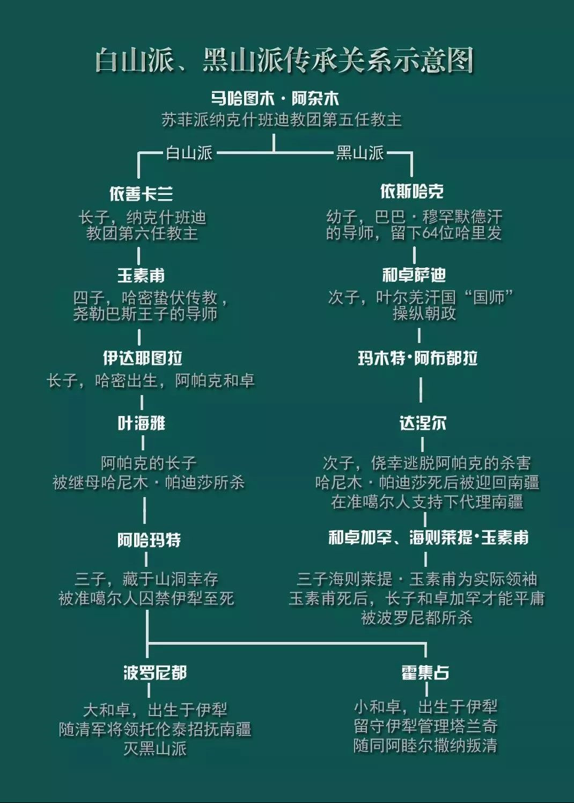
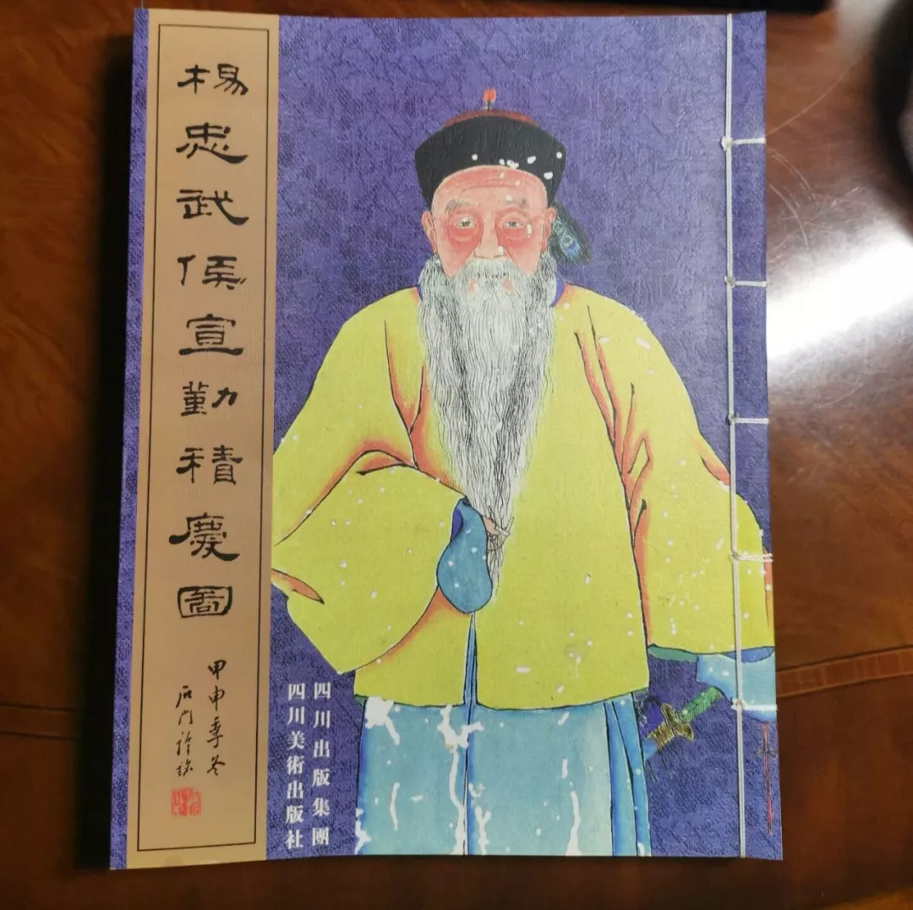
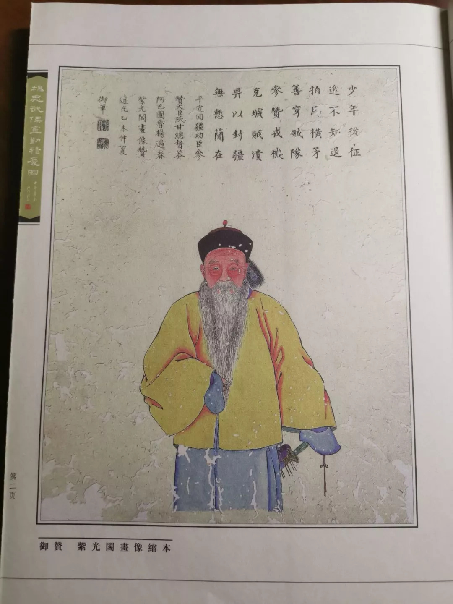
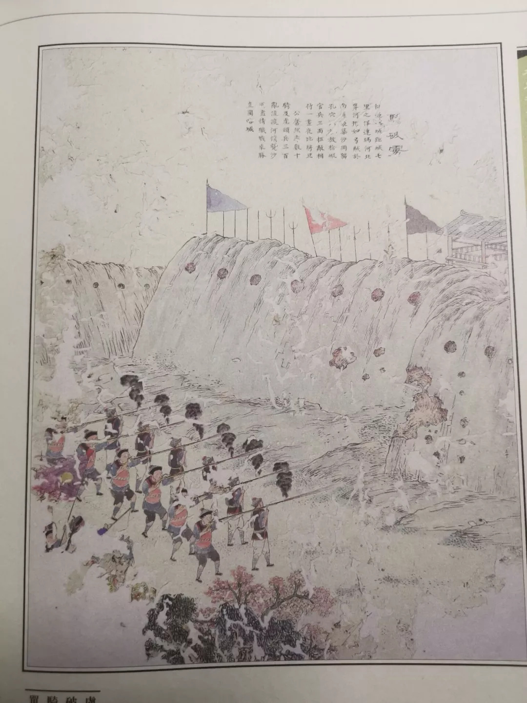
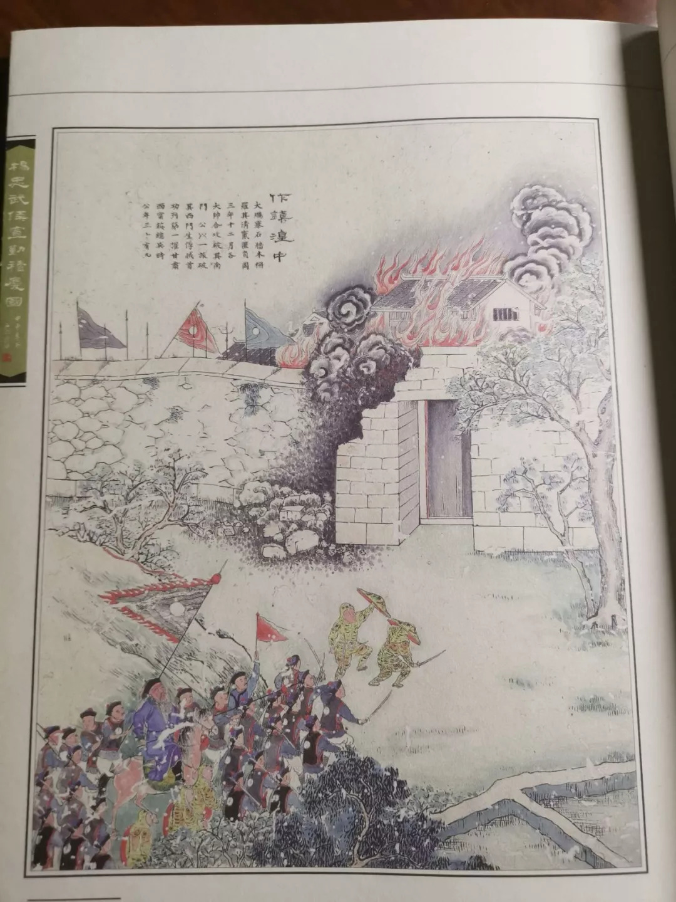
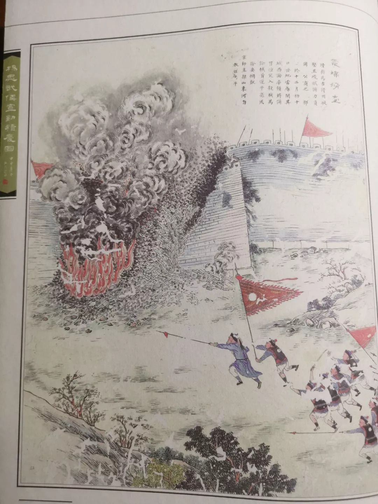
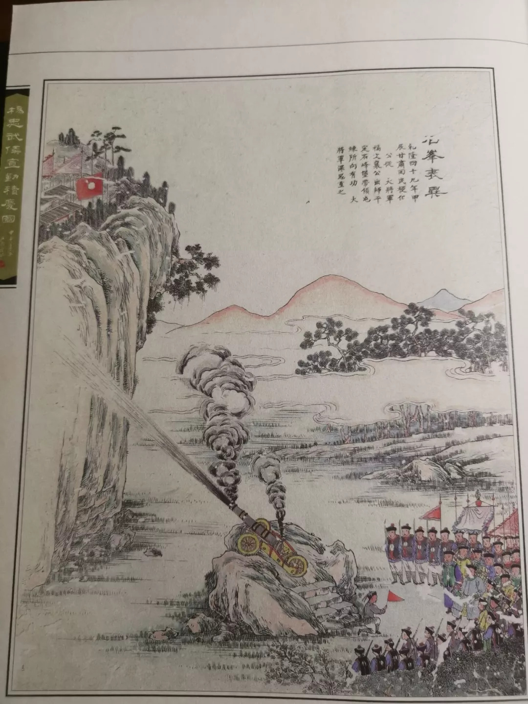
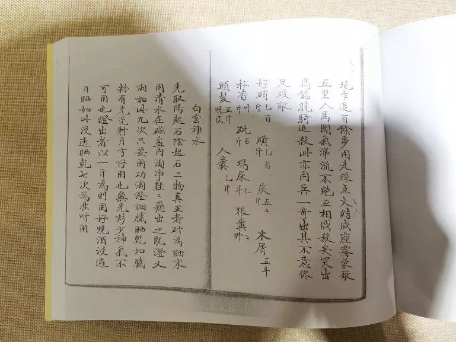

- [晚清沧海事 第二版 下卷](#晚清沧海事-第二版-下卷)
  - [搞乱新疆的那个谎言，究竟说了些什么](#搞乱新疆的那个谎言究竟说了些什么)
  - [神棍，骗子和香妃](#神棍骗子和香妃)
  - [伟大的诗人，六世达赖仓央嘉措为什么非杀不可](#伟大的诗人六世达赖仓央嘉措为什么非杀不可)
  - [为什么极少数的伊斯兰教精英，容易走向极端](#为什么极少数的伊斯兰教精英容易走向极端)
  - [征服新疆（一）千里奇袭](#征服新疆一千里奇袭)
  - [征服新疆（二）孤胆英雄](#征服新疆二孤胆英雄)
  - [征服新疆（三）成事在天](#征服新疆三成事在天)
  - [征服新疆（四）谋事在人](#征服新疆四谋事在人)
  - [征服新疆（五）纵虎归山](#征服新疆五纵虎归山)
  - [征服新疆（六）魔高一尺](#征服新疆六魔高一尺)
  - [征服新疆（七）道高一丈（上）](#征服新疆七道高一丈上)
  - [征服新疆（七）道高一丈（中](#征服新疆七道高一丈中)
  - [征服新疆（七）道高一丈（中2）](#征服新疆七道高一丈中2)
  - [征服新疆（七）道高一丈（下）](#征服新疆七道高一丈下)
  - [治理新疆（一）](#治理新疆一)
  - [治理新疆（二）](#治理新疆二)
  - [治理新疆（三）](#治理新疆三)
  - [治理新疆（四）](#治理新疆四)
  - [治理新疆（五）](#治理新疆五)
  - [治理新疆（六）](#治理新疆六)
  - [治理新疆（七）](#治理新疆七)
  - [治理新疆（八）](#治理新疆八)
  - [治理新疆（九）](#治理新疆九)
  - [治理新疆（十）](#治理新疆十)
  - [治理新疆（十一）](#治理新疆十一)
  - [治理新疆（十二）](#治理新疆十二)
  - [治理新疆（十三）](#治理新疆十三)
  - [治理新疆（十四）](#治理新疆十四)
  - [新疆沦陷（一）](#新疆沦陷一)
  - [新疆沦陷（二）](#新疆沦陷二)
  - [新疆沦陷（三）](#新疆沦陷三)
  - [新疆沦陷（四）](#新疆沦陷四)
  - [新疆沦陷（五）](#新疆沦陷五)
  - [新疆沦陷（六）](#新疆沦陷六)
  - [新疆沦陷（七）](#新疆沦陷七)
  - [新疆沦陷（八）](#新疆沦陷八)
  - [新疆沦陷（九）](#新疆沦陷九)
  - [新疆沦陷（十）](#新疆沦陷十)
  - [新疆沦陷（十一）](#新疆沦陷十一)

# 晚清沧海事 第二版 下卷

作者：罗马主义

## 搞乱新疆的那个谎言，究竟说了些什么

公元1900年左右，就在中国被义和团和八国联军闹得鸡犬不宁的时候，奥斯曼土耳其的苏丹阿普杜勒哈米德二世，突然向中国派来了一个劝说团，要求中国的7000万穆斯林，服从他作为伊斯兰世界最高哈里发的指示，不要参加义和团运动，和西方人对抗。

大清帝国总理衙门的官员，看着这群包着头巾，披着长袍的不速之客，听着他们语无伦次的胡扯八道，全部都一脸的懵逼，心里想着中国那里有那么多穆斯林？这群人会不会是刚从疯人院里跑了出来的家伙？又或者是长途跋涉，发了高烧，所以才开始胡言乱语？

特别是这帮家伙，一上来就神神叨叨的讲什么，他们的奥斯曼苏丹阿卜杜勒哈米德二世，和德国的威廉二世皇帝如何如何的好，所以他凭借自己是哈里发的美名，可以到大清国，来劝说7000万的穆斯林，让他们不要参加义和团运动。

如果这要放在平常，闲着没事，可能大清国的官员们，也要琢磨琢磨，这帮家伙到底是什么意思，但是这个时候，内忧外困，太后和皇帝都跑到西北去了，谁还有心思，听这几个神经病，胡扯八道，于是随便找一个守门的保安，去敷衍了几下，就把这群人打发走了。

这么重要的宣言，居然没有引起大清国的重视，而且被当成了一群疯子，奥斯曼土耳其的苏丹阿卜杜勒哈米德二世觉得很憋屈，他心里想，是不是去的人没有说清楚，或者地位不够高，没有引起对方的重视？

于是，第二年，他又派了一个代表团，这次由一个叫做哈桑.恩威尔（hasen enver）的帕夏亲自带队，大概是一个部长级的官员，又率领一个代表团，在1901年来到了上海。

他们这次来的目的，是为了团结中国的7000万穆斯林，让他们听从奥斯曼土耳其苏丹阿卜杜勒哈米德二世的领导，和全世界的其他穆斯林团结起来。

当然，大清官员还是一如既往的，把他们当成了一群疯子，也没有理他们，所以也就没有记入中方史料。

不过这帮人居然赖在中国不走了，1908年，他们还在北京的牛街清真寺，修了一所学校，叫做哈梅内伊（hamidyei）学院，培养中国的穆斯林，服从奥斯曼土耳其的领导，这座楼今天还留在北京牛街的清真寺内。

后来这个恩维尔帕夏，回国后，居然还建立了一个东方事务局，1914年，为了教育中亚的突厥人，专程派了五个人，从印度进入了中国新疆，向维吾尔人宣传突厥主义，告诉他们，其实维吾尔人不是中国人，而是突厥人，呆了很长一段时间以后，又前往俄罗斯控制的中亚其他附属国，继续宣传这些思想。

听了这些，你有没有一点点震惊？也许有人会问，既然没有被载入史料，你又是怎么知道的呢？我也是在搜集写作资料时，从上海交通大学宋建生先生的硕士论文《土耳其政府的“东突”政策研究》里，才知道了这些骇人听闻的故事。

根据该文的引用，上述事件是被土耳其出版的AliVehbi.SultanAbdulhamit:Siyasi Hatiratim［M］Istanbul:Dergah出版，时间是1999年12月。另外一本是2007年出版的书，名字我打不出来，都是一些奇怪的字母，上面所记载的。

那么这群土耳其人难道是脑袋被驴踢到了，神经不正常才跑到中国来，宣称对中国的7000万穆斯林有统治权吗？

其实不是，他们虽然看起来有点不正常，但是他们所做的事，其实都是预谋已久的。

因为他们相信，一个叫做泛突厥主义的理论，认为世界上所有的突厥人，都和奥斯曼土耳其是一家人，所以才跑到中国来宣示主权。

因为土耳其换个译法，就是突厥的意思，再加上他们都是穆斯林，而土耳其奥斯曼苏丹又是哈里发，伊斯兰世界的最高统治者，所以他们觉得自己，理所当然的，对他们想象中的数量，7000万中国穆斯林有管理权，也就自然而然的有义务，教育其中的突厥人，建立自己的国家，回归奥斯曼苏丹管理。

那么什么又是泛突厥主义呢？它到底在讲些什么？又是怎么诞生的呢？为什么又成了中国新疆，一切动乱的根源呢？

如果我按照专家学者的方式给你讲，估计讲三天三夜你也搞不明白，我自己在看这些书的时候，也是被其中拗口难念的名字，不知所云的古地名，看得直打盹，但是如果我给你举一个例子，你马上就会明白，这是一个什么鬼玩意儿！

我们知道，由于英国殖民了印度很久，所以印度人现在说的都是英语，写的也是英语，对他们来说，英语就是印度语。

假如历史又过了很多年以后，中间因为战乱，很多历史书籍和文化都已经失传，然后英国又挨了一颗原子弹，结果从世界上消失了，以至于大家都忘了它曾经的存在。

然后又过了很多年后，有一天，一个住在印度的阿三，突然惊奇的发现，住在美国，加拿大和澳大利亚的人，和他们讲的都是一样的语言——印度语，于是他立刻想到，哇，这些人会不会也是印度人啊，后来流散到世界各地去的呢？

于是他非常的激动，对比了大家的发音方式和语言结构以后，确定大家500年前都是兄弟，都是阿三。

于是他就创造了一个理论，叫做泛阿三主义，到处去宣传，告诉那些住在美国，加拿大和澳大利亚的人，他们都讲的是同一种语言，印度语，所以他们都是印度阿三的后代，大家来自同一个祖先。

而假如恰好这个时候，这些人因为长期的战乱，文化早就遗失了，一听这个说法，觉得挺有道理，原来我们讲的语言，古代的名字叫做印度语，如果我们不是阿三，那我们怎么会都说的是印度语呢？

特别是一群，世世代代生活在美国东部的人，发现他们自己说的语言，和印度语非常的接近，所以他们就确定，自己肯定是正宗的阿三，从此以后，就开始在美国东部闹独立，要建立一个东印度斯坦国，如果大家不同意，他们就开始搞暴恐活动。

听明白了吗？只要把故事中的英国，换成中国古代的突厥汗国，把英语换成突厥语，把这个虚构故事中的印度换成土耳其，把美国想象成中国，你就搞明白了“泛突厥主义”的原理，也就是东突恐怖分子，四处宣传的东西，以及他们所造成的可怕后果。

如果一下子没有明白，不着急，后面我们还会慢慢的详细介绍。

如果你听明白了，你可能会说，卧槽！这是什么东东？未必也太不靠谱了吧，这么荒唐，会有人信吗？

当然有人信！因为我告诉你的，是剥去了它所有伪装以后的本质，在我之前，从没有一个人，把它的核心依据，如此简单明了的勾画出来。

就连我自己，为了搞清楚这个问题，躺在床上，看那些专家学者写的那些书，流着哈喇子，都睡着了几次，一开始也没有发现这个理论，到底逻辑上哪点不对，甚至越读越觉得，是我们自己不对，活脱脱的就是一个侵略者。

因此，你可以想象，这套理论的麻痹性有多强，所以更不要说非专业人士，特别是新疆的一些普通老百姓，少数民族群众，哪里有能力分辨的清楚？！

那么这个理论，到底是怎么来的，又是怎么发展的，最后为什么又造成了这么大的危害呢？让我来详细的给你一一讲述。

首先，让我先给你讲讲真实的历史，听了这句话，可能就有人会吐槽了，凭什么说，你讲的历史就是真实的呢？

对不起，我这么说是有底气的，因为只有我们的老祖宗特别喜欢记日记，更重要的一点是，除了我们，在古代，特别是中亚草原一带，没有哪个民族，有写史的习惯，所以对古代的研究，唯一可信的来源，只能来自于中国的历史书，其他都是瞎猜，自然也是不靠谱的，所以，我们就从中国历史书上的介绍讲起。

突厥作为中国北方的一个游牧民族，最早被有文字记载的，是在中国的《魏》书里，大概诞生在公元540年左右，在中国南北朝晚期的时候，开始崛起，建立突厥汗国，一度控制了漠北和中亚，在公元745年左右，被唐王朝联合回鹘，就是今天的维吾尔族人的祖先消灭。

就这么简单的一个历史，在中国的历史书上写得清清楚楚，《隋书》，《新唐书》，《旧唐书》，《北史》还有其他一些史料，都有非常详尽的记载，那么它和土耳其人，又是怎么扯上关系了呢？

其实今天的土耳其人，早期的历史是模糊不清的，基本上没有什么可信的史学资料。明朝末年，西方的传教士进入中国以后，发现了大量的古书中关于匈奴和突厥的记载，这引起了他们的兴趣。

这些书被引入西方以后，就兴起了一门学问，叫做《突厥学》，这门学问兴起的原因，是因为当时的奥斯曼帝国，控制着从南欧到中东，一直延伸到北非的大片领土，是西方在东方最主要的敌人。

所以为了打败这个对手，就需要搞清楚他们的历史，这就是《突厥学》兴起的原因，可是这门学问，除了中国史书提供的确切记载以外，剩下的部分，就全靠西方学者脑补了。

当时西方的学者，看到了中国历史中有关匈奴的记载以后，立刻联想到罗马史中提到的匈奴王阿提拉，很可能是从中国来的，因此他们就推测，土耳其会不会也是从中国来的呢？因为土耳其和中国的突厥这两个词，是一个发音，而且也符合他们的价值观，两者都是十恶不赦的坏蛋，所以很可能是从同一个地方来的。

可是虽然有这个想法，但是却没有任何证据可以支持这种说法，因为除了中国史书，其他就没有可信的资料记载。

于是西方学者灵机一动，看看能不能从语言上，去找到土耳其人和中亚人之间的关系，以及进一步推广到和中国边疆的少数民族之间的关系。

于是先后就有法国学者德经，英国学者亚瑟.大卫，波兰人穆斯塔法.杰拉来丁等人，开始了这个工作。

不过这个工作从一开始的时候，研究方法就有问题，法国学者根据中国史书《魏书.西域传》，写出了土耳其的全部历史，但是后半截中国史书都没有记载，而且他又没有其他依据，所以鬼才知道，他是怎么杜撰出来的。

但是对“泛突厥主义”兴起，起至关重要决定的，是英国学者亚瑟大卫的《突厥语法》，这本书在1836年，被他的母亲翻译成了法语，献给了奥斯曼苏丹马哈穆德二世。

这本书的到来，让整个奥斯曼帝国的上层精英们，全部兴奋的像打了鸡血，他们惊奇的发现，原来他们的语言，和中亚的那些少数民族，源自同一个祖先，中国古书中记载的，伟大的突厥汗国，立刻让这帮人，找到了一根救命的稻草。

因为这个时候，奥斯曼帝国正在走下坡路，北非中东的领土，不断的被英国法国蚕食，欧洲的巴尔干地区，也被奥匈帝国节节兼并，在它的北方，更是被俄罗斯打得丢盔卸甲，大片的领土被侵吞，如此的腐败无能，导致它的统治合法性，面临着严重的质疑。所以他们急需找到一个理论，能实现对内团结，对外御敌。

而这本书，让他们看到了这个前景，似乎可以证明，他们和今天中亚的那些穆斯林国家，有一个共同伟大的祖先，他们是这个伟大祖先的直接继承人。

一旦有了这个学说背书，奥斯曼帝国的统治阶层，对内可以用它来振奋民心，对外可以用它来团结中亚的穆斯林国家，一起抵抗俄罗斯的南侵。

而奥斯曼帝国的这个小伎俩，恰恰也符合当时英法两国的地缘政治考量，遏制俄罗斯的发展，肢解大清帝国，扩大在中亚和中国新疆的影响力，于是，他们就对奥斯曼帝国开展的一场大规模的历史伪造运动，不仅仅视而不见，反而推波助澜。

于是大量的土耳其学者，在西方史学界别有用心的配合下，开始了胡编乱造，炮制出了“泛突厥主义”，声称所有的中亚民族，都是突厥人的后代，而奥斯曼土耳其帝国，则是突厥人的杰出代表，天然领袖。

特别是到了奥斯曼帝国的末期，现代土耳其刚刚建立的时候，这种瞎编乱造，更是达到了登峰造极的地步，特别是在现代土耳其建国之父凯末尔的强力参与之下，这套谎言几乎被编得天衣无缝。

他们声称，在几千年前，中亚曾经有一个内海，生活着一大群突厥人的祖先，后来这个内海干涸了，那里的人被迫向四方分散，然后陆续创造出了中华文明，印度文明，希腊文明，阿拉伯文明，因此作为一个土耳其人，或者说是突厥人，是无比伟大的。

其实想怎么吹，都是他们自己的事情，反正吹牛又不上税，自己乐呵就好。可是吹着吹着，他们自己就把它信以为真了，然后就发生了前文所说的事情，他们居然把手伸向了中国。

其实在此之前很多年，这种思想，就被一些宗教人士传入了中国，所以杜文秀才会派他的干儿子刘道衡，去伊斯坦布尔向苏丹效忠，请他派兵支援，不过由于奥斯曼帝国，当时正被俄罗斯打得抱头鼠窜，所以也就不了了之。

不过之后等他们缓过劲来，他们就又想起了刘道衡这件事，忽然发现他们错失了一个大买卖，所以赶紧趁着八国联军侵华的时候，派使团来大清国宣称，他们有资格插手中国“7000万”穆斯林的管理。

他们之所以这么做，其实还有一个原因，阿古柏侵略新疆以后，曾经在1867年，派使团出访了伊斯坦布尔，向奥斯曼帝国苏丹阿普杜勒阿齐兹效忠，奉他们为宗主国，然后被奥斯曼苏丹封为喀什汗国的哈密尔，就是国王的意思，也有一些文献说，这个汗国的名称，叫哲德沙尔汗国。

奥斯曼苏丹还派遣了一支军事顾问团来到新疆，并赠送给侵略者2万支新式步枪，数门德国的克虏伯火炮，并且在当地铸造货币，上面印有奥斯曼帝国苏丹，阿普杜勒阿齐兹的头像，而且派宗教人士，在宗教活动中，向普通穆斯林宣传，要向奥斯曼土耳其苏丹效忠，直接参与了分裂中国的活动。

更可气的是，自此以后，总有一部分土耳其人，对上述的两件事念念不忘，竟然觉得云南和新疆是他们的领土，云南和新疆的信奉伊斯兰教的群众，都是他们的属民，直到今天，每一场新疆动乱的背后，都有泛突厥主义的影子在晃动。

那么，为什么土耳其人编造的突厥主义，纯粹只是一个谎言呢？因为它建立在一个完全不合理的逻辑之上，仅仅只是语言相似，文字相似，而没有其他历史资料作为证据的话，是不能够得出，双方就是同一个民族的结论。

要理解这一点，其实非常的容易，土耳其人声称和新疆的维吾尔人，是同一个民族，理由是他们的语言和文字有50%的意义类似，可是如果按照这个逻辑的话，那么中国人和日本人就是同一个民族了，中文和日文意义相同的文字，比例可能更高，你能说我们双方是同一个民族吗？

而且即使文字语言百分之百的相同，也不能够说明是同一个民族，印度，巴基斯坦，孟加拉都是使用英语，他们和英国人美国人之间有一毛钱的关系吗？

其实在人类历史发展的过程中，一个文明一旦强大起来，它的文化就会被传播到四周。就像中文，曾经是东亚的通用文字，日本，越南，朝鲜，都曾经百分之百的使用中文，但是他们和中国人其实不是一个民族。

同样，英国人建立了日不落帝国，他们的文化自然也就传遍了四方，英语变成了印度人的母语，但是他们和英国人，八杆子也变不成亲戚，非洲西海岸的国家，现在几乎都说法语，你能说他们和法国人是同一个民族吗？

同样，突厥汗国在兴起的过程中，影响遍及整个欧亚草原地带，他们的文化自然而然的，也会被传到了四周，所以有大量的游牧民族说突厥语，用突厥文，那也是自然而然的事情，但以此来证明他们就是同一个民族，显然，在逻辑上就是荒唐的。

而且史书上记载得非常清楚，突厥汗国是在公元745年，已经被唐朝和回鹘联军彻底灭亡了，此后再也没有存在过，这是一个历史事实，现在你非要说回鹘人的后代，维吾尔人也是突厥人，仅仅凭借语言文字相似，这不是瞎扯淡吗？

至于土耳其人，非要把自己附会成突厥人的后代，这就有点儿像，万一有一天英国消亡了，印度人非要说自己是英国人的后裔，和美国人，澳大利亚人，加拿大人，新西兰人，南非人同宗同族，不是一样的荒唐可笑吗？

至于在蒙古出土的什么“阙特勤碑”之类，更是和土耳其人没有一毛钱的关系，不知道他们在那里瞎激动啥，居然捐资修了一个博物馆，而且还做了一个仿制品，在上海世博会的时候特意展出，更是莫名其妙，用心不良。（当然土耳其官方的态度，是反对东突恐怖分子的。）

这块碑确实是用中文和突厥文刻的，讲的是唐朝时候的事情，但是和你土耳其又有什么关系？突厥汗国已经在公元745年被中国灭了，而你们却拿不出，任何值得信赖的历史文献证明，你们是他们的直系后裔，除了语言相似以外。

这就有点儿像，万一有一天英国被灭了，突然出土了一堆英国的档案，是用英语写成的，然后印度阿三就激动得浑身发抖，以为找到他们祖先的东西了，那岂不是滑天下之大稽吗？

可惜令人遗憾的是，在本文发表之前，我还没有看到一篇文章或者书籍，能用普通人看得懂的话，来批驳“泛突厥主义”这个谎言，甚至有很多文章和书籍，包括百度百科在内，都在有意无意的为“泛突厥主义”抬轿子。

而“泛突厥主义”，却是从清末开始，新疆历次叛乱的法理基础，不把它批倒批臭，光靠其他手段，不可能长治久安，只要新疆还有人相信这一套理论，即使一时安定，也不会长久，而且即使你暂时封锁了这套理论，早晚还是会被人传进来的。

所以，国家应该开展一个“新疆史工程”，拿点钱出来，把这段历史研究清楚，要在两个方面下手，一方面是要在学术层面上，彻底论证“泛突厥主义”的荒诞性，从理论上驳倒它。

而且，这件事绝对不能够仅仅自己玩，必须要赞助国际上，那些持相同观点的外国历史学家，让他们也为我们出声呐喊，不能让这方面的研究，全部都由土耳其出钱赞助，最后外部的历史学家，自然而然的，都会替土耳其人说话，那我们即使揭穿了这个谎言，也缺乏公信力。

其次，要改变观点，学术界不要光做一些高大上的学问，还要通过各种媒体，用通俗易懂的语言，特别是少数民族的文字和语言，向群众宣传，证明这一套理论完全站不住脚，即使不能让他们真心相信，也要至少让他们怀疑这一套理论，只有这样，新疆才能长治久安。

当然，这些都不是我这个小老百姓，该操心的事情，我们写这段文字，是为了让我们的读者，了解新疆叛乱的一个背景，“泛突厥主义”是怎么一回事。

有人也许会问了，“泛突厥主义”，是19世纪才开始广泛流传的，虽然和左宗棠面临的对手有关，但是这是唯一原因吗？那么之前发生的叛乱也是这个原因吗？

你还真问到点子上了，影响新疆稳定的，一个是“泛突厥主义”，另一个，则是一个骗子家族，装神弄鬼了几百年，在新疆建立了绝对的宗教权威，他们是整个清代，新疆历次动乱的根源，其恶劣影响，直到今天都还没有被完全消除，我们将在下一章，为大家揭示他们的真实嘴脸。

## 神棍，骗子和香妃

1709年，就在康熙大帝刚刚在北京，参加完圆明园的奠基仪式后不久，当年的6月28日，在地球的另一端，瑞典国王查理二世，正率领2万多瑞典军队，在乌克兰的波尔塔瓦，准备和俄罗斯彼得大帝一世率领的四万五千人，决一雌雄。

那么这件事和我们要讲的新疆有关系吗？当然有，因为我们故事里未来的一位主角，他们也参加了这场战争。那么他们是谁呢？不急，听我慢慢道来。

早上3:45，天还没有亮，战斗就爆发了，一开始的时候，训练有素，全体手持燧发枪，排成线列阵型的的瑞典人占了上风，他们在73门重炮的支援下，从中路和左翼发动了进攻，在排队枪决的比赛中，不断的击溃，部分使用火绳枪，部分使用燧发枪的俄罗斯人。

燧发枪是瑞典人，在1547年发明的，瑞典的古斯塔夫二世皇帝，是世界上第一个，大规模的向部队配发燧发枪的统治者，并率先采用了线式战法。

所谓线式战法，就是士兵分成2到3列横队，全部持燧发枪，排成长长的战线，逼近对方以后，近距离进行连续的齐射。

这种战法，在欧洲30年战争中，（明末清初）把由长矛兵和火绳枪兵组成的西班牙大方阵，打得落花流水，从此以后，成了前膛枪时代，欧洲的标准战术。

而这种战法取胜的关键，一个就是要有先进的燧发枪，这要求这个国家必须有很强的现代工业，能够生产轮簧机构。

另一个，则是要求部队，必须有极强的组织纪律性，能让士兵在经过长期的训练后，在战场上，面对着呼啸而至的子弹，看着两旁的人，不断惨叫着被射倒的同时，依然可以冷静的继续装弹开枪，而决不后退，这要求这个国家，要有很强的组织能力，还要有足够的财力。

这些条件，都只有进入了资本主义时代的欧洲民族国家才拥有，所以，相比于一年前才完成了军事改革，建立了常规志愿军的俄罗斯人来说，久经沙场，训练有素的瑞典兵，明显在战斗初期占了上风。

俄军虽然弱了一点，但是已经和以前的封建时代，完全不同了，毕竟在一年前，彼得大帝一世也建立了由志愿兵组成的，俄罗斯的第一支现代化步兵，和欧洲列强的差距已经减小。

而且他还有人数上的优势，在前锋被打垮以后，他急忙把二万五千名步兵组成的后备队，投入了战斗，依靠工事的掩护，终于挡住了瑞典军的进攻，双方一时成了僵持状态。

这是一场在当时看来，非常现代化的战争，密集的枪声和炮声，盖住了震天的呐喊声和呻吟声，空气中弥漫着刺鼻的火药味，到处都是烟雾弥漫。

战斗持续了六个小时，打到上午10点的时候，彼得大帝发现，在双方不断的来回拉锯中，瑞典的步兵阵线略微有点凌乱，两翼的骑兵也和哥萨克骑兵杀成了一团，露出了空挡。

他敏锐的察觉到，机会来了，于是他决定拿出他的秘密武器，来赢得这场战争的胜利，他向他的一个神秘盟友，下达了命令，让他们立刻出击。

接着，从俄军的背后，突然冲出了数千名骑兵，从左右两翼，向瑞典军侧后迂回。

和常见的欧洲骑兵不同，这些人穿着五花八门的服装，举着乱七八糟的旗帜，飞快的扑向了瑞典军的阵地。

更关键的是，他们用的是弓箭，这是在欧洲战场上，已经很久不见的东西了，这些人骑术娴熟，在马上可以快速的不断射箭。

他们趁着保护瑞典侧翼的骑兵，被哥萨克骑兵吸引开的机会，迅速的抄到了瑞典军的两翼，然后射出密集的箭雨，成排的打倒了纵队中的士兵，瑞典军顿时乱成一团。

然后，这些骑兵乘瑞典军混乱的时候，抽出马刀，举着长矛，从两侧冲入了瑞典军的阵线，把他们冲得七零八落，瑞典军终于全线崩溃。

几天前，瑞典国王查理十二世，在巡视战场时，被俄军狙击手射中，腿部中弹，现在正在远处观战。

本来他对自己的军队信心满满，而且战场上的形势，让他相信自己，已经胜利在握，但是这群骑兵的突然出现，把他给惊呆了。

他惊讶的发现，这些骑兵，好像来自遥远的古代，骑的都是矮小的蒙古马，而且全都是亚洲人的脸庞。

难道是成吉思汗的蒙古骑兵？他猜对了，确实是蒙古土尔扈特部的骑兵，他们作为彼得大帝的盟友，参加了这场战役。

他们突然发动的侧翼进攻，导致了瑞典军最终大败，伤亡过万，被俘数千人，查理12世国王仅仅只带着1500人，被迫逃往了土耳其，五年以后才重返故国。

这场战役让瑞典元气大伤，从此沦落为欧洲的二流国家，而俄罗斯因为扫掉了北方强敌，从此开始迅速的崛起。

有读者可能会问了，我们不是在写新疆吗？怎么又扯到俄罗斯去了？蒙古骑兵怎么会跑到了俄罗斯去，和瑞典人打仗呢？

的确，我们是在写新疆，但是我们要了解新疆，就必须要了解欧亚草原的历史，从中国的甘肃一直到俄罗斯的伏尔加河这一块，到底是一个什么样的生态环境。

这样大的一块地方，纵横几千里，其间有大片的沙漠和草原，还有最大的内陆湖“里海”，无数的游牧民族，在上面来回迁徙。

地理学上，把这块地方称之为欧亚大草原，土耳其和西方的历史学家，把这片地方的东部，称之为突厥斯坦，就是中亚五国和新疆一带，这个名字，现在往往被一些别有用心的人所利用。

我们要说的新疆历史，和生活在欧亚大草原上的游牧民族，有很大的关系。

我们从明末清初说起，再古的历史，我们就不说了，因为有一个法国作家，写了一本书叫做《草原帝国》，洋洋洒洒几十万字，也没把它详细讲完，所以本文只能从简就略，让大家能了解近代新疆发生的所有的事，背后的逻辑。

首先我们要从蒙古人说起，元代的时候，整个欧亚大草原，被成吉思汗分封的四个汗国所占领，新疆属于察合台汗国所拥有。

到了明代，这四个蒙古汗国早就分崩离析，变成了一大堆大大小小的汗国，互相之间，不停的征战，但是这些都和明朝无关，除了明朝初年的几次北伐以外，其他时间，它的势力，从来也没有达到长城以外。

明朝末年，女真人崛起，和蒙古人结盟，但是我们要强调的是，和女真人结盟的，只是很少的一部分蒙古人，也就是我们俗称的漠南蒙古。

一般来说，我们把蒙古人分为漠南蒙古人，就是今天的内蒙古人，漠北蒙古人，就是今天的外蒙古人，还有漠西蒙古人，他们分布在从新疆到整个中亚草原上。

而当时控制新疆的蒙古人，在新疆北部的（就是今天的伊犁，阿尔泰地区，乌鲁木齐，吐鲁番和哈密一带）主要是漠西蒙古。

最强大的一支，叫做准噶尔部，崇祯元年，他们和另外一只漠西蒙古族，也就是我们前面提到的土尔扈特部，发生了冲突。

于是土尔扈特部为了避祸，开始向西长途跋涉，一直来到了伏尔加河，这条河后来被俄罗斯人称之为母亲河，在它旁边建立了一座城市，就是第二次世界大战中，赫赫有名的斯大林格勒。

不过在当时，这里还渺无人烟，于是他们就在这里定居了下来，建立了一个汗国，后来和俄罗斯结盟，参加了俄罗斯对土耳其和瑞典的多次战争。

由于他们信仰的是喇嘛教，所以也被俄罗斯人说服，去帮助俄罗斯人，攻打那些分布在整个中亚草原上，大大小小的其他蒙古汗国，它们是由当年成吉思汗和元朝分封的伊尔汗国，钦察汗国分裂出来的，主要是由已经改信了伊斯兰教的蒙古人组成的。

由此可见，当时的蒙古人，真是一言不合，就远走天涯，一不留神，就从世界的这头，跑到了世界的那头，这种情况，在整个的欧亚草原上，不断的上演。

在新疆的北部，当时还有一只漠西蒙古族，叫做和硕特部，也在准噶尔的压力之下，迁移到了青海，并且为了支持五世达赖喇嘛，一度出兵攻占了西藏。

从此新疆北部，就只剩下了蒙古族的准噶尔部，这几只漠西蒙古族，信奉的都是喇嘛教。

在新疆的南边，就是我们今天所说的喀什地区，和田地区和阿克苏地区，被元代成吉思汗分封的，蒙古人察合台汗国的后裔，建立的一个叫叶尔羌汗国的统治者所占领。

这样看来，整个新疆地区，实际上都是被蒙古人所占领，但是土耳其人和西方人不这么认为，他们说，南疆的叶尔羌汗国，是突厥化了的蒙古人所统治，所以也就变成了突厥人。

这个定义是不是听着有点诡异？他们不仅仅认为，新疆的这些蒙古统治者，现在变成了突厥人，而且中亚的几乎所有蒙古汗国，也都被用了这个定义，最后都成了突厥化的蒙古人，简称为突厥人。

因为土耳其和西方的历史学家认为，这些蒙古人用的文字和突厥文很相像，而且说的话也和突厥语很像，所以证明他们被突厥化了。

但是我们知道，蒙古人之前是没有文字的，成吉思汗建立蒙古汗国的初期，回鹘人塔塔统阿，教他们用回鹘文写蒙古语，而突厥文是由回鹘文发展而来的，所以自然很相像，怎么能用这个理由，来作为这些蒙古人，被突厥化了的证据呢？

这就好像今天印度人都在说英语，难道我们能说他们是英国化的印度人，然后简称英国人吗？

所以这种说法，显然也是站不住脚的，我觉得他们，是为了能把这块广袤的欧亚草原东部，叫做突厥斯坦找理由。

不然的话，上面到处乱窜的都是蒙古人，而且蒙古帝国的影响，远远超过早年的突厥帝国，不叫做蒙古斯坦的话，显然有点说不过去。

不仅仅如此，土耳其和西方的一些历史学家，把突厥化这个词，到处往其他的游牧民族前头乱加，突厥化这个词，在土耳其的推动下，现在被历史学界严重的滥用。
不要以为这是一件小事，这涉及到了谁有资格干涉中亚和新疆的法理问题。

实际上，如果说这些中亚的少数民族，是被伊斯兰化了，我到是完全赞成的，因为这是客观事实，说他们是突厥化了，这完全是瞎编乱造，因为突厥只是一个古代族名，它并不是一种文明。

因为我们如果说，什么是中华文明？什么是欧洲文明？什么是阿拉伯文明？大家都能很清楚的说出它的定义，那就是儒家文化，基督教文化和伊斯兰教文化，而突厥文明又是什么文化呢？其实没有任何人，能说得清楚。

所以，叶尔羌汗国，实际上是一个被伊斯兰化了的蒙古汗国，这个汗国到了明末清初的时候，已经被一股强大的宗教势力所控制，它的名字就叫做“和卓”。

“和卓”这个词，在伊斯兰教的语境里，有一个特殊的指向，就是表示伊斯兰教的创始人，默罕默德的嫡系子孙。

今天你要是去南疆的喀什旅游，大概率都会被导游，拉到一个叫做香妃墓的地方去参观，据说乾隆有一个妃子，美丽异常，体有香味，就叫做香妃，死后被葬在这里。

她可是清宫剧里的常见主角，《还珠格格》《延禧攻略》《如懿传》都有出场，被冠以容妃的名义，据说就埋葬在这里。

不过事实上，导游拉你去的这个浩罕村，香妃墓，其实并不是真正的香妃墓。她的真实葬地，是在河北遵化，清东陵的裕妃园寝。

你所看得到的这个墓园，实际上是“和卓”家族的墓园，叫做阿帕克霍加墓，你看到它今天如此华美壮观，实际上，它是由入侵新疆的浩罕人阿古柏，出资扩建翻修的，所以那个村子，也被叫做了浩罕村。

那么为什么阿古柏要为他出资修墓呢？因为霍加在维吾尔人的眼中，就是一个“和卓”，伊斯兰教创始人默罕默德的嫡系子孙，所以阿古柏为他修墓，就是为了赢得维吾尔人的支持。

那么维吾尔人信奉的这个和卓家族？真的是伊斯兰教的创始人，默罕默德的嫡系子孙吗？乾隆皇帝睡的到底是什么人呢？香妃真的是默罕默德的后代吗？

遗憾的是，现在已经有百分之百的证据证明，这只是一个谎言。考虑到下面一段文字的敏感性，我先一字不加，一字不减的从维基百科中把它拷过来，然后再给大家详细解释。

“伊斯兰教历866年（西历1467年-1462年），玛哈图木·阿杂木出生于中亚费尔干纳盆地北部的柯散（乌兹别克语：Koson，今乌兹别克斯坦Kosonsoy）。其父名为赛叶特·扎拉里丁，祖父为赛叶特·布拉尼丁。据说其祖先是来自麦地那的阿拉伯人。

后世文献记载其为先知穆罕默德之女法蒂玛与哈里发阿里的次子伊玛目侯赛因之后裔。

《西域同文志》及《西域图志》、《和卓传》、《阿帕克和加传》、《大霍加传》载有玛哈图木·阿杂木先人谱系，均溯及什叶派十二伊玛目的第八代伊玛目阿里·本·穆萨。

但是，这些谱系中前八代人（从穆罕默德至第八代伊玛目）与后三代人（玛哈图木·阿杂木及其父、祖父）之间的人名，都是各不相同的。不仅世代数均不相等，每一代人的名字也不同。

美国学者施瓦茨等人认为，这些谱系是后人伪造的，玛哈图木·阿杂木并没有穆罕默德家族血统。若以公历622年作为穆罕默德的年份，以1542年作为玛哈图木·阿杂木的年份，则平均每代人在46岁时才有第一个儿子，即使在现在也是不可能的。”

根据维基百科的这段描述，这个叫玛哈图木.阿杂木的人，并不是伊斯兰教先知默罕默德的后裔。

因为最重要的证据是，一个家庭绝对不可能连续20代，都是老来得子，爷爷46岁的时候才生第一个男孩爸爸，爸爸46岁的时候也才生第一个男孩儿子，儿子46岁的时候生第一个男孩孙子，如果生的早了，年代就对不上，最早也得46岁，考虑到当时的人均寿命不到40岁，如果这样，早就断子绝孙了。

而且维基百科还指出，“晚年的玛哈图木·阿杂木曾在叶尔羌汗拉失德统治时期到过西域的哈实哈儿（今新疆喀什市），娶了蒙古察合台王室女子比比察，生子伊萨克，即圣人伊萨克（一译伊斯哈克·瓦里）。

但同时代的米儿咱·海答儿在《拉失德史》中对玛哈图木·阿杂木只字未提。后来的楚剌思《编年史》也未记载他到过叶尔羌汗国。1542年至1543年间（回历949年），玛哈图木·阿杂木卒于撒马尔罕附近。”

维基百科还有一段关于他家族的历史，“玛哈图木·阿杂木有数位妻子、十三个儿子。第一个妻子生有四男二女，长子为玛木特·额敏。第二个妻子生有二子。第三个妻子即比比察，生有三男二女，长子为伊萨克。

玛哈图木·阿杂木安排其长子玛木特·额敏继承纳克什班迪教团首领之位，其余诸子则往各地传教。

他死后，诸子之间展开对教权的争夺。伊萨克因其母出身叶尔羌王室家族，血统尊贵，成为能与玛木特·额敏抗衡的力量。伊萨克后来离开河中地区，前往其母家乡喀什噶尔传教，成为黑山派之祖。

玛木特·额敏之子玛木特·玉素布也在明代末年来到喀什噶尔，成为白山派之祖。伊萨克与玛木特·玉素布在西域的后裔被称为“和卓”，意为“圣裔”，即先知穆罕默德的子孙，受到当地人的狂热崇信”。

上面的一段文字，那些稀奇古怪的人名和地名，估计要把不了解新疆历史的读者看晕，我来简单的解释一下，其中的内在含义。

新疆的和卓家族，被维吾尔人当作了伊斯兰教创始人，先知穆罕默德的后代，受到了狂热的崇拜。

他们的始祖叫做玛哈图木.阿杂木，根据现代史学家们的研究，并不是先知默罕默德的后代，所以新疆的和卓家族，在这个问题上，欺骗了新疆所有的伊斯兰信教群众。

而且，他是否曾经娶过察合台王室的女儿，也是受到质疑的，因为这样大的一件事儿，同时代的人居然没有记载，显然是非常可疑的。

因此它的后代们，取代蒙古察合台后裔们的王权，是不是具有合法性，看来也是要打上一个问号的。

后来这个家族中的一个和卓，在明末清初的时候，投靠蒙古准噶尔部落的葛尔丹，在他的帮助之下，推翻了叶尔羌汗国的察合台后裔王室，独揽大权，成为了新疆南部的统治者，蒙古准噶尔部的附庸，他的名字就是霍加。

而中亚的浩罕国，将近100年以后，派阿古柏进攻新疆的借口，就是恢复和卓们的王权，所以自然而然的，他要重新翻修我们口中的“香妃墓”，也就是霍加的墓，就是为了表明，他的行动的合法性。

可惜的是，当时的人并不知道，这个“和卓”家族所有的一切，全都是谎言，直到今天，这个家族和他们的后裔，依然是当地的神，清代后面几乎所有的叛乱，都是这个家族所挑起的。

所以写到这里，大家应该很明确的知道了，实际上从宋末元初开始，新疆就一直在蒙古人的手中，在整个明代，虽然和中原的王朝没有什么关系，但是和远在天边的奥斯曼土耳其人，就更没有一分钱的关系了。

但是这种情况，到了清代，被彻底改变，因为清代的皇帝，不仅仅是中原的皇帝，也被漠南蒙古人（就是今天的内蒙古），推举为蒙古大汗，不久之后，青海和外蒙古人以及新疆的蒙古人，也向清廷名义上臣服。

所以，蒙古事务就变成了清朝的内政，解决这些蒙古王公之间的纠纷，就变成了清朝皇帝份内之事，所以清朝的统治权，自然而然的，也就延伸到了新疆。

但是，话虽这么说，但是要实现这个目的，其实是很难的，在清代以前，没有一个王朝，真正实现过这个目的。

因为草原上的游牧部落，信奉的是丛林法则，你够强，你能给我点好处，我就服你，你稍微露出一点疲态，我立刻就撕破脸，要和你拼一下高低。

因为在冷兵器时代，蒙古骑兵毕竟是战力最强大的兵种，即便是在刚刚进入火器时代的欧洲，蒙古骑兵，依然大有用武之地。

就像我们前面提到的，和康熙同时代的俄罗斯彼得大帝，都还需要借助土尔扈特蒙古骑兵的帮助，才能击败强大的瑞典军队。

而且为了感谢土尔扈特部，彼得大帝曾经在1722年，中国的康熙末年，专程在两国边境城镇萨拉托夫，和土尔霍特大汗阿玉奇会面，互诉友好，两国的关系还是平起平坐，可见他对蒙古骑兵的重视和忌惮。

因此，虽然在中国的历朝历代，尤其是汉唐，在他们最强大的时候，都曾经占领过西域，就是今天的新疆和中亚一带，但是都不持久，国家稍有动乱，就立刻全部丢光。

在此之前，没有一个王朝，能实现在草原地区长治久安，即使在元代，忽必烈也从来都没有控制过新疆地区，倒是控制新疆的察合台汗国的海都，频频的向他发起进攻，在忽必烈以后，元代的历代帝王，更是只能望疆兴叹。

清朝入关以后，最初其实也没有能力控制新疆，顺治，康熙和雍正时代，准噶尔蒙古吞并了哈萨克（今天的哈萨克斯坦国大部分），控制了整个新疆以后，就已经开始跃跃欲试，挑战清王朝的权威了。

虽然康熙多次出塞，击败了准噶尔部，落实了对今天蒙古国一带，蒙古族的统治权，但是这种行为，并不是能持久的。

因为像这样的远征，汉朝的卫青，霍去病，唐朝的李靖，明代的永乐皇帝朱棣，都曾经实现过，但是等他们退兵以后，一切都恢复如旧。

而且这种远征，并不是每次都会胜利的，康熙远征青海西藏，就全军覆没过，雍正派岳钟琪远征蒙古准噶尔部，6万大军，只剩了二千人逃了回来。

虽然康熙消灭了准噶尔的首领葛尔丹，可是他的侄子策妄阿拉布坦又卷土重来，这和中国历朝历代，遇到的问题完全相似，你可以击败他们，但是你无法消灭他们。

而且只要他们觉得有危险，就可以立刻躲得远远的，就像土尔扈特部，一下子就跑到了俄罗斯的伏尔加河，你不可能到那儿去追他们吧？等到他们哪天想通了，他们又可以跑回来，找你麻烦。

所以清朝前期的处境，和中国的历代王朝一样，游牧民族带来的威胁，就像打不死的小强一样，你以为你把它踩扁了，过不了几天，不知道又从哪个角落里，重新钻出了一大堆来。

这个问题，一直到乾隆朝才彻底解决，但是根本原因，绝不是像我们通常的历史书上所说的，什么乾隆皇帝运筹帷幄，武功高强。

因为他的爷爷康熙，一样能远出漠北，打败蒙古准噶尔部的葛尔丹，他的父亲雍正派年羹尧，也把青海的蒙古叛军给镇压了。

但是他们打完了仗以后，还得回家，对那些在欧亚草原上，晃来晃去的蒙古骑兵，并没有根本的解决之道。

但是乾隆解决了，因为他遇到了千载难逢的历史良机，再加上他有他爷爷父亲一样的能力，所以他中了大奖。

他是中国历史上，第一个彻底解决了游牧民族问题，真正把新疆纳入中原王朝直接管理的中原皇帝，这是前无古人的。

那么究竟是哪些好运气，让他做到了这一点呢？还有土尔霍特人，后来为什么又回归了新疆和蒙古，到底是什么原因呢？

欲知后事如何，请听下回分解，如果觉得本文可读，请记得点赞和分享，再次感谢大家。

答疑：

上期写完以后，有很多读者发消息问我，中国有7000万穆斯林吗？当然没有，这个数字，是我引用土耳其苏丹猜测的数字，实际上要少很多。

根据我上篇文章提供的资料来源记载，土耳其苏丹阿卜杜勒哈米德二世，他认为中国有7000万穆斯林，可以作为他同西方对抗的工具，向西方展示激进哈里发主义的力量。

另外还有一些朋友问我，突厥灭国以后就没有历史记载了吗？是的，直到又过了几百年以后，才再次有历史记载，一只从伊朗逃往今天的土耳其附近，依附于塞尔柱人建立的罗姆苏丹国，说突厥语的部落，逐渐崛起，经过不断的征战，他们的后代，建立起了后来奥斯曼土耳其帝国。

这个说突厥语的部落，和曾经在中国北方纵横驰骋的突厥帝国有什么关系？是没有任何历史文献记载的，全靠大家推论，怎么推论，就看大家的需要了。

好了，答疑到此。

本文引用的资料：

《清史稿》藩部传六
《皇朝藩部要略》卷九厄鲁特要略一
宫胁淳子著，晓克译：《最后的游牧民族：准噶尔部的兴亡》
《卡尔梅克史评注》伯希和著，耿昇译（北京：中华书局，1994）。
傅恒等，《钦定西域同文志》，台湾商务印书馆影印文渊阁四库全书本
谭其骧等，1974，《中国历史地图集》，北京：中国地图出版社
刘正寅、魏良弢，1998，《西域和卓家族》，北京：中国社会科学出版社
潘向明，2011，《清代新疆和卓后裔叛乱研究》，北京：中国人民大学出版社
穆罕默德·萨迪克·喀什噶里，《和卓传》，陈俊谋、钟美珠译。
G. Adlerfelt, The MilitaryHistory of Charles XII, Kingof Sweden, Written by the Express Order of HisMajesty. London, 3 vols, 1740.
Peter Englund, The Battle ofPoltava: The Birth of theRussian Empire. London, 1992.
Angus Konstam, Poltava 1709,Russia Comes of Age.Osprey Campaign #34. Osprey Publishing, 1994.

## 伟大的诗人，六世达赖仓央嘉措为什么非杀不可

谁，执我之手，敛我半世癫狂；
谁，吻我之眸，遮我半世流离；
谁，抚我之面，慰我半世哀伤；
谁，携我之心，融我半世冰霜；
谁，扶我之肩，驱我一世沉寂；
谁，唤我之心，掩我一生凌轹；
谁，弃我而去，留我一世独殇；

这首诗到底是不是仓央嘉措的原作，现在大家争议很大，但是不管怎么说，文字优美极了。

用多少美人和香草，
才能驯服一颗狂野的心。

这肯定是仓央嘉措的诗句，也是我最喜欢的，但是，我念的时候，会改了两个字，用啤酒替换香草：

“你见，或者不见我，我就在那里，不悲不喜；你念，或者不念我，情就在那里，不来不去……”

太美了，令人浑身起鸡皮疙瘩，不过是不是他的作品，也有争议，但是可以很肯定的说，下面这首诗，绝对是仓央嘉措写的：

“在那东方的山顶，
升起皎洁的明月
年轻姑娘的面容，
渐渐浮现在我的心上

黄昏去会情人，
黎明大雪飞扬，
莫说瞒与不瞒，
脚印已留雪上

守门的狗儿，
你比人还机灵，
别说我黄昏出去，
别说我拂晓才归

人家说我的闲话，
自以为说得不差，
少年的我轻盈步履，
曾走过女店主家

常想活佛面孔
从不展现眼前，
没想情人容颜
时时映在心中。

住在布达拉宫，
我是六世达赖仓央嘉措，
住在山下拉萨，
我是浪子宕桑旺波。”

读毕让人赞不绝口，仿佛齿有余香，作者的才气横溢，令人钦佩。这首诗，我在原翻译的基础上，修改了几个字，念着更通顺一点，但是不影响原意。

1706年，康熙四十五年，六世达赖喇嘛仓央嘉措，望着宁静的青海湖水，看着湖面上纷飞的水鸟，念出了他最后的幻想：

“苍鹭啊，能不能把你白色的翅膀借给我，让我展翅高飞。”

不好意思，最后这句也是我翻译的，我觉得以前的那个翻译，不太准确，也不够优美，所以我改了几个字，但是意思是一样的。

就在他念完了这句诗以后，两个手持着白色哈达，目光阴冷的蒙古兵靠近了他，他知道，他们不是要把哈达献给他，而是为了勒死他的。

仓央嘉措的名字，在藏语里，就是音律之海的意思，如果换在其他年代，他也许会作为一个伟大的诗人，永远被人铭记，但是，他生在了一个错误的时代。

当康熙大帝在外蒙古，击败了准噶尔的噶尔丹的时候，他从俘虏那里得到了一个消息，就是达赖喇嘛五世已死，但是执政的西藏摄政大臣（藏语叫弟巴）桑杰嘉措，密不发丧，居然没有把五世达赖喇嘛的的转世灵童，立为新一代的达赖喇嘛后，康熙勃然大怒，他为什么会生气呢？

这要从蒙古和藏传佛教的关系说起，自从元代的开国皇帝忽必烈，聘请西藏的八思巴活佛，作为元朝的国师以后，藏传佛教就被传入了蒙古诸部落。

不过，一开始的时候，除了蒙古的一些有文化的上层贵族，喜欢佛教中那些深邃的哲理以外，普通的蒙古人，对藏传佛教并不感兴趣。

因为对绝大多数的蒙古人来说，他们信守的生存法则，就是最标准的达尔文主义，适者生存，弱肉强食。

就像成吉思汗说的一样：“人生的最大快乐，就是杀死他的敌人，把他们的妻女拢入怀中。”

所以，对于普通的蒙古人来说，如果一个活佛对他说，假如有人打他的左脸，还让他把右脸也伸给对方打，有人吐他一把唾沫，不生气，也不擦，挂在脸上，等它自己干，你觉得他们会有什么反应？

对于那些怀有成吉思汗一样的梦想，天天指望着，到哪去抢一把的蒙古人来说，只能把你当成一个疯子，可能你还没有伸手打他，他早就琢磨着把你给砍了。

因此，在很长的一段时间里，除了可以娶妻生子的藏传佛教噶举派，勉强可以让蒙古的上层贵族接受以外，其他的，大家实在是没有什么兴趣。

插一句话，现在北京的饭桌酒局上，如果没有那些穿着红衣服，戴着红帽子的喇嘛们，就会被认为档次不够，这些红衣喇嘛，他们就是噶举派。

这种需求，导致原产地之一的四川藏区，产生了一项新的脱贫致富产业，所有的牧民们，只要会念几句经，普通话说的标准，都变成了活佛，飞去了北京，给达官贵人们，去当人生导师了。

每年从北京汇来的巨额款项，极大的推动了当地的经济发展，于是各种活佛速成班，雨后春笋般的迅速出现，这也算是奇事一桩吧。

书归正传，这种情况，一直到了明朝嘉靖年间，才发生了变化。

漠南蒙古的俺答汗击败了漠西蒙古，占领了青海和西北河套一带以后，团团围住了中原，成功的逼迫明朝和蒙古开始通商，结束了蒙古和明朝之间200多年的战争，被明朝封为顺义王。

虽然创造了和平局面，征服了诸多的蒙古部落，但是俺答汗的神经，一刻也不敢放松，他深知蒙古人的生存法则，只要一旦有一天，他开始变老变弱，立刻就有人，会来挑战他的权威。

所以他就想，能不能让其他的蒙古部落，不要一天到晚，老是虎视眈眈的盯着他，让他寝食难安，而是能眼神温柔得像小绵羊一样，全体都进入了佛系，那该多好。

于是，他决定和藏传佛教的黄教结盟，尊藏传佛教格鲁派首领，索南嘉措为达赖喇嘛，达赖，就是蒙古语里大海的意思。

索南嘉措接受了这个头衔以后，又把自己的两代老师，追封为达赖喇嘛，他自己就成了三世达赖喇嘛。

由此可见，达赖喇嘛这个称号，从来都不是来自于宗教权威的，而是世俗政府给予的。

于是俺答汗把他们请进了蒙古，又在呼和浩特建立了城市，然后在周围，广修喇嘛庙，开始设法让蒙古人，从苍狼般的凶猛，变成绵羊般的柔顺。

他的努力终于起到了作用，作为回报，三世达赖喇嘛索南嘉措，说他是成吉思汗的转世，从此以后，再也没有人敢挑战他的权威了，他终于心平气和的躺在床上，高高兴兴的老死了，对于那个时候的蒙古人来说，这可真不容易啊。

有了这个先例，以后的蒙古部落首领们，于是纷纷向俺答汗学习，去找后世的达赖喇嘛们，说说自己是谁的转世，一定要够伟大够光荣，不然就不好意思在江湖上混。

甚至连我们前面提到过的那个土尔扈特部，即使跑到了遥远的伏尔加河，新汗登基以后，也得派一个上万人的使团，带着丰厚的礼物，去拉萨找达赖喇嘛，给自己相个面，说说自己，长得像令狐冲还是岳不群。

当然，要想达赖喇嘛说你好话，送礼是必不可少的，可是你送别人也送，万一你送的不够多，一旦那一天，达赖喇嘛说你不是裘千仞，而是裘千丈，那你可能就有灭顶之灾了。

就比如五世达赖喇嘛和四世班禅，受到了藏巴汗支持的噶举派，就是那些北京高端饭局上的常客，戴着红帽子的僧人排挤，躲到了西藏山南地区，过得很憋屈。因此被他俩就发了一个朋友圈，宣布谁来帮我出口气，我就给他相个好命。

于是，和硕特部的固始汗，立刻跳了出来，千里迢迢的从新疆打到青海，最后一直攻到了拉萨，消灭了所有达赖喇嘛看不惯的人。

然后帮五世达赖喇嘛修了布达拉宫，又给四世班禅找了一块好地方，于是被他俩大大的点了一个赞，立刻就成了当时牛逼轰轰的人物。

这么一来，西藏就落入了固始汗的囊中，他倒是爽了，其他的蒙古王公，也就越来越不放心了，生怕哪天，达赖喇嘛也叫别人来找自己出气。

所以，就有那么一些蒙古部落的首领，干脆直接把自己的儿子送去，给达赖喇嘛当徒弟，早点培养感情。

就像康熙后来的对手，准噶尔的噶尔丹，很小的时候，就被他的父亲，送去给达赖喇嘛当徒弟，为的就是确保自己的后代，能够根红苗正。

所以，后来准噶尔发生内乱以后，噶尔丹经过五世达赖喇嘛的批准，回去夺权，就凭着他是达赖喇嘛徒弟的身份，轻松的获得了众多蒙古人的支持，掌握了漠西蒙古的控制权。

不要说蒙古人了，就连那些信奉伊斯兰教的，号称默罕默德子孙的和卓们，都要向达赖喇嘛低头。

前面我们说到的，那个喀什地区的“和卓”阿克巴霍加，因为斗不过叶尔羌汗国的察合台蒙古王室后裔，也千里迢迢的跑到了拉萨，请达赖喇嘛赏个脸，给准噶尔的噶尔丹写信，帮助他灭了叶尔羌汗国，扶自己上台，成为了准噶尔汗国的附庸。

所以说，谁控制了达赖喇嘛，谁就会在整个蒙古、新疆和中亚地区获得话语权，所以，当康熙听到，五世达赖喇嘛死了十多年，他的私生子，西藏摄政大臣桑结嘉措居然秘不发丧，以达赖五世的名义招摇撞骗，立刻就勃然大怒。

因为五世达赖喇嘛，是一个识时务的人，清朝初定中原以后，他应顺治皇帝的邀请，率领三千人，来北京朝觐，所以康熙相信他，不会干出什么出格的事。

但是五世达赖喇嘛的私生子桑结嘉措，胆敢秘不发丧，显然有所图谋，威胁到了清政府，对整个蒙古地区的控制，特别是已经纳入清朝版图的内蒙古和外蒙古，所以康熙绝对不能容忍。

于是康熙立刻写信给达赖五世的私生子，威胁要御驾亲征来讨伐他，桑结嘉措慌了，赶紧给康熙写信道歉，但是他又耍了一个小诡计，没有和康熙商量，擅自立了一个14岁的，没有背景的农村孩子仓央嘉措，作为达赖喇嘛的转世灵童。

康熙对此虽耿耿于怀，但是也有点有心无力，毕竟远征西藏，不是说说那么简单，而且他必须时刻小心提防，蒙古准噶尔部背后暗算，所以他选择了息事宁人，接受了这个结果。

既然达赖喇嘛这么重要，那么康熙为什么还是选择了接受既成事实？他不怕私生子出妖蛾子吗？

不怕，因为他还有一个盟友，就是在青海的蒙古和硕特部，他们有能力威慑西藏，让私生子和他的小达赖不敢乱来。

1701年，蒙古和硕特部固始汗的孙子，拉藏汗即位，被康熙皇帝，册封为翊法恭顺汗，1703年，他前往西藏，确保蒙古和硕特部，对西藏的控制权，保证达赖喇嘛说出的话，是大清帝国想听到的话。

但是他年轻气盛，一去就和达赖五世的私生子，发生了严重冲突，因为桑杰嘉措也是一个习惯于指手画脚，目中无人，野心勃勃的家伙，他想要独享西藏的控制权，宗教的话语权，两个人水火不容，他们之间的矛盾，越演越烈。

于是桑结嘉措，就想干掉拉藏汗，但是藏兵和蒙古兵之间的军事差距，那就是公鸡和雄鹰之间的差距，实在是十万八千里，当初西藏的阿里地区试图闹独立，建立了拉达克王国，结果被蒙古的和硕特部，只派了2500名骑兵就给灭了，所以桑结嘉措手下的那点藏军，根本就不够拉藏汗手下的蒙古兵塞牙缝。

明的不行，就只有玩阴的了，桑结嘉措居然想出了一个下三滥的手段，给拉藏汗的饭里投毒，这也太没有水准了。

果然，被早有防范的拉藏汗及时发现，后果大家可想而知，桑结嘉措的脑袋搬家了。

于是，拉藏汗向康熙报告了这件事，早就对桑结嘉措，私自拥立六世达赖喇嘛不满的康熙，立刻命令拉藏汗，将六世达赖喇嘛“械送”北京。

这其实是一个暗示，康熙绝对不能容忍一个，不是自己选拔的达赖喇嘛，有朝一日，掌握格鲁派的最高宗教权威，威胁到大清帝国对蒙古的控制。

拉藏汗自然心领神会，于是，杰出的诗人，六世达赖喇嘛仓央嘉措，卷入了一场不属于他的游戏，在青海湖边圆寂了。

“一个人要隐藏多少的秘密，
才能安然的度过一生。”

仓央嘉措一如既往的，念出了他优美的绝句，不过在这个舞台上，他是唯一一个没有秘密的人，他只是一个棋子。

于是，在大清王朝的许可下，拉藏汗另外选立了七世达赖喇嘛，这下，康熙终于可以松了一口气了，但是有人疯了。

准噶尔的策妄阿拉布坦，就是葛尔丹的侄子，现在轮到他睡不着觉了，他绝对不能接受这个结果，因为桑结嘉错是他的政治盟友，现在格鲁派的宗教控制权，落到了大清的手里，这对他来说是一个极大的威胁。

而且这个时候，策妄阿拉布坦风头正劲，他向西征服了哈萨克汗国，向南征服了叶尔羌汗国，向北击败了俄罗斯人，挡住了他们前进的步伐，向东正虎视眈眈的图谋外蒙古，建立了强大的准噶尔汗国，正梦想着再次实现成吉思汗的伟业，恢复昔日的蒙古帝国。

而要完成这个梦想，就必须要有宗教上的配合，才能以此为手段，拉拢利诱清朝王室控制下的蒙古王公，所以他绝不能容忍，清廷控制西藏这个结果。

于是在1717年，他以送回拉藏汗的准格尔妻子和儿子为名，从喀什出兵，秘密翻越了人迹罕至的阿里地区，突然出现在了拉藏汗的面前，打了拉藏汗一个措手不及。

拉藏汗由于淬不及防，来不及调兵，一路被准噶尔的蒙古兵追着打，一直被追到拉萨，围在了布达拉宫里面，最后坚持不下去，突围的时候，被准噶尔的蒙古兵杀死，西藏又落入了准噶尔手中。

这下就又轮到康熙疯了，因为对他来说也是一样，西藏决不能落到准噶尔手里，否则那些已经归附大清的蒙古王公，就会心生异志！

他一刻都不能等，立刻从四川出兵，没想到被准噶尔击败，全军覆没。

但是不管付出多么大的代价，他都必须夺回西藏，1720年，他派出了清宫剧里最著名的人物之一，十四子恂勤王胤禵挂帅亲征，率领清军和和硕特蒙古骑兵，用年羹尧为后应，终于击败了蒙古准噶尔部，夺回了西藏。

不过，这也到了帝国能力的极限了，他也不能把控制新疆和中亚的漠西蒙古怎么样，因为他之前虽然几次击败蒙古准噶尔部，但都是在蒙古境内，靠其他蒙古王公的援手，所以，他还没有能力，把自己的手伸到新疆和中亚。

后来他的儿子，雍正皇帝也做了几次努力，但都是损兵折将，徒劳无功，双方时战时和，笑里藏刀，心怀叵测，但都不能把对方怎么样。

但是当乾隆继位以后，一切却发生了变化，蒙古人突然一下不行了，这是怎么回事呢？

那是因为喇嘛教，把蒙古人给搞垮了。可能你会诧异了，西藏的喇嘛教，为什么会把蒙古人给搞垮了的呢？

我们前面讲过，首先，蒙古人本来是游牧民族，居无定所，一会在东，一会儿在西，要想消灭他们很难，这是他们与众不同之处。

其次，他们当时信仰的是萨满教，搞的是万物崇拜，也不需要修什么庙宇，走到哪儿，想拜天拜地了，杀几头羊，宰几头牛，再点一堆火，就可以开始跳大神了。

所以，没有什么东西是蒙古人需要牵挂的，这就是他们力量的源泉！

可是当他们信了喇嘛教以后，他们开始修庙了，修庙可是非常花钱的，一下把他们的积蓄花光了，而且一旦修好了以后，他们东看看，西看看，总觉得可以把它再装饰得更漂亮一点。

于是，信徒们开始不断的捐钱，越修越气派，越修越豪华，大家就越舍不得离开了。

这样带来了三个严重的后果。

第一，让他们变穷了，因为对于蒙古人来说，游牧生活只是保证他们有口饭吃，要想发财，却要靠四处劫掠。

现在大家一旦出门打仗，老担心自己修的那个庙，窗户关好了没有，门有没有锁，会不会有小偷，总是放心不下，所以越来越不愿意出远门，外出劫掠的机会少了，自然钱也挣不到了。

第二，由于有了庙，所有的蒙古人，生活中的很多事，都要经常找喇嘛商量，请求神明的指示，所以普通牧民游牧的范围，也变的越来越小了，这样就导致他们的草场退化严重，所以生计也日益困难，人口的增长的速度，自然也就放缓了。

与此同时，由于信教，大量的年轻男子都去当了喇嘛，一天到晚吃斋念佛，不仅仅导致他们的兵员减少，而且消磨了他们的意志，让他们从一群凶猛威武的蒙古战士，变成了一堆喋喋不休的唐僧，全部娘化了。

同时，大量的年轻男子去当喇嘛，也导致晚婚晚育，草原上本来出生率就比中原低，这样一来，他们的人口弱势就更加明显。

第三，最后也是最重要的一点，由于喇嘛庙的大量兴建，导致了在寺庙这周围，诞生了大量的集市，于是各地的商人纷纷前来，在带来了商品的同时，也带来了疾病。

而乾隆恰好等到了这个时候，当他出兵进攻准噶尔，收复新疆的时候，蒙古准噶尔部，爆发了大规模的天花，根据魏源和其他清代资料的记载，有40%的蒙古人生痘而死，就是死于天花。

这源本是绝不可能发生的，因为蒙古人是不怕传染病的，这是他们的生活方式决定了的，比如让欧洲死了1/3人口的黑死病，就源自于蒙古。

但是蒙古人确毫发无损，对这个并不是很担心，因为如果按以前的生活方式，大范围的游牧的话，只要不出兵征战，家族之间，一年到头，都很难见一次面，所以即使有传染病暴发，最多也就灭了一个家族，很难传染到整个部落。

可是一旦有了寺庙，事情就不一样了。大家隔三差五的，就来寺庙拜拜，有病了更是拜的勤，然后又在周围的集市转悠一圈，人挨人，人挤人，这样一来，一旦爆发了传染病，一个都跑不掉了。

而蒙古人的卫生水平本来就低，更缺乏相应的危机管理能力，所以一旦爆发疾病，立刻就会造成大规模的死亡。

所以当乾隆进攻准噶尔，收复新疆的时候，他所面临的对手，根本就不堪一击，和他爸爸和爷爷面对的，那些剽悍好战的蒙古人，完全是两种人，因为那个时候喇嘛教的庙宇还很少，所以大部分蒙古人，都还充满了尚武好斗的精神。

实际上让整个蒙古民族退出历史舞台的，一个是喇嘛教，一个是伊斯兰教，在中亚地区的那些被伊斯兰化的蒙古人，突然之间战斗力也不行了，其实也是一样的问题，因为他们要修清真寺。

所以后来乾隆说，一庙胜过10万兵，就是这个道理，光是在他任内，他就拿出自己的私房钱，出资上千万两白银，在蒙古地区广修喇嘛庙，一座比一座修得豪华，你以为他是诚心向佛？其实是不安好心！

不仅仅中国周边的蒙古人不行了，就是远在天边，伏尔加河畔的，同样信奉喇嘛教的蒙古土尔扈特部也不行了，由于生活方式的变化，他们的战斗力也在直线下降，从一开始被俄罗斯人非常倚重，渐渐的变得被他们看不起了。

自然而然的，他们的社会地位也就一落千丈。康熙年间，彼得大帝曾经在两国的边境城市，举行盛大的宴会招待蒙古土尔扈特部的大汗，对他礼遇有加。

可是到了他的孙子时，叶捷卡琳娜二世女皇，居然命令他们上交300名贵族子弟，作为人质到莫斯科，而且开始强迫他们改信东正教，于是他们觉得有点混不下去了，也开始密谋打算东归，重回新疆故土了。

准噶尔汗国的策妄阿拉布坦死后，他的儿子噶尔丹零策继位，在他的统治期间，准噶尔汗国达到了空前的疆域。

除了整个新疆以外，他还占领了哈萨克斯坦，乌兹别克斯坦以及西伯利亚南部的大片领土，面积一度多达500万平方公里。

乾隆十年，噶尔丹零策死了以后，按照草原上的惯例，蒙古准噶尔内部，又开始了一场你死我活的争斗。

之前在策妄阿拉布坦刚死的时候，雍正皇帝曾经想趁机收复新疆，派出了大军，结果被他的儿子噶尔丹零策击败，几乎全军覆没。

这一次，乾隆又得到了一个更好的机会，噶尔丹零策的儿子，女儿，女婿打成了一团，但是由于他爸爸雍正的教训，乾隆还是没有敢贸然出手。

直到有一个人的到来，他就是准噶尔辉特部的的大贵族阿睦尔撒纳，他在内战中，支持另外一个准噶尔贵族达瓦齐登基，但是没有想到这个家伙，翻脸比脱裤子还快，刚给了阿睦尔撒纳一块地方，没过多久他又要收回去。

而阿睦尔撒纳也不是什么好鸟，他嫌达瓦奇给的地方不够多，于是就想要更多的地方，两个人一言不合，立刻就打了起来。

就在他们双方打得你死我活的同时，俄罗斯人也没闲着，派出了大量的间谍，两面做说客，想从中牟利，借机夺取新疆。

最后阿睦尔撒纳战败，面对俄罗斯人的诱惑，再三斟酌以后，他决定投靠大清，请乾隆帮忙出兵，助他夺回准噶尔的控制权。

而乾隆早就在等着这个机会了，只不过他心里打的是另外一个算盘。于是他一口答应，立刻派出5万多八旗，绿营和蒙古骑兵组成的大军，协助阿睦尔撒纳攻打达瓦齐。

达瓦齐率领了6000多骑兵，企图守住一个关键的隘口，可是这个时候的蒙古兵，实在是堕落的不成人样，清军侍卫阿玉锡，率领25个士兵发动了夜袭，居然把6000人给打垮了，这要是成吉思汗在天之灵知道，不知道他会如何的痛心疾首。

达瓦奇兵败逃跑，结果被乌什城（阿克苏附近）的一名当地官员擒获，献给了清廷，被押往了北京，后来被乾隆赦免，养在北京当寓公。

阿睦尔撒纳很高兴，他以为自己得手了，不过接下来，乾隆给了他一个小小的意外，不但没有让他成为准噶尔的汗王，相反，乾隆是要把准噶尔拆分成几块，像内外蒙古那样，纳入清朝政府的直接管理，因为清朝政府的目的，就是要一劳永逸的解决蒙古问题。

于是阿睦尔撒纳愤怒了，有这样耍人的吗？他决心反叛，不过他不知道，这是乾隆给他挖的坑，他就在等着他造反，这样才好名正言顺的拿下整个新疆。

执行这个政策的定北将军班第，没有充分领会乾隆的意思，要考虑到阿睦尔撒纳，很可能会不接受这个安排，发动叛乱，必须高度警惕，随时做好镇压的准备。

但他过于托大，只带了500个士兵，果然不出乾隆的预料，阿睦尔撒纳发动了反叛，结果班第被数万骑兵包围，自杀殉国。

随后清军大军赶到，击溃了阿睦尔撒纳，他逃往了俄国，后来死于天花。

准噶尔部的其他一些贵族，也不愿意接受清朝的直接统治，先后又多次发动了叛乱，但是都被清军轻松的粉碎。

这场战争造成的一个可怕后果是，准噶尔部几十万户中，有40%的人在天花中死亡，有20%的人逃往俄罗斯，剩下30%的人，被乾隆授意清军屠杀殆尽，剩下10%的人被迁往内外蒙古，准噶尔就此被灭族。

1449年，明朝的正统14年，准噶尔人的祖先，也先率领5万蒙古瓦剌骑兵，击败了明军20余万人，俘虏了明朝皇帝朱祁镇，那一刻，他们是何等的辉煌。

可是谁也没有想到，风水轮流转，300年以后，世间再也没有瓦剌人了，蒙古的准噶尔部，就此消失在历史的长河中。

乾隆的这个举动，虽然无比的残酷，但是困扰中原几千年的游牧民族问题，就此彻底结束，新疆第一次被纳入了中原的直接管理。

当然，代价也是惨重的，新疆北部的大片草原，很长一段时间，都变成了无人区。

准噶尔人的迅速消亡，天花是一个决定性的因素，不然他们是可以逃跑的，但是天花的流行，让他们中的绝大多数，甚至都无力逃跑。

这让我想起了西方人占领美洲，成千上万的印第安人，死于枪炮的是微不足道的，死于西方人带来的小小病毒，才是真正的绝大多数，而这一幕，在中国的西部边陲，居然也上演了，天意弄人。

不久之后，住在伏尔加河畔的蒙古土尔扈特人，突然出现在了新疆边境上，他们居然也只剩下了六七万人，他们请求清朝政府收留他们。

这个消息把清朝的官员吓了一跳，他们是怎么突然出现在新疆边上的呢？

原来，1771年（乾隆三十五年）土尔扈特部首领渥巴锡，受不了俄罗斯人的欺压，决定举部东归，他们听说清军击败了准噶尔以后，就想回来占领新疆，东山再起。

于是，土尔扈特人在渥巴锡的率领下，分三路，赶着畜群，携带辎重，浩浩荡荡，踏上了归国的艰苦历程。

渥巴锡原计划，等伏尔加河结冰后启程，但计划为沙俄察觉，于是他决定提前行动。由于河水尚未结冰，伏尔加河西岸一万余户部众，未能东归，后来成为了俄罗斯卡尔梅克人，建立了俄罗斯联邦内的卡尔梅克共和国。

俄国女皇叶卡德琳娜二世，得知了消息以后，立即派出哥萨克骑兵追击，并指使沿途哈萨克人出兵阻击。

一路上，土尔扈特人歼灭了俄国的驻军，以及增援部队，摧毁了俄国的要塞，穿过冰封的乌拉尔河，进入大雪覆盖的哈萨克草原，将追击的俄军远远抛在了后面。

东归途中，土尔扈特人身经百战，同时也损失惨重。今天的哈萨克斯坦境内的奥琴峡谷，是东归必经之路，然而哈萨克骑兵已抢占隘口，渥巴锡定下谋略，自己正面进攻，另派队伍包抄后面，最后全歼对方。

在哈萨克草原上，他们又遭到哈萨克人袭击，激战中牺牲了9000多土尔扈特人，除了战斗损失以外，天花也如影随形的跟着他们，不断的杀死他们的部众，人越来越少。

当他们穿过哈萨克草原、绕过巴尔喀什湖南端，进入当时属于中国境内的哈萨克地界，伊犁将军伊勒图，命令哈萨克人不准渥巴锡他们通过，因为他不知道他们的意图。

无奈之下，渥巴锡转道沙喇伯可，又遭到柯尔克孜人的进攻，不得已北上戈壁，一路艰险无比。

当他们终于到了，已经属于中国的新疆边上的时候，只剩下了不到一半的人还活着，他们已经无力进攻新疆，只能在边界周围徘徊。

清朝的伊犁将军伊勒图，对此非常紧张，游牧民族远道而来，通常不怀好意。

他遣使问其来意，渥巴锡与众部落首领、众喇嘛商议数日后，不得已，称前来归附，并献上其祖所受，明代永乐八年汉文篆书敕封玉印，以示诚意。

清朝内部，为了接不接受他们，发生了一场激烈的辩论，所有的人都知道，他们本来是来打算占领新疆的，只是被沿途的损失，外加天花彻底摧毁。

但是乾隆经过再三思考以后，认为他已经有能力统御蒙古诸部，不怕任何挑战，为了向蒙古诸部展示他的能力，最后他拍板，接受了他们的归附，把他们安置在新疆北部。

乾隆皇帝命令，驻乌什的总理回疆事务参赞大臣舒赫德，前往伊犁安抚土尔扈特部。朝廷同时拨白银二十万两及粮草、牛羊、棉布等赈济土尔扈特部众。

乾隆三十六年（1771年）九月，渥巴锡赴热河避暑山庄，觐见乾隆皇帝，被封为“旧土尔扈特卓里克图汗”。

为了纪念这次伟大的东归，彰显清朝有能力控制了所有的蒙古部落，乾隆下令在承德普陀宗乘之庙，竖起两块石碑，用满、汉、蒙、藏四种文字，铭刻他撰写的《土尔扈特全部归顺记》和《优恤土尔扈特部众记》。

这件事，后来还被排成了电影，叫做《东归英雄传》，内蒙古电影制片厂出品。

至此，清代的领土，达到了中国历朝历代的最高峰，有人以为，元代的领土比清代大，但实质上，忽必烈控制的领土，要比清代少一个新疆，而新疆占中国的1/6，所以小的不是一点点。

乾隆也达到了中国历代皇帝的最高境界，不仅仅统治了中原，而且把中国传统的游牧民族和他们的主要地盘，全部纳入了大清的管辖之下，成为了草原和中原的共主，促成了中华民族的一次大融合。

而且最重要的是，从此以后，游牧民族，再也没有大规模反叛过，这是前无古人的，清代以前以后，再也没有人做到过，不知道未来的中国，有没有机会，超越乾隆所拥有的疆域！

清军在平定准噶尔叛乱中，把被准噶尔人关押起来的两个“和卓”，释放了出来，按理说，这是对他们恩遇有加，但是没有想到的是，他们却恩将仇报，不久之后，他们就煽动了南疆的穆斯林叛乱。

从此以后，围绕着新疆发生的历次战争，都是宗教战争，全部都是内外极端穆斯林，互相勾结发动的叛乱，那么他们为什么会被准噶尔人抓起来呢？为什么又会发动叛乱呢？

## 为什么极少数的伊斯兰教精英，容易走向极端

（首先我要强调一点，我们说的伊斯兰教，是指的古代新疆的伊斯兰教，和今天没有一点关系，即使用了今天的一些时事做比喻，那也只是为了说明，古代的伊斯兰教的一些特点，请大家务必注意这一点。）

极少数的伊斯兰教精英，他们有很多非常乖张的行为，让人难以理解。首先他们害怕和人辩论，如果有人想和他们讨论一下伊斯兰教义，他们立刻就会炸毛，拔出刀来，要和你拼个你死我活。

这是一个很奇怪的现象，不和别人辩论，就无法让别人了解教义，不利于传播推广。而且，其实辩论一下，也无伤大雅，虽然一般人喜欢说，真理越辩越明，但实际上未必，往往是越辨越糊涂。

对于一种宗教来说，该信的人总是会信的，不信的人总是不信，所以无论是佛教还是基督教，都特别喜欢和其他人打嘴仗，因为他们这么做，并不会损失什么，反而可以扩大自己的影响力。

别以为今天科学已经日益昌盛，你能凭借自己的知识，把基督教和佛教批的体无完肤，让他们没有立足之地。

错了！今天的各种宗教，依然活得滋润的很，你看庙子里的香客，依然是人如潮涌，被大家批得最狠的佛教和基督教，反而势力扩张的最猛。

据说光北京的一个朝阳区，就有数千喇嘛被人供养，至于国内的地下基督教教会，外媒保守估计，也有几千万信徒，甚至远远超过了，不准批评，备受照顾的伊斯兰教。

其实你不用奇怪，因为辩论宗教教义的真伪，实在是太空，太玄，像有没有上帝存在？有没有佛陀存在？是一个既不能证真，也不能证伪的话题，扯半天也扯不出一个结果来。

比如，我有一次和一个信教的人辩论，我说世界是宇宙大爆炸创造的，他说宇宙大爆炸是上帝创造的。

我说你瞎扯，我有科学证据证明，宇宙大爆炸是一个自然的物理过程，他说他没有瞎扯，因为恰好是物理规律证明，肯定有上帝，不然的话，宇宙膨胀的速度稍微快一点，或者稍微慢一点，我们的宇宙都不会是现在这样，自然人也就不可能存在。

如果没有一个超自然的上帝调控，这样的宇宙，出现的概率几乎为零，而我们两个之所以能在这里讨论这个问题，全靠上帝的存在。

像他这样的歪歪逻辑，你真的想要辩倒，其实也是很难的，而且很多人会听进去，因此对于基督教或者佛教来说，扯一扯，无非活动一下脸部肌肉，所以他们不在乎，和你一起互喷口水。

如果能把你说服了，他们就增加了一个信徒，赚了，如果不能说服你，无非浪费些口水，反正你本来也不信，他们也不损失什么。

可是你发现没有，极少数的伊斯兰教精英，绝对不会和你争论这些问题，如果你要敢质疑伊斯兰教，无论大事小事，他们唯一的反应，就是喊打喊杀，装成疯子。

但是实际上，这样对他们一点好处也没有，只能让人家把他们当成怪胎，这种举动，你难道不觉得这非常奇怪吗？难道伊斯兰教里，就没有人明白这个道理吗？

还有一点，其他宗教的人，社会地位越高，学识越渊博，财富越多的人，通常会越宽容，反之，伊斯兰教越是上层，就越是极端，最富有的几个伊斯兰教国家，通常也是最盛产极端恐怖分子的地方，你仔细想一想，那些驾飞机撞世贸大厦的家伙，哪一个不是来自沙特？他们一个个生活优越，腰缠万贯，为啥会变得这么极端呢？

其实这些问题，从古至今，都让人想不明白，你想不通，一点儿也不奇怪，乾隆皇帝和刘罗锅和珅一起，一样抠烂了脑壳，也搞不清为什么！

在他治下的盛世里，生活已经是封建时代里，过得最舒坦的日子了，可是穆斯林居然发动了两场惊天动地的大叛乱，而且动机全都非常的无厘头。

在此之前，几乎所有的文献里，都是用无厘头的原因，来解释无厘头的叛乱，古人似乎从来就没有搞清楚过，这帮穆斯林到底是怎么想的！

现在的历史学家，往往也不深思，只会鹦鹉学舌，其实也是一头浆糊。

新疆的大小和卓叛乱，就是一个明显的例证，叛乱的动机和原因是什么？看清代史书的记载，完全是一头雾水。

他们是这样解释这件事的，二个非常聪明狡猾，非常识时务的家伙，虽然皇帝对他们非常好，可是他们却人品不好，忘恩负义，所以就叛乱了。

这个答案，你不觉得在逻辑上，是完全混乱的吗？

前面我们说过，明朝中叶的时候，一个住在今天乌兹别克斯坦的社会闲杂人员，名字叫做玛哈图木.阿杂木，某一日，忽然灵感爆发，自称是伊斯兰教的创始人，默罕默德的嫡系子孙，然后又发明了一套教义，开始四处招摇撞骗。

这家伙谎话连篇，见人就说自己祖上是沙特的土豪，牛逼的不得了，钱多的数都数不清，万一哪一天，他继承了遗产，跟着他混的人，少不了都会有一份好处。

凭借着厚颜无耻外加巧舌如簧，再加上他对伊斯兰教的歪曲改造，把巫术中的跳大神和萨满教中的万物有灵，外加祖先崇拜，全部披上了伊斯兰教的外衣，一下子接了地气，被普通群众喜闻乐见。

自然而然的，这个靠吹牛骗人起家的玛哈图木.阿杂木，也就成了网红，一时被万人追捧，成了中亚地区，伊斯兰教一个支派的开山鼻祖。

在明末清初传入中国的伊斯兰教派，基本上都是这些变了味的伊斯兰教，不论是新教还是老教，都和正统的伊斯兰教有很大的区别。

而玛哈图木.阿杂木的后代子孙们，也以伊斯兰教创始人穆罕默德的子孙自居，继续招摇撞骗，他们被中亚和新疆一带的人，尊称为“和卓”，就是圣人的后裔的意思。

玛哈图木.阿杂木娶了三个老婆,有一个老婆生的小孩，全部都穿黑衣，戴黑帽，举黑旗，念经的时候手舞足蹈，大声嚷嚷，被人称为黑山派，有点像中国内地的新教。

这帮人最早来到了新疆，对新疆南部的统治者，蒙古成吉思汗的后代，叶尔羌汗国的大汗说，他们的祖先，来自沙特，创建了伊斯兰教，所以他们“上面”有人。

这些已经改信了伊斯兰教的蒙古人，一听到这话，立刻对这帮戴黑帽子的家伙，崇拜的五体投地，觉得自己终于和沙特的土豪牵上线了，有门道可以进天堂了，于是马上把这帮人奉为国师。

这种心态，就像今天二三线城市的一些土老肥，遇到了北京来的骗子，那些自称能在中南海杀进杀出，随时和中央领导人勾肩搭背，表现的一样。

他们以为如果能和这帮人搞好关系，从此以后拿工程，要贷款，肯定就易如反掌了，于是马上就好吃好喝的款待这些骗子，甚至还送钱送女人，梦想着自己，从此就可以“通天”了，当然，最后的结果，通常是竹篮打水一场空。

玛哈图木.阿杂木的另外一个老婆，她生的孩子，全都穿白衣，戴白帽，举白旗，小声念经，和内地的老教很类似，被称为白山派。

他们一看到自己的黑山派兄弟，这么容易就把新疆人给忽悠了，被人好吃好喝的供着，于是难免有点眼红，也跑到了新疆南部，想来分一杯羹。

俗话说，同行是冤家，骗子也是一样，虽然都是亲兄弟，可是戴黑帽的这帮人觉得，新疆南部的这些凯子，都是自己辛辛苦苦钓上的，而这些戴白帽子的亲兄弟们，一点贡献也没有，凭什么也要来蹭福利，于是坚决抵制。

由于戴黑帽子的来的早，套又下得深，早就赢得了南疆的蒙古汗王们的信任，所以百般的排挤，后来的戴白帽子的亲兄弟们，让他们没机会揩油水，只能喝西北风。

这样一来，戴白帽子的这帮家伙们想不通了，都是一个老爹生的，大家又都在江湖上混，干的是同一行，怎么能分彼此呢？你们吃肉就算了，连汤都不让我们喝一口，这也太不够义气了。

于是两群骗子就内讧了起来，戴白帽子的这帮人，毕竟念经的时候声音太小，跳大神的时候舞姿也不够夸张，再加上初来乍到，根基不深，斗不过戴黑帽子的兄弟，被挤出了新疆南部（以下我们简称南疆）。

一怒之下，带白帽子的人决定去找外援，于是他们就和我们前面提到的，达赖喇嘛五世的私生子，桑结嘉措搭上了关系，千里迢迢的跑到了拉萨，请他主持公道。

而桑结嘉措这个时候，和蒙古准噶尔的葛尔丹打得很火热，他觉得这是一个机会，可以让自己的盟友蒙古准噶尔部，趁机把手伸到南疆。

于是他就写了一封信，让戴白帽子的家伙，去找准噶尔部的葛尔丹，让他出面摆平。

而准噶尔的噶尔丹，这个时候，正准备挑战康熙对蒙古诸部的控制权，他一看私生子的来信，完全赞同他的想法，于是就安排戴白帽子的家伙里应外合，准备吞并南疆了。

准噶尔骑兵的战斗力当时是很强，一出手就消灭了，控制新疆南部的蒙古叶尔羌汗国，把戴黑帽子的骗子们全部赶走，让带白帽子的骗子来掌控，从此新疆南部，就成为了蒙古准噶尔部的附庸。

这个戴白帽子的家伙，就叫做阿伯克和卓，现在新疆喀什边上的香妃墓，其实就是他的墓，后来他的子孙们不断的造反，依据就是他曾经掌管过南疆。

不过这个政权，从来都不是一个独立的政权，它一直附属于蒙古的准噶尔部，必须向蒙古人交保护费，阿伯克和卓，实际上只是噶尔丹的一个马仔。

噶尔丹后来被康熙击败，服毒自杀，他的侄子策妄阿拉布坦，抢占了他的地盘，重新控制了蒙古准噶尔部。

于是戴黑帽子的骗子们，有样学样，也跑来找策妄阿拉布坦，希望他出面打跑带白帽子的骗子，让戴黑帽子的骗子们回去掌权。

于是准噶尔再次出兵，攻占了整个南疆地区，把戴白帽子的骗子们一网打尽。

但是策妄阿拉布坦对骗子们没有什么好印象，他觉得这帮人最好的去处，应该是监狱，于是他就把戴白帽子和戴黑帽子的骗子全都关了起来，软禁在他自己身边，直接选派南疆的本地部落首领，帮他管理南疆。

这个时候阿伯克和卓已经死了，他的儿子和孙子们，被蒙古人长期羁押，无论是准噶尔汗国的策妄阿拉布坦，还是他的儿子噶尔丹策零在位的时候，都没有一点儿要放他们的意思，眼看着白山派这帮人，就要牢底坐穿，再也没有出头之日了。

岁月如梭，一晃几十年过去了，到了乾隆二十年，清军击败了蒙古准噶尔部，在伊犁附近，遇到了阿伯克和卓的两个孙子，一个叫波罗尼都，一个叫霍集占，他们就是史书中所说的大小和卓。

消息传到了北京，乾隆心想，敌人的敌人就是我的朋友，而且乾隆知道，新疆南部，当时称为回部，是伊斯兰教影响很大的地盘，而这两个人据说是伊斯兰教教祖，穆罕默德的嫡系子孙，在当地很有点粉丝。

于是乾隆就想，既然大家都面对着同一个敌人，要不我干脆放了他们，把他们收为盟友，比以前准格尔的噶尔丹，对他们的爷爷阿伯克和卓还要好，他们一定会念我这份感情，对我忠心耿耿，毕竟都是人嘛，一定会将心比心的。

于是乾隆命令，让大和卓波罗尼都担任南疆的统治者，小和卓霍集占担任伊犁的穆斯林首领，除了战时支援点人力物力，跟着去打下群架，平时不用向中央交税，只需要每隔几年，带点儿礼物，来热河看望我一下就可以了，而且到时候我还会赏他们一大堆钱的。

按说白山派和卓家族，奋斗了这么多年，不就是为了等到这一刻吗？而且清廷开出的这个条件，好的简直出乎想象，就是他们家族最巅峰时，阿伯克和卓都没有享受过的这份待遇。

因为蒙古准噶尔很穷，所以，每年南疆地区必须向他们进贡大量的粮食和白银，负担非常沉重，给葛尔丹交完保护费以后，阿伯克和卓手上也剩不了几个钱，日子过得也是紧巴巴的。

可是乾隆富得流油，他才不在乎你那点小钱呢，不仅仅不问你要，而且每次来热河参拜皇帝的时候，你送一份礼物，皇帝会回赠你1.5倍的赏赐，所以好多蒙古王爷，巴不得年年都去朝拜乾隆。

现在大小和卓，被准噶尔囚禁了这么多年以后，突然被天上掉下的馅饼砸中了，按理说他们应该感激涕零才是吧？可是不，他们居然反了！

所以这就回到我们前面提到的那个问题，为什么伊斯兰教精英的行为，让人这么不可琢磨？他们到底在想什么呢？

要搞清楚这个问题，我们要从伊斯兰教的独特性说起，它和其他宗教最大的不同在于，它的推广方式，主要不是靠传教，而是靠武力征服来实现的。

公元610年，穆罕默德在今天沙特拉伯的麦加发明了伊斯兰教，并开始向周围的人传播，吸引了最初的一批信徒。

但是麦加当时是一个非常发达的商业城市，还存在着其他各种宗教信仰，默罕默德和他发明的伊斯兰教，显然不够高端，无法吸引社会的主流人群，始终处于非常边缘的状态，而且还遭到了嘲笑和排斥。

于是默罕默德决定出走，去一个相对落后的城市麦地那传教，那里的人没有见过世面，脑子比较笨，显然好忽悠的多。

默罕默德在这里花了几年的时间，发展了一大批信徒，建立了一支穆斯林军队，打败了来自麦加的数次侵略，最后他带着这支军队，回到了麦加，在刺刀的胁迫下，当地人才接受了伊斯兰教。

随后，默罕默德开始了对外的征服行动，通过不断的军事胜利，把伊斯兰教逐步传播到四面八方。

所以伊斯兰教的发展史，和其他的宗教有着本质的不同，它实际上是从上向下传播的，而我们知道，其他几乎所有的宗教，都是从下向上传播的。

基督教在它早期的传播过程中，在长达几百年的时间里，一直是处于受压迫受迫害的境遇。

它的传播既不是靠政权推广，也没有刺刀做后盾，只能靠宗教的内容来吸引信徒，而且稍有不慎，就会被人抓起来，送到罗马的斗兽场，喂狮子喂老虎。

所以它不仅仅要有非常吸引人的教义，而且还要习惯于被批评和被质疑，能在一个其他文明占优势的社会里，完全靠自身的魅力，来谋得一席之地。

佛教也是如此，从来没有哪个和尚，是靠把刀架在你的脖子上，逼你去烧香拜佛的，都是因为你觉得他说的对，所以你才会发自内心的愿意信。

中国传统的儒家思想，本质上也是一种宗教，孔老二带着一群弟子，满世界的乱跑，求点赞，求关注，啥背景也没有，完全靠上下两张嘴皮翻飞，最多也就是把口水沾到了听众的身上。

但是反观伊斯兰教，你会发现，在它整个的传播过程中，他们没有经历过这个环节，除了那些非常落后，非常愚昧的地区以外，在其他的地方，它的传播方式都非常的简单粗暴，掌握政权以后，用血和火来推广伊斯兰教。

事实上，中国的新疆南部地区，早期大部分是信仰佛教的，伊斯兰教并不是靠和平的方式，取代佛教的，而是由国家的掌权者，通过数次规模庞大的屠杀佛教僧侣，烧毁佛寺，强迫当地人民改信伊斯兰教的。

不仅仅在新疆是这样，在中亚和其他很多地方也是如此。

印度今天为什么没有佛教？很多人以为是被印度教取代了，其实不是的，也是因为穆斯林侵入了印度北部，建立了伊斯兰王国，他们烧毁佛经，捣毁佛寺，屠杀僧侣，彻底把佛教从印度的土地上抹掉。

所以伊斯兰教的传播，必须要有武力做后盾，如果只是拼内容，拼魅力，伊斯兰教和世界其它几大宗教，完全不在一个层面上。

玛哈图木.阿杂木还有他们的后代，在中亚和新疆传教时，也只是传给那些，被人用刀逼着，早已改信了伊斯兰教的群众，并不是传给其他非穆斯林。

所以这就导致了一个结果，即使今天科学发达到了这个程度，佛教和基督教依然有很强的生命力，而伊斯兰教却很难传到穆斯林以外的人群中。

你不要以为只有北京的达官贵人，疯狂的崇拜来自西藏的喇嘛，其实就是在西方，也有一大群政界和商界精英，都是达赖喇嘛这个分裂分子的脑残粉，把他的每一句话都奉为人生指南，随时都愿意为他解囊相助。

至于基督教，在我国本来已经几乎消亡，可是改革开放以后，再次被传入中国，虽然受到了严格的管控，可是依然得到了快速发展。

特别是那些地下教会，虽然经常被依法取缔，可是效果并不明显，据国外媒体估计，在中国的地下基督徒，目前已经有几千万人之多。

可是无论在东方还是西方，目前伊斯兰教根本就无法靠自身的魅力，来吸引新的信徒，主流社会都把他们当成另类，他们唯一的扩张办法，就是大量的生孩子，来源源不断地补充他们的力量。

如果你了解了这些背景，你再来看极少数的伊斯兰教精英们，他们的一些表现，就会立刻豁然开朗，明白了他们为什么会表现的这么古怪。

为什么伊斯兰教害怕别人质疑他们的教义，不敢和别人辩论，说穿了，无非是因为他们心虚，因为他们没有能力，用和平的方式说服别人。

而且他们知道，他们的教义没有像其他宗教那样，经过了长期的磨练，有着很强的与时俱进的能力，如果一旦暴露在阳光下，他们就会立刻显得脆弱不堪，所以他们只能用最极端的方式，来阻止这种情况的发生。

而且越是伊斯兰教的精英，文化和知识水平越高，越明白他们自己的局限性，知道他们无法和其他的宗教或者意识形态，进行和平竞争，那样他们会输得一塌糊涂。

所以他们必须变得极端，只能靠使用暴力手段，要么征服对手，要么和其他文明之间，画上一条深深的鸿沟，把自己封闭起来，不让其他文明渗入，不然的话，他们就会一败涂地。

因此，为什么本拉登要去搞911，因为他觉得他自己，有拯救伊斯兰教的历史使命，如果他不通过极端手段，把整个穆斯林世界，推到西方世界的对立面去，让双方互相敌视，进而产生隔阂，那么，西方文明，早晚就会凭借自身的优越性，把伊斯兰教吞噬。

同样，那些土生土长的西欧穆斯林，也深知这一点，无论他们的国家对他们多么的好，他们中的极少数精英，也要对本国发动暴恐袭击，也是因为他们深知，他们无法和这些文明竞争，所以他们必须变成另类，和大家隔绝开来。

因此，当我们说了这么多以后，你就可以明白一个道理，对于普通的伊斯兰信众来说，伊斯兰教的这个弱点，和他们没有一分钱的关系，多几个人信，少几个人信，和他们没有什么利益冲突。

因为他们信教主要是为了满足他们自己的宗教感情，或者是文化传承，所以，伊斯兰教本身是没有什么问题的。

可是对于极少数伊斯兰教精英来说，信徒的多少，决定了他们的权利和财富的多少，要尽可能的去增加信徒，最低限度也不能减少信徒，而伊斯兰教的这个弱点，阻碍了他们实现目标，就会把他们逼向极端。

我们再来看看，为什么乾隆皇帝对大小和卓这么好，可是他们却非要反叛不可，就是显而易见的事了。

因为当清朝的势力到达新疆以后，意味着以儒家思想为代表的中华文明，也来到了这里，而这是对他们最大的威胁。

大小和卓作为宗教首领，对他们自身的弱点一清二楚，他们知道在和平竞争的状态下，儒家文明对于伊斯兰文明，有碾压性的优势，他们赖以立身的根本，宗教权威，就会被彻底摧毁。

为什么我们会这么说呢？因为大家要知道，儒家思想从孔子创立开始，一直到汉武帝的时候，才成为官方哲学。

从春秋到西汉，几百年的时间里，儒家思想长期都是非主流，在和其他学说激烈的竞争中，随时都处于受排挤的状态，动不动还被人焚书坑儒。

所以，儒家思想最终能走上历史的舞台，那全靠长期苦练内功外功，特别是嘴皮子功夫的结果。

所以无论是拼魅力拼口才，儒家思想和基督教佛教不相上下，而这一点恰恰是伊斯兰教的软肋，对于少数伊斯兰教精英来说，他们一旦没有了刀，就不知道该怎么说服其他人。

而且，这还是被历史所证明了的，明朝初年，中国信仰伊斯兰教的人非常之多，有学者认为可能达到了10%左右，大家知道朱元璋的手下大将，胡大海，常遇春等等许多人，很可能都是穆斯林，著名的航海家郑和，大部分历史学家认为，他也是一个穆斯林。

明代从来没有限制过伊斯兰教，也没有迫害过穆斯林信徒，基本上是放任自流，但是到了明代中晚期，内地的穆斯林人数，基本上已经少到了可以忽略不计。

所以只要是和平竞争，伊斯兰教是无法和儒家文明抗衡的，而这一点，大小和卓自然也是心知肚明，因此，虽然乾隆皇帝，对他们有救命之恩，又开出了无比优厚的条件，但是他们还是必须反，这就是历史的宿命。

当然，作为骗子家族的成员，这两个人的能力也是非同小可，不但诡计多端，而且军事才能突出，如果不是一个叫兆惠的清军将领横空出世，他们几乎就成功了。

兆惠是中华民族的杰出人物，虽然他的功绩，丝毫不亚于西汉时，北击匈奴的卫青，霍去病，唐朝时，平定西突厥的李靖，但是他却几乎被历史所遗忘。

在整个收复新疆的战役里，最艰难最惊险的，就是平定大小和卓叛乱，从新疆一直打到了阿富汗，其间的惊心动魄，波澜壮阔，绝对让你叹为观止。

可惜的是，建国以后，由于政治观点，民族和宗教等等综合原因，这段历史淡出了人们的视野，所以我们现在能看到的资料，都是简略的不能再简略的寥寥数笔，让人遗憾。

在下面一章里，我将把我收集到的资料，呈现给你，为你拉开这场史诗的序幕，重回到了那个金戈铁马，英雄辈出的年代。

## 征服新疆（一）千里奇袭

在说新疆的故事之前，我要先给你简单的普及一下地理知识，不然你根本就没有办法理解当时的人，做出各种决策的内在原因。

在清代，从内地的最后一个军事重镇酒泉出发，到达新疆的乌鲁木齐的距离，相当于从广州到杭州，北京到西安的距离，都是1200多公里左右。

从乌鲁木齐向西到达伊犁的距离，大体上，和郑州到南京的距离是差不多的，都是七百公里左右。

从乌鲁木齐向南出发，到达喀什的距离，相当于北京到长沙的距离，都是1400多公里。

所以你一定要明白，新疆真的很大，因此在新疆打仗，说起来是在一个省的两个城市之间，听着没多远，但是实际距离，往往相当于内地跨过了几个省。

而且你还要记住一点，新疆可不比内地，沿途都是大片的沙漠戈壁，零零散散的绿洲草原，高入云霄的雪山峻岭，路途艰辛，人烟罕至。

能够获得补给的地方通常寥寥无几，所以，你要是后勤没有做好，或者迷了路，分分钟都可能变成沙漠中的一堆白骨。

明白了这一点，你就能够明白，为什么中国历代的中原王朝，都无法长时间的控制新疆，实在是太遥远了。

康熙的时候，清军曾经从酒泉出发，占领了新疆和甘肃交界的哈密和巴里坤一带，说起来两地是紧挨在一起的，可是距离也相当于从武汉到郑州，有五六百公里远，中间还要穿过沙漠戈壁。

就这一小片地方，到了雍正的时候，清朝都守不下去了，被迫又退回了甘肃境内，把前线重新设在了传统的边关重镇酒泉。

为啥呢？因为原因很简单，如果驻军少了，打不过蒙古准噶尔部，驻军多了，粮食运不上去。

你千万不要以为，两者之间只有六七百公里的距离，你必须要搞清楚的一个事实是，河西走廊也没有富余的粮食，需要从兰州甚至陕西四川调运。

而兰州距离酒泉的距离又是700公里，加起来就是一千四五百公里，即便是从甘肃筹粮，运到新疆距离内地最近的巴里坤前线，也相当于从广州运粮到郑州，穿越四个省的距离。

这在靠人拉肩扛，畜力运输的年代里，需要的人力物力，足以把任何一个强盛的中原王朝拖垮。

按照西汉时的说法，征讨匈奴时，保证前线一个士兵吃饭，后方需要十几个人运粮，每运30担粮食上前线，最后只有一担能到达边关要塞，剩下的都被运粮的人，在来回的路上吃完了。

所以在汉武帝和匈奴开战的几十年里，为了搞钱，几乎想尽了一切办法，不但搞盐铁专卖，建立了最早的国有企业，与民争利，而且还鼓励大家互相揭发，生怕有人偷税漏税，搞得国贫民穷。

汉武帝晚年，国家的GDP几乎被腰斩，经济面临崩溃，汉武帝都被迫写了悔过书。所以占领新疆，古代的时候称为经营西域，那不是一件闹着玩的事儿，稍不小心，就会把国家搞垮。

所以康熙和雍正曾经有一段时间，多次想要去征伐蒙古准噶尔部，可是每次召集户部和兵部的大臣，集中在一起一算账，一算就算出了一笔天文数字，国家财政根本负担不了，所以最后只能作罢。

特别是在雍正在位的时间里，几乎每年都早早的，就作出了详细的进军新疆的方案，等到各地的财政汇总以后，雍正要做的第一件事，就是算算有没有钱，去落实他的计划，可是把账本翻过来翻过去的看了半天，最后总是徒留一声叹息，又只能推到下一年。

千万别以为清朝的皇帝小气，没有雄心壮志，实际上他们都是非常的理智，客观的说，清代是中国历史上，所有当政的皇帝中，唯一一个没有昏君的朝代，虽然能力水平有高有低，但是基本上都是老成持重，忧国忧民的。

而且放弃巴里坤到哈密的前沿阵地，不仅仅雍正皇帝这么做，明朝也是这么做的，都是因为在经济上承担不起，最后考虑再三，退回到嘉峪关的。

除了经济上的原因，从军事上来说，这两个地方也有点鸡肋，从巴里坤出发，还要穿过酷热难耐的吐鲁番盆地，翻越天山山脉，然后才能到达乌鲁木齐，进入蒙古准噶尔部的腹地，才能说得上和对方刀兵相见，全程600公里左右，又是一个郑州到武汉的距离。

所以，本来历史看起来又要轮回了，中原王朝能力的极限，似乎也就是嘉峪关了，大清王朝的造化，也难逃2000多年来，中原王朝的宿命。

可是命运女神，突然打开了一扇门。准噶尔汗国的大汗，噶尔丹策零死后，按照草原民族的惯例，大家为了争夺继承权，又打个你死我活。

前面我们在第三章中讲过，准噶尔大贵族阿睦尔萨那，在和达瓦齐在竞争汗位的过程中失败，投靠了清朝，希望向乾隆借兵，帮他夺得汗位。

而清廷实际上到这个时候，已经放弃了占领新疆的想法，对于这个突然出现的机会，除了乾隆皇帝一个人以外，朝廷上所有的大臣都反对出兵。

为什么会这样呢？原因很简单，没有准备好啊！我们前面说了，怎么样进攻新疆，之前康熙雍正朝，都做过很多次兵棋推演，得出的结论，都是需要准备很久，花很多钱的，基本上办不到，所以，清廷已经对占领新疆，不抱幻想。

现在准噶尔的大贵族阿睦尔萨那一来，乾隆感觉机不可失，就要立刻出兵，但是大臣们集体反对，觉得连准备的时间都没有，风险太大。

最大的问题是没有时间运粮，那么远的距离，没有一年半载的时间，根本来不及准备，这已经是一个共识了，所以大家自然而然的，都不赞同立刻出兵。

说到这里，我们必须承认，乾隆皇帝虽然在大家的印象中，有点儿自大狂的倾向，随时都牛逼轰轰，喜欢自吹自擂，给自己搞了一个什么十全武功，四处炫耀，但是客观的说，他确实有资格这么做。

面对着朝臣们的集体质疑，乾隆对大臣们说，别管以后需要多少粮食，我只问你们，单纯路上吃的粮食够不够？

大臣们听到这个问题有点儿晕，路上吃的粮食当然是够的，可是去了以后吃什么呢？乾隆皇帝说，吃敌人的粮食呀。

所有的大臣一下都急了，皇上啊，使不得呀，这是胡来呀！首先你怎么能保证打得赢敌人？其次，你又怎么能保证敌人不跑，他们可都是游牧民族呀！

万一敌人跑了，几万大军停留在从乌鲁木齐到伊犁的草原上，没吃没喝的怎么办？从兰州运粮到乌鲁木齐和伊犁，相当于从广州运粮到北京，2000多公里的路途，几万大军的口粮，至少需要出动几十万民工，准备上百万人吃的口粮才够。

要组织这么多的民工和这么多的口粮，根本就不是仓促之间可以办得到的，而且就算能办得到，那么远的距离，光是运输时间也得一两个月，等粮食运上去的时候，那几万人早就饿死在那里了。

可是乾隆对这种观点嗤之以鼻，他对大臣们说，你们没有听说过一句古话吗？叫做跑得了和尚跑不了庙，现在蒙古准噶尔人，在那里修了那么多庙，他们舍不得跑，所以一定会留在那里的。

大臣们对乾隆的这个说法，基本上都持怀疑态度，但是也不好和他再争下去。

为了说服乾隆，他们又搬出了另外一个理论，你凭什么说，你百分之百的打得赢蒙古准噶尔骑兵？先不说打败的可能性很大，就是万一打成了平手，战局成了胶着状态，只要稍微拖长一点时间，我军没有后勤补给，立刻就会全军崩溃。

然后他们又开始扳着指头给乾隆算账，从康熙开始一直到现在，清军和准噶尔之间打了很多仗，能打赢的仗，都是在清朝的地盘上。而在准噶尔人的地盘上，全都输得很惨，所以我们不擅长打客场呀！

可是乾隆皇帝一指蒙古准噶尔大贵族阿睦尔萨那，斥责众大臣说，谁说我们是在打客场，我们明明是在打主场，所以一定会胜。

清朝前期，国运真是好的不得了，乾隆皇帝力排众议，抓住了这个难得的历史机遇，后面发生的事，我们在第三章，都已经给大家讲过了，这里就不重复了。

我们要说的是，打赢了蒙古准噶尔实际控制者达瓦齐以后，随之发生的事情。

对于这场战争，乾隆和蒙古准噶尔部大贵族阿睦尔萨那，他们之间的理解是不一样的。

乾隆认为阿睦尔萨那是来归降的，而阿睦尔萨那认为，他是来借援兵的。所以乾隆给阿睦尔萨那封了一个官职，叫做定边左副将，是清朝的一个臣属。

可是阿睦尔萨那，却从来也不肯穿清朝的官服，用清朝的印玺，他认为他是准噶尔汗国汗位的争夺者，只是清朝的一个客人。

等到战争打完，双方的分歧越来越大，乾隆要把准噶尔汗国分成四部，按照内外蒙古的方式进行管理，而阿睦尔萨那，则开始用准噶尔汗国前任大汗的印玺，发号施令，所以双方的冲突变得不可避免。

我们先把这段关系按下不表，我们再来说另外一个人，这个人叫做霍集斯，他在历史上也非常重要。

霍集斯的祖上和古代控制新疆的蒙古察合台王室，有点沾亲带故的关系，也和新疆的和卓家族，也有点远房关系。

霍集斯的家族在南疆乌什阿克苏一带，很有实力，他的父亲以和卓的名义，统治着吐鲁番一带，依附于准噶尔蒙古，位于对抗清朝的最前线。

这里我们要强调一下，“和卓”这个词，在维吾尔语里，不仅仅指的是“圣人后裔”，也代表智者和官员的意思，所以当时很多的新疆地方贵族，名字后面都有一个和卓，但是他们的这个“和卓”的意思，和那个骗子家族的“和卓”意思，是不一样的。

霍集斯家族，是江湖上的老油条，政治嗅觉非常敏感，特别擅长于投机钻营。

康熙五十九年，清军攻到了吐鲁番，周围其他的部落，看见清军势大，纷纷向清朝投降。

可是霍集斯的父亲没有，因为根据他的估计，清军已经是强弩之末了，而且受限于后勤供应，肯定呆不了多久。

于是，他们就坚定的站在蒙古准噶尔一边，后来清军退走，策妄阿拉布坦让霍集斯的父亲，带领蒙古准噶尔军队，重新占领了这片地方，开始对那些投降清军的部落首领搞清算，把他们的属民全部占为己有。

后来，霍集斯的父亲，考虑到这里是双方冲突的前线，居住在这里太危险，而且也怕新属民不服他的统治，于是就把他们，全部迁到了新疆乌什一带，那些人难忘故土，就把乌什也叫做吐鲁番，后来霍集斯的父亲死了以后，霍集斯继承了他的地盘。

（说实话，新疆的地名经常把我搞晕，我要感谢下一位读者，他向我指出，此吐鲁番非彼吐鲁番，而且他学识渊博，告诉我，清军25人夜袭准噶尔6000人的地方，是一座小山，叫做格登山，并不是隘口，并给我发来了图片。

非常遗憾的是，由于消息只能保留五天，他的名字我现在找不到了，除了他以外，还有很多读者，也是非同凡响，给我了很多宝贵的意见，在这里，再次向你们表示感谢。）

准噶尔汗国的统治者噶尔丹策零死后，他的后代们为了争夺汗位，打了个你死我活。等到局势稍一安定，达瓦奇占了上风以后，霍集斯觉得自己要去抱抱佛脚，递个投名状什么的，免得站错了队，以后被人整，于是就赶往了准噶尔汗国的心脏地区——伊犁。

快到伊犁的时候，他看见对面来了一个戴黑帽子的人，正在急匆匆的赶路。靠近了一看，原来是黑山派的和卓后裔玉素普，正在快马加鞭的往南疆赶。

霍集斯心里顿时有点纳闷，因为白山派和黑山派的后裔，在南疆的影响太大，稍有不慎，很容易形成割据势力，所以策妄阿拉布坦，当年把他们全部都软禁在伊犁。

霍集斯急忙上前打个招呼，问问他这是要到哪里去？但是黑山派和卓玉素普，显然没心思跟他多聊，只是对霍集斯说，达瓦齐派他有事办，就匆匆的走了。

霍集斯望着黑山派和卓玉素普远去的身影，满腹狐疑。来到了伊犁以后，新上台的达瓦齐，还宿醉未醒。

好不容易等到达瓦齐酒醒了，没想到还没谈正事，新的一场宴会又开始了，达瓦齐又喝得醉醺醺的了，席间，霍集斯问达瓦齐，为什么放走了黑山派和卓？

达瓦齐早已醉意朦胧，想了半天，才迷迷糊糊的记起，好像昨天喝醉酒的时候，黑山派和卓玉素普对他说，内战打了这么久，难免人心不稳，他可以去南疆，帮助达瓦齐收拾人心。达瓦齐当时喝多了，没有细想，就把他放走了。

霍集斯一听这话，嘴上连夸达瓦奇的决定英明，内心却一下子就把他给看白了，心想这智商，坐在这样的位置上，是保不住这颗人头的。

从此以后，霍集斯知道这个大腿骨质疏松，抱不得了，要另外再找一个大腿抱一抱。

接下来不久，清军在乾隆皇帝的坚持下，迅速出兵，开始征伐蒙古准噶尔部，并在格登山夜袭战中，击溃了达瓦齐。

这个时候达瓦奇终于想明白了，还是应该用蒙古人的老战术，打不赢就跑。说实话，达瓦奇如果跑对了地方，乾隆还是占不住新疆，因为他没带粮草，必须速战速决，拖下去，他就只能撤退。

可是乾隆的运气实在是好到了极点，霍集斯在这个时候，决定要换大腿抱了，他要给乾隆送一个投名状。

于是他就派人去联络达瓦奇，向他表忠心，让他来自己的地盘蓄积力量，图谋反攻。

达瓦齐一看有人雪中送炭，高兴的不得了，也没有细想，就来到了乌什，结果被霍集斯包了饺子，绑送清军大营。

乾隆皇帝听到这个消息，高兴的不得了，终于松了一口气，他的冒险成功了！于是就通知霍集斯明年来北京，我好好的赏赐一下你，给你封个大官做做。

事情到了这里，本来非常圆满，可是接下来，乾隆在处理阿睦尔萨那的问题上，犹犹豫豫，外加上远征军的几个将领办事不力，就把事情给搞砸了。

首先，清军的主力必须撤退，原因我们前面说了，清军来的太急，没有足够的粮草，当地也养活不了这么多人，所以除了留下少量的占领军，大部分人必须退回原地。

其次，有一个蒙古王爷，对乾隆制裁了他的一个亲戚很不满，开始消极抵抗中央，鼓动其他蒙古王公，把中央设在他们那里的驿站都裁撤了，所以，乾隆必须教训一下他。

当然，这些都不是关键，最重要的一点是，乾隆叮嘱前线的将领，务必要把阿睦尔萨那带回热河，这家伙满脑子都在想当蒙古准噶尔的大汗，千万不能放虎归山。

在乾隆看来，我先把你诓回北京来，好吃好喝的把你供着，然后借这个时间差，把准噶尔蒙古分成几块，形成新的利益链条，到时候就算你回去想反，也没有人跟着你了，如果你再敢反，我就顺水推舟的把你灭了。

可是问题是，这事就跟下棋一样，是你出一招，我出一招。乾隆那点儿小心思，阿睦尔萨那也一清二楚，他生怕去了热河，被裹挟着去了北京，他就再也回不到新疆了。

但是当清军主力撤退的时候，他也不敢不跟着走，可是走在半路上，他就开始磨磨蹭蹭的找机会了。

由于事关重大，乾隆皇帝发出第一道命令以后，总是睡不安稳，越想越觉得不妥当，他觉得阿睦尔萨那不可能这么傻，老老实实的来热河，于是他觉得别管什么脸面不脸面了，应该就地围剿阿睦尔萨那。

于是第一封命令发出去没多久，他又马上发出去了第二份命令，让定边将军班第立刻动手，可惜的是，从北京到伊犁太远了，600里加急也要走一个半月，等信到的时候，人早就走了。

由于出发的时候，双方毕竟没有撕破脸，有些话不便明说，再加上其他的清军归心似箭，也未必真正领悟了乾隆的意思，结果双方拉开了距离，给了阿睦尔萨那机会，让他跑了。

而乾隆收到了定边将军班第的回信以后，知道阿睦尔萨那已经出发了，立刻写信给随队的大臣，让他们途中捉拿，可是这一来一去又是三个月，阿睦尔萨那早就跑回新疆了。

这一下，新疆的局势就复杂了，所有的人又开始重新抱大腿。我们前面提到的霍集斯，也开始重新评估局势，生怕站错了队。

不过接下来的局势确实太乱，他也判断不准，连出了几个昏招，差点把自己的小命都送掉。

首先，他派人向阿睦尔萨那表忠心，这事结果被驻扎在伊犁的定边将军班第知道了，上报给乾隆，说他居心叵测。

不过乾隆很大度，觉得这是人之常情，再加上他刚立了大功，立刻处理他，不利于笼络人心。

虽然如此，但是他在乾隆心目中的印象分，还是被大大打了折扣。接着他又干了一件蠢事，招惹了两个他招惹不起的人。

前面我们提到的黑山派和卓后裔玉素普，被达瓦奇放回南疆以后，迅速的夺得了南疆的控制权，当清军进攻新疆的时候，他企图带兵北上，但只是企图而已。

可是霍集斯这个时候耍了点小聪明，一听到这个消息，他有点紧张，因为南疆的兵北上的话，就会经过他的地盘，他怕别人清算他出卖达瓦奇的举动，于是立刻图谋着怎么自保。

他决定玩一个借刀杀人之计，他把目光投向了在清军手中的大小和卓兄弟，他想利用白山派的力量去对付黑山派，于是他就通过定边将军班第，向乾隆建议，让大和卓波罗尼都南下，去招扶南疆各部。

在他看来，大小和卓被关了很久，根基不深，他应该能控制得住，但是他万万没有想到的是，这两个人的能力都远远超过了他。

前面我们说了，清军当时主力在伊犁，距离南疆的政治中心喀什，有2000多公里的路程，相当于从北京到广州的距离，这可不是有点远，而是非常远。

而且清军这个时候，还没有搞定准噶尔各部，哪里有精力去管，千里之外的南疆。于是乾隆心想，这个主意似乎不错，照理来说，敌人的敌人就是我的朋友，如果我对白山派和卓家族好一点，他们应该会感恩戴德，死心塌地的效忠我。

因此，乾隆就接受了霍集斯的建议，派出了少量的部队，再加上霍集斯的人马，帮助大和卓波罗尼都去征服南疆。

但是霍集斯万万没有想到的是，这一下他把魔鬼给放出了笼子，再也收不回去了，为此，他几乎赔上了全族人的性命，所以聪明反被聪明误这句话，从古到今都是真理。

回过头来，我们再来说蒙古准噶尔这边，乾隆已经写信给定边将军班第，让他立刻对阿睦尔萨那动手，虽然阿睦尔萨那已经走了，可是这说明，双方撕破脸已经是不可避免的了，你总得做点防范吧，但是他却跟没事人一样，结果被叛军包围，只能自杀殉国。

乾隆一看到局势转危，立刻征发外蒙古诸部军队，加上策愣率领的八旗和绿营军队，围攻阿睦尔萨那。

可惜的是，策愣这个人非常的不靠谱，一会儿给乾隆说，他已经抓住了阿穆尔萨那，顿时让乾隆喜出望外，赶紧跑到祖庙前烧了一柱高香，感谢了祖宗保佑，又把策愣封为一等公，赏了一大堆东西，开始叫人筹备盛大的献俘仪式。

可是没隔几天，策愣又给乾隆说，不好意思，我可能搞错了，那个人只是长得有点像阿睦尔萨那，真正的阿睦尔萨那跑了，至于跑到哪儿去了？我觉得可能是俄罗斯，也可能是哈萨克，等我想清楚了再告诉你。

遇到这样一个人，乾隆气得口吐白沫，于是他下诏，立刻把他给我抓起来，关在囚车里，押送北京。

不过乾隆并不是因为他谎报军情而恨他，关键是，抓不住阿睦尔萨那，这场战争很可能变成持久战，没有一个中原王朝有能力，在几千公里外的持久战中，打败游牧民族，这才是真正让乾隆抓狂的原因。

和策愣一起被免职的还有玉保，两个清军前线主将，刚刚出了伊犁，还没有走到乌鲁木齐，就遇到了叛乱的蒙古准噶尔骑兵，被人砍成了肉酱。

我们回过头来再说霍集斯这边，在他和清军的保护下，大和卓波罗尼都一路势如破竹，轻松的击败了黑山派和卓玉素普，控制了整个南疆。

大和卓波罗尼都这个人，刚开始的时候，看起来还老实本分，对霍集斯也比较好，他把霍集斯家族中的人，都封成了南疆很多城市的伯克，也就是总管的意思。

可是小和卓霍集占就不一样了，这个人才是真正的厉害角色，他被清廷委任为伊犁穆斯林总管，掌管被蒙古准噶尔部，迁到伊犁种地的大批维吾尔人。

这个人心机深沉，在清廷的定边将军班第，对局势还没有一点警觉，处于云里雾里的时候，他就已经看明白，清朝和准噶尔之间的冲突是不可避免的。

于是他就开始秘密的，把在伊犁附近种地的穆斯林信徒武装起来，建立了一支4000多人的武装，而驻防的清军却对此一无所知。

和大和卓波罗尼都不同，他和清朝官员的接触要多得多，所以对他们的了解也就更深刻一些，随着双方越来越熟悉，他深刻的感觉到，清朝才是他真正的敌人，原因我们在前一篇文章中已经讲了。

所以清政府虽然对他非常的好，不但给他了自由，还对他委以重任，但是他决定还是要跟他从前的敌人，蒙古准噶尔部站到一起去。

他秘密地和阿睦尔萨那搭上了关系，在他们发动叛乱的时候，先站到了他们那一边。然后趁乱带着所有的穆斯林信徒，离开了伊犁，前往南疆。

为了不打草惊蛇，影响他南下夺权的行动，路上，当他听到清军四处调兵，开始进攻阿睦尔萨那的时候，他又假装攻击了一下阿睦尔萨那叛军，让清廷一时也搞不清楚，他到底站在哪边。

小和卓霍集占，虽然一直都被当作人质，软禁在伊犁，可是这个家伙，天生的就是一个玩弄政治的高手。

当他回到南疆以后，毫不留情的屠杀黑山派和察合台后裔，把他们赶尽杀绝。

然后他又玩弄阴谋手段，几下就把霍集斯手里掌握的行政大权，全部揽为己有，反客为主，最初拥有实权的霍集斯，反而被他控制在了手中，不敢乱说乱动。

然后，他开始疯狂的搜刮当地民众，大量的购置军火，制造了数量惊人的火枪和火炮，为他的下一步行动奠定物质基础，而他的这些疯狂举动，竟然没有一个人敢起来反对，可见这个家伙手腕之厉害。

再说北疆这边，由于前面几个将领的无能，最初被清军以迅雷不及掩耳之势，镇住的蒙古准噶尔各部，忽然发现清军也不过如此而已！

而且随着接触的日益增多，他们发现，清军的武器装备也不如他们，这个时候的蒙古准噶尔骑兵，标准的装备是一把腰刀，一只长矛，一杆火绳枪，绝大多数人都已经放弃了弓箭。

而反观清军这边，除了部分八旗军队和绿营军队，是以大炮和火绳枪为主，而从内外蒙古征集来的骑兵，全都还在使用传统的弓箭。

而且清军穿的，主要都是布面甲，就是在衣服里头缝上铁片钢片，外面只能看到一些铆钉，看起来一点儿也不够威风凛凛，而蒙古准噶尔骑兵，稍微有钱一点的，都穿的是镶有片甲的锁子甲，气势夺人。

所以，刚刚投降的蒙古准噶尔各部，甚至包括一些乾隆为了笼络他们，把他们破格升级为汗王的准噶尔贵族，全都不安分了起来，开始蠢蠢欲动。

这也怪不得他们，虽然喇嘛教已经把他们的棱角磨掉了很多，可是在骨子里头，他们还是达尔文主义的坚定信徒，按照草原上的生存法则，只要你稍微露出一点弱相，立刻就会有人来挑战。

而清军这段时间的表现，已经不是什么露出一点弱相，在他们看来，简直就是无能，所以如果不反，简直是对不起天地良心，于是，第二次大规模的叛乱爆发了。

这个时候，清军的前线乱成了一团，一个从来没有指挥过实际作战，叫做兆惠的后勤官员，也被赶鸭子上轿，被命令率领2000人，驻守伊犁。

他刚一到任，所有的准噶尔部落全都叛乱了，离他最近的清军，远在巴里坤，1100公里之外，相当于北京到西安的距离。

而且更悲催的是，这个城市是一个空城，这里距清军的后勤中心酒泉，相距1800多公里，比上海到重庆还远，都快到成都了，除了上次军队带来的粮食，现在早就什么都不剩了，想守也没有办法守。

于是兆惠和手下的人讨论了半天，最后决定撤退。可是这个决定，兆惠是担了风险的，严格意义上说，擅自放弃阵地，是有杀头之罪的。

但是兆惠也没有办法向上级请示，一来一去就是两个月，等到上级批准了，他们早就饿死了，而且这个时候已经10月份了，如果再不走，马上就要下大雪了，到时候想走都走不了。

于是兆惠决定，立刻出发，可是他要走的这段路，长达1000多公里，而且他手下的战马还不足，好多人还得步行。

不仅仅如此，他的粮食就是走这段路，基本上也是不够吃的，而且更重要的是，沿途全是蒙古准噶尔的部落，他就这两千来人，随时都可能会被包了饺子，所以，他能走得出去吗？

兆惠这个人，之所以能做官，全是因为他是官二代的原因，而且他最初的表现，怎么看都是一个平庸之人。

兆惠是雍正老妈的一个娘家亲戚，说起来也算是皇亲国戚，全靠着这层关系，所以最初他在军机处当了一个秘书，不过搞笑的是，兆惠的汉字水平，大概就是念报纸都结结巴巴的样子。

后来大概是觉得军机处没有什么油水，他老爸老妈又把他活动到了刑部去，好让他在那里，吃了原告吃被告。

兆惠对这份工作没有什么热情，再加上他文化水平又不高，而当时的那些刑部案卷，都是那些科班出身的举人进士写的，全是之乎者也的卖弄学问。

兆惠这个文化水平，自然经常看不明白，于是也就稀里糊涂的瞎判乱判，结果被人举报，差点要法办他。

好在后果不严重，又加上他爸他妈能量大，于是又换一个政府单位继续混。如果按照这个节奏继续发展下去，兆惠大概也就是北京城里，众多无能的高干子弟中的一员。

乾隆十三年，大小金川发生叛乱，兆惠这个时候正好在户部混日子，也就是财政部高就。（看来他父母给他找的，全都是有油水的单位）。

结果一不留神，被乾隆指派去前线督办粮运，可是没有想到，这个平常看起来庸庸碌碌的高干子弟，突然一下就闪光了。

他一去前线，立刻就发现了后勤工作中的很多问题，揪出了很多贪污腐败的行为，虽然他语文不好，但是数学特好，随便瞟两眼，就能把一支部队的人数计算的一清二楚，立刻就能发现哪个省的军队，在吃空饷，看来他也是一个偏科严重的家伙。

而且他闲着没事，还喜欢跑到战场上去看看，大家是怎么打仗的，下来还写了一份琅琊榜，把大家的武功高低，排了一个座次，顺便抄了一份送给乾隆。

乾隆一看，顿时眼前一亮，发现这个小伙子挺有创意，从此就开始重用他，让他专职后勤工作，顺便负责打小报告。

这次乾隆出兵新疆，自然而然的，又把前线的后勤工作交给了他，而且还给他增加了一份工作，让他协助处理北路的军务。

虽然兆惠这个时候，表现出了一点小能耐，可是要成为三军统帅，那也是绝对不可能的事情，排在他前面的人多了去了。

可是没有想到的是，自从阿睦尔萨那叛乱开始，清军表现奇差，短短的一年多时间里，两名主将战死，一名投敌，五名主将被免职。

突然之间，兆惠前面没有什么人了，所以他一个后勤官员，居然也被点名派去领兵打仗。

可惜的是，他的第一仗，一点儿也不光彩，居然是怎么逃跑，说的好听一点，叫做撤退。

而且这次逃跑，也没有什么技术含量，由于新疆的地理特点，决定了就那么一条路，没有什么花招好耍。

兆惠刚开始撤退的头几天，还比较顺利，可是他没有想到的是，他刚一出城，就被准噶尔人注意到了，他们一直在后面悄悄的跟着他，之所以没有立即动手，是他们到四面八方去招唤援兵了。

兆惠他们是步骑混合，大家换着骑马，拼了老命，一天要跑100里地都很难，而准噶尔骑兵一人有两三匹马，随随便便一天就跑出个两三百里。

而且跑着跑着，兆惠他们就不敢狂奔了，因为周围的蒙古准噶尔骑兵越聚越多，在他们左右两侧，相距五六百米的地方并肩前行，远远的，不怀好意的望着他们。

所以兆惠他们不仅要跑路，而且还要保持战斗队形，随时防止敌人的突然袭击。

几天以后，他们的队伍周围，聚集的敌人越来越多，一会儿跑到他们前方，一会儿又分散到他们左右，从刚开始的几百人，慢慢变成了上千人。

最后，当他们到达一个叫做鄂垒扎拉图的地方，开始扎营的时候，他们的身边已经聚集了六七千名敌人。

（很抱歉，我没有找到这个地方，但是根据原文推测，应该在伊犁和乌鲁木齐之间。）

当寒风刮起，夜幕降临的时候，兆惠发现，他的士兵一个个都在发抖，不仅仅是因为冷，更多的还是害怕。

连续几天以来，他们白天不仅要赶路，而且还要随时防止敌人的突袭，晚上又要小心敌人劫营，精神随时处于高度紧张之中，一有风吹草动就立刻惊醒，好多人已经很多天，都没有睡过一个好觉了。

兆惠明白，敌人用的是最狠的一招，和他们打心理战，他们晚上和他们一起扎营，白天并行前进，人数越来越多，而且迟迟不动手，经常摆出冲击队形，快马驰向清军，等兆惠下令组成防御阵型，严阵以待的时候，他们忽然又调转马头走了。

有时候他们又拦在路中间，等清军摆成进攻队形，逼近他们以后，他们又让开了大路，搞得清军一惊一乍，这种无形的压力，让很多清军士兵，精神已频临崩溃。

兆惠万万没有想到，他的第一仗，居然是如此的惊险，都没有给他一个适应的机会，而且如果再这样下去，几乎不用敌人动手，他们自己就崩溃了。

天渐渐的暗下来了，看着旁边惊恐的士兵，望着远处黑压压的敌人，兆惠该怎么办呢？

## 征服新疆（二）孤胆英雄

蒙古人虽然在其他方面落后得一塌糊涂，可是在军事方面，却是无人能比，堪称人类有史以来，战斗力最强的民族。

蒙古人的强，并不仅仅因为他们是游牧民族，拥有骑兵优势，而是因为他们把战争艺术，发挥到了极致。

游牧民族，在欧亚大陆上，实在是多如牛毛，可是能像蒙古人这样，把战争变成了一门艺术的，却是仅此一家，别无分号。

从成吉思汗开始，蒙古人把其他游牧民族，甩开一大截的各种军事手段中，最突出的一点，就是心理战。

比如每当蒙古人攻下一座城市以后，在进行残酷屠城的同时，他们也会选出一些人，不仅仅饶了他们的性命，而且还发给他们粮食和马匹，让他们把所看到的一切，传播到四面八方去。

蒙古人通过这种方法，把他们打扮成战无不胜的恶魔，摧毁抵抗者的意志，让他们望风而降，在这方面，没有人比他们玩得更好的。

准噶尔汗国的蒙古人，作为成吉思汗的子孙，自然也把这一套玩的滚瓜烂熟。

我给你举两个例子，你就知道他们是怎么样，仅仅通过心里恐吓，就把对手弄疯的故事。

策妄阿拉布坦和他的儿子掌管准噶尔汗国期间，他们派出使者，要求哈萨克和周围其他的中亚汗国，给他们交保护费。

当时靠蒙古准噶尔汗国最近的，是哈萨克汗国，他们是由游牧和定居两部分组成的，军事实力也很强。

他们一听到准噶尔人的要求，立刻就笑了，心想，你以为你提了一把西瓜刀，不穿上衣，纹了两条青龙，就可以装黑社会呀，我们也有游牧部落，谁怕谁呀，不服咱们打一仗。

如果硬打，准噶尔人也不一定就打得过哈萨克人，到时候谁给谁交保护费，还真是说不清楚。

可是准噶尔人得了老祖宗成吉思汗的真传，脑子可是灵活得多，他们知道自己虽然没穿上衣，纹了两条青龙，可是万一西瓜刀没耍好，掉在地上，被别人抢去了，那后果可就难说了。

于是他们就把一柄西瓜刀舞得风生水起，一边炸炸呼呼的，好像马上就要冲了上来，可是就是原地不动，只是让哈萨克人看着非常紧张。

当哈萨克人集中了所有的部队，准备和他们一较高下的时候，他们却跑去骚扰哈萨克的定居部分，不停的放火烧人家的庄稼，抢掠他们的村庄。

当哈萨克人气急败坏，卯足了劲要和他们拼命的时候，他们却溜之大吉，等到哈萨克人刚刚退走，他们又不知从哪里冒了出来，继续去烧人家的庄稼，抢人家的牛羊。

而且他们还给哈萨克人的大汗，丢了一句狠话，你要是不给老子交保护费，老子每年都来烧你的庄稼，抢你的牛羊，从你抢到你儿子，从你儿子抢到你孙子，世世代代都抢下去，一直抢到哪天你服软，向老子交保护费为止。

就这么连续折腾了好多年，哈萨克人要和准噶尔人拼命，总是找不到人决战，可是刚想回家喘口气，他们又跑来折腾你，时间久了，哈萨克人直接被弄得精神崩溃，被迫向准噶尔人低头，乖乖的交保护费。

所以，蒙古人的经验告诉我们，有志于当黑社会的同志们，重在要学会恐吓骚扰，精神折磨，不要轻易的和人对砍，万一一不留神，刀掉了，被别人砍了，那你就冤大了，而且如果你真把别人砍了，公安机关也不会放过你，所以，当黑社会也是一门学问。

凭借着欺哄唬诈，精神摧残这个绝招，蒙古准噶尔人，几乎没有打什么硬仗，在80多年的时间里，把中亚一带的伊斯兰汗国，收拾的服服帖帖。

不仅仅在战略上，他们擅长用精神战这一招，而且在战术上，他们也用的炉火纯青，特别是，在他们对付俄罗斯人的时候。

俄罗斯人从16世纪开始，不断的把远征军派往中亚地区，而且开始，在哈萨克境内修建要塞，侵犯了准噶尔汗国的利益。

蒙古准噶尔人和俄罗斯人交了一下手以后，发现北极熊不是好对付的，牙尖爪利，硬碰硬的占不着便宜。

于是，他们又用起了精神战这一招，来对付俄罗斯人，他们想，你修了要塞，不可能老宅在里头不出来吧，于是，他们就派少量的骑兵，在要塞外面盯着。

俄罗斯人从大老远来到这里，目的也是要和附近的部落搭上关系，争取双方之间做点生意，同时说服他们投靠莫斯科，如果嘴上不行，那就用刺刀来解决。

于是，他们也得经常从要塞里出来，到处去转一转，看看周围有什么油水好捞，每次他们一出门，准噶尔人立刻把他们吊上，同时通知远处的同伴，向这里集结。

一般俄罗斯人刚出门的时候，通常周围连一个准噶尔人的影子都看不见，等他们出门几天以后，周围的准噶尔人就会越聚越多。

但是他们却不动手，就是远远的跟着俄罗斯人走，给俄罗斯人造成心理压力。等到他们的人越聚越多以后，他们就开始不停的玩假冲锋，假包围，假偷袭，把俄罗斯人搞的一惊一乍的，精神紧张。

而且这样一来，俄罗斯人就无法正常行军了，你刚刚一拔营，他们就呼啸着从四面八方冲了过来，你赶紧原地结成防御阵型，他们又忽然停了下来，在你周围转来转去，搞得你是走也不好，守也不好。

等到双方相持累了，你准备埋锅造饭的时候，刚刚把水煮开，他们又忽然冲了过来，你刚刚拿起枪准备和他们去打吧，对不起，他们又走了，你回去一看，饭全都煮糊了。

但是你要真敢不理他们，不做回应，他们就会真的冲上来，一阵箭雨，把你的人射成刺猬，等你准备反击的时候，他们又全都跑了。

而且这样还带来一个结果，本来一天可以行军100里的，现在连十里都走不了，这样，你原计划来回三天的路程，带了五天的干粮，可能现在十天了，都还原地踏步，消耗完了干粮，逼着你杀马吃，这样你就更跑不掉。

连续每天24小时的高度精神紧张，吃不好饭，睡不好觉，人是扛不住的，很快就会精神崩溃，做出错误决定，通常是丢弃辎重，不顾一切的开跑。

可是你怎么跑得过蒙古骑兵？他们一人有几匹马，瞬间就把你追上了，而这个时候，部队早已完全丧失了抵抗意志，自然不堪一击，都做了准噶尔人的刀下鬼。

这样多搞几次以后，俄罗斯人就不敢出门了，哪怕即使要塞外面看着，好像一个准噶尔人都没有，大家还是害怕，一出去又被他们围了，然后折磨到精神崩溃，被他们砍成肉酱。

面对着准噶尔人的心理战，俄罗斯人实在是无可奈何，坚持不下去了，只好向准噶尔人求和，撤军了事，很长一段时间，都不敢再来招惹蒙古准噶尔人，他们修的要塞也被准噶尔人拆了。

现在，他们要用同样的战术收拾兆惠，叛乱的准噶尔贵族，嗒什策凌第一个带领本部的人马赶到，已经骚扰了兆惠好几天了，现在他的部属也陆陆续续到齐，已经有六七千人了。

而且另外两个准噶尔贵族，噶尔藏多尔集，扎那噶尔布，各自率领了几千人，也马上就要到了。

嗒什策凌根据他以往的经验估计，清军已经快撑不住了，最多再要一两天，兆惠就会精神崩溃，丢下步兵，落荒而逃，到时候他就可以把他们一网打尽。

天渐渐黑了下来，嗒什策凌瞟了一眼清军营地，发现对面鸦雀无声，他得意的笑了笑，这时他觉得自己，就像一只凶猛的老猫，看着爪子下瑟瑟发抖的老鼠，感觉美妙极了。

他决定睡一个好觉，明天继续玩弄他的猎物。

但是，他犯了一个错误，这个错误不仅毁掉了他，也毁掉了整个蒙古准噶尔部落，如果他面对的是一个普通清军将领，他的判断完全没有错，而他面对的，却是兆惠，一个可以和卫青霍去病并驾齐驱的军事奇才。

这天晚上，有几个将领悄悄的跑来找兆惠说，大人，马上就要断粮了！如果我们再这样慢腾腾的走下去，一个人都不要想活下来，不如抛弃步兵和所有的辎重，集中所有的骑兵，立刻连夜突围，向乌鲁木齐疾驰，也许还有一丝生路。

兆惠没有理他们，只是不做声的看着远处的敌军，然后又看了看天空，这天晚上阴云密布，没有一丝星光。

几个将领觉得兆惠可能是文官出身，又没有实际打过仗，心肠有点软，狠不下心来，丢弃兄弟们。

于是又劝他说：“大人，这是战场，生死有命，富贵在天，容不得菩萨心肠，再说，能救几个算几个，总比全死在这里好，哪怕只有几个人回去，皇上也能理解的，一定不会怪罪你的”。

没想到兆惠听了这话以后，笑了起来，回过头来对众人说：“谁说只有几个能回去？我们全都能回去。”

几个将领听见兆惠说的话以后，面面相觑，以为他是不是这几天精神太紧张，被敌人搞疯了。

兆惠接着说道：“不是我心软，其实就算我们丢下步兵，也跑不过蒙古准噶尔人，现在还有上千里地才能到巴里坤，一定会被敌人追上，到时候还是会被他们杀个精光，现在唯一的出路，就是消灭他们。”

几个将领听了兆惠的话，有点出乎意料，不过却不以为然，心想，敌人是我们的三四倍，明天，我们怎么可能打得过他们。

兆惠似乎看透了众人的心思，接着又说道：“你们这么想，敌人肯定也是这么想，他们肯定等着我们，抛弃步兵逃跑，然后路上追杀我们。”

说到这里，他停了一下，指了指天：“今天晚上没有一丝星光，肯定是伸手不见五指。”

然后他接着又说道：“这几天我观察敌人的行为，越来越嚣张，不把我们放在眼里，所以他们肯定没有防备，我们今晚就突袭他们，一定会重创他们。”

然后他命令每个人的手臂上，都绑一块白布，半夜的时候，全军出动，去偷袭敌营，攻入敌阵以后，千万不要呐喊，只要看见手臂上没有白布的人就杀……

乾隆这个时候，有点焦头烂额，他收到了蒙古准噶尔各部纷纷叛乱的消息，不由的又是懊恼，又是悔恨。

他懊恼自己，为了维护上国天子的形象，没有当机立断，逮捕阿睦尔萨那，让他跑了，又悔恨自己用人不当，手下的将领办事无能，把一个大好局面给搞砸了。

而且他还听到下面汇报说，兆惠率了2000人困守伊犁孤城，内无粮草，外无援兵，传言已经全军覆没。

现在局势变得很复杂，据说南疆那边也出了一点状况，听说小和卓霍集占逃离了伊犁，这他能理解，也许是躲避战乱吧，可是听说大和卓波罗尼都扣留了随行的清军，不让他们返回，这是什么意思？

难道是要造反？乾隆抠了抠脑壳，觉得这不大可能吧，大小和卓能有今天，全是他给的，不可能这么快就忘恩负义吧？不过还是必须把这件事搞清楚。

可是他又想了一下，觉得这事还不是现在最急的事，现在当务之急，是要平定蒙古准噶尔部的第二次叛乱，选一个能干的人去主持局面，搞不定这件事，新疆就要再次离开中原王朝的控制，不然他忙活了半天，就又要变成竹篮打水一场空了。

他拿起了前线将领的名册，一个一个名字仔细的看，把那些战死的，被他免职的纷纷勾去。

当看到兆惠的名字的时候，他犹豫了一下，忽然觉得，他是一个很好的人选，可是乾隆想了一下兆惠目前的处境，又只能无奈的摇了摇头，他应该已经殉国了！

于是乾隆长叹了一口气，把他的名字，也从名册上勾掉了。

一夜无眠，蜡烛已经换了几根，他把手中的名册，翻来覆去的看了不知道多少遍，当东方已经亮起了鱼肚白的时候，他的目光，最后落在了雅尔哈善的名字上……

雅尔哈善这个人，也是高干子弟出身，不过他走上仕途的原因，要比兆惠光明正大的多，他是科举出身。

不过他的这个科举，稍微有点水分，叫做翻译举人，是清廷专门为了优待八旗子弟，以满文为主进行的科举，有一定的照顾性质，文凭不是很硬。

但是不管怎么说，这也是正儿八经考上的官，比兆惠这种靠走后门当上的官，要硬气得多。

所以在官场上的表现，他也和兆惠不同，积极的投入办公室政治，喜欢发表意见，参加各种党争，而兆惠这种来路不明的官，多少有点儿心虚，害怕被别人揭老底，所以一般不太好意思，参加这种勾心斗角的政治活动。

不过话也说回来，这种办公室政治，你斗我，我斗你，难免有失手的时候，所以他前前后后被罢官了好几次，反而不像兆惠，一直都挺平安。

当然，既然敢去参加这些政治斗争，肯定也是有底气的，既然有敌人，肯定也有很多同盟军，所以每次被罢官不久，又被人推荐重新起用，总体上，虽然有点曲折，但一直是螺旋式的上升中。

大致来说，他的为官名声还不错，虽然有些失误，但是政绩还是主要的，不然的话，像他这么喜欢搞党争的，早就被别人干倒了。

这个人的施政经验还是很丰富的，从地方到中央各个部委，他都干过，当过户部侍郎和兵部侍郎，相当于财政部副部长和国防部副部长，所以也有点刚愎自用。

阿睦尔撒纳叛乱后，他被临时启用，担任北路军的参赞大臣，大至于兼有参谋总长，组织部长，特派巡视员这几个职务的功能。

在北路军里，他表现得中规中距，谈不上什么出彩，但也没犯什么错误，由于平叛前期，清军将领表现不佳，走马灯似的换人，他被派往西路军主持工作。

顺便说一下，北路军是指，从蒙古向新疆北部阿尔泰地区进攻，以内外蒙古军队为主，外加少量的东三省八旗军队。

西路军是指，从甘肃酒泉到巴里坤方向，向吐鲁番乌鲁木齐进攻，是以八旗军队和绿营为主，有少量的内蒙古骑兵。

北路军的主帅，一般是蒙古八旗的人，像我们前面提到的定边将军班第，就是一个蒙古镶黄旗人，副将一般也是外蒙古的王公。

西路军主帅，一般是满人担任，偶尔也有汉人，雅尔哈善就是一个满人，所以他被调来管理西路军。

双方在新疆境内汇合以后，通常会选一个主帅。

现在，乾隆考虑北路军由外蒙古贵族成衮扎布率领，但是清政府通常对这些蒙古王公，独掌兵权，一向不太放心，害怕他们万一那天心怀不轨，一旦变成了安禄山，那可就麻烦了，所以，就有点想让满人雅尔哈善来驾驭全局。

不过雅尔哈善这个人，搞点内政还马马虎虎，但是来到新疆以后，处理这么纷繁复杂的敌我关系，就有点理不出头绪了。

刚刚一到新疆巴里坤，他就用党争的那套逻辑，简单的把新疆的各个部落，按民族属性划敌我，一来就进攻了一只没有叛乱的准噶尔部落，造成了很恶劣的影响。

但是他居然没有意识到，还把这事当成功劳向朝廷奏报，远在北京的乾隆也搞不清楚前线的具体情况，一度觉得他还挺能干。

就在兆惠奋力求生的时候，雅尔哈善正率领大军驻扎在巴里坤，而且很有可能，被任命为清军的主帅。

回过头来再说兆惠这边，当天夜里，嗒什策凌睡得很香，还做了一个美梦，忽然，他被帐外传来的惨叫声和兵器的撞击声惊醒，于是赶紧提着腰刀，冲出账外，看看发生了什么。

这一天晚上，夜实在是太黑了，他看不清楚营地内发生了什么情况，模模糊糊的看到一群黑影在营帐之间串来串去，他们也不吭声，见人就砍，然后就传出一阵阵的惨叫声。

什么情况？嗒什策凌刚想上前查看，一个手下突然对他大喊：“快跑，清军杀来了”。嗒什策凌一时没回过神来，忙问：“清军？哪来的清军？”

然后他猛然反应过来，天哪，难道是正在被他戏弄的那一群老鼠吗？他们怎么敢反咬一口？没等他想明白，他已经被手下的人推上了马，一起落荒而逃。

这一夜，大量的蒙古人还在睡梦中，就被人砍成了两截，连哼一声都没来得及。还有很多睡得昏头昏脑的蒙古人，刚刚爬出了帐篷，就像嗒什策凌一样，想看看发生了什么事，结果就被突然窜到眼前的黑影砍到。

随着此起彼伏的惨叫声，蒙古人终于反应过来，原来是清军偷袭，由于实在是太出乎他们的意料，一时间惊得魂飞魄散，所有的人都像没头苍蝇一样乱跑，好多人在黑暗中跑错了方向，自己把头送到了敌人的刀下。

这一夜清军大胜，连续攻破了敌人好几个营地以后，剩下的蒙古人才反应过来，骑上马落荒而逃。

天亮的时候，除了兆惠，其他的清军都不敢相信，胜利居然来得如此容易，围困自己的六七千的蒙古人，有1000多人做了刀下鬼，剩下的全都跑得无影无踪了。

这么多天以来，几乎所有的清军士兵，都被蒙古准噶尔人，折磨得精神濒临崩溃，已经到了绝望的边缘，这一夜的大胜，让他们突然看到了希望，所有的人都围着兆惠欢呼跳跃。

但是兆惠却很冷静，他接下来做出了一个至关重要的决定，选出了一个最老练的将领云多克德楞，又挑出了十几名最强壮的士兵，把最好的马匹全部挑了出来，每人配了四匹，命令他们不惜马力，以最快的速度前往巴里坤求援。

因为他知道，这场胜利，他只是利用了敌人得意忘形的心态，侥幸偷袭得手，现在他还在敌人的地盘，距离巴里坤还有八九百公里的路程，敌人一定会卷土重来，到时候，就再也不会给他这样的机会了，而且他再也没有机会派出信使了。

果然两天以后，敌人的骑兵又出现在了他的周围，而且人数变得越来越多。然后他们又用起了前面的招数，开始袭扰清军，让兆惠他们前进的速度，立刻又慢了下来。

兆惠心想，你们要跟我玩心理战，我也跟你们玩心理战，于是他把手下的骑兵选出了300人，每100人一队，每天晚上，轮流出去假装劫营，其他人则乘机休息。

这样一来，一旦到了天黑，清军就悄悄摸向对方的营垒，靠近了以后，又是呐喊，又是放枪。

蒙古人上次吃了大亏，现在还心有余悸，虽然增加了哨兵，严加防范，可是黑灯瞎火的，他们也不敢贸然出击，生怕中了敌人的埋伏。

而清军在营地外面，又是虚张声势，又是胡乱放枪，所有的蒙古人都不敢睡觉，精神高度紧张，全部严阵以待，防备清军的突然袭击。

每天晚上，清军都要来好几次，搞得蒙古人整夜都睡不成觉，白天自然也就无精打采的，没心思和清军搞心理战了。

蒙古人本来是不喜欢打硬仗的，因为对于他们来说，打仗只是发财的一种手段，无非就是为了得到一些财物和女人，犯不着每次都和敌人拼命。

所以，他们更喜欢玩一些花招，让敌人不战自溃，可是遇到兆惠这个对手，现在他们也不知道，到底是谁在玩谁了。

当嗒什策凌等到了噶尔藏多尔集，扎那噶尔布的援军到达，三个人一商量，觉得以前那些招数，对兆惠这个对手没用，这个家伙软硬不吃。

而且兆惠居然在敌人的威胁下，从伊犁到现在，已经跑出了600多公里，马上就要到乌鲁木齐了，简直是一个奇迹，比预想快的多。

于是蒙古准噶尔人就觉得，不能再拖下去了，别搞什么诡计，玩什么心理战了，霸王硬上弓吧！

反正他们人数上，占有绝对优势，不要再磨磨唧唧了，干脆撸起膀子，对砍吧！

前面说过，兆惠这个人的数学特好，他每天观察一下，就知道敌人的人数，当他看到敌人，已经接近万人的时候，他决定不跑了。

因为兆惠心里有数，虽然他耍了很多花招，让行军的速度尽可能的变得快一点，可是敌人数量，已经接近他们的五倍，只要敌人下定决心突击，他们在平原上，一个小时都撑不住。

他估计着敌人马上就要强攻了，于是命令手下的人，立刻占领了一处小山头，迅速的开始搭建工事，所有的人都不准休息，连夜挖了一条战壕，又堆起了土墙。

第二天一早，蒙古人把这座小山围的水泄不通，几千人下马，端着火绳枪，向小山发动了第一次进攻。

说到这里，回答一下读者提问，为什么蒙古准噶尔人，不像他们的老乡，内外蒙古的骑兵，使用弓箭呢？那个时候的火绳枪和弓箭相比，到底哪一个好用呢？

要回答这个问题，我先给你说一段，同时期一位欧洲将军的话，他是这样说的：“如果你在80码被火枪打中，那你谁也怪不了，如果你在100码被火枪打中，那你的运气就有点儿糟，如果你在150码被火枪打中，天知道你干了什么坏事。”

从他这段话来看，当时的火绳枪，最多在六七十米，是有准头的，到了八九十米，那就要靠碰运气了，至于再远，基本上就是乱飞了。

当时的陆军操典中，火绳枪的射击一共有12个步骤，动作最快的火枪手，大概是两分钟能打三发，如果在战场上，心情紧张，一分钟能打个一发就不错了。

而同时代的蒙古弓箭，绝大多数，射程也在六七十米左右，如果借助马的速度，大概能射出去100多米远。

当然，也有那些力大无比的神射手，用的是百石硬弓，射程比这个远，甚至有能射到两三百米的，但是那是个案，绝大多数的士兵，也就是这个水平。

至于射击速度，对于一个熟练的弓箭手来说，一分钟射出去十几只箭是没问题，即使在紧张的战斗中，一分钟也能射出去六七只箭，所以单看这些数据，当时的火绳枪，还没有弓箭好用。

那可能你就要问了，为什么准噶尔人那么傻？放弃了弓箭，改用火绳枪了呢？

以前有些军事专家说，是因为火绳枪有更好的破甲作用，在100米外也能打穿铁甲，但是弓箭的话，可能在二三十米左右，才能射穿锁子甲，而且还必须要用破甲箭，清朝叫做梅针箭。

但是，这种说法是有很大问题的，因为火绳枪的破甲能力虽然比弓箭强，可是射击速度也慢很多，这点儿所得和付出相比，其实是划不来的。

还有一些军事专家说，火绳枪比弓箭好学，好操作，一般人练一两天，就能熟练掌握，但是弓箭不练个三年两载的，你根本不可能成为神射手。

这一点对于定居民族来说，确实是事实，可是对于一辈子在马上，随时处于征战状态的蒙古准噶尔人来说，他们可以用一生的时间来练习射箭，所以这点也并不是问题。

因此这个问题很奇怪，我也一直想不明白，直到最近读到了一些资料，才知道根本原因，是在于后勤问题。

大家知道，火绳枪的弹丸，一般重15克左右，发射一发的用药量，差不多也是在15克左右，所以对于一个准噶尔骑兵来说，他外出携带300发弹药，只有九公斤重左右，一个小书包就可以轻松携带。

可是如果他用弓箭的话，一支破甲箭，长度在80厘米到120厘米之间，重量在二两到三两左右，也就是100到150克，一个满满当当的箭壶，大概只能携带25到30只箭，他身上挂一个箭壶，马上再挂个箭壶，也才不过六十只左右，不仅仅重量不轻，而且还碍手碍脚的，可是弹药量却只有火绳枪的1/5。

而且弓箭的生产效率低，制造成本极高，不仅仅需要箭头，木材和羽毛，还需要专人制作，木材需要削制成型，晾干烤直，箭头也需要专门的铁匠锻打，一般人自己干不了。

对于没有固定的根据地，手工业落后，又经常远距离作战的的游牧民族来说，每次能携带弹药的多少，如何补充，都是一个要命的问题。

同弓箭相比，生产一个火绳枪铅丸，只需要把铅融化以后，放在一个像钳子一样的模具里，夹一下就可以了，火药只需要知道配方，找到原材料，搅和在一起就能用了，完全没有什么技术含量，人人都可以做。

而且那个时候的火绳枪就是一根铁管，上面钻个小洞，固定在木质底座上面，生产容易，随便是一个铁匠就会做。

可是做一张弓，却对木材有很高的要求，而且还需要很长的时间，来晾晒和烤制成型，再贴上各种动物的角片，全部工序需要好几个月的时间，成本极高。

所以你站在蒙古准噶尔人的立场上，综合考虑所有因素，自然是放弃弓箭，选择火绳枪，毕竟在长途奔袭中，能携带越多的弹药越好。

特别是当俄罗斯人进入中亚以后，早期他们唯一能拿来交换的硬通货，就是火绳枪，很快就被中亚的伊斯兰国家学会仿制，随后也被传入了新疆，所以蒙古准噶尔人到了后期，也学会了制造火绳枪，因此就可以完全放弃弓箭了。

可是对于清军，以及附属于清朝的蒙古人来说，就没有这些问题了，弓和箭都由内地的专业机构来生产，犯不着他们操心，而且中央也会组织大量的人力物力，来负责运输问题，他们在大部分情况下，是不愁后勤的。

对于清军来说，唯一需要的，就是他们必须拥有骑射的技能，这对于清朝中前期，没有堕落之前的蒙古人和八旗人来说，完全不是一个问题。

所以，使用弓箭还是使用火绳枪，归根到底，还是一个国力问题，由于当时的火绳枪性能不好，八旗和蒙古人更喜欢使用弓箭，清代只有不擅长骑射的绿营兵，才大量使用火绳枪。

可惜的是，恰恰是由于清代早期的国力强大，有能力大量使用弓箭，导致清人轻视火器，等到火器不断的被西方人改良，变得越来越好用以后，就开始让他们吃苦头了，所以此一时，彼一时，福兮祸兮，真的很难说呀。

清军虽然不重视火绳枪，但是对火炮还是很重视的，因为使用霰弹的火炮，有效射程可以达到200米左右，能有效的压制使用弓箭和火绳枪的士兵，因此进入新疆的清军中，都大量装备了，可以用骆驼运输的小口径火炮，用来压制火绳枪。

所以兆惠的军队里，自然也少不了火炮，当下了马的蒙古人，端着火绳枪冲击小山的时候，遭到了兆惠炮火的袭击，损失惨重。

当他们冲到清军阵地附近时，又被壕沟拦住，近距离的对射中，火绳枪的射速不如弓箭快，结果吃了大亏，连冲了几次，除了丢下一大堆尸体以外，一无所得。

看着硬攻不行，蒙古人决定困死兆惠，他们知道，他已经出来了40多天了，从伊犁带的粮食早就吃完，全靠上次夜袭蒙古人的缴获撑着，现在算起来，差不多也应该见底了。

所以，当进攻再一次被清军打退以后，蒙古人觉得没必要浪费生命，把他们困住，等他们饿死了事。

蒙古人的判断一点儿也没有错，兆惠已经开始杀马吃了，稍微让他安心点的是，这里已经下了一场雪，水是没有问题的，还可以撑一段时间。

但是要想回到内地，唯一的希望，就是他之前派出去的人，能平安到达巴里坤，及时带来援兵……

雅尔哈善在大营里，惊讶的看着眼前的十几个人，他没有想到，兆惠居然没有死，还夜袭敌人得手，竟然派出了信使求救。

大帐里的其他将领，听到了兆惠派来的领头将领云多克德楞的诉说，也是一个个目瞪口呆，简直就像听天方夜谭，于是纷纷要求，赶快派兵去救兆惠。

可是雅尔哈善在震惊之余，冷静下来以后，问了云多克德楞几句话，又把大家刚刚燃起的希望，给浇灭了。

他问兆惠派来的人，你们出城的时候带了多少粮食，够吃多少天的？来人回答，走的时候，全城只剩下20天的粮食，全都带了出来。

雅尔哈善不由得发出了一声叹息，周围的将领一算，现在已经快50天了，全都一下子凉了半截。

云多克德楞一下子听出了言外之意，赶紧向雅尔哈善解释，他们夜袭敌营的时候，又得到了20多天的粮食，如果杀马吃的话，现在还是能撑一段时间的。

雅尔哈善又问他们，你们每人四匹马，昼夜兼程，跑到这里花了多少天的时间？云多克德楞说，花了18天的时间。

雅尔哈善想了想，然后说道，那也就是说，即使是抽调大队骑兵过去，也需要30天以上的时间。云多克德楞听到这话，迟疑了一下，默默的点了下头。

雅尔哈善又问道，你们被蒙古准噶尔骑兵骚扰的时候，每天能走多远？云多克德楞想了想，忍不住撒了一个谎，说30里左右，但他心里知道，最初一段时间，在蒙古准噶尔骑兵的威胁下，每天连十里都走不到。

雅尔哈善听到这里，又是“哦”的一声，其他的将领，心里也不由的算了一个账，按照这个速度，现在发大军过去，哪怕是急行军，恐怕也得三十天以后才能找到对方，再加上又下了大雪，恐怕40天也未必赶得到。

这还是最理想的情况，如果再遇到敌军骚扰，那就不知道猴年马月才能赶到那里，基本上千里迢迢的赶过去，也只是为他们收尸而已。

大帐里的气氛顿时凝固了，所有的人都垂头丧气，默不作声。雅尔哈善看着兆惠派来的云多克德楞，也不说话，一脸为难的表情。

云多克德楞一看到这个情况，立刻就明白了，雅尔哈善觉得没有希望了，不想派兵去救，顿时就急了起来。

他噗的一下跪在了地上，身后的十几个人也跟着一起跪了下来，然后他大声的说道：“大人，兆将军非比常人，他是末将见过的最能干的将军，他一定能撑得下去的，二千多兄弟的性命，全靠大人了，请大人务必出兵相救啊……”

于是他不停的给雅尔哈善磕头，后面的十几个人也一起跟着，给雅尔哈善磕头，一个个放声大哭，头都磕出血了，可是雅尔哈善望着帐篷顶，不知道在想什么，就是不说话。

于是这群人又给周围的将领磕头，请他们务必出手相救，可是众人要不就默默低下了头，要么就侧过了脸去，看着别处。

因为所有的人都觉得，这就像你在成都得到了一个消息，700公里外的西安有人粮尽被围，然后你现在背着物资出发前去援救，需要走30天，等你到了，他们即使没有被敌人砍死，也早就饿死了，去了也是白去，一点意义都没有。

虽然放弃同胞，感情上很难受，可这是战场啊！必须要有理智，冒着孤军深入敌人腹地的风险，却没有一丝救回兆惠的可能，作为军人，是不能这样做事的！

就在云多克德楞和其他人哭成一片的时候，有一个人实在忍不住了，他站了出来，向雅尔哈善一拱手说道：“大人，末将愿带兵前往相救！”

雅尔哈善一看，原来是侍卫图伦楚。

现在大帐里的情形，也让雅尔哈善尴尬万分，作为老官僚，他不想说出拒绝出兵相救的话，免得以后授人以柄，被政敌攻击。

因为虽然大家心里都这么想，出兵毫无意义，可是这毕竟有点政治不正确，所以雅尔哈善一直在等，有人出来替他说这句话，可是其他人也不傻，没有一个人愿意背这个黑锅。

现在看见图伦楚站了出来，让他松了一口气，可是图伦楚说出的话，却是要带兵去救，又让他皱起了眉头，因为万一图伦楚有个闪失，作为统帅，他是有责任的。

他又等了一阵子，看见实在不会再有其他人站出来了，于是就长叹了一口气，对图伦楚说道：“那你就带属下人马去看一看吧，记住，只是看一看，不可以意气用事！”

那么侍卫图伦楚手下的人马有多少呢？只有800人！他能救得下兆惠吗？兆惠能坚持到最后吗？

## 征服新疆（三）成事在天

有读者问，我们不是在写晚清的事吗？怎么现在说的全是清初的故事呢？说实话，最初我也是打算，直接写左宗棠如何收复新疆的。

但是写了一两章，拿给了几个朋友看了以后，发现大家都看的云里雾里。说起来大家都是历史的爱好者，但是对新疆的这一段过往，完全是两眼一抹黑。

因为大部分的人，很可能对明史清史，如数家珍，但是对于新疆，却很少有几个人涉猎，甚至很多新疆城市的名字，内地人听都没有听说过。

至于和卓是谁，伯克是干什么的？浩罕国又在哪里？那就更不用说了，没有这些相关的知识，就无法理解，为什么南疆有些人，最初会支持阿古柏？而俄罗斯人为什么，又和新教叛军，有着千丝万缕的关系。

所以，我需要先普及一下这些知识，然后你才能理解，新疆发生叛乱的外部诱因和内在根源。

只有大家理解了，乾隆征服新疆的艰，嘉庆道光维持新疆的难，也才能真正理解，左宗棠收复新疆的伟大。

好了，我们闲话少说，言归正传。

清军侍卫托伦泰，奉乾隆的指示，率领着400名蒙古准噶尔骑兵，陪着大和卓波罗尼都，前去“招抚”南疆维吾尔族的各个城邦。

看到这里，有人可能会奇怪了，明明是清朝将领，怎么带的全是蒙古准噶尔骑兵呢？这里我们要解释一下了。

因为蒙古准噶尔汗国，奉行的是达尔文主义，弱肉强食，他们各个部落之间的关系，就像狼群一样，年轻的公狼为了获得交配权，就要不断的去挑战头狼，挑战失败的，就会被赶出狼群。

而蒙古准噶尔各部，为了争夺领导权，每隔一段时间，就会打上一阵子，那些被打败了的贵族，他们的属民大部分会离他而去，依附于其他获得胜利的部落。

至于那些失败者，通常只能带着自己余下的属民，一般是有血缘关系的，要么跑到南疆，去给维吾尔城主当保镖，要么投靠清朝，被安置在边界，负责当保安。

因为对南疆的维吾尔族城主来说，也就是阿奇木伯克，蒙古准噶尔骑兵，当时还是一个金字招牌，一般来说要和对方谈判，只要背后站上一队蒙古准噶尔骑兵，大概率还是能把对方镇住，所以自然而然的，他们也很喜欢聘用他们做保镖。

不过，相较于去南疆当保镖，蒙古准噶尔人，更喜欢来清朝当保安，因为替清廷打工，入的是公务员序列，收入更加可靠一些，旱涝保收。

所以，只要蒙古准噶尔一开始内斗，清朝边境上，隔三差五，几十户，上百户的蒙古准噶尔小部落，就开始源源不断的来敲门，到清廷来找工作。

因此，在清朝征服新疆的整个战役里，不论是进攻蒙古准噶尔部，还是南下平定穆斯林叛乱，大量的蒙古准噶尔骑兵，同时出现在交战双方的队伍里，自然也就不足为怪了。

还有读者在问，夜袭格登山的，是侍卫阿玉锡，要去救兆惠的，又是侍卫图伦楚，而现在陪着波罗尼都，去收复南疆的，还是一个叫托伦泰的侍卫，那么侍卫究竟是一个什么官呢？

清代的侍卫，就有点像今天北京的中央卫戍部队里，各级的指挥官，平时主要负责保卫中央安全。

由于责任重大，所以各级侍卫，都必须是最受皇帝信任的一些人，每逢战事，皇帝会选择其中的一些，平时表现的比较好，又正准备提拔的人，到前线去锻炼，镀金后转入文职高干行列。

在清代，侍卫的挑选非常严格，大体上，必须是满人的红二代，或者是武进士，才能加入这支部队，所以这些人在战场上的表现，要好过普通军官，更有担当一些。

清初的一些重臣，如索尼、索额图、傅恒、福康安、鳌拜、和珅等等，以前全当过侍卫，这些名字，随时都出现在，当下我们的热播连续剧里，想必大家耳熟能详，特别是天天看《延禧攻略》的同志们。

所以，向南下“招抚”回疆这样的重要任务，自然也就交给了侍卫托伦泰，他和维吾尔贵族，乌什城主霍集斯一起，保护着大和卓波罗尼都南下，去进攻依然效忠于蒙古准噶尔的黑山派和卓。

双方在新疆的中部相遇，爆发了战斗，不过这场战斗，对于托伦泰他们来说，基本上就是旁观，因为双方的打法有点诡异，两边排好阵以后，各自的阿訇就互相喊话，让对方投降，喊些什么，托伦泰他们也听不懂。

双方比了半天的嘴皮子劲儿以后，大概是白山派更有魅力，黑山派和卓带来的部队，就开始纷纷倒戈，剩下的人一看情况不妙，直接跑路，于是大和卓波罗尼都乘势追击，一下子就收复了南疆全境。

由于大和卓波罗尼都是乾隆的臣属，所以向他投降，就等于向清廷投降，至此，清朝从法理上，拥有了整个新疆。

事情到此也挺顺利，可是不久之后，小和卓霍集占回到了南疆，情况立刻就变得复杂了起来。

首先他开始搞起了阶级斗争，发动了一场文化大革命，依靠他从伊犁带来的人为后盾，先是把黑山派和卓的后裔们，定义为地富反坏右，赶尽杀绝。

然后又开始清算他们的同情者，凡是不改宗白山派的，没有向小和卓霍集占宣誓效忠的，一律杀死，弃尸在城外的大路旁，让过往的人都看到，以儆效尤。

等到所有的穆斯林信徒，都在他的屠刀下，被逼的天天向他跳忠字舞，随时都在学习他的语录以后，他又发动大家，搞群众运动，鼓励大家，检举揭发隐藏的坏人。

不过小和卓霍集占这次，针对的并不是普通的信教群众，而是瞄准了南疆那些维吾尔贵族，各级伯克们的，他要借此夺取他们手里掌握的政权。

于是，新的一轮大清洗又开始了，凭借着莫须有的罪名，外加群众运动的力量，他把那些部落贵族，一个个逼到了绝路，只能纷纷把他们手上的世俗管理权，乖乖的交给了小和卓霍集占派来的人，虽然这些人心里恨得牙痒痒，可是表面上却不敢吱声。

不要说普通的小贵族了，就算是当时拥有莫大权力的霍集斯家族，这个时候也被逼到了墙角，表面上唯小和卓霍集占的马首是瞻，绝对不敢乱说乱动。

当然，也有人不服这口气的，比如库车城主鄂对，自以为根基深厚，就不买小和卓霍集占的帐，到处给别人说，清朝皇帝才是正主，大小和卓他们不算，我们只听清朝皇帝的。

小和卓一看，鄂对你不听话是不是？没关系，他马上派出穆斯林红卫兵造反队，去库车串联，发动群众斗倒鄂对这个保皇党，走资派。

于是库车的穆斯林群众，被小和卓霍集占派来的阿訇一煽动，立刻决定去抄反动城主鄂对的家，吓的鄂对带着他的大儿子连夜跳城逃跑，直奔巴里坤清军大营，老婆亲戚以及年幼的儿女，全部被革命群众现场抓获。

不到半年的时间，南疆就全部被霍集占控制了。有人可能会纳闷了，清军侍卫托伦泰，这个时候，难道看不出来小和卓霍集占心怀不轨吗，他怎么不加以制止？

可惜的是，他因为管不住自己的嘴，不遵循中央八项禁令，早就着了大和卓波罗尼都的道，被软禁起来了。

原来，阿睦尔萨那派出的使者，告知大和卓波罗尼都，他已经自立为汗，击败了清朝的军队，清朝定边将军班第已经战死，然后让大和卓波罗尼都站到他这边来。

这时候小和卓刚刚回到了南疆，听到消息以后，立刻怂恿大和卓波罗尼都，以感谢清军帮助为名，请托伦泰和他手下的400名官兵，搞军民联欢。

托伦泰觉得，大和卓波罗尼都能有今天，全是靠清朝皇帝给的，一定对清廷感恩戴德，所以也就没有多想，带着全体官兵，高高兴兴的去参加联欢会了。

没想到，等大家吃得酒足饭饱，喝得铭酊大醉以后，他们被小和卓霍集占，另外安排了一个地方住。

等他们酒醒以后，发现住的地方不对，想出去的时候，对不起，门外全是拿着火绳枪的穆斯林，他们这才发现，自己中计了，被人趁机剥夺了武装，软禁了起来。

前面说过，小和卓这个人不简单，他首先参加了阿穆尔萨那的判乱，趁机从伊犁逃回南疆，扣留了随大和卓南下的的清军以后，立刻在南疆开始了夺权活动。

就在他夺权的过程中，他听道了阿睦尔萨那战败的消息，小和卓立刻就杀了他的使者，然后又释放了被扣押的托伦泰和他的全体官兵，把他们送回到了巴里坤。

接着他又派使者直接到北京去，向乾隆表忠心，解释所有发生的一切，都是误会，搞得乾隆也以为，他的一切所作所为都是迫不得已，又打消了疑虑。

那么小和卓霍集占这么做的目的是什么呢？原来他当时还立足未稳，需要争取时间，确保他能来得及，彻底夺取南疆的政权，为自己的叛乱做好准备。

托伦泰回到清军以后，把他被大和卓扣留的情况，向上级作了汇报，引起了当时刚刚从后勤工作，被改任军事指挥的兆惠的注意，他觉得这件事，性质很严重。

于是就派了一个叫阿敏道的将领，率领100名八旗士兵，3000名蒙古准噶尔骑兵，南下去看看，大小和卓到底站在哪边，如果敢叛乱的话，就灭了他们。

于是阿敏道立刻从乌鲁木齐南下，来到了南疆的门户，库车，就是忠于朝廷的维吾尔贵族鄂对，当城主的那个城市。

库车在乌鲁木齐的西南方，距离不远，只有700多公里，大至相当于，上海到南昌的距离，所以显然也不是很近，不过这在新疆来说，实在是不算太远。

这个时候，鄂对已经被小和卓霍集占派来的人赶跑，城里掌权的，都是小和卓霍集占的亲信，自然就不会向清军开门，阿敏道觉得情况不对头，就准备围攻库车。

可是就在这个时候，被小和卓的使者忽悠了的乾隆，突然从北京发来了一道指示，给阿敏道说，南疆没有发生叛乱，只是有点动摇，你去的话，千万要注意民族团结，不要激化矛盾，一切工作要以维稳为中心。

这下阿敏道就为难了，皇上的意思，明显是不让他用武力来解决问题，他也不敢违抗圣旨，那只有和对方谈判了。

可是事情坏就坏在这里，这个时候，小和卓霍集占正在南疆搞阶级斗争，抢夺那些传统维吾尔贵族们的权利，正好人心不稳。

如果这个时候，阿敏道武力进攻的话，立刻就会得到维吾尔世俗贵族，就是那些伯克们的支持，而小和卓霍集占，这时还没有站稳脚跟，肯定是不堪一击的，如果当时真这么做了，也就没有后来的那些事了。

但是乾隆的这道圣旨，让阿敏道一下子变得束手束脚，只能对小和卓霍集占手下的人说，我们是来谈判的，只要你把该交给朝廷的粮草，按时交来，我们并不想插手你们的事情。

说到这里，有读者可能会问了，你前面不是说过，清政府不是不向大小和卓的地盘征税吗？怎么现在又让他们上交粮草了呢？

这要涉及到清朝初年，对待少数民族地区，一个特殊的管理制度，叫做扎萨克。我们用另一个投靠清朝的维吾尔贵族，额敏和卓的事例，来给你讲，它是怎么运作的。

额敏和卓，维吾尔的一个部落贵族，在康熙年间，清军攻到吐鲁番的时候，投靠了清政府，一直忠心耿耿。

后来，到了雍正年间，清朝守不住新疆前线的时候，他带领手下的维吾尔族属民，随清军一起，退到了酒泉一带。

在这里，清朝政府赐给了他土地，让他进行屯垦，每年收获以后，他也需要把多余的粮食，上交给清政府。

但是和内地农民不同的是，清政府会给他赏赐，基本上就是他每上交一担粮食，清朝政府就会赐给他一两银子，一般会略高于市场价格，至少不会比市场价格低。

所以清朝政府，本质上是向他买，而且是出优惠价格向他买，但是形式上，必须他先交粮，清朝政府后给钱，而且不能说是买东西的钱，只能说是打赏，因为这里涉及了一个主权问题。

他向清朝政府上交粮食，表明他是清朝的属民，所以应该纳税，而清政府回赏他银子，表彰他的忠心，也是因为他是清政府的臣子。

同样，额敏和卓属地内发生的一切事情，他都有权处理，但是他必须向清政府汇报，清政府虽然肯定全部批准，但是必须走这样一个流程。

通过这样一个形式，清政府既宣示了主权，又笼络了少数民族地区的王公贵族，双方自然皆大欢喜。

所以，阿敏道要大小和卓，向清朝政府纳税，提供粮草，其实都是要给赏钱的，不是真正意义上的贡赋。

但是这个过场必须走，不然的话，就搞不清楚谁是老大，谁是马仔了。

可是小和卓手下的人，狡猾的很，他们看穿了清军不会动武，于是就开始忽悠阿敏道，让他自废武功。

他们对阿敏道说，我们不是不愿意臣服清政府，更不是不愿意向清政府提供粮草，反正你们都会给钱的，做买卖谁不愿意呀？

我们不开门的主要原因，是害怕你们带来的蒙古准噶尔人，他们长得太难看了，而且又很野蛮，动不动就喊打喊杀，把我们吓着了，如果你把他们打发回去，我们马上就打开城门，用最高的礼仪来迎接你，向清朝政府臣服，如果他们不走，我们绝对不开门。

这下轮到阿敏道为难了，皇帝不让他打，对方又不肯开城门，任务完不成，回去也交不了差，军令如山，那可不是闹着玩的。

所以他费尽了唇舌，不断的试图说服城里的人，让他们开门，诱哄，欺骗，恐吓，几乎把什么话都说完了。

但是对方似乎看透了阿敏道的底牌，坚决不肯让步，相持了一段时间后，阿敏道最后无奈，只好命令3000蒙古准噶尔骑兵，撤回乌鲁木齐。

等到对方确认，蒙古准噶尔骑兵已经走远了，肯定不会再回来以后，才打开了城门，让阿敏道和剩下的100多名八旗士兵进城。

不过，这道门虽然打开了，但却是鬼门关，进去容易出来难。

阿敏道刚一进城，屁股还没坐热，对方就翻脸了，把他们全体缴械，软禁了起来，等待着他们的，将会是什么命运呢……

回过头来，再说兆惠这边，蒙古人发现攻不上小山以后，就开始围困兆惠，可是围了几天以后，他们忽然全都撤走了，山脚下一个人都不剩。

大家一看到这个情况，全都松了一口气，兆惠手下的将领，立刻就开始收拾行囊，准备继续跑路。

等到众人收拾好了行囊，大家回头一看，兆惠一个人站在土墙边，望着山下空空如也的草原，一点儿也没有要走的意思，不知道在想什么。

于是就有将领去催他：“大人，这蒙古人都走了，咱们也得马上赶路啊，现在都开始杀马吃了，照目前的情形，以最快的速度前进的话，最后几天都要饿肚子，如果再磨蹭一下，那就赶不回巴里坤了。”

可是兆惠却眉头深锁，一言不发，好像没有听见大家说的话一样，其他的将领都着急了，于是又催促道：“大人，真的等不得了”。

可是兆惠却好像是在自言自语，又好像是在问大家一样：“你们说蒙古人，明明可以围住我们，为什么突然撤了呢？”

众人先是一愣，然后觉得这有什么好想的？肯定是蒙古人看见攻不上小山，又和我们耗了这么久，八成也缺粮了，于是就退兵了，这很正常呀。

可是兆惠却说：“不对，我数了他们带来的牲口，再撑上一个月都够，这肯定是诱骗我们离开小山，一旦我们回到草原上，他们立刻会追来，如果对方全力突击的话，我们连一个时辰都撑不住，就会全军覆没，现在不能走。”

但是众将领却听不进去，纷纷劝兆惠说：“就算是敌人的计谋，咱们也得走啊，因为实在是没粮了，继续呆在这里，早晚不是被冻死，就是被饿死！”

不过兆惠却摇了摇头说道：“现在下山，再找到这样好的防御阵地，就不容易了，如果真是敌人的计谋的话，一旦下山，我估计最多两天之内，大家就要集体去见阎王了，这山我们不能下。”

这话虽然说的在理，可是清军已经连续征战了一个多月了，天天提心吊胆，大家的精神，早就到了崩溃的边缘了，现在好不容易看到有一根救命稻草，自然是拼命的伸手想去捞住，所以根本听不进去兆惠的劝说。

兆惠一看没有办法，只好给大家画大饼，他说：“我想我们的信使，应该已经到了巴里坤，肯定会带回援军的，我们应该确保自己能生存下去，只要活着，总是会有机会的，如果节约粮食，把所有的马都杀完的话，还可以撑20天，绝对没必要冒这个风险。”

但是清军归心似箭，绝大多数人都闹着要走，最后，为了平息众人的争议，兆惠和他底下的人约定，如果三天之内敌人没有回来，他们就出发。

结果没有等到第三天，第二天晚上的时候，蒙古准噶尔的首领，就带着大队的骑兵，又出现在了地平线上。

所有的人都吓出了一身冷汗，大家知道，兆惠又救了他们一命。

双方又开始了相持，时间一天一天的过去，兆惠军队中的马和骆驼，已经几乎全部都被杀完了，可是援军却依然杳无踪影。

日子变得越来越艰难，十多天以后，兆惠他们，连烧火的柴火都找不着了，每天顶着呼啸的寒风，渴了就挖一把雪来吃，饿了就嚼冻成了冰块的马肉，但是在兆惠的鼓励下，大家依然坚持着。

虽然敌人几次前来劝降，但是都被兆惠拒绝，兆惠一方面在坚守阵地，一方面也在寻找敌人的弱点，找机会摆脱眼前的困境。

最近，他发现敌人似乎出了点状况，也许可以让他扭转局势，那么敌人究竟出了什么状况呢？

……

再说侍卫图伦楚这边，得到了清军主将雅尔哈善的允许以后，他带着本部人马，筹足了粮食，立刻连夜出发，出发之前，他又额外多带了1000多匹战马。

说实话，侍卫图伦楚，当时也只是一时激动，但是当他真正出兵的时候，他一点把握都没有，毕竟他的人太少了。

还有，兆惠现在究竟在哪里？他也搞不清楚，只有以最快的速度，漫无目的的向乌鲁木齐方向前进……

时间一天天的过去，兆惠马上就要断粮了，但是他依然再次拒绝了蒙古人的劝降，因为他发现，上天并没有抛弃他，机会的大门已经为他敞开，那这是一个什么机会呢？

兆惠决定要出击了！

出击？当大家听到兆惠的这个新决定的时候，全体又懵了。因为兆惠之前天天给大家讲，救兵就要来了，让大家坚持着活下去，不要做无谓的牺牲，怎么现在他自己却忍不下去了，要去以卵击石，这不明摆着去送死吗？

可是兆惠指了指山脚下，告诉大家，蒙古军中瘟疫流行，马上就撑不下去了。

众人赶紧去观望山下蒙古人的营寨，看了半天，也没有看出什么异样，于是全都疑惑的看着兆惠，不知道他是怎么得出这么个结论的。

兆惠扬了扬手中的小本子，告诉大家，这是我算出来的，所有的人听到这话，全都面面相觑，不理解兆惠这话到底是什么意思？！

兆惠这个人，在那个时代的人看来，有点古怪。

他有一个习惯，就是不论刮风下雨，每天都有一个必做的功课，就是去数敌人的营帐，马匹，车辆，甚至篝火的数量，然后全都记在一个小本子上，每天翻来覆去的研究。

虽然其他的将领也会去看看大概，但像兆惠做的这么仔细，天天坚持不懈，一五一十的全都记录在案的，实在是显得有点奇葩。

但兆惠就是这样一个不寻常的人，他知道数字可以为他揭露真相，这一点认知，远远超越了他那个时代。

他告诉大家，虽然表面上敌人看起来没有什么变化，可是每天都有大车不断的进出，总是满载出去，但是空着回来，而且敌人的篝火数量每天都有减少，每个人照管的马匹数量却是越来越多，你们知道这意味着什么吗？

众人只有摇头的份，兆惠笑着给大家说：“这说明敌人每天都在减少。人变少了，战马的数量和营帐的数量却没有变少，这又说明什么？”

众人还是一头雾水，兆惠扫视了大家一圈以后，然后一字一顿的说道：“很显然，敌人的营中发生了瘟疫。”

当兆惠告诉大家这个结论以后，所有的人全都惊讶的合不拢嘴。

接下来，兆惠根据他记录下来的数字，告诉大家，敌人应该已经死了多少人，然后反推出应该有多少人得病，最后他给出了一个结论，敌人基本失去战斗力了，现在只是摆出了一副样子吓唬我们，诱惑我们投降。如果我们奋力一击，一定能大破敌军。

众人先是一脸困惑，接着又目瞪口呆，然后佩服的五体投地，最后全都激动万分，因为突然之间，他们又看见了生的希望。

他们相信，他们跟对人了，他们一定能活着回去！

就在兆惠下定决心的当天晚上，似乎老天也开眼了，一时间寒潮涌动，大雪弥漫，第二天早上，冻雾遮天，兆惠觉得机不可失，于是就带领全体士兵，趁机冲下了山头，那么兆惠的判断是正确的吗？

……

图伦楚走了20多天，可是一个人都没有碰到，接着就遇到了大风雪，手下的人觉得没什么希望了，于是都劝他回兵。

图伦楚犹豫了半天以后，最后决定，还是再努力一下，继续向前，再走三天，如果还是没有遇到兆惠他们，就立刻回兵。

这天早上，在漫天的大雾中，图伦楚突然发现，前方好像有敌军，于是他赶紧下令，全军立刻投入战斗……

当兆惠他们冲到山下的时候，四周却空无一人，就在这个时候，他们突然听到了急促的马蹄声，从四面八方冲了过来，马蹄声越来越近，难道中了敌人的诡计？

兆惠和他手下的人赶紧布成了防御阵型，然后他们看见了薄雾中的骑兵，向他们冲了过来的时候，所有的人突然欢呼了起来，是清军！

这一刻，别提双方有多激动了，所有的人都哭着喊着，抱在了一起，得救了，终于得救了！

当图伦楚见到兆惠的时候，惊讶的嘴都合不拢了，他没想到他还竟然真活着，而且手下的人几乎没有什么损失。

可是接下来，让他更没有想到的事情发生了！

兆惠问他的第一句话就是：“你有没有带多余的马过来？如果有，立刻配备给我们，一起去追击敌人，如果没有，我就带着你的人一起去追击敌人。”

所有的人都被他这个决定给惊呆了，他们都以为，兆惠和他手下的人，在经历了九死一生的磨难之后，劫后余生，即便不是惊魂落魄，也肯定是筋疲力尽，归心似箭，要急急忙忙的赶回巴里坤，但是万万没有想到，兆惠却决定继续战斗。

所以什么叫做勇士？这就是勇士！什么叫做英雄？这就是英雄！

这一刻的举动就证明了，只有兆惠，才是那个能肩负起收复新疆，这个历史重任的民族脊梁。

兆惠把他看到的情况告诉了图伦楚，他估计当天晚上，敌人由于天花横行，再加上又遇到了大风雪，所以主动撤退了，因此他们绝不能放过这个机会，必须立刻出击。

当图伦楚听到了兆惠的决定以后，他发现站在自己面前的这个人，简直不是常人，更让他感动的泪流满面，一句话也说不出来。

当然在此情此景之下，他也没有必要说什么，说什么都是多余的，于是他抱拳听令，跟着兆惠，立刻就开始追击敌人。

兆惠确实是一个不世出的天才，他的分析没有错，很快，他们就追上了蒙古准噶尔人，蒙古人确实爆发了大规模的天花，又遇到了降温，实在撑不下去了，被迫退走。

当看到兆惠他们追上来的时候，他们已经虚弱得无力再战，所能做的唯一的事，就是向兆惠他们投降，蒙古准噶尔第二次叛乱的主力，就这样灰飞云散。

而兆惠仅仅只带着2000多名马步混合的军队，在上万名蒙古骑兵的围追堵截之下，沉着应对，计谋百出，不仅仅逃出了生天，而且抓住了每一个机会，以极小的代价，在上天的眷顾之下，完成了几万清军都没有完成的任务，堪称军事史上的奇迹。

消息迅速传到了巴里坤，然后又传到了北京，所有的人，都被兆惠他们的壮举给惊呆了。

乾隆皇帝听到这个消息以后，简直不敢相信自己的耳朵，在惊喜之余，他也松了一口气，因为他知道，他终于找到了一个，能胜任征服新疆的人，他立刻任命兆惠为前线统帅。

……

由于天花的流行，蒙古准噶尔人发动了第三次叛乱。

说到这里，有读者可能会提意见了，等等，你在说什么呀？天花流行，只能让蒙古准噶尔人越来越弱，怎么会和叛乱扯到一起去呢？

要理解天花和叛乱之间的关联，让我给你举一个例子，你就好明白两者之间的因果关系了。

假如有一个贵族的大宅子，雇了好多的管家，秘书，厨子，仆人和保安之类，本来相安无事，如果老贵族死了，也就是他几个儿子之间争遗产，自然不关其他人什么事。

可是如果当地突然发生了天花，所有人都会像老贵族汇报，因为他是人际关系的网络中心，所以最容易被传染到，自然他的老婆儿子之类，也一个都跑不了，全部都死翘翘。

由于没有了公众认可的继承人，于是管家觉得这个大宅子应该归他，可是秘书保安都不干了，你算老几？凭什么这个宅子该归你？

因此众人自然不服，管家就得想点办法，来笼络众人，对于蒙古准噶尔人来说，笼络众人的最好的办法，就是出去抢一把，让大家尝点甜头，建立自己的威信。

可是对于朝廷来说，你这不就是叛乱吗？于是就派兵前来镇压，秘书趁机就把管家给出卖了，自己变成了宅子的主人。

可是他这么一做，保安，厨师又不干了，他们觉得你又算老几，凭什么这个宅子该归你？于是秘书为了笼络众人，也只得又出去抢一把。

朝廷一看，怎么你们又反了？于是乾隆和朝廷里的大臣都觉得，蒙古准噶尔人到底是些什么玩意儿啊？怎么反复无常的？完全不可以理喻！

所以天花带来的大量死亡，导致蒙古准噶尔人的社会结构完全崩溃，不断的发生争权夺利，进而引发不断的叛乱，这才是问题的根源。

可是乾隆那个时代的人，怎么想得清楚，这里的内在原因呢？他们觉得，一定是阿穆尔萨那挑起了这一切，必须把他抓住，才能杜绝这些事情的发生。

而阿睦尔萨那在这个时候，早已经没有了任何影响力，一直在四处躲藏，这些接二连三发生的叛乱，其实和他没有一分钱的关系，说起来他也真冤。

这个时候，乾隆和兆惠发生了第一次意见分歧，兆惠担任了主帅以后，听到了从库车逃出来的维吾尔贵族鄂对的控诉，又风闻传言说，阿敏道被小和卓霍集占扣留，然后他立刻敏锐的察觉到，小和卓霍集占要反。

兆惠觉得，必须立刻南下平叛，在他看来，蒙古准噶尔人已经被天花折磨的不成人样，虽然不断的发生叛乱，但是都是小打小闹，不成气候，相反，如果大小和卓发动了叛乱，那可不是闹着玩的。

他的这个意见，也得到了前线其他将领的赞同。

可是远在北京的乾隆，并不了解实际情况，在他看来，兆惠是完全抓不住要点，一来他不认为大小和卓要反，认为他们最多也不过是投机取巧，脚踩两只船而已。相反，他认为蒙古准噶尔人才是心腹大患。

但是兆惠他们，却在前线看的清清楚楚，等到天花结束，他估计蒙古准噶尔诸部，也剩不了几个人了，完全不必担心。

可是远在北京的乾隆，还有他周围的大臣们，在他们的记忆中，那些来如风，疾如电的蒙古准噶尔骑兵，多次击败了清军，是不可能变弱的，他们生怕给了蒙古人一点点机会，又让他们卷土重来，所以绝不能放松。

至于那些远在天边的南疆维吾尔人，不过是蒙古准噶尔的附庸，历史上也没听说过他们，有什么惊人的壮举，因此对于他们，自然也就不放在心上。

所以乾隆严令兆惠，别管南疆的大小和卓，全力以赴，去平定蒙古准噶尔部的第三次大规模叛乱，以最快的速度，抓住阿睦尔萨那，彻底结束这一切。

估计兆惠看到乾隆的这份命令，心情很复杂，但是他也知道，乾隆这个人可不好处，性子有点急，一年半的时间就解职了五位前线统帅，虽然说，这些人的表现确实不好，但是乾隆，也真没有给他们一点机会，来将功补过，实在是有点过分严厉。

最后，兆惠胳膊拗不过大腿，只好暂时放下大小和卓，仅仅派人送了一封信到南疆，敦促大小和卓，立刻释放阿敏道。

然后他就亲率大军，再次前往伊犁，去剿平蒙古准噶尔的叛乱，同时探访乾隆心目中的叛乱首领，阿穆尔萨那的下落。

说到这里，有很多朋友，心中可能会一直有一个疑问，为什么天花把蒙古准噶尔人折腾的死去活来，可是同在一地的清军，却好像没事人一样呢？

这说起来话长，因为几乎人类所有的主要传染病，中国人都最早“享受”过，原因很简单，中国人很早就进入了农耕社会，人口密集，再加上长期以来，中原文明一直是东亚一带，最先进的文化，自然要向外扩张，所以把几乎所有的传染病，很早就带回了中国。

比如秦始皇派兵南下，征服百越的时候，就把疟疾，霍乱，天花带回了中原，汉武帝北伐匈奴的时候，又把黑死病请回了内地。

霍去病为什么20多岁就死了？原因就是感染了黑死病，学名叫做鼠疫。

可是在我们的印象中，这些疾病，好像对中国带来的危害，并不是很大，没有像天花，把整个美洲90%的原住民消灭了，黑死病也干掉了欧洲1/3的人。

这首先要感谢，我们的中原王朝，一直执行的是中央集权制度，所以在遇到这些问题的时候，总能迅速找出最强有力的对策。

比如汉武帝的时候，由于鼠疫被北伐的士兵，传入了中原，在边境城市开始流行，人员大量死亡，当地官员报告给中央以后，汉武帝马上就派太医和官员前去调查。

虽然那时候的医学水平，非常落后，但是他们可以尝试各种方法，来解决问题。

什么喝符水，跳大神，吃草药，隔离病人等等，他们可以尝试所有能想到的办法，最后发现隔离很有效。

于是，一旦找到了方法，就会迅速的回报给中央，汉武帝马上就会把这个消息，派人通知各个发生传染病的城市，对病人实施隔离，然后又命令沿途设立关卡，禁止自由往来，很快就把鼠疫给控制住了。

可是这些手段，需要统一领导，高效的官僚体系，对于小国林立的欧洲，原始的美洲来说，都是办不到的，所以一旦发生了瘟疫，对他们来说都是致命性的。

这就像今天的新冠病毒，为什么中国能控制得住，其他国家却无能为力，道理是一样的。

而且由于这些疾病传入中国比较早，所以中国人多少产生了一些抵抗力，知道一些简单的治疗方法，比如当时的中国人，就已经知道种豆抵抗天花的方法了，这就相当于原始的疫苗，只不过毒性很大而已，但蒙古人对此一无所知。

因此，虽然清军和蒙古准噶尔人，双方都在同一个天花流行的地区出没，但是清军却有能力来应对疾病的流行。

一方面，清军里，特别是内地士兵，抵抗力本身就要强一些，另一方面，他们的行政能力也更高效一些，军队会提醒士兵注意，远离生病的人，一旦有人感染发病，他们就会被迅速隔离起来，所以，虽然同样面对天花肆虐，但是对清军却影响有限。

反观蒙古准噶尔人，由于文化落后，行政能力低下，完全不知道应对手段，再加上很少接触病毒，抵抗力又弱，所以疾病在他们的部落里，无论是传播速度还是总体的死亡率，都高得惊人，也就不足为怪了。

回答完这个问题以后，我们继续来讲我们的故事。

兆惠的信送到南疆以后，小和卓已经完成了夺权，控制住了南疆，这时他已经下定决心要叛乱，所以根本就置若罔闻，准备乘蒙古准噶尔部，再次发生叛乱的同时，公开向清朝政府叫板。

但是，他这个想法，让大和卓波罗尼都很紧张，虽然他也明白，中原文化，早晚会威胁到他们这些宗教贵族的根本利益，但是从感情的角度来说，他还是有点不好意思，毕竟这太不地道，完全是忘恩负义。

而那些世俗贵族，更是极力反对，对于他们来说，依附于清政府，那是所有的选项中，最好的一个，他们可以和清政府结成利益共同体，比以前活得更好，对抗则不能给他们带来任何好处。

但是小和卓霍集占，却是铁了心了，作为南疆的宗教首领，他的一切权力，都来源于思想控制，所以，他绝对不能允许其他文化的进入。

因此，为了把大家全体拉上贼船，他决定处死阿敏道和他手下的清军，断了大家的退路。

消息被维吾尔大贵族霍集斯听到以后，吓了一大跳，急忙通知他在库车的儿子，赶紧放跑清军，不然后果不堪设想。

霍集斯的信使，比小和卓霍集占派往库车执行命令的人，先一步到达库车，通知了他的儿子，于是他的儿子，赶紧放走了阿敏道，以及他手下的所有人。

可是阿敏道他们，前脚才出了库车，后面小和卓霍集占的人就已经赶到，发现人已经被霍集斯的儿子放走，立刻就出城追击，那么阿敏道他们，能逃得回来吗？

## 征服新疆（四）谋事在人

当兆惠率领清军，再次进入伊犁的时候，很快平叛就变成了一场大屠杀。

由于前面我跟大家讲过的原因，天花破坏了蒙古准噶尔人的社会结构，所以导致蒙古准噶尔人为了争权夺利，内斗不断，进而又引发了不断的叛乱。

可是无论远在北京的乾隆，还是前线作战的清军，都被这种叛了又降，降了又叛给搞烦躁了，于是对叛乱的惩罚，也越来越严厉。

刚开始的时候，一般叛乱的部落，如果被清军包围的话，只要主动投降，交出叛乱首领，清军也通常到此为止，不再作进一步的追究。

可是清军前脚刚走，后脚蒙古准噶尔部落内部，立刻又打成了一团，诱发了新的叛乱，清军只能再回来平叛。

这样一来一往的奔波，前线的军人自然心中有气，再回来的时候，就不会那么客气了，可能就会诛杀一大群上层人士。

但是这种行为，又进一步破坏了蒙古人的统治顺序，诱发他们内部，发生更激烈的争斗，而越是后面上台的统治者，就越难以服众，于是就越快再次叛乱。

而面对这种现象，对于乾隆那个时代的人来说，他们只能得出一个结论，那就是蒙古准噶尔人，天性顽劣，无法驯服。

所以乾隆下令，对那些反复叛乱的蒙古准噶尔部落，绝不留情，一律屠杀殆尽。

而蒙古准噶尔人既然信奉的是达尔文主义，没有一个严格的传承制度，因此就不可能不内斗，也就不可能不叛乱，进而也就不可能不招致清军的报复，于是，一场人间悲剧，就此爆发，蒙古准噶尔部，从此被灭族。

不要以为只有蒙古准噶尔人才有这个问题，其他的游牧民族，都有这个问题，因此他们的强盛，通常也只是昙花一现。

只有解决了继承问题，游牧民族才能真正的长治久安，建立起大帝国，比如奥斯曼土耳其，他们的解决方法，就是新皇帝刚一继任，立刻杀光所有的兄弟和他们的子女，防止发生内战。

他们不仅仅这么做，而且还把这种做法写成了法律，虽然看起来残酷无比，但却行之有效，终于摆脱了游牧民族必须内斗的梦魇，迅速的强大了起来，建立了横跨欧亚非的奥斯曼帝国，传承了几百年。

所以造成这场悲剧的原因，其实是很复杂的，绝不能简单的归咎任何一方，给他们戴上一个种族大屠杀的帽子。

这个问题我们就不深究了，估计可以写上几万字，如果再引经据典一下，基本上，就快成为历史系的博士硕士论文了。

如果有哪位朋友想借用一下，记得，我可是第一个提出这个观点的。

当然，我们说起来是寥寥数语，实际上战争进行了一年多的时间，我们先把这边放一放，回过头来，再说说库车那边。

从库车跑回清军的占领地乌鲁木齐，吐鲁番一带，相距700多公里，不是每一个人都有兆惠那样的本事，能够全身而退，阿敏道和他手下的人，在半路上，被小和卓霍集占派来的人追上，全体殉国。

消息迅速传到了兆惠这里，又传到了北京，大小和卓忘恩负义，首先挑起了叛乱，这已经是板上钉钉的事实了。

兆惠再次请求率兵南下，但是乾隆不同意，他始终认为，蒙古准噶尔贵族，阿睦尔萨那才是最大的敌人，所以他坚持要兆惠留在伊犁，一刻都不要放松对他的追捕。

不过说个实话，第一次叛乱确实是阿睦尔萨那挑起，第二次和他有一定的关系，第三次和他基本上没什么联系。

这个时候他早就逃到了俄罗斯，手下的人几乎全都死于天花，他自己也没能逃脱病魔的阴影，虽然俄罗斯人收留了他，但是他这个时候，已经浑身都起了水痘，病得奄奄一息，根本谈不上什么策划叛乱了。

因此，乾隆在这个问题上的看法，是完全错误的。

但是，如果我们换一个角度来看，从清朝建国以来，蒙古准噶尔人，多次重创了清军，给清廷留下了心理阴影面积，实在太大，所以乾隆近乎固执的，非要抓住阿睦尔萨那，认为这是解决蒙古准噶尔问题的关键，也就可以理解了。

可是南疆的叛乱，也不能不处理，于是，乾隆又想起了雅尔哈善，本来，乾隆准备把他调回北京，担任户部尚书，也就是财政部部长，现在，他又临时改了主意，让他从巴里坤，率领一万多名满汉士兵，南下平定大小和卓的叛乱。

可惜的是，不是每一个人，都能跨界的，虽然对于兆惠来说，无论搞后勤搞军事，都是牛人一个，但是对于雅尔哈善来说，也许做做内政，才是他最合适的工作。

不过，乾隆似乎也考虑到了这一点，他派了一大堆“能人”，来给他当帮手，他相信，只要有这些人辅助，雅尔哈善就一定能完成这个任务。

这些人确实都不简单，首先要说的是，维吾尔贵族额敏和卓，就是我们前面提到的，那个在康熙年间，就归顺了朝廷的吐鲁番部落首领。

后来在雍正年间，清军在新疆坚持不下去以后，他带领全族，随同清军一起退回了内地，所以政治上极为可靠。

因此，乾隆把他任命为了这支军队的第二把手，让额敏和卓担任参赞大臣，乾隆给他的第一个任务，就是派人去南疆绘制地图，同时秘密的联络其他的维吾尔世俗贵族，劝说他们抛弃大小和卓，投靠大清王朝。

额敏和卓这个时候，已经60多岁了，办事可靠，马上秘密派人前往了南疆，绘制了详细的地图，迅速送到了乾隆的案头。

而且，他还和前面我们提到的，南疆势力最大的世俗贵族，霍集斯搭上了关系，霍集斯一口答应，愿意做内应。

但是霍集斯提出，他控制的乌什地区，和清军之间的联系，被库车隔开，而且他本人，也被小和卓霍集占盯的很紧，手下的人，也被小和卓分散到各个城市去了。

所以，他现在不敢轻举妄动，必须等清军攻下库车以后，他再设法招集人马，抓住小和卓。

额敏和卓把这个情况，汇报给了乾隆，乾隆觉得办的不错，虽然他知道，霍集斯不敢马上站出来，一方面，确实是时机不成熟，另一方面，也是在借机观望，脚踩两只船。

但是不管怎么说，还没有开仗，就已经把敌人内部动摇了，总是很好的，而且只要攻下库车，很多维吾尔世俗贵族，应该就会望风而降。

所以，攻下库车是一个关键问题，毕竟从巴里坤出发，爬涉1200多公里，大致相当于北京到杭州的距离，途中还要穿越大片的沙漠和戈壁，去攻击一座坚城，这可不是一件闹着玩的事情。

不过，乾隆对此有十足的把握，因为他手里还有一个人，这个人就是我们前面提到的，库车城主鄂对，他现在被乾隆授予了一个挺高的职位，从二品的散佚大臣，负责带路。

不久之前，鄂对刚刚逃出了小和卓的追捕，来到了巴里坤以后，就立刻写信，向乾隆举报，大小和卓即将发动叛乱。

不过，乾隆并没有放在心上，他反而认为，鄂对这么做，不过是因为，在同大小和卓争权的过程中失败，所以跑来打小报告，可信度有限。

后来阿敏道南下的时候，鄂对随军前往，走到了库车城外的大道边，看见了很多的尸体，被抛弃在路的两边，鄂对发现，其中有好多是他的亲属和部下。

鄂对在悲伤之余，反复劝说阿敏道，千万不要相信大小和卓，一定要武力进攻，他们一定会反叛清朝的。

不过，在阿敏道的眼里，鄂对和他手下的人，确实是遭到了迫害，但是，他的想法和乾隆差不多，认为这些，不过是维吾尔人内部的勾心斗角，和清廷没有什么关系。

所以，他也没把鄂对的劝说，放在心上，为了避免双方见面后尴尬，甚至有可能发生的火并，他反而命令，鄂对和随行的三千名蒙古准噶尔骑兵，先退回乌鲁木齐方向。

回来以后，鄂对继续到处游说，检举大小和卓，马上就要叛乱，现在大家终于知道，他说的一点儿没错。

由于他本来就是库车城主，熟悉库车的风土人情，又和大小和卓，有着不共戴天之仇，政治上自然也非常可靠，因此，立刻也被乾隆委以重任。

除了上面的人，哈密的另外一个贵族，维吾尔王公玉素普，也主动请缨，请求南下参加平叛。

哈密王是白山派的传统保护人，大小和卓的祖辈，都曾经受到他家族的包养。

现在，他站出来反对大小和卓，在宣传上极为有利，可以动摇大小和卓的宗教基础，影响维吾尔信教群众，让他们明辨是非，意义也非常重大。

所以，乾隆立刻任命他为领队大臣，在南下的这支军队里，坐第三把交椅。

看了上面的介绍，你就可以知道，乾隆派来辅助雅尔哈善的人，都是非同凡响，一个个都是老江湖，最关键的一点，他们全都是维吾尔人，了解当地情况。

乾隆不仅仅在情报，策反，宣传上做足了功夫，而且在军事上，也准备得非常认真。

他选派了两名久经沙场的军事将领，一个叫做顺德讷的头等侍卫，来自黑龙江的达斡尔族。

这个人擅长指挥骑兵作战，尤其擅长长途奔袭，多次深入哈萨克和俄罗斯境内，追击蒙古准噶尔部叛军，是一个厉害的角色，他被乾隆安排，做雅尔哈善的军事参谋。

另一个叫做马得胜的绿营提督，也是很有几把刷子的家伙，他擅长使用火器，精于攻城战术，这次不仅仅从内地，带来了十多门的威远将军炮，路过嘉峪关的时候，还把城墙上四门明代的大口径红衣大炮，也带到了巴里坤前线。

至于钱粮弹药，骡马粮草，那就更不在话下，乾隆耗费了数百万两白银，抽调了几个省的官员，组织了数十万民工，用了五个多月的时间，运往巴里坤。

所以，乾隆心想，人员如此整齐，准备的如此周密，雅尔哈善肯定能手到擒来，旗开得胜吧？

雅尔哈善自己，其实也是这么想的，现在看起来是万事俱备，而且不欠东风，于是，一声炮响，全军开拔，浩浩荡荡开赴库车，所有的人都意气风发，志在必得。

回过头来，再说小和卓这边，他在南疆，大力推广，用教权取代世俗政权，用古兰经替代世俗的法律，虽然和维吾尔部落贵族，闹得势同水火，但是，却得到了神职人员的一致拥护。

所以，虽然世俗贵族们，把大小和卓恨得牙痒痒，可是，因为阿訇站在他们那一边，这些人有能力，煽动穆斯林群众，就像打跑鄂对那样，打跑其他世俗贵族，所以，大家都只能表面恭顺，隐忍不发。

现在，这帮世俗贵族，听到清军南下的消息以后，心里都乐开了花，巴不得清军来得越快越好，早点把大小和卓干掉。

于是，他们都私下里纷纷派人，秘密前往清军大营，向乾隆皇帝表忠心。

雅尔哈善在进军途中，不断的收到这些消息，心中大喜，于是上报给乾隆。

乾隆听到以后，觉得目前的形势不是小好，而是大好，好的一塌糊涂，于是，他对雅尔哈善的期待，也变得越来越高。

再说雅尔哈善的大军，到达库车城下以后，召开了第一次战前会议。

雅尔哈善觉得，既然其他地方的世俗贵族，纷纷暗地里派人向清军效忠，那么库车城里的守军，也应该人心不稳才对，不如先派人去招降一下，还要够级别的人去，借此显示朝廷的诚意。

但是没有想到，立刻遭到了鄂对的反对，他认为城里的守军，都是小和卓霍集占派来的极端分子，绝对不可能投降，派人去和他们谈判，只会白白送了性命。

而且他还建议，立刻守住城外的一处战略要地，阻止小和卓援军进城，城内的守军人数有限，坚持不了多少。

同时，他还建议，不要把部队驻扎在城下，而要宿营在城外一个靠近水边的林地里，那里不但可以防止敌人偷袭，而且可以切断敌人的补给。

如果换做别人，大概会对鄂对的这些建议，认真考虑，毕竟他是这座城市的主人，所以他应该很了解这个城市。

可是前面我们介绍过了，雅尔哈善这个人，是比较喜欢搞办公室政治，经常参加一些人事内斗的。

所以，鄂对的这些话，在他听来，就产生了另外一番想法，他觉得，鄂对大概是害怕，如果招降了城里的人，清军很有可能，让他们继续掌管库车，这样，鄂对就可能无法收回他的领地，所以，他极力反对招降，尤其是派人去现场谈判。

所以，雅尔哈善一旦产生了这个看法，鄂对的其他建议，他也就懒得听了。

不等鄂对说完，他就端起了茶碗，开始喝茶，也不抬头，脸上表现出，一副早就把鄂对看透了的表情。

鄂对本来在来的路上，早就想出了，一整套最有效的攻城办法，这毕竟是他的城，他可熟悉得一塌糊涂。

可是一看雅尔哈善这个态度，作为一个世代贵族，他马上就知道，他该闭嘴了，于是立刻不再说话，向雅尔哈善行了一个礼，灰溜溜的，退回到自己的位子上去了。

于是，雅尔哈善派出了三名中级官员，前去招降，大概是他对形势过于乐观，为了表示诚意，居然也没有派护卫。

可是，小和卓手下的回应却是，打开城门后，突然冲出了20多名骑兵，直接把这三个人抓进了城去。

看到了鄂对的预言成真，雅尔哈善有点恼羞成怒，下令立刻攻城，先用重炮轰击，不行就架云梯爬城墙。

鄂对忍不住又来建议，库车的城墙是用土和植物细条编织修成，是软的，炮弹打上去没有用，爬云梯也不是最好的办法，不如……

不等鄂对说完，雅尔哈善冷冷的嘲讽了一句：“怎么，怕把你家给打坏吗？”

这话一出，鄂对只好赶紧闭嘴。

于是清军开始集中火力，准备轰塌一段城墙，可是就像鄂对说的一样，这种用植物细条互相编织在一起，然后再加上土夯成的城墙，看起来弱不禁风，可是它却是软的，炮弹打上去，一下就被卸力了，扎到土里去了，没有什么伤害。

所以虽然炮声隆隆，打得尘土飞扬，可是等到烟雾散去以后，城墙却安然无恙。

雅尔哈善这时，觉得面子上有点挂不住了，于是立刻叫来了绿营提督马得胜，让他用从嘉峪关带来的四门大口径红衣大炮，装双倍的火药猛轰，他就不信轰不垮这土制的城墙。

马得胜一听，面露难色，刚想说点什么，没想到雅尔哈善这时正恼羞成怒，劈头盖脸的就喝斥到：“你想抗命不遵吗？”

吓的马得胜慌忙一抱拳，低头说道：“不敢！”然后转过身，去向手下大声喊道：“给红衣大炮装双份药，继续给我猛轰。”

然后他偷偷的瞟了一眼主将雅尔哈善，悄悄的闪到一边儿去了，开炮的士兵听到了这个命令，满脸惊恐，互相对视一眼，装好了火药以后，一点火，全都跑得远远的去了。

结果四声轰鸣之后，火光一闪，四门大炮全都从炮身中部冒了烟，还好，这四门大炮质量不错，只是被炸裂了，没有破成碎片，不过全都废了。

一看到自己又捅了娄子，雅尔哈善更加气急败坏，下令立刻架云梯攻城。

可是由于准备不足，云梯数量有限，就集中在那几个点，守城的士兵自然很好对付，付出了重大伤亡，却依然攻不上去。

雅尔哈善彻底火了，没想到第一仗就搞得这么丢人现眼，于是他命令将领要带头冲锋，不惜一切代价也要攻下城墙。

清军将领闫相师、常保住无奈，只有亲自上前，带头去爬云梯，结果都被石头砸了下来，身负重伤，幸好身穿重甲，侥幸保得性命。

这个时候参赞大臣额敏和卓，看见硬攻不是办法，想来劝劝主将雅尔哈善，先暂停攻城，另想主意。

没想到雅尔哈善这时，正怒火攻心，恼羞成怒，没有等额敏说话，就劈头盖脸的开始抱怨额敏，说他糊弄皇上，尽给一些假情报，什么这个地方要投降，那个地方又要投降，全是胡扯。

然后他一指城墙，气急败坏地对额敏喊道：“你看这是像要投降的样子吗？”

额敏一听，顿时胀红了脸，羞愤难当，气得怒发冲冠，二话不说，就冲到了城墙下，一把拉开了一个正要爬云梯的士兵，从他手上抢过刀来，就要往上爬，随后被一颗流弹击倒。

“参赞大臣中弹了！”一听到这个消息，吓得雅尔哈善顿时冷静了下来，赶紧叫停了进攻，跑去查看额敏的伤势。

还好没有击中要害，不过还是把雅尔哈善吓得冷汗直流，如果额敏因为他的原因战死，乾隆绝对不会轻饶了他的。

果然，这事虽然后来经过美化和掩饰，上报给朝廷，但是还是把乾隆气得跺脚，臭骂了雅尔哈善一顿。

因为如果一个小小的库车城，居然击毙了清军的第二把手，不仅仅让清廷颜面无存，在政治上也是严重失分。

雅尔哈善进入南疆的第一战，就被当头挨了一闷棍，开局不利。

按说鄂对都预言正确了，那么雅尔哈善应该听取一下他的建议吧?

可是不，雅尔哈善习惯的办公室政治，不是这个玩法，他反而更不愿意听鄂对的了，他一定要证明，他才是正确的。

不过，现实却让他很难堪，由于他没有按照鄂对说的地方扎营，不仅仅生活不方便，而且经常遭到敌人偷袭，也不能有效的阻断敌人的补给。

因为新疆昼夜温差大，不在鄂对说的地方，靠近河边的树林里头扎营的话，露宿在戈壁上，白天晒得个贼死，晚上又冻成了狗，而且人马饮水也不方便，来回要跑很远的路。

于是底下的人，渐渐开始抱怨起来了，虽然不敢明说，但私下里议论纷纷。

可是，雅尔哈善就是不愿意低头，非要把这个面子撑住，于是他苦思冥想，想出了个花招，要扭转颓势。

他让哈密王玉素普手下的人，装成小和卓的援军，假装前来救援，然后让绿营士兵，装作拦截，双方在离城不远的地方假打，企图引诱城里的守军，出城支援。

这也太小儿科了，再加上那些群众演员，大概都没有表演天才，戏演的太烂，让库车的守军一眼就识破了，在城上发出了一阵阵嘘声和哄笑声，搞得大家全都异常尴尬，灰头土脸，白忙活了一阵。

就在这个时候，小和卓也没有闲着，他率领了1万多大军，其中8000多名火绳枪兵，2000多名骑兵，已经逼近了库车。

消息传到了清军大营，让雅尔哈善紧张的不得了，一时间手忙脚乱，却不知道该怎么应对。

头等侍卫顺德讷，这时实在是忍不住了，他感到眼前的形势，已经是万分严峻，千万不能再让雅尔哈善继续胡搞了，不然，大家就死无葬身之地了。

于是他就对雅尔哈善说：“大人，你作为主将，总统全局，日理万机，实在是太忙，这种小事，不足挂齿，让末将来替你处理，你看如何？”

雅尔哈善一听，说话得体，给他留足了面子，急忙顺水推舟：“说的也是，我作为主将，奉命收复南疆，要处理的大事确实太多，实在是忙不过来，以后这些小事，都由你决定吧。”

这下雅尔哈善终于松了一口气，顺德讷也松了一口气，所有的人全都松了一口气。

由于之前，雅尔哈善没有听鄂对的建议，守住一个险要的隘口，导致清军错过了最好的机会，让小和卓的援军，已经快速逼近，所以双方必须决战了。

于是雅尔哈善留在中军大帐，继续研究重要问题，顺德讷率领全军，迎击小和卓的援军。

双方在戈壁上相遇了，人数相当，旗鼓相当，双方也摆出了相同的阵型，步兵居中，骑兵排在两翼。

唯一的一点区别，就是小和卓军的火绳枪更多，而且质量更好，但是清军拥有大炮，两翼的骑兵，是由外蒙古人组成的。

双方势均力敌，胜负全看临场指挥，一场大战就要开始了……

说起来，乾隆选派的人，除了雅尔哈善以外，其他的人，都还真有几把刷子。

顺德讷也是久经沙场的名将，他根据侦察兵的报告，猜到了小和卓今天会用的战术。

于是他就决定，耍个小花招，欺骗一下小和卓，他把大军分成前后两阵，前阵排成了一条直线，后阵排成了一个非常大的弧形，他把大炮全都藏在后阵两翼。

他命令侍卫达克它那率先发动进攻，然后装作不支，边战边退，引诱小和卓发动全线进攻。

小和卓虽然玩政治是一位高手，但是打仗他也没有什么经验，果然中计，看见清军节节败退，他命令中军全线压上。

清军边打边退，慢慢的就把小和卓的军队诱入了弧形阵地，但是清军坚决守住两翼，在大炮的掩护下，让对方无法突破。

清军只是在中线，不断的向后撤退，两翼稳如泰山，把小和卓的军队，渐渐的都挤到了中间，施展不开火力。

如果熟悉军事史的人都知道，这就是汉尼拔在坎尼战役中用的战术，不过后果稍微有点区别。

因为小和卓这个人非常聪明，虽然他没有打过仗，但是他学习得非常快，没有多久，他就发现不对劲了，还没有进到袋底，他就命令中军停住。

不过这还是晚了一点，顺德讷发现，敌人已经识破了他的计谋以后，立刻在两翼发动了全线进攻，小和卓全军崩溃，大败而逃。

追击中，小和卓身中数箭，幸好他穿的盔甲厚，只有一箭穿透了他的盔甲，让他侥幸逃过了一死。

这一仗清军大胜，斩杀无数，唯一可惜的是，计谋被小和卓看穿，没有全歼敌人。

仓皇中，一部分敌人逃往了叶尔羌，另外一部分，在小和卓的带领下，慌慌张张的逃进了库车城。

清军顺势包围了库车，然后顺德讷按照鄂对的指点，重新布置了扎营地，把库车围得水泄不通。

接着顺德讷采纳了鄂对的计谋，派攻城专家马得胜，在一个鄂对选的地方，开始刨地道，准备炸毁城墙，进展非常的顺利。

事情到了这里，本来可以画上一个圆满的句号，可是雅尔哈善不甘寂寞，又跑出来搞幺蛾子了。

第一件事，他要抢功，这样一块大肥肉，他可不愿意落到别人口中。

可是你抢就抢吧，你吃肉，让别人喝汤也可以。但是他不，他不光是要吃肉，汤也不想让别人喝。

报捷的奏章上，全是他如何英明决策，用兵如神，其他人只是绿叶陪衬，不仅仅如此，他看顺德讷的眼神，从此以后也变得怪怪的，开始横挑鼻子竖挑眼，找他的不是。

顺德讷打了一个大胜仗，本来兴高采烈，以为可以连升几级，没想到雅尔哈善，居然只是把他的功劳，轻描淡写，一笔带过，结果别说吃肉了，汤都没有喝到。

更气人的是，雅尔哈善这个人还妒才，现在把他看成了眼中钉，肉中刺。

所以一气之下，他决定撂挑子，你不是牛吗？你不是能干吗？以后有事你自己搞，我不掺和总行吧，从此开始消极怠工。

俗话说，不作不死，雅尔哈善如果这个时候，不要再干蠢事，说不定他还可以上紫光阁的功臣榜，从此飞黄腾达了。

但是，蠢人怎么可能不干蠢事呢？再说马得胜这边，由于按照鄂对给他说的地方，开始刨挖地道，进展非常神速，因为这是鄂对的家，他选的地方肯定是没有错的。

马得胜本来就是攻城高手，再加上鄂对指点的地方又好，所以只用了十来天的时间，地道就要完工了，到时候把炸药一埋，炸开城墙，一切就圆满了。

雅尔哈善听说了以后，立刻又想来抢功，他觉得上次我没在现场，你们不服，这次我亲临指导，你们以后就没话说了吧？！

指导就指导吧，他还要摆个排场，标题他都想好了，叫做《靖逆将军雅尔哈善，身先士卒，连夜带领官兵赶挖地道的感人事迹》

然后当天晚上，他就带领着一大群幕僚，跑到了马得胜挖的地道那里，装模作样地下去，挖了两铁锹，然后在众人集体鼓掌，阿谀奉承的吹捧他一阵以后，拍拍屁股，回去睡觉了。

他的这一表演，动静可真不小，火烛通明，掌声雷动，早就惊动了守城的士兵，急忙看看这边在搞什么鬼名堂，然后他们马上就反应过来了，敌人在挖地道。

小和卓霍集占听到以后，立刻根据地道的方向，派人连夜挖了一条沟，和城里的一个水塘相连。

第二天一早，当他们看见马得胜带着手下的人，又消失在地平线的时候，他们掘开了地道，大水涌了进来，600多名清军被淹死……

## 征服新疆（五）纵虎归山

乾隆看着雅尔哈善从前线送来的奏章，刚开始的时候，心情挺不错。

奏章上说，离库车不远的两座城市，南边的沙雅县，西边的拜城县，当地的世俗贵族们，听说清军兵临库车以后，立刻发动了起义，赶走了小和卓派来的阿訇们，已经向清军投诚。

看到这里，乾隆心想，额敏和卓说的没错，南疆的世俗贵族，果然有心归化朝廷，看来迅速平定南疆，应该是指日可待，不由地脸上露出了得意的微笑。

可是，接着再往下面看，乾隆渐渐的皱起了眉头，奏章中，都是雅尔哈善吹嘘自己，如何的用兵如神，打得敌人落花流水，把小和卓包围到了库车城里，好像和其他人都没有什么关系。

这让乾隆起了疑心，因为他知道，雅尔哈善只是一个文官，并不擅长指挥作战，所以他才派了久经沙场的名将，顺德讷和马得胜去辅佐他，可是奏章上，提都没提这两个人，就好像他们不存在一样。

乾隆心想，难道我运气这么好，又遇到了一个文武双全的奇才？而且乾隆还注意到了一个问题，雅尔哈善通篇都是讲，他是怎么样击败敌人各路援军的，可是独独不讲，他是怎么攻城的。

乾隆不由的满腹狐疑，又继续往下看，剩下的全是一些阿谀奉承之词，官样文章，并没有解决乾隆心中的疑惑。

在奏章的结尾，雅尔哈善说，参赞大臣额敏和卓，承蒙圣恩，忠心报国，不顾年老体弱，身先士卒，带头杀敌，不幸被流弹击中，幸无大碍。

看到这里，乾隆不由心中一紧，忽然有一种不祥的预感……

就在这时，太监来报，户部的大臣们，已经在外面等候许久，乾隆想起来了，今天是要讨论后勤问题，于是就让太监传他们进来。

行过礼以后，几位户部的大臣忽然发现，不知道是为了什么，乾隆和他们说话的时候，心不在焉，而且表情也很凝重，于是大家都很紧张，不由得互相对望了几眼。

因为大家都知道，自从收服新疆的战役开始以后，花钱如流水，打了都快三年了，还没有分出胜负，财政压力越来越大。

而且有一次，一个嘴贱的家伙，对直线上升的开支，忍不住发表了一番议论，说什么朝廷在边疆用兵，务必量力而行，历史上因为穷兵黩武，最终亡国之君，可不是一个两个。

此话一出，吓得所有的人冷汗淋漓，不过意外的是，乾隆居然没有生气，还连连点头表示赞同，说当年的隋炀帝，就是因为用兵高句丽，花费无度，最后亡国的。

然后他对大家说，新疆自汉唐以来，就是我中华之属地，此次天赐良机，绝不可轻易放过，务必全力以赴，争取收复故土。

至于开销问题，我只用国库里的历年结余，就一定要把这事办好，绝不会向百姓额外征税，大家不必担心。

所有的人，这才松了一口气，还好皇帝大度，这要是遇到一个心眼小的，你这番议论，很容易被联想到，是诽谤圣上，妄议国策，大逆不道。

可是，问题是这样一来，户部官员就难办了，万一要是把国库花空了怎么办？总不能让皇帝自己打自己的脸吧？

今天大家要来谈的，又是让皇帝无法开心的事，一看到乾隆脸色难看，众人也难免战战兢兢。

最后，还是主事的大臣，鼓足了勇气，开始向皇帝汇报，下半年，征战新疆的花销问题。

不过，虽然户部大臣说话的时候，小心翼翼，可是提到的支出，却全是天文数字，实在是让人高兴不起来。

什么需要向前线运送数百万根箭支，几十万斤火药铅丸，数百万担粮食，需要募集几十万民夫，征用数十万头牲口，出动上千官员督办等等，……

“混账！”突然之间，乾隆莫名其妙的一拍桌子，大喝一声，吓得汇报的大臣魂飞魄散，其他人也全都哆嗦了一下，以为这些数字触怒了乾隆，立刻齐刷刷的低下了头，大气都不敢出一声，房间里顿时鸦雀无声。

不过，乾隆确实并不是在说他们，这样的花销，他早有心理准备，其实他一直在想雅尔哈善的奏章，为什么看着不对劲，忽然之间，他想明白了，忍不住勃然大怒。

沉默了片刻，乾隆猛然意识到自己的失态，知道这些大臣们，误以为他在斥责他们。

乾隆有点不好意思，不由得叹了一口气，然后和声细语的对主事的大臣说：“没事，继续说。”

可是主事的大臣，早就吓得哆哆嗦嗦，紧张的半天张不开口，乾隆一看，知道今天的这个会议，被他给搞砸了。

于是，他上前拍拍对方的肩，宽慰对方说道：“该花的钱一定要花，只要能收复新疆，全部准奏，大家都辛苦了，退下吧。”

众人走后，乾隆越想越不对劲，他必须马上做点什么。

沉吟了片刻以后，他拿起了笔，先写了一份圣旨，表彰了额敏和卓，不仅仅赏赐了他千两白银，而且还送给了他，自己的御用配饰，以示恩宠，嘱咐他务必好好休息，争取尽快康复。

然后，他又写信斥责雅尔哈善，没有保护好额敏和卓，再次提醒雅尔哈善，他任命鄂敏和卓为参赞大臣，并不是让他去冲锋陷阵的，重要的是让维吾尔人知道，大清对所有的人一视同仁，只要忠心耿耿的，全都有出头之日，额敏和卓就是一个政治榜样。

写完了这两封信以后，他忍不住在房间里，又来回踱步，把整个事情再想一边。

沉思良久以后，他确信，雅尔哈善有问题，打了这样大一个胜仗，不可能全是他一个人的能耐，而他又不替其他人请功，其他人一定不服，肯定会闹内讧。

而且，鄂敏和卓已经60多岁了，办事沉稳老练，早就不是容易冲动的毛头小伙子了，他怎么会突然负伤？这里头有名堂！

最后，他得出了一个结论，雅尔哈善不能用了，必须立刻换人，在这种事情上，他一向是非常果断的，那么，他要换谁呢？

……

清代新疆的第一美女，很多人以为是香妃，就是我们在电视剧《延禧攻略》里，经常看到的那个容妃，但是实际上，最美的并不是她，因为她和另外一个人相比，差了十万八千里。

为什么我们敢这么说呢？因为当时新疆最道貌岸然的伪君子，小和卓霍集占，只看了她一眼以后，就陷入了癫狂状态，彻底暴露了自己的本性。

抛弃敌我关系不说，小和卓霍集占，肯定是一个非常会“装”的人，你想想，他在伊犁没干几天，当地的维吾尔人，就死心塌地的跟着他，回到南疆没多久，立刻就独揽大权于一身。

他不像大和卓波罗尼都，是靠清军和维吾尔大贵族霍集斯支持，以刺刀做后盾，夺得政权的。

他就凭一张嘴，全靠个人魅力，蛊惑了南疆相当多的穆斯林，变成了他的脑残粉，在他们的支持下，把其他的维吾尔贵族，包括霍集斯在内，压得气都喘不过来。

而且大家都知道，冒充默罕默德后裔的，又不止他一个人，在他来到南疆之前，除了大和卓波罗尼都，还有黑山派的好几个和卓，可是没人能与他争锋。

所以，这样一个人，肯定不会随时表现的，像一个流氓，不然普通的穆斯林，就不可能拜服在他的脚下。

而且，既然拥有这样大的权威，美女对他来说，肯定也不是什么稀罕之事，估计他就和王思聪一样，被当时的女人们，当成老公首选。

但是，就是这样一个人，只看了这个女人一眼以后，就再也把持不住，居然表现的像一个花痴。

因此，你可以想象，这个女人，甚至都能让小和卓霍集占这种人，能不惜丧失名誉，做出禽兽不如之事，只为得到她的芳心，你说，她该有多美？！

那么，这个女人是谁呢？他就是库车城主，鄂对的妻子，清代新疆第一美女——热依木。

前面我们说过，库车城主鄂对，因为和小和卓唱反调，被赶出了库车。

虽然在内乱中，鄂对的一些远房亲属和手下被杀，但是没有人敢对他们的直系亲属动手，只是把他们扣留在王府，毕竟鄂对家族是这里的世代王公，众人还是有所顾忌的。

等到小和卓霍集占被顺德讷击败以后，逃到了库车城，住进了王府以后，偶遇了鄂对的妻子热依木。

只因为看了她一眼，他的七魂六魄，全被给勾走，立刻忘乎所以。

然后他彻底丧失了理智，不顾自己背上的箭伤，手下惊魂未定的士兵，以及正在被清军围攻的险恶处境，他居然全都视若不见，跑去向她求爱了。

这不是他正常的表现，尽管每天枪声如雨，炮声震天，他却赖在热依木的身边，厚颜无耻的向她献媚，企图博得她的芳心。

但是他却遭到了热依木的断然拒绝，不论他甜言蜜语，还是威逼恐吓，热依木的心中只有鄂对，坚决不从。

日子一天一天的过去，小和卓霍集占，居然陷入了忘我的境地，每天把所有的时间，都耗在了热依木身上。

在无数次被拒绝以后，小和卓霍集占最终恼羞成怒，撕下了自己的假面具，拿出了最卑劣的手段，威胁热依木，如果她不嫁给他，他就杀了他全家。

但是热依木也是一个奇女子，虽然小和卓霍集占，把鄂对全家都绑在了她面前，用刀架在脖子上，但她却依然说不。

我们已经不知道，那一天究竟发生了什么，我们也无法猜测，当时现场究竟是怎样一种情形，我们只知道，小和卓霍集占最后兽性大发，杀死了鄂对全家，又把他年幼的三个孩子，从城墙上丢下去摔死。

那一刻，小和卓霍集占的面容，会是何等的狰狞，整整一天，他在鄂对的王府里，披头散发，歇斯底里的咆哮着，完全就是一个恶魔。

这一切更加证明，小和卓霍集占，绝对不会是伊斯兰教先知，默罕默德的后裔，他只是一个骗子，一个畜生。

最后，他把热依木囚禁在一个高塔里，依然不死心，每天派人去威逼……

兆惠在伊犁，正在指挥着手下的大军，四散到准噶尔汗国西边，上百万平方公里的草原上，追击此起彼伏的蒙古准噶尔叛军。

这些土地，在清代晚期，陆陆续续的被俄罗斯吞并，今天已经不属于中国。

就在这个时候，他收到了乾隆的圣旨，让他立刻南下，取代雅尔哈善，去指挥平定南疆的战役。

兆惠看到这个任命，心情挺复杂，虽然他一直就认为，要先平定南疆的叛乱，可是他发现，乾隆似乎对大小和卓非常轻视，心态有点急。

于是他决定，给乾隆写一封奏章，希望能慎重一些，给他几个月的时间，把散布在俄罗斯和哈萨克草原上的部队收拢起来，集体南下，却保万无一失。

奏章被600里加急送往了北京，那么乾隆会同意他的决定吗？

自从地道的事，被雅尔哈善搞砸以后，雅尔哈善的心态，变得很坏，他越来越讨厌顺德讷，鄂对这些人，总是料事如神，反衬了他的无能。

接下来该怎么办？他心里完全没谱，但是他也绝对不肯开口，向任何一个人问计。

面对窘境，他居然玩了一个办公室政治常用的花招，给部队下了一道模棱两可的指示，让大家努力作战，奋勇杀敌，全歼敌人，报效朝廷。

这是官场内斗常用的方法，遇到困难的时候，不说错话，不做错事，面子功夫做足，实际啥事不做。

所以，至于怎么做战，他也不说，等着大家自己发挥，他心想，你们不是能耐吗？我就看你们表演，好，我就把功劳据为己有，坏，我就把责任推给他人。

如果是在朝廷做官，搞点人事斗争，这确实是一条妙计，可是这里是战场啊，怎么能这么做呢？

其他人也不傻，一下就猜出了他这点小心思，再加上被他之前的表现，早就伤透了心，没人想为他卖力，所以也懒得问。

于是，大家每天都装模作样，对着城墙放一阵枪，打上几炮，然后早早的就收队回营，洗洗睡了。

面对着众人都在磨洋工，雅尔哈善却视而不见，因为雅尔哈善心里还有一个小算盘，打仗我确实不会，可是围城有什么难的？

你们磨洋工就磨呗，总不成你们还敢跑了？住在城下不就是围城吗？这招我会！别以为你们都能耐得不得了！

于是雅尔哈善每天就和手下的幕僚，饮酒下棋，装出一副成竹在胸的样子。

可是，鄂对看不下去了，因为他的家还在敌人手里，虽然他还不知道，城里发生的那些惊天动地的事，但是他确实着急。

因此，他隔三差五的就去找雅尔哈善，提出了一些攻城的建议，希望能早点拿下库车，但是，雅尔哈善每次都是不置可否，一副高深莫测的样子。

日子就这么一天一天的过去了，鄂对虽然碰了几次壁，有点儿心灰意懒，可是有一天，他忽然想起来，有一件最重要的事漏了，必须立刻向雅尔哈善汇报，让他早做准备，到底是什么事呢？

……

兆惠的奏章被送到了北京，乾隆一看，立刻火冒三丈，因为前面我们说过，兆惠之前，一而再，再而三的要求带兵南下，可是现在，乾隆真的要让他带兵南下了，他却要求再给他几个月的时间。

所以，乾隆脑袋里冒出的第一个念头，就是认为，兆惠你之前要求带兵南下，我没有同意你，难道你现在见我失策，借机耍大牌，想要我求你？

乾隆越想越生气，立刻给兆惠写了一封措辞严厉的信，大意是，兆惠你什么意思？对朝廷有意见？我让你立刻南下，你却拖拖拉拉的，到底是何居心？

你知不知道，每一天，朝廷为了平定新疆，要花多少钱？三年下来，国库都快打空了，为此我日夜殚思竭虑，你有什么资格和我讲条件？

兆惠，你现在的所作所为，就是一个胆小鬼，到底何去何从，你自己看着办！

信又被600里加急，送回了伊犁……

小和卓霍集占，从“失恋”的痛苦中，走了出来，又恢复了理智，不由得被自己面临的形势，惊出了一身冷汗。

他发现，自己居然在这个孤城里，耽搁了这么久，在他神志恍惚的这段时间，敌人竟然没有认真攻城，他项上的人头还在，运气太好了，他必须要感谢他的神。

做完祈祷以后，他立刻命令手下的人，收拾行囊，准备突围。

……

鄂对又来找雅尔哈善了，雅尔哈善正在下棋，对他爱理不理。

鄂对和雅尔哈善处了这么久，对他已经了解得一清二楚，知道这个人小鸡肚肠，把面子看的特重，很难打交道。

可是今天的事情，实在是太重要了，他必须要设法说服雅尔哈善。

于是他耐着性子，等着雅尔哈善下完棋，可是雅尔哈善却是像故意在折磨他，走一步想半天，看样子今天都下不完这盘棋。

等了一个多时辰，鄂对实在忍不住了，就上前对雅尔哈善说：“大人，库车城的粮草不多，小和卓带了那么多人进城，无法长期坚守。

而且库车城离他的大本营又很远，没有长期坚守的必要。

这么长的时间他没有突围，已经很奇怪了，所以我估计，这已经接近极限了，几天之内，他肯定会逃跑，我们应该做点防备……”

不等他说完，雅尔哈善就打断了他，砸了砸嘴，然后向着他的幕僚，指着鄂对，挤眉弄眼的说道：“你们知道吗？三个臭皮匠，顶一个诸葛亮，大家看，这又来了一个。”

周围的幕僚，忍不住发出了一阵哄笑声。

鄂对虽然不太理解，他话中的挖苦之意，但是知道，肯定不是好话，但他觉得，和眼前要说的事相比，这点儿小屈辱都无所谓了。

“大人，你听我说完，我们现在一定要守住两个要道，从库车逃往南疆，只有这两条路，一条从……，另一条从……，如果我们现在埋下伏兵，一定会活捉小和卓……”

雅尔哈善也不理鄂对，只是看着棋盘，似乎在思考下一步落子之处，也不知道他听了鄂对说的没有。

但是，鄂对不管这么多，详细的解释每一处的地形特点，需要派什么样的部队去把守，应该驻扎在哪里，怎样才不会被敌人察觉。

听见鄂对说的头头是道，雅尔哈善的心里顿时冒起了一股无名火，觉得他是有意在他面前显能耐。

于是就不耐烦的打断了他，挥挥手说道：“我知道了，你先下去吧。”

可是鄂对发现雅尔哈善，一点儿也没有要采纳的意思，急忙又说道：“大人，你听我说……”

雅尔哈善也火了，他指着鄂对说：“你看看，我怎么没听你说话了，我这不是在听你说话吗？你们一个个，都这么有能耐，这么有本事，我怎么敢不听你们说话？”

然后他愤愤不平的对着周围的人说道：“到时我这个靖逆将军，现在越来越没人愿意听我说话了！”

众幕僚听了，急忙点头，鄙视的瞟了鄂对一眼。

但鄂对管不了那么多了，他对雅尔哈善说：“大人，请务必听我一次，马上派兵去守住这两个要道，千万不能错过这个机会啊！”

“都听你的，好好好，都听你的，到底你是靖逆将军，还是我是靖逆将军？”雅尔哈善斥责道。

“大人……”鄂对，还想继续说下去，可是雅尔哈善却沉下了脸，严厉的盯着鄂对，鄂对一看无奈，只有行了一个礼，默默的转身离去……

两天后，一个阴天，天刚刚黑的时候，顺德讷手下，一个在城外守夜的老兵，听到城里的骆驼，发出了一阵阵的悲鸣，引起了他的注意，然后，他突然明白了是什么原因，急急忙忙的跑去向顺德讷报告。

顺德讷听到了老兵的报告以后，大吃一惊，急忙赶往雅尔哈善的中军大帐，雅尔哈善帐中灯火通明，正在一边喝酒，一边和幕僚下棋。

顺德讷这段时间，知道雅尔哈善看自己不顺眼，而且他对上次战斗中，雅尔哈善抢了自己的功劳，也一直耿耿于怀，所以他尽量回避雅尔哈善，免得生些闷气。

可是今天这事儿，他不能不来说，因为实在是太重要了。

刚一进了中军大帐，正在下棋的雅尔哈善瞟了他一眼，做了一个鬼脸：“哎呦，稀客啊，稀客，什么风把你吹来了？”

顺德讷一看雅尔哈善这个态度，心里隐隐有点火起，不过他还是忍了下来，说道：“大人，末将有要事相报……”

“你们的事都重要，就是我的事不重要。”雅尔哈善讥讽了顺德讷一句，顺德讷觉得一口气憋在了胸中，血都在往头上涌，他很想转身就走。

但是他深呼吸了几口，努力的稳住自己的情绪：“小和卓今夜要突围，我们必须做好准备。”

雅尔哈善一直没有正眼看顺德讷，他的手上，正夹着一颗棋子，听到了顺德讷的这句话，他直起了身来，阴阳怪气的对着周围的幕僚，指着顺德讷说：

“前两天才来了一个臭皮匠，今天又来了一个孙悟空，你是钻进小和卓的肚子里去了吗？你怎么知道他今晚要跑？”

顺德讷气得脸红筋涨，不由的声音也提高了八度，说道：“我手下的一个索伦老兵，听到了骆驼叫，只有装满了行李的骆驼才那么叫，所以他今天晚上要跑。”

雅尔哈善装作一副惊奇的样子，盯着顺德讷看了半天，上上下下的打量了一番以后，说道：“有能耐，真是能耐，连畜牲说的话都听得懂，不简单，真是不简单。”

顺德讷终于忍不住了，用手指着雅尔哈善说：“我就是听得懂畜生叫，怎么样！那个正在叫的畜生装满了行李，马上就要跑了，你到底管不管！”

雅尔哈善听罢大怒，呵斥道：“放肆，以下犯上，信不信我马上军法从事！”

顺德讷愣了一下，然后怒视了雅尔哈善一眼，重重地一跺脚，礼也不行，转身就走……

兆惠收到了乾隆的来信，看得汗流浃背，他知道乾隆误解了他的意思，他马上动笔写了一封信，去向乾隆解释。

可是连着写了几封，最后都只能把它们烧了，他发现这事没法解释，会越描越黑。

黑夜漫漫，兆惠辗转反侧，实在是无法入眠。

天明的时候，兆惠最终决定，不和乾隆争辩，他先写了封信，向乾隆认错，然后又给副将富德写了一封信，接着就立刻出发。

伊犁城里，这时只有不到两千清军留守，兆惠当天一早，就挑选了800名骑兵，然后匆匆动身，赶往了库车……

小和卓看着天空，阴云密布，望望城外，伸手不见五指，这种天气，在新疆，一年都见不到几次，小和卓觉得，这一定是他的神又在保佑他。

然后，他望了望准备突围的队伍，目光不由地，又落在了一个身姿婀娜，骑在马上的女人——热依木身上，他想不明白，这个女人为什么坚决不跟他。

但是他还没有死心，这次他要带着她一起走。

小和卓回过头来，又看了看那些被他留下来的那些人，发现他们眼中有点惊恐。

这些人的任务，是要看住当地的贵族，确保他们，在小和卓他们逃跑的时候，不要趁机出城投降，或者闹出动静，惊动了清军。

当然，这些留下来的手下，肯定不会有好下场，所以，小和卓决定给他们一点甜头尝尝。

他对着这些人说：“你们都是勇士，伊斯兰的勇士，为了圣战而死的人，都会进入天堂，我向你们保证。”

这些人听了他说的话以后，似乎就不再惊恐，脸上居然露出了幸福的表情，然后小和卓带领他们一起祈祷。

安抚完了这些人以后，小和卓转身下城，嘴角上带着一丝得意的表情，他翻身上马，来到了热依木身边，试图说点什么，但是热依木看都不看他，愤怒的眼神盯向远方。

城门在吱吱哇哇的转动声中，被打开了，一队队的马和骆驼，鱼贯而出，趁着夜色，奔向了阿克苏……

顺德讷怒气冲冲的回到了营中，摔桌子踢板凳，发泄了一阵子以后，然后叫人拿酒来，一个人闷头开喝，很快就醉了。

半夜的时候，他被值夜的军官摇醒，迷迷糊糊中，他听到守夜的士兵汇报说：“大人，库车城那边有动静。”

“废话，当然有动静，他们今晚要逃跑。”顺德讷瞪圆了双眼，愤愤不平的吼道。

“那我们是不是立刻通知靖逆将军大人，发炮叫醒全军，整队去追击他们？”一位值夜的军官问道。

“通知他，你想被人当畜生啊？关我们个屁事，全体睡觉！”顺德讷满嘴酒气，怒冲冲的说道，然后转过头去，继续呼呼大睡。

值夜的军官和士兵，惊讶的面面相觑……

几天前，鄂对前来探视额敏和卓的伤势，忍不住向他抱怨，雅尔哈善不采纳他的建议，很可能会纵虎归山。

可是两个人都知道，雅尔哈善是一个什么人，除了发一阵子牢骚，互相唉声叹气，谁也没有解决办法。

鄂对走后，额敏和卓左思右想，觉得小和卓的逃跑是不可避免的了，于是他就想，有没有亡羊补牢之计。

苦思冥想之后，他忽然计上心头，然后他就把随从喊来，让他立刻去找一个人，见面以后，劝说他如此去做……

小和卓霍集占，本来以为，出城以后，会恶战一场，他甚至都专门组织了一群极端分子，执行自杀任务，命令他们，遇到清军阻拦的时候，务必战死，不准后撤，掩护他自己逃脱。

可是没有想到，出城以后，却异常顺利，完全没有遇到清军的拦阻，让他一方面喜出望外，另一方面又忧心重重，担心清军会不会故意放他走，然后在险要地形上伏击他。

当他战战兢兢的，通过了几个最危险的地段以后，他终于松了口气，这让他觉得，这次战败，只不过是他没有战斗经验而已，清军实际上，也不过是一群无谋之辈，完全不足为虑，他还有机会。

这次轻松的逃跑，不仅仅让小和卓恢复了信心，而且也让他借此机会，重新获得了教众们的信赖。

在逃离了险境之后，他把所有惊魂未定的人，全都聚集了起来，向他们发表演说，指出为什么这次会失败，是因为他们的神在考验他们，看看他们的心够不够虔诚，能不能真心的，跟着他小和卓一起干。

然后，他指着下面的人说：“你们今天所有跟着我的人，事实证明，你们都是虔诚的，都经受住了考验，所以我们的神，才给了你们奇迹！

他施展了神力，把中原来的那些魔鬼，全部死死地压住，让他们眼睁睁的看着我们离去，却无法追赶。

这就是我们的神，给你们的启示，你们一定要按照神给你们的启示，忠诚的跟着我，去参加这场圣战，绝不动摇，你们就一定会得到神的庇护，天堂就会为你们打开大门。

我们今天能顺利的来到这里，这是神给我们的荣耀，我们不能独享这份荣耀，我们要把神给我们的启示，告诉所有信教的人，让他们加入到我们的队伍里来，一起分享神的恩宠，把圣战进行到底，这就是我们的使命！”

在小和卓巧舌如簧的蛊惑下，他的部下激动的泪流满面，不停的向他跪拜，对他更加死心塌地。

通过神话这次奇迹般的出逃，并且派神职人员到处吹嘘，让听到的穆斯林教徒，都以为他真的有神的保佑，纷纷参加了他的队伍，结果，他不仅仅没有变弱，反而变得比以前更加强大了！

……

小和卓虽然一路的南逃，但是他的部队，也在一路的壮大，不过唯一让他遗憾的是，参加他部队的，都是没有文化的普通穆斯林，可是维吾尔的贵族们，却始终和他保持距离。

因为在当时的南疆，只有那些贵族和他们的仆从们，才拥有军事指挥技能，而他手下的神职人员和普通穆斯林，虽然热情高涨，但是却不擅长排兵打仗。

这次和清军野战，虽然双方势均力敌，但是他却被顺德讷，轻松击败，让他更深刻的感受到了这一点。

这几天，他一直在想，用个什么办法，把维吾尔贵族也拉过来，弥补他的短板，这样他才有足够的力量，来对付清军。

就在这个时候，他收到了维吾尔大贵族霍集斯，派使者送来的一封来信，表示如果小和卓同意，把大部分的世俗权力，交给霍集斯家族，他愿意鼎力相助，一起对抗清军。

这封信对于小和卓来说，有点雪中送炭的感觉，但是霍吉斯开出的价码，也实在不低，这又让他有点犹豫。

就在他举棋不定的时候，霍集斯的使者，似乎看出了他的犹豫，于是就说道：“我家老爷说了，大家都是信教的人，谁多点，谁少点，一切都好商量。

现在圣裔深得人心，而我家老爷也久经沙场，根基深厚，这是强强联合，时机再好不过。

所以，最好双方先见个面，确定彼此的诚意，对经发誓，结成同盟，先把异教徒打跑再说，其他的，都可以慢慢谈。

因此，我家老爷，请你去乌什做客，希望圣裔务必能够赏光。”

小和卓一听，觉得也有道理，毕竟大敌当前，多一个朋友，多一条出路，至于分赃问题，实在不行，先答应下来再说，只要霍集斯愿意给他当枪使，等打跑了清军，他再翻脸也不迟，谁又规定了他小和卓，必须遵守诺言的？！

拿定了主意，他立刻欣然允诺，让使者先回去报信，他率领部队随后就到。

……

不久之前，额敏和卓的使者，找到了霍集斯，告诉他，小和卓霍集占已经被困在了库车城，命在旦夕，让他千万不要错判形势，站错了队。

同时，额敏和卓提醒霍集斯，如过万一小和卓霍集占，侥幸逃跑了的话，建议霍集斯重施故技，就像诱捕准噶尔汗达瓦齐那样，趁机也把小和卓抓了，那可是大功一件，清廷一定会重赏他的。

而且额敏和卓告诫霍集斯，如果小和卓赢了，他可是在本地为王，卧榻之侧，岂容他人鼾息，一定会夺霍集斯的权，他不会好过。

而清廷远在万里之外，治理南疆，必然要依靠当地权贵，而霍集斯是当地豪门，肯定会被委以重任。

况且，就像他额敏和卓这样，一个芝麻大的部落首领，现在都能当了参赞大臣；从库车落荒而逃的鄂对，也都被赏了一个从二品；稍微有点实力的哈密头人玉素普，则早就被封王了。

所以，凭你霍集斯的实力，会得到什么样的好处，以你的睿智，应该能做出正确的判断……

当着额敏和卓使者的面，霍集斯发誓赌咒，一定要报效朝廷，时机一成熟，他就会立刻举事。

但是使者走了以后，他却按兵不动，因为这事对他来说，也是一个艰难的选择。

虽然额敏和卓讲的，件件都在理，可是有一个问题，霍集斯拿不准，清廷到底有多大的决心，来收复新疆？

因为霍集斯毕竟是个贵族，有知识有文化，他知道，中原王朝在此之前，虽然多次都曾占领过新疆，可是从来都不曾长久，短则几年，长则几十年，万一到时候清朝也是这样，虎头蛇尾，那他可就惹大麻烦了……

现在霍集斯给小和卓写信，他到底是站在哪边呢？究竟是要诱捕小和卓，还是要和他结成同盟呢？

## 征服新疆（六）魔高一尺

自从乾隆二十年开始，就在清朝倾尽国力，想要收复新疆的时候，一个中文名字叫做洪任辉的英国船长，驾驶一艘英国商船，来到了宁波港。

从此以后，一艘又一艘，体型庞大的英国三桅帆船，就不断的涌向了浙江宁波。

他们并没有恶意，只是想来购买生丝和茶叶，他们发现，这里似乎才是原产地，价格远比在广州购买，要便宜得多。

来的都是几层楼高的三桅帆船，可以说是商船，也可以说是战舰，每艘都装有几十门大炮，在那个时代，两者的区别通常都不大，就像这些英国商人，随时摇身一变，也可以成为海盗一样，这是那个时代的风气。

这些接踵而来的武装巨舰，把浙江沿海的官员给吓坏了，自从康熙收复台湾以后，清朝解除了海禁，但是江浙沿海，通常都是和日本人朝鲜人做生意，没有见过这么大的炮舰，而且也没有任何抵御措施，这不由得让他们忧心忡忡。

消息被上报给了乾隆，这让他也有点紧张，大清现在所有的军事资源，都投向了新疆，江浙一带就像袒露的肚皮，没有任何防范。

当时的英国商人，亦商亦盗，这是众所周知的事实，不由得让乾隆想起了前朝倭寇之事，他害怕英国人来往的次数多了，窥探出了清帝国的虚实，会产生不轨的想法。

乾隆的这个担忧，虽然在我们今天看起来，可能会觉得有点莫名其妙，可是在那个时代，这个想法，一点儿也不是杞人忧天。

英国人和印度的莫卧尔王朝，刚开始做生意的时候，也是老老实实的交税，可是久了以后，发现了印度人不堪一击，就开始武力入侵，最后把整个印度，都变成了英国的殖民地。

所以，在那个弱肉强食的时代，乾隆和大清政府所有的担忧，绝不是庸人自扰，都是有道理的！

虽然英国人来这里做生意，现在看起来，做的都是正正当当的生意，没有什么不法行为，可是如果被他们发现，你手里没刀，将来会发生什么，那就不好说了。

所以，挣钱固然重要，但是安全则更加重要。

要能震慑住对方，确保对方不敢胡作非为，就需要建造大量的军舰和炮台，可是在当时，这笔开支远远超出了，当时对英贸易的海关收入。

最重要的一点是，英国人来的时机不对，如果放在平常，清廷可能就会算一笔账，现在的投入，将来能不能赚得回来？也许会多考虑几种对策。

为什么我们会这么说呢？因为真实的历史，和我们以前被灌输的很多说法，其实是截然不同的，清朝人是愿意和外国人做生意的，在鸦片被输入中国以前，清朝的对外贸易，是绝对的顺差。

茶叶，生丝和瓷器的输出，让白银源源不断的，从海外流入中国，不仅仅为清朝积累了财富，也降低了老百姓的负担，造就了从康熙到乾隆，清朝的强盛。

具体的原因，我们在本书的上卷第三章中，就已经提过，这里就不再重复了，而且就是后来，清朝也从来没有，真正的闭关锁国过，广州是一直开放着的。

对于白银的流入还是流出，清朝人其实是很敏感的，因为有一个明证，林则徐在要求禁烟时，他的理论依据，就是白银流入，国家就会强盛，白银流出，国家就会衰弱。

他既然用这个理论，来说服皇帝和满朝的文武官员，支持他的禁烟方案，说明大家在白银流入流出的这个问题上，是有共识的。

因此，自从康熙收复台湾以后，清朝之所以开放海禁，在全国建立了四个海关，就是因为，在对外贸易中，可以尝到甜头。

所以，清朝人在对外贸易上，并不是我们想象中的，那么愚昧无知，顽冥不化。

没人是傻子，有钱挣谁不愿意呢？

可是这次，英国人来的时间不巧，哪怕是朝廷就算想明白了这件事，算清了这笔账，增加的海防开支，将来都可以通过关税赚回来，可是眼下，却一分钱也拿不出来。

因为收复新疆的战役，这时正陷入了胶着状态，为了支付这笔庞大的开支，国家已经捉襟见肘，而乾隆又给自己划了一道红线，决不能通过额外征税，来满足征战的需要，所以，自然也就没有钱用在海防。

到了乾隆二十二年，英国人来的越来越频繁，清廷也就越来越担心，老是唱空城计，万一司马懿真的要进城怎么办？

为了避免意外，乾隆就想了一个办法，通过提高关税，想把对方逼离浙江，撵回广东去。

因为广东的虎门，早就修有完善的炮台，珠江上，也一直就有清朝的水师，无需再额外花钱，有武力做后盾，英国人自然也不敢乱来，在那里做生意，清廷是不怕的。

可是，让他没有想到的是，清朝虽然增加了关税，但是英国人还是愿意来浙江买，因为浙江的产品种类更丰富，价格也更便宜，远比广州更有赚头。

这下轮到清廷头痛了，于是乾隆就派了一个叫杨应琚的大臣，看看去怎么解决这件事。

杨应琚这个人，是一个妄人，虽然处理内政还马马虎虎，可是在对外关系上，却一向是乱弹琴。

后来乾隆对缅甸的战争，之所以升级扩大，就是被这个人鼓动的，清廷花了一千多万两白银，付出了重大伤亡，却无功而返，他也因此被处死。

他担任闽浙总督以后，考察了中英贸易，拿不出办法，来解决朝廷对安全问题的关切，只能给乾隆出了一个下下之策，让乾隆干脆把其他的海关全部关掉，只留一个广州，免得发生意外。

这样一来，他倒是省事了，但是为中国后来的衰败，却埋下了祸根，因为中国相对意义上的闭关锁国，是从这个时候，才全面开始的。

当然，导致这个政策，被乾隆采纳的根本原因，还是缺钱，而且令人唏嘘的是，清代两次收复新疆，都在海上付出了代价。

不过这么重要的一件事，在我们的历史书上，几乎从没提过，所以造成我们一个固有印象，那就是，清代一直就是闭关锁国的，其实根本不是这么回事。

真正导致清朝放弃其他通商口岸，只保留一个广州对外开放的真实原因，是受到了国力的限制，它没有能力，同时在海陆两个方向上，都保持强大。

虽然，最后乾隆选择了一个最简单粗暴的方法，来化解帝国的这个困局，但如果他采用其他方法，也可能会带来新的问题。

毕竟，在事发现场处理问题，和事后放放马后炮，要承担的责任，那是不一样的。

况且，别以为乾隆没本事，无法同时兼顾海防和陆防，历史上没有一个大陆强国，能同时做到两面都强，征服了整个欧洲的大牛人拿破仑，在海上照样打不过英国，面对英国人的威胁，他一样采取了封锁欧洲大陆，不和英国人做买卖的办法。

后来在两次世界大战中的德国，虽然也是牛人辈出，但一样不能筹集到足够的资源，在保证陆军强大的同时，还能建造一支强大的海军，这大概就是大陆国家，历史的宿命。

所以，上帝打开了一扇门，给了乾隆一个收复新疆的机会，但是别太高兴，因为上帝也会关上一扇门，在海防上给你出难题，凡事都有代价。

那么，清朝政府能不能把上帝给的惊喜，化成现实呢？至少在兆惠赶往库车的时候，没人知道。

雅尔哈善发现小和卓跑了以后，立刻就给乾隆上了一道奏章，把责任全都推给了顺德讷。

乾隆闻讯暴怒，因为这意味着战争又被拖长了，历史上有多个王朝，都是因为边疆的战役久拖不决，压垮了经济，导致由强变衰的。

征服新疆的战役打到现在，已经花出去了几千万两白银，虽然乾隆朝国力强盛，但是，也经不住这么花，如果再拖下去，最后怎么收场，就成了一个大问题。

隋炀帝因为征伐高勾丽，导致国家财政破产，民变四起，最后亡国，李世民征伐高勾丽，三战未果，最后被迫罢兵，成了人生的污点。

特别是明朝，为了在东北用兵，开征了辽饷，导致了民不聊生，诱发了李自成，张献忠起义，在清代的士大夫看来，这是明朝覆灭的根本原因。

由于这个前车之鉴，清代的人，对于在边疆用兵，以及额外征税，始终抱有高度的警惕，所以乾隆给自己画了一根红线，绝不额外征税。

因此乾隆的压力也很大，他不能无限期的打下去，不然早晚有一天，国库会被打空，他就会像中国以前的历代王朝一样，再次放弃新疆。

如果乾隆花了这么多钱，死了这么多人，最后又拿不下新疆，历史书会怎么写他？后人会怎么评价他？现在已经成了乾隆心头之病。

所以，当仗打到第三年的时候，乾隆变得越来越急，心态也越来越不好，现在听到了这个消息，他的反应可想而知。

因此，他立刻撤了雅尔哈善的职，然后再派人核实，要问斩顺德讷……

再说乌什的大贵族霍集斯，他给小和卓写信，到底安的是什么心呢？

很简单，他已经决定投靠清朝，诱捕小和卓霍集占。

因为就在额敏和卓的使者走后不久，他得到了消息，据说阿克苏的世俗贵族们，已经在秘密串联，准备把小和卓派在那里的人全部赶走。

再加上沙雅和拜城的世俗贵族，已经公开动手，投向清廷，小和卓又被围在库车，腹背受敌，他估计小和卓已经撑不了多久了，这条船看来要沉，他没有必要往上面跳了。

他现在要做的事，就是落井下石，用小和卓项上的人头，来买他后半生的荣华富贵，所以他听说小和卓突围成功以后，就立刻写信诱骗小和卓，准备来一个瓮中捉鳖。

他的使者很快就带来了回信，全是好消息，小和卓中计了，这让他喜出望外，于是就开始着手部署鸿门宴，这对他来说，是轻车熟路，他已经干过一次了。

现在，万事俱备，只等小和卓的到来……

兆惠还在路上，乾隆临时任命，随军的工部尚书纳穆札尔，代替雅尔哈善为靖逆将军，户部侍郎石三泰为参赞大臣，等兆惠一到，就听他安排。

当然，他们还有一个任务，就是追究顺德讷的罪行，顺德讷自然不服，虽然他承认是他下令不要追击，但是责任在雅尔哈善，然后把前因后果和盘托出，这下，雅尔哈善的罪行，也全部都暴露了。

消息传到了北京，乾隆气得七窍生烟，二话不说，立刻下令现场处斩顺德讷，把雅尔哈善和其他有罪之人，械送北京，三堂会审后，押赴菜市口问斩……

霍集斯部署停当，只等着小和卓的到来，可是没过几天，他就收到了一封来信，是大和卓波罗尼都寄来的，信的内容，让他大吃一惊。

说是小和卓霍集占，在撤退的路上，遇到了阿克苏的叛变，攻城时不幸身负重伤，人事不醒，命不久矣，他把这个消息，只告诉了他霍集斯，其他人都不知道，让他也务必保密。

现在大和卓波罗尼都，面对这个情况束手无策，由于之前霍集斯帮过他，所以现在，他也想请霍集斯出手，再来帮他一次忙，收拾残局。

信的内容，让霍集斯又惊又喜，惊的是小和卓霍集占，这么快就完蛋了！喜的是，小和卓的军队，可以被他全部拿下，他将成为，南疆势力最大的地方首领。

到时候，清廷要想治理好南疆，必须要仰仗他，很有可能，把他分封为南疆的最高统治者，他就发大了，不出意外的话，他的家族，将世世代代，成为新疆无冕之王。

至于大和卓波罗尼都，他只是一个配角，就像在我们的故事里，虽然他跟着小和卓霍集占一起，北上库车，对抗清军，但是，我们基本上没有提到过他，所以霍集斯，也不把他当成一回事。

这么一想，霍集斯益发觉得机不可失，于是，看完了信以后，他立刻把所有的亲族全部召集起来，去接管小和卓的军队，只留下了他的儿子们，守卫老巢乌什。

这大概是霍集斯一辈子里，做事效率最高的一次，从决策到动员的全部过程，他只用了不到一个时辰的时间，就已经快马扬鞭，在赶往阿克苏的路上了……

那么，真的是天上掉馅饼，砸中了霍集斯吗？小和卓霍集占，是不是真的快要死了？新疆的问题，马上就要解决了吗？可惜的是，答案是否定的，一切都不过是，小和卓霍集占的套路而已。

大家想想，小和卓霍集占是何等聪明的人，而霍集斯出卖准噶尔汗达瓦齐的故事，又是路人皆知，小和卓怎么可能会不防备他？他只是当着霍集斯的使者，装傻而已。

看着霍集斯的使者，高高兴兴的离去，小和卓霍集占不由得冷笑一声，心想：“算计我？想得美！我到要让你偷鸡不成，反蚀一把米！”

恰好这个时候，阿克苏的世俗贵族，发动了反对小和卓霍集占的起义，赶走了他派来的人，向清军投诚。

小和卓撤退的路上，企图顺便夺回阿克苏，可是对方坚守不出，他又没有重炮，面对坚城，无计可施。

由于担心清军会尾随而来，小和卓不敢在阿克苏城外久留，不过，他借此心生一计，想出了一个拿下霍集斯，占领乌什的办法。

于是，他就借大和卓波罗尼都的名义，给霍集斯写信，说自己马上就要死了，引诱霍集斯跑来摘桃子。

结果，霍集斯果然上当，当他带着族人，高高兴兴的赶到阿克苏，急急忙忙的闯入小和卓的中军大帐以后，没有见到大和卓波罗尼都，只有小和卓霍集占，正面带嘲讽的微笑着，盘坐在地毯上，等着他自投罗网。

面对此情此景，霍集斯惊的目瞪口呆，冷汗都浸湿了衣衫……

霍集斯知道自己中计了，肠子都悔青了，可是他毕竟也是个老江湖，马上就换了一副脸孔，不仅仅装出一点儿也不生气的样子，反而是强调自己，一向是对小和卓霍集占忠心耿耿，愿意誓死效忠的……

小和卓霍集占看着霍集斯的窘态，听着他言不由衷的话语，也只是呵呵而已，都是明白人，何必揭穿呢？

现在，霍集斯和他的族人们，成了小和卓霍集占的人质，被小和卓押着，前去接收他的老巢乌什，一路上，霍集斯对小和卓霍集占毕恭毕敬，内心里却正绞尽脑汁，想着脱身之计，他能成功吗？

……

就在小和卓霍集占，逃离库车一个多月以后，兆惠终于从伊犁赶到了这里，不过刚一走入中军大帐，他就收到了一大堆，乾隆早就发给他的指示，核心意思就是一个，你得赶快。

兆惠一看，皇帝催的这么急，也不敢怠慢，当天夜里，急忙把所有的人都找来，了解情况，一直忙到天都快亮了，才简单的打了一个盹，第二天一早，就赶紧拔营出发，赶往阿克苏……

再说小和卓霍集占押着霍集斯，赶往乌什，路上，被乌什附近的人发现，报告给了霍集斯的儿子们。

霍集斯的大儿子一听，小和卓霍集占还活着，一点儿也没有受过伤的样子，知道小和卓霍集占，已经识破了他们的计划，他爸反而中计了，于是赶紧关闭城门，准备作战。

小和卓霍集占来到了乌什城下，一看到这个情况，就把霍集斯喊来，讥讽的说道：“你一路上都在说，你对我是如何的忠心耿耿，可你儿子的这个表现，好像把我当成了敌人，这你怎么说？”

霍集斯赶紧解释道：“误会！肯定都是误会！要不我进城去和他解释一下，让他立刻开门，你看如何？”

小和卓霍集占听罢，哈哈大笑：“你进去，万一迷路了，老是不出来怎么办？不如我让人把你押到城门前，问问你儿子，到底是要这座城，还是要你的人头，你看这样如何？”

霍集斯听罢，心惊肉跳，不过表面上，满脸却堆满了谄笑，说道：“此计甚好，不过有点问题，万一我儿子早就觊觎我的位子，趁此机会，借你的手，要了我的命，这样我丢了头，你也拿不到城，我们两个人岂不都是损失了？”

小和卓霍集占冷笑一声：“万一他在乎你的头，我自然拿的到这个城，如果他不在乎你的这个头，那我留着你的这个头，又有什么用呢？”

霍集斯被小和卓阴冷的目光，刺的心底一颤，但是他脸上的媚笑，却变得更加灿烂了。

他低声下气的说道：“和卓大人的这个说法，完全有道理，如果你非要我站到城门前去，让我儿子选，到底是要我的头，还是要座城，我绝对义无反顾，只要和卓大人您高兴。”

“难道你还有其他选择吗？！”小和卓霍集占嘲弄的盯着霍集斯，挖苦道。

“我当然没有选择，但是和卓大人，你还有另外一个选择。”虽然霍集斯的背心，早已湿透，可是语气却不紧不慢。

“说来听听。”小和卓霍集占好像有了一点兴趣。

“让我去城下站着，那是一锤子买卖，谁知道那小子心里怎么想的？可是如果让我进城去说服我儿子，其实你也不用担心，我会不出来。”

说到这里，霍集斯指指他后面的那些族人：“你看，我的兄弟子侄，全都在这里，如果我不出来，我怎么对得起他们的家眷？

我是一个上了年纪的人，办事自有分寸，而我儿子却是一个毛头小子，不知轻重，我有所畏，而他却无所谓，你觉得让我去做选择，还是让我儿子去做选择，哪一个更可靠一些？”

小和卓霍集占听罢，没有说话，目光冷冷的盯视着霍集斯，看见霍集斯一副坦然的样子，终于动摇了，恶狠狠的说道：“那我就信你一次，如果你不出来，你知道，这些人会有什么后果的……”

兆惠刚开始的进军，非常顺利，沿途的城市望风而降，到达阿克苏以后没有多久，霍集斯就派他的儿子前来，向清军投降。

原来，霍集斯说服了小和卓霍集占，放他回城以后，立刻关门不出，他的家人问他城外的族人怎么办？

他对他们说：“小和卓霍集占这个人，心胸太险恶，如果他赢了，我们背叛过他，肯定早晚会被他灭族，如果他输了，我们又会被清军灭族，与其如此，不如向清军投降，还能有一线生机。”

因此，虽然小和卓霍集占，看见霍集斯入城以后，迟迟没有动作，就把他的族人绑在城门前，连续斩杀了几人，可是霍集斯虽然内心悲痛，却不为所动。

小和卓霍集占看见，霍集斯是铁了心了，无奈，只有带着霍集斯余下的族人，匆匆南下了。

于是兆惠的军队，顺利的到达了乌什。

战局的最新进展，被迅速传到了北京，沿途城市望风而降的消息，让乾隆大喜，认定南疆的其他城市，也会依葫芦画瓢，向清廷投降，大小和卓已经是穷途末路，如同秋后的蚂蚱，蹦达不了几天了。

虽然这个时候，已经到了9月底，但是乾隆对年内收复南疆，却信心满满，于是他立刻写信敦促兆惠，让他不要停留，立刻南下，争取年内结束战争。

但是兆惠这个时候，其实困难重重，首先，他当初只带了800名骑兵南下，虽然接管了雅尔哈善的部队，可是每个城市都要留兵驻守，确保补给线的安全。

雅尔哈善原来带来的，也只有1万来人，这个城市留500，那个城市留800，当兆惠到达乌什的时候，已经只剩下四千多人，有点强弩之末的感觉。

那么，有人可能会问，清廷为什么不多派点兵过来呢？因为他们做不到。

根本原因是距离太远，粮草运不上来，打到乌什的时候，从酒泉运兵运粮到这里，相当于北京到广州的距离，二千多公里。

你想想，从北京走路走到广州，要走多久？这可是一个要命的距离。

而且，和内地不同的是，内地运粮，采用的是接力的办法，一般就是一个县抽调民夫，带上七天的干粮，运到下一个县就可以回家了，然后再由下一个县组织人，再运到再下一个县。

这样的话，民夫可以自带干粮，消耗相对较少，来回只有几天的时间，对他们的生活影响也不大。

可是一旦出了酒泉，就没法接力，基本上，就是同一批人，从头运到尾，途中还要经过沙漠戈壁。

你想想，如果两个人，赶一辆4匹马拉的大车，拉着几吨粮食，从北京赶到广州，一路上，基本上要花两个月的时间，来回要4个月，耽误农活，朝廷必须补助他们，花费绝对不小。

这一路上，不仅人要吃饭，马也要吃草，还有，他们不光过去要吃饭，回来也得吃饭，最后还能剩下多少？

所以，乾隆的方案是，一方面尽量从内地运，另一方面，哪怕多给几倍的钱，也尽可能在当地解决粮草，因为从内地运粮到新疆，已经不是豆腐变成了肉价钱，而是豆腐变成了银子价，金子价。

因此，霍集斯向清军提供普通马匹，乾隆立刻下令，每匹赏十两银子，实际上在南疆，当时一匹马只要二三两银子，乾隆这么做，就是鼓励当地人多提供物资。

可是南疆一带的城市，当时的规模都很小，比如霍集斯所在的乌什城，当时算是比较大的，才一万二千户人口，说起来，也只有6万多人。

而南疆当时的生产水平又低下，自己吃饱都有问题，能够额外提供的粮食，自然数量也很少，再加上清军初来乍到，要收买人心，更不能强行压榨。

所以，乾隆不是没兵，他的军队多了去了，但是他只能派这点人上去，关键是，没法解决吃饭问题。

因此，他正在派原来兆惠手下的副将，富德组织的援军，也只有几千人。

而且这些人，从散布在哈萨克和俄罗斯的草原上，集结起来，到达南疆，光是行军，也需要几个月的时间。

所以，千万别以为在新疆打仗，听起来都是几千人，万把人，实际消耗的物资，和内地出动几十万人作战，没什么区别。

可是，随着战线的拉长，小和卓反而居于优势，首先，他们退回了喀什和叶尔羌以后，这里是他们的老巢，没有了后勤补给问题。

而且这些城市，都是大城，人口有10来万，清军要来围他们，几千人是围不住的，如果来的人多，他们只要坚壁清野，清军撑不了几个月就得撤退。

特别是叶尔羌，今天的新疆叶城县，小和卓霍集占的大本营，距离乌什有600多公里，和成都到西安差不多，但是关键是，这条路要穿越塔克拉玛干大沙漠，死亡之海，基本上没法从后方持续运粮。

而且小和卓霍集占这次南逃，靠着蛊惑宣传，又募集了一大堆信徒，实力不减反增，现在，他已经拥有了接近2万军队，这在南疆，是个天文数字。

因为，从这里到清军的后勤基地酒泉，2700多公里，相当于广州到沈阳的距离，而且还有沙漠阻隔，所以，清军最后能到达这里的军队，很难超过万人。

而他又有坚城可以防守，可以充分发挥他的火绳枪优势，所以，小和卓霍集占敢和乾隆叫板，也是有底气的。

虽然大家爱说，犯我强汉者，虽远必诛，但是说归说，光是想想要自己扛着干粮，真要从广州走到沈阳，再去和人PK，就足以令绝大多数人，放弃所有的激情。

所以，历史上的中原王朝，说得多，做得少，敢到这么远的地方，来和人对砍的，除了汉武帝，唐太宗这些大牛人以外，剩下的，就算乾隆了。

而清廷目前能打到乌什，与其说是军事胜利，还不如说是政治胜利，如果不是因为乾隆重用了额敏和卓，鄂对这些维吾尔人，让他们成功的策反了其他维吾尔世俗贵族，真的要一城一城的打，清朝其实，是一点胜算也没有的。

不过，清朝的政治攻势，也就到此为止了，剩下的喀什和叶尔羌，都是极端分子盘踞的地点，到时候也只有真刀真枪的干了。

兆惠本来想再等一下援军的，可是乾隆却一封信又一封信的催他，立刻南下，彻底消灭小和卓。

于是，兆惠无奈，只有马不停蹄的继续南下，率领不到4000人，越过塔克拉玛干大沙漠，去进剿小和卓的2万多人，这实在有点鸡蛋碰石头。

那么，兆惠是不是太不稳重了一点？其实也不是，因为霍集斯在这个问题上，误导了他，当然，霍集斯也不是有意的。

因为小和卓在诓骗霍集斯的时候，已经让大和卓波罗尼都，率领主力先走了，所以霍集斯看到的小和卓的军队，人数不多，以为只有两三千人。

而且霍集斯在去的路上，问小和卓派来的使者，大小和桌之间的关系，小和卓派来的使者诳骗他说，大小和卓不和，在是否投降清朝的问题上闹意见。

其实，这些都是无稽之谈，小和卓早就把大和卓牢牢的控制住了，所以北上增援库车的时候，大和卓也跟着他一起来了。

而霍集斯被小和卓挟持以后，没有看见大和卓波罗尼都，曾经问过小和卓，大和卓波罗尼都在哪里？

小和卓霍集占，为了试探霍集斯的真实想法，故意给他说，大和卓波罗尼都想投降清军，所以早就回去了，然后看霍集斯的反应，没想到霍集斯居然信以为真了。

所以，他就把这两个情况向兆惠反映了，兆惠不像雅尔哈善，他非常注意倾听别人的意见，但是并不偏听偏信。

他就这个问题，又向额敏和卓和鄂对核实，两个人都认为，大和卓波罗尼都确实没有什么心机，容易受人影响。

至于小和卓从库车逃跑的时候，的确也只有两三千人，当然，他们也不知道小和卓霍集占，在路上又发展了一大群粉丝。

所以，兆惠这才下定决心，他一方面让霍集斯给大和卓波罗尼都写信，劝他投降。另一方面，他又分兵几百给了鄂对，让他去和田招降，那里是霍集斯的领地，应该问题不大。

然后，他带着额敏和卓和霍集斯，率领不到4000人，直扑小和卓霍集占的老巢，叶尔羌，准备完成乾隆的心愿，年内结束战争。

兆惠出发以后，乾隆也没有闲着，他让驻藏大臣给克什米尔和阿富汗边境上的头人们写信，一旦大小和卓逃跑，通知他们不准接纳，一副灭此朝食的架势。

这年的十月初五，兆惠行军十多天以后，终于到了叶尔羌，今天的新疆叶城县附近，一看眼前的情况，不由的倒吸一口冷气。

叶尔羌是一个有12个城门的大城，城高沟深，兆惠手上，只有十来门最小的威远将军炮，口径73毫米左右，根本轰不动这个城墙。

至于围城，更是天方夜谭，一个门只能分三百个兵，如果兆惠敢这么做，立刻就会被对方各个击破。

兆惠一看，也没有什么好办法，于是就按照霍集斯的指点，先在流经城外的黑水河旁，一块茂盛的林地里扎营。

然后他每天派出小部队，去各个城门，引诱敌军出战，自己则率领主力，埋伏在远处，准备打伏击。

努力了几天之后，终于有一支几百人的穆斯林部队，不顾小和卓霍集占的禁令，擅自出城迎战，被清军引诱着，远离了城墙以后，包了饺子。

从此以后，就再也没有穆斯林军，敢出城作战了，这可把兆惠给急坏了，他只带了一个月的粮，不是他不想多带，是他无法多带。

因为要穿越塔克拉玛干大沙漠，中间的几处水源，能提供的水量有限，人马通过时，喝干了以后，要过几天后才能再次出水，不允许他带更多的牲口。

所以，小和卓霍集占现在，坚壁清野，死守不出，兆惠是一点儿脾气都没有，完全无处使力。

于是兆惠心想，先别说怎么攻城，先解决吃饭的问题吧，就派人去通知，留守乌什的纳穆札尔、石三泰，率领200人南下增援，同时尽量多带点粮草。

再说小和卓霍集占，一方面坚守不出，另一方面他也没闲着，他一数兆惠的人口牲畜，立刻就知道，兆惠只有一个月的粮。

他估计兆惠也不可能一来就走，肯定会设法向这里运粮，所以他就派人通知大和卓波罗尼都，带兵截断乌什到叶尔羌的通道。

这事在新疆，也非常容易，不用费心思，猜对方会走哪条路，只要埋伏在水源地附近，坐等就行，反正周围都是沙漠，你不来这里，自己就会渴死。

至于如何应对兆惠，小和卓霍集占，本来是打算坚守不出的，可是最近他发现，兆惠又从部队中派出了800多人，返回了乌什方向，大概是接应南下的部队。

这样算来，兆惠就只有三千人左右，而自己拥有接近两万大军，被三千人围着，似乎有点丢人，于是，他就有点蠢蠢欲动了。

可是之前在库车，他在野战中，被清军打得大败，缺乏将领这个问题，到现在他也没有解决，因为那些世俗贵族，基本上都不站在他这边。

所以，他决定还是谨慎一点，不和清军野战，而是发挥自己的强项，耍个花招……

兆惠收到了侦察兵的报告，说是发现城外靠山的那边，有牧民赶着大量的牲畜移动。

兆惠一听，不由得心中一喜，他现在正好缺粮，如果能劫得这批牲畜，他就可以长期在这里驻扎了。

不过，为了稳妥起见，他又去问了一下霍集斯等人，知道每年这个时候，牧民都要冬季转场。

于是，兆惠觉得机不可失，立刻组织了二千骑兵，前去抢夺这批牲畜。

不过，让兆惠没有想到的是，这是小和卓霍集占的计谋，他知道清军现在缺粮，所以，就拿牲畜吊他们的胃口。

他知道，兆惠要去抢夺牲口的路上，必须要经过黑水河上的一座桥，而他在这座桥下，埋好了火药，然后在桥的另一边，他埋伏了一万四千多军队，其中有1万多人都是火绳枪兵。

他准备等清军过桥一半的时候，炸毁桥梁，然后万枪齐发，把过河的清军，打成筛子，最后出动蒙古准噶尔的雇佣骑兵，扫清余下的清军，争取一战全歼清军，他的计谋能实现吗？

……

这天一早，天刚朦朦亮，兆惠已经集合好了部队，准备去抢夺敌人的牲畜，他留下了额敏和卓和霍集斯守营，自己则亲自带队出发。

很快，部队就来到了黑水河边，四周静悄悄的，空无一人，先锋骑兵过桥以后，兆惠率领中军，也跟着上了桥。

兆惠正走在桥中间，忽然一个将领指着岸边，惊讶的说道：“咦，那是什么情况？”

兆惠顺着他手指的方向看过去，只见远处一缕青烟，正向桥这边飘了过来，他略一迟疑，猛然惊醒，是导火索。

于是兆惠大喝一声：“赶快离开桥！”然后纵马向前，冲了过去，刚一下桥，背后就轰然一声巨响，兆惠被气浪从马上掀了下去……

## 征服新疆（七）道高一丈（上）

兆惠被爆炸的气浪从马上掀了下来，但是由于他身穿重甲，所以并没有受伤。

当他爬了起来，再次上马的时候，四下里杀声震天，上万名埋伏在周围的穆斯林士兵，手举着火绳枪，迅速的冲向了桥头。

这里四下空旷，无处可藏。和兆惠一起过桥的，只有四百名骑兵，其他的士兵全部被拦在河对面。

如果敌人冲到了射程之内，万枪齐发，瞬间就会把他们全部打成筛子，那么兆惠他们还有机会吗？

不过，在正在观战的小和卓霍集占看来，兆惠他们已经和死了没有什么区别。

因为他知道，不论是兆惠他们是原地防守，还是立刻跳入河里，游向对岸，都来不及了，留给他们的只有几分钟的时间，他们找不到地方隐蔽，也来不及游到对岸。

这两种情况，小和卓霍集占早就预想过了，无论兆惠他们怎么做，都将暴露在上万只黑洞洞的枪口之下，无情的弹雨，将把他们全部吞噬。

小和卓不由得露出了微笑，今天将是决定历史的一天，当桥被顺利炸断的那一刻，他觉得，一切都已经没有了悬念，胜利已经是他的囊中之物，剩下的，只不过是完成这场屠杀而已，他已经闻到了血流成河的气息，这让他嗜血的内心，充满了兴奋和渴望。

那么，兆惠真的无计可施了吗？大清王朝几年来的努力，都将在今天结束吗？

……

从乾隆二十年，打到现在乾隆二十三年，三年多的时间里，俄罗斯人异乎寻常的安静，看着大清征服新疆，却完全无动于衷。

要知道，俄罗斯觊觎这块土地也不是一天两天了，他们之前不但直接和准噶尔人打过仗，而且还支持哈萨克人进攻过准噶尔人，为了这块土地，一天都没有消停过。

可是，就在准噶尔汗国全面崩溃的时候，无论是叛乱的蒙古准噶尔人跑来求援，要求联合，还是清军为了追击蒙古叛军，突入了俄罗斯属地，但是俄罗斯人都保持了沉默，脾气好得异乎寻常。

北极熊完全变了一个样子，看着眼前这块肥肉，却悄悄的收回了爪子，闭上了嘴，虽然口水流了一地，可是却一点儿也没有，要来参乎一下的意思，到底发生了什么事呢？

原来，就在清朝收复新疆的同时，在欧洲发生了第一次世界范围内的大战，英法7年战争，在全世界范围开打，从欧洲、非洲一直到北美，到处硝烟弥漫。欧洲国家分成了几个帮派，开始组团对殴。

而俄罗斯也被卷入了这场战争，它和法国，奥地利以及西班牙结成了同盟，对阵英国和普鲁士（后来的德国）还有葡萄牙，就在清廷征服新疆的同时，十多万俄军正在东普鲁士，和一代军事奇才腓特烈大帝作战。

按照欧洲人的说话方式，当兆惠伯爵到达库车，接管雅尔哈善全军的时候，俄罗斯将领菲默伯爵，率领五万大军，正在东欧一个叫做曹恩道夫的地方，和腓特烈大帝率领的三万五千多人相遇。

当时的普鲁士军队，是世界上第一只正规化的职业军队，每一个士兵，都经过严格的训练，而且这种训练，残酷到近似于一场噩梦，所以每一个普鲁士士兵，都拥有极强的战术技能，能忠实的执行上级命令，他们可以做到，面对敌人的枪林弹雨时，连眼都不眨一下。

而俄罗斯这边，除了数千名哥萨克骑兵，不到两万的正规火枪兵以外，剩下的全都是临时抓来的农奴，虽然人数上处于相对优势，但是军队的素质却一塌糊涂，基本上就是军队拼命的抓壮丁，士兵拼命的开小差，和普鲁士人根本就不在一个境界上。

所以仅从表面上看起来，俄罗斯必败无疑，因为当时更强大更先进的法国和奥地利，此时也被普鲁士打得满地找牙，而土得掉渣的俄罗斯，就更不被人看好了。

不过，你必须要知道的一点是，战斗民族这个称号，可不是我们今天才封给俄罗斯人的，而是从当年的这场战斗后，被全世界公认了的。

俄军的指挥官菲默伯爵，知道自己的所有弱点，但他并不慌张，因为俄国人还有一个独家秘技，只要开战之前拿出来，俄军立刻就可以变得威猛无比，那这是一个什么秘技呢？

那就是伏特加！在开战的这天早上，菲默伯爵命令后勤军官，要确保每一名俄军士兵，都能领到一瓶伏特加，外加一顿丰盛的早餐，土豆烧牛肉，而且份量一定要管够，然后他亲自举杯，高呼三声乌拉，命令大家开怀畅饮，没喝完的允许全部带上战场。

俄罗斯全军顿时欢声雷动，乌拉声响彻云霄，就连几公里以外的普鲁士人，也听得一清二楚啊。

菲默伯爵也没有费心思去考虑什么战术，他知道手下的这帮醉醺醺的酒鬼，什么战术也执行不了，于是就简单的排了几个大方阵，剩下的，就让上帝和酒精帮忙吧。

腓特烈大帝一如既往的，指挥着手下训练有素的军队，排出了整齐的阵型，在军乐队鼓点的引导下，踏着统一的步伐，在行进中不断的变换着进攻方向，最后形成了漂亮的楔形队形，侧击俄罗斯的两翼。

如果这是对奥地利军队或者法国军队，对方一看到自己受到了普鲁士军的两翼夹击，立刻就会军心大乱，甚至全线崩溃。

可是喝得醉醺醺的俄罗斯士兵，对此完全无感，他们乱哄哄的向前走着，一边大口的喝着伏特加，一边骂骂咧咧，也大摇大摆的冲向了对方。

双方很快就进入了火枪射程，排枪响过以后，被酒精麻醉了的俄罗斯士兵，根本就不在乎生死，一手拿着酒瓶，一手举着刺刀，高呼着乌拉，奋不顾身的冲进了普鲁士的阵线。

腓特烈大帝从来没见过这样的士兵，也没打过这样的恶仗，面对着浑身酒气的俄罗斯人，你打他一枪两枪，捅他一刀两刀，只要没把他当场杀死，他就跟没事人一样，大呼小叫着不停的向前冲。

这场战斗异常血腥，训练有素，绝不后退的普鲁士士兵，和一群处于癫狂状态的俄罗斯醉鬼，打成了一堆，没人胆怯，没人逃跑，双方都杀红了眼，只有把对方彻底放倒才算完事。

这种打法，在欧洲除了遵守纪律到了变态程度的德国人以外，没有人的神经能抗的住，这也就是为什么在法国世界杯上，3000名大名鼎鼎的英格兰足球流氓，会被200名俄罗斯醉鬼打的满地找牙的原因。

战斗从早上九点打到晚上八点，最后，决定胜负的不是双方的军事素养，指挥官的才能，而是俄军士兵的酒劲过了，恢复了清醒，面对尸横遍野的战场，开始感到害怕，腓特烈大帝这才终于勉强击退了俄军。

这场战斗俄军损失了两万一千人，普鲁士方面损失了一万一千人，虽然俄罗斯方面损失更大，但是他们的人口数量，本来就占有绝对优势，再加上死的又大部分都是农奴，他们才不在乎。

而对于当时的普鲁士人，后来的德国人来说，这是骇人听闻的损失，他们本来总人口数就少，死的又都是经过长期训练的精锐，实在是划不来。

在之前的战役中，他们即使被对方打败，也从没有在单场战役中，死过这么多人。

此战虽然俄军战败，但是名声大噪，腓特烈大帝在战斗结束时，指着正在有条不紊的撤出战场的俄军，对周围的军官说：“俄国人是无法打垮的，除非你能直接把他们全部杀光，这是一个战斗的民族。”这是对俄罗斯士兵的勇敢，给予的最高评价。

所以，乾隆最终能收复新疆，真是各种好运全都聚集在了一起，先是天花摧毁了蒙古人的战斗力，然后又是俄罗斯人被欧洲的7年战争拖住了手脚，在准噶尔内乱的时候，被迫只能作壁上观，实在是天意啊！

如果俄罗斯没有卷入英法7年战争，特别是如果没有遇到腓特烈大帝这样，百年难遇的军事奇才，现代军事制度的奠基者，这样一个强悍的对手，以俄罗斯历代沙皇，对土地近乎执着的迷恋态度来说，大概率的，大清肯定会和俄罗斯，为了新疆打一仗的。

这场战争对于双方来说，都将是千里之外的一场恶仗，双方的军队，此时到底是谁强谁弱呢？当年谁更配得上，被称为战斗民族呢？

我们已经给你讲过了俄罗斯人的表现了，现在我们再来看看兆惠的表现，大家就可以自己做一个比较了。

就在小和卓觉得，兆惠已经被他按在菜板上，任他随意剁砍的时候，兆惠却出乎他的意料，在电光石火之间，做出了一个小和卓没有预想到的反应。

兆惠刚刚上马，敌人就呐喊着从四面八方压了过来。兆惠最多只用了几秒钟的时间，就已经知道，他不能守，更不能下河逃跑，只有唯一的出路，就是沿着河岸冲向扎营的方向，突出对方火绳枪兵的包围圈。

于是他马鞭一挥，四百名骑兵立刻跟着他，沿着河岸冲向了穆斯林军。这四百人可不是普通的清军，他们全部来自健锐营。

健锐营组建的原因，最初是因为平定大小金川时，藏军都是依靠碉楼做防守。清军既缺乏敢于攀登碉楼的人，也缺乏攀登的技巧，更缺乏攀登上去以后，一两个人至少能挡住几个甚至十几个敌人，能支撑几分钟的时间，让后面的人有机会跟上来的技能。

这些都是普通人无法完成的任务，所以乾隆决定在八旗之内，挑选最优秀的士兵，经过严格的训练后，专门执行这些极端危险的作战任务。

这些人不仅仅要擅长骑马射箭，开枪放炮，而且特别要求心理素质过硬，敢于以少胜多。所以，从本质上来说，这些人就是当时的特种部队。

而跟着兆惠过河的这四百人，全部都是健锐营的士兵，虽然掉入了敌人的陷阱，可是却没有丝毫的慌乱。

当兆惠在短短的几秒钟之内，就做出了突围的决定以后，他们立刻排成了一个正面紧凑的楔形队形，跟着兆惠一起，冲向了敌人的火绳枪兵。

兆惠做出了此情此景之下，唯一正确的决断，因为小和卓霍集占，为了避免让清军发现他的意图，所以把大部分的士兵，都埋伏在离桥较远的正面，两侧士兵人数相对较少。

而兆惠恰恰是一个天生的军事奇才，只是匆匆忙忙的扫视了战场一眼，就立刻发现了小和卓霍集占的这个漏洞。

不过，这说起来是一个漏洞，但也只是相对的，因为这种情况，小和卓也有应手，他在火绳枪兵阵线后面，还部署了四五千骑兵，一旦发生这种情况，他立刻就会派出这支骑兵前去截击，所以，兆惠他们要想脱离险境，一招是不够的。

由于兆惠他们迅速的发动了冲锋，小和卓侧翼的火绳枪兵，也正在向兆惠他们的方向奔跑，前方的士兵看见清军冲了过来，急忙刹住脚步，后面的人不知道前面发生了什么，还在向前挤。

就在这一刹那的混乱之间，小和卓的火绳枪兵们，还没有来得及射出密集的弹雨，兆惠他们就已经突入了小和卓侧翼的火绳枪兵阵中，刀砍马踩，竟然硬生生的杀出一条血路，冲出了小和卓的火绳枪兵的包围圈。

小和卓霍集占一看，兆惠竟然从他的万枪齐发的铁桶阵中，必死的境地里，穿了出来，稍微有点意外，不过他并不慌乱，因为主动权还是牢牢掌握在他的手上，他立刻派出了四千多名骑兵前去围堵。

四千人对四百人，照理说，这是没有任何意外的，而且小和卓的这四千骑兵中，有相当多的是吉尔吉斯坦和蒙古准噶尔人，他们都是天生的骑士，久经沙场，没人能在这样的数量对比下，在他们的屠刀下幸存。

不仅仅如此，小和卓霍集占还在这个时候，又作出了一个安排，他让一万多名扑空了的火枪兵，顺势渡过黑水河，去围攻清军的营地，让清军腾不出手来，支援河这边的孤军。

如果你以为这就是兆惠面临的所有险境了，那你就错了，正在这个时候，大和卓波罗尼都，率领了五千骑兵，马上就要到达战场了。

就在这场战斗发生的前一天，从阿克苏赶来的纳穆札尔和石三泰的援军二百余人，带了很多粮草，本来计划和兆惠派往北上接应的八百余人会合，在当天的黎明时分赶到叶尔羌。

可是就在他们连夜赶路，前往一个必经的水源地时，中了大和卓波罗尼都的埋伏，遭到了数千人围攻，全军覆没。

大和卓波罗尼都，在消灭了南下的清军援军以后，立刻率兵南下，赶往战场，正好和兆惠派往北上接应的八百多人，在沙漠中错过。

兆惠派来接应的人在水源地发现了清军的尸骸以后，知道南下的援军全军覆没，于是就决定前往阿克苏，通报这一消息。

这样一来，兆惠在叶尔羌的全部军队，数量就不足三千了，而且还被分隔在河的两岸，而一旦大和卓波罗尼都的军队赶到战场，穆斯林军的数量将超过两万人，这无论怎么看，都将是一场没有悬念的战争。

兆惠他们刚刚冲出了穆斯林军的包围圈，正沿着河岸向营地方向疾驰，可是在他们身后，又扬起了一阵沙尘，四千多名小和卓的骑兵，已经向他们追了过来。

兆惠必须尽快渡过河去，可是如果他现在就贸然下河的话，会被追上来的骑兵，在河中心当活靶子打，那样将是十支枪打一个人，就算对方枪法再烂，河里的人也一个都别想活。

“必须要有人拖住敌人！”兆惠的脑袋里冒过了这个念头，而他周围的几个将领，脑袋里也都闪过了这个念头。

说句实话，八旗军在清朝中叶以后，基本上就变成了一个笑话，可是在清朝初期，却是真正的英雄组合。

不等兆惠开口，周围的几个将领已经纷纷要求，率兵去拦住敌人，为主力过河赢得时间。

这是一个必死的任务，可是周围的清军将领，没有人去考虑个人的安危，一个国家处于上升时期的时候，人的风貌都是不一样的。

于是，西宁镇总兵高天喜、副都统三格、护军统领鄂实、监察御史何泰、侍卫特通额等人，主动请缨，率领一百余名骑兵，调转了马头，冲向了四千多名追来的敌兵。

这些人无疑都是真正的勇士，他们无所畏惧，而中华民族之所以能够生生不息，代代相传，就是因为有这些民族的脊梁，在关键的时候挺身而出。

毫无疑问，这场冲锋，就是一次鸡蛋碰石头，这一百多人冲向敌军，只是稍微迟滞了敌人一下，就全部牺牲了。

可是就是这一下，为兆惠他们赢得了时间，兆惠率领余下的二百多人，成功渡过了黑水河，回到了大营。

但是即便如此，形势依然是万分严峻，兆惠刚刚进入大营，小和卓的一万多火枪兵，就已经赶到，把大营团团的围住，隔着壕沟向营内疯狂的射击。

兆惠急忙骑着马，冒着漫天飞舞的弹雨，四处巡视，安排防御措施，突然，一阵密集的子弹射向了兆惠，他坐下的战马前蹄一软，倒了下来，兆惠也被抛了出去。

众人急忙上前将兆惠扶起，却发现他满脸是血……

如果是评书讲到这里，说书先生肯定是要拍一下惊堂木，“啪”的一声，然后念几句收官诗：“有道是，朔气传金柝，寒光照铁衣。将军百战死，壮士十年生！那么将军到底死了没有呢？咱们下回再说。各位大侠，记得点赞和分享，我在此先向各位谢过，咱们下周一不见不散。”

## 征服新疆（七）道高一丈（中

1860年，在第2次鸦片战争爆发以后不久，英法联军攻入了北京，抢掠并火烧了圆明园。

在那里，他们找到了两门从没有使用过的，崭新的英国陆军野战炮，这是英国使者马嘎尔尼，当年访问大清时，送给乾隆的礼物。

这件事后来被当作了大清统治者，落后愚昧的极佳证据，让很多当代的人痛心疾首，恨其不争。

可是乾隆真的不知道火炮是拿来干什么用的吗？他真的也不在乎军队的装备吗？

看了我们前面的故事，你肯定应该明白，乾隆是一个非常聪明的人，而且乾隆的对手中，除了清军以外，基本全部都火器化了，早就没有人还在使用弓箭了。

所以乾隆对火器的功用，肯定是一清二楚的，可是为什么，他却对英国使者马嘎尔尼送给他的火炮，没有表现出丝毫的兴趣呢，是什么导致了这一切呢？

……

当小和卓霍集占，看着兆惠一再的突破了他的想象，做出了他意料不到的举动之后，他越来越清醒的意识到，他和清军的战术能力相比，相距可不止十万八千里。

小和卓霍集占是一个相当的聪明人，就在这么短短的半天里，他就已经悟出了，仗不能这么打，要想击败清军，必须就要把战争变成最简单的比赛，直接硬碰硬，没有任何的花招可耍，没有任何战术可言，纯粹是拼蛮力，只有这样，他才有机会全歼对手。

而且他也想到了，如何来实现这一点的方法，那就是打一场火力战。这在当时是闻所未闻的，他决定要靠火力来彻底压垮对方。

他命令火枪兵靠近敌军营地，先不要硬攻敌人的阵地，只是连续不断的射击敌人的营地，骑兵则在火枪兵阵线的背后，如果敌人出动骑兵发动反击的话，他们可以前出拦住对方，保护火枪兵。

随后不久，他又从城里运来了大量骆驼炮，一种口径在30~40毫米之间的前膛炮，而大和卓波罗尼都，还为他带来了几门刚缴获来的清军威远大将军炮，一种口径73毫米左右的火炮，猛轰敌人的阵地。

于是，他开始昼夜不停的向清军开火，密集的弹雨，不间断的射向清军的营地，而他的第一个战果，就是把兆惠又从马上打了下来。

一颗子弹从兆惠的面颊旁擦过，打得他鲜血淋漓，不过并无大碍。

很快清军就发现，他们无法站着行走了，因为那样肯定会挨子弹的，必须猫着腰前行，而在有些地方，猫着腰行走都不行，只有匍匐向前，才能保得住小命。

清军的阵地是在离河不远的一处林地里，幸好还有很多树木帮着挡挡子弹，不然的话，清军一天到晚，就只能都躺在地上了。

小和卓霍集占，连续组织了四天不间断的炮轰弹射，火力密集到了什么程度？根据当时的资料记载，随便砍倒一棵树，里面都可以挖出成千上万颗弹丸。

可是效果如何呢？小和卓霍集占自己也不知道，在他之前没人这么打过仗，最多就是对射几轮就进入肉搏了，没有人像他这样的连续的轰了对方几天。

到了第四天晚上，小和卓的弹药也消耗的差不多了，而且他也几乎看不到，清军的阵地上还有人在动，也看不见清军有任何反击，于是他决定，第5天的清晨发动总攻。

当清晨来临的时候，小和卓霍集占为了确保万无一失，又狂轰滥射了清军两个多小时以后，他才决定发动总攻。

当他的士兵，呐喊着冲向了清军的阵地时，100米，80米，50米，越冲越近，可是清军还是没有反应，小和卓不由得暗喜，看来火力战还是起作用了。

但是当他的士兵，冲到距离清军只有三十来米，被第一道壕沟挡住，被迫放慢了脚步，准备翻越壕沟时，清军突然从隐蔽的工事里冒了出来。

小和卓霍集占突然发现，清军的人数和以前没有什么区别，打了这四天，全都白打了。

清军从工事背后推出了火炮，在这么近的距离上，一炮轰过去，无处可藏，霰弹立刻就把最前面的穆斯林军，打倒了一大片，趁着他们慌乱的间隙，清军又用火绳枪，痛击他们一轮。

但是和穆斯林军不同的是，清军不会再使用火绳枪，而是改用弓箭，在这么近的距离上，由于射速的差距，一把弓的效能和七八支火绳枪是差不多的，所以在近战中，虽然穆斯林有人数优势，但是在火力上，清军反而占了上风。

很快穆斯林军的冲锋就被遏制，在丢下了一大堆尸体以后，开始后撤，而兆惠则趁机发动了反冲锋，在追击了对方几百米以后，才退回营地。

这天清军大胜，歼敌上千人，打的小和卓霍集占，完全没了脾气，那么小和卓连续4天的火力战，到底取得了什么战果呢？不好意思，清军只是伤亡了几十个人。

但是这场战役，虽然获得了胜利，却加深了清军长期以来的一个错误认知，就是火器的作用是有限的，而且不能在战场上起决定性的作用。

所以，我们再来看看，乾隆之所以不把英国使者马嘎尔尼带来的火炮当成一回事，就是因为清军一再的打败那些以火器为主的军队，无论是之前的明军，后来的蒙古准噶尔部，还是现在的大小和卓的穆斯林军，没人不是清军的手下败将，也没有人展现出，火器究竟在哪一点，比清军现在的武器更好。

所以清代的人并不是愚蠢，他们只是运气不好，错误的总结了他们的成功经验而已。

因为恰好到乾隆这个时候，火器的发展是一个分水岭，在此之前，一直都是非常缓慢的，有两个原因，水力和蒸汽动力带动的自动加工机械，还没有被普及或者诞生，机械加工的精度，误差非常大。

所以当时手工制造的枪管，和同样手工制造的枪弹之间，是配合不好的，为了解决这个问题，就必须把枪弹造的小于枪管，因此，每支枪都是漏气的，威力自然就没有得到充分发挥。

而为了解决漏气问题，就必须在弹丸和枪管之间，塞入纸或者稻草之类东西，这样又容易导致枪管每次射完以后，会有一些没有燃烧干净的引火物，当下次倒入火药的时候，会直接引燃火药，经常引发事故。

其次是，这个时候化学还没有诞生，法国的著名科学家拉瓦锡在巴黎，也才刚刚搞清楚氧气和燃素之间的区别。

所以，这个时候的火药配方，都是自己凭经验，瞎蒙的，在里面打上一个鸡蛋，加点料酒或者撒点儿藏红花，是大家都在干的蠢事，这样的火药威力，自然也就可想而知。

而且当时的火炮，只有实心弹和榴霰弹两种，实心弹拿来轰城墙还有点作用，可是如果拿来打运动中的部队，基本就要靠撞大运了，至于榴霰弹，射程太近，面对快速冲过来的敌军，只有发射一次的机会。

所以乾隆和清军的将领们，不重视火器，自然也就不足为怪了。

可是世事就这么悲催，当清朝打完了所有的重要战役，进入了和平时期的时候，工业革命爆发了，瓦特在乾隆末年发明了蒸汽机，拉瓦锡也在差不多的时候，搞清楚了化学的基本原理。

于是枪炮的质量，立刻又有了质的飞跃，可是清朝人却在这个时候，已经形成了固有的印象，等到他们付出了惨重的代价，彻底明白过来以后，已经被甩开100年了，直到今天，我们都还没有完全追上这段差距。

千万不要以为，只有清朝人会犯这样的错，在海湾战争爆发以前，整个中国的上上下下，不都是认为，人海战术，全民游击战，才是解决一切问题的根本吗？究竟当时又有几个人，把西方的先进武器当成一回事呢？

局座不是在中央电视台里，一再信心满满的告诉我们，美军会在伊拉克陷入人民战争的汪洋大海，最终必送命吗？

为什么我们曾经也会有这样愚蠢的想法呢？那不就是因为共产党靠小米加步枪，打败了蒋介石，打赢了抗美援朝，又帮助越南人打跑了先进的美帝，所以自然而然就会得出一个结论，武器只是一个坑，人民战争才是王道。

所以，历史从来都不是那么简单。

……

兆惠虽然打退了小和卓的全面进攻，可是他现在又面临了新的危机，他在营地里，挖出的水井不够所有的人喝，而要去河边去取水，要穿过穆斯林军的火力封锁线，实在是一件九死一生的事。

不仅仅水的事情让他头痛，粮食的事情也让他头痛，他只有一个来月的军粮，而看现在这个架势，他被敌人围困，肯定不是一个月两个月的事，至于突围，那更是不可能的事情，他也没有三头六臂，三千人对两万多，任何的轻举妄动，都是自取灭亡。

唯一的对策就是固守待援，他现在已经派人送消息到离他最近的阿克苏，不过等消息再传到北京，即使是600里加急，至少也要一个半月的时间。

因为阿克苏到北京有将近3600公里的距离，比广州到哈尔滨还远，然后北京再发命令给巴里坤，派援军又需要一个月，援军赶到还需要一个多月，这多出来的三个月吃什么？让兆惠几乎都愁白了头……

损兵折将，未能攻下兆惠的营地，让小和卓霍集占很气馁，只好改弦易张，选择长期围困。

不过当他从俘虏口中，听说了兆惠曾经孤军被围，最后竟然反败为胜的故事以后，开始有点惴惴不安，生怕被这个家伙再次翻盘。

于是，他就开始琢磨，有没有尽快消灭对方的办法，这天，他又来到了河边，隔着河观察远处清军的营垒，看着滔滔的河水，他忽然灵机一动……

兆惠实在也想不出什么好主意，来应对眼前的窘境，于是就把额敏和卓和霍集斯请来一起商量，让两个当地人出出主意，看看有没有什么对策。

他刚把情况一说完，霍集斯立刻哈哈大笑，说：“我能给你提供一个月的粮食，运气好的话，说不定还有两个月的粮食。”

这话把兆惠说得一头雾水，完全摸不着头脑，可是额敏和卓却恍然大悟，似乎明白了霍集斯在说什么。

看见兆惠一副云里雾里的样子，于是额敏和卓就给他解释说：“南疆和内地不同，贵族向农民收税，是没有一个固定额度的，收多收少，全看心情。”

“所以农民每年都会把一部分必需的口粮，预先埋了起来，防止被贵族收走，时间久了，双方都心知肚明，一般贵族如果觉得收少了，就会去挖一两处，如果觉得差不多，也就算了。”

“而农民埋东西，最喜欢埋在林子里头，这样挖坑的时候，不容易被别人发现，而我们所在的这个林子里，肯定有不少农民埋藏的粮食，能挖出多少，就要看运气了。”

兆惠听罢，喜出望外，立刻发动全军，在额敏和卓和霍集斯的指点下，在林子里东挖西刨，居然找到了上百处粮食，少则一两担，多则七八担甚至十几担，看来应付一两个月，是没有什么问题的了。

就在兆惠满心欢喜的时候，忽然有侦察兵来报，穆斯林军正在河的上游筑坝，兆惠一听，脸立刻变得煞白……

再说兆惠率军南下以后，乾隆看到传回来的奏章，刚开始的时候，他还很满意，觉得兆惠终于完全按照他的意图在行动，没有婆婆妈妈的和他讨价还价了。

可是再看一遍，他又忽然有点担心，兆惠南下才4000多人，这也太少了一点吧，是不是自己催的太急了一点？

乾隆不由得深思起来，越想越不安，他开始担心，自己之前会不会过分乐观了？是不是已经捅了一个大娄子了呢？万一兆惠真有一个三长两短，大小和卓完全有可能在南疆翻盘！

乾隆忽然感到后背有点发凉，冷汗直冒，他有一种不祥的预感，于是他马上提笔写信，给兆惠之前在伊犁的副手富德，让他立刻率兵南下，前往乌鲁木齐，相机待命。

信送出去了两天以后，乾隆不祥的预感越来越强，于是他又给富德写了一封信，让他可以自行判断局势，决定是否南下。

……

小和卓霍集占的水坝完工了，现在水位已经蓄得相当高了，小和卓霍集占站在坝顶上，最后欣赏了一下清军的营地，然后嘴角露出了一丝微笑，他相信这一次不会再有什么意外了，这可是大自然的力量，是无可抗衡的。

他走下了水坝，从手下接过了火把，亲自点燃了导火索，心中暗想：“中原人，你们在南疆的冒险结束了，最后的胜利者，只能是我！”

一声轰响之后，水坝被炸出了一个缺口，滚滚的洪水扑向了清军的营地，这一次，真的一切都结束了吗？

## 征服新疆（七）道高一丈（中2）

富德这个人，虽然出生自正黄旗，但是论背景，估计就像今天很多土生土长的北京人一样，是中南海守门大爷的七大姑八大姨的某个舅子，或者侄子，鬼才知道的什么人，自然就不值一提。

所以虽然好像根红苗正，可是却没人知道出处，因此也只能不入流，在东城区从内卫小兵干起。

不过这个人可不像普通的老北京，上嘴唇挨不着天，下嘴唇也接不着地，不会吹，口才比今天北京门头沟开出租的都不如，所以就只能干实事。

没想到，这倒给他带来了好运气，为啥呢，你想想，北京城是什么地方，天子脚下，扫大街的都要装装领导干部，更不要说稍微有点背景的。这些人天天装深沉，随时看起来，就好像刚从中央政治局出来，才和最高层谈过心似的，一般的小领导，那敢使唤这些人？

所以无论大事小事，只要是做事，大家就指着富德说：“那个谁谁谁，你去把这个事做下，再去把那个事做下……”富德嘴笨，又不会装，只能老老实实的去做事，一天到晚东奔西跑，无意间，也天天出现在了四处忙于应酬的大领导面前，混了个脸熟。

后来有一天，乾隆刚登基不久，中央警卫局缺人，准确的说是缺干事的人，大领导忽然想起了那个天天跑上跑下，忙得屁滚尿流的内卫局的小兵。

于是就问周围的人：“你们知道那个谁谁谁叫什么名字吗？就是天天跑到我们这拿文件送文件的，那个内卫局的小兵。”

周围的人一想，大概说的是富德吧，大领导一听，立刻让人下调令，把他要到中央警卫局听差。

这富德原来的级别，算不算科员都成问题，现在突然来到了中央，虽然还是个跑腿的，可是级别却变成副厅级，成了三等侍卫，也算是意外惊喜吧。

既然来到了中央警卫局，按照当时的惯例，就要参加讨伐四方的战斗，所以富德照例也参加了平定大小金川的战役，而且表现得相当好，立了很多功。

不过由于富德出身卑微，所以很容易被人忘记。但是话又说回来，由于大领导平常使唤富德惯了，所以送报功文书这类的琐事，自然还是要富德去跑腿。

结果富德站在大领导面前的时候，领导突然想起来了，报功文书上忘了写富德的名字，于是又临时把他加了上去，这样富德就变成了二等侍卫，正厅级干部了。

不久，领导又在其他的报功文书上，发现又忘了写他的名字，于是再次给他加上，接着他就变成了副都统，跨入了部级干部的行列。

由此看来，一个人嘴皮子不灵，又不会偷奸耍滑，经常被别人使唤，也未必是什么坏事，老天爷总是公平的，有付出才能有得到。

乾隆20年，收复新疆的战役爆发，富德一来表现的不错，二来也遇的好时光，前面的领导干部纷纷落马，这对公务员来说，那简直就是八辈子烧高香的大喜事，所以很快，富德就变成了新疆战场的第二把手。

现在富德奉乾隆之命，急忙从新疆伊犁北面的哈萨克草原，赶回了乌鲁木齐，不过由于乾隆催的很急，他也没有带多少兵，只有2000多人。

再说兆惠这边，听到侦察兵来报，说小和卓霍集占，在河的上游筑起水坝以后，惊出了一身冷汗，心想，这是要玩水淹7军啊！

于是他急忙召集了所有的军事将领开会，会上大家一致认为，哪怕再危险，也必须立刻突围，能冲出去几个算几个，不然全都要变成了落汤鸡，最后被对方一锅端。

接着大家决定，立刻回去准备，连夜就进行突围。可是就在这个时候，额敏和卓跑来找兆惠，对他说不用害怕敌人的洪水，更用不着冒险突围，我有一计，可以化解敌人的水淹威胁。

他这话一出，让所有的人都惊讶不已，滔滔的洪水怎么防？不会是吹牛皮吧……

乾隆终于收到了来自阿克苏的消息，兆惠果然被敌军包围了，虽然形势很危急，但是兆惠自己说，他还能坚持一两个月，这让乾隆多少看到了一点希望。

于是乾隆马上作出安排，他命令富德为定边右副将军，以最快速度进军叶尔羌，解兆惠之围；以副都统阿里衮、舒赫德、爱隆阿为参赞大臣，调集兵马、骆驼前往增援；令陕甘总督黄廷桂预备马匹二万，供西征清军调用。

然后他又命令北路的蒙古王公成衮扎布，征发驻扎在外蒙古，投诚清廷的准噶尔人，于次年从特穆尔图淖尔（今吉尔吉斯斯坦伊塞克湖）南下助攻。

听起来安排得挺恢宏，但是说句老实话，其实这些援军，现在距离战场都相差十万八千里，而且还没有几个兵。

先说距离最近的舒赫德和爱隆阿，这两个人在阿克苏，兆惠在南下的时候，留了舒赫德和500名士兵在这里驻守的，而爱隆阿就是兆惠派去，北上负责接应的那800人的首领，这两支力量靠的最近，但是人数太少，加起来也不过一千多人，下来也是找死。

至于富德和阿里衮，一个在乌鲁木齐，一个在巴里坤。富德从乌鲁木齐赶到叶尔羌，两地相距1600公里，比广州到郑州还远200公里，巴里坤则更远，相距2000多公里，几乎都相当于广州到石家庄了。

从这两地去支援兆惠，要走的距离，都是几乎南北穿越大半个中国的距离。

至于陕甘的兵和外蒙古的兵，乾隆给他们下的命令，都是争取明年能赶到，具体多久，都没有敢下死命令，这个时候才10月底，还有两个月才过年，乾隆都没敢指望他们今年能到乌鲁木齐。

所以，这要是走寻常路，时间是绝对不够的，富德一收到了命令，立刻就把这帐给算清了。

而且富德这还算的是，他立刻出发的时间，如果按照正常的进军方法，各路兵马全部都在某一地会师以后，再一起挺进的话，估计就是到了明年二三月份，也未必能赶到叶尔羌，到时候黄花菜都凉了。

于是富德就想，能不能再快一点？他就找到当地的维吾尔族贵族，问他们有没有近路，对方回答说：“有！”然后又加了一句：“但是，那是直接从塔克拉玛干大沙漠横穿而过，只有几个水源地，你错过一个，就会立刻全军覆灭。”

小和卓炸开了河坝，洪水滚滚的冲向了清军营地，但是想象中的水淹七军的景象，并没有发生，河水全都流入了清军连夜加深加宽的的壕沟里，然后又顺着壕沟被引到了低洼处，重新流回了河里。

清军不但毫发未损，还解决了喝水问题，气的小和卓吹胡子瞪眼，没想到又白忙活了一阵子。

原来，额敏和卓当年跟着清军退回到关内以后，为了适应关内的生活，就开始了屯田，因此也就学会了修建水利设施。

所以他一看见小和卓霍集占筑坝，就立刻想到了挖深壕分流，他根据小和卓修得坝的高度，估计了清军要把壕沟加宽加深的工程量，然后向兆惠提出了建议。

兆惠一听他说的有理，立刻动员清军连夜动手挖壕，然后再额外挖了几条引流槽，分别把壕沟里的河水，引向低洼地和河道，结果，从此清军的阵地前就有了一条护城河。

这正应了那句老话，偷鸡不成，反蚀了一把米。

眼看一计落空，小和卓霍集占决定再施一计，他下令绕着清军的阵地修一道城墙，让清军的一兵一卒都无法进出。

兆惠一看，这绝对不能让你得逞，不然我们岂不成了瓮中之鳖了！

于是他头几日做无动于衷的样子，好像不在乎对方修墙，可是暗地里却在寻找机会，在一个风高月黑的晚上，他分兵两路，悄悄地摸进了敌人的营地里，然后一阵猛砍猛杀，打的穆斯林军屁滚尿流，狼奔豸突，然后趁机摧毁了敌人的围墙，烧毁了敌人的营地，得胜回营。

俗话说，无巧不成书，兆惠之所以在这天晚上突击小和卓，就是因为风高月黑。

所以，之前被小和卓霍集占逼跑的黑山派和卓的死党们，也是因为这一天晚上，风高月黑，因此也就勾结草原上的游牧民族，偷袭了大和卓波罗尼都的老巢，喀什葛尔（今天的喀什城附近），造成了不小的破坏。

但是消息传到小和卓霍集占的耳朵里，反而把他给搞糊涂了，因为作为一个聪明人，他容易想得太多，结果钻了牛角尖。

他反复的琢磨，就是想不通，为什么清军和黑山派，会在同一个时间发动了反击，难道是两者有勾结？

这让小和卓霍集占有点紧张，他觉得攘外必先安内，应该先彻底消灭了黑山派的余党在说，再加上他发现兆惠这块硬骨头，实在是不好啃，于是就派人送信给兆惠，请求和谈。

小和卓霍集占在信里说，大家之前的所有不愉快都是误会，现在要不我们各退一步，化解一下这个误会，我们撤掉对你的包围，送给你粮食，让你能退回阿克苏，你回去报告大清皇帝，说我们愿意臣服于他，很快就会派使者前往北京，上表称臣。

兆惠看着小和卓霍集占的信，一头雾水，这是什么状况？

因为他并不知道黑山派发动袭击这件事，所以在他看来，自己的小命至少有半条，还被小和卓霍集占捏着，对方却表示要向自己投降，这不是忽悠又是什么？

兆惠把信拿给大家看，所有的人都得出了相同的结论，小和卓霍集占肯定是在出阴招，不知道肚子里又有什么坏水在流，千万别理他。

于是兆惠就给小和卓霍集占回了一封信，简单明了，投降可以，你们兄弟俩立刻到我的大营来，跟我一起去北京，我保证路上你们的人身安全，其他的听皇上发落。

小和卓霍集占收到兆惠的信以后，又重新开了一个条件，兆惠一看就有点烦了，心想你把我当傻子呀，于是就对使者说，回去给小和卓霍集占说，不要东扯西扯，要投降立刻来我的大营，跟我一起去北京，要不就继续打！

看到兆惠的回复，小和卓霍集占多少有点愕然，不过他也不是真心投降，只是缓兵之计而已，于是双方又重新开打。

……

时光荏苒，转眼就二个多月过去了，马上就要过新年了，兆惠再次面临断粮，可是援军却遥遥无期。

这一天，兆惠带着众将巡视战场，望着远处的沙漠戈壁，顶着凌冽的寒风，让人顿生豪迈之情，有人不由的诗意大发，念起了岳飞的满江红。

“三十功名尘与土，八千里路云和月……”此情此景之下，众人离家万里，挽弓塞上，无不感同身受，壮怀满胸，很多人身不由己的跟着一起唱和。

兆惠虽然文化不高，但是听着众人的吟诵，也感到心潮激荡

“……壮志饥餐胡虏肉，笑谈渴饮匈奴血……”

听到这里，兆惠忙问众人：“刚才你们说吃的是什么肉？喝的是什么血？”

最先念诗的人一指敌军，说道：“就是吃他们的肉，喝他们的血。”

兆惠一听，高兴得一拍大腿说道：“好主意！”

……

以下这段文字源自当时的记录：

“惟拒守日久，粮日乏，仅瘦驼羸马亦将尽，各兵每乘间出掠回人充食。或有夫妇同掳至者，杀其夫，即令其妻煮之，夜则荐枕席。明日夫肉尽，又杀此妇以食，被杀者皆默然无声，听烹割而已。”

战争从来都是残酷的！

……

时间很快来到了1759年，乾隆二十四年正月初六，马不停蹄，抄近路跑了两个多月的富德，终于看到了希望，只要再通过最后的一个水源地，他就可以走出塔克拉玛干大沙漠，进入叶尔羌了。

一望无际的大沙漠里，寒风凛冽，战马的嘴角都吐出了白沫，士兵的嘴唇也都干燥开裂，从上一个水源点携带的水早就喝完了，人马现在都疲乏到了极点，就在这时，维吾尔向导指着远处说，最后一个水源点就在前方，这次喝了水以后，就可以走出沙漠了。

众人听到了这个话以后，立刻来了精神，纷纷争着向前赶，免得落在后面，喝不上干净的水。

就在大家靠近水源地的时候，突然有人大喊一声：“前面有敌人。”话音刚落，密集的枪声就响了起来，走在最前面的几个人被狂风暴雨般的弹雨打倒，后面的人急忙找地方隐蔽。

富德急忙上前查看，这才发现，天哪，有五六千敌人盘踞在水源地周围，如果攻不下这个地方，喝不上这水，全军都要完蛋。

富德急忙组织军队发动进攻，务必要夺下水源地，可是敌人早就在这里组织好了防御阵地，居高临下的射击富德他们，压的他们头都抬不起来，根本都攻不上去。

就这样激战了一整天，富德却没有丝毫进展。由于缺水已经到达了极限，战马开始纷纷倒毙，士兵全靠找山崖石块上，稀稀拉拉的被冻着的冰块解渴，但是这样可是撑不了多久的，形势万分危急。

到底这是怎么回事呢？原来小和卓霍集占获得了情报，得知了定边副将富德率领援军，为了赶时间抄近路，强行穿越塔克拉玛干大沙漠的消息。

于是他就让大和卓波罗尼都带领五千多士兵，提前驻守在这个最后的水源地上，因为这里地势险要，易守难攻。

他知道只要守住这里，清军就会全部渴死在沙漠里。

现在看起来，好像他的计划就要得逞了，这一仗如果打赢了，清朝的援军全部被歼的话，乾隆无论如何都必须向他低头，想到这里，他不由得开心的哈哈大笑……

## 征服新疆（七）道高一丈（下）

安西提督豆斌，是清军里，忠实的火器粉，他对推广火器的使用，提高火器的性能，是不遗余力的。

乾隆初年，他就向朝廷建言说，清军中所装备的火绳枪，式样太多太混乱，而且质量普遍低劣。

他建议朝廷颁布命令，统一按照陕西威字号缠丝枪作为标准，修改重造现有的火绳枪。

之前有学者说，缠丝枪中缠丝的意思，可能是枪膛里的膛线，并且举出了证据，他们发现解放前西藏地区，有些当地铁匠在生产火绳枪的时候，会把一个带有凸起螺纹的钻头用锤子打进去，形成膛线。

而且他们还举出了一些文献上的证据，说当时有一些记载，比如有人用火绳枪，击中了300步外的飞鸟之类，所以肯定不是滑膛枪，而是线膛枪，不然不符合物理规律，这说明中国人比西方人更早发现了膛线的作用。

不过目前大部分学者不同意这个观点，他们认为，当时的中国人不可能认识到膛线的作用，所以缠丝枪，就是它字面上的意思，用丝把枪管缠在木质枪托上，没有什么特殊之处。

他们认为，清代之所以会采用这个看起来非常原始的工艺，而不是西方那样用螺丝铁皮固定，归根结底的原因，是当时中国加工工艺的落后，铁匠手工制造的枪管，和木匠手工制作的枪托之间，经常配合不好，所以用丝把枪管密密麻麻的缠在木质枪托上，反而更可靠一些。

所以，陕西威字号的缠丝枪到底是那种火绳枪？我们现在也搞不清楚了，但是豆斌非常擅长火器，这一点是无须争辩的。

这个时候，他正率领了上千名火绳枪兵，跟着富德一起南下，在一个叫呼尔慲的地方，被大和卓波罗尼都挡住了。

本来他和富德之间的正常配合是，他率领绿营火绳枪兵居中，富德率领八旗的重甲骑兵在两翼，他吸引住敌人主力，富德从两翼抄袭敌人。

可惜的是，由于赶到水源点时，战马的体力已经到了极限，一个个口吐白沫，根本就跑不动了，人如果硬要骑上去，马立刻就倒了，更不可能冲上高地了。

激战了一天以后，这些已经奄奄一息的战马，因为喝不到水，纷纷的渴死，富德的八旗重甲骑兵没了马，全都变成了摆设。

更让人着急的是，这些人的装备，不是为了步战准备的，每个骑兵都身穿着四十多斤重的布面甲，足蹬10多斤重的，镶有铁片的战靴，再扛着一只10多斤重的长矛或者马刀，背上还有十多斤重的弓箭。

像这样扛着将近七八十斤重的东西，在沙漠里走不了几步，就累的气喘吁吁，连一个高点的沙丘都爬不上去，自然也就没有什么办法，玩什么两翼包抄了，基本上也只能站在远处，看绿营兵的火绳枪表演。

可是，豆斌的火绳枪兵，虽然奋力攻击对方，却不能取得决定性的战果，因为沙漠里地形起伏不定，非常好隐蔽，听着弹如雨下，但是双方却都没有死几个人，不能给对方决定性的打击。

富德也试着组织了几次敢死冲锋，可是在沙漠里，步行移动的速度太慢，沙子太软，深一脚浅一脚的，再加上沙丘阻隔，根本就跑不起来，没等冲到敌人面前，就会被对方的火枪，打成筛子了。

连着打了4天，清军虽然拼死进攻，但是穆斯林军依然牢牢的守住了高地，没有了八旗兵决定性的骑兵突击，绿营兵死活也攻不上敌人的阵地。

情况变得异常危险，清军已经断水五六天了，战马也已经全部死光，再这样下去，周围能找到的冰渣子都快吃完了，人也无法继续生存了，眼看就要全军覆灭了……

再说兆惠这边，几天前，才度过了一个被敌人围困中的除夕。

不过，这个夜晚最大的新闻，是军中一个超级吝啬的将军，号称清军中的第一铁公鸡，终于把他从路过酒泉时，别人送给他的好酒好肉拿了出来，请其他将领一起吃了顿年夜饭。

被围了100多天以后，几乎所有的人，都被迫吃人肉度日，此公平常也是吃糠咽菜，而他居然留有如此多的好酒好肉，不由得让所有的人都一脸惊讶，不得不佩服他确实是一个铁公鸡。

但是，等大家吃完了以后，又忽生感慨，连铁公鸡都肯让大家拔毛了，难道真的已经到了穷途末路了吗？不少人忍不住潸然泪下。

……

就在大家都在过除夕的时候，兆惠亲自率领亲兵巡营，防止穆斯林兵借节日之际，趁机偷袭清军。

冒着凛冽的寒风，兆惠把每一个清军阵地都走到了，仔细的检查了防务，又把敌军也仔仔细细的观察了一遍，虽然他每天都会这么做，但是这一天，他做的更加认真。

他忽然发现敌人虽然营帐都在，可是营帐中的士兵，人数明显减少，再数数傍晚升起的炊烟数，也比平常少了几十根。

“难道援兵靠近了，敌人前去堵截去了吗？”兆惠的脑子里，一下子闪过了这个念头，心跳也开始急剧加速……

再说驻扎在巴里坤的领队大臣阿里衮，接到了乾隆的命令以后，立刻抽调了600名精兵强将，和副将鄂博什一起，带着2000匹战马，1000头骆驼，立刻出发。

为了赶路，他也抄了近道，不知不觉的就跟在了富德后面，由于他带的牲口多人少，不像富德手下还有一部分步兵，所以走到很快，虽然出发时比富德远了700公里，可是却几乎快追上富德他们了。

就在富德被挡在水源前的第四天，阿里衮赶到了，由于他的牲口在沙漠里是被牵着走来了的，没人骑过，所以畜力充沛。

这下立刻帮了富德大忙，富德的骑兵终于有马了。

第五天一早，清军发动了全面进攻，豆斌集中了全部火力压制对方，阿里衮和鄂博什率领清军的重骑兵从两翼包抄。

有了马的重骑兵，一个冲刺就从敌人阵线侧面，冲入了火枪阵，立刻就把对方冲的七零八落，穆斯林军的火枪立刻全哑了，前面的富德和豆斌乘机带领步兵冲入了敌阵，双方开始了肉搏战。

这个时候，穆斯林军有五千多人，清军只有不到三千人，白刃战毕竟人多的一方占优势，清军渐渐有点不支，形势非常危险。

激战中，豆斌突然看到敌人阵线的后方，一个人马都身披重甲的敌军首领，在马上来回吆喝，指挥敌兵作战。

豆斌立刻敏锐的意识到，这是敌人的战场总指挥，于是他立刻招呼数名火枪兵，跟着他一起，从混战中的人群里，挤向这名敌酋。

当豆斌带领数名火枪兵，挤到了离敌酋不到50米远的地方，豆斌亲自发枪射击，对方应声落马。

就在对方落马的那一瞬间，穆斯林军忽然停止了呐喊，战场上突然诡异的静寂了一秒钟，然后一部分穆斯林丢下武器就逃跑，另外有一帮人疯了一样的冲向豆斌他们。

原来，被豆斌打倒的人，正是大和卓波罗尼都，这枪击穿了对方的锁子甲，从肋下击入体内，把对方打成了重伤。

本来清军虽然突入了敌军阵地，可是在大和卓的精神蛊惑下，这帮人高呼着圣战口号，一个个都像疯子一样，死战不退。

但是豆斌这一枪，彻底摧毁了对方的精神支柱，一部分穆斯林发现，先知的后裔照样挡不住一颗子弹，立刻失去了信心，转身就跑。

另一部分则咬牙切齿，要为大和卓波罗尼都报仇，于是全都扑向了豆斌，而豆斌身边只有几个士兵，寡不敌众，和豆斌一起，全体壮烈殉国。

但是，这一击彻底扭转了战场局势，其实在白刃战中，面对面的杀死敌人是很难的，但只要对方一跑，砍对方后背就很容易了。

大和卓波罗尼都被亲信救上马去，逃离了战场，其他人也跟着一哄而散，清军趁势掩杀，阵斩了一千多名穆斯林士兵，彻底打开了前往叶尔羌的大门，如果不是因为急着喝水，战果本来还可以再大一些的。

……

再说兆惠这边，自从发现敌人包围圈的人数减少以后，他就估计肯定是援军不远了，当富德他们在呼尔慲和大和卓波罗尼都激战时，兆惠隐隐约约听见，几十里外有枪炮之声。

兆惠又立刻派士兵爬到树顶观察，发现从枪声传来之处，不断有信使来往，而且小和卓似乎又准备抽调军队，前往枪炮声传来之处。

兆惠立刻明白了，清军的援军就在附近，于是就在听到枪响的第五天一早，兆惠兵分两路，全线出击。

而这一天，恰好是阿里衮援兵赶到，富德发动了全线进攻。

结果，由于兆惠也在同时发动了猛攻，小和卓不仅仅无法向大和卓派出援军，反而被兆惠攻下了两座营垒，撕开了封锁线。

很快，兆惠军就和富德军取得了联系，双方合兵一处。而小和卓霍集占，看见大势已去，只有被迫撤掉了包围圈，全部渡过黑水河，回到了叶尔羌。

按照乾隆的指示，兆惠率领援军，退回了阿克苏，乾隆决定不再冒险，等到当年六月，从全国各地调往南疆的物资和军队全部到齐以后，然后才再次南下，确保万无一失。

至此，黑水河之战结束。这是一场军事上的奇迹，兆惠以不足3000人的孤军，在万里之外，被穆斯林军2万多人，围困了三个月以后，居然仅仅损失了不到400人，却杀敌2000多人，简直超出了当时所有的人，最夸张的想象。

在敌我力量对比如此悬殊的境地之下，清军表现出了极高的军事素养，坚韧的战斗意志，远远超出了同时代的俄军，和普鲁士军不相上下。

所以，如果在乾隆年间，俄罗斯人和大清一较高下的话，他们会输得很惨。

可惜的是，如此勇武之师，两代之后，居然会沦落成，手无缚鸡之力的孱弱病夫，在太平天国发动叛乱的时候，听到了出征的命令，很多旗人就会立刻紧张的大小便失禁，而在战场上，经常一两个长毛，就能打的十几个八旗兵丢盔卸甲，望风而逃。

这是兆惠富德他们的后辈吗？想想这些敢于孤军深入，以少胜多，不畏艰难，永不低头的八旗勇士，再想想到了咸丰年间，只会提笼架鸟，看见别人杀鸡都打哆嗦的八旗玩跨子弟，你很难想象，他们居然流着相同的血脉！

历史常常让人唏嘘……

黑水河之战，不仅仅在军事上是一个奇迹，而且在政治上也彻底打垮了大小和卓兄弟，让他们的所有神话全部破产。

只要稍微有点头脑的维吾尔族人，现在都看得很清楚，大小和桌并没有受到神的恩宠，他们以绝对优势的力量，居然连清军区区的几千人都拿不下来，说明他们根本就没有能力，对抗堂堂的大清，最重要的一点，这说明他们不是天命所在。

所以，当黑水河之战结束的时候，大小和卓在南疆的统治已经土崩瓦解，除了极少数极端分子以外，绝大多数维吾尔人，都已经决定投向清廷。

乾隆24年6月，内地送来的物资和兵员，全部顺利到达了阿克苏，兆惠于是决定再次南下，大小和卓这时已经穷途末路，他们所能做的唯一一件事，就是逃跑。

于是富德奉令，率领军队翻山越岭，穷追不舍，一定要取大小和卓项上的人头。

虽然大小和卓沿途绞尽脑汁，拼命抵抗，可是他们已经灯尽油枯，再也没有任何回光返照的机会。

在伊西洱库尔淖儿，今天的塔吉克斯坦境内，叶什勒池附近，大小和卓试图发动最后的抵抗，他们带领上万名被裹挟逃跑的穆斯林群众，据守在临湖的高山上，想和清军决一死战。

但是维吾尔贵族霍集斯和鄂对两个人手持大旗，走到了阵前，用维吾尔语高声大喊：“跟着大小和卓，就是死路一条，要想活命，立刻过来投降！”

话音刚落，上万名穆斯林就冲向了大旗，请求归降，奔跑的声音是如此之大，以至于周围的人听起来，犹如滚滚的雷声。

小和卓霍集占和他手下的几十名死党，拔出刀来，接连砍倒了上百人，也无法阻挡穆斯林们的离去，最后他本人也被逃跑的群众，冲倒在地上……

最后小和卓霍集占的身旁，除了家奴和眷属之外，没有一个维吾尔人留下，就连他的死党也跑光了，他已被南疆人民彻底抛弃。

……

很多年以后，为了纪念这场胜利，乾隆皇帝令人立碑于湖东，碑上以满、汉、维吾尔三种文字刻御撰碑文，即“高宗纯皇帝圣制平定回部勒铭伊西洱库尔淖尔碑文”，俗称“乾隆纪功碑”。立碑处被称作苏满（今Somatash），即清代文献中的叶什勒库勒，清军在此处建造房屋、石庙驻守。

光绪十八年（1892年），俄国突厥斯坦总督区主力营上校扬诺夫，率军强占包括叶什勒池在内的帕米尔地区，把这里划入俄国领土。

虽然清廷表示抗议，对此未予承认。可是国与国之间的关系，是靠实力说话的，没人在乎晚清政府的抗议，乾隆纪功碑被俄国人运往塔什干的博物馆，附属建筑也被拆毁，这块国土，从此沦陷他人之手。

哎，这真是世事无常，清朝前期，全是我中华英姿勃发的故事，清朝末年，却全是心酸的血泪……

大小和卓最后逃到了阿富汗东北部的一个穆斯林王国，巴达克山里，富德随后率军追到，派使者通告其国王素勒坦沙，立刻交出大小和卓。

当地的伊斯兰教首领，以大小和卓是伊斯兰教先知的后裔为名，鼓动巴达克山国王素勒坦沙，拒绝将他们交出。

当对方的使者，把这个意思告知富德的时候，富德大怒，严厉呵斥来使说：“我大清皇帝乃天命之所在，号令既出，无人可违，别说是伊斯兰教先知的后裔，就是先知本人，也须俯首听命，若敢不从，兵锋必至，所到之处，寸草不留！”

一席话说完，吓得对方瑟瑟发抖，巴达克山国王蹑于清军的兵威，决心交出这两个人。

这一刻，我们又体会到了，那种“犯我强汉者，虽远必诛”的豪迈气势，可惜的是，这是大清最后一次，在国际舞台上闪光！

但是巴达克山境内的伊斯兰教宗教领袖，却坚决反对，并企图纠集人马，抢夺大小和卓，情急之下，巴达克山国王杀死了小和卓霍集占，割下了他的首级，结束了这个分裂分子卑鄙的一生。

而大和卓波罗尼都，此前已经因伤重而亡，他的尸首先被掩埋，后来被宗教狂热分子盗走。

巴达克山国王，把小和卓霍集占的首级，还有大小和卓的家眷，全部献给了清军，其中一个被小和卓霍集占抛弃的妻子，来自黑山派和卓艾力的女儿法蒂玛，被乾隆看上，成了后来的容妃，也就是我们传说中的香妃。

至此，乾隆完成了中国历史上，前无古人的大业，把新疆正式纳入了中国的版图，彻底结束了2000多年来，游牧民族和中原农耕民族之间，连绵不断的战争，也把中国的古代史，推向了最辉煌的巅峰。

这一刻，中国成了世界上版图最大的帝国，不但超过了奥斯曼土耳其帝国，也超过了当时的俄罗斯，远远大于日不落的英帝国和它的殖民地。

这一刻，中国是世界上国民总产值最高的国家，军力最强大的国家，人均税赋最低的国家，总体生活水平最高的国家之一，然后……

然后中国就开始走下坡路了，在乾隆执政的后半期，欧洲开始了工业革命，短短几十年的时间里，就把中国远远的甩开。

中国从世界第一，一路狂跌，最后堕落成不入流的东亚病夫，而新疆自从它被纳入中国的版图以后，也只短短的平静了几十年，就再次开始动荡不止。

一切都源于一个叫做萨木萨克的人，他是大和卓波罗尼都的一个小老婆生的孩子，后来这个小老婆和大和卓两个人离婚了，所以这个小孩就被交给佣人抚养。

因此，清军最初忘了这个人，可是等到清军想起来的时候，他已经被极端分子用另外一个小孩换走，这下就不好玩了，恶魔留下了孽障，从此，邪恶时刻觊觎着新疆，又一场腥风血雨，就要掀开大幕了……

## 治理新疆（一）

这个世界上有很多谎言，只要重复的次数够多，就会被当成了真理。

在当今的这个世界上，就有这么一个谎言，几乎就被所有的人当成了事实，那这个谎言究竟讲的是什么呢？

这个谎言说，中国人抢走了美国人的工作。在美国政府和无数的主流媒体，反复的重复之下，这已经就成了人人皆知的“事实”。但这是真相吗？

当然不是，为什么我这么说呢？因为在疫情之前，按照川普政府公布的美国失业率，美国只有4%的人没有工作，创了最近20年来的最低点，被当做川普总统的一大功绩。

假如美国政府说的是实话，那这就意味着，美国已经实现了充分就业，美国人根本就不愁工作机会，哪里谈得上工作被别人抢了呢？

因为100个人里面总有那么几个懒汉，总有那么几个能啃老的人，总有那么几个不想工作的人，所以如果100个人里面只有4个人没有工作，那实在是太了不起了。如果低过了这个数，这个社会就不正常了，为什么我会这么说呢？

因为如果哪个社会能实现百分之百的就业的话，那这个国家就变成了死水一潭，因为新办的企业，根本就招不到员工，已有的企业，也没有人敢开除员工，人人都可以向企业要一个天价的工资，企业绝不敢不答应，这个社会立刻就会土崩瓦解。

所以永远也不会出现这样的事，事实上不要说百分之百了，就是4%的话，新办企业也很难找到合适的人员，所以如果美国政府说的是真话，美国哪里缺乏工作机会？美国已经好的不能再好了，川普已经伟大到了不能再伟大，这根本就是一个伪命题。

但这又产生了另一个问题，如果美国的失业率真的只有4%的话，（当然我说的是疫情之前，疫情是特殊情况，不能算。）那为什么这个论调，还能在美国大行其道呢？

原因很简单，美国人不是找不到工作，而是找不到既能拿高薪，工作又轻松，同时又充满了向上的机会的职位而已，所以大家很郁闷，这才是问题的关键。

那么让流入到中国的工作机会，重新回流到美国的话，能够解决美国人的这个问题吗？

当然不能！这些工作之所以会流到中国，就是因为他们更苦更累，工资更低。

你觉得美国人真的愿意手脚不停的，踏上12个小时的缝纫机吗？你觉得美国人真的愿意冒着得颈椎病的危险，连续焊8个小时的电路板吗？你觉得美国人真会无怨无悔，为了赶一个订单，在生产线上连续干24个小时吗？

他们当然不愿意！美国人真正想要的工作，就是像中国垄断性国企里，铁饭碗们享有的生活。

那种可以上班先泡杯茶，然后再看看报纸，最多干上个两三个小时的工作，就能找机会溜溜号，等到快下班时再来应个卯，月底还能拿到厚厚的一摞钞票。

这种工作机会大家可想而知，从来也没有流失到中国来。事实上今天能留在美国、提供给普通人的那些主要工作机会，大部分是那些既不要求高学历，也不用996，比制造业轻松的多的第三产业。

当然，这种工作混口饭吃可以，想出头就没指望了。

所以今天美国的问题，根本就不是中国人抢走了美国的工作机会，而是美国政府，没有办法满足美国人越来越高的生活要求，这才是问题的关键。

那么美国人能解决这个问题吗？当然不能解决！美国人的真正问题在于，美国的社会固化，贫富悬殊，普通人看不到阶级跃升的机会，美国已经没有了美国梦。

所以相当一部分普通的美国人，对现实不满，对未来绝望，他们需要一个说法，来解释为什么这个世界上最强的国家，却不能让他的国民，过上更好的生活。

当然这没法解释，因为事实上美国人过得并不惨，他们在这个星球上，也算是混的不错的那一群人。

但问题是，普通美国人比较的对象，并不是第三世界国家，而是美国国内更富有的人，他们和他们的差距太大，他们的愤怒由此而生。

而且更重要的是，大洋彼岸，原先穷的掉渣的中国人，现在居然也越过越好了，其中的一些有钱人，竟然也敢跑到美国来买买买。

这一比，就更刺激了他们，所以他们急需一个说法，来解释这一切，因为大家对此无法达成共识，所以美国社会就撕裂了。

这很像今天的一些香港人，明明人均收入排入了世界的前十，政府的清廉指数排名世界第二，但他们依然却浑身的戾气，天天闹腾个不停。

为什么97年的时候他们不闹？到了2018年以后，他们反而觉得自己过不下去了呢？要说贫富悬殊，房价高昂，97年的时候香港就是这个样子，到了今天，事实上也没有太大的变化。

那为什么他们当初不当回事，现在却受不了呢？

因为有一件事情变了，那就是30年前，香港开出租的、端盘子的，都可以到深圳去包二奶，走到哪都被当成大爷一样伺候着。

而30年以后，对于新一代的香港年轻人来说，开出租的就真是在开出租，端盘子的也真是就在端盘子，毫无存在感。然后眼巴巴的望着大陆游客，在香港大买特买，心里充满了羡慕嫉妒恨。

这种刺激，这种反差，是个人都会受不了，所以他们自然很激动，很气愤，要讨个说法，一点也不奇怪，这其实就是人性。

所以人生活在这个世界上，最害怕的事情，就是和别人比较。

一个人如果突然发达了起来，即便他温文尔雅，恭良谦让，那他肯定也是一个灾难。因为他一定会让周边的某些朋友的家里，立刻开始了吵吵闹闹，老婆们就会喋喋不休的开始抱怨老公，为什么不如别人有出息？

老公们难免就会恼羞成怒，摔东西打小孩，竭尽全力的贬低这个人，为自己的无能找理由找借口，最终发展到对这个人心生怨恨，从此反目为仇。

普通人如此，国家其实也不例外，一个国家突然强大起来了，很多人自然看着不顺眼，这是很正常的心理反应。不仅仅今人如此，古人也不能免俗，为什么我会这么说呢？

因为自从乾隆收复了新疆以后，大清对新疆的有效治理，立刻就恶化了和周边国家的关系，这是怎么一回事呢？

原来自从大清入主新疆以后，乾隆很快就发现，新疆在伊斯兰教的治理之下，黑暗落后到了极点，就连他这个封建专制的皇帝，都看不下去了，这是怎么一回事呢？

过去在和卓们的统治之下，新疆根本就没有成型的政治制度，基本上就是一个无法无天的社会。

宗教贵族阿訇们，名义上用古兰经来维持社会秩序，裁决纠纷，可是由于老百姓都不识字，不知道经书上写了什么，也就给了他们随意发挥的空间。

因此他们利用手上的权力，颠倒是非，混淆黑白，要杀要剐，都是他们说了算，任何老百姓只要表露出丝毫的不满，就会遭到他们残酷的镇压，而且还告状无门。

伊斯兰教统治下的新疆，政治上黑暗透顶，在经济上，世俗穆斯林贵族对普通维吾尔人的剥削，更是到了令人发指的地步，老百姓首先要把收入的10%要交给阿訇，这叫天课。剩下的部分，贵族想拿走多少就拿走多少，完全随心所欲，根本就不需要一个说法。

不仅仅如此，新疆当时还是一个农奴社会，贵族们只要高兴，随时可以把维吾尔人的妻女招来，供他们恣意淫乐，毫不避讳。大清官员初次看到这个情况，简直不敢相信自己的眼睛，因为就算是中原的皇帝，也不敢如此无法无天，这简直是丧尽了天良。

所以最初的时候，乾隆本来想在南疆实行扎萨克制度的，也就是维吾尔人自己管理自己，这样成本最低。

可是，由于伊斯兰教统治下的新疆，实在是太过残暴野蛮，超出了清政府的底线，如果听任维吾尔贵族们继续为非作歹，那么大清在新疆的统治，很可能难以为继。

所以，当这些实际情况被汇报到北京以后，乾隆对新疆的现状也很头痛，犹豫再三之后，他终于决定，清朝政府必须要直接插手新疆的治理。

乾隆这个人，虽然一生都牛逼哄哄，喜欢自吹自擂，但是他确实也有这个资格，他在新疆实施的两项政治制度，直到今天，依然是后人治理新疆的基石。

第一项制度，在新疆北部建立农垦兵团！不要怀疑你的耳朵，你没有听错，这个制度既不是毛泽东发明的，也不是王震想出来的，专利权归乾隆所有。

和今天的农垦兵团一模一样，清朝政府从内地派来部队，在新疆平时种地，战时为兵，然后以此为核心，吸引内地的平民移民，形成定居城市，比如乌鲁木齐，从此促进了各民族的融合，确保北疆的长治久安。

第二项政治制度是，在新疆南部，人口相对密集的地区，维持原有的社会结构，清朝政府实行间接统治，同时禁止内地人向南疆移民。

这项政策的根源，在于乾隆害怕移民和当地人发生冲突，产生新的矛盾，影响当地的稳定。但是从后来的结果来看，这是一项严重的失策。

由于语言和风俗不通，清朝政府没有办法从内地直接委派官员，去管理南疆，依然只能继续选用维吾尔贵族为官，但是这个官，第一，要由中央来任命，第二，不是世袭的，第三，要异地做官，第四，必须剃发留辫，定期去孔庙上香。

最重要的一点是，这个官不能随心所欲的统治当地百姓，必须要按照清朝的法律来管理民众，也要接受清朝纪检部门的监督。

除了对官员进行约束，清朝政府也废除了原来大量的陈规陋习，把新疆从农奴社会向封建社会改造。清朝政府规定，维吾尔族老百姓从今以后，只需按照清朝内地的法律，缴纳收成的10%，明码实价，维吾尔贵族不能额外征收，同时也颁布了一系列法律，严禁维吾尔贵族对老百姓随意伤害。

清朝政府在尊重当地信仰的同时，也严禁宗教贵族阿訇介入政治事务，彻底剥夺他们的一切世俗权利，除非当事人双方愿意，否则，他们不能私下替人断案，即使替人断案，也无权实施处罚，而且如果一方不服，也可以找衙门处理，把最终的司法权，牢牢掌握在政府手里。

乾隆的这两项政策，从此就成了清代政府治理新疆的基本国策，而且不仅仅清代如此，后来的历代政府，也是萧归曹随，在这两项政策的基础上，修修补补之后，一直沿用到了今天

所以，乾隆确实是一个牛人，他在两百多年前，就为新疆的治理定下了基调，功莫大焉！

如果我们把清廷治理新疆的结果，按地域评价，我们可以这样认为，清廷在北疆实施的军垦制度，鼓励移民是非常成功的，但是在南疆，则始终问题重重。

虽然当时清朝政府已经落后于西欧，但是和周围的穆斯林国家相比，文明水平，却高出了一个等级。

所以，清廷直接插手新疆的管理以后，维吾尔上层贵族很快就感到了不适应，因为要他们从落后野蛮的农奴主，一下子进入清朝秩序井然的官僚体系，他们也需要一个磨合过程。

因此，清廷和维吾尔贵族之间的蜜月期，很快就过去了。

在平定大小和卓叛乱中，立下重要功劳的鄂对，因为随意征用维吾尔族民夫，私挖矿山，走私玉石，贪污受贿，被朝廷问责。

另一个重要功臣额敏和卓死后，他的儿子世袭了他的爵位，可是因为欺男霸女，横行乡里，私自阉割儿童，也被朝廷追究罪行。

这些人所犯的罪行，如果放在内地的话，都是死罪，但是清政府考虑到治理南疆，必须依赖这些人，所以对他们都网开一面，只是略加惩戒，没有伤筋动骨，基本上保留了他们的社会地位。

这支由维吾尔贵族组成的官僚队伍，素质非常低劣，把清朝政府的惠民政策，全部执行走样，让清政府很闹心，他们就像餐桌上的苍蝇，嗡嗡的叫着烦人，你最多拿手轰轰他们，但你还不能打他们，不然一桌子饭菜就无法吃了。

如果仅仅只是能力低下也就算了，这些人中的相当一部分，还觉得清朝政府亏待了他们，不让他们为所欲为，因此还对清朝政府心生不满。

如果说维吾尔世俗贵族，是日后发生动乱的导火索的话，那么清朝政府对宗教贵族们处理的不彻底，则是为自己埋雷。

清朝政府把宗教贵族阿訇们赶出了权力的中心，自然让他们心生怨念，对清政府恨之入骨，但是清朝政府却没有限制他们的传教自由，这就相当于为他们的复仇提供了条件。

从此以后，这些人利用他们的舆论中心地位，处心积虑的为分裂势力摇旗呐喊。

刚开始的时候，由于清朝政府对新疆大规模的减税减负，让普通维吾尔人的生活，有了翻天覆地的变化，所以大家对清政府感恩戴德，阿訇们虽然想使坏，却无机可乘。

不过人是健忘的，随着时间一天天的过去，老一代经历过苦日子的人，渐渐逝去，新一代的人，则都把清政府带来的这些好处，都当成了理所当然。

前面我们说了，清朝政府在南疆的统治，还是依靠的原来的维吾尔世俗贵族，而这帮人的素质又特别低，隔三差五的总是出幺蛾子，动不动的就造成群体事件。

所以虽然清朝政府总是事后极力挽救，替他们擦屁股，但是这还是让老百姓对清朝政府，产生了很多负面印象，而阿訇们往往就会抓住时机，就开始挑唆，把锅全甩给清朝政府。

他们四处宣扬，声称如果是大小和卓还在位的话，一定会给大家带来更好的生活，每个人在尘世就能进入天堂，相反，今天生活中之所以有种种不快，都是因为当初大家没有忠心耿耿，背弃了大小和卓的原因，所以才给了“万恶”的清政府，有了“残酷”的剥削压迫维吾尔人的机会。

这种谎言虽然被老一代维吾尔人嗤之以鼻，可是却很能迷惑新一代维吾尔人，再加上经不住阿訇天天讲，月月讲，年年讲，慢慢的，竟然变成了社会的共识，为后来此起彼伏的叛乱，埋下了隐患。

所以总结起来，大清在治理南疆中的最大失误，就是过分注重拉拢维吾尔世俗贵族，忽略了对宗教贵族的控制，而事实上，在伊斯兰社会里，后者的力量远远大于前者。

不过，光是阿訇们闹腾闹腾，还不足以撼动大清对新疆的统治，真正给大清带来致命一击的，则是境外的伊斯兰势力，他们从对大清的仰慕，渐渐变成了敌视，最后变成了仇恨，千方百计的想推翻大清在新疆的统治。

为什么会发生这样的变化呢？我们前面讲了，世界上的事情，最怕比较。儒家文明当时虽然已经落后于欧洲文明，但是比伊斯兰文明，那可高了不止一点二点。

虽然大清在新疆南部的改革并不彻底，但是足以震撼周边的伊斯兰国家，这些国家实行的统治方式，和以前和卓统治南疆时一样黑暗。和大清相比，他们就像一群未开化的野蛮人。

当清政府在南疆极大的提高了维吾尔人生活水平的消息，被传到了周围的穆斯林国家，引起了这些国家的骚动，造成了这些国家统治的不稳，自然就引起了他们的怨恨。

不过刚开始的时候，他们并不敢轻举妄动，因为清军在平定大小和卓的叛乱中，所表现出的强大战力，极大的震慑了周围的穆斯林国家，让他们心有余悸。

可是随着时间的推移，对清朝政府的了解加深，他们发现，受制于后勤能力，清军的极限，也就是南疆了。什么“犯我强汉者，虽远必诛。”那也只不过是吓唬人的而已。

随着大清把新疆搞得越来越好，示范效应越来越突出，周围的穆斯林国家，承受的压力，自然也就越来越大。

因此，一场大规模诋毁清政府的舆论攻势，就此展开，各地的伊斯兰教上层统治者，开始不遗余力的污蔑清政府在新疆的政策，极尽造谣生事之能事。

但是谣言成得了一时，终究成不了一世，随着双方的交流越来越多，普通的老百姓，都真真切切的看得到，清朝政府给南疆带来的进步。

这也让整个中亚地区的伊斯兰教上层，越来越清醒的认识到，光靠造谣污蔑是不够的，必须设法暗中破坏南疆的稳定，否则就会危及到他们的自身的生存。

于是，境外的伊斯兰势力开始和境内的宗教贵族联手，从此以后，清代新疆几乎所有的叛乱，都是沿着这个模式发展的。

所以从古到今，国与国的关系都是如此，你穷没有关系，大家可以可怜你；如果你真的富起来了，即便你没有任何恶意，你也一定会给其他国家带来危险。

因为你会间接激发其他国家的内部矛盾，所以你一定就成了别人的眼中钉、肉中刺。

因此大清把新疆搞得越好，周边的国家就越紧张，因为这是对他们统治方式的否定。

这就像今天，为什么有一些美国人，非要把中国当成了敌人，道理是一样的。

中国真的在现实层面对美国构成了挑战吗？根本就没有，事实上，中国是在美国设计的这个世界体系里，一个安分守己的好公民。

军事上，中国从来就没有想过要挑战美国，除了偶尔在边境上和印度人打打群架，在钓鱼岛和日本人对喷一下口水，时不时的重申一下，对台湾和南海的主权以外，基本上在国际事务里，对美国人都是百依百顺。

这些地方都算不上是美国的核心利益区，对美国最重要的战略中心，依然还是在中东和欧洲。

那里真正的刺头，绝对是俄罗斯，普京动不动就派出轰炸机，去美国周围巡航，在叙利亚和乌克兰，更是直接向北约亮剑。

其实就连小小的土耳其，也比中国人能折腾，一会儿出兵叙利亚，一会儿出兵利比亚，现在又公开支持阿塞拜疆，和西方支持的亚美尼亚为敌，忙得不亦乐乎。

更别提还有四处输出伊斯兰革命的伊朗，中国和他们相比，乖的简直是一塌糊涂，至少从大家做过的事来看，中国表现的绝对人畜无害。

至于经济上，那中国更是完全融入了美国设计的世界经济体系，美国人拼命的印钱，拼命的花钱，中国人拼命的干活，拼命的生产，挣了钱拼命的买美债。

事实上中国是美元的重要信誉保证，因为世界上绝大多数生活必需的工业品，都只能从中国买，你在美国是买不到的，他们没有这些东西。如果中国真的不收美元了，那美元也就变成了一堆废纸，短时间内，你找不到任何替代的地方。

所以现在的一些美国政客，为了把中国树立成美国的敌人，他们找的一些理由，就像我前面说的，什么中国人抢走了美国人的工作，中国人威胁到了南海的自由航行权，都是扯淡的事情。

至于还有一种说法，就是中国人虽然现在没有公开挑战美国，但是他们未来有实力这么做，而且有这个野心。但这就有点欲加之罪，何患无词了。

所以稍微客观理性一点，至少在目前，你看不出中国对美国构成了什么现实的挑战，但是为什么有一些美国政客，非要把中国当成敌人呢？

原因同样很简单，即使中国不打算与美国为敌，继续愿意老老实实的当美国人的小弟，但是中国已经触动到了美国的根本利益。

因为一个体量这么大的“非民主”国家的崛起，本质上就是对美国政治体制的全面否定。

就像中国人在讨论国内问题的时候，一定会说如果美国人遇到这件事，会如何如何一样；随着中国的影响力越来越大，其实今天的美国人，在谈他们自己的问题的时候，心里都有一个潜台词，为什么中国没有这个问题？或者为什么中国能把这个问题解决了？

因此如果没有一个合理的解释，那就成了美国体质本身的问题，这可就动摇了国本，产生信仰危机。

所以明智的办法，就是把一切问题都怪罪于中国，美国人找不到理想的工作，被中国人抢走了，美国人在世界贸易中的地位下降了，被中国人山寨了，美国人的科技创新能力变弱了，技术被中国人偷了……

没有中国人来背锅，那美国人就必须要反思他们自己，讨论他们自己的社会问题，找出根源，那肯定会诱发美国的国内矛盾，产生激烈的社会动荡。

美国面对来自内内外外的诸多挑战，对内改革根本就不是一个可选的方案，因为代价太高。没有哪个政客愿意冒这样的风险，而且也没有哪个政客能轻松的实现这一点。

因此，对于看透了这个问题本质的美国精英们来说，最好的解决办法，就是转移国内的注意力，通过把中国描绘成美国的敌人，让美国人团结起来，如果能把中国彻底搞垮，反过来也就能证明美国政治制度的合法性。

任何一个稍微有点水平的政治家，都会选择这个策略，因为美国有成功的先例。70年代末的时候，美国在经济上快被日本追上，军事上面临苏联人的赶超。

再加上越南战争又一败涂地，反战运动和民权运动的兴起，更是让美国的国内矛盾异常尖锐，嬉皮士们的泛滥，正是信仰危机的产物，那该如何解决这一系列问题呢？

里根的办法就是，先鼓动全社会的反日情绪，再和俄国来一场全面对抗，让美国人团结起来，一致对外，最后成功的压服了日本人，肢解了前苏联，化解了美国的所有危机，让美国重新伟大。

所以今天的美国，再次走到了社会撕裂的边缘，自然会有一些美国的政客们，想故伎重施。

因此中国想不想和美国为敌，其实根本就不重要，美国必须对中国出手，这是他们解决国内矛盾的最佳选择，对此中国人不要抱有任何幻想。

同样，当清朝政府在新疆实行仁政，让维吾尔人过上了比以前好的多的日子以后，整个中亚的伊斯兰教国家，却越来越觉得恐慌，他们感到自己，已经被儒家文明，逼的无路可退，于是，他们决定要发起反击！

而最好的办法，就是搞垮大清在新疆的统治。

那他们该怎么做呢？他们想到了一个关键的人……

在中亚的安集延集市上，一个年轻的乞丐，正一边晒着太阳，一边在抓跳蚤，他就是大和卓波罗尼都的儿子，萨木萨克，被佣人带着，逃到了乌兹别克。

最初的时候，没人把他当成一回事，除了他那个死心塌地的保姆，所有的人都把他当成了瘟神，唯恐避之不及。

可是随着清政府和伊斯兰教之间的竞争不断升级，终于有人想起了他，要用他来挑起事端。

于是，这个躺在街角，衣衫褴褛的乞丐，忽然发现，一群穿金戴银，衣着华丽的贵族们，突然出现在了他的面前，仔细地端详着他的面孔，一步步的缓缓逼近。

这个乞丐非常的紧张，心想，难道是因为我偷了他们中某人的钱包，被他们发现了，这是要来砍掉我的手吗?

乞丐的额头冒出冷汗，紧张地站了起来，同时目光四下张望，寻找着逃跑的出路……

就在这时，这帮人突然跪了下来，匍匐在他的面前，亲吻他的脚背，向他宣誓效忠，请他领导他们进行圣战。

乞丐愣了几分钟后，激动的流出了眼泪，他无数次地向人诉说，他是和卓之后，但是无人理睬。虽然街上所有的人，每次看到这个乞丐，都心知肚明，他到底是谁，可是从来也没有人因此，肯多赏他一个铜板。

在贫困潦倒了这么多年以后，他的心理已经彻底扭曲，开始憎恨一切

现在终于再次被人“挖掘”出来，他发誓，要把新疆搅得天翻地覆，把异教徒们，彻底斩尽杀光，从此以后，南疆就再也没有安定过……

## 治理新疆（二）

经常有读者给我留言，问我明明你写的是一个历史故事，为什么却掺杂了很多对当今世界的评论呢？

这事说来话长，你一定先要明白一点，本书讲的可不是一个“普通”的历史故事，我能把这段历史写出来，你最终能够看得到，其实是费尽了周折，相当的不易。

中间的故事太多了，几乎又可以写一本书了。

本书曾经被封过一次，下架过两次，最后一次是两会前夕，好几个政府不同部门的人，开着警车来到我们公司，质问我写这本书的动机，指责我们有可能破坏了维稳，要我们立刻下架。

由于直接找不到本书中的漏洞，而且更重要的一点，我向他们指出了，中央政府发布的《新疆问题的白皮书》，其中不少的观点，都是本书先发表的，在此之前没有人阐述过，请他们注意这个事实。

于是他们就改成了一天给我打几个电话，在其他方面骚扰，考虑到他们也是奉命行事，而且马上要召开两会，他们也有难处，我们也就主动下架了。

不过让人欣慰的是，每次我们这本书刚一下架，又会有好几个政府部门打电话来问，为什么把这本书下架了？这是一本反对民族分裂，弘扬爱国主义精神的好书，在当下有重要的现实意义，应该让大家都看一看，赶快发出来。

所以本书又能和读者朋友们重新见面了，在这里我再次感谢他们的支持。

因此你看，对这段历史究竟该怎么认识？其实现在的分歧也是非常大的，不仅仅如此，本书也是极端宗教恐怖份子、民族分裂份子的眼中钉，肉中刺，他们害怕这段历史被大白于天下，总想把真相隐藏。

面对这么多不确定的因素，这对我来说，就提出了很高的要求。首先要确保历史事件的绝对真实性，这一点我到是完全做到了的。

当然，任何人都不可能十全十美，你要说在细枝末节上，本书有没有错漏，我也不敢保证，但是在大是大非的问题上，那绝对都是客观事实。

即便是那些反对本书的人，也找不到任何这方面的漏洞，他们担心的都是其他问题，那么他们担心的是什么问题呢？

其实我不说大家也猜得到，就是这段历史，会不会被极端恐怖分子，拿来另做文章的问题。

因此为了解决他们的这个担心，我在写本书的下半卷的时候，以及后来的历次修改中，增加了很多对这些历史事件的现实解读，目的就是让坏人们无机可乘，不能拿本书中所写的历史，来实现他们现实中的卑鄙企图，彻底解决某些部门的担心，同时也能让极端宗教恐怖分子、民族分裂份子，找不到借题发挥的机会。

只有这样，大家才能顺利的看完本书。

所以请大家多多理解，体谅作者的良苦用心，毕竟我写这本书，还肩负了相当重的社会责任和来自各方面的压力。

因此请大家珍惜这个来之不易的机会，理解我们为什么不开放留言？为什么不对某些敏感的问题作答复？因为我们真的必须慎之又慎。

至于我写这本书的动机，目的就是为了让这段轰轰烈烈的历史，能大白于天下，让那些曾经为了我们中华民族的统一，中华文明的昌盛，浴血奋战过的列祖列宗们，他们的英名能够永远被后人所铭记，成为鼓舞我们中华儿女奋发向上，自强不息的民族精神，世世代代永远流传，实现伟大的民族复兴。

要达成这个目标，这本书很可能是唯一的机会，从这本书已经经历过的风风雨雨来看，不太可能再有类似的第二本书出现，因此理解万岁，谢谢大家。

接下来再回答读者们的另一个问题，有人说你把大清在新疆的治理说的那么好，有真凭实据吗？
当然有，要说乾隆对新疆人民有多好，我给你说一个数字，你就能看得出。

清朝每年向南疆地区的人民，一共只征收六万二千余两白银的税收。

这是一个什么概念呢，这就是当时清朝南方一个县的税收。

可是你要知道，新疆的面积占全国的六分之一，乾隆时的新疆比现在的新疆，面积比现在还要大三分之一到四分之一，所以税赋之低，是无可置疑的。

我再给你做一个对比，白山派阿伯克和卓统治南疆的时候，每年要向蒙古准噶尔的大汗噶尔丹，交纳二十万两白银，几十万担谷物，除此之外，他还要征收自己必需的开支，大致也在十万到十五万两白银之间。

这些钱，最终都要落到新疆维吾尔族的老百姓头上，因此你可以想象，清廷直接管理以后，维吾尔族老百姓的负担，一下子减到原来的六分之一到七分之一，这当然是前所未有的仁政。

所以一个简单的比较，你就可以知道，清朝统一新疆以后，给普通维吾尔老百姓，带来了多大的好处。

因此，你如果在任何一本书上看到，说是清朝政府曾经残酷的压迫南疆的维吾尔族人，那纯粹是胡扯八道，罔顾事实。

至于清廷这么做，收没有收买到人心，那就另当别论了。因为这个世界上，不光是钱的问题，还有其他很多因素。

今天的新疆之所以还能在中国的版图里，清政府付出的代价之大，很可能超乎了大家的想象。

首先我们来说说，清廷为了维护新疆的统一，一年在新疆要开支多少钱呢？三百万两白银！这笔钱是怎么来的？当然只有从内地的各个省份调拨。

可是白银虽然运到了新疆，但是它不能吃也不能喝，就必须在当地卖成东西，用来维持生活。

由于新疆的生产力有限，这些东西在当地不可能够筹集齐全，也不可能从内地运来，因为运输成本太高，所以这些白银，最终就只能流向中亚国家。

这样就带来了以下几个严重后果：

第一个问题，严重的白银外流。每年至少有150万到200万两白银，通过新疆流往了中亚地区。

在乾隆年间，这还不算太大的问题，因为当时中国的对外贸易是顺差，特别是中国的瓷器，生丝和茶叶这三样，对西方的贸易赚得盆满钵满。

可是到了乾隆晚期，事情慢慢就变了样了。英国人开始在非洲和印度试种茶叶，德国人和法国人学会了制瓷器。

原来中国瓷器在欧洲的售价，基本上和同样重量的白银是一个价格，现在欧洲人会造了以后，开始逐渐减少从中国的购买量。

而且雪上加霜的是，瓦特在乾隆晚年发明了蒸汽机，欧洲人迅速把它用于了制瓷工业，于是从西欧生产的瓷器，成本比中国生产的大大降低。

更令人着急的是，欧洲人由于发明了化学，很快就搞明白了瓷器上釉的真实原理，因此就能举一反三，很快就发明了骨瓷，而且瓷器的图案更精美，很快在质量上也把中国甩到了后面，因此，中国在这方面的白银收入锐减。

而且英国人经过反复折腾以后，终于也在乾隆晚年，在非洲和印度种植成功了茶叶，产量远远超过了中国，今天这两个地方，依然是世界上最大的茶叶出口地，于是中国的白银外汇收入，又进一步减少。

国际收支中，中国白银慢慢就开始出现了逆差。这对中国的国内经济，是有致命性的打击的。

因为中国自从雍正改制，实行摊丁入亩以后，向农民收税，收的都是白银，而农民在实际生活中，用的却是铜钱，因此铜钱和白银的比价，会决定农民负担的高低。

从康熙到乾隆中期，中国的海外贸易是巨大的顺差，大量的白银涌入中国，所以银价一再下跌。

比如本来1000个铜板换一两白银，后来降低到了五六百个，所以农民的实际税负就降低了一倍，日子也就越过越好。

俗话说，饱暖思淫欲，日子过得好，大家没事了就多做床上运动，再加上清朝政府免去了人头税，于是中国的人口，瞬间从1亿多增加到了3亿多。

可是到了乾隆晚期，瓷器的出口增长陷于停滞，茶叶的出口价格也有所下降，于是白银的流入急剧减少，银价就开始飞涨，铜板就变成了二千多个换一两白银，所以老百姓的负担一下子翻了几倍。

一方面人口增加了，一方面白银又减少了，所以清朝官方虽然没有增过税，可是老百姓的生活水平，却直线下跌。

这个时候，再在新疆每年外流一两百万两白银，就可不是闹着玩的事了，直接成了国家经济上的，一个负担不起的大窟窿，所以清政府就开始琢磨着，怎么填上这个大窟窿。

第二个带来的问题是，每年这么大一笔白银流入了中亚地区，把周围的穆斯林国家全部给养肥了，特别是，地理位置占了优势的浩罕，这让他们后来有实力挑战大清。

浩罕是今天新疆边上，乌兹别克斯坦和吉尔吉斯斯坦附近的一个穆斯林小国，本来穷得叮当响，自然政治上也就没有什么作为。

可是清朝政府收复新疆以后，每年向新疆提供的300多万两维持费用，要在当地购买东西，极大的推进了周边经济的发展。

这些钱在新疆北边的，主要被哈萨克斯坦和俄罗斯人挣走。

而在新疆南边的，主要被浩罕挣走，浩罕通过和南疆的喀什和叶尔羌做生意，发了大财。

他们把印度，伊朗，阿富汗和奥斯曼土耳其的东西贩卖到中国的南疆，又把中国的货物卖到了这些地方，一来一往，赚了大钱。

有了钱，浩罕迅速的就发展了起来，很快就变成了中亚地区的一个新生的军事强国。

那也许有人就会想，浩罕得到了这么多好处，应该对大清政府感激涕零吧？那你就太天真了，相反，它对大清政府恨之入骨。

为啥会是这样呢？前面我们讲了，你大清在诺大一个新疆，才征6万两白银的税，这么低的税率，传到了中亚，让我们浩罕怎么办？

在浩罕看来，你大清有内地做支撑，可以打肿脸充胖子，可是我们也要跟着学，那岂不是就要喝西北风去了？

所以在政治上，浩罕对大清是极端敌视的，在经济上，浩罕也对大清非常的不满。

这大家就有点费解了，不是浩罕的崛起，全靠大清为了维护新疆的统一，带来的白银吗？

不错，浩罕的崛起，全是因为清政府统一了新疆的缘故，可是随着浩罕的地盘越来越大，需要花的钱越来越多，因此它就希望，清朝政府能在新疆撒下的白银也越来越多。

你可能会觉得，浩罕开支增加了，需要更多的钱，这关清廷个屁事儿啊？！可是浩罕的王公们不这么想，他们认为，这些增加的开支，应该由大清给一些补偿。

浩罕王公们的逻辑是这样的，都是因为你大清在新疆收那么低的税，害得我们不能横征暴敛，所以现在钱不够用，你自然也该赔我们一点。

因此面对这样一群邻居，大清简直就无语了。

所以浩罕虽然在对清贸易上占了大便宜，可是却像怨妇一样，不断的向清政府提条件。

一会儿要求减免税收了，一会要求要求在喀什修建库房，派人入驻了，最后干脆要求，它能在大清的地盘上，对其他外国人征税。

刚开始的时候，大清想着上国威仪，对小小的浩罕，网开一面，同意对浩罕的商队，只征收其他商队一半的税收，以为对方这样就知足了。

可是让清政府没有想到的是，浩罕政府却是贪得无厌，提出来的要求，越来越荒诞不经，于是就开始经常拒绝。

这下浩罕政府就生气了，于是他们就决定，开始搞小动作。

他们派人把大和卓的儿子萨木萨克，从乞丐堆里找了回来，出钱资助他，让他和南疆的阿訇们取得联系，密谋发动暴恐袭击，给清政府在南疆的治理找麻烦。

等到清政府发现了这个苗头以后，他们又跳出来装好人，说是可以帮助清政府管教萨木萨克，条件是每年要给他们2万两白银的管理费，而且要在关税上做出让步。

不要以为只有古代的浩罕才这么卑鄙，今天很多的西方国家和某些中东国家，其实一直都在干这种下三滥的勾当，他们利用庇护新疆东突恐怖分子，鼓励少数民族外逃，在新疆制造事端，借此来要挟中国，逼中国政府在其他方面做出让步。

所以这种事从古到今都有，而清朝政府也因此被这样一个小小的浩罕国，经常折腾得头痛不已。

从新疆每年外流的白银，是一百五十万两到二百万两，十年就是一千五百万到二千万两，等到乾隆去世，几十年间，清朝政府已经在新疆花了将近1亿多两白银。

等到悲催的嘉庆和平庸的道光上位以后，这白银不光是从新疆向外流，在广州也贸易失衡了，因为英国人把鸦片运到了中国。

于是内地老百姓的负担，比起乾隆时期，上升了四到六倍，后果可想而知，嘉庆年间，内地接连发生了几次大规模的白莲教起义，让已经非常吃紧的国库更加吃紧。

然后，更要命的事又发生了，法国发生了大革命，拿破仑在欧洲开始输出革命，四处征战，接下来西班牙被灭国，美洲的白银不能顺利输出，剩下其他地方的贵金属，也大部分都被运到了烽火连天的欧洲去了。

这让中国的经济顿时雪上加霜，对外贸易直线性下跌，这白银进来的自然也就越来越少了，大清的老百姓的日子，就更加的艰难。

嘉庆道光两朝，朝廷的精英们看着铜银比价不断的上升，社会矛盾越来越尖锐，心急如焚，可是却搞不清楚内在原因，只是简单的认为都是对外贸易惹的祸，于是要求闭关锁国的呼声，也就越来越强烈了。

而首当其冲的就是新疆，因为和广州不同，广州只要把鸦片禁了，清朝政府是顺差，白银是流入的。

而新疆不同，白银是纯粹的净流出，根本的问题在于，庞大的驻军和行政费用不能自理。

面对巨大的财政压力，一部分人呼吁在新疆建省，减少低素质的当地贵族官员，增加从内地科举考试中，选拔出来的更有能力的满汉官员，去提高行政效率。

另外还有一部分人，则呼吁增加移民力度，把内地多余的贫困人口，迁移一部分过去，通过这些人来开发新疆，最终实现自给自足。

这些倡议都非常正确，后来左宗棠在新疆建省的时候，基本上就是照搬了这些办法，最终才解决了新疆的财政问题，因此虽然经历了清朝的灭亡和民国时期的内战，新疆还能留在祖国的大家庭里，归根到底，都是左宗棠做出的巨大贡献。

但是回到当时，这些政策究竟能不能奏效？没人敢拍胸脯。

放弃维吾尔贵族，改用内地的官员，会不会引起他们的剧烈反弹，由此引发新的动乱？把内地的贫困老百姓迁往新疆，怎么迁？他们愿不愿意去？去了以后怎么安置？即便是朝廷的政策再好，可是千里迢迢的路程，如果中途被贪官污吏执行走了样，会不会因此引起民变？

这些都不是说说那么简单的事，想想都让人头大，自然是议来议去，最终毫无结果。

而另外还有一部分官僚，则质疑清朝政府拥有南疆的必要性，他们强调，当初平定新疆是为了消灭蒙古准噶尔的威胁，至于南疆的穆斯林地区，在军事上的意义并不是十分重要。

他们认为随着清朝政府在北疆发展军垦和移民，渐渐的已经能够自给自足，相反，治理新疆最大的财政窟窿，反而在没有多大用处的南疆。

因此他们质疑，清政府到底有没有必要，花这么多钱，去维持新疆南北的统一，获得一点脸面上的风光，这样值得吗？

在他们看来，维吾尔人过的好，过的坏，关我们个屁事，不如让他们自己管理自己，我们就不要在那里驻军了，维持名义上的藩属关系就可以了。

赞同这个观点的人，当时也不在少数。

虽然林则徐，魏源，龚自珍以及其它很多士大夫，都对新疆的问题发表过一大堆意见，但是，因为这些方案都动作太大，牵涉的方方面面的利益太多，最后都不了了之。

最后，一个看起来最无害的方案，通过减少和中亚做生意，从而消减白银外流的观点，占了上风。

这个看起来最不伤筋动骨的方案，恰恰是所有的选项之中，最伤筋动骨的下下之策，因为这项政策，让中亚所有靠大清白银吃饭的穆斯林国家，集体愤怒了。没有了大清这个冤大头出血，大家怎么混呢？

首当其冲的，自然就是浩罕，由于它最爱唧唧歪歪，平时屁事最多，随便那一次的无理要求，只要稍微得不到满足，他们就会立刻让大和卓之子萨木萨克，带人来清朝的边境捣乱，所以清朝政府对他们，早就对他们不耐烦到了极点，因此限制贸易的第一个目标，自然就是浩罕。

于是，浩罕居然像受了天大的委屈，气得浑身发抖，炸毛了，他们以前使用和卓之子萨木萨克，是有分寸的，只是为了得到一些好处，并不是为了真正和清政府决裂。

但是，现在恰好浩罕老王死了，新王刚刚登基，血气方刚，于是就决定给大清一点教训，让它老老实实的当好冤大头。

而恰好这个时候，萨木萨克也死了，他的儿子张格尔，也不仅仅只想在浩罕手中当棋子，而是想自己创业。

几个因素交织在一起，于是，清朝中叶，新疆最大的一次危机爆发了。

这场战争的最终结果，让清政府签订了一个，比南京条约更耻辱的丧权辱国条约，这是怎么一回事呢？

## 治理新疆（三）

在说张格尔之前，我们要先说一下他老爹萨木萨克。

前面我们说了，大和卓波罗尼都的儿子，萨木萨克，被佣人带着，逃到了中亚撒马尔罕，就是金庸小说中，郭靖跳伞攻入的花剌子模国的首都，今天在乌兹别克斯坦境内。

由于萨木萨克是大和卓波罗尼都前妻的儿子，所以最初清廷把他给忘了，等到清廷知道有这个人存在的时候，再派人去抓他，结果只抓到了一个替身，但是清廷并不知道，就对外宣布，已经抓到了萨木萨克。

可是过了一段时间以后，清廷发现搞错了，真的萨木萨克跑了，自己手里的那个是假的。

这下清廷就尴尬了，如果现在向大家公开这件事，一来打自己的脸；二来当时南疆刚平定不久，这个消息传出去，很可能让大小和卓的追随者，又产生新的妄想；三来是最关键的一点，没人知道这个真的萨木萨克跑到哪儿去了，这该如何是好呢？

于是乾隆召集大臣，开会讨论，一起商量来商量去，最后决定，将错就错，对外什么也不说，就把清军抓到的那个假货，当成真的一样，还是带到北京养起来，不提外面有个真的和卓后代这件事。

虽然这个政策看起来有点“鸵鸟”，但在当时还是非常有效的，至少让大小和卓的追随者们，心中不会存有妄念。

但是乾隆还是不太放心，暗暗通知驻喀什的参赞大臣，秘密查找萨木萨克的下落。

清朝收复新疆23年以后，维吾尔族功臣霍集斯的儿子，当时的喀什市长鄂斯满发现了萨木萨克的下落，知道长大成人的他，在撒马尔罕要饭为生。

鄂斯满把这个重要情报，立刻报告给了乾隆，建议把萨木萨克骗回新疆抓起来，如果不行，就直接派人杀掉，反正当时他也就是一个臭要饭的，死了也没人注意。

这个建议如果被乾隆采纳了，以后的新疆，就会太平许多。

可惜的是，乾隆看到这个建议的时候，忽然觉得有点不好意思，堂堂正正的大国领袖，对一个撒马尔罕的穷乞丐耍心眼，下毒手，这事要是万一被人传出去了，自己的脸面何在呢？

再加上我们前面说过，这个时候，清朝政府在南疆减税减负，普通的穆斯林老百姓感恩戴德，所以新疆政治安定，人民安居乐业，形势一片大好。

因此乾隆实在看不出来，这个远在千里之外的小乞丐，会给南疆带来什么麻烦，因此就没有同意这个做法。

可是机会给了你，你没有抓住，那别人就会把它拿去。

既然鄂斯满找得到萨木萨克，那么其他人，自然也就很快能发现他的存在，不久之后，浩罕人也听到了风声，立刻捷足先登，把他当成奇货可居，带到了浩罕。

然后为了测试一下他的能量，浩罕人就让他给南疆白山派的脑残粉们写信，向他们索要金银，看看他们愿不愿意给，以此来测试他们的忠诚度。

前面我们说了，清政府的治理政策，让南疆的宗教贵族恨之入骨，所以一收到萨木萨克的信，这帮人似乎看到了希望，立刻就向他摇头摆尾，送钱送物。

这事很快就让清政府知道了，一看居然有这么多人买萨木萨克的帐，把清政府可给吓了一大跳，同时也让浩罕政府看到了他的价值。

于是乾隆坐不住了，他知道自己做了件蠢事，因此立刻就命令，驻喀什的参赞大臣，向浩罕要求引渡萨木萨克。

一看到萨木萨克这么有用，浩罕当然就不会把他引渡给清政府，于是就开始推三阻四，玩起了捉迷藏的游戏。

最后双方你来我往，多次谈判的结果是，双方达成了一个协议，就是名义上浩罕必须尊清政府为大哥，见面得磕个头，行个礼。

当然，清廷这大哥也不是白喊的，既然浩罕给你磕了头，行了礼，那么年年就得发压岁钱，而且其他很多事情上面，都得高抬贵手。

不过，光磕几个头，就想拿压岁钱，也没有这样轻松的好事，作为回报，浩罕必须负责约束萨木萨克，不让他同南疆发生联系。

这个协议让双方彼此各取所需。清政府维护了脸面，花钱买个省事，浩罕也得了实惠，双方都达到了各自的目的。

可是有人不开心了，萨木萨克虽然刚刚从乞丐变成了座上宾，可是他却对浩罕人没有一点感激之情。

为啥呢？因为浩罕人只是想让他当一条恶狗，没事就跑到邻居家门口乱叫几声，然后趁人不备，在邻居家院子里撒泡尿，拉泡屎，让邻居明白，要想让这头狗听话，就必须向它的主人“交钱消灾”。

可是萨木萨克却不想当狗，他通过给南疆写信，发现自己的能量实在不小，分明是应该做教主的材料，凭什么向你们摇尾乞怜。

于是萨木萨克开始不安分起来，一方面在浩罕内部的宗教团体中，寻求支持，另一方面，又向中亚的其它伊斯兰国家抛媚眼，目的只有一个，摆脱浩罕的控制。

浩罕的统治者渐渐发现，萨木萨克既不想好好当狗，也不想让他们奇货可居，于是就生气了，把萨木萨克抓起来一顿暴打，然后赶回撒马尔罕，让他继续做乞丐。

这个时候，恰好是嘉庆二年，再次端起要饭碗的萨木萨克，终于明白，他的人生只有两个选择，要么当个叫花子，要么就去做狗。

想来想去，他觉得还是做狗这个职业，比较有前途。

可是既然下定决心要去做狗，凭什么给浩罕这种小里小气的家伙摇尾巴，不如去一个大户人家，好好的去做一个养尊处优的哈巴狗……

于是，机会再次给了清政府，嘉庆三年六月，嘉庆皇帝收到萨木萨克的来信，说他打算投降清政府，请求先派他的儿子来北京谈判，讨论一下待遇问题。

可惜的是，这个时候的清政府，正处在一种诡异的政治气氛之下，太上皇乾隆病危，和坤弄权，嘉庆皇帝正夹着尾巴做人。

所以，当嘉庆皇帝看到萨木萨克的来信的时候，他要做的第一件事，就是确保自己，在这个敏感的时候，绝对不能有任何的小辫子被别人抓。

于是，他就义正言辞的给萨木萨克回了一封信，让他要认清形势，如果想要投降的话，就必须亲自来北京，不要心存侥幸，如果认罪态度好的话，强大的清王朝是会给他一条出路的。

信写的堂堂正正，充满了大国威仪，滴水不漏，没有任何政治错误，但也直接给萨木萨克浇了一盆冷水，让清政府再次错失了一次，一劳永逸的解决和卓问题的良机。

萨木萨克一看，富人家的门不好进，算了，还是摆正态度，老老实实的去给浩罕摇摇尾巴吧，于是，历史走向了最坏的选择。

既然上天给了清政府两次良机，全都被他们随手浪费，那么接下来，上天就要给他们惩罚了。

萨木萨克虽然一直都没有摆脱浩罕的控制，可是他生了三个儿子，这三个家伙，都不是省油的灯。

大儿子玉素普，年纪轻轻就去周游列国，先后去了埃及，伊朗，伊拉克，沙特阿拉伯，印度，土耳其等地，寻求伊斯兰世界的支持，帮助他夺回新疆。

二儿子张格尔，来到了阿富汗的首都喀布尔，这里历来就是伊斯兰极端势力的聚集地，他在这里成为了一个极端派宗教大师，同时获得了一大群极端分子的追随。

不过这些都不是最关键的，最重要的一点是，他在这里和英国的东印度公司搭上了关系。

英国的东印度公司，是当时世界上最大的黑社会团伙，机会不好就和你做生意，机会好就直接动手抢你。

这个时候，它通过一边经商，一边侵略，已经把印度的大部分，划入了囊中，同时也击败了荷兰对中国南海的控制，取得了在中国广州的贸易权。

可是清政府对外国人在广州的贸易，限制的很严，必须通过十三行做生意，这让英国的东印度公司，始终觉得束手束脚，不能大干一番。

就在这个时候，他们听说大清还有两个开放口岸，一个是和俄罗斯贸易的恰克图，在今天俄罗斯和蒙古边境，但这个地方太远，他们无法深入。

另一个在南疆的喀什，印度，尼泊尔和中亚的商队，都可以随意的进出，而且没有广州那么多限制性的条件，生意要好做的多。

于是英国人就来了兴趣，开始不断的派人深入中亚腹地，考察通过喀什和中国贸易的可能性。

不过他们派去的间谍，多次被清政府发现，然后都被驱逐出境，同时也不许他们派商队过来做生意，这让他们感到很郁闷。

就在这个过程中，他们在阿富汗的喀布尔，结识了正在那里研究极端伊斯兰教学说的张格尔，了解到了他的背景以后，英国人决定，和他结成盟友，必要的时候，在他身上下一把赌注。

1826年，摆脱了浩罕控制的张格尔，来到了他的盟友，吉尔吉斯坦人的领地，开始不断的袭扰清朝边境。

与此同时，他还向中亚各国和英国求助，希望能得到他们的支援，支持他的圣战事业。

于是，英国的东印度公司，秘密派出了一只由20个人组成的顾问团，带来了大量先进的火枪和火炮，前来帮助张格尔，寻求从中亚进入中国的机会。

当时英国人的认知水平，不仅仅远远高出了中亚一带的穆斯林，也高出了清政府一大截。

这些人在征服印度的过程中，对挑起印度土邦的内部冲突，扶植代理人，煽动颜色革命等等，早已玩的炉火纯青，手段之高超，远不是穆斯林和清政府所能理解的。

他们根据从张格尔处收集到的信息，以及从南疆各地传来的情报，立刻分析出，南疆的穆斯林已经不满于现状，如果能够制造一个突发事件，就可能引起大面积的叛乱。

在他们的建议下，张格尔做了一件让当时所有的人，都惊得目瞪口呆，大跌眼镜的事情，他带着几百名跟随者，要去喀什城外的和卓祖墓祭拜。

这是搞什么鬼？清朝驻喀什的参赞大臣庆祥懵了，因为以前和卓们跑来捣乱，无非就是在边境上杀人放火，抢粮抢钱，攻击清军，这些他都好应付，无非就是打呗。

可是现在，张格尔突然向所有的人宣布，他要到喀什城外祭拜他的祖先，不再搞武力抢劫和杀人放火了，这让庆祥一下就不知道该怎么应对了，以前没人这么玩过。

的确，英国人支的这个高招，超出了穆斯林和清朝人，他们这个文明水平的理解能力。

由于儒家文化是以孝治天下的，所以庆祥有点难办，就在他一犹豫的时候，张格尔已经到了祖墓，开始祭拜祖宗，连着几天赖着不走。

听到了这个消息，大量的穆斯林群众都跑来看热闹，于是张格尔手下的人，开始借机向他们宣传，煽动他们参加叛乱。

庆祥一看情况不妙，立刻出兵镇压，去进攻呆在和卓祖墓里的张格尔，英国人要的就是这个反应。

当清军开始进攻在和卓墓里的张格尔的时候，射向伊斯兰教圣地的枪炮和子弹，彻底激怒了围观的穆斯林人群，然后那些和卓的卧底们，特别是当时的喀什市长玉素普，开始公开煽动叛乱。

而清朝驻喀什参赞大臣庆祥的反应是，抓住并杀死了玉素浦，以及其他煽动叛乱的阿訇们，这一下捅了马蜂窝了，所有的穆斯林全都怒不可遏，集体参加了叛乱。

局势立刻急转直下，寡不敌众的清军，急急忙忙的退回了喀什的满城，清政府在喀什城修的一个军事堡垒，准备固守待援。

根据英国人的记载，由于事发突然，清军被围以后，没有办法派出信使，于是就放出了很多的热气球，上面写着求救的信件，飘往各地。

英国人所说的热气球，根据后来的历史学家考证，应该是孔明灯，用这个办法传递信息，这在中国历史上，是史无前例的，从来没有过类似的记载，这大概是唯一的一次。

一夜之间，英国人用一场料定的突发危机，改变了整个南疆地区的局势，叛乱迅速传到了叶尔羌和其他城市，整个南疆，瞬间就变成了张格尔地盘，清政府在南疆的统治，顷刻之间就土崩瓦解。

已经发明了蒸汽机，掌握了牛顿力学，5年后就要发明电磁学的英国人，仅仅只派出了20个人，稍微的扶持一下张格尔，就让他立刻开挂，这说明他们的能力，已经远远的超过了大清，虽然这层窗户纸，要到1840年，才被彻底戳破。

不过张格尔这个时候并不开心，因为他万万没有想到，胜利会来得如此之容易，所以之前，他在采纳英国人的建议的同时，为了确保万无一失，他给自己上了双保险。

他派人去找浩罕的统治者马哈木，告诉他自己要到南疆去发动圣战，请他同时出兵帮忙，答应事成之后，把抢到的东西，分给他一半。

当时马哈木口头答应了，可是却不愿派出一兵一卒支援，现在听到他成功的消息，第一时间就率领了1万多骑兵，跑来抢夺他的胜利果实。

看着这群势利鬼，张格尔又气又恼，现在这帮人又跑去围攻满城了，而且不让他的人插手。

满城里，储藏有清政府的白银，现在守城的只有一千多人，不到二千人，全成了惊弓之鸟，所以张格尔和浩罕人，都认为肯定是手到擒来。

不过接下来的事情，又让所有的人再次感到意外，马哈木率领1万多人，对城堡发动了猛攻。

他们用带来的大炮轰击城门，又在城下挖地道，企图塞入炸药，炸毁城墙，可是所有的举措，全都被清军挫败。

忙活了10多天，把各种花样全部玩完以后，依然一无所获。

最后，马哈木恼羞成怒，决定架云梯硬攻，可是没有想到，激战了一天以后，浩罕军抛下了一千多具尸体，却没有登上任何一段城墙。

这个结果不仅仅大大出乎了张格尔的预料，也让浩罕的统治者马哈木，彻底崩溃了，他发现这个桃子一点也不好摘，于是决定撤军。

这下形势又再次逆转，马哈木带着当时号称中亚最能打的骑兵，有所谓的“百回兵不如一安集延（浩罕别称）”之说的浩罕兵，匆匆忙忙的赶来了喀什，又匆匆忙忙的回家。

他们居然打不过一群，都快成为农民的清军，这真是反映了文明之间的差距，就像鸦片战争爆发以后，清军无论怎么耍心眼，也打不过英军一样。

虽然南疆的局势，再次变得眼花缭乱，不过张格尔这个家伙也不简单，他在浩罕撤军的时候，居然说服了二千多浩罕骑兵，自愿留了下来。

现在只剩下张格尔，还有他的英国顾问团，独自面对满城的清军，他能打得过清朝的喀什参赞大臣庆祥吗？清军能上演绝地大反击吗？

## 治理新疆（四）

周星驰在电影鹿鼎记里，曾经有一个诡异的扮相，戴了一顶非常奇怪的虎头帽，这其实是有出处的，他是清代虎衣藤牌兵的标准装备。

虎衣藤牌兵是清代的一支特种部队，由郑成功手下的降将林兴珠创立，鹿鼎记中，也有关于这段历史的描写，书里是这样说的：

“吴六奇道：“罗刹国的火器，当真没法子对付吗？”陈近南道：“有一个人，两位可以见见。”走到舱口，叫道：“兴珠，你过来。”那边小船中有人应道：“是。”跳上船来，走入舱中，向陈近南微微躬身，这人四十来岁年纪，身材瘦小，满脸英悍之色。陈近南道：“见过了吴大哥、马大哥。这是我的徒弟，姓韦。”那人抱拳行礼，吴六奇等都起身还礼。陈近南道：“这位林兴珠林兄弟，一直在台湾跟着我办事，很是得力。当年国姓爷打败红毛鬼，攻克台湾，林兄弟也是有功之人。”

林兴珠用藤牌兵大破俄罗斯人这事，不是金庸的杜撰，根据《广阳杂记》记载，康熙准备在雅克萨和俄罗斯开战之前，曾经对俄军的火器忧心忡忡，就问计于林兴珠，林兴珠就建议他建立一支藤牌兵，来对抗俄罗斯人。

根据书中记载，康熙二十三年（1684年）冬，康熙帝在北京景山召见林兴珠，当谈及“火器之利，因问所以御之者”时，兴珠回答说：“惟滚被为第一。”

康熙问“滚被”为何物，兴珠回答“即人家所棉被也”。康熙笑说：“是何能也？”兴珠回答：“柔能制刚耳。”并详言其进退滚闪之法。

康熙点头赞许（不过心中多半不信），又问：“滚被之外，更有何法？”兴珠答：“有滚牌，臣家有其器。”康熙帝立命取至，又问：“汝家有能用此牌之人否？”兴珠召集家人六人，在康熙帝御前表演。

“兴珠年老，然持藤牌而舞，辟易万夫。前跃八尺，后退一丈，不可敌也”。康熙帝“命善射者数人，以雹头射之，数发皆不能中。矢未发已滚至面前，疾于飞鸟”

据说康熙看后大喜，于是就决定建立一只虎衣藤牌兵。

根据文献记载，这支虎衣藤牌兵所使用的盾牌，并不是简单的用藤条编织成的，而是在两层藤条之间，夹上厚厚的棉被，听起来有点像今天的复合装甲。

至于这种藤牌的防弹效果，现在已经无法考证，不过看起来，和T72坦克的前装甲的结构很相似，都是硬软硬的结构，T72坦克，也是用高硬度钢，柔性的玻璃纤维，再加高硬度钢，硬软硬制成的三明治夹心结构。

根据清史记载，清军围攻雅克萨城的时候，俄罗斯军坐船来援，林兴珠命令藤牌兵裸身下水，头举盾牌，手持片刀，双脚踩水去阻击俄罗斯人。

俄罗斯人从来没有见过这种阵势，被吓了一大跳，立刻就向水中开枪射击，结果都被盾牌挡住，当清军逼近敌船以后，从水里挥刀砍向船上敌人的脚踝。

由于船上空间狭小，无处可躲，所以刀刀致命，结果俄罗斯人当场被砍死30多人，俘虏15人，清军无一伤亡，从此以后，藤牌兵名声大噪，变成了清军的主力部队，哪里的战斗最危险，哪里就会有藤牌兵出现。

现在这只虎衣藤牌兵，正由清朝的固原提督杨芳率领，前往新疆支援。

那么杨芳又是谁呢？

他就是日后大名鼎鼎的，在鸦片战争中，负责防守广州城的清军主将，由于被英军打得丢盔卸甲，再加上昏招迭出，以至于臭名远扬。

你可能就会诧异了，清朝怎么会派这么一个“昏庸无能”的家伙去增援新疆？等等，我必须先纠正一下你的看法。

杨芳在参加鸦片战争之前，那可是响当当的清代名将！

他是贵州秀山县土家族人，16岁的时候投笔从戎，从一个书吏干起，没有后台，没有背景，完全靠军功，一步一步升到今天这个位置的，这样的人，怎么可能会是“昏庸无能”的呢？

所以杨芳这个人，肯定是精明强干，非同寻常的。但是他和英国人相比，那就像一个三本的大学生，在科研院所大专院校里工作，同专家教授相比，基本上就是没文化的同义词。

可是如果要让他去基层，特别是去什么偏远的乡下，那他就是了不起的大知识分子，牛得不能再牛的牛人，所以一个人的价值，是看他处在什么环境，用在什么地方。

英国人当时的文明水平，已经比大清高了一大截，所以杨芳跟他们相比，那就跟一个傻逼一样，可是他现在要去打的是穆斯林，儒家文明可是比伊斯兰教高了一大截，所以他现在就是牛的不能再牛的牛人。

除了杨芳以外，当时清朝的另外一个名将杨遇春，以及驻守新疆的伊犁将军长龄，都正在率领大军，纷纷赶往新疆中部的阿克苏，为什么呢？因为南疆出大事了。

就在浩罕人忙着攻城，张格尔带着手下四处抢劫的时候，英国人也没闲着，他们也忙着抢东西，不过他们抢的既不是金银，也不是财宝，他们在抢官员收税的账本。

英国人为什么不抢财物，反而要抢账本呢？这就是文明高度不同，认知水平不同的结果。

通过账本，英国人就可以知道南疆的贸易规模，以及和谁贸易，那些货品最畅销，那些货品差价最大，只要知道了这些，以后再赚钱，那不就是易如反掌的吗？

所以什么值钱，什么不值钱，不同文明程度的人，理解是不一样的。

等到浩罕的统治者马哈木，攻打满城失利，损失惨重，决定撤军以后，张格尔也一时慌了手脚，也准备跟着逃跑。

可是英国人拦住了正在收拾行李的张格尔，对他说你慌什么慌，清军马上就没粮了，再等几天他们就会向你投降。

张格尔一听，大吃一惊，忙问：“你们怎么知道的？”英国人一指账本：“这上面写着的呀，清军还剩一个半月的粮食，根据新疆的距离推算，三个月之内，不可能有任何援军到来，你们急着跑什么？”

有人可能就奇怪了，为什么穆斯林这么傻，不多想想就撤军了，这么明显的一个问题，他们都没有注意的到呢？

其实这就是文明的差距问题，它决定了这个文明内的人，他们的认知水平。

于是张格尔就留了下来，还说服了一部分浩罕骑兵，跟着他一起冒险，果然，清军很快就粮尽，而且援军还杳无音讯。

清朝驻喀什参赞大臣庆祥，在走投无路的情况下，命令剩下的清军连夜突围，他自己则选择了自杀殉国。

突围的清军，要想逃到离这里最近的清军据点，也是远在六百公里外的阿克苏，相当于从成都到西安的距离，结果他们没跑多远，就在路上被穆斯林追上击溃，没有像兆惠那样，创造奇迹的。

兆惠所做的那些事情，之所以叫做奇迹，就是因为他们是不可能被轻易重复的，所以突围的清军，不是被杀就是被俘。

张格尔本来准备杀光所有的俘虏，可是英国人又教了他一招，叫他不要杀死这些俘虏，而是把这些俘虏，送到克什米尔，阿富汗，哈萨克斯坦，乌兹别克斯坦等中亚伊斯兰国家展示。

这一招太狠了，当中亚各国的人，看着破衣褴缕的清军俘虏，被押着在大街上巡游的时候，清政府花了一百多年积累起来的威信，瞬间荡然无存，而和卓家族的名望，则在这个时候达到巅峰。

看来只要英国人继续站在张格尔的背后使坏的话，清廷如果想要平定这次叛乱，实在是难上加难。

道光皇帝可能是中国历史上，最抠门的皇帝，虽然一般人可能都搞不清楚，清代的皇帝长得什么样子，可是只要把清代12个皇帝的画像放在一起，你看一看哪个人有点营养不良，那个人就一定是道光皇帝。

为什么他这么瘦呢？因为道光自己规定，不是重要的节日，就不允许宫里的人随便吃肉。

他自己也以身作则，过年才吃五道菜，平常的时候，中午吃的稍微正式点，晚上就跟皇后两个人，一人喝一点茶，吃一个烧饼，就当做是晚餐了。

甚至皇后过生日的时候，大臣们前来朝贺，他也就是给每个人煮了一碗打卤面，算是招待大家吃饭了。

不仅仅如此，他每个月才换一次衣服，每一件衣服，都是穿得旧得不能再旧的，除了龙袍以外，几乎件件都有补丁。

更有甚者，他还嫌女人的胭脂粉钱太贵，不让后宫嫔妃们使用化妆品，搞得大家一个个都素面朝天，人人都丑不拉几的。

可能有读者会问了，道光这是在装逼吗？

怎么说呢？我觉得可能是刚开始的时候，他是想给大家做一个表率，时间久了，居然就变成了生活习惯。

那么道光为什么把节俭做成他的执政目标呢？

其实原因前面我们已经讲了，随着人口的增加，清政府的规模也越来越大，可是由于耕地面积增加有限，清政府的财政收入，实际上是在减少。

而且到了道光年间，英国人开始向内地贩卖鸦片，白银外流的问题，变得日益严重，不仅仅造成了老百姓的生活水平日益下降，而且也让国家的财政收入，越来越少。

所以一言以蔽之，到了这个时候，大清王朝突然变穷了，走下坡路了。

为了解决这些问题，道光就必须四处找钱，有人说贫穷限制了想象力，我看不是，贫穷常常让人脑洞大开。

道光为了挣钱，做了三项重要的改革，第一件事情，就是放开了盐业的国家专卖，允许私人参与，只要依法交税就可。

第二件事，就是开放了矿禁，允许私人资本开采矿山，通过出让采矿权，增加政府的财政收入。

第三件事，就是改革漕运，减少通过运河向北方运粮，增加从海上向北方运粮，从而减少维护运河的开支，降低运输成本。

这三项措施，听着思路都很不错，也取得了一定的成效，可是和白银外流带来的严重后果相比，完全就是杯水车薪。

所以道光一看，这钱真是不好挣啊！既然挣不着，那咱们不花可不可以？所以道光就带头发动了节俭运动，鼓励大家都做铁公鸡，一毛不拔。

刚开始的时候，道光也许只是装装样子，可是装的久了，习惯变成了自然，道光也就真的变成了铁公鸡了。

所以说起来，道光这个皇帝，过得真的是惨啊，比我们今天的好多小老板都不如，至少别人还能穿穿名牌，下下馆子，没事还能去陪陪小三买点化妆品，可是这些支出，道光全都舍不得。

但是历史却偏偏最喜欢和人开玩笑，你想要的，它就不给你，你不想要的，它一定要找上门。

道光越是想当铁公鸡，历史就越是要拔道光的毛。

当新疆再次发生战乱的消息，传到北京以后，道光的心都在流血，不仅仅是因为南疆兵败的消息，更重要的是，这次他又要被拔毛了，不是一点点毛，而是很多很多的毛。

只要在新疆打仗，根据乾隆朝的经验，花费从每年500万两白银起跳，如果规模打的小，一年轻轻松松也得七八百万两白银，规模稍微大点，一两千万两白银都止不住，记住，这还只是一年的开销。

这笔开支，就算在家大业大的乾隆时期，都不敢等闲视之，到了家道中落的道光时期，要从国库里挤出这笔钱，至少得剥了道光一层皮才行。

俗话说，人穷志短，马瘦毛长。由于缺钱，这仗从开打的第一天，就显得底气不足。

乾隆派人出征的时候，都是对手下的将军这么说：“出去给我狠狠的打，千万不要手下留情，把对方打残了，打死了，没啥了不起的，大不了我赔他点钱就算了！”

不好意思，我搞错了，这话不是乾隆说的，这话是有钱的黑社会老大说的，不过意境都差不多，就是老子有钱，偏要整你，咋滴！

可是等到了道光派人出征的时候，他对杨威将军长龄说的话，就显得小里小气，抠门的不得了。

长龄刚刚出门没有多久，道光就给他写了一封信，嘱咐长龄，装面的布袋子，吃完了面以后，记得拿水泡一下，还可以做一碗面糊糊汤，早晨喝好的很，既营养又健康。

然后他再请长龄考虑一下，如果打下了南疆，是不是要恢复以前的扎萨克制度，就是维吾尔人自己管理自己，这样会不会比较省钱？请他给个建议。

最后在信的结尾，道光又强调一下，让长龄给他回信的时候，字要写小一点，这样可以比较节省纸张，能一张纸写完的，千万不要用两张纸。

不仅仅道光显得小家子气，手下的大臣，一个个也显得穷酸酸的，负责后勤调度的大臣武隆阿，仗还没有开打，就拿着账本叫苦连天。

他建议清军干脆就在阿克苏停下算了，放弃南疆四城，在那里修一道工事，利用沙漠天险，和张格尔划界而治，不要南下了。

他威胁众人说，这仗稍微打久点，朝廷就会直接破产，到时候大家没饭吃，你们可别怪我没提前说过。

类似令人气馁的事情还有很多……

所以还是我前面那句话，贫穷不是限制了想象力，贫穷可以让人开无数的脑洞。

贫穷最大的问题，是让人心里，没有了诗和远方的位置。

最后还是朝廷里的清流，就是那些专门负责卖嘴皮子，不干实事的人，终于看不下去，于是对着包括道光在内的上上下下，一顿臭骂。

虽然说这帮人通常都是成事不足，败事有余，但是这一次，全靠他们挽救了新疆。

他们指着这些负责干实事的官员的鼻子说：“钱！钱！钱！你们一天到晚就知道说钱，难道没有钱就不能收复新疆了吗？饿着肚子就不能实现大国的光荣了吗？

我看这不是钱的问题，是思想问题！立场问题！关键是你们都是一群卖国贼，失败主义者，你们对得起九泉之下的列祖列宗吗？”

清流们给包括道光在内的所有人，扣了一大堆大帽子以后，终于让道光有点担心，自己这么营养不良，到了九泉之下，会不会因为这件事，被乾隆虐待。

考虑到了这个严重的后果，道光最终咬了咬牙，下定决心，就算是把身上的毛全拔光，也得收复南疆。

所以有些时候，不干实事的人也很重要，只有那些一天到晚，不关心鸡毛蒜皮，柴米油盐的人，心里才能装得下诗和远方。

就在这样犹犹豫豫，束手束脚的气氛之下，清军终于汇集到了阿克苏，可是他们一看张格尔的阵仗，立刻被吓了一大跳。

如果大家看过我们前面的故事，应该还有一个印象，就是在南疆，如果能募集一支一两万人的军队，那就算了不起了。

一来是因为当时人口比较少，二来是因为穆斯林的组织能力有限。

可是这一次，在英国人的帮助下，张格尔组织了一支十几万人的大军，直接把清军吓了一大跳。

本来这一次，道光为了省钱，想一战决定胜负，特意下了血本，从内地蒙古和新疆北部，筹集了3万多大军，已经是了不得的数量了。

可是万万没有想到，到了一看，和敌人的数量相比，简直不值一提。

而且更要命的是，清军发现，对方居然有上百门新式火炮，士兵清一色的装备了火绳枪，一些精锐部队，甚至还装备了最先进的燧发枪，全部装备的都是火器。

不仅仅如此，穆斯林修建的工事，清军也没有见过，战线前有三道防御工事，战线后每隔一定的间距都有火力支援点，炮不是随便的摆在炮台上，而是部署在专门挖好的射击阵地里，除非对方直接命中，否则无法摧毁阵地里的火炮……

这些都是在英国人的指点下，按照当时最先进的英军野战工事布设的，清军自然没有见过，所以看得目瞪口呆！

和穆斯林军相比，清军只能用寒酸两个字来形容，主力特战部队，虎衣藤牌兵，一人配一把大刀，一个藤牌，属于冷兵器部队。

从吉林和黑龙江调来的八旗本部重骑兵，依然是全身40多斤的布面甲，一支长矛，一把马刀，外加一套弓箭，从蒙古调来的轻骑兵，除了没有布面甲，装备和这差不多，也是冷兵器。

这些人占了清军的7成以上，剩下的是从甘肃和陕西调来的绿营军队，虽然装备的是火器，但都是乾隆时期制造的，老掉牙的火绳枪，射程很近的旧式火炮，和穆斯林军通过中亚和印度买来的先进火炮，完全不在一个水平上。

要说清军有什么宝贝，那就是有两员名将，一个是杨遇春，一个就是我们前面提到的杨芳，剩下的全部不值一提。

三万对十几万，冷兵器对火器，长途奔袭对以逸待劳，样样清军都落了下风，怎么看都凶多吉少，清军能打得赢这一仗吗？

## 治理新疆（五）

风，不知道刮了没有。

雨，肯定是没有下。

西北边陲的一个小镇上，一队骑兵正在横冲直撞，惊得四周鸡飞狗跳，吓得周围的人都纷纷避让。

但见这群骑兵个个面目狰狞，人人头戴一顶小白帽，手持丈八长矛，正在纵马狂奔。

为首的一个家伙，声若洪钟，体若铁塔，头戴一顶狗头盔，身披锁子甲，腰挂两柄火绳枪，手持一款阿拉伯弯刀，大声怪叫着，一马当先，冲在小镇的街道上。

小镇里，临街的一家酒肆的二楼上，一个长髯大汉，正在饮酒，听见了外面的惊扰之声以后，微微一笑，然后放下酒杯，默默的把胡子编成了一个辫子，用小红绸子扎住。

只见这大汉从怀间掏出一把碎银子，拍在了桌子上，然后把桌上余下的酒坛抱起，一饮而尽，接着从旁边的凳子上，抓起一把铁鞭，纵身一跃，从酒肆的窗户上跳入了街道。

站在街边的张瞎子一看到这个身影飞下，忍不住向旁边的李聋子王哑巴讲道：“360度抱身转，外加直体两周半，难度D组，全是加分项，你看他双脚紧闭，身体舒展，双臂紧贴身体，完成的完美无缺，能不能得高分，现在全看他的落地了！”

只见那大汉犹如一张飘叶，稳稳地落在了街道正中，双脚紧紧并在一起，没有一丝摇晃。

于是众人齐声鼓掌，大声喝彩，张瞎子，李聋子，王哑巴一起从怀中拿出了一个计分牌，亮出了10分。

一身盔甲，手持阿拉伯弯刀的骑兵头目一看，有人挡在了街道中间，立刻从马上一跃而起，飞入半空中，挥刀向街道上的大汉砍去。

只见这个时候，张瞎子又继续点评道：“好招法，这一招乍看一下，似乎是白鹤亮翅，但实际上叫做恶狗扑食，乃是阿拉伯武功中的至高一招，能使出这一招的，必是穆斯林叛军首领。

这一击乃是毕生功力凝聚，没有20年以上的修炼，都使不到这么好，除非你是绝世高手，否则一定会被从头中间劈成两半的！”

李聋子和王哑巴不由得倒吸了一口凉气，齐声说道：“好怕怕哟！”

只见就在这个时候，背对着穆斯林叛军首领的长髯大汉，头也不回，反手一击，夹着猎猎的风声，挥出了九尺长的铁鞭，一副摧枯拉朽，势不可挡的气势。

旁边的张瞎子一看，不由得惊叫起来：“哇！这难道是100年来，江湖中已经失传了的乾坤荡魔鞭，莫非此人乃是杨家之后，铁鞭门的杨胡子……”

“咔！”导演气愤的把一个咖啡纸杯掷向的张瞎子，大声的抱怨道：“瓜娃子，我跟你说了无数遍了，是四川崇州的铁鞭门，你又忘了说地名了！”

可能有读者读到这里，会略略有点晕，这是搞什么搞？你在写些什么乱七八糟的东西呀？其实，这是我看了山东社科院王赛时先生的文章，《神鞭杨遇春》以后，忍不住胡思乱想的产物。

杨遇春是清代中期的第一名将，从乾隆晚年开始，武生出生，历经嘉庆道光两朝，一生参加了数百场战役，对内参加了甘肃平定穆斯林新教叛乱，贵州苗民叛乱，湖南湖北四川白莲教叛乱，台湾原住民起义，陕西驻防兵变等等，对外参加了西藏击溃尼泊尔的战役，新疆平定穆斯林叛乱的战役。

他就是嘉庆道光两朝，不折不扣的消防队员，面对日益尖刻的国内国外矛盾，不断爆发的农民起义，四处灭火。

他在清朝中期的重要程度，是无人可比的，以至于嘉庆皇帝都拉着他的手，和他套近乎说：“大哥，咱俩同年，一定要互相帮助，你的事就是你的事，我的事也是你的事，天下打仗的事儿，我可就全拜托给你了。”

你想想，一个满族皇帝，不是对八旗的贵族说这话，而是对一个汉人的大臣说这话，你可以想想，这个汉人有多能打。

当然，从另一个方面来说，也反映了到了清代中期以后，八旗军事力量的衰落。

在清朝的历史上，为了向新疆用兵，先后有三个汉人名将，担任过陕甘总督，清初是岳钟琪，清末是左宗棠，这两个人都是大名鼎鼎，如雷贯耳，而清朝中期的就是杨遇春，同样也是声名显赫。

对于他是一个清代名将，那是大家早就知道的事情，但是对于他是一个武林高手，如果不是看了山东社科院王赛时先生的文章，很多人可能还真是不知道。

根据王先生的考证，这个杨遇春是武举人出身，江湖上一等一的高手，手持九尺长的软铁鞭，见人抽人，见马鞭马，专朝天灵盖上招呼，一鞭下去，无论是人头马头，全部打成碎片。

我前面说的这个故事，是他在乾隆年间，刚从军的时候，在福康安手下担任侦察排长时，在甘肃宁夏一带，平定穆斯林新教叛乱时，发生的一个小故事。

据说他到一个小城镇里去侦察，发现当地的穆斯林叛军，在购买女人的衣服，然后一打听，原来是穆斯林叛军的首领，要去抢当地的一个大户美女，这些衣服就是为这个美女准备的。

于是杨遇春决定，必须进行英雄救美这个壮举，于是他就在小镇上的酒肆里，边吃边喝，借机公款消费，等着穆斯林叛军的到来。

当穆斯林叛军首领，带着一众人马出现的时候，他立刻从酒楼上跳了下来，正好落在叛军首领的马上，一个双峰贯耳，将叛军首领当场打死。

然后挥舞铁鞭，鞭锋所至，当者即死，十几个叛军瞬间被他消灭。

据说他挥动的铁鞭，威力大到可以开石断碑，根据王先生的文章说，曾经有一个力大无比的蛮夷，为了杀杀清军的威风，把衙门前的石狮子抱到了操场中央，然后放出狠话，说清军有本事就抱回去。

石狮子太重，清军还真没有人抱得动，眼看颜面尽失的时候，杨遇春飞马赶到，呼呼两鞭，将石狮子劈成四半，然后用鞭子卷起残块，甩回原地，这一手功夫一亮，惊的蛮夷目瞪口呆，立刻跪地拜服，清军则欢声雷动，找回了面子。

关于这些神奇的故事，我还真是不敢相信，也不敢不信。

为什么呢？因为杨遇春参战数百次，年轻的时候，回回都会参加敢死队，每次必然冲锋在前，可是你猜猜结果如何？他连一根汗毛都没有受过伤！

这简直是匪夷所思的，之所以叫做敢死队，那就是因为你要做的事，是九死一生的，所以才叫做敢死队。

据说，如果能够参加三次敢死队而毫发无伤的，那已经是老天爷分外开眼了，可是他却参加了不止一回两回，那是几十上百回。

所以他是清代的第一福将，嘉庆皇帝回回为他点赞，道光皇帝还亲笔给他家提了匾，赞扬他的福气真好。

不过我猜他之所以如此幸运，应该只有两个原因，一个是他不怕累，穿的甲胄比别人厚很多，另外一个原因，就是他真有功夫，确实是绝顶高手。

不过让我更惊讶的，是另外一件事，就是他很可能真的福气好的不得了，简直是幸运神下凡。

为什么我这么说呢？因为我无意中发现，他的府邸居然现在还保存着，不仅仅没有在文化大革命的破四旧中遭殃，也没有在近几十年的大拆大建中被捣毁，现在居然变成了崇州市博物馆，看来可以永远的保存下去了。

我是在上周星期天晚上，查资料的时候，意外发现这个消息的，于是一激动，决定当天暂时封笔不写，周一去看一看。

周一上午忙工作，下午抽了个时间，赶紧跑到崇州博物馆去参观一下，结果没想到，周一居然闭馆。

虽然不能进去，但是我在外面看了看，杨遇春的宫保府，确实气势不凡，和北京的王府都有一拼。

于是我就想，万一博物馆里有什么猛料，让我能介绍给读者的，那先写了岂不是就白写了，于是我就决定周二去了再写。

周二大概9:00左右，我就到了博物馆，免费，只要登记一个电话就可以拿票，进去一看，大概有10来个工作人员，只有我一个游客。

作为博物馆来说，杨遇春的宫保府，稍微小了一点，可是作为私人住宅来说，实在大的惊人。

不过让人遗憾的是，展厅里展的东西，稍微有点无趣，大概是在崇州出土的一些瓶瓶罐罐，残砖断瓦之类。

倒是这个博物馆里最该展出的，也是最有历史价值的，关于杨遇春的个人英雄事迹，却全放在一个小小的房间里，寥寥数笔，不知所云。

不过虽然如此，我还是发现了两样宝贝，一个是在1830年，由当时的人绘制的，杨遇春一生的事迹图，现在翻印以后，被装订成册，在这个博物馆里可以公开购买。

这些画很有意思，有点日本浮世绘的感觉，总体就是一本连环画，描述了杨遇春的一生，我在底下放几个插图，大家可以看看。

不过关于这本书，是否真的是1830年画的，我有点质疑，因为我发现在其中有一副图，就是杨遇春坐船去台湾，镇压原住民起义的画，我发现杨遇春坐的居然是轮船，而且很明显是蒸汽轮船。

1830年的时候，英国人在远洋贸易中，虽然已经使用了蒸汽轮船，不过还是非常新颖和少见的，因为在1840年参加鸦片战争的英国军舰中，大部分都还是风帆战舰，只有复仇女神号是蒸汽轮船。

所以1830年，给杨遇春作画的画师，怎么会知道有蒸汽轮船，这让我有点差异，或者还有一种可能性，就是这个画师是广州人，见过大世面。

另外还有一个宝贝，就是杨遇春编撰的《武备制胜编》，我一看如获至宝，这是了解清代中期军事装备和军事思想的一手材料，于是赶紧就去找博物馆的负责人员，请求翻看一下。

博物馆的接待人员态度非常的和善，也非常的热情，但是研究了半天，就是不给我看。

我向他们指出，那个东西不是古代文物，那个东西肯定是一个现代印刷品，学术资料应该让大家都能共享。

博物馆的人员表示我说的有理，于是就给捐献这个文物的人打电话，那个人不同意，因为据说这本印刷品是孤本的复印件，又是一个孤本，所以不能给别人看，所以博物馆的工作人员表示要尊重捐赠者，所以爱莫能助。

不过，据他们指点我说，这本书在四川图书馆，还有一个“孤本”，下次我去看看，能不能有机会看到。

所以我为什么拖到了今天，才慌慌张张的开始更新，那是有原因的，周四我要再去找一下这本书，这样我在写后面的战斗的时候，心里有谱，所以可能要周六才能开始继续更新，请大家理解。

当然，杨遇春能达到如此高的历史地位，并不是靠武功高强和运气非凡，他在军事上也做出了杰出的贡献。

我从其它的一些文献上，了解到了杨遇春在清朝中叶，作出的一项重大军事改革，其意义不亚与戚继光改革明军。

他最大的贡献是，创造了一支以130个人为基础的战斗队形，叫做“速战阵”。

这个阵型的特点是，以多兵种组成，用冷兵器诱敌，用火器杀敌。

这个阵型，由10名长矛兵，10名刀牌手，10名弓箭手组成前阵，引诱敌人进攻。

在这些人的背后，部署了10挺大口径散弹枪，30支鸟枪，10门三人操作的抬枪，最后是20名骑兵，以及旗手指挥官等等。

然后再由这10个130人组成的小阵，合起来组成一个大方阵或者大的长条阵，130人和1300人，恰好和后来的连团编制人数，大体相当。

杨遇春作战的特点是，不先使用火力攻击对方，以避免对方逃跑，或者不主动进攻。而是先使用冷兵器挑战对方，诱使对方发动攻击。

当敌人逼近到一二十米的时候，前方的使用冷兵器的士兵，快速的退向阵后，然后使用散弹枪的士兵开火，先把对方的队形轰乱，遏制对方的冲击势头，接着30支鸟枪上前，逐个射杀敌人，最后十支抬枪冲到最前方，给对方决定性的一击，然后已经重新装好弹的散弹枪和鸟枪再次向前，循环往复。

由于这时双方距离只有一二十米，无论任何盔甲和盾牌，都无法阻挡火器的射击，而且在这个距离上基本上是百发百中，所以就可以全歼敌人，而不是像以往那样，早早的远距离射击，看起来声势很大，实际上打不着几个人。

一旦敌人被击溃逃跑，使用冷兵器的长矛兵和刀牌手以及骑兵，再次从后阵冲向前方，负责追杀敌人。

这套阵型，本质上和威震一时的西班牙大阵，是差不多的，大同小异。既可以防备骑兵冲击，也可以有效的杀伤敌人步兵，是火绳枪时代的最佳战法。

所以军事战术的发展，在相同的技术条件下，最后一定是殊途同归的。

不过这套阵法，后来在欧洲的30年宗教战争中，被瑞典国王古斯塔夫创造的纵列阵型，以及燧发枪打得落花流水。

同样，杨芳在广州城下，用杨遇春发明的这套阵法，和英军作战的时候，也被英军的纵列阵型和燧发枪打的抱头鼠窜，所以结果又是一样的。

不过这套阵型，在杨遇春刚发明出来的时候，确实是威力无比的，就有点儿像戚继光发明的鸳鸯阵，把倭寇打得落花流水一样，所以两个人的军事地位，在当时都是无可比拟的。

因此，虽然从各地汇集到新疆的援军，名义上归长龄管辖，不过，此人是一个官二代，并没有什么实际战争经验，更多的是作为满人的政治代表，所以在军事上，大家实际上都是听杨遇春的。

当长龄听到敌人声势浩大的消息以后，不由得有点犹豫，想等待更多的援军到来，参赞大臣武隆阿，甚至主张，干脆就不要南下了，直接放弃南疆四城算了。

但是大家还是不敢做决定，要等陕甘总督杨遇春的到来，因为道光皇帝说过了，满人要搞好政治工作，打仗得听杨遇春的。

杨遇春终于到了，在听完了情报汇报，以及众人的想法之后，杨遇春向长龄建议，立刻南下，而且只需要带两万两千人就够了，多一个人也不要带。

他这话一出，立刻把大家惊得目瞪口呆，现在在阿克苏的清军有将近36,000人，可是大家都还嫌少，想等到有5万人以后再南下。

但是杨遇春却说只要二万二千人，而且多一个人都不能带，这未免也太托大了一点吧，毕竟敌人有十几万呢。

可是皇上已经说过了，打仗要听杨遇春的，所以众人无奈，一个个提心吊胆的跟着杨遇春南下了。

刚刚走出去没多远，杨遇春又说不行，人还是太多了，看着烦人，再留三千人下来守粮道，这下清军连2万人都不到了。

于是众人更加忧心忡忡，可是毕竟大部分人都没有怎么打过仗，而杨遇春到现在已经打了几百仗，一仗都没有输过，汗毛都没有掉过一根，所以大家也没人敢质疑他，可是心里却七上八下，这不到2万人去打十几万人，能行吗？

## 治理新疆（六）

（在正文之前，先感谢一下崇州市博物馆的负责同志周志林先生，在本文重发的时候，他表示愿意继续给予支持，崇州博物馆的同志们实在是太好了，我在此代表广大的读者，对他们表示真诚的谢意。

我上文写的是两年前的的情况，不好意思，偷了一个懒，这次忘了改，既然没有改，那就继续用上一次的吧，所以下面写的还是两年前的情况。

今天，就是周四下午，我正在写本文的时候，居然接到了一个他们打来的电话，告诉我，他们请示了领导以后，同意我可以在他们的博物馆内，现场翻看杨遇春的《武备制胜篇》，这让我简直喜出望外，这真是我遇到的最好的人，太负责了，太友善了，让我都不知道，用什么言语来表达感激之情！

同时，这件事也让我觉得，难道崇州博物馆是个福地，杨遇春真的就是幸运神吗？因为我去看崇州博物馆的那天下午，被朋友拉着去参加了一场“体育比赛”，居然超水平发挥，狠赢了一点money，今天又遇到了这样的好事，是不是因为我对他拥有崇敬之心，就可以带来好运？所以如果大家需要好运，可以去拜拜杨遇春，说不定会带来意外的惊喜。

我决定周五一早就去，再次谢谢博物馆的先生们，我看完了以后，会把这本书里的精彩之处，向大家分享，这可是孤本啊！）

1809年2月，在广州的英国新教传教士马礼逊，内心正忍受着巨大的煎熬，他本来是怀着高尚的理想，来中国传播基督教的，可是不仅仅中国人对他没兴趣，比他更早来的天主教传教士们，还纷纷的排挤他。

不仅仅如此，在广州巨大的生活开销，也让每年伦敦教会给他的200英镑的经费，根本就入不敷出。

他已经混不下去了，现在他正面临着两个选择，一是作为一个失败者，默默的回到英国，被众人嘲笑。

二是和英国东印度公司的一个高级雇员的女儿结婚，同时成为一个间谍，为东印度公司收集中国的情报，这让他的良心感到不安。

挣扎了许久以后，他最终决定向现实低头，娶了东印度公司高级雇员莫顿先生的女儿，同时成为东印度公司在中国的情报员，获得每年500英镑的收入，让他能够在中国继续呆下去。

这个决定是正确的，几年以后，由于他的杰出贡献，他的收入达到了1500英镑，而且还有钱在中国做生意。唯一遗憾的一点是，他的基督教传教事业彻底荒废了，在中国呆了十几年，只收了5个“信徒”，而且都是特殊用途的“信徒”。

那么马礼逊是如何帮助东印度公司收集中国的情报呢？很简单，翻译东印度公司通过各种渠道获得的《京报》和《邸报》，上面有皇帝的圣旨，大臣的奏章，知道了这些，就可以把中国了解得一清二楚。

《京报》是从明朝末年开始，由官方允许，私人发行的一种半公开的政务新闻，主要是朝廷想让社会上知道的消息，类似于今天的《人民日报》。

而《邸报》则是朝廷的内部资料，只有官员才能阅读，类似于今天的《内参》，相对来说，更加机密一些。

早在乾隆年间，马嘎尔尼访华的时候，英国人就注意到了这两种报纸的存在，他们发现，要了解中国的最佳方式，就是阅读这两份报纸，比所有的道听途说都更加准确。

不过当时清朝规定，这两种报纸严禁传阅给外国人，但是这对东印度公司来说，实在不是什么难事，他们只要花点小钱，自然就能从清朝政府的低级办事员那里买到。

除了这两个消息来源以外，英国人还发现了一个更重要的情报来源，就是军机处的各种奏章抄本。

当时各省的封疆大吏，其实在北京都有一个办事处，他们最重要的任务，就是收买军机处的文员，把所有官员还没有公开的奏章，秘密的抄录出来，让这些远离中枢的官员们，能及时掌握朝廷的动向，确保自己在政治斗争中获益。

而这条途径，也被英国人发现，他们也出重金收买这些官员身边的师爷们，获得这些情报。所以从嘉庆年间开始，大清王朝对于英国人来说，就是完全透明的。

唯一让英国人头痛的，就是除了传教士以外，基本上没有能够真正搞懂汉语外国人，而这帮人往往又莫名其妙的清高，要他们合作也很不容易。

因此，当马礼逊觉得自己走投无路的时候，东印度公司自然不会错过这样的人才，立刻就给他打开了一扇大门，他们太需要懂中文的人才了，所以他们绝不会放弃这个机会。

1827年，就在道光皇帝为了新疆平叛的事务，忙的焦头烂额的时候，他怎么也不会想到，每一份送在他桌子上的奏折，几个月后，也会出现在英国东印度公司的董事会上。

这就是我再三强调的，文明发展到不同的程度，就会导致双方行事方式的不同，英国人到了这个时候，由于高出了大清一个维度，所以他们对于大清王朝来说，就是神一样的存在。

实际上根本不用等到1840年，大清王朝就已经在这场战争中输了……

（说到这里，忍不住想吐一个槽，大清王朝一直到了甲午战争失败以后，才知道自己有这个情报漏洞，朝廷对于西方列强来说，早就没有什么机密可言。

不过幸运的是，无论是太平天国运动，还是西北穆斯林大叛乱，甚至阿古柏入侵新疆，他们都不知道可以通过这个办法，轻松的了解清朝的政策方针，所以他们最后都被清政府击败，这就是文明的差距问题。）

……

“一马三射”，大概是古代骑兵的最高境界，说的是在一匹全力冲刺的战马上，在100米内，连射三箭，箭箭都要中靶，全部花费的时间，大概只有6~7秒。

这如果放在内地，恐怕就是一个武状元也很难做到，可是在中国东北，就有一个神奇的民族，其中每一个健康的成年男子，都能做到这一点。

这个神奇的民族，最初生活在中国东北的大兴安岭，以渔猎为生，有人说他们是鲜卑人的后裔，也有人说他们是女真人的一支，今天已经很少有人知道他们了，他们的名字叫做锡伯族。

锡伯族在满人入关以前，就被并入了八旗，从此在八旗军队中，一直扮演着重甲弓骑兵，这个非比寻常的重要角色。

乾隆收复新疆以后，有一千多名锡伯族士兵，以及他们的家眷被迁往了新疆，充当农垦兵团，主要分布在北疆伊犁一带。

南疆发生动乱以后，锡伯营总管额尔古伦率领690名锡伯族士兵和索伦营士兵，被第一时间派往了南疆。

那么索伦营士兵又是什么人呢？他们是生活在我们国家东北的另外两个少数民族，达斡尔人和鄂温克人。

达斡尔人是蒙古人的一支，祖先很可能是契丹人，听听这个名字，你就知道他们是非常善于骑射的了。

鄂温克人的祖先，则可能和蒙古人的祖先相同，由于他们都是很晚才有文字的，所以现在已经很难判断了，他们在明代的时候，被称作“野人女真”，大概在明军的印象中，他们比女真人还要凶猛。

虽然到了嘉庆年间，八旗兵就已经渐渐上不了台面了，要靠杨遇春率领的绿营兵唱大戏了。可是在新疆，锡伯营和索伦营由于没有受到中原文化的影响，一直过着简朴的生活，所以没有像内地的八旗军队一样，彻底腐化，因此保持了八旗军队入关前的战斗力。

他们在喀什噶尔陷落以后，来到了阿克苏，就在这个时候，张格尔派出的穆斯林叛军也打了过来。

前面说了，张格尔在英国人的指点下，拿下了南疆四城，并组建了一支10多万人的军队以后，并不满足，他从中选拔了6000人的精锐先行，主要是浩罕骑兵，企图一路北上，拿下新疆全境。

这个时候是1826年的11月，清军的援兵还没有到达，守卫阿克苏的，只有不到一千名清军。

这要是放在内地，八旗将领听到这个消息，早就拍拍屁股跑了，可是在新疆，这些来自东北的少数民族，还保持着单纯和质朴，他们居然在锡伯营总管额尔古伦的率领下，决定主动出城应战。

出城的只有600多人，却要迎战6000多敌人，而且对方的主力，是号称中亚最凶悍的穆斯林骑兵，浩罕人，当时有一个说法，叫做“百回兵不如一安集延”，就是指的浩罕骑兵。

双方在阿克苏城外80里地的浑巴什河相遇了。（地点可能在今天的阿克苏库木巴希乡，阿克苏新大河附近，不是很确定。）

浩罕骑兵装备精良，他们属于白种人血统，一个个身材高大，头戴铁盔，身披锁子甲，手持一支三米长的长矛，腰挎一柄阿拉伯风格的马刀，背上背一支火绳枪，胯下是中亚的汗血宝马，速度天下第一。

而反观清军，骑的是矮小的蒙古马，穿的是皱皱巴巴的布面甲，虽然人人都有马刀和弓箭，但是只有不到三分之一的人有长矛，火枪更是没有几杆。

现在六千多名看起来勇猛威武的穆斯林骑兵，对600名看起来邋里邋遢的，窝窝囊囊的东北人，双方即将展开一场不用谋略，不耍心眼，纯粹是硬碰硬的战斗，你认为他们谁会赢？

在谜底揭晓之前，我们来回顾一下，穆斯林平常给我们的印象，最强烈的一个，肯定是不怕死，什么人体炸弹，自杀式袭击，好像都是穆斯林发明的，应该是每个穆斯林都凶狠的不得了。

可是我们再来回顾一下穆斯林的战史，从18世纪一直到今天，似乎又让人大跌眼睛，好像又没有一件值得大书特书的胜利，都是一败涂地的故事，似乎是一群战五渣，这是一件很奇怪的事情。

如果说18，19世纪，是因为穆斯林武器比较差的话，可是进入20世纪以后，似乎表现的也不怎么样，特别是5次中东战争，次次都是数量占有绝对优势，通常是几个阿拉伯国家群殴一个小小的以色列，背后还有苏联支持，但却常常被以色列打得满地找牙。

你要说是武器不行吧，似乎也站不住脚，因为苏联支援埃及和叙利亚的武器，远远比支援越南和中国的武器好得多，数量也多得多。

第4次中东战争中，埃及飞行员曾经抱怨苏联的飞机不好，结果苏联顾问一怒之下，亲自驾飞机上天，立刻就打了一个大胜仗，这才堵住了埃及飞行员的嘴。

而且同样的武器，比如米格21战机，在穆斯林的手上，就是以色列空军的活靶子。但是拿到了越南人手上，立刻就变成了神器，多次击落了当时最先进的B52轰炸机和F4鬼怪式战斗机。

特别要强调的是，埃及叙利亚和以色列人空战的时候，每次在飞机数量上，都是占有优势的，而越南人和美国人打的时候，飞机数量，不到美国人的零头。

所以，都是用同样的武器，打的也是用同样武器的对手，可是最后的结果却完全不同，你说这是怎么回事呢？

再回到我们的故事里，6000多名穆斯林骑兵，在阿訇的带领下，开始不断的呼喊着圣战口号，声音越来越大，情绪也越来越高涨。

而清军这边，没有人做动员，也没有人喊口号，大家只是习惯的沉默着，眯缝着眼睛，静静的看着对方在那里手舞足蹈。

最后在阿訇响亮的诵经声中，穆斯林士兵齐声的呐喊着，有3000多名骑兵，开始分成几处渡河，他们非常熟悉地形，过河的地方，据说连马背都淹不到。

清军看见对方渡河，也就只派出了400人，分几队去拦截对方，差一点就是一打十了。

浩罕人的汗血宝马，果然非同凡响，速度极快，清军刚刚赶到河边的拦截点，对方就快要过河了。

这个时候只见浩罕人，纷纷举起火枪，对着清军骑兵就是一阵齐射，3000支火枪发出的密集弹雨，惊天动地，空气中充满了烟雾和硫磺味。

射完以后，他们迅速的收起了火枪，举起了长矛，冲向清军。而清军则还以密集的箭雨。

接下来发生了什么事，大家猜猜。可能谁也想不到，清军被火枪打倒了100多人，可是他们却把一千多名浩罕骑兵射下了马，鲜血瞬间就把河水染红，到处都漂浮着死尸和死马。

这还不算，很多依然骑在马上的浩罕士兵，身上也插满了箭，只是因为距离太远，没有被射穿锁子甲而已。

这一幕看起来不可思议，但恰好也体现了八旗军在入关以前的实力，所以，你也就知道了为什么装备了火绳枪的明军，在野战中打不过使用弓箭的八旗兵了吧。

在锡伯人又快又准的弓箭攻击之下，穆斯林士兵瞬间崩溃了，还没有冲上岸，就调转马头向回跑，汗血宝马一如既往的给力，向前冲的快，逃跑也快。

如果说这一轮是清军占了地形的优势的话，接下来的事情就有点匪夷所思了。

锡伯营总管额尔古伦决定追击，他也没有多想，直接带领剩下的200多人，就追过了河去。

站在河岸这边的3000多穆斯林骑兵，早被刚才发生的那一幕给吓傻了，看见200多名清军，追着2000多名败退的浩罕骑兵射箭，一副气势汹汹的样子，不由得魂飞魄散，也拨转马头，全都跑了。

清军追得上他们吗？当然追不上，别人骑的是汗血宝马，相当于法拉利，清军骑的是蒙古马，就是一个吉利的价格。

这就是著名的浑巴什河之战，这一仗，穆斯林一如既往的，又在处于绝对优势的情况下，莫名其妙的打输了，没人知道是为什么！

按说只要再坚持往前冲一下，最多只要再坚持一分钟，就可以短兵相接了，毕竟他们人数处于绝对优势，而且又人高马大，装备又好，肯定能把清军打垮，可是他们为什么要跑呢？他们不是不怕死吗？我实在搞不明白，难道是因为东北人都是黑社会，看着吓人？哈哈，开个玩笑。

这仗出其不意的打散了张格尔的前锋，暂时遏制了他继续扩张的势头，但是张格尔并没有打算就此住手，因为这一仗，他觉得清军占有地形优势，后面的溃败有很大的偶然性，而且还有一点点，张格尔觉得，这支部队里没有神奇的英国顾问，所以胜负不能算数。

就在这场战役以后，英国人又根据溃败回来的穆斯林提供的消息，教了张格尔和他的手下一个新战法，专门用来克制清军的弓骑兵战术，让他不由得茅塞顿开，大呼高明，心中又有了必胜的把握。

现在，他决定亲自率领将近10万人，分批北上，准备重新攻下阿克苏，歼灭清军。

这个时候已经到了1827年的二月，杨遇春带领的清军，也开始南下，出兵之前，他仔细查看南疆的地图，发现一个叫柯尔坪的地方非常重要，于是就命令他的手下，固原提督杨芳先去抢占这里，越快越好。

而与此同时，张格尔的英国顾问，也发现了柯尔坪是一个战术要点，就建议张格尔派出最精锐的部队，迅速去加强那里的防守。

双方同时赶向了柯尔坪，一场大战即将爆发。

## 治理新疆（七）

1841年，英国远征军再次进攻广州，道光皇帝一看，周围年轻一点的将领，要不就是纨绔子弟，要不就是没有实际作战经验，唯一让他感到稍微有点放心的，就是已经70多岁的名将杨芳。

按照清朝中期的惯例，贵胄奕山被作为皇家的政治代表，杨芳被作为前线的军事总指挥，派往了广州。

开战之初，杨芳用他老师杨遇春最拿手的速战阵和英国人的线列阵形打了一仗，被英国人用准确射程远达两公里的12磅拿破仑炮，外加拥有150米的精确射程，刻有来复线的伯克燧发枪，打得落花流水。

按照标准战术，杨芳最先派出袭扰敌人的弓骑兵，还没有进入弓箭射程，就受到了来复枪和火炮的打击，损失惨重，无法完成打乱敌人队形的任务。

随后跟进的清军火器部队，抬枪兵，鸟枪兵，要冲过将近100米的死亡线，才能进入50米的有效射程，期间挨了对方五六轮齐射，死伤惨重。

虽然全军将士冒着敌人的枪林弹雨，奋不顾身，拼命向前冲，但是徒留下一大堆尸体，最后也只有少量的虎衣藤牌兵冲入敌阵，可是由于人数太少，也在白刃战中被英军的刺刀墙打垮，全部牺牲。

杨芳打了这么多年的仗，第一次看见火器也可以这么威猛，惊得目瞪口呆，无奈之下，只有鸣金收兵。

这些都是大家已经知道的故事了，接下来的事情，才是我们要说的重点。

当天晚上，杨芳命令人到处去收集马桶，据说是他觉得英国人有妖术，于是决定要摆一个阴门阵，用脏物克制英国人的法术，于是闹出了一个轰动世界的大笑话，让中国人蒙羞了100多年。

在我没有看杨遇春的《武备制胜篇》之前，我对此也是深信不疑的，而且在本书的上卷也曾经提到过这件事，对于先辈们的愚昧，我们只能唉声叹气，没办法，谁让他们没文化呢！

可是当我看了杨遇春的秘籍以后，我才知道，事实根本就不是这么一回事，这是一个天大的冤案。

说到这里，再次感谢一下崇州市博物馆的濮馆长和另外一位馆长，我又忘了问名字了，还有帮我爬进柜子里拿书的小兄弟，实在是太感谢他们了，我估计杨遇春和杨芳如果九泉之下有知的话，也会因为能够得到正名的机会，想对他们说声谢谢。

周五我拍了这厚厚的三本书的以后，回来用了三天多的时间研究，主要是古文没有标点，生僻字又多，所以读起来很累。

但是我觉得这一切都是非常值得的，杨遇春的这本秘籍，实在是令人大开眼界，包罗万象，从如何观察气象，掌握潮汐的规律，从怎样利用地利，到如何选拔将领，组织军队，如何野战，如何守城，如何扎营，如何制造火器，全部都有详细的描述。

更神奇的是，在这本书中，有大量早期的化学武器制法，以及相应的解毒办法，基本上如果你要看过这本书的话，再穿越回去，开一个“五毒门”或者“霹雳堂”，是完全没有问题的。

而杨芳那天晚上搜集马桶，并不是要摆什么阴门阵，他是要制造一种化学武器，叫做《五里雾》，它的作用和催泪弹差不多，根据书上的描写，一旦气候合适，顺风释放，五里之内的人都会不停的鼻涕眼泪一把抓，如果趁机发动突击，就会大获全胜。

我把这种化学武器的配方放在下面，大家可以看一看，所以杨芳哪里是个傻帽，他精明的很，完全是抓住了重点，想用这种化学武器来让对方睁不开眼，不能正常瞄准，遏制对方的火器威力。

有人会说，你传上来的这页纸里，还有一个配方也用的是这个材料，但那个是守城用的，当时双方还在打野战，所以应该是《五里雾》。

看来我们真的冤枉他了。

而这种武器的制造方法，当时肯定是属于最高机密，所以很多读书人肯定也不知道，于是就觉得杨芳变态，因此留下来的记载都是，杨芳如何的愚昧透顶，居然想用阴门阵来破对方的大炮，但是事实哪里是这么回事！

如果要是我没看到这本书，我也坚信这个说法，那么这个冤案恐怕就永远没有机会澄清了。

杨遇春的这本书里，专门有一篇，讲外国人的火器，比较彼此之间的优缺点，让人略感意外。

这说明清代的人，并不像我们想象的那样蒙昧无知，至少有一些人，还是对外面的世界很了解的。

杨遇春的这本书中，最让人称奇的部分，就是各类化学武器，我在其他古代书上，从来都没有看到过，比如什么白云神水，撒在人身上，让人立刻肌肤腐烂，各种下毒的方子，烧人的鬼火，粘在你身上，立马让你完蛋，基本上如果你学会了，就达到同金庸小说中的星宿门掌门人，“星宿老怪丁春秋”同一个级别的了。

这一部分让我看得毛骨悚然，浑身起鸡皮疙瘩。

这些具体的配方，我就不对外公示了，免得万一真的有效，我可担不起责任，我现在越来越相信，杨遇春真的是武林中的人，这本书完全就和天龙八部里，阿紫从丁春秋那里偷的秘籍差不多，不但有花样繁多的毒药，还有各种解药。

除了这些，这本书里还记载了一些军事上很实用的东西，比如烟雾弹的制作方法，我也是第一次在古籍里看到。

在进攻或者防守的时候，使用烟雾弹，这在中国军事史上，是闻所未闻的，总觉得应该是进入现代以后才有的事，可是实际上，清代的人早就把这些用在战争中了。

所以我发现，清代的人和我们想象之中，还是有很大的区别的。

从现有的资料来看，杨芳最初是到处搜集原材料，想制作《五里雾》，结果让不明真相的广州人，一个个大惊小怪，对他侧目而视。

但实际上，他并没有机会使用这个化学武器，因为他打输了以后，中英双方又开始和谈了，签了一个临时协议。

到了这个时候，杨芳认为清军肯定是打不过英军，所以主张不要破坏这个协议，老老实实的向皇帝汇报算了，当然，他还有一个小算盘，只要不是打仗的事，政治上的事关他屁事。

可是奕山不这么想，打仗的事和他无关，但是政治上的事全部要由他来担当。

奕山当然不想背这个黑锅，万一他私下签订的这份协议，激怒了皇帝，他就吃不了兜着走了。于是，他就一直琢磨着搞点小动作，想把这个协议废了。

清军最后一次主动发起攻击，就是奕山背着杨芳偷偷干的，半夜火攻英军舰队，结果英军早就通过分布在广州城里的大量间谍，掌握了情报，把清军再次打得大败。

杨芳为了奕山不和他商量，擅自用兵这事，还和奕山大吵一架，甚至拔剑相向，虽然政治上的事和他无关，但是打了败仗，那是要算在他头上的。

随后英军发动报复性攻击，开始进攻广州城，杨芳以七十多岁的高龄，搬了一把板凳坐在城门楼上，亲自指挥防守，火箭和炮弹不停的从耳旁呼啸而过，众人劝他下城，他毫无惧色，笑着说：“丑虏要击死老子耶？”坚决不退，可见杨芳还是一条真正的汉子。

战斗没打多久，奕山就被吓破了胆，很快就竖起了白旗，宣布投降，签订了《广州条约》，所以并没有文献证明，杨芳真的使用过这个化学武器，因此我们也就无法知道，这个化学武器是否真的有效了。

反正配方我已经公布出来了，有兴趣的朋友可以自己去考证一下，不过万一真的有效，伤人伤己的话，后果自负，出了什么问题，千万不要找我。

好了，闲话少说，我们又书归正传，继续讲南疆的故事。

1826年农历10月初六，56岁的固原提督杨芳，奉长龄，杨遇春之令，率领3600人，前去进攻柯尔坪，就是今天的柯坪县附近。

柯尔坪这个地方距离阿克苏300多里地，其中有150里地的戈壁，剩下的就是山地，所以易守难攻，有大约3000多穆斯林极端分子聚集在此，张格尔又派来了1000多援兵。

虽然敌人的总数并不是很多，但是如果不端掉这个地方，清军南下的话，这些人很可能会趁机进攻阿克苏，或者袭击清军的粮道，始终是一个隐患，所以杨遇春认为必须拿下这里。

七天以后，杨芳率领的军队，一路穿过了戈壁，翻过几座高山以后，终于到达了距离柯尔坪60里地的和色尔湖旁，由于一路上走得人困马乏，好不容易看到一个风景秀美之地，于是杨芳决定在这里暂做休息。

为什么我们要提这么一件琐碎的事情呢？主要是一直有读者有疑问，他们觉得几百公里很近，现在开车就是半天一天的时间，走路也不应该会那么久，而我老是说要走很久很久，动辄10天半个月的，他们表示不相信，觉得我有点夸大，希望我能给他们一个证据。

杨芳率领600多骑兵，不到3000步兵，是农历10月6号出发的，10月13号到达和色尔湖，七天走了240里地，也就是120公里，这说明在戈壁山地上行军，步兵平均每天只能走17公里左右，这件事被记录在长龄杨遇春联名写给道光皇帝的奏折上，所以是可信的。

因此古代的时候要走600公里，自然要走一个月，这是很正常的，而且杨芳的兵走到这里的时候，已经累得上气不接下气了，必须要休息一天，才能去进攻柯尔坪。

所以古代的时候在新疆打仗，真的很难，千万别拿今天开车来做比较，也别给我讲你骑自行车，几天就骑了几百公里的故事，那会根本就没有路，没法比。

好了，我这里就把读者提的这个问题，但是做了一个交代了。

杨芳一看湖边水草肥美，于是就说大家在这里安营扎寨，休息休息，养足了体力再去进攻柯尔坪吧，因为古代打仗也是一个重体力劳动，必须要体力充沛才行。

于是大家赶紧埋锅造饭，洗洗睡了。可是没有想到，第2天半夜的时候，穆斯林军派出了200多人，准备夜袭清军。

可惜的是，他们还没有靠近，就被清军发现了，说到这里，我们又得提提杨遇春那本书，他对如何安营扎寨，睡个好觉这件事上，至少写了几十篇字，要注意的事情之多，简直超乎了常人的想象。

光是一个怎么安排哨兵的事情，就写了好几篇，怎么样布明哨，怎么样设暗哨，怎么样夜间巡逻，怎么样预设伏兵，哪些情况该怎么处理，分门别类的做了说明。

在杨遇春手下当兵，记不住这么一大堆规矩，那可有你的好果子吃。

长官问你的时候，要是回答不上来，立刻请你享受20军杖，晚上执勤的时候做错了，割掉一个耳朵，看你以后知不知道听话，如果睡着了，对不起，斩立决，你就永远的睡下去吧！

所以在这样严格的要求下，你要是想偷袭清军大营，那可是一个高难度的活，穆斯林叛军本以为月黑风高，可以打清军一个措手不及，可是没有想到，远远的就被清军的暗哨发现了。

结果穆斯林叛军还没有靠近清军大营，立刻就被伏兵袭击，当场就被击毙30多人，活捉一人，剩下的全部做鸟兽散。

结果穆斯林叛军偷鸡不成，反蚀了一把米，杨芳通过审讯俘虏，立刻把敌人了解得清清楚楚，于是兵分三路，一路由我们前面提到过的锡伯族将领额尔古伦，带领300多名锡伯族重甲弓骑兵，1100名步兵，进攻南庄。

然后又命令手下副将胡超率领900名绿营士兵，进攻北庄，他自己则带了800多名士兵作为总预备队，切断两庄之间的联系，随时准备支援南北两翼，然后又留了几百人防守和色尔湖旁的营地。

副将胡超率领的900名士兵刚刚逼近了北庄，就发现已经有2000多名穆斯林叛军，在庄外列队迎战。

胡超一看，敌人排了一个纵列阵型，前排全是火绳枪兵，对付他们的最好办法，就是直接用骑兵冲击。

于是胡超也没有多想，立刻派出三百多名披挂重甲的绿营马队，手持长矛，从中央冲击敌人的队形，同时步兵跟上。

可是没有想到敌人耍了一个花招，骑兵冲近了以后，敌人并不急着开枪，而是突然把火绳枪传到后排，然后从后排把刚才藏起来的长矛传到前排来。

清军的骑兵冲近之后，突然发现无数根长矛指向他们，冲在最前面的旗手闫文玉第一个被扎下了马，随后冲在前面的骑兵不是战马被扎到，就是人被挑了下来。

然后穆斯林叛军后排的火枪兵，对着高高骑在马上的清军，就是一阵齐射，打的清军纷纷坠马，这么妙的战术，穆斯林怎么会玩呢？当然是英国人教的！

就在这个时候，也在骑兵冲锋队伍里的清军将领胡超，发现情况不妙，穆斯林叛军的长矛墙根本就冲不过去，骑在马上又要挨枪子，这该怎么办呢？

如果再过几十年以后，绿营将领遇到这个情况，他会做的唯一事情，就是调转马头，立刻逃跑。

可是这个时候，一旦要跑的话，穆斯林趁机一追，他们的人数，本来就是清军的2倍，立刻就会把清军打得落花流水，搞不好直接全军崩溃。

而此时此刻，清军还充满了尚武精神，胡超急中生智，立刻从马上跳了下来，举起一根长矛，就向敌军冲了过去，其他清军骑兵纷纷效仿，全从马上跳了下来，双方开始了短兵相接。

这样一来，穆斯林后排的火绳枪就发不上力了，打不着下了马的清兵，双方立刻变成了一场群殴，很快，跟在骑兵后面的清军步兵也冲了上来，加入了肉搏战。

这个时候该怎么办？被张格尔派来的浩罕指挥官玉奴思懵了，英国人没教过他，发生了这种情况该怎么解决。

就在他一犹豫的时候，清军的步兵已经靠近，他们不是普通的步兵，而是最强悍的白刃战高手，手持钢刀盾牌的虎衣藤牌兵。

虽然藤牌兵冲入敌阵并不容易，可是只要一旦冲进去，双方变成贴身格斗以后，拿着长矛的穆斯林士兵，对近在咫尺的虎衣藤牌兵，就彻底毫无办法，立刻变成了一群待宰的羔羊，在虎衣藤牌兵的砍杀下，鲜血四溅，肢体横飞。

很快，越来越多的藤牌兵，设法冲入了敌人的长矛阵，战斗迅速就变成了一场屠杀，钢刀在穆斯林士兵的眼前飞舞，把他们一个个劈成了两半，惨叫声，悲呼声，充满了整个战场，仿佛是进入了地狱一般。

穆斯林叛军慌了，不知道怎么调整这个战术上的弱点，只是傻傻的看着一个又一个手持短刀的清军冲入矛阵，听任周围的人被砍的血肉横飞，一个个惊恐万分，但却毫无办法。

战斗变成了最原始的冷兵器对杀，穆斯林数量占优的火枪兵完全帮不上忙，只能把火枪当成木棍，在人群中参加肉搏，但那里是专业白刃战高手藤牌兵的对手。

最后穆斯林叛军，面对一堆一堆被砍到的尸体，终于崩溃了，所有的人都丢下了武器，开始了没命的逃跑，他们想跑向南庄，而就在这个时候，在南庄的穆斯林叛军，也被锡伯族将领额尔古伦击败，正向北庄逃跑。

逃跑的双方，遇到了正在路中间等着的杨芳的后备队，立刻又遭到了一轮无情的砍杀。

于是所有的穆斯林叛军，乱成了一团，像无头苍蝇一样，四处乱跑，向他们能看到的一切能逃跑的方向乱窜。

而清军则是分散开来，在他们的屁股后面拼命追杀，一直追到了方圆十里地外，绝不放过任何一个叛军。

到处都是穆斯林叛军的尸体，最后除了七十三名俘虏以外，所有的穆斯林叛军全部被杀光。

这一天杨芳大获全胜，以损失了不到二百人的代价，击毙了穆斯林叛军三千多人，包括来自浩罕国的多名将领，有伊瞒、玉努斯、若倚木、托胡坦等等，没有一个人逃脱。

这一仗极大的提升了清廷的威望，让南疆还没有叛乱的，或者是首鼠两端的穆斯林，彻底不敢轻举妄动，一举稳定了阿克苏一带的形势，为清军南下，扫平了后顾之忧。

那你可能会问了，穆斯林叛军这么菜，为什么英国人就不到现场来帮帮忙呢？实际上，这个时候英国人已经离开了南疆，他们为什么走了呢？

## 治理新疆（八）

前面我们讲了，1827年2月，长龄杨遇春带兵南下，刚出发的时候，杨遇春就不准多带人，只准选22,000人。

才走了不到5天，杨遇春又嫌人多了，想只带个万把人南下，这可把其他人吓坏了，都觉得他是不是老糊涂了，开什么玩笑！

敌人十多万，你就带万把人南下，典型的鸡蛋碰石头，疯了吗？

为什么杨遇春不想多带人？因为他可是老江湖了，来新疆的路上，他就发现这里的路太难走，根本就无法为一支规模庞大的军队，提供后勤保证。

从阿克苏南下以后，很快就到了塔克拉玛干沙漠的边缘，杨遇春一看这地形，2万多人的后勤根本无法保证，走不了多远，大家就得饿肚子，所以人越少越好。

可是其他将领都反对他，人少是容易吃饱肚子，可碰见敌人了怎么办？1万多人打十几万，开什么玩笑。

杨遇春说不怕，根据情报，敌人只有一万多专业军人，其他都是乌合之众，不足为惧。

然后他就给大家讲，过去的几十年中，他是如何率领几千人，去打败十几万农民起义军的故事，强调只要能吃得饱饭，专业军人对老百姓，那是有碾压优势的。

可是这话到了其他人的耳朵里，就变味了，觉得他又在摆老资格。自吹自擂不说，还装神弄鬼，拿着大家的生命当儿戏。

他倒是老了，70多岁了，活不了几年了，可是其他人还年轻着呢，大家可不想在这里当孤魂野鬼。

于是全体反对，连主将长龄也不同意，但是杨遇春坚持不能带这么多人，最后讨价还价的结果是，留了三千兵在巴尔楚克。

可是事实马上就证明，杨遇春说的是对的，剩下的将近2万人的大军，南下的日子一点也不好过，因为问题很简单，一人一天就算吃一斤半粮，那也得三万斤粮食，这还不算几千匹战马要吃的草料。

一辆四匹马拉的大车，最多能拉三千斤粮食，10辆大车拉的粮食，也就只够一天吃的，10天就得吃掉上百辆大车拉的粮食，这还不算战马的饲料，那又得上百辆大车供应。

从阿克苏走到南疆，至少要20多天，光是走到那里，需要的马车或者骆驼数就很惊人，这还不算拉武器弹药和大炮需要的车辆，可是清军根本就没有那么多车辆。

但是所有的人都对如此明显的事实，全都视而不见，总想在路上能筹措点粮食，全都寄希望于后勤不出问题。

而从阿克苏南下的路上，一路都是戈壁沙漠，偶尔有点绿洲，那也就只有几百人住，根本就筹措不到这么多粮食，只能靠从后方持续不断的供应。

更何况在沙漠戈壁上搞运输，是最不靠谱的事情，随时都会有意外发生。

结果不出杨遇春所料，才走了几天，后勤就又出问题了，一遇刮风下雪，运粮队就不能及时赶到，大家就饥一顿饱一顿的开始饿肚子了，有些部队甚至都开始杀羸马吃了。

而恰好这个情况，又被张格尔派来的探子发现了，于是张格尔就想抓住这个机会。

张格尔会怎么应对呢？

……

上篇我们说了，这个时候英国人已经走了。英国人为什么走了呢？

前面我们说过，英国人通过翻译清朝的《京报》和《邸报》，然后又通过收买各地驻京办事处传回的奏章，对大清的政策了解得一清二楚。

虽然这些消息不是很及时，传递也需要时间，但是受限于当时的交通条件，清政府的决策实施，也很拖沓，所以这样一来，英国人也能在清政府实施的途中，基本掌握清廷的动向，因此在道光向南疆派兵的同时，英国人也掌握了清廷的意图和决心。

英国人在南疆支持张格尔的目的，是为了探索另外一条和中国贸易的途径，不过他们来到南疆以后，很快就发现，这条路行不通。

英国人来到南疆之前，并不知道新疆和内地之间的距离，等到他们随着张格尔的叛军来到喀什以后，通过翻阅缴获的清政府文件，他们搞清楚了，这里的贸易兴盛，主要是靠清政府输往新疆的军费带来的，由于路途遥远，实际上直接贸易并不多，这和他们最初的想法大相径庭。

其次，他们发现如果扶持张格尔上位，并不能给他们带来什么足够的回报，因为南疆的经济规模太小了，远远不值得为了这一点小事，得罪了清政府，失去了在广州的贸易权，那里可是油水丰厚。

再者，他们得知了清政府下定决心，要收复南疆的消息以后，又目睹了张格尔的所作所为，觉得张格尔的统治不可能持久，所以，要尽快和他划清界限，以免得罪清政府。

于是，英国人悄无声息的来了，又悄无声息的走了，对他们掀起的这场波澜，大清政府从头到尾，都一无所知，没有任何文献有记载。

清政府虽然被蒙在鼓里，但是隔墙有耳，另有高人在侧。俄国间谍自始至终的监视着英国人的一举一动，没有漏掉一个细节。

1827年6月1日，沙俄驻哈萨克斯坦九等文官布宾诺夫，把英国人在南疆的全部活动，写信报告给了沙俄鄂木斯克省省长。我们今天之所以能知道这一切，都是源于俄国人的记载。

文明发展到这个阶段，大清已经远远落后于这两个国家了，和英国人俄国人相比，大清又聋又盲，简直就像一个白痴！

所以后面的100多年里，被他们蹂躏，那也就是自然而然的了！

那么张格尔到底做了一些什么，让英国人觉得他的统治不可能持久呢？

因为英国人发现，他没有钱！

有些朋友私下对我吐槽，说我这本书里，充满了市井气息，一点儿也不洒脱，不是在谈粮食，就是在谈钱，一切决策似乎都围绕着这两件事，不像别人的书里，谈的都是情怀和节操，勇气和决心。

的确，人人都喜欢诗和远方，但是现实是，如果你没钱买飞机票的话，一切都是扯淡。

谈钱确实有点煞风景，但它往往能揭示问题的本质。

有一次朋友们聊天，谈到小时候看过的《水浒》的时候，一个个说的眉飞色舞，我不合时宜的插了一句，告诉大家，小说中所说的梁山，是不可能存在的！

要维持几千人的军队生存，他们不可能固定驻扎在一个地点，因为要“大碗的喝酒，大块的吃肉”，仅仅在梁山附近，无法长期筹集到足够的给养，他们必须像历史上所有的农民起义军一样，四处流窜，否则他们就只能吃糠咽菜。

此话一出，顿时让聊天无法愉快的进行，弄得大家都非常的尴尬，印证了那句老话，“理想很丰满，现实很骨感”！

英国人为什么觉得张格尔无法维持？因为他们看完了清政府的税收记录以后，立刻就知道张格尔无法通过正常的手段，凑集到足够的钱去和清军打仗。

前面我们说过，清政府在新疆的税收只有6万两白银，可是每年却要开支两三百万两白银，不足的部分全要靠内地补贴。

清政府在南疆四城的驻军只有3000多人，和平时期，仅仅是维持费用就高达五六十万两白银。

而张格尔单单从中亚地区就募集了一万多圣战分子和游牧民族，又在当地组织了10多万大军，光是把这些人武装起来，那也得两三百万两白银。

一个人二十两白银的装备标准，是非常低的，基本上是同时期清军普通步兵的装备费用，至于骑兵和炮兵的装备费用，那都是天文数字。

而且光有武器还不够，这些人还要吃要喝，中亚来的圣战分子和游牧民族，提着脑袋不是为你白干的，没钱肯定就走人。

本地组织的军队规模越大，需要的管理人员也数量越多，要维持这些人的忠心，都需要大把的银子。

道光皇帝可以集全国之力，拿出1000万白银来新疆平叛，张格尔只有南疆4城，正常只有几万两白银的税收，而对抗清军，需要几百万两白银的支出，这个巨大的缺口，他该怎么办呢？

他又能怎么办呢！唯一的办法，就是用尽全力的压榨当地的维吾尔族老百姓。

于是，南疆四城的穆斯林，第一次明白了，什么叫做残酷剥削！什么叫做暴虐！被他们骂了几十年的清政府统治，和张格尔治下相比，那简直是挠痒痒！

张格尔先是杀光了所有的汉人和满人，把他们的财产全部充公。

可是清政府当时没有放开向南疆移民，所以来南疆的汉人数量很少，这一点钱杯水车薪，连赏赐浩罕和吉尔吉斯坦盟军的都不够。

于是张格尔又向当地的商人动手，把他们的货物全部充公，可是还是缺口巨大。于是他又只能屠杀当地的黑山派穆斯林，抢夺他们的财产，用来维持正常开支，但是还是不够。

张格尔没有办法，只能向当地的白山派传统贵族，伯克们摊派，而伯克们自然就把这些转嫁给普通维吾尔老百姓，可是小小的南疆四城，要搜刮出几百万两白银，这么一大笔钱来，根本就无法实现。

可是没有钱，又怎么和清军打仗？于是张格尔只有派出中亚来的圣战分子，挨家挨户的去抢，见啥拿啥，稍有阻挠，立刻就拳脚相向。

一时间闹得乌烟瘴气，鸡飞狗跳，惨不忍睹。南疆四城的穆斯林，顷刻之间全都变成了赤贫。

不仅仅如此，来自中亚的游牧民族帮张格尔打仗，不光是为了要钱，也要女人，张格尔无法满足，于是他们就自己动手，在南疆四城到处奸淫掳掠，搞的家家哭声一片。

到了这一刻，南疆四城的维吾尔人，没有迎来阿訇们向他们许诺的“天堂般的生活”，反而感觉坠入了人间地狱，直到这个时候，他们才知道了什么叫做“悔不当初”！

当然，这些并不是在一天里发生的，而是在几个月里，逐步升级的，到了后来就愈演愈烈，最后彻底失控。

所以史书里记载的张格尔“暴虐日甚”，其实和他个人品德的好坏无关，而是他要分裂新疆，和清军对抗，必然会做这些事情。

……

1827年农历2月14日，不是情人节的那一天，清军离开了巴尔楚克，留下了3000兵，剩下的2万人出发了。

但是吃粮的问题依然困扰着清军，更加雪上加霜的是，喝水又成了问题，一路上有很多地方的水源，水量有限，常常是前队的人马就把水喝完，后队的人马，看着已经干涸的水源，只能嗓子冒烟。

一路不顺，饥渴交加。

八天后，清军终于到达了大河拐，于是杨遇春建议，全军休息两天，大家一方面补充水分，恢复体力，一方面等后方的运粮队跟上。

其他的人一看眼前这情况，继续向前，肯定会出事，所以只能照他说的办了。

其实清军到这里已经犯了一个大错误，没有听杨遇春的建议，南下的人太多了，比当年兆惠第二次南下时多了一倍，后勤根本就无法支撑。

如果张格尔像他的老祖宗，小和卓霍集占那样，实行坚壁清野，恐怕清军会寸步难行，光是这南下的几百公里路程，就足够清军头痛的了。

可是张格尔不这么想，他觉得那样太窝囊了，不利于树立个人形象，他要主动出击，打垮清军，因此他带着10多万大军，分批北上了。

就在这天夜里，张格尔的先锋部队2万多人，已经发现了清军，于是派出了3000人夜袭清军大营。

前面我们说过了，杨遇春晚上睡觉之前，那是要把功夫做足的，清军在大营的各个方向上都设有伏兵，结果穆斯林叛军自然讨不到好，被打得大败而归。

激战了大半夜，快天亮时，大家都累得不得了，刚要打一个盹，可是杨遇春却把大家都喊醒，让大家立刻出发。

众人不由得一头雾水，觉得杨遇春你这又在搞什么幺蛾子！

说需要在这里休息的是你，说要在这里等粮的也是你，可是今夜敌人偷袭，打了一夜，大家现在都困得不得了，你却不让大家睡了，不是折腾人吗？

杨遇春却说，谢天谢地，全靠我是福将，所以咱们运气太好了，前面肯定有够我们吃十来天的粮食，骡马牲畜无数，咱们的赶紧去拿。

众人你瞧瞧我，我瞧瞧你，看着胡子花白的杨遇春，都觉得他老糊涂了。

最后还是主帅长龄忍不住了，问道：“杨大人，你怎么知道前方有粮？”

杨遇春一捻胡须，胸有成竹的说道：“这太简单了！昨晚夜袭的敌人，我数了一下，至少有3000多人，那说明附近应该有数万敌人先锋，夜袭的敌人尸体上，都没有带干粮，说明他们的主力离我们最多只有半天的路程。

他们远离南疆四城，在这里以逸待劳，肯定也是带足了粮食的。再加上昨晚他们和我们打了一夜，肯定以为今天白天我们要睡觉，所以不会马上逃走，咱们得赶快去抢粮啊！”

众人一听，立刻恍然大悟，都觉得有理，于是长龄号令全军马上出发。

听到前方有粮食，一路上饥渴交加的士兵们，顿时精神振奋，睡意全无，个个一屁股都是劲，向前方猛赶。

果然没走多远，就在前方看到了一条巨大的沙岗，上面有2万多穆斯林士兵，正在收拾行李，准备撤退，看到清军突然出现，不由得大吃一惊，急忙结阵应对。

2万对2万，穆斯林叛军自然不是清军的对手。

于是长龄和杨遇春率领主力居中，吸引敌人注意力，杨芳和武隆阿率领骑兵，绕到对方的两翼，从侧面绕上沙岗攻击敌人。

穆斯林叛军本来就是准备撤退的，和后面的十几万大军汇合，所以斗志不坚，再加上两翼瞬间就被清军骑兵打垮，三面受敌，很快就全军崩溃。

于是清军全线追击，一直追出了30里地，俘获了2000多穆斯林叛军，只有几十人逃走，剩下的全部被杀死。

这一仗大获全胜，关键是，缴获的粮草辎重，就是打到喀什都够吃了，解决了清军的燃眉之急，于是大家都唱起了那首熟悉的歌曲：“没有吃，没有穿，自有那敌人送上前”。

不好意思，又串台了。

全军在忍饥挨饿了这么多天以后，终于可以大快朵颐，所有的人都想起来，嘉庆和道光皇帝说过，杨遇春是个福将，跟他混肯定是没错的，全军上下顿时士气高涨。

但是杨遇春却很冷静，在和敌人主力接触之前，他又成功的化解了一次险情。

南下的路上，清军发现，有几百名敌人的骑兵，正赶着上万只牛羊，在戈壁上行走，清军一看，这是一块大肥肉啊，所有的人都争着往前冲，但是却被杨遇春制止。

所有的人都很生气，到手的肥肉不要，老头你这又是在搞什么鬼？

于是大家都嘟嘟囔囔的表示不满，可是杨遇春一指前方，厉声呵斥众人说道：“你看这戈壁上，草都没有几根，会有人在这里放牧吗？明显是圈套”。

大家冷静下来一想，是这么回事。果然派出侦察兵一探，两侧敌人埋伏了十多万人，正等着清军抢牛抢羊，队形大乱的时候，趁机攻击。

众人得知了这个情况，不由的揩了一把冷汗，这要不是杨遇春经验老道，很可能就被敌人打个全军覆没了。

……

张格尔在伏兵中，先看着清军见到牛羊以后，队形大乱，不由的心中大喜，激动万分，他觉得计策得逞了。

可是很快，清军又恢复了队形，没人去抢牛羊，不由得又让他失望万分。

无奈之中，他只有收队回到了沙布都尔，准备据险死守。

虽然有点懊恼，不过穆斯林叛军也不是没有长进，他们根据前几仗的结果，发现清军的骑兵不好对付，于是就掘开河道，让阵地前全变成烂泥塘。

这一招很妙，因为战马无法在这样的地形上冲起来，清军就不能再玩骑兵两翼包抄的必杀技，只能老老实实的从正面进攻，那样穆斯林叛军就可以发挥人多的优势。

……

清军这边，由于连胜了几仗，而且都是大胜，所以众人都很乐观，没有太在意敌人的部署。

可是杨遇春一看眼前的情况，不由得却皱起了眉头，忧心忡忡。

敌人毕竟有10多万，现在把河道掘开，水淹之后，阵地前全变成了烂泥塘，这样清军硬向前冲的话，冲不出速度，穆斯林叛军就可以从容的用火枪射击，那不知道要死多少人，才能靠的近敌人。

不能用骑兵搞两翼包抄，又要设法从中央突破敌人的火枪阵，这该怎么打？就在其他人都兴高采烈的时候，杨遇春却抠起了脑袋。

2万对10万，那是一个错都不能出的，一招不慎，满盘皆输，所有的士兵，都会成为远在异乡的孤魂野鬼，大清也会永远失去南疆，因为它没有钱再来一次远征。

杨遇春不由得陷入了沉思，该怎么办呢？

## 治理新疆（九）

……

清兵神速入敌群，左砍右射显神威。
敌人无备顿惊乱，木鸡呆立无处飞。
万箭齐发声震耳，战马飞奔似凤龙。
官兵砍杀知情趣，敌人首飞血泉涌。

……

摘自贺灵先生翻译的锡伯族长篇史诗《喀什噶尔战记》。

1827年农历2月25日，冬春相交的南疆，依然寒风刺骨。

清军在今天新疆伽师县境内的某一地，和穆斯林叛军隔河相对，天刚蒙蒙亮，清军就发起了进攻，但是这一仗很难打。

虽然这个时节，河水是一年中水量最少的时候，可是由于敌人掘开了河堤，清军需要在超过膝盖的，来自雪山冰冷刺骨的河水里，前进几百米，才能和敌人交火。

杨遇春也没有什么特别好的办法，他还是打算用骑兵两翼突击，可是过河的时候骑兵驰骋不起来，他必须耍点花招，来分散敌人的注意力。

不过在此之前，他必须要让步兵在河的对岸站住脚，因为他的骑兵数量并不是很多，最终还是要靠步兵来解决战斗。

这可不是一件容易的事，对面张格尔聚集了10多万大军，排出了几公里长的阵型，布满了火枪兵，随便在哪一点要登上河堤，都是要付出重大牺牲的。

为了避免士兵冻伤，杨遇春命令，所有的步兵腿上脚上都涂满了油脂，然后把裤子扎紧，再在裤子鞋子上面涂满油脂，不过如果在水里呆的时间长了，水还是会浸入衣服鞋子，这仗的条件，实在是太艰苦了。

清军首先开始用火炮轰击敌人，当时清军的威远炮，根据杨遇春的书里记载，直射距离接近一千二百米的样子，精度不错，曲射距离可以达到四千步，大概在6公里左右，但是没有准头。

清军轰击对方的同时，步兵也开始下水，不过并不是真正的渡河，他们是在测试对方的反应。

长龄，杨遇春，杨芳，都拿着望远镜在后方观察，根据杨遇春书里的记载，当时清军已经有了这个东西。

杨遇春要测试的是，敌人会不会立刻向清军可能的渡河点集中，只要他们的指挥官做出这个举动，那他就有办法对付他们了。

果然，负责前线指挥的浩罕将领色提巴尔第，立刻命令周围的部队，抽调一部分人，向清军的渡河点集中。

看到了这个情况，清军的几个将领相视一笑，看来一切都如杨遇春的预计，清军今天是可以过的了河的。

于是清军又在另外几个点开始了炮击，然后又有清兵下水，于是穆斯林军又开始向这几个点集中，结果无意之中，就在每两个点之间，形成了薄弱处，这里才是清军真正要突破的地点。

当然，戏还要演得再真一点，才能把敌人都吸引过来，清军在距离敌人一两百多米的地方，停了下来，人人之间散的很开，开始用火绳枪和抬枪轰击对方，当然穆斯林军也以密集的火绳枪回应。

不过在这个距离上，双方谁都很难打中对方，因为这个时候，火绳枪和抬枪都要曲射才能打到那么远。

战场上一时硝烟弥漫，枪炮声震天，双方弹如雨下，但是没有几个人倒地，越来越多的穆斯林火绳枪兵，被吸引到了这几个点，加入了对河中间清军的攻击。

杨遇春看见差不多了，就对杨芳点了点头，于是杨芳立刻驰马离去，他要指挥真正的部队过河。

他们要渡河的地点，都是前一天晚上探查过，相对较浅，有芦苇掩护的地方。

这些部队刀牌手在前，长矛兵居次，随后是弓箭兵，鸟枪兵，抬枪兵。他们以最快的速度冲向河对岸。

穆斯林叛军很快就发现了他们，就在他们打算分兵去帮助的时候，刚才佯攻的清军，突然开始向岸边逼近。同时他们背后，又有清军的马队下水，冲了过来。

要不要过去支援，穆斯林叛军不由的有点犹豫，可是杨遇春要的就是他们这个心态，等他们下定决心的时候，清军已经打垮了薄弱处的守兵，登岸了，眼前的清军又退回了河中间，马队也只是虚晃一枪，重新回到了岸上。

清军上岸以后，迅速结成了速战阵，开始向两边推进，火器和冷兵器交替前进，打的穆斯林步兵损失惨重，渐渐有点儿不支。

后续的清军步兵，也迅速开始过河，支援这几个桥头堡，很快每个点都有了上千人，而且把火炮也拉了过去。

虽然清军奇袭得手，但是距离分出胜负，还早的很。

打到这个时候，穆斯林叛军也已经回过神来，立刻调集重兵围攻这几个桥头堡，虽然死伤惨重，但是他们毕竟人多势众，双方很快就处于了胶着状态。

虽然穆斯林叛军无法把清军赶下水，可是清军也无法继续扩大阵地，这对清军很不利，因为清军人少，全靠战术协调来打击对方，持续久了，对方就会渐渐摸清套路，想出反制的招数，而且清军随身携带的弹药和弓箭有限，一旦用完，后果将不堪设想。

于是杨遇春急忙祭出了他的杀手锏，趁着穆斯林叛军和渡河清军打得激烈的间隙，命令骑兵迅速过河，从两翼包抄敌军。

清军虽然迅速渡河，可是他们一登岸以后，却发现情况不妙，由于这招用了太多次了，穆斯林叛军早就有了防备。

清军骑兵登岸以后，发现穆斯林叛军在两翼早就组织了两个长矛大阵，背后有骑兵用火绳枪掩护，清军一时也无法突破对方，战斗全面陷入了僵局。

河那边杀声震天，河这边的清军将领，不由得人人手里都捏了一把汗，这要是不能迅速的撕裂敌人的阵型，时间久了，清军人少，肯定会被打败。

所有的人都望着杨遇春，希望他马上拿出妙招，可是杨遇春这个时候，早就紧张得汗流浃背，他也不是神，这个时候他也无计可施。

所有人的心，不由得全提到了嗓子眼上……

清代到了中期为什么会衰落？除了白银问题，人口增加问题，新疆穆斯林叛乱带来的沉重经济负担以外，其实还有一个重要原因，就是清代的移民政策，这是被大家长期忽略的一个问题。

西方为什么能崛起？为什么进入16世纪以后，再也没有遇到马尔萨斯陷阱？有人说是工业革命，有人说是美洲带来的高产农作物，其实这都没有说到要点上。

因为工业革命是在乾隆晚期才开始的，在此之前，欧洲的农业水平还不如中国，至于高产的美洲作物，中国也没有比欧洲晚多久，就也获得了推广。

真正的原因是，欧洲通过开发殖民地，把大量的剩余人口，移往了这些地方，从而推迟了马尔萨斯陷阱的到来，然后等到工业革命爆发以后，他们就不在乎这个问题了。

实际上清代也有这个机会，但是他们却没有抓住。如果清政府能早点开放向东北和新疆移民，鼓励向东南亚移民，清代的危机至少要后推几十年，历史很可能就会发展的不一样。

清政府最大的错误是，把东北当作他们的龙兴之地，长期不允许汉人向那里移民，同时把移往东南亚的中国人，全部视为叛徒，没有加以保护，使清朝的人口增加，全部集中在了内地。

清代耕地的增加，到了嘉庆道光两朝，已经停滞，可是人口却依然源源不断的增加，老百姓的生活水平，自然直线下跌，就掉入了所谓的马尔萨斯陷阱，所以从乾隆晚年开始，农民起义就不断爆发，又进一步加深了这种危机。

如果早点开放向东北移民，鼓励向东南亚移民，至少能疏散几千万，甚至上亿人口，就会极大的缓解社会矛盾，推迟马尔萨斯陷阱的到来，随后的历史发展，就很可能会有变量。

乾隆虽然收复了新疆，可是新疆后来的所有问题，却也都是他埋下的，最重要的一点，就是他不准汉人向南疆移民。

兆惠击败了大小和卓，收复南疆以后，实际上由于长年战乱，新疆人口损失严重，总计不到30万人，空闲的可耕地，可以说是非常之多。

如果清政府在这个时候，有计划的从内地迁移四五十万贫民来到南疆，就会改变南疆的社会结构，当时这种事不是没有先例，比如湖广填四川，就是完全由政府组织的。

这样会带来几个好处，第一，通过汉族农民的到来，可以提高南疆的生产力，通过向他们征税，可以实现自给自足，摆脱财政上的沉重负担。

第二个，改变宗教信仰，人口比例，驻军来源，让伊斯兰教在南疆的影响力大幅下降，后来的多次宗教叛乱，就不可能会发生。同时也避免了战争带来的巨额开支，从而减轻内地的社会矛盾。

对中国近代史影响最大的一点是，如果同治年间，新疆没有发生动乱，左宗棠没有花几千万两白银来收复新疆，那么这些钱，很可能有相当一部分，就会用在洋务运动和海军建设上了，那么中国后来的命运，可能就完全不同。

可惜的是，清代的人没有这个远见。

当时乾隆虽然小规模的向北疆移民，可是为了安抚南疆的穆斯林，给他们一个更好的生存空间，他禁止汉人向南疆移民。

他以为单纯通过提高穆斯林的生活水平，降低穆斯林的税赋，穆斯林就会对他感恩戴德，他错了！

穆斯林社会的舆论权掌握在阿訇手里，而阿訇和儒家统治阶级之间，有着不可调和的矛盾，只要有阿訇在，不管你对穆斯林老百姓有多好，穆斯林迟早都会被他们煽动起来，反对儒家文明。

还有，穆斯林的朝觐制度，也决定了他们不会忠于中华文明，他们会天然的和阿拉伯文明占在一起，他们的心永远在麦加。

阿訇和朝觐问题不解决，伊斯兰教不实现本土化，冲突的种子就随时存在，即便政府做的再好，矛盾也无法化解，它只是暂时被压下去而已。

所以在当时的治理水平下，最好的办法就是移民，而乾隆的政策反其道而行，从清代中期开始，当穆斯林的人口迅速增加，伊斯兰教的力量壮大以后，叛乱就再也没有停止过，直到今天。

新疆每隔一段时间就发生的穆斯林叛乱，不仅仅让国家损失巨大，也让南疆的穆斯林，始终陷入了窘困和悲惨的境地，说到底，都是乾隆当年限制移民造成的。

哎！成也萧何，败也萧何。

当然，这些都是马后炮了，但也可以作为经验教训，让后来的人多一个思考方向，写历史，本来就是为了起到这个作用的。

好了，闲话少说，让我们再回到金戈铁马，气吞万里如虎的古战场上，继续讲沙布都尔之战。

前面我们说过了，杨遇春是一个福将，运气好的不得了，大小参加了几百场战役，连汗毛都没有伤过一根。

就在清军眼看就要不行了的时候，幸运之神再次笼罩了他，穆斯林叛军存放的火药，意外被清军炮弹击中，发生了爆炸，巨大的气浪，霎时就击倒了上千名叛军。

然后跟着又发生了一件更幸运的事，在阵线后面上百米开外的穆斯林叛军总指挥，身披重甲的浩罕将领色提巴尔第，鬼使神差的，不知道被从哪儿飞来的一支箭，射中了他唯一没有甲胄保护的眼睛，当场毙命。

两桩接踵而来的意外，顿时让穆斯林叛军大乱，而清军骑兵趁此机会，一下子突入了敌人阵地，同时清军步兵，也迅速的把敌人分成了几段。

于是穆斯林叛军再次全军崩溃，落荒而逃，清军趁势追杀，阵斩了1万多名敌人，由于此时天色已黑，大部分穆斯林士兵还是逃脱了。

张格尔也在乱军中逃脱，不知道他会不会诅咒他的神，关键时刻这么不给力，简直不如杨遇春的幸运神那么威猛，所以，以后真的需要特别大的运气的时候，我一定要去崇州杨遇春府，拜拜杨遇春。

张格尔退到了阿瓦巴特，（大概在今天的伽师县城附近），这仗输得不明不白，让他心有不甘，于是他又重整力量，决定再和清军一较高下。

虽然这场战斗又打败了，但是张格尔和他手下的将领，也在飞速提高，他们决定以其人之道，还治其人之身，也用计谋来对付杨遇春，他们准备耍什么花样呢？

清军再次大获全胜，众人全都兴高采烈，可是杨遇春却发现，敌人也在迅速的提高，他必须抓紧时间，立刻打垮他们，不能给他们喘息的机会，免得他们快速迭代。

于是第二天，清军迅速的追了上来，当晚就赶到了阿尔巴特，杨遇春为了震慑敌人，直接把大营扎在了离敌人不到一里地的地方。

当天晚上，杨遇春也没有闲着，他总结了前一天的战斗经验，发现自己的老套路被敌人摸透了，他必须出新招。

烛光下，杨遇春苦思冥想，半夜的时候，他叫醒了锡伯族将领额尔古伦，面授机宜，让他率领锡伯和索伦营1000多名骑兵，立刻出发，他给他们安排的是什么任务呢？

第二天一早，天刚蒙蒙亮，双方就立刻摆好了阵型，张格尔在一座不算太高的小山下部署好了队形，但是实际上，这并不是他的主力，他把他的精锐全部都埋伏在小山后面，特别是浩罕和吉尔吉斯坦骑兵。

他的想法是，开战以后，他的士兵边打边退，把清军吸引上小山，等到清军上到半山腰的时候，他派出骑兵突然从山顶冲下，步兵随后跟上，一举击溃清军。

这个计划非常精妙，借助山势冲下的骑兵，速度会非常之快，威力也是相当凶猛的，照理来说，清军无论如何也不可能抵挡的住。

想到这里，张格尔非常开心，他觉得杨遇春应该是没有办法了，随便他有多幸运，也不可能躲得过他这致命的一击……

杨遇春又摆出了传统的阵型，步兵居中，排成速战阵，骑兵在两翼，然后就抢先发动了进攻。

清军和敌人一接触，穆斯林叛军就开始向山上退，不过杨遇春一眼就看出来了，这不是被击败，而是有计划的撤退。

敌人要干什么？杨遇春不由得心中一凛，紧张的思索起来，难道是要用滚木擂石？但他仔细的观察了这座小山，坡并不是很陡，山也并不是很高，用那东西的意义不大，那敌人想干什么呢？

他突然注意到，敌人部队里的骑兵好像少了很多，然后他立刻明白了，张格尔要干什么，不由得捻须一笑，于是他回头给杨芳滴咕了几句，然后指了一个方向，杨芳心领神会的也跟这一笑，立刻骑马离去……

渐渐的，战斗延伸到了半山腰，突然之间，大队的中亚骑兵，突然出现在山顶，开始组织队形，他们的身后跟满了步兵，山腰中的穆斯林士兵，迅速向两侧让开，恰好就是杨遇春刚才指给杨芳的位置。

来自浩罕的两个圣战分子，素丕察克、占巴克负责指挥这次冲击任务，他们率领着大队骑兵，已经排好了长长的骑兵冲击线，正准备发动冲击的时候……

突然之间，从清军的战线上冲出了几百只老虎，狂吼着冲向了穆斯林的骑兵，穆斯林的战马全部惊了，纷纷高高的扬起了前蹄，把穆斯林骑兵摔下马来，出自本能的反应，全部掉头就跑，然后又把后面跟进的穆斯林士兵，冲的乱七八糟。

所有的穆斯林士兵，都被这个突然出现的情况给惊呆了，一时间队形大乱，清军乘机全体压上，一下子就占领了山顶，变成由上向下进攻。

但是穆斯林叛军经过前面几仗以后，战术素养也在快速提高，他们立刻退到了山底，重新组织了阵线，准备继续负偶顽抗。

就在这个时候，突然之间，他们的背后响起了震天的马蹄声，随即飞来了密集的箭雨，1000多名锡伯和索伦重甲弓骑兵突然杀到，穆斯林士兵腹背受敌，顿时乱作一团，顷刻之间就全线崩溃。

于是清军全线追击，一路击毙二万多敌人，俘虏2000余人，浩罕将领素丕察克、占巴克全部死于乱军之中，清军大获全胜，很快就追到了张格尔的老巢，喀什城外的一条大河前。

可能有读者会说，等等！先说说刚才的老虎是从哪里来的？

呵呵，哪里有什么老虎！那是清军的虎衣藤牌兵，虽然叫做虎衣藤牌兵，但是他们一般不穿老虎衣服，因为那玩意儿对人无效，所以在正常情况下，他们穿的也是清军的号衣，因此穆斯林士兵并不知道他们的存在。

只有一个场景，他们需要穿老虎衣服，那就是进攻战马群的时候，而且他们会集体模仿老虎的叫声，第一次看见穿老虎衣服的士兵，又听见老虎的叫声，普通的战马，一定会被惊吓坏的，这是动物的本能。

不过清军虽然有这个绝招，但是平常很少使用，因为多来几次，战马就会适应，不害怕了，所以一定要到最关键的时候才用。

而穆斯林叛军企图用骑兵冲击半山腰的清军时，就是最关键的时候，而且破解的唯一招数，只有虎衣藤牌兵，所以杨遇春就亮出了他的底牌。

至于锡伯和索伦营，想必读者都能猜得到，杨遇春考虑到继续用骑兵两翼包抄，对方已经适应了，不如干脆半夜就派骑兵，远远的绕到敌人背后去，等到战斗的关键时刻，突然从背后攻击敌人，让敌人防不胜防。

结果这两记绝杀，在关键时刻都发挥了作用，穆斯林10多万叛军，狼奔豕突，一路逃回了喀什，双方隔河相望。

张格尔决定孤注一掷，他命令所有维吾尔族15岁以上的男子，必须全部参军，不从者立即处决。

于是他很快又筹集起了一支十几万人的大军，再次变得信心满满，因为他还有一个杀手锏，就是英国人之前帮他在河边，修的长达十多公里的野战工事。

清军虽然一路大胜，可是来到河边以后，他们突然被眼前的敌人工事，给惊呆了！

只见敌人的战线前有三道防御工事，战线后每隔一定的间距都有火力支援点，炮不是随便的摆在炮台上，而是部署在专门挖好的射击阵地里，除非对方直接命中，否则无法摧毁阵地里的火炮。

在整个阵地里，敌人部署了一百多门火炮，数万只火绳枪，1万多骑兵，部署了大量的陷阱，防马钉，鹿角，柴障，火力搭配合理，再加上前面宽阔的大河，没有任何漏洞可击。

众将看吧，不由得面面相觑，他们已经明白，绝不可能攻下这道阵地，设计的太巧妙了。

清军打穆斯林叛军，靠的就是专业性，可是在英国人修的这道工事面前，他们立刻都变成了业余选手，小学生级别。

所有的清军将领，第一次感到了心中没谱，连杨遇春也不停的捋着胡子，紧锁双眉，一语不发。

于是主帅长龄立刻召集大家开会，从下午一直开到了半夜，研究来研究去，大家的结论是，即使穆斯林叛军再不专业，可是有了这道工事，清军无论怎样进攻，肯定都会损失惨重，最终大败而归。

大帐里的气氛很沉闷，就连一向最足智多谋的杨遇春，这个时候也是背着双手，在大帐里踱来踱去，摇头晃脑，长吁短叹，似乎也没有了办法。

就在这个时候，帐外突然刮起了狂风，一时间飞沙走石，伸手不见五指。

看过敌人工事以后，心情一直很压抑的主帅长龄，这时候更加感到沮丧，甚至渐渐变得有点恐慌。

于是他就建议，清军既然无法突破敌人防御，不如立刻全军撤退，暂时脱离敌人，后退十里，避免被敌人趁乱偷袭，等想好了办法，再重新来攻。

众将纷纷附和，都觉得这是一个好主意。然后就把目光全都落在了杨遇春的身上，等着他点头。

杨遇春这时正一边捋着长须，一边盯着帐外，听着狂风的呼啸，人在神游之中。

突然之间，只见他背起了双手，开始仰头大笑，主帅长龄心想，天哪，我还以为就我一个人心虚，看来这老头也吓傻了。

接着杨遇春说了一番话，立刻震惊了所有的人，那么杨遇春究竟说了什么呢？

## 治理新疆（十）

为什么清军主帅长龄想要撤退呢？难道一场沙尘暴就把他给吓怕了吗？这似乎有点儿不合逻辑。

而且在整场南下的战役中，似乎没有见到他有什么特别的表现，全靠杨遇春一个人独力支撑，难道主帅长龄完全不懂军事吗？

其实也不尽然。虽然长龄没有作为主将，主持过全面战役，但是他对军事一点儿也不陌生。

自从乾隆年间开始，他就陆陆续续参加了平定甘肃穆斯林新教叛乱，台湾原住民叛乱，以及保卫西藏的战役，虽然没有杨遇春那么厉害，但他也是一个内行。

那么为什么刮了一场沙尘暴？他就要撤退呢？他真的有那么糊涂吗？当然不是！

在担任这个任务之前，他就曾经表明了自己的政治态度，觉得收复南疆四城没有什么意义。

在他看来，清朝自从兆惠攻下南疆以后，除了在这个地方花冤枉钱以外，一点实在的好处都没有，不如趁这个机会，把这个包袱甩了算了。

所以他对南下平叛，一点积极性也没有，可是让他意外的是，道光却选了他作为主帅。

而且更让他意外的是，前面我们说过了，他刚刚奉命出征，才走到半路上，道光皇帝就给他写信，让他考虑在南疆恢复土司制度的可能性，能不能让穆斯林自己管理自己，朝廷就不要再操这份心了，只是保持名义上的番属关系就可以了。

这封信是以密旨的方式发给他的。还没有开打，道光就在泄他的气，让他开始考虑怎么退让，有这么干的吗？所以他不由得开始揣测，道光皇帝是不是也不想打？也想趁机把这个包袱甩了？

而且让他更搞不明白的是，最初道光皇帝任命的平叛主帅，负责南疆作战的钦差大臣，并不是长龄，而是杨遇春，他是一个坚定的主战派，这是人人都知道的事。

可是很快，道光就改了主意，说是杨遇春年纪太大，已经70岁了，主持全面工作太辛苦，怕他体力不支，改让长龄担任主帅，杨遇春只是帮助他管好军事，这是什么意思？

长龄年纪也不小了，也是六十八九的人了，谁都知道杨遇春在军事上是一把好手，南下平叛，明明他就是最好的选择，怎么忽然又让长龄来挑这副担子，道光葫芦里到底卖的是什么药？

表面上看起来，似乎道光是为了保证满人对军权的绝对控制，可是真的是这个原因吗？杨遇春担任主帅，率领千军万马，也不是一回两回的了，怎么这回就不行了呢？会不会是因为他的政治立场呢？

再加上另外一位参赞大臣武隆阿，一路上一直就嘀嘀咕咕，觉得这仗除了“劳师糜饷”外，一点意义也没有，就是打赢了，也无非是重新背上了沉重的经济负担，纯粹是瞎忙活，这也让长龄在想，会不会是他也接到了道光的指示，在对他暗示呢？

因此在杨遇春没有来之前，他就一直留在阿克苏，不想南下，他想搞清楚道光皇帝到底是什么意思，是让他先装装样子，然后再找个借口，说这场战争花钱太多，无法支撑，最后就不再南下了吗？

由于道光皇帝传递给他的信息太混乱，搞的长龄不可能不胡思乱想，所以一直犹犹豫豫，拿不定主意。

可是就在这个时候，直隶总督那彦成，突然上书道光皇帝，指出新疆绝对不可以放弃，一旦没有了新疆，游牧民族肯定就会南下，那么用不了多久，蒙古和青海也就保不住。

到时候清代的国防线，就会像明代一样，压缩在长城一线，游牧民族就会发展壮大，同时也必然会开始不断的对内地骚扰，到时候带来的军费开支，恐怕就不是现在要花的这点钱了。

明代就犯过这个错误，放弃了在新疆的前哨阵地，结果在蒙古的前哨阵地很快也保不住，最后整个关外的少数民族，全都变成了明朝的敌人，明代最后的灭亡，和这个错误政策有重大的关系。

而且那彦成还指出，自从乾隆收复了新疆以后，清朝就再也没有受到过北方游牧民族的袭扰，已经长达70多年了，虽然每年都要补贴新疆一两百万两白银，可是实际上省下的钱，远远超过了和游牧民族打仗，要花的钱，完全不在一个数量级上。

而且一旦开了这个先例，放弃南疆，那将来北疆也可以放弃，既然新疆可以放弃，那么蒙古，青海，西藏都可以放弃，一旦让边疆的少数民族产生了这个想法，从此必然天下大乱，离亡国也就不远了。

所以那彦成认为，不论花多少钱，哪怕倾家荡产，也必须收复新疆。

而且他向道光皇帝建议，一旦平定了南疆叛乱，必须杀一儆百，对参与叛乱的穆斯林绝不留情，同时把南疆四城没有参与叛乱的穆斯林，全部迁往福建，广东，广西，贵州，云南分散安置，然后再从内地招募移民过去，彻底保证边疆的安全。

他的这份公开奏疏，立刻得到了清廷绝大多数官员的支持，让那些一贯主张放弃新疆的人，暂时都闭上了嘴。

那他为什么要上这份奏书呢？因为他收到了杨遇春写给他的一封信，让他觉得局势很严重，必须把这层窗户纸挑破。

那么杨遇春为什么又要给他写信呢？因为杨遇春发现，道光选的人都怪怪的，长龄和武隆阿，一向都是认为南疆除了给朝廷增加经济包袱，实在是看不出来，有其他什么好处的人，道光为什么会选这些人呢？

所以他很担心，道光会不会也是这个看法，派这些人去的目的，就是想借机甩掉这个包袱。

可是他又不好直接上奏，因为他作为一个靠打仗起家的汉臣，如果一味的鼓吹在南疆用兵，很容易让别人联想到，他是不是想借此为自己谋得利益，当成他升官发财的踏板。

作为一个在官场滚打摸爬了几十年的老江湖，他知道很多事，不能光靠一腔热血，而是要有正确的谋略。

于是他就在出发的同时，也给他的老朋友，那彦成写了一封信，给他讲了讲南疆叛乱的情况，以及失去南疆的后果，他相信，和他政治立场相同的那彦成，一定会作出反应的。

而且他知道，作为乾隆朝名臣阿桂的后代，那彦成的政治能量远远高于他，只要他挑起了这场论战，一定会得到朝廷大多数人的支持，让道光受到强大的道德压力，必须做出政治正确的举动。

果然，那彦成上奏以后，朝廷上主战派占了上风，包括道光在内，没有人再敢公开说放弃新疆的话了，或者流露出类似的意思。

当杨遇春赶到阿克苏以后，他立刻就敦促长龄南下，一个重要的原因，也是害怕久拖生变，毕竟在新疆打仗，花钱如流水，如果银子花的多了，朝廷的财政扛不住了，舆论很可能就会再次转向。

从南下以后，杨遇春发挥了他杰出的军事才能，连战连胜，只用了一个来月的时间，就打到了喀什城下，现在已经到了最关键的时刻。

可是长龄这个时候为什么要撤退呢？因为在他的内心深处，一直在想，道光到底在给他打什么哑谜，究竟是想不想让他收复南疆四城？

所以这一路上，他其实一直很纠结，抱着但求无过，不求有功的心态，自然也就进取心不足。

不过让他没有想到的是，清军在杨遇春的指挥下，一路过关斩将，连战连捷，他也就顺水推舟，乐见其成了。

可是当到了喀什城下，一看见10多万穆斯林大军，坚守在英国人修的工事里，凭他以往的战争经验判断，根本就没有任何机会攻破，而且明显杨遇春也束手无策，于是他心里早就在打退堂鼓了。

在他看来，一路打了这么多胜仗，对朝廷也算有一个交代，实在是没有必要留在这里冒险，所以当喀什城下，刮起沙尘暴的时候，他认为见好就收的机会到了，因此主张先后退十里，停下来看看道光到底是一个什么想法，然后再做打算。

当他的建议一提出，参赞大臣武隆阿立刻附和，明确表示支持他的提议，其他的将领一看，三位领导中，有两个都不想打了，赶快就表示和领导保持一致。

不过他这一点小心思，杨遇春心里是猜的一清二楚，所以忍不住的仰头哈哈大笑，看的周围的人莫名其妙，以为他也被穆斯林叛军和沙尘暴给吓傻了呢。

不过杨遇春之所以哈哈大笑，还有一个原因，是因为他已经想出了破敌的妙计。

看见杨遇春笑个不停，长龄忍不住问道：“杨大人何故笑个不停？”

杨遇春当然不会告诉长龄，是因为他已经看透了他的心思，他拈着胡须对长龄笑道：“长大人，恭喜恭喜，这场大风，乃是我大清有德，皇上有道，上天眷顾，天赐我军大破敌兵之机。”

看见众人一脸的狐疑，于是杨遇春又说道：“众位大人，你们都看见了，敌人重兵把守的这道工事，我们无论如何也是攻不过去的，如果硬攻，必然死伤惨重，到时候被敌人打一个反击，我等全都要在此做孤魂野鬼了！”

众人一听心想，你这不是说废话吗！更搞不清杨遇春葫芦里卖的是什么药，只见杨遇春接着说道：“我军远道而来，全靠抢夺敌人的粮草维持，不过现在剩下的，也最多只够10来天的了，而要从阿克苏运粮来维持我们2万大军，相隔千山万水，那也是万万做不到的事情，所以我军也无法在此和敌人相持，因此如果没有刮这风，长大人说的一点都没错，咱们是应该撤退！”

此话一出，更让大家一头雾水，可是杨遇春突然话锋一转，说道：“但是今天这场大风，飞沙走石，刮的太好了，刚才有人担心，敌人会借这个大风来偷袭我们，可是我们也可以借这个大风，来偷袭敌人呀！”

随后杨遇春讲出了他的作战计划，众人听罢，无不恍然大悟，拍手称奇，就连长龄武隆阿也心悦诚服，大呼妙哉。

最后杨遇春正色对大家说道：“我等离家万里，为国尽忠，一路爬山涉水，风餐露宿，浴血奋战，现在已经到了最关键的时刻，绝不能功亏一篑，大家若是以我计而行，必能大破胡虏，名垂清史，流芳百世，众人愿意与我同行乎？！”

大帐内的人听罢，早已热血沸腾，齐声说道：“愿随杨大人赴汤蹈火，万死不辞。”

长龄这个人，虽然政见和杨遇春不同，但是他有一个好处，就是听得进去正确的意见，这个时候他被杨遇春说服了，马上下令：“全军依杨大人之计而行，立刻出发。”

此时已经过了半夜，大风卷着沙尘，打在人脸上，犹如砂纸擦过，而且气温急剧下降，在这样的天气下行军，必须要有非凡的勇气。

但是杨遇春已经向所有的士兵保证，这一仗是最后一场恶战，他们一定能打败敌人，获得大量的缴获，不仅仅收入丰厚，而且很快就可以回家了。

听到了杨遇春的保证，所有的士兵全都兴高采烈，因为他们都知道，杨遇春说过的话，从来都是做得到的。

于是就在这样极端恶劣的天气下，大家跟着杨遇春出发了，没有一个人抱怨，没有一个人畏惧，因为这一路过来，他们早就对杨遇春无比的信赖了。

那么杨遇春的计划是什么呢？他首先派出了锡伯族将领额尔古伦，率领1000名骑兵，顺风沿河而下，尽量把动静闹的大一点，引起敌人的注意，让敌人分兵到下游把守。

而他自己则带领1万多大军，顶风沿河而上，借助沙尘暴的掩护，从河的上游渡过，然后顺风向下进攻，在这样大的沙尘暴下，敌人根本就睁不开眼，他们就可以顺利攻入敌人的工事，一举击溃敌人。

计划很妙，但是实行起来并不容易，特别是顶风沿河而上的这段路，人马不仅仅睁不开眼睛，而且狂风之下，每走一步，都要使出平常几倍的力气。

虽然很难，但是大家却热情高涨，尽管人人都只能低着头，眯缝着眼，在黑暗中高一脚低一脚的行走，不时的被绊倒，可是却没有一个人叫苦，也没有一个人掉队。

艰难爬涉了大半夜以后，清军来到了渡河点，一个水浅的地方，可是由于大风，河水现在也变得波涛汹涌。

虽然河水还不至于把人卷走，但是掀起的波涛，却让人人都成了落汤鸡，再加上降温，让所有的人全都冻的瑟瑟发抖，但是他们也只能忍着，因为他们不能生火取暖，那样就会被敌人发现。

不过正是因为这样艰难的天气，迷惑了敌人，当张格尔收到叛军哨兵报告，说是清军半夜的时候似乎有动静，看见有骑兵顺风沿河而下。

张格尔出门看了看，立刻被巨大的沙尘暴吹得摇摇晃晃，顿时觉得这种天气里，行军实在是太困难了，除了顺风而下以外，逆风而上是不可能的。

于是他觉得清军骑兵就和哨兵看到的一样，不可能耍别的花招，只能顺风沿河而下，等风停了以后过河，并不是十分紧要。

不过为了避免意外，他还是从上游抽调了一些人，前往下游加强防守，因为恰好也是顺风行军，他觉得问题不大。

可是他万万没有想到，杨遇春偏偏就是要攻击上游，这样一来，他就中了杨遇春声东击西，调虎离山之计。

当天刚蒙蒙亮的时候，沙尘暴依然没有丝毫的减弱，顺风而下的清军，终于逼近了敌人的工事，于是枪炮齐鸣，众人呐喊着向敌军发动进攻。

穆斯林士兵全都惊呆了，他们无法相信，怎么会突然有清军出现在河的上游，现在他们逆着风，在沙尘暴中根本就睁不开眼，看不清楚对面来了多少清军，无法瞄准射击。

而且在呼啸的风声中，枪炮声和喊杀声都被成倍的放大，隆隆作响的炮声，让穆斯林叛军以为有成千上万门大炮在轰击他们，内心充满了恐惧。

与此同时，在狂风的助力下，炮弹和箭矢的速度，比以往飞行的更快，呼啸声更加刺耳，让穆斯林叛军胆战心惊。

一夜被沙尘暴折磨得死去活来的清军，这个时候却充分享受了狂风带来的好处，现在他们不仅跑起来非常轻松，而且射出去的每一箭，劈出去的每一刀，刺出去的每一矛，都更加有力。

在沙尘暴的掩护下，清军士兵冲到很近以后，穆斯林士兵才能勉强看清楚他们，而且由于睁不开眼，只能胡乱的向前方开枪，无法对清军构成多大威胁。

清军轻松的就跃上了敌人的工事，敌人的头颅瞬间纷纷飞向了天空，溅起的血雾被大风吹向了后面的敌人脸上，凄厉的惨叫声被风声放大，让后面的敌人全都吓得瑟瑟发抖。

越来越多的清军，从黄沙的迷雾中冲了出来，举着明晃晃的刀枪，一个个就好像天兵天将下凡，把穆斯林叛军惊得魂飞魄散。

正在督战的张格尔，此时也被清军的雷霆之势，吓得双腿发软，魂不附体，一看形势不妙，转身就跑，剩下的穆斯林叛军，顷刻之间，就土崩瓦解了。

战斗迅速变成了一场一边倒的大屠杀，清军以1万人左右的兵力，开始追杀对方10余万人，仅仅付出了数十人的伤亡，就取得了阵斩敌人四五万人，俘虏了4000多人，缴获枪炮辎重无数，如此巨大的胜利果实，堪称军事史上的奇迹。

这一仗彻底摧毁了穆斯林叛军的斗志，喀什城外，穆斯林叛军尸横遍野，浑河水早就被鲜血染红。

清军一路摧枯拉朽，顺势收复了喀什城，从此再也没有遇到像样的抵抗。

几天以后，杨遇春亲自率军收复了叶尔羌，不久之后，杨芳在昆拉（今和田西）击败叛军五千人，擒斩其首领玉努斯，收复了和阗。

清军从阿克苏南下开始，只用了不到两个月的时间，就收服了被张格尔占据了一年多的南疆，再次威震中亚，若论头功，非杨遇春莫属！

今天新疆还能在中国的版图上，我们一定要感谢三个人，兆惠，杨遇春和左宗棠！

要论功劳，左宗棠和杨遇春甚至更大一些，因为他们都是在朝廷企图放弃南疆的情况下，力挽狂澜，独臂擎天，他们为今天中国版图的完整，立下了汗马功劳，是真正的民族脊梁。

可惜的是，由于众所周知的种种原因，在今天绝大多数的历史书上，你找不到杨遇春的名字，几乎没有几个人，知道他所立下的丰功伟绩，这不能不让人扼腕长叹，实在是愧对九泉之下的英灵！

消息传到了北京，朝野震动，没有人想到这么快就平定了穆斯林叛乱，收复了南疆，于是欢声一片。

可是道光皇帝接下来的表现，却有点诡异，他一方面说，杨遇春太棒了，表现的太好了，别累着了，赶快率领主力退回关内，让国家也可以节约点钱。

而且他强调，杨遇春一回到关内，先来到北京，我要当面表彰，考虑到他年纪不小了，以后新疆的事就尽量别劳驾他了，他的位置就由杨芳代替吧。

另一方面，他又埋怨长龄说，你是怎么搞的？这次出征，让国家花了1000多万两白银，却没有抓住张格尔，你就继续留在南疆，赶快把这件事给我搞定，同时给我出个主意，看看怎么善后。

道光的这一串举动，一下子就把长龄搞得更加糊涂了，皇上这是什么意思呢？

把主战派的杨遇春调走，留下他这个对南疆不感冒的主弃派，那皇上到底想要一个什么样的善后制度，是不是他想要让我按他最初提的意见办呢？

这一下子就把长龄给难到了，现在军事上获得了大胜，如果再提那个方案，很可能被人骂成卖国贼，声名扫地。

可是如果不提这个方案，万一逆了龙颜，自己以后的仕途就堪忧了。

更关键的一点是，他搞不清楚道光现在想要的到底是什么，于是揣测来，揣测去，拿不定主意。

让他头痛的还不止这一件事，张格尔现在跑的也没影了，由于他跟浩罕的统治者，上次翻了脸，现在没有回浩罕，带着他的残部，不知道跑到中亚哪个地方去了。

这中亚草原那么大，他又该到哪里去抓他呢？

就在这个时候，伊萨克.穆罕默德.鄂对，就是乾隆朝收复新疆的维吾尔功臣鄂对的后人，清军在南疆最重要的政治盟友，突然求见，说是有妙计相告。

那么长龄最后会向皇帝提出一个什么样的善后建议呢？鄂对的妙计又到底是什么呢？

## 治理新疆（十一）

当朝廷下达撤军令的时候，长龄正在喀什处理善后，而杨遇春和杨芳，已经率领大军，越过了清朝边境，进入了今天中亚五国的乌兹别克斯坦和吉尔吉斯坦一带，追踪张格尔的下落。

按照杨遇春的想法，本来是应该在草原上多兜几个大圈子，一方面，要进行一下武装大游行，让周围的国家都知道，大清不是好惹的。

另一方面，也是为了彻底剿灭张格尔和他的残部，以绝后患，所以清军广派使者，通知中亚草原的各个部落，胆敢窝藏张格尔的，不管多远，清军一定会前来剿灭，愿意帮助清军活捉张格尔的，清军一定会给予重赏。

再小再弱的部落，只要这次和清军站在同一个战壕里，以后遇到危难时，清军也一定会提供武力帮助的，因此何去何从，大家一定要好好掂量掂量。

清朝的使者去说这话的时候，那也是威风凛凛，意气风发的，充满了大国担当。可是让他们没有想到的是，他们还话音未落，后方就出状况了。

杨遇春前脚才派使者把话放了出去，后脚朝廷的圣旨就到了，道光皇帝叫他们别在外面瞎折腾了，赶快回来，再折腾下去国库就要花空了。

这皇上都发话了，杨遇春自然也不敢违抗，于是就让杨芳率领2000余人殿后，再找找张格尔，自己就先率领主力退回喀什。

可是还没有到喀什，新的圣旨又到了，道光又在叫穷，叫杨遇春赶快带领主力退回关内，再不走，以后连回家的路费都拿不出来了。

那么道光皇帝说的是真话吗？还真一点儿不假！这个时候，清朝政府的国库，真的就是空空如也。

清代到了嘉庆朝的时候，日子就开始不好过了，原因我们前面讲过，现在轮到了道光执政，一年的财政收入大概就是3000万两白银左右，开支差不多也是这个数。

虽然道光抠门的一塌糊涂，可是还是攒不了几个钱。每年能够收支平衡，有个一两百万两白银的盈余，那就谢天谢地了。

可是光这平定张格尔叛乱一仗，就花掉了1000万两白银，把道光皇帝辛辛苦苦几年来，从牙缝里抠出来的一点点钱，全都花个精光，你说他能不心痛吗？

俗话说，人穷志短，马瘦毛长。你不能指望一个一天到晚，为了一日三餐发愁的人，去考虑诗和远方。

道光皇帝虽然节约，可是作为一国之君，他也想扬名立万，奈何囊中羞涩，有心无力，自然所作所为，都是缩手缩脚，一脸小家子气。

有人可能会质疑了，过去很多历史书上说，清朝政府残酷的剥削老百姓，随意的增加老百姓的负担，那么道光为什么不多征一点税，就把这个事儿解决了呢？

我必须告诉你，虽然清政府在很多方面都不怎么地，在今天的人看来，它既愚昧又腐朽，但是有一件事，它是坚守了底线的，叫做“永不加赋”。

清朝在康雍年间，定下的很低的农业税收标准，一直坚持到清朝灭亡也没有调整过，即使是咸丰年间，太平军一路打到了北京城下，清政府也没有增加过税收。

后来让清政府解决财政危机的，一个是厘金，就是商业过路费，另一个是第二次鸦片战争失败以后，被迫开放商业口岸，意外带来的海关税收。

靠着这两笔新增的收入，慈禧太后一下子把每年不到3000来万两白银的收入，提高到了六七千万两白银。

靠着这些新增的收入，清政府才能打败了太平军，平定了西北穆斯林叛乱，终于安定了国内局势，我在本书的上册已经详细讲过。

而在道光年间，收厘金的方法还没有被人想出来，洋人也没有打开中国的国门，所以他的收入主要还是来源于农业税，说穿了，就是地租。

但是国家发展到这个时候，新增耕地急剧减少，每年的土地总数基本上是一个定数，那他每年的收入也就是一个定数，既然不能开源，他就必须节流，所以他才这么抠。

而且清代在同治以前的皇帝，普遍素质较高，比较自律，所以在这种涉及民生的大问题上，一般都比较慎重。

清代之所以是中国历史上，昏君最少的朝代，一个重要的原因是，清代前期的皇帝都非常能生，通常都有一大堆儿子，实行的又不是长子继承制，所以可以从中择优。

经常看清宫剧的朋友都知道，无论是雍正，乾隆，嘉庆或者道光，这些人最终能够登上帝位，都是经过你死我活的斗争得来的。

因此，这些人自然能力都不弱，而且都有非常强的忧患意识，也有很强的自制能力，懂得自我约束，所以道光肯定也不愿意开加税这个先例。

可是饼只有这么大，要吃的人又非常多，这个馒头分不过来，道光也没有办法，他只能把清军喊回来。

但是这样一来，清廷的外强中干，就暴露无遗了，清军刚刚吹完牛皮，说完大话，摆出了一副“犯我强汉者，虽远必诛”的架势，但是却在中亚草原上没呆两天，就灰溜溜的拍屁股走人了，明显底气不足，自己打了自己的脸。

结果自然是让中亚的一帮小国，对大清的态度，立刻来了一个180度大转弯，从刚开始对大清的敬畏，瞬间变成了蔑视，不再把大清当回事了。

既然中亚的小国能把大清的虚弱看透，那么伊萨克.穆罕默德.鄂对，乾隆朝大功臣鄂对之后，世袭王爷，黑山派的保护人，肯定也不例外，看到清军要撤退，他不由得心急如焚。

为什么会这样呢？因为对他来说，白山派是最要命的敌人，这次张格尔煽动南疆叛乱，受损失最大的，除了清政府，其次就是黑山派的教众。

一看到清军主力的撤退不可避免，伊萨克鄂对，害怕张格尔卷土重来，没有了清军的保护，到时候他们黑山派就吃不了兜着走，于是他就苦思冥想，怎么样让清军在主力撤退之前，能抓住张格尔。

苦思冥想数日之后，终于，他想出了一条妙计，于是就跑来给长龄说。

前面我们说过，长龄这个人有一个好处，就是听得进去别人的意见，他一听伊萨克鄂对的这个主意很不错，于是就立刻通知杨芳，配合执行。

那么他的计划是什么呢？奏效了吗？不急，我们先按下不表，接着继续说说长龄。

一个人的优点，往往也就是他的缺点，长龄这个人，很擅长听取别人的意见，特别尊重别人的想法，所以总能从善如流。

可是反过来，这也是他的缺点，让他没有主见，常常是谁的声音大，他就摆向那一方，人云亦云，很快他的这个性格，就给他惹了一个大麻烦。

前面我们说过，道光皇帝让长龄拿出善后方案，可是又给了长龄很多互相矛盾的信息，搞得长龄犹豫不决，开始猜度起来道光的心思。

可是长龄左思右想，他也想不清楚，道光到底想让他怎么办？杨遇春这个时候已经回内地了，于是他就跑去找另一个参赞大臣武隆阿商量，想听听他的建议。

武隆阿听完长龄的忧虑，只说了一句话：“长大人，皇上的心思还用猜？那无非就是咋省钱咋办呗！”

这话一出，立刻让长龄感到了一丝宽慰，让他觉得自己的猜测，方向肯定是没错的。

于是他就把自己的想法给武隆阿说了，武隆阿一拍大腿说道：“你的方案和我的想法一模一样，皇上肯定也是这个意思！”

听到了武隆阿的赞同，长龄终于放下了心理负担，赶紧邀请武隆阿和他一起，联名给道光皇帝上奏，提出了他们的善后方法，没想到这封奏书一到北京，立刻掀起了轩然大波，最后就连道光皇帝也震怒不已，这到底是怎么回事呢？

……

这段时间，对张格尔来说，简直是天翻地覆。

几个月前，张格尔还不可一世，企图做新疆之主，几个月后，张格尔被杨遇春打得一败涂地，满地找牙，瞬间变成了丧家之犬，一路杯弓蛇影，草木皆兵，终于逃往了中亚草原。

但是清军紧追不舍，很快就大兵出境，四处散发通缉令，前往中亚草原来追捕他。

一看清军摆出了一副穷追不舍的架势，张格尔吓得心惊肉跳，他害怕他的下场，就和他的祖辈大小和卓一样，最终被人出卖，死无葬身之地。

所以，当他听说清军向中亚的各个汗国和部落，发文悬赏通缉他的时候，他一度打算，带着他手下的圣战分子，直接逃到阿拉伯一带去。

可是让他意外的是，这种紧张日子没过几天，清军突然又全部退回了边境内，几乎就是刚刚把对他的通缉令，送到各个部落首领手里，结果清军自己反倒走了，雷声大雨点小，虎头蛇尾，让这些中亚部落觉得，清军一点都没有诚意。

这个结果让张格尔兴奋莫名，他推测，清军很明显是后勤跟不上了，没有能力长期在南疆驻扎，自己完全不用怕，大清明摆着就是一个纸老虎而已。

不光他这么想，周围的那些游牧部落的首领们，也是这么想的，于是张格尔受到了鼓舞，开始蠢蠢欲动，打算再回南疆，重新东山再起。

不过虽然清军主力被杨遇春带走，但是杨芳还带着一支小部队，在边境附近游荡，虽然人数不多，但是现在张格尔手下的圣战分子们，早已经听“杨”色变，只要“二杨”之中有一个人在，他们就绝不敢再踏入新疆一步。

可是就在这个时候，张格尔突然发现，好运从天而降了。

喀什城里，有人给他送来了情报，说是清军由于粮草不继，已经全部退走，放弃了喀什城，就连杨芳也撤退了。

现在喀什城内，群龙无首，乱成了一片，大家急需一个主心骨，只要你肯回来，立刻就会成为喀什的主人。

而且送情报的人还说，最近听说黑山派的保护人伊萨克.鄂对，带了上千名黑山派教众，正要南下来血洗白山派，占领喀什城，所以白山派的教众都非常恐慌。

因此，虽然上次大家对你有点意见，可是现在大敌当前，只要你能保护他们，过去的事情就可以既往不咎。

大家现在是盼星星盼月亮，盼着你快点回来，只要你振臂一呼，白山派就会不计前嫌，再次团结在你的周围。

这封信的到来，让张格尔喜出望外，恨不得能长出两个翅膀，立刻就飞回喀什。

可是他被杨遇春打的太痛了，所以现在想起清军，还是忍不住心有余悸。

为了稳妥起见，他又派人到周围的部落去打听，结果周围的人，都听到了南疆穆斯林带来的相同消息，就是清军已经退走。

张格尔终于放心了，他相信这个情报是绝对可靠的，他觉得机不可失，时不再来，于是立刻纠结了500多名圣战分子，赶往喀什，准备恢复他的统治。

……

长龄和武隆阿，到底联名给道光写了一个什么善后方案，居然让道光皇帝也生气了呢？

长龄的方案是这样的，第一，清廷把管理南疆的所有政府机关，一律撤到阿克苏，并且不在南疆四城驻军，单独在新疆中部的阿克苏一带，留驻8000军队。

第二，把大和卓波罗尼都的孙子，张格尔的叔叔，被扣押在北京的阿不都哈里，派往南疆，掌管南疆四城。

一旦这样实施以后，境外的那些和卓们，他们的敌人就会变成了，在南疆的和卓们，双方必然会为了争夺南疆而大打出手。

这样一来，白山派就不再是铁板一块了，必然会互相狗咬狗，一嘴毛，彻底分崩离析，无法扭成一团绳，也就不对清政府构成威胁了。

对于他们之间的争斗，清廷不必过度介入，完全可以坐山观虎斗，只是在必要的时候，稍加干涉即可，最终实现以夷制夷的目的。

通过这个办法，清政府就可以节约大量的人力物力，彻底摆脱多年来为了控制南疆，所付出的巨大经济负担。

这个方案的本质，就是把南疆的控制权，拱手让给穆斯林，放弃清政府在南疆的存在，只保留名义上的藩属关系。

长龄和武隆阿的奏章，刚刚送到了北京，立刻就在朝廷上引起了轩然大波，朝野上下骂声一片，就连道光皇帝也忍不住勃然大怒。

可能有读者就纳闷了，别人骂可以理解，为什么道光也不高兴了呢？他不是非常抠门，不想为南疆花钱吗？！

其实恰恰因为是抠门，所以道光才不高兴。因为长龄揣度来，揣度去，都是因为他觉得道光抠门，不愿意在新疆多花钱，所以就投其所好，提出了一个这样变相放弃南疆的办法。

可是他万万没有想到，抠门的人还有另外一个习惯，就是已经到手的东西，绝不会拱手让给他人。

吝啬的本质是什么？那就是极强的占有欲！

还有一点他们忘了，道光皇帝的抠门是被逼出来的，他也不是不愿意做个有为的皇帝，只是由于长期的财政困难，让他放弃了所有的雄心壮志，整天迷失在柴米油盐之中。

道光之前不想打，一上来就找退路，一个重要的原因，就是贫穷限制了他的想象力，因为没钱，所以就害怕任何风险。

因为在新疆打仗，是有很大的偶然性的，即便是在乾隆朝，威名远震中亚的大将军兆惠，都差点全军覆没，也是前后打了两次，才彻底征服了南疆的。

长龄杨遇春到底要花多长时间，才能打下南疆，道光皇帝也猜不准，如果打输了，或者打成了持久战，来回折腾，他可没有乾隆时期那么有钱，绝对玩不下去。

所以他一开始东想西想，犹疑不定，先给自己留条退路，那也是再正常不过的事情。

可是让他出乎意料的是，清军在杨遇春的指挥下，只用了两个月的时间，就打败了张格尔，收复了南疆，这让道光喜出望外。

花了这么大的代价，本来就让道光皇帝心痛不已，好不容易才把南疆拿到了手，你又让号称铁公鸡的道光皇帝让出去，不是如同在道光的心头剜去一块肉吗？那简直是痴心妄想。

所以，道光皇帝看了长龄武隆阿的奏章，立刻暴跳如雷，也就一点不奇怪了。

所以长龄东猜西猜，独独漏掉了道光现在的心态，一不留神马屁拍到马脚上去了，那自然要挨一蹄子了。

道光立刻下旨，大骂长龄昏庸，然后将他撤职留任，立刻派直隶总督那彦成去接替他，为什么是那彦成去呢？

因为我们前面不是说过，那彦成给道光皇帝上了一个奏章，强调绝对不能放弃新疆，而且还提出了一大堆善后方案，于是道光皇帝就想，既然你知道新疆重要，那你就替我去守着吧。

于是那彦成就变成了钦差大臣，总理南疆善后事务。

不过临走之前，道光也给那彦成打了招呼，说你原来那个想法，把南疆的穆斯林迁到内地，从内地迁人到南疆去，肯定行不通的！

先不说道义问题，单单就是一个钱字，就肯定办不到。

你想想，几十万人进进出出，需要多少的旅途费，安置费，拆迁费，这个毕竟不是湖广填四川，那两地相距才几百公里的，而且气候环境又相同。

你现在说的是万里之遥的塞外，人人心目中的苦寒之地，想要把那里的人移出来，再从内地移人进去，这没有上千万两白银，肯定办不成。

因为两地的生活风俗完全不同，要做成这件事，一定要以利相诱，待遇丰厚才行，如果不给钱，或者钱不给够，老百姓肯定不干，硬来只会激起民变，到时候又会铺开一个新的烂摊子。

所以先不说你这个方法好坏，单是这笔钱，国库就拿不出来，所以你必须另外想招。

因此，道光皇帝对那彦成的要求是，第一，尽快抓住张格尔，第二，守住南疆，第三，找出一个一劳永逸的办法，避免以后再发生类似的动乱。

不过道光皇帝对那彦成最重要的叮嘱，却是尽量少花钱，最好是不花钱，就做到上面三点。

那彦成听完道光皇帝的这番话以后，头都大了，既要马儿跑，又要马儿不吃草，难度可真不低，那彦成能办得到吗？

……

1828年的除夕，张格尔率领着500名圣战分子，再次摸进了南疆，他之所以选择这个日子，是因为他知道，内地人这一天一定要吃团圆饭。

因此张格尔心想，如果万一情报有误，清军还没有退走，他们也不可能在这天晚上设伏，相反，他倒可以趁他们过节放松之际，打他们一个措手不及。

可惜的是，让他万万没有想到的，是所有他收到的消息，全都是假的；所有给他送情报的人，全是两面间谍；所有他听到的故事，全都是伊萨克鄂对为他量身定制的，这一切，都是鄂对为张格尔挖的一个坑。

但是张格尔并不知道，他正美滋滋的往下跳呢！让他更没有想到的是，清军既没有退走，也没有在吃年夜饭，他们正在杨芳的带领下，隐藏在沙漠里，戈壁上，雪山中，各条张格尔可能出现的路上，耐心的等着他的到来。

就在内地的百姓，喜气洋洋，欢度春节的时候，把守在边关的清军士兵，却一个个忍饥挨饿，顶着刺骨的寒风，一动不动的等着敌人落网。

张格尔终于在山区的一条路上出现了，很快就被清军发现，但是清军不动声色，悄悄地放他过去，秘密地调动部队，把每一个可能的出路，全部悄悄的锁死。

这几个月来，杨芳已经知道，在茫茫的草原上找一个人，那无异于海底捞针，简直是太难了。

现在鄂对的计谋终于成功，张格尔已经上钩，而杨芳要做的，那就是，一定要把他这条大鱼钓起来，绝对不能让他逃跑。

张格尔一路上没有遇到任何阻拦，不由得喜出望外，就在他快马加鞭的赶往喀什的时候，突然只听一声炮响，四周猛地冲出了无数的清军，直奔他们而来，一时间杀声震天。

张格尔和他手下的圣战分子，早就被清军打的，心理阴影面积无比大，所以一听到清军的呐喊声，顿时就吓得魂飞魄散，张格尔立刻调转马头就跑。

杨芳早已布下了天罗地网，张格尔和他的圣战分子们，无论跑向任何一个地方，都受到了拦截。

包围圈越来越小，清军驰马追上圣战分子，火枪和弓箭纷纷向穆斯林叛军的身上招呼，长矛刺穿他们的胸膛，战刀劈下他们的头颅，张格尔身边的人越来越少。

最后，张格尔只剩下他孤身一人，被追到了一个小山下面，于是他弃马上山，企图躲藏起来，结果清军不给他这个机会，死追不放。

张格尔最后一看无路可逃，于是就拔出刀来企图自刎，结果清军一拥而上，将刀从他的手上夺下，把他五花大绑，捆成了一个粽子。

至此，挑起了清代中期，新疆最大的一场动乱的穆斯林极端恐怖分子张格尔，终于落入了清廷之手，他将要为他的所作所为，付出代价。

消息传到了北京，道光皇帝大喜，封立下重大功劳的杨芳为侯爵，使他成了清代贵州省被封侯的第一人，鄂对本来就是世袭王爵，此时也被任命为南疆最大的城市，喀什城的阿齐木伯克，也就是市长，以示奖励。

然后道光皇帝命令清军，将张格尔押送北京，举行了盛大的献俘仪式。

张格尔挑起的这场叛乱，是清代中期，边疆地区最大的政治军事危机，战争造成了满汉维吾尔族数十万人的死亡，彻底摧毁了南疆四城在70年的和平中，积累的所有财富，导致南疆地区的经济从此一蹶不振，为后来的冲突埋下了伏笔。

张格尔叛乱的另一个后果，是严重破坏了大清在中亚地区的形象，特别是他把清军战俘在中亚各地展览这件事，导致中亚一带不再把大清当成一回事，让这些小国有了挑战大清的勇气。

张格尔本来以为，他会像他的叔叔们，大和卓波罗尼都的其他儿子们一样，在大清皇帝面前磕个头，认个错，大清皇帝就会宽恕了他，以前乾隆都是这么做的。

但是他想错了，在道光皇帝看来，他和他们的性质是不一样的，大小和卓之战，是宗主国和藩属国之间的战斗，有点儿像封建领主和封臣之间的战争，所以自然会比较宽容一些。

而张格尔叛乱，是纯粹的内政问题，新疆已经是大清不可分割的一部分，在新疆挑起叛乱，试图分裂国家，那就是谋逆之罪，罪不容赦，必须千刀万剐。

于是道光皇帝下令，张格尔在游行示众，举行献俘仪式以后，被押往菜市口，活剐后喂狗，结束了他罪恶的一生。
……

那彦成奉道光皇帝之命，一路披星戴月，赶往新疆，当他走到甘肃的时候，听到了张格尔被俘的消息，自然高兴万分，他觉得罪魁祸首已经被抓住，新疆的善后应该没有什么大问题了，于是就写信问道光皇帝，他还需不需要去替换长龄？

道光让他还是要去，但是重点放在，如何解决新疆的财政和吏治问题，看看能不能找到一些更好的办法，来解决以前的各种弊端。

于是那彦成继续赶往了新疆，不过让他没有想到的是，一场规模更大的战争，已经在酝酿之中了，新疆从此开始，就已经注定无法平静了。

到底是谁挑起了下一场战争呢？

## 治理新疆（十二）

“天不生仲尼，万古如长夜”。

仲尼就是孔子，在整个现代社会到来之前，每一个过去的人都相信，他说的话就是真理，无可置疑。

所以古代的人遇到事，第一要务就是想一想，孔子是怎么看的？

因此那彦成被道光皇帝派往南疆，调查这次叛乱发生的原因，他的依据自然也就是孔子说的那一套了。

那彦成这个人，和长龄有点不一样，他比较有担当，一旦想定了什么事，就立刻动手去做，不太在意别人的意见，甚至有时候，连皇帝的账也不买，换句话说，就是有点刚愎自用。

作为乾隆朝名臣阿桂的孙子，他的官宦仕途却起起伏伏，这和他的性格有很大的关系。

从嘉庆朝独当一面开始，他就立下过不世的功勋，被万人追捧，不过也因为办事虎头蛇尾，被皇帝一撸到底，最惨的时候，还曾经被充军伊犁。

从嘉庆初年开始，也就是乾隆还在当太上皇的时候，那彦成就开始负责解决白莲教起义的问题，后来又负责镇压过天理教起义，主持过在广东剿灭海盗。

虽然说这些事，那彦成做的有好有坏，但是他的经历，还是比较丰富的，自然经验也老道，所以说起来，他也算是一个地地道道的平叛专家了。

那么现在那彦成要用孔子说的那一套，来分析新疆的问题，有用吗？找的准病根吗？今天的人听了，估计心中都会有一个疑问。

不过在那彦成的那个时代，孔子的说法就是真理，因为它在逻辑上是自洽的。

你看，按照儒家学说的理论认为，一个社会的好坏，根本要看它是不是合乎礼制，也就是遵不遵守既有的秩序。

同时还要看，每一个人的道德水平，是不是达到完美，能不能扮演好，他在这个社会中，应该扮演的角色。

按照当时人的想法，如果每一个人都道德高尚，恭谨谦让，皇帝能仁爱天下，当官的能清廉为民，老百姓也懂得遵纪守法，社会按照既有的秩序运行，那么这个社会一定是运转良好的。

相反，如果有人道德沦丧，比如皇帝昏庸无能，当官的贪污腐败，老百姓目无法纪，破坏了这个社会的正常运行，那么，这个社会就一定会出问题。

因此，在儒家看来，维持社会正常运转的根本，就是要维持这个社会，有良好的道德水平。

教化全体国人，让他们道德高尚，同时严厉打击那些道德沦丧的家伙，就是解决一切问题的根本。

这一套理论，你就是今天听起来，也会觉得似乎有理，不一定能马上找得出，这种说法，到底哪里不对头，最后竟然让中国落后了！

所以新疆既然发生了叛乱，在当时的人看来，那就一定是有人道德出了问题。

而那彦成的责任，就是找出来，是谁干了坏事，破坏了这个社会既有的秩序，然后予以纠正，这样，南疆的问题就可以解决了。

当然，今天的人会对这些想法嗤之以鼻，不过在当时，谁要是敢怀疑儒家学说的可靠性，那就是在挑战社会的底线，绝对是要挨板砖，被人肉的。

别以为只有古人那么矫情，那么不开通，一切都拿道德说事，其实在新中国建立以前，中国人一直都是拿道德来衡量一切的。

鲁迅为什么要弃医从文，不就是觉得中国人大部分都是阿Q，道德低下，活得浑浑噩噩，没文化，没知识，会被世界淘汰。

所以他必须变成一个牛虻，去扎一下国人麻木的神经，让他们警醒，赶紧去拥抱现代文明，最后成为道德完人，这样中国就有救了。

同时代的蒋介石，为什么天天拿曾国藩说事？也是想让军阀们向曾国藩学习，变得道德高尚，不再拥兵自重，而是把军权交给国家，这样社会就大同了！

直到共产党在中国出现，告诉大家，一切问题都出在制度上时，大家才恍然大悟，原来问题还可以这么看。

共产党说，过去的制度叫做封建制度，资本主义制度，是不好的，现在我们要搞社会主义制度，共产主义制度，只有这些制度被实现了，大家才能过上好日子。

这个让人耳目一新的学说，受到了当时民众的热烈追捧，忧国忧民的知识分子们，都争着前往延安，人心所向，所以共产党最终打败了国民党，根本原因是在于理论创新。

可是制度说能够解释一切吗？其实未必！

按照我们今天一般人的看法，一个国家的好坏，根本原因就是制度问题，如果是民主制度的国家，那就一定是国富民强，如果是专制制度的国家，那就一定是国破民穷，可是真的是这样吗？

在我们今天的世界上，实行专制制度的只有不到30个国家，剩下的都是实行民主制度的，可是在一百五六十个民主国家里头，只有20多个传统的西方国家，过的有滋有润，至于其他的，那就只能“呵呵”了，这个问题该怎么解释呢？

而且即使在这30来个专制国家里头，其实差别也很大。

既有富得流油的海湾国家，高度发达的新加坡之类，也有发展迅速的中国，越南，柬埔寨等等，真正过得不好的，也就是金三胖的朝鲜，阿萨德的叙利亚等少数几个国家。

如果就比例而言，在今天的国际上，过得不好的民主国家，大概占80%左右，而过得不好的专制国家，大概只有40%左右，这也是一个有趣的现象。

在今天的非洲和拉丁美洲，几乎全都是民主国家，即便是我们天天在电视上看到的伊朗和委内瑞拉，所谓的恶棍国家，他们也是民主国家，都是搞民选的，总统真是选出来的。

有人会说，那是因为他们民主搞得不够好，搞得不够彻底，所以他们不发达，不能怪民主本身。真是这样吗？

因为按照这个逻辑，儒家的人也会说，这个社会之所以没搞好，就是因为这个社会每一个人的道德水平不够高，如果每一个人的道德水平都足够高了，那这个社会怎么可能会不好？

所以儒生们也可以狡辩说，问题不是出在儒家学说上，问题是出在大家的道德水平不够高上，这个逻辑就同不是民主不好，而是你们没有搞好一样，有异曲同工之妙。

有人读到这里，可能会非常警惕，问我想干什么？很多人的脑子里，也许已经在徘徊着“舔菊”这个字眼。

其实这种心态，就像现代文明到来之前，大家听到有人质疑儒家学说，就想给他两耳光一样。

我发这番议论的目的，无关褒贬，只是想让大家知道，这个世界远远比我们想象的复杂，不是单靠一两个理论就能解决的。

我们应该保持一种开放的心态，承认这个世界还有众多的未知，愿意向前探索。

而那彦成来到新疆的时候，他就是踌躇满志，自以为真理在手，能够洞若观火，查明一切，最后找出问题的根本原因，为大清一劳永逸的解决所有问题。

那么他能吗？他当然不能！因为拿着儒家理论去分析新疆问题，根本就是刻舟求剑，缘木求鱼。

即使我们今天的人穿越过去，虽然我们的知识更多一些，也不一定就能找准，当时所有问题的根源。

因为新疆的问题，是中华文明以前没有遇到过的问题，是另一个也有相当高度的文明，对中华文明的挑战，这种情况对于在东亚地区，一直一家独大的中华文明来说，也是第一次遇到。

而那彦成作为那个时代的人，他的视角就更加单一，只知道从道德和礼法出发，去考虑新疆的问题，自然就更不容易一针见血。

根据他的价值观，他认为这场叛乱，是由于以下的几个问题造成的：

第一，浩罕的统治者道德败坏，贪得无厌，所以会拿和卓家族作为筹码，不断的向大清索取，一旦得不到满足，就借机生事，要挟大清，是这次叛乱发生的主因。

对于浩罕这种敢于不尊敬天朝，不遵守朝贡制度，以下犯上的夷狄，必须杀一敬百，对它进行严厉的惩处。

那怎么惩处呢？那彦成建议，没收浩罕商人在大清境内的所有货物，房屋田产，将他们驱逐出境，断绝和他们的贸易，让他们知道没有茶叶喝，没有丝绸穿，也挣不到钱的后果。

等到他们山穷水尽，活不下去的时候，愿意把和卓家族的人交出来，然后再考虑和他们恢复贸易。

第二，整顿南疆的吏治，那彦成根据在内地的经验，想当然的认为，南疆的穆斯林为什么会参与叛乱？肯定是因为当官的贪污腐败，压榨老百姓的结果。

于是他就开始调查南疆官员们的腐败行为，不出他所料，果然发现了一大堆问题，什么官官相护，鱼肉百姓，贪赃枉法，内地官场里的毛病，这里全都有，而且还更严重。

于是那彦成就开始研究，为什么这里的腐败行为比内地还严重，他马上就发现，这里天高皇帝远，清朝驻喀什的参赞大臣一手遮天，大事小事都他一个人说了算，完全没有一个制约，这样不行。

于是那彦成就建议，以后新疆驻喀什的参赞大臣，必须纳入伊犁将军的管理，做得好做得坏，伊犁将军也必须承担责任，要互相约束，不能脱离监察部门的视线。

而且那彦成通过实地走访，进一步的研究发现，南疆的官员没有考核制度，特别是对民族干部，基本上没有什么约束，完全是放任自流，所以这帮人的表现就特别差，搞坏干群关系的主要是他们。

于是那彦成就建议，把南疆的民族干部也纳入考核范围，不能一味的强调维护民族团结，让南疆的民族干部，变成了老虎屁股摸不得，必须一视同仁，纳入国家的统一管理。

第三点，他认为这次穆斯林叛乱，中亚的游牧部落也掺和进来的重要原因，是清军在初期打击张格尔叛乱的时候，没有仔细甄别，哪些人是张格尔的附庸，哪些人只是跟着看热闹的，全都让大家挨了飞刀，结果导致矛盾被激化。

所以那彦成提出的补救办法是，对中亚的游牧部落进行平反，落实政策，该补发工资就补发工资，该提拔职务的就提拔职务，总之，把大家都团结起来，站到浩罕的对立面去。

当那彦成把自己的调查报告，还有整改方案上奏给道光皇帝以后，道光皇帝赞不绝口。

因为那彦成的这些结论，也符合道光皇帝的价值观，让他能够理解，所以他觉得，那彦成找到了问题的根本。

而且更让道光皇帝高兴的是，那彦成还向道光皇帝保证，如果照着他说的这些去办，那么浩罕必然经济崩溃，就会交出和卓家族，就可以彻底绝了后患。

而且通过整顿吏治，新疆官场的风气，自然为之一新，老百姓必能安居乐业，再也不会追随和卓叛乱。

如果能做到这一切，南疆根本就用不着长龄所说的八千军队，刚开始的时候，最多只需要六千人，随着大家的道德水平越来越高，最后只需要两三千人就够了。

那么，那彦成真的找到了问题的根由吗？他提出的解决方案是最好的解决方案吗？最终能解决新疆的问题吗？

可惜的是，这份看起来很美的方案，根本就是异想天开的，也是绝对不可能落实的。

首先他完全忽视了宗教问题，浩罕根本就不可能交出和卓家族，因为浩罕的统治者，他们是以伊斯兰教立国的，如果他们交出了伊斯兰教创始人穆罕默德的“后裔”，他们就失去了统治的合法性。

其次，断绝贸易，不给浩罕提供茶叶和大黄，确实会让他们经济困难，生活不便，但是远远不至于让他们活不下去，所以，他们还是有实力进行反击的。

再者，整顿官场秩序确实是一件好事，利国利民，有利于改善干群关系。可是这不是新疆穆斯林参加叛乱的根本原因，极端宗教情绪，再加上阿訇的煽动，才是一切问题的根本，但是，那彦成在这一点上什么也没有做。

这就好像今天的有些西方人，跑到落后的非洲去给当地人说，你们一人一票搞选举，你们的国家立刻就会发达了。

选举好不好？当然好！可是他们最重要的问题，是吃不饱肚子，挣不着钱！不告诉他们如何发展，光教他们投票，能解决这些问题吗？

当然不能，所以非洲依然是全球最穷最乱的地方。

那彦成的这些提案，同样存在这些问题，你说他的方案好不好？当然好，可是找对了方向嘛？一个都没有！

事态的发展，很快就偏离了那彦成的预期。

由于他的对外政策过分强硬，没有考虑到清朝的国力，早已今不如昔，没有能力支持后续手段，所以，当浩罕被经济封锁，逼得狗急跳墙，决定反戈一击，挑起战争的时候，清政府顿时傻眼了。

朝廷按照那彦成的方案，治理南疆两年以后，浩罕因为多次向清朝请求重开贸易，都被那彦成拒绝，所以决定豁出去了。

他们以大和卓波罗尼都的另一个孙子，张格尔的哥哥玉素甫之名，蛊惑中亚一带的穆斯林，发动圣战，再次入侵南疆。

清军驻南疆的部队，由于寡不敌众，被浩罕击败，南疆四城再次落入了浩罕和白山派之手。

虽然在这两年里，那彦成改革南疆吏治，确实让南疆的官场气象一新，可是在阿訇的煽动下，穆斯林完全无视这些变化，该反照样反。

玉素甫振臂一呼，南疆的阿訇们立刻跟着起哄，穆斯林们又好了伤疤忘了痛，把张格尔当年如何奴役他们的事情，忘个精光，拿起武器，又站在了穆斯林极端分子的一边。

南疆再次陷入了混乱，道光皇帝无奈，只有派长龄和杨芳，重新从北方各地，调集军队，准备再次从阿克苏南下平叛。

已经七十好几的杨遇春，也紧急被派往西北，募集军队，随时准备入疆作战，以防不测。

当清军终于准备好了，浩浩荡荡的再次南下的时候，浩罕侵略者和穆斯林叛军们，也想出了新的应对之招。

他们知道硬碰硬的，是打不过清军的，所以就玩起了打了就跑的战术，不和清军正面交锋。

清军长途跋涉，千里行军，好不容易才赶到了喀什，结果对方却早就脚底抹油，全都溜回了中亚。

清廷几万大军，不可能在南疆常驻，一看敌人已经跑了，只有班师。

可是前脚刚走，后脚对方又来骚扰了，于是清军又紧急杀回，对方却又溜得无影无踪了。

浩罕的这一招，实在是狠，准确的打在了清廷的软肋上！

道光皇帝被逼疯了，朝廷也扛不住了，清军这么来来去去的瞎转悠，每一次都是几百万两的白银往外撒，再多来几次，朝廷就干脆只能宣布破产了。

朝野上下全都火了，大家都被浩罕这个小王八蛋，气的快疯了，前线的将领请求再从内地增兵数万，兵分两路，直接进攻浩罕国，彻底一劳永逸的解决问题。

道光皇帝也被激怒了，卷起了袖子，准备大干一场，让浩罕知道大清的厉害，于是就组织朝臣，开始研究作战方案。

可是讨论来讨论去，结果却很让人泄气！

清军有没有可能打赢？当然有，在军事上，清军对浩罕军队有压倒优势，只要对方应战，清军就一定能打赢。

可是如果对方不应战怎么办？那就只有攻击对方的腹地，逼着对方不得不决战，但是要达到中亚腹地，这可不是开玩笑的事。

北路从伊犁出兵，要走一千多公里，南路从喀什出兵，要走六百多公里，才能达到浩罕腹地，沿途都是高山，草原，沙漠，戈壁，大片大片的无人区，这粮食到底该怎么运过去？

于是道光皇帝组织兵部户部算账，算完了以后，大家全都灰头土脸，至少要几十万头牲口，上百万的民工支援才可以，在新疆，当时荒蛮的塞外之地，到哪儿去找那么多牲口和民工？

至于花费，怎么算也要二三千万两白银，这就是大家全体不吃不喝了，也凑不出这笔钱来呀！

得出了最终的结论，所有的大臣，不由的都摆出了一副苦瓜脸，看着道光，而道光皇帝的脸上，痛苦的都要拧出了水。

道光皇帝虽然心里怒火中烧，把牙齿咬了又咬，可是无情的事实，却始终让他“雄”不起来！

最后，道光皇帝冷静了下来，终于无奈的问手下的大臣：“如果我们同意浩罕的条件，重新通商，要花多少钱？”

手下的大臣想了想，回答说：“一两百万两吧！”道光听罢，一声长叹，无奈的挥了挥手：“就这么办吧”。

虽然最后认怂了，但是道光皇帝心里还是窝着一股火，觉得必须找一个替罪羊，他想起了那彦成，觉得这一切都是他惹的祸，于是将他一撸到底，撤职查办。

不过那彦成其实也挺冤的，他已经很尽力了，在那个年代，派谁去都是一回事，一个的根本原因，就是当时的认知只有这个水平，那彦成已经算是佼佼者，其他人去，只会比他搞得更差。

大清于是决定和浩罕和谈，重开贸易，不料浩罕却蹬鼻子上脸，条件越提越苛刻，不仅仅要赔偿他们之前的损失，对他们的商队免税，而且他们还要求，有权征其他中亚商队的税。

更重要的是，他们要有领事裁判权，在南疆发生的中亚各国之间的商务纠纷，全部由浩罕来决定，大清官员不得插手。

在大清的土地上不但要征其他中亚商人的税，还要私设公堂，这简直是奇耻大辱！

可是浩罕说了，如果大清不同意这些条件，那大家就继续打下去！它赌清廷不敢跟它耗！

面对着浩罕这个无赖，道光皇帝是彻底没招了，最后只是有气无力的要求，浩罕必须承认大清是大哥，这是大清的底线，算是多少挽回了点面子，留下了一块遮羞布吧！

浩罕一想，嘴巴上吃点亏无所谓，反正实惠都占着了，于是就同意了，中国近代史上的第一个不平等条约，就此出炉了。

那么这个不平等条约，能为大清迎来和平吗？想得美！虽然浩罕的统治者，他们的目的只是想在大清的身上挖油水，可是伊斯兰教上层，他们却想把新疆从中国分裂出去，下一场战争又迫在眉睫了！

## 治理新疆（十三）

看见大清治理新疆这么难，被财政负担压的直不起腰来，有人忍不住会想，俄国人后来为什么又能蚕食了中亚？

俄国人后来能拿下中亚，靠的是铁路和棉花，实际上在1830年的这个时候，它比大清还不如，已经70多年了，它还没有彻底搞定哈萨克人。

在我们前面讲，乾隆收复新疆的时候，大家应该有印象，俄国人就已经在哈萨克草原上活动了，可是现在都几代人过去了，北极熊就像冬眠了一样，忘了它在中亚草原上的猎物。

为什么会这样呢？其实原因和大清一样，打不动。人少了打不过中亚穆斯林国家，人多了经济负担不起。

自从彼得大帝开始，征服中亚，打到印度洋，获得出海口，就是俄罗斯的国策，也是历代沙皇梦寐以求的，但是中亚的现实，只能让他们望洋兴叹。

因为中亚的穆斯林国家，和西伯利亚的落后渔猎部落不同，不是一支几百人的探险队，就能把对方打垮的。

实际上俄罗斯在这段时间里，两次派出数千人的大军，都被中亚的穆斯林国家击败，这让它知道，打开一条通道，前往印度洋，远远不是想象中那么容易的事情。

不仅仅如此，俄罗斯人发现，和中亚的贸易也是非常的鸡肋，由于路途遥远，运费昂贵，俄罗斯人卖到这里的东西，只能是利润丰厚，小而精的奢侈品，比如名贵的皮毛之类。

这就注定了，这个生意不可能很大。

而俄罗斯人当时在哈萨克周围修了一系列的堡垒，又努力的向这里移民，花出去的却是真金白银。

收益和支出完全不成比例，所以俄罗斯人不是不想染指中亚，而是有心无力。

那么，后来俄罗斯人为什么又厉害了呢？原因很简单，1837年，俄罗斯人修建了第一条铁路，很快就发现这东西的好处，于是开始到处修路。

30年以后，俄罗斯人把铁路修到了中亚附近，这个时候他们才开始了征服中亚的行动，因为有了铁路，后勤一下变得非常便宜，俄罗斯人就可以负担得起了。

你想想，清军和俄罗斯人一样，当时军事上对中亚游牧民族，都有碾压优势，问题不是打不打的赢的问题，而是出在后勤上。

为了平定张格尔叛乱，又为了阻挡浩罕的入侵，清朝政府，一来一去就花了2000万两白银。

钱都花在哪里去了？运输上面，靠人拉肩扛，畜力运输，来往几千公里，为大军提供补给，豆腐都盘成了肉价钱，开销必然是一个天文数字。

可是如果有了铁路以后，运费一下子就降到原来的几十分之一，试想一下，如果大清有一条铁路到阿克苏，从此向新疆用兵，就易如反掌。

从内地一次出动几万人，火车运输时间，最多只需要一周，花费不超过100万两白银，而不再是人拉马拽时代的二三千万两白银，那大清也负担得起进攻浩罕的战争，随时都可以把中亚纳入囊中。

所以俄罗斯人后来进攻中亚的战争，拜托铁路的发明，开支比大清小了一个数量级。

而且因为有了铁路，俄罗斯人也就愿意移民到中亚了，因为原来是要花几个月的时间，走几千公里，完全是一场九死一生的旅行，除了冒险家，普通人根本就不愿意来。现在坐火车几天就到了，这是完全不同的。

而俄罗斯人最终能够在中亚立住脚，靠的却是另外一样东西，棉花！大家都知道，大清在新疆是纯支出，完全没有收入，即使不打仗，也是压在国家财政上的一块大石头。

而俄罗斯人动手的时候，正好赶上了工业革命的第一个成果，就是纺织业革命，20多年以后，俄罗斯开办了大量的纺织工厂，需要大量的棉花。

所以当俄罗斯人在那个时候，拿下中亚以后，又开始在中亚推广种植棉花，而这些棉花，又通过铁路，源源不断的送往俄国西部的工厂。

这个举措不仅仅支持了本国的工业革命，解决了原料问题，而且在财政上是纯粹的净收入，所以它在中亚的统治，不仅仅能自给自足，而且还能上交中央，这和大清是完全不一样的。

中亚最后能变成俄国人的土地，根本原因还是科技进步，而在这一切到来之前，它其实做的还不如大清好，所以从某方面来说，决定历史的，更多的还是科技。

因此我前面一篇文章，为什么要吐槽认知问题呢？就是想让大家知道，很多时候，政治手段也是有局限性的，并不是一个万能药，如果科技没到那个水平，随便你怎么做，一样也干不好。

所以要理解人类社会发展的根源，我们现在的认知还远远不够，因此最好要抱有开放的心态。

我们再回到1830年左右，就是浩罕再次入侵新疆，逼的大清签下不平等条约的那一刻，那么既然大清和俄罗斯，当时在中亚都是入不敷出，自然就会有人获得了好处，那这个人是谁呢？当然就是浩罕。

实际上到了这个时候，浩罕已经发展到了它的国力巅峰，它之所以能崛起，完全要拜大清和俄罗斯所赐。

浩罕实际上是大清收复新疆之前不久，才成立的一个中亚小国，本来它绝无做大的可能，因为当时中亚地区的老大是准噶尔汗国，排第二的是哈萨克汗国。

这两个汗国，无论是军事实力还是体量，都远远超过了浩罕，如果他们两个还在的话，浩罕不要说企图出头了，被他们灭掉，只是时间问题而已。

可是清俄两个外来的力量，改变了中亚的政治形态，大清王朝消灭了准噶尔汗国，俄罗斯在不断的肢解哈萨克汗国，把哈萨克人分割成了一大堆小部落，正在逐个吞并。所以忽然之间，在中亚形成了权力真空。

在中亚草原上，历来都是越向北的游牧民族，战力越强，越向南的游牧民族，战力越弱，而浩罕这个时候，突然变成了最北的游牧民族国家，所以自然也就变成了战力最强的国家。

不仅仅如此，更让它感到幸运的是，大清王朝和俄罗斯人，为了维持在这里的军事存在，都在这里花费了大量的黄金白银，促进了当地的贸易发展，而浩罕所在的费尔干纳谷地，恰好是南来北往的交通要道，所以自然获益最大。

有了钱，又没有了竞争对手，浩罕如果要是做不大的话，那反而成了一件奇怪的事情。

不要以为这个时候，浩罕只是把大清搞的没脾气，俄罗斯人也被浩罕逼到了墙角。

俄罗斯人本来花了九牛二虎之力，终于把哈萨克人分成了一小块一小块的独立部落，正准备逐个吞并的时候，没想到浩罕人却打上了门，开始强迫哈萨克人向他们称臣纳贡，把俄罗斯人煮熟的鸭子抢了。

在俄罗斯人的势力范围内，和北极熊抢饭吃，浩罕也算是胆大包天了，可是俄罗斯人却也没有什么好办法，只能打落牙齿往肚子里吞，忍了。

不仅仅如此，他们还要求向大清境内的哈萨克游牧部落征税，简直是猖狂到了极点，不过这也是他们最后的辉煌了，他们大概想不到，正在英伦三岛上，开着火车和马车赛跑的斯蒂芬森，最后要了他们的命。

但是大清不是俄罗斯，它错过了工业革命，它在新疆的玩法，同几千年前的汉武帝，唐太宗没什么两样，所以一旦国力下降，注定就要陷入内外交困的境界。

更要命的是，道光皇帝没有理解，他和浩罕签订的这个条约里，有一个要命的约定，直接导致了下一场穆斯林叛乱的爆发。

道光皇帝本来以为，浩罕人要求，他们有权利解决，他们和其他中亚民族之间的商业纠纷，不是一个什么大不了的问题，可是他没有想到，这个条款，却导致清政府在南疆的控制权旁落。

因为浩罕人一旦有了处理纠纷权这个尚方宝剑，自然会让其他的中亚商人对他们俯首称臣，而所有的外国商人，都对浩罕言听计从的话，本地的商人，要想同外国人做生意，也只有唯浩罕的马首是瞻。

这样一来，浩罕政府无形之间，就有能力控制在南疆六城的所有穆斯林商人了，赢得他们的效忠，这些人全都成了浩罕在大清境内的第五纵队。

而且浩罕派来管理商业的，并不是商人，而是浩罕的官员，他们还有另外一个使命，就是寻找时机，吞并南疆。

乾隆在位的时候，南疆四城的驻军不到两千人，主要靠的不是军事实力，而是威信。

那个时候，浩罕也经常发杂音，可是乾隆的回信都是这样的：“小子，你是不是活腻了？你觉得你的头比准噶尔人的头还硬吗？”

一般到了这个时候，浩罕也就闭嘴了，因为他们亲眼目睹了，清军为了抓捕大小和卓，一直追到了阿富汗，所以他们相信，乾隆会真的下狠手。

可是这次浩罕入侵了大清，最后道光皇帝也没敢前来报复，所以他们一点都不怕大清了，他们现在想的就是，如何在大清的肥腿上，再多刮一点油。

之所以没有立刻动手，一来是通过签订了合约，他们暂时拿到了自己想要的东西，二来是清政府，现在在南疆，已经驻军超过了一万多人，而且在原来的南疆维吾尔城市之外，又单独修建了专供军事用途的满城，不让当地人进出，所以也没有机会下手。

而且清政府这个时候，把指挥中心也从白山派居多的喀什城，迁到了黑山派居多的叶尔羌，避免陷入容易叛乱的白山派穆斯林的包围之中。

道光皇帝本来想少花一点钱，解决新疆问题，可是折腾了半天，现在的支出是原来的几倍，大清王朝在新疆，越来越撑不下去了。

这一点儿也不奇怪，因为在这种技术条件下，他们已经创造了奇迹！

相比中国历史上最强盛的汉唐，大清在西域呆的时间，已经非常的长了，按照历史的本来规律，剩下的也就该是谢幕演出了。

但是让人意外的是，大清居然又撑过了一次危机，1840年鸦片战争以后，大清的经济，实在是撑不住上万军队，继续驻扎在南疆了，道光皇帝就开始消减在南疆的驻军。

而与此同时，浩罕也出了问题，作为一个信仰伊斯兰教的中亚游牧部落，浩罕虽然在军事上获得了很大的成就，但是它并不擅长统治。

他们的治国方略，很简单，就是伊斯兰教法，一个极端残暴的统治方式。

它的核心用一句最简单的话来概括，就是，“你的一切都是真主给的，所以实际上都不是你的！而我是真主的代言人，所以我就能拿走你的一切！”

因此到了1840年左右，虽然他们的地盘已经扩大到最大，但是所有的矛盾也来了一个总爆发，中亚的其他游牧部落，也开始纷纷起义，反抗浩罕的残酷掠夺。

为了镇压这些起义，浩罕的军事实力迅速被消弱，因此导致在和中亚邻国的一场战争中，浩罕的统治者战败被杀，于是内部迅速进入了争权夺利的斗争。

经过一番血腥的较量，有一个叫做胡达雅尔的家伙，终于在内乱中脱颖而出，变成了浩罕的新统治者，这时候，按照草原上的惯例，他必须向众人证明，他有资格担任这个职务。

而与此同时，道光皇帝正在消减驻扎在南疆的兵力，以求减轻经济负担。

这个消息，迅速被驻扎在南疆的浩罕官员们，传到了新统治者的耳中，于是他就想借这个机会，一举拿下南疆。

按照惯例，浩罕不会直接出兵，而是依旧打着和卓家族的名义，进攻南疆，而被派在南疆的浩罕官员，则负责发动当地的穆斯林叛乱，作为内应。

1847年，战争的阴影再次笼罩了新疆，而这个时候的清军，战力已经今非昔比，由于鸦片战争以后，国门洞开，鸦片被大量贩入了中国，大部分士兵由于吸食鸦片，已经变得手无缚鸡之力，面对浩罕即将发动的进攻，他们能抵挡得住吗？

## 治理新疆（十四）

1847年8月24日，在新疆的英吉沙尔县附近。从北疆赶来增援的4800名清军，和3万多名叛乱的穆斯林相遇了。

穆斯林为什么又叛乱了？

前面我们说过，自从大清被迫和浩罕签订了不平等条约以后，浩罕在大清拥有了治外法权，所以它就间接的控制了在南疆地区的穆斯林。

因此来自中亚的极端伊斯兰传教士，借通商之名，源源不断的进入了新疆，可以在南疆大肆宣传极端思想，鼓吹分裂中国，让穆斯林极端分子的数量迅速增加，导致清政府在南疆的统治更加风雨飘摇。

而与此同时，浩罕新的统治者继位，按照游牧民族的惯例，他必须要向其他人证明，他是最牛逼的一个，足以领导整个国家。

所以，他必需要找一个人，暴揍一顿，让手下的人都知道，他拳头的硬度，从此不敢挑战他的权威，对他的统治俯首帖耳。

而不久前，才被英国人在鸦片战争中打得大败，国力更加虚弱，正在从南疆撤军的大清，无疑就成了他最好的靶子。

况且在他周围的邻居中，北边的俄罗斯人正变得越来越强硬，南边的布哈拉汗国，和他势均力敌，只有东边的大清王朝，新败之后，看起来更像一个软柿子，此时不捏，更待何时？

为了确保万无一失，浩罕的新统治者，对这一次入侵做了精心的准备。半年之前，他就命令浩罕在南疆的商务代表，秘密通知各地的穆斯林阿訇，开始组织穆斯林进行洗脑，从中选出极端份子，做为即将暴动的骨干。

另一方面，他又派浩罕的军官，化装成商人，通过商队偷运武器，悄悄潜入新疆境内，对这些穆斯林极端分子进行武装训练。

这是他吸收了前几次叛乱失败的经验，做出的改进。

因为仓促之间聚集起来的穆斯林极端分子，虽然狂热有余，但是经验不足，组织混乱，所以会被清军击败，这次他要先把他们训练好，确保万无一失。

当然，为了避免意外，他不会亲自出面，而是命令大小和卓的几个后裔，负责这次行动，因为他们是南疆白山派穆斯林的精神领袖。

时机很快就到来了。

当浩罕在南疆的官员探明，大部分的清军已经撤走，南疆的兵力薄弱以后，立刻通知浩罕的新统治者，可以开始行动了。

于是他派出张格尔的三个侄子，率领了1000名最精锐的浩罕骑兵，越过边境，进入了南疆，和早已被训练好的南疆穆斯林极端分子会合，瞬间就变成了一支数万人的大军。

暴乱进行的非常顺利，早就埋伏在喀什和英吉沙尔老城里的内应，迅速的打开城门，迎接叛军，瞬间就占领了南疆的几个主要城市，里外夹击之下，清军只有落荒而逃，全都龟缩到几个满城里头去了。

穆斯林叛军看起来形势大好，但是他们也遇到了一点小麻烦，那就是那彦成之前修建的这些满城，全都在穆斯林聚居的回城之外，而且坚固无比。

这些军事据点，这时候发挥了作用，虽然他们被穆斯林叛军团团包围，但是穆斯林叛军，却也无法在短时间内，攻下这些坚城。

但是形势对大清来说，却是万分危急，这一次和以往不同，大清自从被英国人敲开了大门以后，鸦片大量涌入，白银大量外流，财政赤字严重，现在囊中羞涩，一时之间，居然无力像上两次那样，立刻组织大军远征。

南疆的清军被围在据点里，命悬一线，内地的军队又由于缺钱，一时无法派往新疆，可是时间不等人，一旦南疆的据点失守，要再收回，那可就难如登天了。

道光皇帝急得团团乱转，朝中的大臣也束手无策，无奈之下，只有死马当作活马医，先派北疆的军队南下，应付一下再说。

可是北疆又能派出多少军队呢？东拼西凑之后，勉强组织了一支五千来人的小部队，只是前两次南征大军的一个零头。

更让人气馁的是，前两次清军南下，都有能征善战的名将坐镇，第一次有大名鼎鼎的常胜将军杨遇春领衔主演，第二次有经验老道的长龄和杨芳支撑台面，怎么看票房收入都是有保证的。

可是这一次领兵出征的，却是著名的票房毒药，中国近代史上赫赫有名的大草包，满清腐朽没落的代表，皇上的亲戚，奕山！

奕山走入人们的视野，是因为他在第一次鸦片战争中，在广州城下的蹩脚演出。

他在和英军的对阵中，完全找不着感觉，他和杨芳两个人，被道光皇帝作为救场的明星，派往广州，可是在第一战中，就被英军打得大败，被迫求和。

然后他又背着杨芳，出尔反尔，企图偷袭英军，结果又被打得落荒而逃，导致英军进攻广州。

接着又被英军猛烈的炮火吓得屁滚尿流，仓皇之间举白旗投降，背着大清政府，私下和英国人签订了《广州条约》，赔款600万两白银，作为英国停止进攻广州的赎城费。

这还不说，他还欺骗道光皇帝，说是英军都被台风刮到海里沉没了，事情已经解决了，让道光皇帝以为可以高枕无忧了。

等到英军出现在浙江，攻下上海和镇江以后，奕山的谎言被戳穿，道光皇帝大怒，命令将他捉拿回京，要取他项上的人头。

就是这样一个劣迹斑斑的家伙，道光皇帝当初，为什么要派他去保卫广州？又为什么最后饶了他一命，让他到新疆来效力呢？

一般的历史书上，都是这样告诉我们的，因为他是皇帝的亲戚，再加上清朝政府昏庸无能，所以像他这样的烂人，居然能一再的出现在舞台中央。

那么事情真的是这样吗？

当然不是，清朝的皇亲国戚多了去了，不多奕山一个，也不少他一个，为啥老是选他上镜？那是因为他之前的表现，还是很有亮眼之处的。

奕山第一次走上政治舞台，就是跟着杨遇春，南下平定张格尔叛乱的时候。

那一次由于杨遇春指挥有方，清军表现神勇，奕山自然也是频建奇功。

特别是浑河之战中，杨遇春决定在沙尘暴肆虐之时，逆河而上，奕山率领的部队，就是全军的先锋，表现出众，第一个攻入了喀什城。

当然，这份功劳也不能全算在他身上，他只是执行者之一，主要还是因为杨遇春谋划有方。不过之后清军主力退走了以后，奕山被留下来善后，表现的也还是非常不错。

他不仅仅数次率军，击退了浩罕随后的袭扰，而且在内政方面，也做出了杰出的贡献。

特别是为了减轻南疆驻防清军的供应困难，他亲自在巴尔楚克一带寻找耕地，招募维族农民，在汉人的指导下进行耕作，基本上解决了数千清军，在新疆中部一带的吃饭问题，大大减轻了清政府的财政负担，深得道光皇帝的赏识。

所以作为皇族子弟，至少在鸦片战争之前，奕山绝对是出类拔萃的，所以深得道光皇帝的赏识，被当作救火队员，派往广州，也就不足为怪了。

至于在广州的表现，那是因为他面对的是一个比自己高一个等级的文明，所以自然无力抗拒。

英国人和他之间的差距，就像大城市里的一个精英，同一个山区里的老农民，双方之间的差距一样大。

所以他步步失机，处处挨打，最后变得惊慌失措，举止乖张，那也就是自然而然的了。

那么，为什么他又被道光皇帝免了一死，派往新疆呢？

当然，这和他的皇族身份是有关系的。不过更重要的是，在已经腐朽了的皇亲国戚里，他多少还是有点能力的，不像其他的人，只会提笼架鸟。

所以道光皇帝也很无奈，像这样至少愿意做事的皇亲国戚，现在他手上也没有几个可以选择的了，杀了奕山就更没人可用。

再加上他以前在新疆，多少也是立了一些功劳的，所以最后，道光皇帝考虑到这些因素，就留了他一条小命。

1843年，浩罕对新疆的侵扰日益频繁，俄国人也受到了鸦片战争的鼓舞，开始变得日益活跃起来，以武力作威胁，要求享受浩罕和英国人的待遇，逼清政府在新疆开放更多的通商口岸。

在这种情况下，道光皇帝又想起了奕山，作为一个新疆通，又有丰富的作战经验，还和外国人打过交道，这样的“人才”，在满人中是不多的，于是道光皇帝就给了他一个机会，让他去和俄国人谈判。

奕山这次表现的中规中距，完全按照道光皇帝的意图，本着息事宁人的态度，比照着和浩罕的条约，同俄国人签订了《伊塔通商章程》。

当然，这个章程又是大清吃亏，开放了包括伊犁在内的两个通商口岸，而且对俄国人免税，又给予了他们领事裁判权，又是一场外交失败。

不过这个是道光皇帝的意思，大清现在疲惫不堪，南边英国人才刚闹完，北边俄国人又生事，这个条约的签订，至少让大清喘了口气，所以对奕山来说，也就是奉命行事而已，无功无过。

道光皇帝看见奕山还算听话，能严格的执行他的命令，多少是一个可用的亲信，就把他留在了新疆，让他将功赎罪。

就这样，奕山这个“卖国贼”，就阴差阳错的担负起了挽救南疆的重任。

而且更糟糕的是，他带来的这支军队，是一支杂牌军，因为清政府在平定张格尔叛乱之后，为了让驻军安心防守，所以实行五年轮换制，现在他带来的这支军队，大部分都是刚从内地换防过来的，没有实战经验。

一个蹩脚的主演，再加上一帮群众演员，在缺乏资金的状况下，又要上演一部史诗大剧，他们能演得好吗？

1847年的盛夏，南疆的戈壁上骄阳似火，3万多装备精良，以逸待劳的穆斯林大军，和被赶鸭子上架，远道而来，不足5000人的清朝援军，在英吉沙尔附近相遇了。

这次的穆斯林叛军和前几次的不同，都是经过长期准备，事先训练的，而且由拥有丰富战争经验的浩罕人指挥。

他们排成了整齐的阵型，宽度和厚度都是清军的几倍，一时间刀戈如林，旌旗遍野。

而且更恐怖的是，他们前排骑兵的长矛上，挑满了人头，上百名阿訇在部队中，齐声发出了洪亮的诵经声，听起来像是死亡的诅咒，士兵在浩罕军官的指挥下，号令统一，齐步向前，大地都为之震动。

大部分的清军都没有见过这个阵势，不由得人人吓得浑身发抖，而就在这个时候，出现了一个画风诡异的场面。

“胆小懦弱”，“愚昧无能”的清军将领奕山，忽然纵马向前，来到了清军队列之前，发表了一番慷慨陈词的讲演。

他对清军士兵说：“我们跋山涉水，远道而来，前面有被围的兄弟们在等着我们，后面是沙漠隔壁，无路可退，今日之战若想活着回去，唯有奋力向前，若是有人后退一步，我必取他项上首级，若是我后退一步，人人皆可取我项上首级！”

作为一个皇族，能说出这一番话，顿时让所有的士兵肃然起敬。

然后他又说道：“敌军虽众，不过是犬羊之辈，我军虽少，但均是虎狼之师，他们来的越多，我们打胜了，缴获的就越多，我将不取一文，全部分给大家，你们想不想发财？”

士兵们听到这里，不由的来了劲，于是齐声欢呼：“想！”

接着他又说道：“大丈夫生当为人雄，死亦为鬼杰，我们千里戍边，为的就是立功建业，封妻荫子，我会看着你们每一个人的表现，凡是杀敌英勇者，我都会一个不漏，亲自保荐给皇上，你们想不想当官，回去光宗耀祖？”

士兵们这次的欢呼声更大了，齐声喊道：“想！”

看到士兵群情变得激昂，奕山再次大声的向士兵们动员道：“那我们就一起杀光眼前的敌人吧！”

“杀！”全军发出了长时间的怒吼声，一时间人人变得勇气倍增，充满了信心。

接着奕山开始了军事部署，考虑到敌众我寡，奕山决定先守后攻，在消耗了敌人的有生力量以后，乘敌人混乱之时，寻机发动反击。

看见敌人的步兵大阵前，有两个骑兵方阵，奕山决定引诱他们先发动冲锋，他故意把火枪兵放在前排，把长矛藏在脚下，把骑兵全部安排在阵后，让对方觉得可以轻松的冲入清军之内。

双方逐渐逼近，浩罕指挥官一看清军这个阵型，立刻组织了数千骑兵，挺着长矛，举着马刀，向清军发动了冲锋。

一时间整个地平线上，全是黑压压的穆斯林骑兵，马蹄声让大地都感到震动，漫天的尘土遮天蔽日。

看见敌军冲来，清军的指挥官在阵内来回巡视，大声的喊着：“稳住！稳住！不要开枪。”

当敌军冲到100多米的距离时，清军突然敲响了铜锣，前排的士兵立刻把火枪后递，捡起了地上的长矛，组织起了一道矛墙。

浩瀚的骑兵看见这个情况大惊失色，但是冲的太猛，这时候已经勒不住马了，前面的骑兵纷纷被长矛扎到，被挡在了矛墙之前。

于是清军开始擂响了战鼓，后排火枪抬枪，一齐向高高骑在马上的穆斯林骑兵射击，打的对方纷纷落马。

虽然穆斯林骑兵中计，一时受挫，但是浩罕的指挥官毕竟是久经沙场，也是经验老道，他立刻命令后面的骑兵下马，举起火绳枪和腰刀，步行攻击清军的矛墙。

看到这里，可能有读者就会想起了柯尔平之战，杨芳的副将胡超，就是这样破了敌人的长矛阵的，那么清军会不会也被敌人打得大败？

下了马的穆斯林骑兵，一些人在近距离用火绳枪射击清军的长矛阵，另外一些人纷纷举着马刀，徒步冲向清军的长矛阵。

情况看起来万分危险，一旦有手持短兵刃的敌人突入了长矛阵，长矛将无用武之地，士兵也只有落入任人宰杀的境地。

就在敌人冲到了几米远的地方的时候，只听见清军一阵锣响，前排的长矛兵突然集体蹲下，后面黑咚咚的枪口全部指向了穆斯林叛军。

在这个距离上，再落后的火器，那也是一枪一个准，徒步冲锋的穆斯林骑兵，完全无处可藏。

清军先是用鸟枪逐个射杀，然后士兵迅速后退装弹，抬枪兵立刻上前，又是一阵轰击，接着抬枪兵又迅速后退，手持大口径散弹枪的士兵，又是一轮齐射，然后交替往复。

大家可能已经猜到了，奕山用的就是杨遇春的成名之作，速战阵！

这个阵型，杨芳在广州城下对付英军的时候，却一点儿也不灵，炮战时就被英军打得尸横遍野，对射的时候，更不是对方线膛燧发枪的对手，只有抱头鼠窜的份！

可是这套战术打穆斯林叛军，却显得绰绰有余。

在密集的弹雨下，穆斯林骑兵被成片的犁到，清军的阵线之前，尸横遍野，到处都是惨叫声。

穆斯林骑兵面对着喷着火舌的枪口，看着身边的人纷纷倒下，全都吓尿了，也不准备去天堂，陪伴他们的真主了，转身骑上战马就往回逃。

奕山一看机会来了，立刻挥动令旗，清军步兵迅速的让开了几条通道，土尔扈特的蒙古轻骑兵在前，锡伯营和索伦营的重骑兵在后，立刻沿着这几条通道蜂拥而出，开始追击敌军。

蒙古轻骑兵速度极快，迅速的就追近了身披重甲的穆斯林骑兵，密集的箭雨呼啸而至，把跑得慢的穆斯林骑兵纷纷射倒。

本来穆斯林骑兵，是想从自己步兵阵线的两翼绕过的，可是由于被清军的轻骑兵紧追不舍，又被密集的箭雨射得慌了神，于是慌不择路，直勾勾的就从自己的步兵阵营中穿了过去，顿时让自己的步兵阵型也大乱。

清军的骑兵也趁势冲进了穆斯林步兵大阵，刀砍马踩，把敌军冲的七零八落，与此同时，清军战鼓齐鸣，步兵全线压上，打的穆斯林叛军屁滚尿流，鬼哭狼嚎，全线崩溃。

是日，清军以区区4800人，用不到百人的损失，大破穆斯林叛军3万余人，斩杀无数，缴获的骡马物资，用了一天的时间都没有捡完。

这完全就是广州城下，英军打清军的翻版，看来真是一物降一物，在那个时候，欧洲文明远远高于东亚文明，而中华文明又高于伊斯兰文明，所以层层之间，都是碾压关系。

“废物”奕山，于是也有了春天，看来时势造英雄这句话，确实是千古名言！

不过清军确实今不如昔了，以前杨遇春的时候，动辄就追出敌人十几里地，像这样的大胜，对方最多只有几百人能逃生，可是清军现在只追出了几里地，就跑不动了，骑兵忙着抢战利品，步兵一个个都躺在地下，摆出了葛优瘫的造型，很多人还抽起了鸦片。

但是不管怎么样，这一仗还是吓破了穆斯林叛军的胆，无论是浩罕人还是南疆的穆斯林极端分子，纷纷作鸟兽散，南疆再次回到了大清的控制之中。

但是只要有伊斯兰教极端势力在，新疆就不可能清净，不久之后，乘内地爆发了太平天国叛乱之际，浩罕和和卓的后裔们，又借机发动了多次入侵，也曾一度占领了南疆部分城市，但是都被清军打退。

这些频繁爆发的战争，让大清在新疆的控制力，越来越虚弱，随着内地的太平天国叛乱越演越烈，大清无论在财政上还是军事上，已经彻底无力照顾新疆了。

而就在这个时候，一个更厉害的敌人登场了，1862年，宁夏的金积堡里，昏暗的烛光之下，新教教主马化龙，正在对一个人面授机宜，让他去新疆做一番大事。

这是他的又一个大阴谋，新教自从被乾隆灭掉以后，并没有消失，反而把触角伸到了全国各地，他们一直在暗中发展，悄悄壮大。

建立一个包括甘肃，陕西，青海，云南，四川和贵州部分地区，还有新疆的伊斯兰国，分裂中国的半壁江山，是他们多年来的夙愿。

在中华文明的所有伊斯兰教敌人里头，他们是最阴险，最有计谋，最懂得隐忍的。

虽然他们的手早就伸向了新疆，早就在那里有了大量的教众，但是他们并不着急，虽然依靠浩罕的支持，和卓家族一次又一次的入侵新疆，但他们只是冷眼旁观，他们知道，机会还没有到！

他们不出手则已，一出手就要要你的命！而且他们每次都做到了这一点，无论是在云南，还是在西北。他们在新疆，自然也不会落空。

一场空前规模的腥风血雨，已经在新疆的上空积聚，同即将发生的故事相比，我们前面所说的所有叛乱，都显得不值一提，它导致了新疆的彻底沦陷！

在以往所有的历史书上，关于这场动乱起因的描述，都是错的，我可以拿出铁一样的证据，告诉你一个不一样的故事，就像本书的上册一样，先给你讲事情的经过，再给你一个完整的证据链。

那么这场空前的大灾难，究竟是如何发生的呢？

## 新疆沦陷（一）

“可以保证，我们会在东干人中间找到可靠的朋友。现在他们就已经不止一次的问我:俄国人是不是很快开始与中国人的战争？然后补充说:哪怕是只有100个俄国人到我们这里来，我们就立刻人人奋起反对中国人！’”

俄 普尔热瓦利斯基《我的第四次旅行》

同治元年6月22日，就在白彦虎挑起了陕西穆斯林全面叛乱的同时，俄罗斯的军队也到达了大清的边境，准备发动入侵。

不过这个边境，并不是今天的中哈边境，而是从现在哈萨克斯坦最大的城市阿拉木图，到哈萨克斯坦的巴尔喀什湖一线，哈萨克斯坦最好的地方，离现在的边境很远很远。

那个时候，这里都是大清的疆域，这块土地，大约有40多万平方公里，比法国小点，比德国大一点，接近四川和黑龙江的面积。

那么俄罗斯军队，为什么恰恰在陕西穆斯林发动叛乱的同时，企图入侵大清，这是一个巧合吗？

当然不是，早在1861年，西伯利亚军区参谋康斯坦丁考夫曼，后来的俄罗斯突厥斯坦总督，就已经制定了入侵中国的计划，初步目标是占领整个哈萨克斯坦，然后看形势的发展，再决定是否攻下伊犁，进而控制新疆北部。

那么，俄国人为什么突然决定，要对大清动手了呢？因为他们已经得到了情报，居住在金积堡的新教首领马化龙，已经决定在1862年春夏之交发动叛乱，在西北地区建立伊斯兰国。

早在第2次鸦片战争爆发之前，新教首领马化龙就已经和俄国人搭上了关系，并且帮助俄国人在新疆建立了情报网，双方因此关系密切。

所以这次马化龙传来口信，就是希望俄国人能在他们动手的同时，也能发动对新疆的入侵，牵制驻扎在新疆北部的清军，让他们不能入关平叛，这样穆斯林叛乱分子，就能顺利的占领陕西，甘肃和青海一带。

一旦他们叛乱成功，就隔断了新疆和内地的联系，到时候驻扎在新疆的清军必然孤立无援，俄军就可以轻松的拿下大清所属的哈萨克斯坦地区，双方都会大获成功，收获满满。

所以自然而然，俄国人也对这个合作充满了期望。

而且马化龙还向俄罗斯人保证，一旦他们进攻大清，马化龙将派人在新疆发动叛乱，让清军前后受敌，俄军就可以兵不血刃的拿下整个哈萨克斯坦东部，当时属于大清的疆域。

到时候双方就以伊犁河为界，俄国人就可以拿走大清的40多万平方公里，穆斯林也可以在中国西北建立伊斯兰国，这样就各取所需，两全其美。

双方最后约定，一旦新教教主马化龙在内地动手，就会立刻派人通知俄罗斯驻伊犁的领事，然后俄军就乘机入侵新疆，穆斯林新教徒也会发动叛乱作为内应。

作为交换条件，俄军会对马化龙所属的新教教徒，给予武器和资金资助，帮助他们拿下整个新疆。

收到了这些来自外交部的绝密情报，康斯坦丁考夫曼觉得这确实是一个机会，于是就拟定了一个作战方案，上呈给了当时的俄罗斯战争部长迪米德里·米柳京，获得了他的支持以后，上奏给俄皇亚历山大二世，他也认为这是个机会，所以就立刻批准。

于是，俄军就开始按这个方案准备，他们秘密集结了四路大军，只等中国内地的穆斯林叛乱爆发，他们就发动入侵。

有人会问，你怎么知道这些事的呢？

因为这些就写在康斯坦丁考夫曼的传记里，还有其他一些俄文和英文资料中，这些资料是：

Сушанло М., Дунганскоевосстание второй половины XIX в. и роль в нем Бай Янь-ху, Фрунзе, 1959.
Думан Л. И., Биянху— вождьдунганского восстания 1862—1877гг., "Записки института востоковедения АНСССР", 1939.
Константин Петрович фонКауфман ，Сибирскийторгово-промышленный ежегодник. Издание Д. Р. Юнг. Типография «Наш век».Санкт-Петербург. 1912
Familiar Strangers: AHistory of Muslims inNorthwest China (Studies on Ethnic Groups in China)，Jonathan N. Lipman,University of Washington Press (February 1998)

不过俄国人对这些穆斯林叛党，到底有没有能力掀起一场暴乱，还是持有怀疑态度的，所以俄国人先派出了一支小部队，到达边境以后，并没有马上动手，他们想先看一看，到底有没有穆斯林极端分子，前来接应。

于是，这支部队就在清军的哨所前驻扎了下来，等待传说中的穆斯林叛军前来会合，那么，他们等到了这些人吗？

说到这里，有读者可能会问，等等，马化龙怎么可能会和俄罗斯人联系得上呢？他们是通过什么途径联系的呢？

不好意思，书里没有记载，不过既然这些情报都是外交部传递过来的，那很可能就是通过俄罗斯在北京的东正教会得到的，因为那是由俄国外交部负责的。

而在北京住了很久的白彦虎，还有齐化门外清真寺的金爷，很可能就是联络人，从后来的历史看，白彦虎和俄罗斯人之间的关系，真是说不清，道不明。

有读者可能又奇怪了，在第2次鸦片战争之前，北京城里怎么会有俄罗斯人的东正教会呢？这事说起来话长。

1685年，康熙在雅克萨击败了俄罗斯远征军，有50多名俄罗斯的哥萨克人投降了清军。

由于哥萨克人作战勇猛，所以得到了康熙大帝的赏识，被他带回了北京，编进了八旗，成为了清军中的一部分，驻地在北京城东北角的胡家圈胡同。

和这些人一起来到北京的，还有一个东正教的神父，专门负责为大家烧香磕头，求神拜佛。

开始的时候，由于没有地方，所以只能在露天做礼拜唱赞歌，引得京城里的人纷纷围观，就像看耍猴一样热闹，还指指点点。

于是俄国人也感到很尴尬，就向康熙大帝请求，能不能给一块地方建教堂。

既然都是自己人了，也不能让大家难堪，所以康熙就给了他们一个当地的关公庙，让他们改成东正教教堂，有个地方遮风挡雨，也免得京城百姓，都以为这帮俄罗斯人，没事在集体卖艺。

这些人在北京结婚生子，几代以后，也学会了侃大山，耍贫嘴，俄语也忘得差不多了，而且由于和中国妇女结婚，长得都不像俄罗斯人了，慢慢的也就被同化了。

有一张八国联军入侵北京的老照片里面，一群大胡子的哥萨克，正和两个正宗的北京人合影，貌似其乐融融，让不明就里的中国人看得云里雾里，其实两人就是俄国人的后代，他们都是老乡，祖上说不定还是亲戚。

说来这些人也挺惨，义和团进入北京以后，杀了他们后代二百多人，理由是他们信洋教，肯定都是汉奸，其实他们本来就是二毛子，信东正教是他们祖上传下来，而且是康熙皇帝亲自批准的，这时他们早就变成了中华民族的一份子。

满清王朝覆灭以后，他们一部分被归入了俄罗斯族，一部分被归入了满族，现在从长相上已经完全分辨不出来了。

那么俄国人是怎么知道他们的呢？原来雅克萨之战后不久，康熙派图理琛去访问俄罗斯，顺路前往在伏尔加流域的蒙古土尔扈特部落，商讨共同对付蒙古准噶尔的事务。

使团在途经俄罗斯人的地盘，和俄罗斯人的交往中，让俄罗斯人得知了这帮人和这个神父的存在。

这事让俄罗斯的东正教会，激动的不得了，因为他们向西传不动教，那里是更牛逼的天主教和新教，看不上他们这些土老帽。

向南就更传不动教，那里是穆斯林的地盘，大家都很极端，动不动就喊打喊杀，随便乱说话是会掉脑袋的。

现在一听到大清这么宽容，于是俄罗斯的东正教会，一下子来了精神，东想西想，产生幻觉，希望在中国把东正教发扬光大。

于是在1700年，在东正教会的强烈要求下，彼得大帝亲自给康熙写信，请求允许派一支东正教传教团，来北京传播东正教。

虽然俄国人没抱多大的希望，但没有想到，康熙非常大度，不像后来那些小鸡肚肠的皇帝，不但没有推三阻四，反而立刻就予以批准。

因此从1715年开始，每隔一段时间，就会有俄罗斯传教士来到北京，负责传教工作。

不过，当时的俄罗斯也很落后，所以这些俄罗斯的传教士，眼高手低，也没什么真本事。

同来自西欧的传教士相比，他们既不掌握什么科学知识，也没有耶稣会教士那么狂热，反而以酗酒和乱搞女人出名，所以名声一直很差。

不过庸人自有庸人福，看着这帮每天研究二锅头比研究圣经还多的家伙，大部分时间都烂醉在街头巷尾的酒鬼，大清的儒家学者们，丝毫不觉得他们有什么威胁，反而觉得他们是一个很好的反面教材，一定要加以保护利用，多多展示，让大家都知道，洋鬼子就是不如我们。

因此虽然在雍正年间，保守势力大反弹，所有那些热心传教的外国传教士，都被赶出了内地，独独只有他们和那些有一技之长的外国传教士，被留了下来，这也算是塞翁失马，焉知祸福吧。

在1807年以前，俄国也不咋样，所以他们派来的这些传教士，除了贪污公款，花天酒地，基本上也不干正事。

可是从1807年以后，俄国人慢慢的开窍了，他们的外交部就开始插手委派传教士的工作，派出的人就不仅仅只是传教士了，同时也是外交人员，而且还负责打听中国内地的消息，担负起了间谍的责任。

而且这些人多才多艺，彻底掌握了中国文化，带来了俄国东方学的兴起，并且能在西方汉学界长期独执牛耳，就是靠这批人打下的基础。

所以，马化龙很可能就是通过在北京齐化门外清真寺的金爷，和俄国人牵上线的，而且白彦虎也久居北京，也应该是这个时候和他们搭上关系的。

可以肯定，是马化龙他们主动去找俄国人的，不然俄国人怎么会知道，在中国的内地，居然有这样一群居心险恶的卖国贼，想和他们建立合作关系！

当然，这些都是推测，不过这也是唯一说得通的解释。

但是我需要指出的一件事是，对清代穆斯林第一本最权威的研究著作，恰好就是这个时代，由俄国驻北京东正教大主教，修士大司祭巴拉第亲自撰写的，题目就叫做《关于中国的伊斯兰教徒》。

他为什么会对中国的穆斯林话题感兴趣？又怎么能把中国的穆斯林问题了解的一清二楚？这可是在清代呀！他甚至连西北都没有去过，住在北京城里，他居然洋洋洒洒地写了好几大本厚厚的学术专著，谁给他提供的资料？想想我前面的推测，这个答案自然也就呼之欲出了。

而且同时代的俄罗斯学者瓦西里耶夫教授，在他的著作《论中国伊斯兰教徒的运动》里，他信誓旦旦的宣称，中国将来可能会成为一个伊斯兰教国家，你不觉得这很奇怪吗？

这怎么看都像是一句疯话，但如果你看过我写的《晚清沧海事》上卷，你就会知道，事实上，他的预言差点成功了，中国有一半的领土几乎就要被分裂出去，变成一个纯粹的伊斯兰国。

在清代，大部分的外国学者都没有注意到，中国内地有很多穆斯林信徒，只有俄国人说出了他们的准确数量，在两千到三千万之间，为什么俄罗斯学者会这么清楚呢？

而且更重要的一点，曾经住在北京的东正教的大主教巴拉第，在他的著作《关于中国的伊斯兰教徒》里，有这样一段话:“毫无疑义，中国叛乱分子（指白彦虎马化龙那帮人）的秘密挑拨行动，希望把活动场所移向中国西部，远离欧洲人的干涉，使用伊斯兰教居民行事，作为实现自己阴谋的工具。”

再加上本文开头所引用的，普尔热瓦利斯基的原文，你就会发现一件非常诡异的事情，在清代，只有俄罗斯人了解中国的穆斯林，这种了解程度，甚至超过了中国的大清政府，为什么我会这么说呢？

因为在普尔热瓦利斯基的中国游记里，他总是能和中国的穆斯林叛军在一起聊天，总是能得到他们的热情接待，这在一个信息极端闭塞，兵荒马乱的年代里，是不是太神奇了一点？

而且更夸张的，他还为他们出主意，他是这样说的:“如果领导叛变的有一个总的领导人，决定推动东干人大众齐心协力越过黄河直捣北京，那么在北京的城墙下，就可能最后解决伊斯兰教国家，在亚洲东部独立存在的问题。”

在那个时代，大部分西方人都搞不清楚西北到底发生了什么事，可是一个俄国的“旅行家”居然知道，叛军内部缺乏统一的指挥，这需要多深的介入？

所以，只是本着学术的严肃性，我说我对关于马化龙和白彦虎在北京勾结俄罗斯人的问题，是一个合理推测，但是事实上，我只要稍微给你展现一下证据链，你就会发现，这几乎就是板上钉钉的事实。

虽然对他们最初的接头方式我们只能推测，但他们随后协助俄国人入侵新疆，那些就都是历史事实了，被俄国人白纸黑字的写在他们的回忆录和历史书里。

所以在这一章里，我讲给你的所有故事，你绝对前所未闻，毕竟这是这段历史在国内的第1次披露，虽然内容看起来很耸人听闻，让你毛骨悚然，但这才是历史的真相。

好了，闲话就说到这里。

那么，俄罗斯人等到了穆斯林的叛军吗？遗憾的是，没有任何人来和他们碰头。

于是，心急的俄罗斯前线军官，就企图自己动手，直接侵占清军的边防哨所，结果没想到，双方一动手，他们反而吃了一点小亏，于是后方就紧急叫停，先派人过来谈判边界的划分问题。

俄罗斯人为什么要和大清谈判边界问题呢？

这要说到1860年的第2次鸦片战争，俄国人乘大清被英法联军打得大败之际，在双方的议和过程中，假装当做调停人，借机为自己牟取利益。

当时的大清内外交困，在北方，京城被洋人占领了，圆明园被英法联军一把火烧了，皇帝逃到了热河，惶惶不可终日。

在南方，清军的江北大营刚刚覆灭，7万多大军灰飞烟灭，就连最能征善战的湘军，也被太平军打得大败，曾国藩一度差点准备自杀。

不久之后，太平天国的名将李秀成又横扫江浙，陈玉成兵临武汉，大清帝国摇摇欲坠，所以急于和英法签订合约，就把希望寄托在俄国人的调停上。

没想到俄国人却不是一个善主，他们趁机连蒙带骗，借机逼大清签下了《中俄北京条约》，把外兴安岭和库页岛还有海参崴全部划走，讹走了中国40多万平方公里，又在新疆三个城市设立领事，获得治外法权。

而且他们还趁人之危，得寸进尺的提出，要重新划定西部边界，把地图规范一下，要按大山和河流的走向来划分，但是具体怎么划，却说的很笼统，没有一个确定的方案。

所以，俄国人本来想趁中国内乱之际，在新疆穆斯林叛匪的帮助之下，先抢占中国一大块土地以后，造成既成事实再来谈。

可是没有想到，他们没有看到穆斯林叛军前来接应，于是就决定先停一停，去找清政府的官员谈一谈再说，顺便看看，到底是怎么回事，穆斯林为什么没有如约发动叛乱？

当然，我们现在都知道，陕西的穆斯林确实如约发动了叛乱，而且占领了陕西的大部分地区，但是新疆为什么没有动起来呢？俄罗斯人为什么没有看到前来接应的穆斯林叛军？马化龙到底有没有派人来呢？

当然有，马化龙派了一个叫妥得璘的人，早在这一年的年初，就已经到达了乌鲁木齐，和隐藏在清军中的内奸，乌鲁木齐提督参将索焕章接上了头，住在了他的家里。

而且他还派人传信给了俄国驻伊犁的领事，通知了他们，暴乱将准时发生。

妥得璘并不是一个人来的，他还带了一个叫做杨春的家伙，以及一群塔利班，早已分布在新疆各地，开始煽动叛乱。

说到这里，有读者可能会有疑问了，塔利班是怎么回事？新疆不都是维吾尔人吗？怎么会有很多信新教的穆斯林呢？

塔利班是阿富汗的普什图语，意思就是伊斯兰教的学生，在中国叫做满拉，在信仰伊斯兰教的地区，清真寺会开一些学院，专门教授年轻人伊斯兰教知识，其中有一些，打着传教的名义，实际上是培养穆斯林极端分子。

年轻人即热血又冲动，所以相对容易被蛊惑，因此是干极端恐怖活动的最佳人选，所以伊斯兰教中的极端派别，就通过宗教学院来培养这些人。

阿富汗的塔利班，当年就是极端宗教势力，通过在难民营中开办宗教学校，培养了一批年轻人，靠他们所组织的军队，获得了政权的。

在中国一度也有很多清真寺，以教授阿拉伯语之名，行培养宗教极端分子之实，不过，现在已经大部分都被政府取缔了，这是非常有远见的。

在清代，新教也秘密开设了很多宗教学院，培养这种年轻的宗教极端分子，所以跟着妥得璘来的，也有很多滿拉，实际上也就是塔利班。

那么新疆为什么会有很多信仰新教的穆斯林呢？

这有两个原因，首先清初的时候，乾隆决定向北疆移民，但是为了不激起当地人的反感，所以开始的时候，限制汉人移民，只选择穆斯林，特别是西北的穆斯林。

这个政策执行了一段时间以后，清朝政府尝到了屯垦的好处，再加上财政压力，才逐步放开汉人移民。

所以最初来到新疆屯垦的，有非常多的内地穆斯林，其中自然会有很多新教徒。

其次是在乾隆年间，新教发动了两次叛乱，有大量的新教徒被流放到了新疆，再到后来，乾隆取缔新教，在内地管理的很严，信教必杀。

不过在新疆，由于山高皇帝远，当时属于塞外苦寒之地，只要愿意来，爱咋咋地，没有什么人管，所以一些新教徒就跑到了新疆，因为在这里，他们可以自由自在的发展。

因此在新疆，内地迁移过来的穆斯林众多，新教的势力是很大的，甚至就连绿营的军队中，也有大量的穆斯林，就像乌鲁木齐提督参将索焕章，也是一个穆斯林，和马化龙早有勾搭，所以妥得璘一来就找到了他，而且把他家作为了活动据点。

可是为什么，他们没有能立刻煽动起叛乱呢？

这有两个原因，首先，新疆北部是清军重兵驻扎之地，绿营只是其中的一小部分，看过我们前面故事的读者都知道，这里还有锡伯营，索伦营等等这些战斗力很强的满洲八旗部队。

除了他们，还有土尔扈特的蒙古人，归附清朝的准噶尔人，哈萨克人以及吉尔吉斯坦人，这些游牧部落都是效忠清朝政府的，平时为民，战时为伍，而且战斗力极强，所有加起来，也有好几万人。

因此，虽然妥得璘在乌鲁木齐极力煽动索焕章发动叛乱，杨春和塔利班们，前往库车和阿克苏一带，挑动穆斯林动手，可是这些人虽然心存异志，却都觉得没有把握，所以也不敢轻举妄动。

除了这些，还有另外一个原因，就是当时的通讯非常落后，虽然妥得璘他们信誓旦旦，说内地的穆斯林已经发动了叛乱，可是这些人却没有听到丝毫的消息，自然也就是将信将疑。

再加上这些人亲眼目睹，清军数次平定南疆的叛乱，每一次在军事上都势如破竹，更是让这些人心存畏惧，所以也就犹犹豫豫，不敢去接应俄军。

而俄军没有得到这些人的接应，也害怕孤军深入哈萨克草原，几百公里长的战线，光是补给就让他们头痛，稍有不慎就会全军覆没，因此也不敢贸然深入，所以就在边境上先停了下来，局势一时陷入了僵局。

虽然清政府对这些密谋一无所知，但是局势看起来并不危险，因为北疆本来就是一座大兵营，无论是俄军还是穆斯林，单独没有人能打的败清军，除非他们能联手，否则就没有任何可能。

但是由于穆斯林方面失约，一时看起来，这种情况好像也不存在了，新疆似乎又度过了一劫，但它真的能有这样的好运吗？

就在这样的气氛下，俄国公使来到了伊犁，开始和清政府谈判，商讨划界问题，不过他们的无理要求都被拒绝，在北京，俄罗斯驻中国大使，也在向总理衙门施压，同样没有达到任何效果。

很快，陕西爆发穆斯林叛乱的消息，传到了新疆，但是俄军还是举棋不定，新疆的穆斯林依然在观望，他们都没有把握，单独击败北疆的清军，毕竟对手有好几万人。

时间很快到了1863年，看起来新疆的上空，虽然阴云密布，不过这场暴风雨，似乎很快就会被风吹散，最终还是有惊无险。

但是，就在这个时候，一个不速之客，秘密拜访了俄罗斯在伊犁的谈判代表，他带来的消息，终于让俄国人觉得吃了一个定心丸。

于是，俄国人向大清发出了最后通牒，在遭到了清朝政府的拒绝以后，俄国人借口穆斯林叛乱，损害了他们的利益，他们必须前往内地干涉，于是就兵分四路，开始进攻大清辖有的哈萨克草原了，不过这并非易事。

清朝的一个边防哨所，齐钦卡伦里，守将邵光看着不期而至的俄军，并不慌张，因为他的城虽然不大，但是却足够坚固，里面驻军也有五六百人，既有大炮，也有火枪，弹药和粮草都很充足。

俄国人远道而来，只能携带小口径火炮，根本就不可能轰开他的城墙，而且他们带来的粮草有限，在这里呆不了多久就必须撤退，因此，只要他守住了这个哨所，俄罗斯人就无法继续向前，所以他很有信心。

不过，俄军前线总指挥格拉希姆·科尔帕科夫斯基，虽然率军包围了清军哨所，但是他并没打算攻城，因为靠他手里的这点资源，这个城是攻不下来，毕竟齐钦卡伦，不是那种小哨所，而是一个坚固的军事堡垒。

但是他也不急，因为他知道，今夜这座城，肯定会落到他的手中，只要拿下了这个哨所，后面就将畅行无阻，而且他的兵力还会迅速的增加，为什么他会这么有把握呢？

## 新疆沦陷（二）

不久之前……

索焕章听完了妥得璘带来的教主的最新指示后，沉默了半响。

他和其他的伊斯兰教徒们不同，他可是政府的高级干部，而且是军功世家出身，世受皇恩。

其父是甘肃提督索文，在西北绿营里，那可是鼎鼎大名的。

靠着父亲的荫蔽，他的仕途，自然也是一路顺风顺水，没有任何军功，却年纪轻轻的，就当上了乌鲁木齐绿营参将，说起来，他也是体制内的受益者，大清可没有任何地方，对不起他的。

但是作为一个穆斯林，特别是新教的狂热信徒，他的理想，却不是为大清建功立业，而是要建立伊斯兰国。

所以，他和妥得璘这样的流浪传教士，二不挂五的社会闲杂人员不一样，他既不为名，也不为利，纯粹是为了狂热的信仰，要推翻大清王朝。

妥得璘看见他双眉紧皱，沉默不语，不由得担心，他是不是放不下荣华富贵，临阵退缩了，可是又不好直接指出，于是就婉转的说道：

“索兄弟，陕西的兄弟们已经动手了，教主也马上就要行动了。

现在箭已在弦上，如果你还不举事的话，到时候清妖调北疆的军队入关，那咱们的大事就难成了，为了千千万万的兄弟们，你可千万不能耽误呀！你必须马上派人去，和俄国人接头呀！”

但是索焕章听完了以后，并不言语，只是从椅子上站了起来，开始在客厅里来回踱步，不知道在想些什么。

看着索焕章不说话，妥得璘不由的有点急，又想再次催促他，但还是忍住了，只是默默的看着索焕章一个人，来回踱步，心中暗自焦急。

又过了一会，索焕章忽然停住了脚步，抬起头来，哼的冷笑了一声，然后面带得意的坐回了椅子上，喝起了茶。

看见索焕章一副高深莫测的样子，妥得璘不知道，他葫芦里究竟卖的是什么药，于是就觉得，不如干脆摊牌算了：“索兄弟，这样，你最后给个说法，到底是干还是不干！”

索焕章微微的笑了一笑，说道：“干！当然要干！但不是现在！”

妥得璘一听，不由的火了，猛的站了起来，正想指责他，但是索焕章却朝他摆摆手，示意他话还没说完。

看见妥得璘气呼呼的又坐了下来，索焕章微微一笑，不慌不忙的拿起了茶碗，呷了一口，又放回了桌子上，然后才慢悠悠的说道：

“现在如果我们跳出去，除了被别人绑上法场，白白丢了性命不说，什么事也办不到，所以不能急！”

“为了安拉而死，那是我们每一个信众的荣耀，我们不怕！最后我们一定会上天堂的！”一听完索焕章的话，妥得璘忽然变得激动了起来。

看着脸红筋胀的妥得璘，索焕章只是微微的笑了一笑，然后沉下了面孔，严肃的说道：“没人怕死，但是耽误了真主的事业，那就是最大的罪孽。”

看见妥得璘还想反驳，索焕章又笑着摆了摆手，再次制止了他，然后接着说道：“我说不急，不是什么事都不做，最关键的一点，就是要把北疆的兵，全部调到边境上去，然后咱们才有机会。”

“那你就快点把兵调过去啊！”妥得璘急忙插口说道。

索焕章忽然哈哈哈的笑了起来，说道：“你高看了我，这兵我可调不动，不要说我了，就是我的上司，乌鲁木齐都统叶布冲额，他也调不动！这调兵的大事，要伊犁将军常清说了才作数，还轮不到我说话。”

“额……”妥得璘听到索焕章这个说法，有点意外，他原以为，索焕章是一个大的不得了的官，可以在官场上一手遮天，没想到他居然还有很多上司。

看见妥得璘惊讶的样子，索焕章并不觉得意外，虽然在教里的地位，妥得璘要比索焕章高的多，可是他对清朝的官场制度，却一点儿也不了解。

“不过你也不用急，如果俄国人攻过来，常清自然会把兵调到边境上去。”索焕章不慌不忙的又举起了茶碗，用盖子刨开上面的叶秣，再呷了一口茶。

“那你就快派人去接应俄国人啊，不然他们怎么敢攻过来呢？！”妥得璘赶紧的催促道。

“没有军令，我若是敢派一个人，离开了我的防区，不出三天，立刻就会被绑送伊犁将军府，我这项上的人头，只怕就要搬家了。”索焕章敲了敲自己的脑门，自嘲的笑了笑。

“这……”妥得璘不由的一时语塞，愣了片刻，然后他一发狠，跺脚说道：“那不行的话，我就带滿拉和这里的兄弟们去，这样总成吧！”

索焕章看着妥得璘，不由的摇了摇头，叹了一口气说道：“你知道卡伦在哪里吗？离这里上千里地之外！先别说你们要走多久了，单说你带着一群种地人，携带凶器，成群结队的跑到草原上去，你觉得被戍边的官兵们看见了，他们会怎么对付你们？”

“那……”妥得璘再次涨红了脸，急的一头都是汗，却什么也说不出来。

看着妥得璘的一脸窘态，索焕章微微觉得有点满意，但考虑到他是马化龙的代表，他决定不再折磨妥得璘了，于是就对他说：

“办法我是有的，但是急不得，只需……”

昏暗的烛火下，两个人开始了窃窃私语……

——

一个国家的战略目标，到底是不是让自己受益？好多当局者，其实也未必搞得清楚，自己给自己挖坑，是很多国家，经常都在干的事情。

俄国就是一个例子，由于价值观的原因，它在法国大革命以后，立刻加入了反法同盟，成了反法急先锋，变成了拿破仑最头痛的一个对手，最后自己，也成了拿破仑的重点打击对象。

这个时候的俄国，工业刚刚有了萌芽，但是却因为刚起步，生产出来的产品，难免质次价高，而英国人在这个时候，已经完成了工业革命，蒸汽机被大量的推广使用，生产的产品，价廉物美，在欧洲市场上，横扫所有的对手。

在这样强悍的对手面前，俄国的工厂主们，还是小规模的手工业生产，哪里是早已使用了机器，进行大规模生产的英国人的对手？

所以俄国的企业，只能为生存苦苦挣扎，根本谈不上什么发展了，因此一直在低水平徘徊。

但是拿破仑上台以后，为了打击英国，保护本国的工业，开始在欧洲大陆，实行大陆封锁政策，不让英国的产品，进入欧洲。

虽然这个政策，在拿破仑下台以后，就被废止了，可是却给了俄国人机会。

就是在这短短的，不到十年的时间里，俄国的企业，一下子没了对手，终于有了咸鱼翻身的机会，迅速的发展壮大起来，国家也终于开始了现代化进程。

可是好景不长，没有多久，拿破仑终于被打败，欧洲的大陆再次开放，英国的产品，又像潮水一样涌了进来，俄国的企业，再次陷入了艰难的境地，直接被英国人，从欧洲市场挤了出去。

而造成这个局面，导致拿破仑下台的最大功臣，恰恰就是俄国人自己，可以说，这是一个典型的南辕北辙的故事。

那么，既然在西欧和中欧都站不住脚，俄国人也总得找出路吧，于是他们就把目光，投向土耳其和它控制下的巴尔干和中东地区，俄国的工业，于是再次得到了发展。

可是由于俄国是专制社会，皇权和新兴资本家之间的目的，是不一样的。

一个要的是土地，一个要的是市场，没有过多久，沙皇的手又痒痒了，开始不断的暴揍土耳其人。

土耳其人倒是被俄国人揍得遍体鳞伤，俄国人也得到了大片的土地，但是市场也跟着就丢失了。

因为俄国人没有想到，被他们打残了的土耳其，在别人的眼里，自然也是一个懦夫，大家都想来捏下软柿子，所以无意之中，俄国人又给别人，做了嫁衣裳。

英法趁土耳其，被俄国人打得灰头土脸之际，强迫土耳其开放市场，结果导致俄国的产品，又被从这些地方挤了出来。

由于连续的干蠢事，导致工业革命后，欧洲最黄金的这段发展时间里，俄国却一再错失发展良机，它的发展速度，始终比不上西欧，慢慢的就被对方拉开了距离。

不过俄国也有一个好处，那就是地方大，西方不亮东方亮，俄国的工业产品，虽然在中东和欧洲没有了市场，可是却在中亚打开了销路，到了张格尔发动叛乱的时候，俄国工业制成品的2/3，都销往了中亚市场。

可是接下来，俄国人又干了蠢事，开始对中亚三个汗国虎视眈眈，就是希瓦，布哈拉和浩罕，大致就是今天中亚五国这块地方，结果，导致这三国全去找英国做靠山。

英国人很简单，找我做靠山可以，但是必须向我开放市场，于是质优价廉的英国产品，又迅速涌向了中亚，抢占了俄国人的大量份额，让俄国的工业界，再次叫苦连天。

由于俄国到了这个时候，已经有了9000多家企业，40多万产业工人了，税收贡献，在国家财政中的比例，急剧上升，所以沙皇再也不能像以前一样，一点都不考虑他们的利益了。

这一次，沙皇和俄国资本家们，终于达成了一致，眼看最后这块海外市场，也要守不住了，干脆买卖不成拳头在，下决心把这几块地方都拿下来，变成自家院子，不带英国人玩了。

所以从19世纪50年代开始，俄国人就开始对中亚三国动手，之所以是这个时间，还有一个原因，就是俄国人的铁路，现在也修到了中亚附近，终于解决了后勤问题，让他们有能力，打这些国家的主意了，首当其冲的，就是浩罕。

不过刚开始的时候，俄国人的进展并不顺利，因为浩罕在和俄国交界的锡尔河流域上，修建了一系列的军事堡垒，虽然俄国人费尽九牛二虎之力，用了几年的时间，一个一个都把他们攻了下来，但是一直到了1861年，俄国人才勉强控制了整个锡尔河流域。

如果按照这个进展速度，要想拿下中亚三国，真不知道要到猴年马月的了。

而且俄国人在这里的统治还非常不稳，浩罕不断用圣战的名义，号召哈萨克斯坦草原上，信奉伊斯兰教的游牧民族起义，这些人不停的袭扰俄国人的据点，更是让俄国人头痛不已。

更让俄国人心烦的是，他们很难消灭这些游牧民族，将他们斩草除根，因为一旦他们遇到威胁，就会退到大清控制的哈萨克草原里来，因为大清允许他们在这里游牧，只要每次进出，上交1%的牲畜就可以。

所以拿下整个哈萨克草原，断绝游牧民族的退路，同时也能从侧翼进攻浩罕，开辟新的战线，就成了这场战争，能不能快速取得胜利的关键。

于是，俄国人就决定暂时放一放浩罕，先向大清动手。

当然，这个想法，俄国人并不是今天才有的，他们早就有这个打算了，不过和大清在哈萨克斯坦打一仗，那也不是闹着玩的事，大清可比浩罕强多了，俄国人真是一点把握也没有。

所以俄国人虽然心怀鬼胎，但是一直也没有敢实施，还是在锡尔河流域，继续和浩罕人苦战，直到新教教主马化龙找上门来，终于让他们看到了机会，于是他们决定转攻大清了。

现在俄国人兵分4路，攻入了大清所属的哈萨克斯坦草原。听起来声势浩大，但实际上只有二千来人，每路只有几百人。

单纯从军事上来说，仅靠这点人，要想彻底打败驻防新疆的清军，纯属是天方夜谭！除非有人暗中相助。

所以，等在齐钦卡伦外的俄军指挥官，看着夜色中的城堡，心里也是忐忑不安，他知道，能不能兵不血刃的拿下这个军事要塞，是这次冒险的关键，但是，这个城门真的会自己打开吗？

……

几个月前……

伊犁将军爱新觉罗.常清，皇上的亲戚，这段时间也焦头烂额。由于陕甘发生了穆斯林叛乱，新疆和内地之间的通道被切断，所以内地的协饷，已经很久都没有送来了。

府库里的银子，现在是花一个少一个，如果协饷再不送来，他就要唱空城计了，这一但没钱了，发不出工资来，到时候肯定会出乱子，他该怎么办呢？！常清越想越心烦。

这还不说，更让他头痛的事，俄国派来勘界的公使，提出了种种无理要求，逼着他把伊犁河外的，几乎所有的哈萨克草原，都割让给俄罗斯，这他就是有几个脑袋，也不敢答应啊！

让他又气又恼的还有，俄国公使动不动就拿出兵做威胁，他也拿不准，对方只是在讹他，还是真的就要蛮干。

不仅仅如此，俄国人还在边境上生事，边境上的守将，已经几次来信报告，说是俄国人打骂清军巡边的士兵，不断的挑衅生事。

边境上的守将，不断的要求他增兵，可是向边境增兵，又涉及到花钱，而他现在最缺的就是钱。

这天，他刚刚和俄国人谈完，又被俄国人恐吓了一番，正感到憋屈的不得了，所以一个人坐在府邸里，暗自生闷气，忽然师爷来报，说是乌鲁木齐绿营参将索焕章求见。

“他来干嘛？不见不见，有啥事给你说就行了。”常清这时正心情郁闷，不耐烦的挥了挥手，叫师爷打发他走。

可是师爷却没有动身，反而陪着笑说道：“大人，他好像给您老人家带了不少礼物来，要不您还是见一见吧。”

常清听到这么一说，不由得来了一点兴趣，瞟了一眼师爷，忽然想起了，最近好像有一个官职空缺，于是就差不多猜到了索焕章的来意。

常清的嘴里忍不住哼了一声，然后轻描淡写的说道：“这小子还能有什么事呢？未立寸功，能做到今天这个位置，还不是全靠他老子的照应！难道他还想往上爬？”

然后他故作轻蔑的摇了摇头，叹了一口气说道：“看在他老子的面子上，就让他进来请个安吧。”

于是索焕章就被招了进来，自然他立刻就来了一番阿谀奉承，然后又献上了礼物，有上好的俄国貂皮，西洋来的自鸣钟，当然，也少不了大把的银子了。

看着上好的礼物，听着顺耳的言语，常清的心情顿时好了很多，于是就让索焕章坐下慢聊。

东拉西扯以后，很快就到了问题的关键，索焕章终于提到了那个空缺的职务，常清一听，微微一笑，果然不出他所料，真是无事不登三宝殿。

看在这厚重的礼物份上，常清心想，这个职务无关紧要，给他也无妨，但是话不能说得那么容易，于是常清就说：

“哎呀，索大人，虽然你这个人很实诚，可是生不逢时，没机会立功，到现在也没有什么拿得出手的政绩，让我很难服众呀。”

索焕章一听，立刻一脸谄笑的说道：“大人所说甚是，小的也一心想要报效朝廷，可是苦无机会呀。”

然后他话锋一转，接着又说道：“不过大人，这次俄夷犯境，小的也想略尽薄力，为朝廷分点忧，解点难，不知道大人能不能给在下一个机会。”

常清一听，立刻来了兴趣，于是就说道：“那你就说来听听。”

于是索焕章立刻离座，站在常清面前一拱手，行了一个礼，说道：“谢谢大人。”

常清挥了挥手，示意他不必客气，然后他赶紧回到座上，屁股微微挨在椅子上，弓着上身，接着说道：

“大人，小的听说，这次划界谈判中，俄夷非常的猖狂，动不动就威胁兵戎相见，此等跳梁小丑，就是尽发他们全国的大军，也不是将军您的对手，只会碰得头破血流而已。”

常清听到这里，虽然心里知道，这不过是奉承之语，但还是满心欢喜，他撸了撸胡须，面带笑意的点了点头。

于是索焕章接着又说道：“但是明枪易躲，暗箭难防，小的担心，俄夷蹑于大将军的威名，很可能会搞一些阴谋诡计，特别是暗中偷袭，咱们边境上的卡伦。”

“现在边境上的卡伦，人手不足，可是如果派兵增援的话，今年陕甘生乱，协饷又没有及时送来，不发赏银，小得担心，士兵会不愿前往，甚至趁机闹事。”

常清一听到这里，完全说到他心里去了，于是就对索焕章说：“那你有什么妙计吗？”

索焕章立刻媚笑道：“小的能有什么妙计，一切都听大将军决断。不过小的空食国家俸禄多年，寸功未立，所以一直诚惶诚恐。

这次听说国家有难，小的到是有一群乡党，愿意自筹路费，前往边境哨所，帮助守边，以壮声威，让那俄夷不敢轻举妄动，不知大人意下如何？”

常清一听，顿时喜出望外，这可是帮了他大忙了，可是转念一想，这小子会不会拿着鸡毛当令箭，趁机搜刮，强行摊派，闹出些事端来呢？

看见常清有点犹豫，索焕章又急忙补充道：“大人请放心，这群乡党，全是在下的族人家丁，全部系自愿，绝不会强人所难，所有的费用，小人愿意资助，不以朝廷的名义调动派遣，绝不会惊动四方的百姓，如有半点不实，请大人治小人的罪。”

就在这个时候，师爷忽然慌慌张张的进来，拿了一份文书给常清，常清一看，原来又是边境上的一份求援的文书，说是俄国人越境扣留了清军13个巡边的士兵。

后来经过边境将领的交涉，虽然把人放了回来，却把马和武器全都抢走了，所以边境守将，再次请求增援。

常清看完，不由得叹了一口气，然后盯着索焕章，看了良久以后说道：

“你一心报国，这是一个好事，但是绝对不可以借机敛财，强行摊派，必须是自愿前往！若是做得好，我就会向朝廷保荐你，担任这个职务，若是闹出了乱子，那我可就唯你是问。”

索焕章赶紧发誓赌咒，保证把这件事办好，于是常清就批准了他的建议……

——

齐钦卡伦里，守将邵光仔细检查完了所有的防务，他要确保万无一失，因为他这个哨所里，本来只有100多个常驻士兵，面对俄军骚扰，他多次请求增援，却一直没有结果。

可是不久之前，后面却突然派了300多个自愿戍边的乡勇，前来增援。

这些人不仅仅带来了补给，而且对他毕恭毕敬，唯命是从，很快就被他训练得有模有样，让他喜出望外。

所以，邵光虽然被几百名俄军包围，心里却一点儿也不慌张。

这天，吃过晚饭以后，天渐渐的黑了下来，邵光决定再去城头上巡视一圈，特别是要去，新来的那些人，防守的地方，仔细检查一下，再叮嘱他们一些注意事项。

邵光沿着城墙，走到了这些人聚集的地方，正要对他们训话，可是他忽然觉得有点奇怪，怎么有几个人，竟然站到了他的背后去了呢？

就在他诧异之际，后背突然传来了一阵钻心的疼痛，一把刀已经插进了他的身体……

——

天已经黑了下来，俄军的指挥官瓦西里·谢罗夫，正躲在远处，观察着清军的城堡，一轮圆月挂在了半空中，草原上寂静的不得了。

突然，他听到城上传来了凄厉的惨叫声，接着又看到有人被从城上推了下来，然后就传出了一阵阵的喊杀声，兵器的撞击声，还有火枪的射击声，小城突然像炸开了锅一样，喧闹异常……

但是厮杀声并没有持续很久，很快，小城又陷入了平静，接着，城门在吱吱嘎嘎声中被打开了，有人在向他晃动火把……

## 新疆沦陷（三）

几个月以前……

额科托卡伦的守将杨继，目送着第四批自愿戍边的穆斯林离开以后，心里总觉得怪怪的。

额科托卡伦，是一个很大的边境哨所，或者说是边境堡垒也可以，位于齐钦卡伦，鄂尔果珠勒卡伦和格根卡伦等等，这些一线哨所的背后，是一个肩负纵深防御的哨所，兼具中转站的作用。

当第一批自愿戍边的穆斯林路过的时候，杨继很感动，他没有想到，当今天下，居然还有这样的义士！但是第二批到来的时候，他就有点诧异了，怎么好人这么多？

当第3批，第4批自愿戍边的穆斯林，路过的时候，杨继就觉得这事有点不对劲了，但又说不上，到底是哪里不对劲。

杨继觉得，这个世界上，有一个雷锋是正常的事，如果有十个雷锋，那是这个时代的造化，可是如果同时出现一千个雷锋的话，这事一定有问题。

现在陆陆续续的，居然有上千名志愿戍边的穆斯林，不图名，不图利，冒着掉脑袋的危险，分别前往前线各个极端艰苦的要塞，他们到底图什么呢？

几个月来，杨继的脑子里，一直在琢磨这件事，但是他确实想不清楚，难道这中间，有什么他不知道的油水吗，或者在这混一圈回去以后，他们能得到什么更大的好处吗？

几个月以后……

1863年7月初的一天，杨继正在城里清点库房，突然听到城墙上有人吹响了号角，于是赶紧三步并作两步，匆匆地登上了城墙。

一上了城墙，杨继就看见，从齐钦卡伦方向，有一队骑兵正在飞速的向这里疾驰，后面很远的地方，也有尘土飞扬，似乎还有追兵。

于是杨继立刻下令，鸣锣备战，在锣声的催促下，士兵们纷纷各就各位，做好了战斗准备，额科托卡伦驻有军民六百多人，所以战斗实力很强。

等到这队骑兵靠近了以后，杨继发现，他们原来是清军，于是就准许他们进城，这些人带来了一个噩耗，齐钦卡伦陷落了，所有的人都战死了，他们是侥幸苦战逃出来的。

看着这些风尘仆仆，一身是血的士兵，杨继忽然觉得，他们似乎很面熟，但是一时又想不起来了，是在哪儿见过他们！

问完了齐钦卡伦失陷的经过以后，他立刻安排这些人，先吃顿饱饭，然后再去休息休息，到时候听他吩咐。

安顿好了这些人以后，杨继立刻派人传信给伊犁将军常清，通知他俄军入侵的消息。

然后他就开始上城布防，看着城上部署的差不多了，他又下来巡视城门的防守。

当他检查完城门的状况后，满意的准备离开时，一回头，突然发现，刚才从齐钦卡伦逃回来的那十几个人，正挡在了他的面前……

……

根据康斯坦丁·考夫曼的计划，俄国将总计动员第42，57步兵师，以及第2奥伦堡哥萨克骑兵师，第7哈萨克骑兵师，还有下属的41个独立营，第22丶37丶39丶56炮兵旅，72个独立侦察连，共26,000人左右的军队，分四路发动入侵。

不过由于后勤问题，以及拿不准，到底能不能得到穆斯林叛军的支持，所以俄军一开始的时候，只派出了2000多人，进行试探性进攻。

为什么俄国人只派了这么少的人来试探呢？因为在1862年的首次入侵中，由于穆斯林未按约定出现，俄军单独迎击清军，都吃了小亏。

1862年6月22日，鄂尔果珠勒把总文良，率领驻军反击俄国入侵者，斩杀数十人，击退了俄军的入侵，一度追入俄罗斯境内。

1862年10月20日，俄国军队入侵齐钦卡伦，掠夺附近村庄的人畜财物，守将邵光发兵突袭，杀俄兵43人，把他们的尸体，全部都悬挂在，通往俄罗斯边境的路上。

所以在1863年2月17日，俄国驻大清全权大使，尼古拉·伊格那提耶夫，在北京对当时主政的恭亲王奕訢，控诉清军这些“暴行”，强烈要求严惩擅杀俄兵的清军将士，同时应该大笔的赔钱。

不过在那个弱肉强食的时代，没人把战败者，当成一回事。

恭亲王奕訢一听，哟！原来你们俄国人这么不能打，那对不起，你什么要求，我都不能答应你，所以在边境谈判中，否定了他的一切要求。

气的俄国大使，只能留下了一堆，诸如“你给我等着，有种别跑，老子找人去！”“晚上你给我小心点，有人会砸你家窗户”之类的狠话，别无办法。

除此之外，还有一个，同样让俄国人很谨慎的原因是，俄国人的军事技术，相比于英国人和法国人，是要落后很多的，对大清并没有碾压优势。

虽然早在彼得大帝的时候，俄国人就建立了兵工厂，可是到了现在，还是缺乏设计能力，所有的主战武器，都是仿制品，而且质量低劣。

到了这个时候，俄国住西伯利亚的军队中，大部分还装备着前膛M1844燧发滑膛枪，仿法国沙勒维尔1777式，是拿破仑时代的老古董。

只有一部分军队，装备了M1861来复枪，不过，那也是美国人帮助生产设计的。

而清军到了这个时候，在边境上的大部分部队，虽然依然使用的是老式的火绳枪，但是也有一些精锐部队，装备了英国人的恩菲尔德M1853式步枪和米尼弹。

所以，俄军虽然有火力优势，但是远远没有达到，英法军队那种压倒性的优势。

不久之前，在克里米亚战争中，他们和英法军队作战的时候，由于武器落后，更多的也是靠的白刃战，而清军恰恰不怕白刃战。

其次，俄军的火炮也不是很强，俄军主要使用的是18磅的格尔尼科夫滑膛炮攻城，这种炮虽然口径比较大，但是由于俄国人的冶金技术落后，所以非常的笨重。

再加上火药配方也不如英法科学，所以攻城的时候，威力并不是很大，通常需要，花上百颗实心炮弹，才能轰塌城墙。

由于体型巨大，再加上需要的炮弹众多，所以运输极其困难，严重影响军队的行进速度，因此能发挥的作用，也很有限。

所以，摆在俄军面前的问题是，它要攻克清政府在边境设置的十几座卡伦，如果没有足够数量的大口径火炮，基本上就只能采用云梯或者坑道战术，那不知道要死多少人，才能攻下一座卡伦。

而如果要带着大量的大炮的话，军队的行进速度，就会慢的像蜗牛。这可是一块和四川差不多大的土地，人烟稀少，基本没路。

在从一座卡伦，到另一座卡伦之间的遥远路程，以及等待大炮轰倒城墙的日子里，士兵还是要吃饭的，炮弹也是需要运送的，因此后勤压力很大。

而且如果攻城的速度太慢，清军听到了消息，就会派出援军，到时候，清军就会以这些卡伦为依托，和俄军开展野战，所以带炮也不一定必胜。

因此，要实现康斯坦丁考夫曼的计划，最好的办法，就是要有内应，不战拿下这些卡伦，然后才可以调集大军，带上大炮，迅速的向塔尔巴哈台和伊犁进军，这样后勤上才能有保障。

所以一切的关键，就是有没有人帮助俄军，打开卡伦的大门。

但是这一次，穆斯林没有食言，俄军走到哪里，哪里的卡伦就打开了大门，齐钦，格根，鄂尔果珠乐等等一系列卡伦，纷纷被穆斯林叛军拿下，献给了俄国人。

当前线实际总指挥，格拉希姆·科尔帕科夫斯基，收到了这些消息以后，大喜过望，立刻增派了一万多人，分别支援，正在向前运动中的四路先锋，这样，侵入中国境内的俄军，就达到了1万多人了。

现在，“拿下”了齐钦卡伦的瓦西里.谢罗夫，和“拿下”了格根卡伦的尼古拉·威里夫金，两支部队在额科托卡伦下会师了。

在他们的队伍里，还有数百名穆斯林叛军，不过为了不被额科托卡伦里的敌人发现，全都藏在远处，与此同时，还有一支俄军4000人的后援部队，也在赶往这里。

不过，他们估计，自己最多只会在这里，呆上一两天，因为穆斯林的叛匪，已经化装成败兵，成功的渗入了额科托卡伦里，按照约定，等俄军围城以后，他们就会伺机打开城门，到时候俄军一拥而入，就可以结束战斗了。

……

杨继刚刚检查完城门的状况，猛地一回头，突然看见，那十几个才逃出来的清军，全挡在了自己的面前，把自己堵在了阴森森的城门洞里，吓了他一跳，于是，他下意识的抓紧了腰间的刀柄。

不过，这些人似乎并没有恶意，他们只是前来请求，帮助守城而已，比如把守眼前的这个城门之类的，好让他们有机会杀敌报仇。

听到他们这么一说，杨继这才松了一口气，手悄悄的从刀柄上滑了下来，于是就立刻一口答应，把这些人，安排在这个城门，担任守卫了。

……

如果我们看地图的话，我们会发现，俄军这次进攻的方向，更靠近外蒙古，当时也是中国的领土，所以乌里雅苏台将军明谊，第一个得到了俄军入侵的消息，立刻开始向朝廷汇报。

不久之后，巴里坤领队大臣讷尔济，乌鲁木齐都统额宸也得到了消息，纷纷向朝廷奏报，那么伊犁将军常清，他得到消息了吗？

当然得到了，但是他却向朝廷奏报，只是俄人骚扰而已，并不严重。

常清之所以谎报军情，是因为害怕朝廷怪罪他，在和俄国人的勘界谈判中，处置不利，挑起了战火。

再加上根据他得到的消息，似乎入侵的俄军人数并不是很多，好像只有几百人，而且他也不知道，穆斯林已经跟俄国人勾结在一起了。

所以在他看来，也许只是一场小规模的侵扰而已，因此他准备自己解决。

于是，他亲自带着一支几千人的部队，主要由锡伯索伦和准噶尔骑兵组成，前去收复这些失陷的卡伦，先从最南边的鄂尔果珠勒卡伦开始。

不过，他并不知道，俄军现在已经开始发动全面进攻了，在这个方向上，新派上来了3000多名援兵，正携带着18磅格尔尼科夫滑膛炮，先进的M1861步枪，前往支援迪米德里·诺曼诺韦斯基率领的南路军，此时，他们正在前往铁克力方向。

……

索府里，妥得璘兴冲冲的对索焕章说：“前面送消息来了，我们和俄国人联系上了，现在已经帮助他们，拿下四座卡伦了，听说常清也准备要带兵出征了。

索兄弟，这次全靠你的妙计，终于这俄国人攻进来了，清妖也要调兵到边境上去了，你可是居功至伟啊！

那么，咱们是不是也该趁虚而入，抓紧举事了？”

“杨春那边怎么样了？”索焕章没有直接回答妥得璘的问题，反而问起了杨春的行踪。

“黑头缠回（黑山派维吾尔人）同意和我们联手，但是不愿意尊教主为王，非要推自己的和卓为王，让我们听他们的，现在正僵着呢。”妥得璘说道。

“鄂对家族绝不会反清，这群黑头缠回，不知道在想什么！”索焕章轻蔑的笑了一笑。

妥得璘听了，微微的愣了一下，然后他突然想到，这谈话好像偏离主题了，于是他说道：“索兄弟，库车那边你不用担心，阿克苏和奇台我们也安排好了，伊犁的兄弟随时都在等我们的号召了，但是咱们什么时候动手？”

“现在还太早。”索焕章摇了摇头说道：“你想过没有？万一常清把俄国人打败了怎么办？我们现在动手，他以得胜之军回师，你想过后果吗？”

“这怎么可能？”妥得璘听到了索焕章这句话，不由的有点意外，接着说道：“俄国人洋枪洋炮，威猛无比，我听前面的兄弟说，他们正在往这里增兵”。

然后他又非常有把握的说道：“常清那个纨绔子弟，只知道贪污受贿，怎么可能打的过俄国人？！”

“洋枪洋炮？”索焕章鄙夷的笑了笑：“俄国人不是英夷，而且在草原上打仗，关键是骑兵。俄夷的哥萨克骑兵，未必打得过锡伯索伦。

再说，就算常清不行，但是他手下还有很多宿将，会帮他出谋划策的，所以胜负很难讲。

而且巴里坤的清军，讷尔济的人还没有调开，他们战斗力也很强，再加上不久之前，还买了很多洋枪，咱们现在动手，他们一旦来援，咱们也没有把握打得过他们。

所以，我们必须确保常清战败，让他把所有的人都调过去。”

“哦……”妥得璘听完索焕章的说法，不由的也有点忧虑，于是追问道：“那咱们该怎么办？”

“那就让常清彻底打个大败仗！”索焕章恶狠狠的对妥得璘说道，然后伏在他耳边，窃窃私语道：“你让……”

听罢索焕章的计谋，妥得璘恍然大悟……

……

常清带领着五千多锡伯索伦和准噶尔营的骑兵，离开了伊犁，一路风驰电掣，迅速的逼近了额尔果珠勒卡伦。

不过前锋在攻打敌军的时候，吃了点小亏，发现敌军不是几百人，而是已经变成了3000多人，枪炮好像和以前也不一样了，火力极猛。

这让常清有点儿惊讶，原来俄国人不是骚扰，而是全面入侵，于是他赶紧召开军事会议，和手下商量对策。

根据前锋传回来的信息，俄军的枪炮，虽然比以前凶猛了很多，但是大部分都是步兵，骑兵好像并不是很多。

于是就有将领提议，我们假装战败，把俄军诱离坚固设防的卡伦，让他们到草原上来，我们再和他们决战。

等到敌人布阵以后，我们不硬攻，只是在两翼骚扰，引诱对方的骑兵出战，如果对方接战，我们就把他们引离对方的主阵，让他们失去步兵的支援，利用数量优势消灭对方。

如果对方不出战，我们就分兵绕到敌人的后方去，袭击他们的后队，断绝粮道和补给，让他们进退两难。

等到对方难以首尾兼顾之时，必然分兵应付，我们就可以乘俄夷步兵队形混乱之际，再伺机发动猛攻，必可大获全胜。

常清一听，觉得很有道理，心想，俄军既然是以步兵为主，虽然枪炮甚猛，但是也必须要布成阵列才有用。

若是消灭了他们的骑兵，剩下的步兵移动缓慢，又要保持队形，我们总有机会能干掉他们，若是对方的骑兵不上当，那我们就耗死他们。

想到这里，常清不由得豪气冲天，心想，此役若是能大破俄军，自己必然会名垂青史，和卫青霍去病比肩。

于是，常清就批准了这个作战方案，准备把俄军诱往杜念子堡附近，进行决战，反正能打就打，不能打就撤。

在这几百公里的草原上，虽然有很多星星点点的村庄集市，但都是些芝麻大小的地方，也没有什么地方，是非守不可的，因此，这个战术，总是没有输的道理。

常清越想越高兴，就在这个时候，忽然有哨兵来报，说是有千余名附近的穆斯林，听说官军要打击俄夷，就自备战马武器，前来助战，首领正在等着召见。

常清听罢，顿时喜出望外，这可是雪中送炭，天上掉馅饼啊！于是他觉得自己击败俄军的把握，又大了几分，立刻让哨兵，把穆斯林首领带进来说话……

……

瓦西里.谢罗夫和尼古拉.威里夫金，包围了额科托卡伦，也准备好了突击队，只等夜幕降临，穆斯林打开城门之际，就发动决定性的攻击。

天渐渐的黑了，草原上的天空，少见的布满了乌云，笼罩着小山上的孤城，有几分异样的美。

不过瓦西里.谢罗夫对此毫不在意，他只是专注的盯着额科托卡伦的城墙上，等着那个关键的时刻。

夜半的时候，有一个灯光，按照约定的信号，闪了几下，瓦西里.谢罗夫看到以后，嘴角露出了一丝狞笑，他一挥手，俄军的突击队，迅速悄悄地向那个城门靠近了……

## 新疆沦陷（四）

乌里雅苏台将军明谊，是大清俄罗斯问题的专家，这到不是说他对俄罗斯有多了解，而是因为他和俄罗斯人打交道最多。

明谊出生在蒙古八旗的一个官宦世家里，也算是当地的一个显贵，不过他走入仕途，却不是靠托关系走后门，而是凭着自己的本事，这在蒙古人贵族中，也是不多见的。

他是堂堂正正的科举出身，作为一个蒙古人，居然考了一个二甲进士，还真是有点不简单，而且他当官的地点也很有意思，分别在中国的最西和最南。

作为一个北方人，他第一次担任重要职位，居然是在海南省，当然，那个时候，海南还只是一个市级单位，所以他的官职，叫做琼州知府。

不知道一个生在冰天雪地里的蒙古人，突然来到了酷热难耐的海南岛，是一个什么样的感受？

不过，他这个北方人，在海南干的还挺好，最大的贡献就是，修订了海南的地方志，说起来，也算是一个重大的文化成果。

明谊这个人，做官的名声不错，算是一个清官，而且也是一个能吏。在历次平定南疆的叛乱中，他主要负责后勤补给，工作干得井井有条，所以深得朝廷的赏识。

他第一次和俄国人打交道，是在1858年，当年，新疆发生了一件大事。

在中俄边境上淘金的中国淘金者，和俄国人发生了严重冲突。

事情最初发生在1855年，当时中国的淘金者，在边境上发现了一个金矿，引起了俄国人的眼红，就想据为己有。

当时双方虽然有边境，但是并不明确，而且受技术手段的限制，地图和实际差别很大。

当时的情况是，大的地方双方有共识，可是具体到了一个小地点，特别是人烟罕至的地点，大家就各说各话了。

而这个金矿，恰恰就在这样一个地点，因此俄国人就借机发难。

他们说，中国淘金者是越界淘金，所以必须离开。但是中国淘金者认为，自己是在中国境内淘金，不肯离去。

最后俄国人派兵驱赶，双方发生了冲突，有数名中国淘金者被对方枪杀。

吃了亏的中国淘金者，立刻聚集了五六百人，前往塔尔巴哈台，请求政府保护，帮助他们夺回淘金地。

当时的塔尔巴哈台参赞大臣英秀，听到了这个消息，立刻头大如斗。按理说，他应该出兵去帮助中国淘金者，可是实际上，当时他根本就做不到。

为什么他做不到呢？因为在一年前，太平军攻入了河北，京师告急，清军在外蒙和新疆的精锐，全部被僧格林沁调去，阻挡北伐的太平军。

这个时候，能打的部队，都在河北境内，南方都快丢完了，京师也不知道能不能守得住，谁还有心思关心，千里之外发生的一个金矿之争？！

所以塔尔巴哈台参赞大臣英秀，自然心知肚明，朝廷不可能准许他，在这个帝国风雨飘摇的时候，派兵去和俄国人叫板。

可是不派兵，这事就没法解决，所以塔尔巴哈台参赞大臣英秀，干脆就做了缩头乌龟，说这事不归朝廷管，让老百姓自己去和俄国人谈。

老百姓一听，什么？你不管？！让我们自己解决？！那简单，一把火就把俄国人在塔尔巴哈台的商站给烧了，然后又把东西抢了一个精光。

不让我们淘金，我们也不让你们做生意。

这一下事情就闹大了，现在不光是淘金的人闹事，俄国人也找上门来了。

由于塔尔巴哈台参赞大臣英秀处置不当，结果让清政府成了风箱里的老鼠，两头受气。

烧了俄国人的房子，抢了俄国人的钱，俄国人当然不干了，因此威胁要派兵报复，所以英秀一听，害怕了，赶紧给朝廷上奏，要求派兵支援，防范俄罗斯人可能的入侵。

可是咸丰皇帝一听，立刻就火了。

虽然这个时候，僧格林沁刚刚在河北打败了北伐的太平军，可是江南的清军却连吃败仗，英法又在广州闹事，军舰都开到了天津来了。

这火都烧到眉毛上来了，你居然还叫嚷着要从内地增兵，准备和俄国人开战，你是嫌皇上死的不够快吗？

所以，英秀立刻就被撤职，咸丰皇帝另外找能人，去把这事抹平。

而且这个代替英秀的人，只能有一个选择，那就是尽快的和谈，越快越好，免得事件升级。

当然，最后的结果，也不能太吃亏，否则，皇上也是不接受的。

明谊就是在这个情况下出场的，说实话，这个差事真不好干，横竖都是罪人。

首先，中国的淘金者把俄国人的商站给烧了，你总得赔吧？可是赔多少合适呢？俄国人狮子大开口，要中国赔25万两，这明显是敲竹杠。

而另一方面，中国的淘金者也不是好惹的，俄军一走，他们又把俄国的淘金者给赶跑了，自己又把那块地方占了，现在俄国人要中国政府，立刻把他们全都叫回去，否则将再次派兵驱赶。

这两件事，无论明谊做了那一件，都将变成千夫所指，遗臭万年的卖国贼，一辈子的清名，也就付之东流了。

可是，如果他只是爱惜自己的羽毛，不愿为国受辱的话，那就会严重的损害大清的利益，让新疆的民众陷入危机。

所以，明谊只能不顾骂名，厚着脸皮和俄国公使慢慢磨，最后好说歹说，只赔了13万多两白银，5000多箱茶叶，算是把这个事搞定了。

至于中国边民越境的事情，明谊只有和稀泥，因为当时不光是有淘金者，在两国争议地区淘金，还有普通的中国贫民，也在这些地方开垦。

这些地方，都在中国的哨所之外，但是理论上属于中国土地，所以明谊的处理方式只能是，俄国人提到了，就把这些人叫回来，俄国人没提到的，也就睁只眼闭只眼吧。

不过实事求是的说，大清在这件事情上，是吃了亏的，可是又能怎么办呢？弱国无外交，从古至今都是如此。

在明谊的处理下，总算亏得不凶，所以咸丰皇帝觉得，他还挺有办事能力，于是就把他提升为乌里雅苏台将军，专门负责处理西北这边的烂摊子。

1861年，为了落实《中俄北京条约》，所以中俄双方，在新疆塔尔巴哈台再次开展勘界谈判，明谊作为清朝政府的全权代表，负责主谈，塔尔巴哈台参赞大臣明绪，伊犁将军常清负责协助。

明谊这个人，办事还是非常认真的，他发现《中俄北京条约》，居然只写了三个地名，含含糊糊的说了一些山川河流的走向，就要进行勘界，这不是纯粹胡扯蛋吗？

于是，他立刻就进行了大量的研究，把各个时代的，各种文字的地图全都找了出来，以此作为依据，和俄国人进行谈判。

果然，俄国人一上来就胡搅蛮缠，在地名上纠缠不清，因为当时所有的地名，都是译名，所以俄国人故意指东为西，企图借此侵吞中国的大片领土。

明谊则不慌不忙，一一予以驳斥，把一张张的地图和史料拿出来，再把各种文字的版本摆上桌子，同俄国人说的地方相对比，证明俄国人所说的地名是错误的，正确的地名应该是哪里，弄的俄国人经常哑口无言。

所以俄国人很快发现，在谈判桌子上占不到任何便宜，越谈事情越清楚，事情越清楚，俄国人的地方就会越小。

而且俄国人在证据准备方面，显然没有大清的官员充足，所以要么只能装傻，要么只能耍无赖，最后实在装不下去了，俄国人发现，只有用军事手段，才能解决问题了！

1862年，双方没有谈出一个结果，由于冬季新疆一带大雪封山，交通不便，所以就约定1863年再谈。

1863年7月，在穆斯林内奸的协助下，俄军对新疆发动了进攻，不久之后，消息也传到了北京，让清廷万分忧虑。

这个时候，甘肃青海的穆斯林已经全面叛乱，疯狂的屠杀了数百万非穆斯林民众，整个西北，现在万分危急。

多隆阿虽然率领湘军，已经进军陕西，但是和穆斯林叛军之间的战事，正处于胶着状态，所以朝廷无力再在新疆和俄国人开战，只能寄希望于，能够尽快的签订条约，息事宁人，集中精力对付穆斯林叛军。

因此，朝廷指示明谊，尽快和俄国人重开谈判，争取能在少丢点土地的基础上，早日同俄国人达成协议，安定边疆。

所以，在这样一个背景下，明谊再次来到了新疆的塔尔巴哈台，准备尽快结束和俄国人之间的冲突。

可是他一到了新疆，就发现伊犁将军常清失踪了，这是怎么回事呢？

……

夜色之下，额科托卡伦外，俄军指挥官瓦西里.谢罗夫，终于等到了期盼已久的信号，穆斯林内奸已经得手了，他看见城门被打开了一条缝，有人在那里，正向俄军摇火把。

看来，今天的这场战斗，将是齐钦卡伦的翻版，他们将在穆斯林叛军的帮助下，再次不费吹灰之力，拿下清军严密防守的要塞。

瓦西里.谢罗夫心想，到底是外交部的哪个家伙，这么有能耐，在大清国内，发展出了这样一帮叛徒！将来有机会，一定对他说声谢谢。

于是他面露轻松的微笑，对突击队的指挥官，做出了一个向前的手势，于是数百名俄军，迅速的涌向了城门。

当他们排着密集的队形，冲到离城门只有10来米的时候，城门被彻底打开了，冲在最前面的人，依稀的看到城门里，似乎有几点火星，然后他们的脸上，立刻显露出了极度的惊恐！

他们看见了什么？原来是几个黑洞洞的炮口，在他们还来不及发出惊呼的时候，只见火光一闪，大炮射出了密集的霰弹，一下子就打倒了最前面的十几个人。

几声炮响之后，几十名俄军倒地，但他们才发出的惨叫声，又立刻被雷鸣般的枪声掩盖。

城头上突然出现了很多人，对着下面的俄国人，开始了密集的射击，枪弹和箭雨，劈头盖脸的飞向了俄国人。

俄国人完全被打蒙了，好多人稀里糊涂的到死，也没有明白是怎么回事。

紧接着，不等俄国人回过神来，城门里又冲出了一支上百人的骑兵队伍，挥舞着马刀，冲向那些还傻站着的俄国人。

一瞬间，马刀在月色下划出了一道道银光，人头在天空中飞舞，血雾溅满了士兵的脸庞，惊呼声和哀嚎声在为他们伴奏。

然后，俄军的士兵，这才突然反应过来，他们开始四下里乱窜，拼命的逃跑，躲避清军骑兵的追杀。

由于这一切发生的太突然了，正在后方观战的瓦西里.谢罗夫，面对眼前的情景，脑子里也是一片空白，当他看到骑兵冲出来的时候，才突然反应过来，上当了。

于是，他急忙调上后备队，同时命令哥萨克骑兵去迎击敌人，解救被敌人骑兵冲击的步兵。

可是当他做完这些部署以后，清军早已退回了城内，城外只剩下了一堆死尸，还有一群躺在地上，痛苦的哀嚎着，垂死的伤兵。

这一夜，俄军被打得大败，损失惨重。

第二天一早，瓦西里.谢罗夫看见，城墙上挂出了十几个穆斯林叛党的头颅，正是那些和俄国人勾结的穆斯林内奸，结果全被杨继给识破了。

因为杨继一直觉得这些人很面熟，最后他终于想起来，这些人就是那些志愿去戍守边疆的穆斯林，然后困扰了他心中几个月的谜团，一下就被解开了。

于是杨继借吃晚饭之际，把他们全部拿下，一番审讯之后，果然证明，他猜的丝毫不错，这些人就是内奸。

于是他将计就计，把俄国人骗到城门下，打了他们一个措手不及，让对方留下了一地的尸体。

俄国人没有办法，只能开始硬攻，这时候俄国人的援军也到了，四千多人开始围攻这座小城，爬云梯，挖地道，炸城墙，什么办法都想遍了，除了留下一堆尸体，毫无进展。

最后瓦西里.谢罗夫发现，手头的小炮无法对付这座城堡，其他的办法，除了让阵亡的名单越来越长以外，毫无作用。

于是他就要求，后方派攻城重炮前来支援，10多天以后，重炮终于被运了上来。

可是杨继看见，敌人开始布置攻城重炮以后，他才没那么傻，留在城里等死。

于是当晚，他就趁着夜色，带领主力，悄悄的溜出了城外，藏入了附近的山里，只留下了一些志愿者和走不动的伤兵守城。

俄军狂轰滥炸了三天以后，终于把城墙轰倒，然后全军一拥而入，结果发现居然是一座空城，而且残留的清军伤兵，又点燃了火药库，炸死了很多冲进城里的俄军。

逃出城的杨继，利用熟悉地形的特点，又开始不断的骚扰俄军，在夜里几次攻击了俄国人的小部队，让俄军成了惊弓之鸟，不得安宁。

整整快一个月了，4000多俄军，还在额科托卡伦附近滞留，四处拉网搜索清军，因为如果不消灭杨继，他们就不敢贸然继续往前，于是中路的俄军，就被拖住了。

通过这个战例，我们可以看得出来，如果没有穆斯林做内应，俄军要是硬碰硬的去攻打一座一座的卡伦，会是多么的困难，可能后面很多事情，就不会发生，中国也不会丢掉那么多国土！

但是，伊斯兰教和儒家文明之间，有着不可调和的冲突，它不在关键时候，在中华文明的背后捅刀子，那反而倒成了一件不可思议的事情了！

另外，我还要纠正一些固有看法，实际上，俄罗斯人在清代，并没有大家想的那么强，它和其他的西方列强，还是有差距的。

在彼得大帝以后，他们配得上战斗民族这个称号，只在两段时间里，第一次是从拿破仑入侵俄国，一直到克里米亚战争之前，他们是名副其实的欧洲宪兵，专门镇压各类革命。

第二段时间，就是从第二次世界大战爆发，德国入侵苏联开始，一只到苏联解体，他们是大名鼎鼎的红色苏联，专门支持各类革命。

只有在这两段时间里，俄罗斯人可以被称作战斗民族，他们是当之无愧的陆战之王！

在这两段时间里，他们所向披靡，战无不胜，让所有的对手，对他们都充满了恐惧。

但是，除了这两段光辉岁月，他们也当过欧洲病夫，成为过别人的笑柄。

实际上，俄军在1840年以后，受限于国内的政治体制和军事技术水平低下，就已经开始落后于英法了，只是因为没有发生战争，所以大家没有觉察到。

到了1853年，克里米亚战争爆发以后，俄军的弱点，一下子暴露无遗，所以被英法击败，从此开始走下坡路。

俄国在当时，有两大弱点，第一个是在1861年以前，它一直是农奴制，虽然俄国军队，他的军官都是贵族精英，外加拥有一部分，训练有素的职业军人，作为军队骨干。

但是大部分士兵，却是临时抓来的农奴，没有丝毫荣誉感，随时都想逃跑，要想让他们好好打仗，只能靠皮鞭，酒精外加抢劫带来的诱惑。

所以它在组织制度上，和清军半斤八两，不像西欧其他先进国家，已经进入了民族国家时期，士兵作战，是为了自己民族的荣誉，或者是某种理想，自愿而战的。

反观俄国人和大清，士兵都是为了皇上作战，和自己无关，因此战斗意志相差甚远。

还有一点，前面我们已经说过，就是俄国人武器落后，俄国人到了这个时候，在工业上已经被英法拉开了距离。

因此从克里米亚战争以后，俄国人开始一路走下坡路，后来又被黄皮肤的日本人击败，更成了整个欧洲的笑柄。

到了第一次世界大战的时候，德国人打俄国人，纯属砍瓜切菜，不但以少打多，而且动不动一场战役下来，一抓就是几十万俘虏。

那个时候，可没有人称俄国人是战斗民族，所有的欧洲人，都觉得俄国是一个落后反动，不可救药的国家。

后来当了德国总统的兴登堡，还有和希特勒一起搞政变的鲁登道夫，都是靠打俄国人打出名的。

俄国在第一次世界大战中，彻底没落了，直到10月革命爆发，布尔什维克上台以后，他们才再次改头换面。

不过，话也说回来，在这段时间里，俄军虽然不强，但是毕竟紧靠着欧洲，属于西方文明范畴，所以比当时的大清，还是要强一点，但也仅仅只是一点而已。

实际上在整个清代，俄国人从来没有像英法那样，直接把大清打服，所以左宗棠后来敢和俄军叫板，那也是有原因的，当然，这些我们会在以后的故事里，向大家慢慢讲述。

好了，闲话少说，我们还有一个问题没有讲，那就是伊犁将军常清，为什么突然失踪了？他到底发生了什么事呢？

## 新疆沦陷（五）

迪米德里·诺曼诺韦斯基，是入侵俄军的南路总指挥，在穆斯林叛军的帮助下，他兵不血刃的拿下了鄂尔果珠勒卡伦，又轻松地攻下了铁克力卡伦，正等着和中路的俄军会合。

现在，后方派来的援军已经到达，他手下的军队，人数已经达到了3000多人。

几天前，他刚刚击败了一支几百人的清军骑兵，但是，他并不敢追击，因为对方明显不是真的战败，而是在诱惑他。

通过穆斯林内应传来的消息，他知道清军已经派出了6000多名骑兵，前来攻击他。

按照原计划，他的南路军，应该和中路的两支入侵军队会合以后，组成一支近万人的大军，击败清军可能出动的援军，然后一起向塔尔巴哈台方向进发，这样才能确保万无一失。

毕竟，在这一片由草原和山峦组成的荒野上，除了后勤是一个问题，军队的机动性，也是一个生死攸关的大问题。

虽然他的援军，是从后方派来的几支援军中，装备最好的一支，有先进的18磅攻城火炮和m1861步枪，可是毕竟是以步兵为主，移动速度缓慢。

如果和骑兵交手，除非对方想和他们打，否则，他们没有任何机会抓住对方，而要走到清军的设防重地，塔尔巴哈台一带，至少要走一个月，在这段时间中，对方可以选择任何一个时间攻击他，而他也不能保证自己，随时都无懈可击。

所以，他不敢去追击清军的骚扰部队，实在是因为风险太大。

因此，他必须等待中路的军队，拿下额科托卡伦，然后两军会师以后，才能继续向前，以防被清军各个击破。

可是中路的军队，已经在额科托卡伦那里，耗了快一个月了，还没有干掉杨继和他手下的那几百人，所以他们也不敢过来和他会师。

但是，这又带来另外一个严重问题，那就是，在哈萨克草原上打仗，一年的窗口期可是很短的，现在已经是8月中旬了，到了10月中旬，俄军就必须考虑过冬的事了。

俄国人在军事上，有一点比清军要领先的多，那就是向德国人学的参谋部制度。

这种制度是军队走向现代化的基础，参谋部制度，让军队不再是由一个领军将领，拍拍脑袋，就决定如何来打仗，而是通过一群专业人员，分别负责从情报搜集，后勤补给，进军路线规划，战术评估等等各个方面，分别进行研究，来统筹安排作战。

在之前的图上作业中，俄国人就发现，入侵大清是一件非常困难的事情，因为作战的窗口期太短。

首先，每年要到2月底3月初，大雪停止以后，中亚草原上的一系列山隘，才能够勉强通行。

俄军从各个过冬驻防地，集结到大清的边境，大概要一个多月的时间，再加上运输粮草弹药，基本上要到4月底5月初，大军才能准备完毕。

如果当年的天气不好，大雪封山的时间稍微长一点，可能要到5月底6月初，才能做好一切准备。

而且清军的卡伦，也就是哨所，或者称为前线堡垒更妥当一点，并不在大清后来的国境线上，还有很远的距离。

所以俄军又需要行军半个多月，才能到达清军的卡伦，这就到了6月底7月初了。

由于各路俄军的行军路途并不一致，有难有易，统一进攻，必须在7月初左右，才能都准备好。

事实上，在1862年和1863年，俄军都是在6月底7月初，各路俄军都到达指定位置后，才开始发动进攻的。

但是这还只是困难的一部分，清军沿着边境修建的哨所，一共分为三层，每一层都相隔上百公里。

俄军就是每一层打半个月，再行军半个月，也得三个月才能把他们突破完，这还是非常理想的假设，必须是驻边清军，完全没有得到援军，俄军每战必胜的情况下，显然这是不可能的。

即便是非常顺利，这也要耗到10月份了，可是一旦到了10月中旬，大雪就会封山，交通就会被阻断。

如果稍微发生一点意外，俄军不能按期突破这3层防线，打到清朝在新疆的农耕地带，塔尔巴哈台和伊犁附近，俄军就会进退两难，必须在荒野上过冬。

这个时候，俄军将面临着两个噩梦，第一个是，过冬的粮草够不够？第二个是，明年的天气是不是给力？大雪封山的时间不能太长，否则到时候能不能有足够的粮食，支撑到下一次粮食的到来，就会是一个大问题！

因此，以前他们是不敢进行这样的冒险的。

这次在穆斯林内奸的帮助下，他们只用了十多天的时间，不但拿下了第1层的卡伦，而且也拿下了大部分的第2层的卡伦。

按照原计划，他们将在9月初，出现在伊犁河谷，这样他们就可以进入人口稠密的地区，方便收集到足够的军粮，过冬就有把握。

这次在穆斯林叛党的帮助下，俄军在各个方向上，本来进展的都很顺利，可是独独就剩下了一个额科托卡伦，守将杨继识破了穆斯林内奸的诡计，把中路军给拖住了，让他们没法和南路军会合，这下就麻烦了。

所以这件事，把南路军总指挥迪米德里·诺曼诺韦斯基给愁坏了，如果他再不出发的话，他就没有办法在9月初，到达伊犁河谷一带，找到一个有粮食的地方过冬。

因此，他很想去追击那些诈退清军，然后粉碎清军援军的主力，接着快速前往伊犁方向，这样胜利才会有保证。

可是，他也知道，仅仅凭他手边的3000多人，又是以步兵为主，他现在追出去，面对6000多骑兵，还有他们可能的各种阴谋诡计，他多半死无葬身之地。

所以，他只能等，但他实在不知道，中路军到底什么时候，才能抓得住杨继，消灭他那只烦人的小部队。

如果再拖半个月，9月初再动身的话，穆斯林内奸为他们带来的一切战术优势，都将化为泡影，到时候很可能只能全线退兵，今年就算白忙活了。

如果到时候还是强行进军的话，他们肯定无法到达伊犁河谷，到时候就只有在前不着村，后不着店的哈萨克草原上过冬，谁知道会发生什么事？

在荒野上，大自然才是最可怕的敌人，万一在漫长的冬季里，遇到一场零下几十度的暴风雪，还会有多少的人畜能活着？

更可怕的是，如果天气不好，运输无法如期进行的话，一旦断粮了，很可能就会发生人吃人的惨剧。

这样的事，也不是没发生过，早期经常有探险队，因为大雪封山，无法动弹，最后被饿死在荒野上。

光是想想这个场景，迪米德里·诺曼诺韦斯基就感到恐怖，现在每过一天，他的焦虑就增加一分，因为时间越来越少了。

就在迪米德里·诺曼诺韦斯基感到快要绝望的时候，这一天，他的情报参谋，急匆匆的给他带来了一个信使……

伊犁将军常清，早已在杜念子堡附近，布下了天罗地网，只等着俄军，前来飞蛾扑火。

但是让他有点郁闷的是，不管他怎样勾引俄军，俄军就是不上当，不肯前来追击，让他始终不能上演一场，辉煌的战争史诗大戏。

气得他忍不住责怪手下的将领，演技拙劣，现在为什么俄军不上当，一定是大家演的不认真，演得不够卖力，所以大家一定要多读一读《演员的自我修养》，好好琢磨一下，如何把俄军骗过来。

不过他手下的幕僚和将领们，似乎并不关心他的艺术创作，他们觉得，再等一等，天就会冷了，俄国人上当也罢，不上当也罢，到时候他们都得拍拍屁股走人了，这事就算过去了，何必演的那么卖力，多累人啊！

常清想想也是，不过他还是想，如果万一能把俄国人勾过来，他的这个作品，很可能就会登上票房榜首位，成为经典。

所以常清有事没事，还是继续派清军去引诱俄军，反正闲着也是闲着。

这一天，常清正在大帐里，装模作样的读孙子兵法，一边做着白日梦，幻想着他大破俄军，班师回朝，被皇帝加封，做了首席军机大臣，在朝廷里得意洋洋，京城里万人向他欢呼的场景。

突然，值班的军官快步来报，这次派去诱敌的部队，终于成功了，俄军全军离开了卡伦，正在追击清军，前锋即将进入伏击圈。

常清一听，大喜过望，猛的站了起来，忍不住再次向值班的军官，确认这个消息，值班的军官言之凿凿，俄军步兵2000多人，骑兵数百人，携带大炮辎重，正在前往清军预设的伏击圈。

常清听罢，激动得微微有点发抖，他似乎都能听到，自己的心跳声了。

但是，他还是努力的保持镇静，尽量的让自己，不要喜形于色，那样有失大将的风度。

常清深吸了一口气，然后缓缓吐出，让自己平静下来以后，对着传令官说道：“召集众将，立刻到大帐来商议军情。”

不过，大概是由于太激动了，当传令官正要离开大帐的时候，他才想起来，自己还忘了一件事。

于是，他立刻招呼传令官停下：“等等，还有那个民团首领，别忘了把他一起叫来。”

……

瓦西里.谢罗夫和威里夫金两个人，带领着4000多大军，已经在额科托卡伦下，耗了快一个月了。

在这个由茫茫的草原，连绵的山谷组成的荒野上，他们人生地不熟，去抓杨继和他手下的那几百个骑兵，简直就是大海捞针。

自从攻陷了卡伦的城堡以后，他们已经在这里搜索了半个多月了，可是除了时不时的被偷袭以外，根本连这帮人的影子，都摸不着，让全军走也不是，留也不是。

不过解铃还需系铃人，既然是穆斯林叛军帮他们走到了这一步，那也需要穆斯林叛军，来帮他们解决这个难题，毕竟，他们还有很多俄国人想不到的办法。

现在，穆斯林内奸，正帮他们带来了一个人，据说是一个在附近活跃的商队首领，也是一个穆斯林，他有办法抓住杨继，不过，代价是一袋金币。

……

当迪米德里·诺曼诺韦斯基统领的俄军，最后一队也越过了山隘以后，他们已经全军进入了清军的伏击圈，一片山峦之间的平原中。

常清已经派人扎住了口子，阻止俄军逃跑，同时也阻止俄军的援军增援，然后他会摆出大阵和俄军交战。

他的计划是从两翼袭击俄军的骑兵，诈败后逃跑，把他们引离步兵，然后埋伏在暗处的骑兵突然冲出，断了他们的退路，把他们一网打尽。

如果俄军不动，他们就把他们围住，不停的在夜间袭扰他们，直到他们崩溃为止。

如果他们全军压上，常清就会边打边退，把他们诱入一块地形崎岖的地方，那里他早就埋伏好了人，只等着关门打狗。

常清虽然没有参谋部，但是他有一群作战经验丰富的老将，他们已经帮他设想了，各种可能发生的情况。

所有的方案，都是确保他能全歼俄军，而且他们还事先排练过了几次，就连穆斯林民团都参加了，目的就是确保，全军都能领会统帅的意图，避免有人犯错，在关键的时候把戏演砸。

现在是万事俱备，只欠东风。

所以，当常清听说俄军追了出来，进入了他的伏击圈以后，他当然会激动的一塌糊涂！

于是常清就命令，清军按事先准备好的预案，迎战俄军，按计划，他派出去的只是一半的骑兵，还有一半的人，躲在周围的林地和山谷里，等着打埋伏。

为了让自己看起来不堪一击，他特意让穆斯林民团也首发出场，那些人穿的乱七八糟，武器看起来也不怎么好，他相信俄国人这样就更可能失去警惕，麻痹大意，中了他的圈套。

俄军发现清军主力以后，迅速的开始布阵，果然不出常清手下的将领预先做的猜测，他们排成了数条步兵纵队，然后用骑兵在两翼掩护。

但是稍微有点出乎常清意料的是，他们没有等常清派清军先去挑战，就直接压了过来，不过在将领们给他提出的预案中，这个也有应对方法。

常清让两翼的骑兵，开始装作袭击对方，等到和对方哥萨克骑兵交手以后，装作不敌败退。

在两翼的骑兵出动以后，常清为了让周围的将领看看，一个好的演员是怎么表演的，是怎么样把敌人诱入圈套的！

于是，他就命令中央阵线也向前压上，特别叮嘱带队的指挥官，一定要等对方放了枪以后再撤退，而且要边打边退，不要对方没打就跑，那样戏也演得太假了一点。

当然，将领和士兵们也无所谓，反正都是骑兵，早几分钟跑，完几分钟跑，没啥大不了的。

只要保持在敌人的火力范围外，就没有什么可担心的，反正不论怎么做，俄国人的步兵也不可能追上，只能任由他们戏耍。

双方开始逐渐逼近，清军的两翼骑兵，快速的逼近了俄军的两翼，开始攻击哥萨克骑兵，箭雨已经飞向了敌人。

不过常清稍微有点失望，他觉得清军的表演，实在是太假了，应该再靠近一点射，那么远，显然是在演戏，他担心俄军会不会上当。

但是很快他就放心了，俄军看来智商不高，骑兵果然就出动了，但是稍微有点意外的是，他们没有按照他的剧本演，在驱散了侧翼诱敌的骑兵以后，并没有去追击他们，反而冲向了他的中军。

常清微微皱了皱眉，不过这也无所谓，反正中军也是要装作撤退的，不过他忽然发现，中军的民团，不知道什么时候慢慢的落下来一点，已经全都掉在了中央阵线的背后。

常清心想，群众演员就是群众演员，关键的时候总是掉链子，演戏一点也不专业。

可是接下来，民团突然开始了大声的鼓噪，举起了刀矛，纵马向前方冲了过去，常清一看，立刻大声的鼓掌，对周围的将领说，这就对了，戏就该这么演！

但是他的手很快就停在了空中，他发现，民团的刀矛不是指向俄军的，而是奔向清军的后背。

阵线中央的400多名清军骑兵，刚刚向前方的俄军开了枪，射出了箭，正准备等着俄军回击以后，就诈败逃跑，可是突然之间发现，这些穆斯林民团，怎么举着刀矛，竟然刺向了他们？

整个战场上，所有的人都惊呆了，常清和他手下的将领，几乎设想了所有可能会发生的事，但是独独没有想到，这上千名穆斯林，竟然全是卧底!

即使是早已知道了这个计划的俄军南线总指挥，迪米德里·诺曼诺韦斯基，也觉得这是一个不可思议的时刻，一个国家里，怎么会有这么多大奸大恶之人？！

几天前，当穆斯林内奸，向他通报了这个计划的时候，他是既惊喜，又怀疑，他不相信，能有上千人，同时潜藏在清军之中。

但是穆斯林内奸，只是弱弱的问了问他，你的军队，是怎么到这个地方的？！

他哑口无言，只能选择相信。况且，他也必须进行这次冒险，因为他没有资本再等下去了。

现在，他看着400多名惊恐到了极点的清军骑兵，被穆斯林叛军，还有俄罗斯步兵，以及哥萨克骑兵围在了阵线前，正在被枪弹和刀剑，无情的屠杀。

显然他们中间有很多人，到现在也没有搞清楚，究竟发生了什么。毕竟，昨天还在和你称兄到弟，今天就在你的背后捅刀子，这不是一般人能做得出来的！

看着这群乱成一团的清军骑兵，纷纷的从战马上掉下来，迪米德里·诺曼诺韦斯基，也感到了一丝悲凉和同情。

作为一个信奉骑士精神的老贵族，职业军人，他感到这一刻，心中没有任何快乐，反而充满了羞耻。

他忍不住的看了一看，正在他旁边，充当向导和联络人的穆斯林内奸首领，心情相当的复杂。

那个人的脸上，充满了嗜血的冲动，显得兴奋莫名，迪米德里·诺曼诺韦斯基，现在真的不知道，他到底是应该感谢他？还是应该鄙视他！

当穆斯林叛军和俄军联手，杀死了最后一名被围的清军骑兵以后，立刻调转了方向，迅速逐个扫平，清军的各个埋伏点。

这支清军，本来就是由多个民族组成的，当他们看到了这一幕以后，立刻崩溃了，所有的人，都用警惕的目光，看着周围的人，然后拼了命的在逃跑。

穆斯林民团突然临阵倒戈，让常清失去了思考能力，他的大脑一片空白，他手下的亲兵，害怕周围的人中间还有叛徒，立刻簇拥着他单独逃跑。

在逃跑的路上，他们即使看到穿着清军服饰的人，也胆战心惊，迅速的藏起来，生怕再次被别人出卖。

最后，他们和溃军失去了联系，谁也不知道，他们跑到草原上的什么地方去了。

……

1863年8月16日，杨继的尸体，也终于被挂在了额科托卡伦的城门上，一个关系和他很铁的穆斯林商队首领，以向他提供补给为名，把他引诱到了俄军的埋伏地点，结果，他被俄军包围，在战斗中牺牲。

就这样，一个清军之中的无名之辈，没有被中国的史书所记载，连名字也是音译，只是因为差点毁掉了俄国人的这次进攻，才被俄国人记录在案的英雄，就这样默默无闻的消失了，不是因为俄军的枪炮，而是因为穆斯林内奸的出卖和背叛。

……

乌里雅苏台将军明谊，默默的听完了，溃退回来的清军将领的叙述后，他发现，现在的情况，非常的棘手，已经不再是简单的谈判问题了。

常清失败以后，新疆的门户已经洞开，如果不先挡住俄军的进攻，俄军就会迅速的攻入伊犁腹地，到时候就没法再谈了。

而且明谊现在才知道，穆斯林已经有相当一部分，和俄国人勾结在了一起，清军这么快丢掉了边境哨所，援军又被击溃，居然全是穆斯林背叛搞的鬼，他隐隐约约的感觉到，穆斯林的目的，恐怕不会这么简单。

内忧外困加在一起，本来就雪上加霜了，更要命的是，新疆现在群龙无首，最高指挥官常清，居然不知所踪，明谊只是一个外来的官员，他现在该怎么办呢？

## 新疆沦陷（六）

俄国人虽然觊觎大清的领土，可是由于入侵的难度实在是太高，所以这次进攻，最初只是抱着试试的想法，刚开始的时候，仅仅只派出了二千来人，胃口也不是很大。

可是没有想到，在穆斯林内奸的帮助下，居然一路过关斩将，拿下了清军众多的边防哨所。

现在，又靠着他们临阵倒戈，俄军击溃了常清率领的清军主力，于是，俄罗斯人立刻变得野心勃勃了，想在穆斯林内奸的配合下，直接拿下塔尔巴哈台和伊犁。

所以，俄军迅速的开始增兵，到了1863年的8月底9月初，进入大清境内，今天的哈萨克斯坦东部地区的俄军，已多达2万多人，几乎把俄国在中亚地区的主力，全部都派了出来。

由于大清在新疆的最高军事指挥官常清失踪，新疆现在群龙无首，没有了统一指挥，整个边防线乱成了一团，无法有效的阻挡俄军。

俄军在穆斯林叛军的带领下，正日夜兼程，三路大军，迅速的扑向塔尔巴哈台和伊犁一带的农耕地区，照这个架势，最多到9月底10月初，他们就会出现在这两座城下，整个北疆，很可能都会保不住了。

……

乌里雅苏台将军明谊，就是在这样岌岌可危的形势下，来到了塔尔巴哈台，他本来是准备和俄国人谈判的，但是，俄国人现在已经不想和他谈了，于是明谊的任务，就变成了如何保住新疆，阻挡住俄军的快速推进。

这本来不是他份内的任务，也没有人要求他这么做，但是现在，他必须担负起这份责任。作为一个坚定的儒家思想信奉者，他知道，到了他该挺身而出的时候了。

不过明谊面临的问题非常的棘手，首先他不是本地官员，别人会不会听他的，这还要打一个问号。

其次，最能打的清军，都已经被常清带走了，现在虽然陆陆续续的，有溃军退了回来，但这些人都成了惊弓之鸟，剩下的只有乌鲁木齐和巴里坤的二线部队，战斗力实在让人堪忧。

不过，明谊管不了那么多事了，他必须先做着再说。

明谊迅速的召集当地的官员开会，向他们阐明了眼前的危险形势，指出必须立刻进行反击，否则后果不堪设想。

让他稍微有点意外的是，这帮平常只知道贪污腐败的大臣，这时居然都在为这个事着急，明谊的进展出乎意料的顺利。

明谊的主张，获得了大家的一致认可，被大家推举为，临时前线总指挥，于是，他立刻开始调兵遣将，首先派乌鲁木齐都统额宸和巴里坤领队大臣讷尔济，率军奔赴前线，阻挡俄军的快速推进。

然后他迅速向朝廷汇报，要求立刻调土尔扈特的蒙古部落前来增援，以及尽可能的派出，其他任何可能的援军。

当然，他也知道，这只是幻想而已，由于陕甘穆斯林叛乱，除了蒙古部落以外，已经没有任何援军会到达。

不过，他还是尽自己最大的努力，向朝廷说明局势的危险性，希望朝廷能予以重视。

但是和常清有一点不一样，他知道，现在最大的威胁，并不仅仅只是俄军，而是来自于穆斯林内奸的出卖。

于是，明谊特别安排塔尔巴哈台当地的官员，动用一切关系，尽量的去打听穆斯林的动态，以便及时的发现任何的异常，而且他许诺，一定会论功行赏，如果有重大发现的，连升三级都可以。

不过这些举措有用吗？一个文职出身的官员明谊，在自己的辖地之外，靠临时筹集的一些二线军队，他能在大雪封山之前，把俄军挡在伊犁河谷之外吗？

……

塔尔巴哈台的伊斯兰教大阿訇石金斗，最近很不爽，他发现自己被架空了，一群打着新教教主马化龙招牌的家伙，四处召集人秘密开会，然后不断的带着一些人，悄悄的离开了他的教区，连招呼都不和他打一个。

老教的影响力，正在日益下降，新教正咄咄逼人的和他抢信徒，这让他的权威日益下降，收入也随之减少，令他忿忿不平。

信新教，过去在内地，那可是要杀头的！可是在新疆，这个当时的塞外之地，却根本没人管。

当官的巴不得移民越多越好，可以多征税，根本不愿意为了念经的时候，是该摇头，还是该不摇头？这样一点芝麻大的破事，吓跑了愿意前来移民的内地人。

所以，石金斗只能眼巴巴的看着，新教的规模日益做大，老教的地盘日益减小，于是他一直琢磨着，找个机会，收拾一下这帮新教徒。

最近一段时间，隔三差五的，就有几百名的新教徒，莫名其妙的就消失了，问家里的人，说是到西边去淘金了，可是西边正在打仗，他们去淘什么金啊？

于是，他就派人悄悄去打听，终于有一个卧底打听到了，这帮人据说是和俄国人搭上了关系，要造反，建立伊斯兰国。

听说，俄国人送给了他们一大批武器，而且还派人来，教他们使用，这些消失的人，实际上是到了一个隐秘的地方，偷偷集训去了。

而且他的卧底还告诉他，俄国人马上就要打过来了，到时候，这帮人就会里应外合，在背后攻打清军。

听到了这些消息以后，石金斗吓了一大跳，这可是谋逆的大罪呀，那可是要诛九族的。

不过，尽管石金斗很想整一下新教的人，可是这个事，实在是太大了，他不敢去告发他们。

首先，因为穆斯林告发穆斯林造反，导致穆斯林被杀，那会让他名誉扫地，将来在教众中不好混。

其次，他也害怕这帮家伙，担心自己的安全。因为他知道，新教的那帮人，心狠手辣，如果一旦知道是他告发了他们的话，肯定他全家，都要被杀个精光。

因此，如果没有大甜头，石金斗才不想去冒这个险。

不过，话虽如此，石金斗总觉得心有不甘，他老是在想，能不能借这个事，做一点什么文章。

这一天，和他同属老教的塔尔巴哈台驻军将领米庆，说是有要事想和他商量，叫他迅速到他府中去。

米庆找他有什么事呢？

……

俄军到底有没有本事，像英法联军那样，打的大清帝国毫无还手之力，只能满地找牙呢？

让我们来看一看，没有了穆斯林内奸的帮忙以后，双方的第一次公平决斗。

俄军的北路军数千人，同乌鲁木齐都统额宸，还有叶尔羌参赞大臣景廉，率领的数千清军相遇了，双方在天山西侧展开了战斗。

俄军北路军的先发部队，装备的是拿破仑时期的老古董，老式的M1844击发式滑膛枪，仿法国沙勒维尔1777式，装备先进的M1861步枪和新式野战炮的后援部队，还没有到达。

而清军乌鲁木齐都统额宸率领的军队，少部分装备了老式的英国伯克式燧发线膛枪，大部分装备的是火绳枪和抬枪，比俄军差一些，但也不是差的很远。

双方一交手，居然各自都没有能力，把对方迅速打倒。

俄军是一线主力部队，炮火比清军猛烈，步枪也比清军好一点，虽然在战场上占了上风，但是却无法击溃，清军的这些二线部队。

双方先硬战了几场，基本上是俄国人死一到两个，大清死三到四个，虽然有点吃亏，但是远远达不到英法打大清的时候，他们死一个，大清就要死几十个的比例，所以这个仗，清军还能撑得住。

而且清军的将领脑袋挺灵，发现火力不如对方猛烈，于是就在战术上弥补，边打边退，层层设阻，很快双方的伤亡比就差不多了。

俄军和清军激战了半个多月，只是向前推进了几十公里，在茫茫的哈萨克大草原上，几十公里根本就不算推进，这样一来，俄军就不可能在大雪封山之前，赶到塔尔巴哈台城下了。

于是俄军北路总指挥，格拉希姆·科尔帕科夫斯基急了，赶紧让塔尔巴哈台的穆斯林内奸，立刻从后方攻击北路防守的清军，让他们腹背受敌，为俄军创造全歼清军的机会。

这个时候，在塔尔巴哈台地区，一个秘密的山谷里，上千名接受了俄军武器资助，被俄军训练妥当的穆斯林叛军，已经初步形成了战斗力。

他们的原计划，是要等俄军进攻塔尔巴哈台时，作为内应的。

可是没有想到，没有了他们的帮忙，俄军居然被清军给挡住了，于是穆斯林叛军立刻出发，打着自愿支持清军的名义，准备再玩一次临阵倒戈，彻底击溃北路的清军。

当他们浩浩荡荡出发的时候，道路两边，全是欢送的人群，当地的官员，还亲自到场，对他们大加表彰，人群里，只有塔尔巴哈台大阿訇石金斗，知道他们的真实面目，他会不会向清政府告发呢？

……

在南路战场，清军面临的压力更大。

迪米德里·诺曼诺韦斯基和威利夫金两军会师了，组成了一支包括7000多名俄军，2000多名穆斯林叛军的庞大军团，直奔伊犁方向而来。

这支部队不仅人数众多，而且武器先进，其中有一半以上的俄军，装备了先进的M1861步枪，18磅攻城大炮。

俄军不仅仅人数占优势，而且大部分将领，都参加过克里米亚的战争，所以经验丰富，一个个都是老油条。

反观清军这边，指挥官是巴里坤领队大臣讷尔济，生卒年月不详，之前也没有什么光辉事迹，全靠他姐姐，是道光皇帝的一个妃子，混到了这个职务上。

这个皇亲国戚，到底会不会打仗？实在是没人知道，现在他率领巴里坤的绿营，还有一千多名常清的溃军，总计不足4000人，担负着，阻挡俄军南路军前进的重任。

不仅仅指挥官没有经验，人数也居于劣势，而且这支清军的武器装备，也远远没有办法和对面的俄军相比。

因为除了少量老款的英国伯克式燧发线膛枪以外，剩下的人全都是火绳枪和抬枪，比对面俄军的武器，落后了一代。

那么，这群乌合之众，到底能不能挡的住俄军呢？

当讷尔济赶到战场的时候，俄军主力已经离伊犁河谷，只有不到100公里了，所以他不能再让敌军，轻松的前进，否则后果不堪设想。

双方一遭遇，讷尔济先正面和俄军，硬碰硬的打了一仗，由于武器和人数都不如敌人，所以一上来，就处于挨打的地位，差点被敌军围歼。

打不过不要紧，重要的是，不能把本钱一次就输完了，讷尔济在这一点上，是很明智的。

而且出人意料的是，这个怎么看都像纨绔子弟的家伙，居然还很有指挥才能，在火力和人数都处于绝对劣势的情况下，他只付出了很少的代价，就成功的把部队，井井有条的从战场上撤了下来，没有造成任何混乱，保持了战斗力。

他不但把部队撤了下来，还马上就调整了战术，不再在平原上和对方较劲，而是让部队守住关键山口，同时在一些险要的地形上设伏。

而且他也不是一味的死守，反而是组织了很多小股的部队，不断的偷袭敌军，结果，近万名拥有先进武器的俄军，竟然出乎意料的被清军拖住了。

双方打了一个月，俄军也只前进了二三十公里，清军虽然看起来，好像被打得节节后退，但那都是战术性的撤退，并不是全军溃败。

双方一直打到了11月初，也没有分出决定性的胜负。

随着寒风在草原上刮起，俄军不敢再继续向前了，于是他们找了一个，可以避寒的山谷，在离伊犁河谷50公里的地方，被迫停下来，准备过冬了。

所以，这就回答了前面那个问题，只要没有穆斯林内奸背后捅刀子，俄军要想彻底打垮清军，那也不是一件容易的事情。

11月9日，离大雪封山还有十多天，南路俄军就被迫停了下来，为的是在大雪封山之前，留出半个月的时间，向这里运粮，让俄军能够撑过冬天。

毕竟他们也是破天荒的，第一次打到了这么远的地方，当然不想再退回去了，因为一旦退了回去，下次没了内应，他们是绝对打不到这里来的，所以无论如何都要赖在这里。

南路的俄军，没有达到他们最初的战术目的，只有等熬过冬天，明年开春再战了。

讷尔济率领的，这只匆忙拼凑起来的二线清军，仅仅后退了几十公里，就挡住了人数和火力都占优势的俄军，让他们没有达成战役目标。

……

北路，穆斯林的内奸们，打着志愿报国的名头，在众人的欢呼声中，离开了塔尔巴哈台附近，开赴前线。

在南线，他们已经玩过一次这个花招了，在关键的时候临阵倒戈，让清军淬不及防，导致清军大败，现在他们准备在北线，再玩一次背后捅刀子。

不过这次的具体细节，略有变化，他们准备一到达前线，就立刻放火烧毁清军的粮草，让清军无法支撑，必须后退。

然后趁清军撤退之机，和俄国人配合，前后夹击清军，争取彻底击溃北路清军，然后在11月底之前，帮助俄军赶到塔尔巴哈台，拿下该城。

就在他们快要到达前线的时候，突然一个清军军官带着几个人，拦住了他们，命令他们跟他走，前往另外一个方向，支援前线作战。

这下，穆斯林内奸傻了，因为这个方向，和他们要支援的俄军北路军的方向，是不一致的，于是他们的首领，大吵大闹的坚持要往原来的方向前进。

但是清军军官坚决不同意，一定要让他们听从指挥，前往另外一个方向。

一看到这个清军军官，会破坏他们的原定行动方案，而周围又没有其他人，于是穆斯林内奸的首领，就给周围递了个眼色，于是一群穆斯林叛军，突然围住了这几个人，把这几个清军斩杀下马，然后开始隐藏尸体。

但是让他们没有想到的是，周围其实布满了清军，当他们做出这个举动的时候，一声炮响，周围的清军迅速的冲向这帮人……

这是怎么回事呢？原来，听到明谊说，如果发现了穆斯林叛乱的迹象，及时汇报，就可以升官发财的许诺以后，清军穆斯林将领米庆，就动了心思。

其实他早就听说了，教内的人和陕甘的穆斯林叛军有联系，但是并不知道具体情况。

于是他就想到了，塔尔巴哈台的老教阿訇石金斗，因为，作为一个宗教首领，他知道的消息，肯定比他要多得多，所以，就找石金斗来打听。

听说检举可以升官以后，石金斗也动了心，觉得这个险值得冒，就一五一十的，把自己知道的情况，全都告诉了米庆。

米庆听了大喜，立刻去向明谊汇报，明谊听了以后又惊又喜，不过他接着发现，这个事居然很难办。

首先你不能贸然去抓人，毕竟这些人是自愿去帮清军打仗的，万一你搞错了，这可会伤了大家的心，以后就没有人愿意，帮清军去打仗了。

现在正是要用人的时候，所以这种事是万万做不得的。

但是如果不去抓人，万一对方真的是穆斯林内奸，在前线再搞一个里应外合，那清军的北路肯定就崩溃了。

思来想去以后，明谊决定，试一试这些人，如果他们不是穆斯林内奸，只是爱国群众，那么，他们肯定会听从清军的指挥，叫他们去那里，他们一定会去那里。

如果他们是穆斯林内奸，他们就一定有自己的行动目标，肯定会拒绝清军的指挥，到时候再下手不迟。

但是让明谊有点意外的是，这帮人居然直接动手，竟敢在光天化日之下，砍了清军的传令官。

用不着动员，所有的清军，早就恨透了这帮吃里扒外的卖国贼，于是，事先埋伏在附近的清军，一涌而出，把这帮家伙杀了个精光！

……

俄军北路总指挥，格拉希姆·科尔帕科夫斯，费尽了九牛二虎之力，也无法打垮清军，虽然说起来，他还是一路在继续向前，但是这样的行进速度，在如此广袤的荒野中，根本没有任何意义。

而且在不断的激战中，他的部队伤亡也越来越多，天气越来越冷，盼望中的穆斯林内奸，却始终没有出现。

终于，他得到了穆斯林内奸被发现，然后全军覆没的消息以后，他也不敢继续向前了，刚刚进入11月，他就找了一个避风的山谷，全军驻扎了下来，等待明年再战了。

俄军的三路进攻，全都没有达到预期的目的，中路甚至遭到了哈萨克人的反击，有100多名俄军驻扎的霍尔木勒，竟然被哈萨克人攻下，所有的俄军全部被歼灭。

俄军紧急从南线派军增援，威利夫金率领3000多人，用了三天的时间，才重新夺回了霍尔木勒，打跑了几百个哈萨克人。

秋季的作战，让俄军发现，单纯靠军事进攻，他们无法得到想要的一切，他们没有迅速击败清军的能力。

唯一的办法，就是必须加大对穆斯林内奸的支持，只有靠他们发动更大规模的叛乱，俄国人才能迫使清军两线作战，这样他们才有机会，从大清的手下夺取哈萨克东部，霸占整个哈萨克草原，甚至拿下塔尔巴哈台和伊犁，那么，他们的愿望能实现吗？

塔尔巴哈台参赞大臣明绪，乌里雅苏台将军明谊的堂兄，看见俄军被挡住，于是立刻向清朝政府报喜，把大部分的功劳都揽在了他的身上，把之前失败的责任，全都归罪于常清。

于是在北京的恭亲王奕䜣，看见了新疆传来的捷报，顿时觉得自己腰杆又硬了很多，因此，他再次拒绝了俄国公使的无理要求，坚持中方的合理立场。

11月下旬，大雪在新疆上空飞舞了起来，不过这个新疆，并不是我们今天所说的那个小小的新疆，而是包括了今天哈萨克斯坦东部在内的，那个诺大的新疆。

所有的一切军事活动，现在都必须停止了，似乎，新疆又恢复了往日的宁静。

不过，这将是未来十多年里，新疆最后一个祥和的冬天。

呼啸的北风，一声比一声凄厉，黑暗正在聚集，邪恶正在崛起，当1864年到来的时候，新疆又会发生什么呢？

## 新疆沦陷（七）

故事读到这里，有些读者可能纳闷了，明明俄军已经攻入了中国境内，为什么大清的官员们，只是把他们挡在伊犁和塔尔巴哈台之外，居然就兴高采烈，好像仗打赢了一样呢？这是不是也太阿Q了一点？

而且更让人奇怪的是，不光是他们这么想，就连俄国人自己也垂头丧气，内部也开始互相指责，为什么会这样呢？

很简单，因为在哈萨克东部的荒野上，你占的地方不算地方，除非，你能在这个地方住下来，守得住，你才算真正拥有了这块地方。

所以俄罗斯人，虽然已经攻到了离伊犁河谷只有50公里的地方，可是如果他们要想在这里，长期驻扎下去，那就需要，在这里修堡垒。

而且修一个堡垒还不够，你必须沿着你的后勤线，每隔几十公里就得修一个堡垒，一直要和俄军在哈萨克西部的堡垒连起来，这才算数。

要干成这件事情，就必须要出动几十万民工，花一笔天文数字的钱，而且还需要，长达几年的时间，才能彻底搞定。

但是这几年的时间里，你还必须随时准备，应对清军的进攻，所以，你必须驻扎一支足够数量的，至少是几万人的大军。

在这支大军的背后，有几百公里长的，荒无人烟的不毛之地，在这样遥远的距离上，维持前线大军的补给，产生的花费，足以压垮俄罗斯的财政，这是他们根本就办不到的。

所以清军看起来兴高采烈，俄军看起来垂头丧气，就不难解释了。

而且俄国人对1863年的战役结果不满意，还有另外一层原因，那就是：

如果俄军和大清打成了持久战，那么俄军就违背了最初的战略方针，它的目的是要拿下中亚三国，逼近印度洋，寻找出海口。

它进攻哈萨克东部的目的，就是为了更好的进攻浩罕，巩固它在哈萨克斯坦的统治，为南下打好基础，而不是为了和大清，在这里进行决战的。

所以，1863年秋季作战结束以后，西伯利亚总督杜加洛夫，还有俄军在前线的实际总指挥格拉希姆·科尔帕科夫斯基，在俄国内部，也受到了很大的压力，这就不难理解了。

外交部嫌他们军事行动不利，没有能迅速压垮清政府，尽快达成协议，财政部嫌他们的钱花多了，质疑这次军事行动的必要性。

为了支援2万多人的大军，能在荒野上过冬，西伯利亚总督杜加洛夫，组织了10多万当地人，为他们提供补给，各地的行政官员，为此费尽了九牛二虎之力，一个个都怨声载道。

当时的俄国人都知道，他们没法在同浩罕开战的同时，也同大清进行战争，俄国没有这样的军事能力，财政上也负担不起。

所以尽快击败清军，逼迫他们签订条约，才是唯一可行之路，但是这谈何容易？

1863年秋季的作战，让俄罗斯人意识到，清军的作战能力，远远不是中亚的其他穆斯林汗国，甚至是包括土耳其在内，可以相提并论的，它是一个比这些文明高的多的文明。

俄军现在唯一的筹码，就是武器更先进一点，但是这个优势，和那个要命的劣势，补给线太长相比，渐渐变得不那么优势。

而反观清军，他们虽然武器相对落后一些，但是，他们可以用空间来换取时间，通过缓缓的退却，迟滞俄军的进攻，加重俄军的后勤负担，直到最后托垮俄军，而且这些战争说起来打的惊天动地，其实双方都没有死几个人，所以对清军的压力并不大。

而且，随着越来越靠近伊犁和塔尔巴哈台，清军就进入了坚固设防的地带，武器的劣势，也可以得到弥补，因为光是在伊犁一带，清政府就修了九座坚城。

这些城市不同于边境上的卡伦，一个个城高墙厚，都是俄军18磅火炮啃不动的硬骨头。

面对这些城市，俄军都必须用最原始的爬云梯，挖地洞来进攻，随之而来的伤亡，也会是一个天文数字。

所以清军的武器劣势，随着战线的收缩，逐渐进入坚固设防地区，那么这个劣势，也就不是非常的劣势了。

而且俄军还知道，清政府还有一个杀手锏，到现在还没有用，那就是在新疆焉耆（过去叫喀喇沙尔）附近的土尔扈特蒙古人，必要的时候，他们可以出动2万多骑兵，支援伊犁的清军。

所以，俄军虽然攻到了距离伊犁河谷，只有50公里的地方，但是他们，并不比刚刚出发的时候，多了多少优势，距离最后的胜利，依然还是很遥远。

所以，西伯利亚总督杜加洛夫，还有前线指挥官格拉希姆·科尔帕科夫斯基，现在会面临众多的质疑。

特别是，他们在荒野上驻军这个决定，不但造成了军费的飙升，而且把战争拖入了下一年，让很多俄国内部的人，感到忧虑。

因为俄国政界和军界的很多人，根据俄军和清军的表现，不认为他们能迅速打得赢这场战争。

他们认为应该适当的减少要求，尽快和大清签订协议，然后抽身去对付浩罕，这才符合俄罗斯的国家利益。

他们向亚历山大二世皇帝进言，反对继续进行这场战争，他们说，俄罗斯需要的是南方的出海口，是四季不结冰的海洋，而不是另一片长着几根杂草的荒漠。

因此在1863年10月，曾经发生了一个插曲，发现俄军进军不顺利后，俄国政府在内部一些人的压力下，于10月下旬，派特别代表扎哈罗夫，前往塔尔巴哈台和明谊进行谈判。

在谈判中，明谊考虑到清政府内外交困的现实，以及战场上的不确定因素，实际上做出了一些让步，但是扎哈罗夫受到主战派的怂恿，态度也非常强硬，所以谈判再次破裂。

扎哈罗夫只呆了几天，就在10月25号离开了塔尔巴哈台，尽管明谊再三挽留，希望能尽快妥善解决这个问题，但是扎哈罗夫却没有丝毫动摇。

因为西伯利亚总督杜加洛夫，相信前线指挥官格拉希姆·科尔帕科夫斯基的保证，一定能在1864年获得军事优势，逼迫大清签下协议，拿下整个东哈萨克斯坦，所以他让扎哈罗夫，不能有一点退让。

而且在这个时候，还发生了一个乌龙事件，北京的清政府，由于消息滞后，以为常清大败以后，清军已经全面崩溃，所以就想在局势不可挽回之前，尽快的解决这个问题。

因此北京方面，曾一度同意了俄方的划界方案，所以俄方的谈判代表，扎哈罗夫得到了这个消息以后，就更不愿意让步了。

可是明谊并没有得到北京的明确指示，他当然不能同意，如此丧权辱国的条约，所以双方自然话不投机。

等到明谊收到了北京的指示时候，战场上的形势又发生了变化，所以明谊上奏，坚决反对这个方案。

而北京方面，这个时候也知道了，清军已经挡住了俄军，所以也没有坚持，就让明谊见机行事。

但是这件事，却让俄国主战派觉得，如果坚持下去，清廷肯定会让步的。

因此他们决定，不能退兵，宁肯驻扎在荒原上，冒一定的风险，明年开春以后，再努一把力，就一定能达到目的了。

所以主战派向俄皇亚历山大二世保证，请他放心，他们一定可以很快拿下整个东哈萨克斯坦。

而且他们向俄皇强调，只有拿下了整个东哈萨克斯坦，向南的战争才能变得更加容易。

况且他们认为，最多只需要半年的时间，就能达成目的，所以他们希望皇帝陛下，切勿听信谗言，千万不要动摇。

看到这里，大家是不是有点奇怪，俄国的主战派，不是在1863年的秋季，都没办法打败清军，那他们为什么这么有把握，能保证在1864年夏季，就一定能解决战斗呢？

……

从内地赶来的妥得璘，现在再也不催索焕章了。

他终于搞明白了，在新疆造反，那不是从家里拿把菜刀，大呼小叫着冲上街，就可以办得成的事！

新疆北部是什么地方？那就是一个大兵营！

在新疆造反，同内地是完全不同，你在内地造反，要打的人，最多就是城管和联防，大不了还有几个便衣警察。

对付这些人，那真是多几把菜刀就可以的！

可是在新疆，你要对付的是什么人？

不仅仅有锡伯营，索伦营，察哈尔营，额鲁特营这些优秀的骑兵部队，而且还有大量装备了火器的绿营，以及土尔扈特，和硕，卫拉特蒙古人，全都是一些天天练习，如何杀人的狠人。

这些人都是野战军，国家的正规部队，而且和内地不同，新疆的穆斯林叛乱，就没有停止过，所以这些人，始终处于战斗状态，和内地那些已经腐朽了的八旗军，是完全不同的。

因此，你就是把菜刀店买空，腰间掖两把，屁股上也插两把，手上再舞两把，那也是没有用的。

而妥得璘主要依靠的，是信奉新教的内地移民，以及信奉黑山派的维吾尔人，这两种人，在新疆都属于弱鸡，而且手无寸铁，没有受过军事训练。

因此索焕章很谨慎，各地的新教徒，也都不敢贸然动手，因为他们都知道，扛着菜刀，是无法和前面提到的，那些野战军干仗的。

所以，妥得璘现在也明白了，要在新疆发动叛乱，关键是要打垮驻新疆的清军，而要打垮驻新疆的清军，就必须和俄国人密切合作。

因此妥得璘积极的配合俄国人的行动，不断的四处做内应，就是期待着，俄军攻近伊犁和塔尔巴哈台的时候，后方的野战军，都会调到前线去，然后他们就可以拿着菜刀，去对付城管和联防了。

可是，让他没有想到的是，俄军居然也被清军给挡住了，现在，却还反过来求他，希望他能尽快的发动叛乱，让清军两面受敌，这样俄军才能攻得过来。

俄国人不仅仅希望，他尽快发动叛乱，而且还希望，他在他们指定的地方发动叛乱，那就是库车。

为什么是这里呢？首先，这里是战略要地，新疆南北交通的命门。

一旦在这里发动叛乱，向东就可以隔断伊犁和喀喇沙尔之间的联系，让蒙古援军无法到达伊犁。

向北可以截断伊犁和乌鲁木齐之间的联系，阻止乌鲁木齐向伊犁提供增援，断了伊犁的粮道。

这样伊犁就会变成孤城，清军两面受敌，俄军就有希望彻底打败清军。

在这里，发动叛乱还有一个好处，那就是对于穆斯林内奸来说，这里向西可以得到俄军的接济，获得俄军的武器，让他们不用只拿着菜刀，面对全副武装的清军。

另一方面，俄军可以把原来在军队中的几千名穆斯林叛军，分批化装成平民，悄悄的派过来，这些人，已经有一定的战斗经验，可以更有效的，对付清军。

而且，俄国人认为，这里是黑山派的大本营，而黑山派和新教是同宗，他们之间的勾结，俄国人是知道的，所以俄国人相信，妥得璘在这里，完全有能力煽动起叛乱。

那么俄国人的要求，妥得璘能办得到吗？

对于他来说，这不是办不办的到的问题，而是必须办到！

因为不帮俄国人攻入新疆，穆斯林就没有办法，在新疆发动全面叛乱，前面的所有忙活，都会变成竹篮打水一场空。

但是，话虽这么说，实际做起来，也并不容易。

他有几个问题要解决，首先，就是发动叛乱以后，如何打败前来镇压的清军。

扛着铁锹锄头，从没有受过军事训练的一群乌合之众，就算人再多，也无法迎战，身披重甲的清军弓骑兵和火绳枪兵的攻击。

这其实也是最初，当地的穆斯林，不敢动手的最重要的原因。

当然，这个问题，现在俄国人给了一个解决方案，就是把之前为他们做内应的穆斯林叛军派过来，让他们作为战斗主力。

这些人已经获得了俄国人的武器装备，接受了俄国人的训练，可以让他们，作为叛乱的中坚骨干。

而且这些人的到来，还有一个好处，必要的时候，他们可以强行裹挟其他穆斯林参加。

其次，就是如何攻下库车城，读过我们前面故事的读者，应该还记得，当年雅尔哈善率领了一万多职业军人，携带了大量的火炮，也没能在一个月内，攻下库车城，万一清军到时候紧锁城门，非专业的穆斯林叛军，该如何是好呢？

再者，他们一旦动手，库车城的守军，肯定会立刻向距离最近的喀喇沙尔的土尔扈特蒙古人求援，蒙古骑兵可是花不了多少时间，就会赶到，到时候他们该如何应对？

不解决这几个问题，就算发动了叛乱，也可能瞬间就被清军镇压，那么妥得璘有没有办法，来解决这些问题呢？他的叛乱能不能成功呢？

……

伊犁将军常清，在外面晃荡了一个多月以后，终于回到了伊犁，从明谊手中，接回了前线的指挥权。

但是随后，他就受到了暴风骤雨般的弹劾，地位摇摇欲坠。

尽管谁也不知道，他还能在这个位置上坐多久，但是犯了这么多错误之后，他的下课是不可避免的，那么继任者会是谁呢？

……

1863年的战斗结束以后，清军也没有闲着，乌里雅苏台将军明谊，塔尔巴哈台参赞大臣明绪，乌鲁木齐都统等人纷纷上奏，请求朝廷拨款，向英国人购买武器。

朝廷批准了他们的请求，但是却没有落实资金，甚至连每年给新疆的财政拨款，也始终没有完全到位。

不过，根据俄国人的记载，就在这段时间里，清军还是购买了一批先进武器，其中甚至有两门20磅的英制阿姆斯特朗大炮。

清军还动员了数万民夫，在一些前线地带，开始加固城防，深挖战壕，积极备战。

除了这些措施，乌里雅苏台将军明谊，还要求北京方面，征发外蒙古，撒拉族，土尔扈特的军队，支援北线作战。

……

明谊现在，不仅仅担心俄国人的问题，而且更担心穆斯林的问题。

在之前向朝廷的奏报中，他就已经指出了，俄军和穆斯林勾结，一部分穆斯林替俄军作战的情况。

他感觉事情不是这么简单，非常担心，新疆会像陕甘一样，很快就会爆发穆斯林叛乱，到时候难以同时兼顾内外。

因此，虽然他不同意朝廷大规模割地的主张，但是，他还是想，尽快和俄国人停战，专心防范内部风险。

1863年11月，他向俄罗斯西伯利亚总督发函，提出了一条新的分界线，大概在距离今天新疆和外蒙边界，一两百公里的地方划界。

这样大概会损失一二十万平方公里的国土，但是总比北京后来答应的，损失40多万平方公里的国土要好。

可是这个提议，还是遭到了俄罗斯西伯利亚总督的断然拒绝，他给明谊的回信说，要么就全盘接受，要么就别给我写信了，让我们用大炮说话吧。

明谊并没有被他吓倒，他还是给俄罗斯西伯利亚总督，回了一封信，柔中带刚。

他是这样写的：“在没有换约之前，我方一定会坚守所有的固有领土，你派来的人，我们一定会把他们都请回去，由此引发的一切不快，最终都必将由你们负责”。

俄罗斯西伯利亚总督杜沃洛夫，读出了信中的威胁之意，不过他并不在意。

虽然他也知道，清军正在积极备战，俄军要想突破清军正面防线，绝不是一件容易的事情。

但是，他还有特洛伊木马呢，那才是他的杀手锏！

想到这里，他不由得冷笑了一声，把明谊给他的信，丢进了壁炉里。

……

时间转眼就来到了1864年二月，当大雪停止，道路恢复了通行以后，受新教教主马化龙委托，跟着妥得璘一起来到新疆，密谋煽动叛乱的苏满拉和田满拉，以及其他一起前来的塔利班，正分批带着穆斯林叛军，从俄军的营地出发，化装成商人，牧民，走小路，悄悄地赶往库车，在他们驮马的行囊里，藏满了武器弹药。

在库车城里，和妥得璘一起来到新疆的玉门穆斯林杨春，正在库车城里，和当地的穆斯林托乎提尼亚孜哈里，马隆，马三宝密谋。

……

1864年3月，2万多俄军离开了过冬地，开始再次向伊犁和塔尔巴哈台方向进军，在他们的前方，清军早就部署好了，一道又一道的阵地，正严阵以待，等着他们的到来。

这场即将发生的战斗，会是什么结果呢？

## 新疆沦陷（八）

清代在边疆地区的统治，除了新疆以外，其实都是非常成功的，无论是在蒙古还是在西藏，自始至终，他们都没有出现过贰心，即使在清朝政府最风雨飘摇的日子里，他们也没有背弃过最初的誓约。

可是独独一个新疆，却自从清朝的国力下降以后，就再也没有太平过，这背后的原因到底是什么呢？

很多过去的书都告诉我们，穆斯林在新疆发动叛乱，是因为清朝政府对他们的残酷剥削和压迫，但是我要告诉你，这是一个彻头彻尾的谎言！

我们以库车（包括沙雅县），在1857年发生的一件事为例，来看一看清朝政府，到底在新疆是怎么统治的？

清朝政府在库车设有办事大臣，由满人担当，是当地的最高领导，但是由于语言不通，具体的民政事务，都是由27个当地的民族干部，也就是维吾尔族的上层贵族伯克，来实际管理。

那么库车有多少人呢？根据《大清一统志》的记载，大约有6500多人，不过我推测，这个数字肯定是非常的不准确，因为和后面发生叛乱的人数不匹配。

但是这个数字，毕竟是史书上记载的，我们就姑且按它来说事吧！

依据这个记载，新疆的官民比例并不算高，根据《回疆志》的记载，这27名民族干部，总共拥有235名的家奴，在总人口中，所占的比例很小，由此可见，新疆主要由自耕农组成的，所以，它绝对不是一个奴隶社会。

那么库车有多少土地呢？最初只有3万多亩。后来在清朝政府的大力推动下，到了1855年后，又开垦了12万多亩，总计大约有16万多亩。

这些土地中，大约有60%，是这些伯克们的祖传之地，以及清政府赐给他们的养廉地，剩下的就是自耕农的土地，算下来，自耕农人均也拥有近百亩土地，远远高于内地的农民，基本上和内地的小地主持平了。

那么清政府是如何收他们的税呢？每亩5升粮食。大约就是10公斤左右，占收成的3%~5%左右，赋税是相当轻的。

你要知道，在我们国家取消农业税之前，农村征收的比例，都是平均收成的15.5%，远远比清朝政府，在新疆的赋税，要高得多得多。

所以，任何人只要稍微算算账，就知道过去常见的一种说法，清政府残酷的剥削压迫新疆的穆斯林老百姓，导致他们活不下去了，被迫揭竿而起，那纯粹是胡扯蛋。

当然，任何事物都有两面性，虽然清朝政府的官方政策是非常好的，但是我们也都知道，到了具体的地方官手上，那肯定也会玩出花样，这是从古到今都不可避免的。

那么地方官怎么折腾呢？主要是通过徭役敛财，清朝政府规定，老百姓只要交钱，就可以免除徭役。

在当时，这个钱的数目，大概就是每户每月25文钱，考虑到每户拥有近五百亩耕地，这个压力并不大。

当然，那些民族干部，肯定不会老老实实的按这个钱收，一定会巧立名目，从中渔利，但是也非常的有限，因为清朝政府，还有非常严格的监督措施。

就以库车为例，当地的阿奇木柏克迈尔斯勒克，试图在清朝政府规定的税赋之外，额外摊派，就立刻被一个叫做买迈铁里的人，告到了伊犁将军那里。

由于清朝政府，对民族地区的矛盾非常敏感，所以伊犁将军立刻指派，当时还是叶尔羌参赞大臣的常清，紧急处理这件事。

常清马上就进行了调查，发现反映属实以后，立刻就命令，当时的库车办事大臣乌尔清阿，罢免了当事人，停止一切超出政府规定的摊派。

清朝政府对这种事，反应迅速，并不是个案，因为有一句话，叫做民族地区无小事。清朝政府在边疆地区的治理力度，远远比内地大得多。

比如库车王爷鄂对的后人艾玛特，在担任叶尔羌阿奇木伯克的时候，贪污受贿，被人举报以后，立刻就被免职，命令他回家反省。

所以客观的来讲，按当时那个文明程度，新疆的穆斯林，过的是挺不错的，无论在经济上还是在政治上，他们都没有必须造反的理由。

那么，为什么穆斯林还是要造反呢？我们以库车为例，继续讲下去。

买迈铁里告倒了库车的阿齐木伯克以后，回到乡里，立刻成了网红，当大家问他为什么这么厉害的时候，你猜他是怎么说的？

你以为他会说，是清朝政府体恤下情，反腐力度大吗？错了！

他说自己是受到了真主的启示，有神灵附体，所以异教徒必须听他的吩咐，因此就办成了这件事。

如果说，这只是吹吹牛皮，那也就罢了，可是接下来，就有点无厘头了。

从此以后，他开始装神弄鬼，告诉周围的穆斯林信徒们，他得到了真主的启示，要让他建立伊斯兰国，由他来担任哈里发，跟着他走的人不用交粮，不用纳税，都可以上天堂。

这些明显都是不着边际的鬼话，居然让周围的穆斯林，全都相信了，把他当神一样的供起。

然后他就自信心爆棚，竟敢纠集了一支2000多人的军队，几乎占了库车人口的1/3，竟试图夺取政权，前去进攻县城。

当然这是鸡蛋碰石头，拿着刀矛棍棒的普通老百姓，根本就不是训练有素的清军的对手，他们毫无悬念的，就被几百名驻防的清军骑兵击溃，买迈铁里也被活捉。

接下来，更神奇的事情发生了，当买迈铁里被处死以后，他居然就被谣传成了伊斯兰教的圣人，有一天终将回来，重建伊斯兰国。

这本来是穆斯林贵族和普通穆斯林之间的冲突，清朝政府扮演了公正的角色，可是闹到最后，矛头竟然指向了清朝政府，搞成了一个要建立伊斯兰国的闹剧，面对这样的一个神结局，你能想得明白，这其中的内在逻辑吗？

清政府在处理善后上，并不像之前的很多书籍所说的那样，反动透顶，愚顽不化，相反，它反应迅速，而且非常注意民意。

事发以后，清朝政府不仅仅罢免了库车办事大臣乌尔清阿，以及相关的民族干部，杖责流放了他们好几个人，而且还免除了当地自耕农一年的赋税，由那27个民族干部，维吾尔贵族伯克负责赔偿，力度不可谓不大。

从这件事我们可以看得出来，清朝政府在新疆的治理，实际上是谨之又谨，慎之又慎，生怕一不小心，会捅了那个马蜂窝。

但是这么小心，能赢得他们的心吗？可惜的是，从这个例子我们看得出，穆斯林造不造反，原因不在这里。

我再给你讲一个故事，1863年2月，从陕西和甘肃潜入新疆境内的极端穆斯林分子，杨三星（杨兴）和马二，试图对伊犁将军常清，发动斩首行动。

他们勾结伊犁将军的驻地，惠远城内的绿营穆斯林士兵，打开军械库，杀死守军，试图攻入将军府，干掉伊犁将军常清。

这件事的目的，明眼人都看得出，无非就是想让新疆群龙无首，方便他们全面煽动叛乱。

这是一起非常严重的政治事件，幸亏被清军及时发现，挫败了他们的阴谋，逮捕了两名主犯和100多名叛军，才不至于酿成大祸。

可是接下来发生的事情，却很诡异，伊利将军常清，只是处死了两名主犯，把100多名叛军，还有他们的家眷关了起来，就算结案了，竟然没有深究幕后的黑手。

按理说，稍微动动脑筋都可以想得出来，这么大规模的穆斯林叛乱，当地的穆斯林大阿訇马万信，肯定有牵连。

先不说他是否暗中参与了，至少他作为宗教领袖，他就绝不可能，没有听到一点风吹草动，光是这个知情不报的罪名，他就洗不干净。

吊诡的是，清朝政府却想把这件事，大事化小，小事化了，他们马上发布声明说：“该案是由一小撮宗教极端分子，制造的暴恐事件，和广大穆斯林无关，清朝政府绝对不会因为这件事，扩大打击面，请广大的穆斯林放心。”

你看，明明是别人想要清朝政府的命，可是清朝政府却好像自己做错了一样，生怕得罪了穆斯林，不仅不敢深究，反而四处去安慰伊斯兰教信徒。

有人觉得，清朝政府之所以这么做，是因为自从1862年，陕甘发生了穆斯林叛乱以后，各地对新疆的协饷断绝，驻疆官兵的薪俸，被长期拖欠，本就心怀不满，再加上军队中拥有大量的穆斯林官兵，万一深究下来，引起人心惶惶，引发兵变的话，那就得不偿失了。

还有人认为，由于陕甘发生穆斯林叛乱，波及到了新疆，所以穆斯林和其他各族之间的猜疑日深，这时候再大规模的调查穆斯林士兵的叛变，很可能会引起社会动荡，不是明智之举，因此清朝政府只能隐忍。

当然，这些说法都有道理，我那些政治不正确的分析，这里就不提了，免得又被封了。

但是这件事，至少解决了我们心中的另外一个困惑，那就是在1863年，为什么发生了那么多起，穆斯林勾结俄军叛乱的事件，清朝政府却从来没有，深入的调查过幕后的黑手，反而尽量回避矛盾，采取了鸵鸟政策，看来都有相似的原因。

通过这两个故事，我们也可以看得出，清朝政府在新疆的治理方式，几乎就是竭尽全力的去讨好穆斯林，生怕得罪了他们，他们这么做，最后能得到好的效果吗？

……

1864年4月，清朝政府驻库车城的办事大臣萨凌阿，忽然听到手下来报，说是城外有穆斯林在市场里闹事。

萨凌阿稍微有点意外，因为自从上次买迈铁里事件以后，朝廷在这里重点整治了吏治，而且还减免了老百姓的赋税和徭役，所以他们应该感恩戴德，怎么会又闹事了呢？

萨凌阿觉得，这应该不会是叛乱，很可能是一起偶发的治安事件。于是，他就安排了一个民族干部，带着十多个衙役先去看一看。

……

黑山派的热西丁和卓，怎么看都是一个无害的人，作为一个狂热的宗教苦修士，他每天除了祈祷，还是祈祷，似乎从不关心世俗的一切事物。

在库车，如果说鄂对家族，是最高的世俗领袖的话，那么他热西丁和卓，就是当地的最高精神领袖。

按照维吾尔人毛拉穆萨.塞拉米在《伊米德史》里的描述，所有当地的汉族和维吾尔族穆斯林，都视他为最高精神领袖。

这个隐居的人，并不像他表面装的那么简单，这个时候，他的堂叔包尔汉，好友毛拉乌斯曼等人，正在和妥得璘的代表杨春，当地新教的汉族穆斯林阿訇马隆，马秀尔，商议着一件大事。

作为一个虔诚的伊斯兰教徒，他一生最大的梦想，就是用伊斯兰教法来统治现实世界，而这就意味着，他迟早有一天，要拿起武器，和这个多次庇护过他们黑山派，挽救过他们性命的异教徒政府开战。

……

1864年3月4日，俄军南路军，在迪米德里·诺曼诺韦斯基的指挥下，离开了冬季宿营地，继续向伊犁河谷附近推进。

对于他来说，这次进攻就是孤注一掷，他必须尽快击败清军，逼他们签下协议，否则，他就无法向西伯利亚总督杜加洛夫交待。

而且西伯利亚总督杜加洛夫，也会无法向皇上交待，特别是，在西伯利亚总督相信了他的保证，指示谈判代表扎哈罗夫，拒绝了明谊的妥协方案以后，他就更不能发生意外了。

因此，虽然有了穆斯林叛军这张王牌，但是迪米德里·诺曼诺韦斯基，还是不敢只踩在一条船上，万一漏水了怎么办？

所以他又要求后方，在开春后增派了军队，希望能在战场上，即使不靠穆斯林发动叛乱，也能直接击败清军。

但是，令他沮丧的是，威里夫金率领的前锋部队，在伊犁河谷，被早已严阵以待的，巴里坤领队大臣讷尔济率领的清军，又给挡住了。

双方在一个叫做芦草沟的地方，展开了激战，清军依靠早已修筑好的工事，打退了俄军的进攻。

虽然俄军在大炮的掩护下，凭借先进的步枪，对清军展开了狂轰乱射，可是由于这里的地形，实在是太过险要，双方激战了一个多月，俄军依然无法突破清军的防线。

迫不得已之下，俄军被迫向北，试图绕过清军防线，但是他没有想到，他竟然犯了一个错误。

由于战线拉长，兵力自然被分散，清军居然发现了这个破绽，趁机发动了反攻，重创了威里夫金部，让他损失了四百多人，导致开战以来，俄军遭受了最惨重的一次战术失败。

而在北线，情况也不乐观。

1864年2月23日，俄军1万多人，和清军展开了会战，激战了数日之后，双方都损失惨重，最终俄军借助人数优势，勉强占了上风，乌鲁木齐都统额宸被迫率军东撤。

随后俄军继续向前，又击退了上万蒙古骑兵的骚扰，一路南下，似乎终于看到了胜利的希望。

但是俄军还没有来得及高兴，就又受到了塔尔巴哈台参赞大臣锡霖，率领的六千多人的阻截，双方在清军的预设阵地展开了激战。

清军在两门英制20磅阿姆斯特朗大炮的掩护下，依靠密集的壕沟，和俄军展开了猛烈的炮战，俄军虽然付出了重大的伤亡，却无法突破清军的防线。

俄军在这里耗了快一个多月，却依然在原地踏步，时间很快就来到了4月，迪米德里·诺曼诺韦斯基在南北两线，都陷入了僵局，现在他已经彻底明白，如果没人帮他，在大清背后捅上一刀，他这场仗，是无论如何也打不赢的。

可是这一刀，到底什么时候才能捅出来呢？迪米德里·诺曼诺韦斯基焦急的等待着。

……

库车办事大臣萨凌阿，本以为城外市场的穆斯林闹事，是一场小规模的治安事件，可是很快，被他派去查看的人，就有几个一身是血的逃了回来，向他报告，大群的穆斯林发动叛乱了，杀死了他派去的官员，放火烧毁了市场。

这实在大大出乎了他的意料，让萨凌阿不由得倒吸了一口冷气，但是他很快就平静了下来，因为几个穆斯林叛乱，也没有什么可怕的。

为什么他这么自信？因为在库车城里，还驻扎着一支六百多人的骑兵部队，他们是土尔扈特轻骑兵和索伦重甲弓骑兵。

这是一群武装到牙齿的职业军人，寻常的老百姓叛乱，就算是有几千人，也不是这几百人的对手。

于是，他立刻命令他们全体出动，前去镇压市场里的穆斯林叛乱，同时紧闭城门，防范其它意外发生。

清军的骑兵，刚一出了城，就远远的望见，市场那边，早已浓烟滚滚，大火熊熊，凄厉的惨叫声不断的传来，惊恐的人群正在四下里逃跑，穆斯林正举着砍刀在追杀他们。

清军急忙快马加鞭，冲向了出事地点，就在这个时候，他们突然发现，前方居然有二千多名穆斯林，排成了整齐的方阵在等着他们。

不过清军并不在乎，在他们的想象中，一群拿着砍刀斧头的老百姓，纯粹的乌合之众，有什么可怕的？别说二千多人，就是再多一点，他们也无所谓。

于是，他们立刻凭借着娴熟的技艺，在行进中调整成战斗队形，前方是平端着长矛的索伦重甲骑兵，后方是弯弓搭箭土尔扈特轻骑兵，准备在一阵密集的箭雨掩护下，冲垮对方的方阵。

随着他们越冲越近，他们突然发现，穆斯林的方阵中，居然有大炮，穆斯林手里拿的，竟全都是燧发枪。

这一瞬间，清军士兵惊讶得目瞪口呆，就在他们还没有回过神的时候，战马已经冲到了离敌人很近的地方，他们已经来不及调整了。

只见他们的眼前，火光一阵阵的闪过，接着他们听到了隆隆的炮响，然后就是密集的枪声，清军被弹雨一片一片的犁到，被打得人仰马翻。

他们可能到死也没有明白，普通的老百姓，怎么会有大炮和先进的燧发枪，而且还能娴熟的使用！

他们也绝不会猜到，他们眼前面对的，根本就不是普通的闹事老百姓，而是受过俄军训练的穆斯林叛军，他们现在正要在大清的后背，捅出那决定性的一刀！

当硝烟散去以后，只有几十名清军骑兵侥幸逃脱，飞速的奔回库车城内，由于太过意外，所有的人，都还没有从惊愕中清醒过来。

……

库车办事大臣萨凌阿，听完了这些刚逃回来，依然惊慌失措的士兵的叙述以后，足足的愣了半天，也没有想清楚，眼前到底发生了什么事，怎么会是这样？！

不过，他还是很快从慌乱中镇静了下来，迅速的开始思考对策，他忽然眼前一亮，想起了一个人，也许能帮他渡过这个难关，那么这个人是谁呢？

## 新疆沦陷（九）

有读者在问，穆斯林当中有没有爱国者？当然有！不但有，而且还非常的坚定，最杰出的代表，就是鄂对家族。

他们不但爱国，而且还贡献极大，绝对是穆斯林中的典范，为中华民族统一新疆，防范外敌，立下了汗马功劳。

鄂对帮助清军击败了大小和卓，他的孙子伊萨克，帮助清军活捉了张格尔，甚至就连他的老婆热依木，就是那个新疆真正的第一美女，也曾立下过盖世奇功。

读过前面的故事，大家可能还记得，热依木有多美，看看小和卓的表现就知道了，这家伙外面被大军包围，背上又受了箭伤，可是一看到她以后，立刻就被她迷得神魂颠倒，一度甚至连仗都不想打了，以至于在库车兵败的时候，还不忘了，把她一起带走。

可惜的是，小和卓霍集占虽然空有一腔痴情，却无法赢得美人心，后来在南下的乱军中，热依木在家臣的帮忙下，趁乱借机逃脱，隐匿他乡，最后历经千辛万苦，终于和鄂对破镜重圆。

但是这个新疆自古至今的第一美女，被记录在历史中的真正原因，她最闪亮的地方，并不是这段让人唏嘘的，八千里路云和月的佳话，而是热依木这个女中豪杰，千里走单骑的故事。

乾隆中期，乌什爆发了小规模的穆斯林叛乱，鄂对和儿子鄂斯满奉命带兵镇压，鄂对镇守的叶尔羌城防务空虚，当地的阿訇和伯克就开始蠢蠢欲动，四处串联，准备发动叛乱。

但是在这个世界上，没有不透风的墙，特别是在穆斯林世界，不久之后，就连远在库车的热依木，都听到了传闻。

这要是一般的女人，除了哭泣和唠叨之外，恐怕也就只能束手无策了，但是热依木是个奇女子，她可不是一个普通的女人。

考虑到丈夫鄂对，这时正带兵在外，难以前后兼顾，因此她就决定，自己来为丈夫分忧，亲自去替他解决这个问题。

于是她立刻从库车出发，只带着几个仆人，日夜兼程，仅用了5天5夜的时间，就穿越了塔克拉玛干大沙漠，赶到了3000里外的叶尔羌。

一到了叶尔羌，她立刻就召集，当地所有的阿訇和伯克开会，要制止这些人踏上歧途。

而这些人此时已经准备好了战马和武器，聚集了军队，正准备马上发动叛乱，局面已经非常的凶险，她一个女流，能力挽狂澜于不倒吗？

再加上，在伊斯兰社会里，女人是完全没有地位的，那些满脸大胡子，一脑袋极端思想的家伙，凭什么会听从于一个女人的劝说呢？

据说这些阿訇和伯克们，都是怀揣着利刃，来到了会场，他们是做好了血溅当场的准备的。

但是热依木确实不同凡响，当她来到会场的时候，这群杀气腾腾，五大三粗的老爷们，竟然都被她给镇住了。

这是非常神奇的一刻，不知道是蹑于她的气势，还是惊讶于她的美丽，所有握着刀柄的手，都不自觉的松开了，一个个呆若木鸡的站在那里，一声不吭。

而热依木进入会场以后，面对这群穷凶极恶的家伙，竟然毫无惧色，挥舞着马鞭，厉声的斥责这些人，指责他们的背信弃义，痛斥他们的愚蠢，说的这群人全都瑟瑟发抖，就好像她才是他们这群人中，最强壮的那一个。

当然，她也并不是一味的斥责，而是非常的讲策略，随后，她又话锋一转，对他们晓之以情，动之以理，然后又封官许愿，劝说他们放弃冒险。

在她的这番恩威并用，软硬兼施之下，这些人竟然全都跪在了她的脚下，痛哭流涕，请求她的宽恕。

随后热依木孤身一人，带着这些现在只敢唯唯诺诺的，跟在她背后的伯克和阿訇们，来到了叛军的集结地。

她一身戎装，英姿飒爽的骑在战马上，命令这些人立刻交出他们的战马和武器，黑压压的人群里，竟然没有一个人敢吱声，也没有一个人敢反抗。

收缴了武器以后，她命令人群散去，各回各家，这帮人连屁都不敢放一个，乖乖的回去，洗洗睡了。

这是一个不可思议的故事，但是它确实被众多的历史文献所记载，所以不容我们有半点的质疑。

就这样，新疆历史上的第一美女热依木，凭借着一己之力，化解了一场可能带来重大灾难的叛乱，是真正的巾帼不让须眉。

而且这个传奇的故事，实在是听起来近乎于神话，所以当年每一个来到新疆的人，自然都耳熟能详。

因此，当库车办事大臣萨凌阿，面临走投无路的时候，他突然想起，鄂对和热依木的嫡系子孙，库车郡王爱玛特，正赋闲在库车城里，这是他现在唯一能抓到的稻草。

所以他赶忙跑去找爱玛特出面，希望他能利用他们家族的声望，重演他祖奶奶的奇迹。

须眉皆白，已经70岁高龄的库车郡王爱玛特，毫不迟疑的挺身而出，出城去和叛军谈判。

但是传奇毕竟是传奇，如果任何人都能做得到，也就不能称之为传奇了！爱玛特没能说服叛军，反而被叛军用刀威逼着，让他一起叛乱。

叛军想利用库车郡王爱玛特的名望，让他担任名义上的首领，吸引更多的穆斯林，来参加叛乱。

但是遭到了爱玛特的断然拒绝，他看到事情已经无法挽回，于是就说出了下面这番话：

“你们是少数人，赫太（泛指满汉）比你们多得多，你们即使一时得势，也最终必将失败。我们家祖祖辈辈为大汗（清朝皇帝）效力，吃的是他给我们的盐，享受的是他给我们的太平生活，我必须尊重我吃过的盐，我绝不会和给我盐吃的人翻脸，做人要懂得感恩，不管他是不是异教徒，我也绝不会背叛他！”

当他说到了这里，已经不耐烦的极端分子，把刀扎入了他的胸膛，鲜血染红了他洁白的须发。

爱玛特信守了自己的承诺，他是一个真正的爱国者，他的儿子和孙子们，也和他一样，即使在新疆最黑暗的时刻，无论是身陷囹圄，还是流落他乡，他们家始终都没有人同极端分子同流合污，把自己真正当成了中华民族的一份子，他们永远值得我们敬重。

可惜的是，在那个年代，像这样好的穆斯林，实在是太少了……

库车被围的消息，迅速传到了乌鲁木齐，传到了北京，也传到了俄国人那里。

俄军前线总指挥迪米德里·诺曼诺韦斯基终于松了一口气，他知道，这只是前奏，真正的暴风骤雨，还没有开始，但他相信，大清政府的最终屈服，已经是指日可待了。

现在，他已经没有必要费力进攻了，因为就在清军防线的背后，一直犹犹豫豫的宁远城的阿齐木伯克阿卜杜勒和掌教阿訇赛尔丁，现在应该敢动手了。

之前就和俄国人有勾结的伊犁新教阿訇马万信，一直在劝说这两个人，和新教一起，在背后捅上伊犁前线的清军一刀，可是这两个人却害怕当出头鸟，始终下不了决心。

现在，库车已经打响了第一枪，他们应该没有什么顾忌了，而且迪米德里·诺曼诺韦斯基还派人捎话给他们两个，一旦他们决定动手，俄军将向他们提供所需的全部武器装备，确保他们有足够的实力和清军抗衡。

现在，迪米德里·诺曼诺韦斯基在等着他们最后的回话……

库车突然爆发的叛乱，打乱了清政府在新疆的军事部署，搞的伊犁将军常清焦头烂额，现在他突然发现，自己居然无兵可调。

清军几乎所有的主力，都在南北两线和俄军对峙，如果要从前线抽调兵力，肯定就挡不住俄军的进攻了，很可能就会全线崩溃。

如果不派兵立刻南下的话，穆斯林叛军一旦攻下库车城，就切断了新疆南北的联系，很可能会诱发南疆爆发大规模的叛乱，到时候就更加难以收场。

而后方唯一有军队的地方，就是乌鲁木齐，可是如果从乌鲁木齐抽走了军队以后，乌鲁木齐就变成了一个空城，如果穆斯林趁机叛乱的话，伊犁前线就失去了后方。

常清忽然发现，穆斯林发动叛乱的地点，准确的打在了新疆最要害的地方，他是不能不救，可是又无兵可救，这该如何是好呢？

思来想去之后，常清决定舍车保帅，收缩北线的防御，从那里挤出部队，他让伊犁参赞大臣明绪率军从塔尔巴哈台撤回，加强南线的防守，然后再从南线抽出兵力，去收复库车。

但是这个决策，却造成了北线的混乱，之前塔尔巴哈台参赞大臣锡霖，在拜格托别附近，利用密集的战壕，和20磅大口径的英制大炮掩护，打退了俄军的进攻。

俄军在整个4月里，不停的挖横向的战壕，企图借此躲过炮火的袭击，穿过清军纵向的战壕，而清军则在纵向的战壕上，又挖斜向的战壕，防止俄军利用清军的纵向战壕。

双在这里，大搞土木建设，一直搞到了5月初，显然俄军修理地球的能力，比不上清军，俄军忙活了半天，还是处处落了下风，被清军死死挡住，一步也无法向前。

无奈之下，俄军只有又搞小动作，重金收买了赛米尔汗·阿木哈达布哈提率领的，信奉伊斯兰教的哈萨克人，他们本来替清军防守侧翼，现在突然叛变，导致锡霖两面受敌。

形势变得万分危险，锡霖急忙向之前被俄军击退的景廉和额宸求助，景廉的部队这时已休整完毕，收到了求援后，急行军一天赶到了战场。

哈萨克人这时正企图迂回到锡霖侧后，突然和景廉的军队相遇，双方立刻展开了激战，哈萨克人是因为首领贪财叛变的，内心有愧，所以斗志不坚。

因此开战以后，很多士兵，不想和昨日的兄弟清军对战，开始纷纷逃跑，很快就导致了哈萨克人全线崩溃。

景廉趁势大破哈萨克人，击毙了对方2000多人，不仅仅如此，在追击的过程中，他们顺势绕到了俄军侧翼，反而让俄军两面受敌。

这一下战场上的形势，立刻就发生了逆转，俄军反而处于不利的态势，由于必须要分兵来防守景廉这边，北线俄军，顿时感到压力山大。

可是就在这个时候，库车发生叛乱的消息传来，伊犁参赞大臣明绪率领的后备军，被从塔尔巴哈台调走。

这个决定，顿时让塔尔巴哈台参赞大臣锡霖感到心中无底，他立刻就不敢和俄国人再硬拼了，他怕赔光了老本，后继无援，于是就决定主动后撤，保存实力。

而景廉在这个时候，刚打了一个大胜仗，士气正旺，就想让锡霖和他一起，左右夹击俄军，但是锡霖害怕，由于明绪已走，塔尔巴哈台再也没有其它生力军了，万一出击失败，损兵折将，那他就没有力量，守住塔尔巴哈台了，他可担不起这个责任，所以他坚决反对冒险。

两个人意见不合，大吵了一架，最后互相上奏指责对方，一直闹到了北京。

就这样，清军失去了一个彻底击败北线俄军的绝佳良机，保住44万平方公里国土的最后可能。

你说这能怪他们俩谁呢？其实谁也怪不了，两个人都有道理，怪就怪在这个关键的时候，发生了穆斯林叛乱，导致援兵被调走，这就是国运啊！

而且一旦走起背运，倒霉的事，就接连不断的接踵而来，锡霖在后退的同时，又想出了一个妙计，把俄军诱入了干旱的山谷里，然后命人放火烧山。

本来这里的天气极为干燥，植被茂盛，一旦燃起了熊熊的山火，山谷里的俄军，将无处可跑，即使勉强逃了出去，也将损失大半。

可是一个国家一旦倒起霉来，喝水都塞牙齿，大火刚刚被点燃，老天竟鬼使神差的，居然又下了一场大雨，在北疆的草原上，这样的雨水可是不多见的，俄军借此又逃过了一劫，哎……

杨春这个时候，已经赶回了乌鲁木齐，藏匿在索焕章的府邸里。

他带来了库车已经被攻陷的消息，而清政府这个时候，还不知道这个情况。

虽然此时此刻，穆斯林的叛乱给清政府带来了巨大的麻烦，但远远还不至于，到能彻底翻天的境地

而索焕章这个时候，也得到了一个消息，伊犁参赞大臣明绪已经率军南下，朝廷命令伊犁将军常清，必须立刻收复库车。

常清抗不住压力，所以他已经下令，分别从伊犁，乌鲁木齐，还有喀喇沙尔派出三支军队，在轮台附近汇合以后进攻库车。

如果这三支军队都能顺利出发的话，库车的穆斯林叛党，将无法抵挡，叛乱很可能会被扑灭。

而就在这个时候，叛乱的穆斯林由于内部不团结，自己也出了大问题。

库车的维吾尔族穆斯林叛军，拥戴了热西丁和卓担任最高首领，但是他和妥得璘这边的阿訇马隆意见不一致。

热西丁和卓要发兵进攻南疆，他想成为南疆和中亚的统治者，而阿訇马隆则按照妥得璘的意思，要率兵北上，支援北疆的叛乱。

争论了半天，双方意见不合，最后决定分道扬镳，各干各的。

因此攻下库车城的第3天，热西丁和卓就传檄南疆，宣布成立伊斯兰国，自称哈里发，同时派他的堂叔包尔汉，率领着一支由维吾尔人为主的军队，携带10门大炮，南下前去进攻乌什和阿克苏。

而阿訇马隆则带领着新教徒，拿着俄国人支援的燧发枪和大炮，开始向北进攻，不过这样一来，两个人的实力都不强，很可能被清军分头剿灭。

所以杨春来找索焕章，就是希望他能破坏乌鲁木齐清军的南下，但是妥得璘和索焕章并不这么想，他们想让乌鲁木齐的清军南下，这样城防空虚，他们就可以趁机发动叛乱。

当然，南下的清军也决不能让他们顺利向前，最好也让他们全军覆没，可是，如何才能做到这一点呢？

索府里，昏暗的灯光下，三个人交头接耳，窃窃私语……

就在这个最危机的时刻，曾经出现了一个小人物，差点改变了整个历史的走向，他是谁呢？

他是一个叫做朱小贵的无名之辈，历史书上说，他是一个遣勇，或者遣犯，就是在内地犯了罪，被发配到新疆当大头兵的人。

这一天傍晚，他走在街上，忽然看见前面两个人，长得很像衙役马全，驮户马八这两个人，这不是官府正在悬赏捉拿的通缉犯吗？于是他立刻跟了上去。

衙役马全，驮户马八这两个人，为什么会是通缉犯呢？

原来这两个人，都是新教穆斯林，史书上记载，他们都是索焕章的手下，后来又变成了妥得璘的爪牙。

他们的主要任务，就是借助他们公务员的身份，挑拨穆斯林和其他人之间的关系，煽动双方的对立，为穆斯林判乱做好准备。

不过，可能由于这两个人的工作太努力，散布谣言的能力太强，结果在1864年4月的时候，他们提前就挑起了汉族和穆斯林的冲突。

当时奇台地区的官府，为了加强治安，许可汉人成立民团，保卫本乡本土，这本来是一件利国利民的好事，可是到了马八和马全的嘴里，就完全变了味。

他们到处造谣说，汉人要成立民团，是准备要屠杀所有的穆斯林，如果穆斯林再不造反，到时候就会被他们杀个精光。

煽动完穆斯林以后，他们又利用自己衙役的身份，找到汉人的民团，假称官府指示，穆斯林马上就要造反，要杀光汉人，让他们做好战斗准备。

这样冒充政府指示，两边挑拨，竟然引发了当地汉人和穆斯林的集体恐慌，造成了双方互相仇视，引发了多起大规模的械斗。

事发以后，清朝政府迅速出动了军队，制止了双方的冲突。然后找双方一对质，立刻发现原来是这两个人搞的鬼，于是就开始通缉他们。

这两个人对自己做的坏事心知肚明，没等调查开始，早就躲到了住在山里的穆斯林村落里去了。

现在他们，为什么又偷偷的溜回了乌鲁木齐呢？原来妥得璘觉得，时机已经差不多了，应该为动手做准备了。

所以他就开始纠结自己的党羽，在清真寺中秘密集会，商量叛乱的细节安排。

但是没想到，这两个人一回到乌鲁木齐，就被朱小贵给盯上了，于是他就悄悄的跟着他们，想看看他们住在哪里，明天好报告给官府，派人来捉拿他们，自己也能领些赏钱。

转过几条街之后，他发现他们进入了一个清真寺，于是他就悄悄的跟了进去，趴在窗户上偷看，这一看不得了，里面竟有上百号人，正在密谋造反！

朱小贵不敢再看，只是伏在窗下，偷听这些人的谈话，越听越是心惊肉跳，第二天一早，他赶紧跑去报告给乌鲁木齐提督叶布冲额，叶布冲额听完以后，大惊失色，他会怎么应对呢？妥得璘和杨春会不会被一网打尽呢？

## 新疆沦陷（十）

穆斯林为什么一定要叛乱？

（本书中所说的穆斯林，都是特指生活在古代社会里，极少数极端宗教分子，不包含今天绝大多数善良的穆斯林，他们和本故事中提到的穆斯林无关。）

有人说，穆斯林之所以会走向极端，是因为他们即不喝酒，又不搞基，而且阿訇还不让他们做，所有能让生活变得更愉快的事，因此难免总是过的很压抑，没有任何乐趣。

所以，他们中间才会有一部分人，生活的很不快乐，时间久了，又没有正常的发泄通道，难免抑郁，因此才会被人稍一蛊惑，就会背上炸药包，去当人体炸弹。

但是这个说法有一个问题，就是在古代，新疆的那些穆斯林，不是这么生活的，他们既搞基，又喝酒，愉快的一塌糊度，为什么他们还是同样要会发动叛乱，走向极端呢？这又该怎么解释呢？

所以上述这种说法，只是对穆斯林的一种偏见！穆斯林经常发生叛乱的原因，并不在这里。

有人可能会说等等，听说穆斯林是不能喝酒搞基的，你说古代他们可以这么做，不会是瞎编的吧？

当然不是，在我们的这个故事里，说的每一件事，都是有历史依据的，在古代，在新疆和中亚一带，穆斯林喝酒搞基，确实都不算是什么大事。

比如上一篇中，我们跟你提到的热依木的故事，是一个“伟光正”的版本，其实还有一个版本，相对没有那么“高大全”的。

故事是这么说的，热依木到达叶尔羌以后，先假装要和当地的伯克和阿訇们叙旧，说是明天要举办盛宴，请他们吃饭，而且还有美女作陪。

众人一听，新疆第一美女要请他们吃饭，而且还有大把的小姐坐在自己的身旁，不由得心花怒放，想到在酒桌上可以摸摸搞搞，趁机揩油，于是众人就决定，先把叛乱的事放一放，等明天先爽了再说。

第二天，这帮人兴冲冲的，按约赶到了鄂对的官属内，人刚一到齐，热依木就立刻命令手下，关了大门，一个人也不让出去。

然后家丁举着明晃晃的刀矛，马上围住了这群人，一副关门打狗的架势。

这些人一看，原来是鸿门宴啊！顿时吓得魂飞魄散，赶紧高呼无罪，热依木微微一笑，说道，既然都是好人，那大家就吃饭，我们要说的重点，是以下的记载：

“热依木乃具筵，晓以利害，众皆泣。则出歌姬劝饮尽醉，阴使人遍收诸家战具，驱其马，令远牧。”

看见了没有？不仅仅可以喝酒，而且还不用话筒，不要电视，直接唱卡拉OK。就连平常装模作样的阿訇们，一样可以喝的伶仃大醉，抱着同桌的小妹们，互诉衷肠。

所以你通过这个故事，看看现在很多的穆斯林餐馆，动不动就在上面写个“清真饮食，严禁酒水”，是不是觉得很怪异？真不知道他们是向谁学的！

根据史书上记载，他们的祖先，不仅仅可以喝酒，而且女人也肯定没有穿罩袍，不然只露着两个眼睛，怎么能把这群阿訇和伯克们，全都灌醉了呢！

这我可不是瞎说，不仅仅《清史稿》有详细记载，就连维吾尔族的大学问家，写《和卓传》的穆罕默德·萨迪克·喀什噶，也有类似的记载。

在当时的新疆和中亚一带，穆斯林不仅仅可以喝酒，而且还可以搞基，我们下一个即将出场的主人公阿古柏，小时候就因为长得面容姣好，能歌善舞，所以长期供达官贵人们，拿来“插花”用。

不准喝酒搞基，那是原教旨主义的传统，晚清时被源自沙特阿拉伯的瓦哈比派，就是本拉登那个派别，传入新疆的。

曾经有人说过，如果在这个世界，还剩下最后一个人，那一定是一个穆斯林，为什么会这样呢？

因为穆斯林团体相对封闭，这让他们能极端擅长保密，经常达到令人匪夷所思的地步。

就像在我们的故事中，他们派出了那么多人去戍守卡伦，给俄国人做内应，却几乎没有被人发现过，上千人参加清军，突然临阵倒戈，事先竟然看不出一点苗头。

1864年5月，宁远城的阿齐木伯克阿卜杜勒和掌教阿訇赛尔丁，终于接受了新教阿訇马万信的劝说，同意了俄国人的条件，准备发动叛乱的时候，做出了一个规模空前的举动。

他们在伊犁地区的82个玉孜（维吾尔族村落）中，开始大规模的征兵，命令所有可以拿起武器的男子，一律参加叛乱，违者立刻处死。

说起来，这么大张旗鼓的搞事，早就该打草惊蛇，可是令人吃惊的是，驻扎在这一带的清军，竟然完全没有发现他们的异动。

你可别觉得是清政府无能，你想一想，前些年发生在乌鲁木齐的骚乱，还有随后发生的多起暴恐事件，那一起事先曾经被大家察觉了？

说到底，擅长保密，喜欢搞突然袭击，这就是他们的看家本领。

其次，他们擅长串联，精于洗脑。每次极端穆斯林发动叛乱，通常只需要极少数的头面人物互相联系，就可以立刻煽动，众多无知的穆斯林参加。

你看在南疆发生的数次叛乱，境外的和卓后裔们，通常最多只带了几百人，随便编几个谎言，立刻就能煽动数10万人一起暴动，这是让人匪夷所思的。

又比如，1864年的新疆叛乱，妥得璘只带了极少数的内地极端穆斯林分子，潜入新疆，轻而易举的，就能煽动当地那么多穆斯林去做卧底，挑起库车、伊犁和乌鲁木齐的叛乱，你不觉得这太神奇了一点吗？

关键是，如果看了前面的故事以后，你就可以知道，清朝政府真的没有任何地方，对不起穆斯林的，以当时的文明发展程度来看，清朝政府对穆斯林是非常仁义的，那么，为什么穆斯林还是这么容易，就被洗脑，依然要起来叛乱呢？！

当然，这个问题的答案，也许有1000种，但到底哪个是对的？其实很难下结论。

不过我想说的只有一点，伊斯兰教作为一种宗教，你是不可能消它的，所以除了限制那些极端化的思想，鼓励他们要融入当地文化，最重要的是要防止他们成为一个完全封闭的团体，这可能是关键中的关键。

不过，在这场大叛乱中，他们少有的几次露出马脚，其中就包括了，被朱小贵无意中撞到的这一次，这一次是最至关重要的！

如果乌鲁木齐提督叶布冲额，趁势深挖猛追的话，肯定能挫败这次叛乱，那他这么做了吗？

他当然这么做了，但是他却找错了人！

一听到朱小贵的报告以后，叶布冲额立刻把乌鲁木齐署理提督参将索焕章叫来，让他去调查这件事儿，务必要搞得水落石出！

大家一听他找索焕章，可能都会着急了，这是要坏事的节奏啊！叶布冲额怎么能去找他呢？那个家伙本身就是一个极端分子。

当然，这是我们知道了前因后果以后，才说的话，放在当时，叶布冲额怎么知道，索焕章会是这场叛乱的主谋之一呢？

如果你站在叶布冲额的角度上去想，你就很容易理解，要想让调查结果，能让所有的人，特别是包括穆斯林在内信服，最好的人选，当然是找一个穆斯林官员去调查了！

所以乌鲁木齐提督叶布冲额，自然要找一个，他绝对信得过的穆斯林官员，去查清楚这件事，那么他该找谁呢？

当然是他的手下，担任他的参谋的署理乌鲁木齐提督参将索焕章！

我们用叶布冲额的视角来想一想，就同样很容易的，会得出一个结论，索焕章是绝对没有问题。

你想，索焕章他们家世代为官，一直都效忠于朝廷，本人又是一个红二代，仕途顺利，他有什么理由要去造反呢？如果你连他都信不过，那你还有谁能信得过呢？

况且，在暴乱没有发生之前，叶布冲额又怎么会意识到，和他朝夕相处的，看起来人畜无害的索焕章，居然是一个“余则成”，潜伏的最深的极端穆斯林内奸？这事无论怎么想，它都是不合逻辑的呀！

所以自然而然的，他肯定只能派索焕章去调查这件事，调查的结果，大家自然都猜得到，索焕章说，经过他严密的调查，发现此事纯属子虚乌有。

他说，这事是朱小贵为了冒领奖赏，纯粹蓄意栽赃陷害，像他这样造谣生事，不但挑拨了民族关系，而且也破坏社会稳定，对于这种人，不杀不足以平民愤。

对于这个调查结果，乌鲁木齐提督叶布冲额，还有乌鲁木齐都统平瑞，看了看索焕章，又看了看朱小贵，立刻就做出了判断。

在他们眼里，一个是红二代，相处多年的同僚；另一个则是才发配到新疆充军的大头兵，以前的犯罪分子，该相信谁，不该相信谁，对他们来说，几乎就是不用思考的。

于是，朱小贵就被屈打成招，推上了刑场，在菜市口丢了脑袋，就这样，一个只因尽了自己的本分，老老实实报告了，自己所看到的一切的普通士兵，不幸蒙冤而死。

很多年以后，当左宗棠再次收复新疆的时候，这个默默无闻的小人物，被清朝政府平反，被追封为功臣，并抚恤了他的后人，还记载在了历史书上。

所以，今天我们才能知道，曾经有这样一个人，他叫做朱小贵，只是一个遣勇，居然差一点，就改变了历史的走向。

可惜的是，他的运气太不好，遇到了大奸大恶的索焕章，蒙受了不白之冤。

这个冤案，让清朝政府，失去了最后一个机会，一个彻底挫败穆斯林叛乱的机会，也让叶布冲额和平瑞，为此付出了惨重的代价。

……

库车失陷的消息传到了北京，引起了清朝政府的极度震怒，朝廷下旨严厉的谴责伊犁将军常清，指责他姑息养奸，没有及时的发现问题，命令他立刻收复库车。

这下子常清再也坐不住了，他命令，乌鲁木齐都统平瑞，立刻率军前去镇压，不得有片刻迟疑。

然后他又命令，驻扎在今天新疆库尔勒一带的喀喇沙尔办事大臣，从今天的巴音格勒蒙古自治州附近，调集土尔扈特部落以及和硕特部落的蒙古人，一同前往讨伐。

接着，常清又做出了另一个安排，他不等伊犁参赞大臣明绪的援军，从塔尔巴哈台赶到伊犁，就从伊犁抗俄前线，又抽调出了500名士兵，迅速南下。

按照他的计划，三路军队，将在轮台会合，然后一同进军，迅速拿下库车。

可惜的是，计划不如变化快，这三支军队中，从伊犁南下的500名士兵，在一个叫做冰岭的地方，遇到了恶劣天气，没能及时赶到。

而派去征发土尔扈特以及和硕特蒙古人的喀喇沙尔办事大臣，一时之间，也无法按时出发。

因为他需要时间，才能招集齐蒙古人。

蒙古人的生活方式，决定了他们平时大部分时间，都散布在广阔的草原上游牧，那么大的一块地方，你得派人挨家挨户的把他们都找到，不是说走就能走的。

所以在这三只军队中，唯一一支能按时出发的部队，就是从乌鲁木齐南下的绿营，这毕竟是一支常备军，随时都处于战备状态的。

当时在乌鲁木齐城内，有总计数千人的绿营和满营。

如果乌鲁木齐都统平瑞，能够带个一两千人去，哪怕就算只有他一支军队，最后按时到达，那么这场穆斯林叛乱，基本上也就算玩完了。

为什么会这么说呢？因为在库车参加叛乱的，虽然有二三千名穆斯林，可是因为他们意见不合，叛军一分为三，一路向南，一路向北，还有一路向东，然后又留了一部分人守城，所以各个方向的力量，到目前为止，其实都很弱。

虽然他们中间有一部分人，得到了俄国人的武器支援，但是俄国人给他们的，并不是最先进的M1861式步枪，相反，都是些准备淘汰的老式燧发枪，并不比清军好多少，和绿营的装备，只能说是半斤八两。

如果双方的人数都差不多，硬碰硬的话，看看清军和俄军的战果，你肯定能猜得到，给俄国人当伪军的穆斯林叛军，大概率的，会输的连裤子都找不着。

所以杨春才跑到了乌鲁木齐，来找索焕章想办法，那么索焕章又有什么办法，能破坏乌鲁木齐都统平瑞的进军呢？

……

1864年，在遥远的江浙一带，发生了两件事，后来竟对新疆产生了重大影响。

第一件事是，汇丰银行在香港成立，在上海设立了分行，这家银行的崛起，竟然和后来大清平定穆斯林叛乱，收复新疆，有着莫大的关系。

第二件事是，左宗棠在法国雇佣兵的帮助下，在浙江连战连捷，收复了杭州，被封为太子少保，赏穿黄马褂，从此名动天下，和曾国藩，李鸿章齐名。

看起来两件互不相关的事情，后来竟决定了中国西北边疆的命运，这在当时，是谁也想不到的。

后来左宗棠西征的风险投资人，就是汇丰银行，左宗棠的军费当中，有相当大一部分，都来自于汇丰银行的借款，左宗棠最终能成大事，和汇丰银行的资金支持是分不开的。

当然，汇丰银行可绝不是雷锋，他们恰好赶上了一个好时光，那就是世界各国纷纷向金本位转型，很多国家不再用白银作为货币。

所以在这个时候，伦敦的白银价格极为低廉，汇丰银行从伦敦借入了英镑，低价换成白银，然后再借给清政府，最后让清政府再用英镑计价还钱。

在这个过程中，除了息差，还有汇率差，利润之高，是非常惊人的，所以它后来能成为世界金融巨头，全靠对清政府的借款发的家。

1864年，还发生了一件事，美国内战的战火，烧到了南方，国际棉价飞涨，屡创新高。

因此俄国内部，有相当多的人，对和大清的战争，越来越感到不耐烦，认为这完全是一场南辕北辙的行动。

他们呼吁尽快结束和大清的争执，掉头南下，夺取中亚三国，赶紧获得棉花产地，抓紧时间赚大钱，不要再在不毛之地上，和大清政府浪费时间，这才是俄国的根本利益之所在。

但是库车爆发的穆斯林叛乱，鼓舞了俄罗斯的西伯利亚总督杜加洛夫，于是他顶住压力，再三向莫斯科保证，他有充分的把握，穆斯林将在新疆发动全面叛乱，彻底动摇大清的统治，他相信内外夹击之下，清政府一定会在几个月之内，彻底屈服。

他的预言会成真吗？

其实，当他做出这个保证的时候，俄军在南线和北线，却依然进展缓慢，离取得决定性的胜利，逼迫清政府低头，还相距十万八千里。

虽然由于库车发生了叛乱，清军被迫在南线和北线同时收缩战线，抽调兵力应付内乱，但是他们依然挡住了俄军的进攻。

在南线，清军还在后退的过程中，趁俄军不备，夜袭了俄军营地，然后又引诱俄军追击，利用熟悉地形的优势，借机再打了一次埋伏。

在这次战斗中，清军又歼敌数百人，再次重创了南线的威里夫金部，让他们从此提心吊胆，更加小心翼翼，前进的步伐，变得越来越慢。

如果清军再能坚持半年，西伯利亚总督，将扛不住国内的压力，很可能就会在划界问题上，做出让步，中国也就不会丢失这44万平方公里的国土，至少不会全丢完。

但是，历史没有但是！就在这个最关键的时候，穆斯林极端分子再次出手了！

索焕章，这个隐藏在清朝内部的最大的内奸，这个时候又偷偷使了一个绊子，他破坏了清军，去消灭立足未稳的库车穆斯林叛军，最后的一个机会。

他找到乌鲁木齐都统平瑞，向他进言，说由于朱小贵事件，乌鲁木齐城内民心不稳，这时候如果抽空城内的兵力，万一发生内乱的话，责任都是他平瑞的事。

相反，面对上面的压力，其实乌鲁木齐都统平瑞，做做样子就可以了，他可以先派个几百人去应付一下，让他们先在轮台等着，等三路大军到齐以后，再继续南下。

而且索焕章还对乌鲁木齐都统平瑞说，这个方案绝不会误事，毕竟伊犁已经派军过来，而且最多再等半个月，蒙古人也会集结完毕，到时候打败一群，由农民组成的叛军，那还不是易如反掌？！

乌鲁木齐都统平瑞一听，觉得有理！还是索焕章这个兄弟好，啥事都替我着想，于是就采纳了他的意见，只派了几百人南下，让他们不要贸然向前，先在轮台县附近等着。

平瑞为什么这么傻，居然会相信索焕章呢？其实你仔细想想，也挺容易理解，索焕章和平瑞之间的关系，就是那种所谓的三大铁的“关系”。

同为干部子弟出身，同在一个大院长大，又一起当兵，一起花天酒地，双方知根知底，朝夕相处了十多年，这样的人，你怎么会想得到，他会下得了手，在背后捅你一刀呢？

平瑞确实想不到，但是不等于索焕章干不出来！他说服了乌鲁木齐都统平瑞以后，立刻让杨春派人通知库车的叛军，趁援军未到之际，在清军前往轮台县的要道上设伏。

这一下一个在明，一个在暗，结果不言而喻，清军被打了一个埋伏，全军覆没。

这还没完，狡猾的穆斯林叛军，又穿上乌鲁木齐清军的号衣，骗过了轮台的守军，结果轮台也失陷了。

于是周围的穆斯林，要么自愿，要么被裹挟，全都参加了叛军，一时间贼势大炽。

消息很快传到了乌鲁木齐，都统平瑞和提督叶布冲额，顿时慌了手脚，一时不知该如何是好。

而恰好这个时候，喀喇沙尔办事大臣文永，终于集合起了一支蒙古军，然后通知乌鲁木齐都统平瑞，让他再派大军南下配合，由他负责统领，一同进攻库车。

就在这个时候，乌鲁木齐署理提督参将索焕章，又跑来给平瑞和叶布冲额出主意来了。

有人可能会忍不住惊讶了，他才把事情搞砸，怎么又敢跑出来出馊主意，难道平瑞和叶布冲额还会相信他吗？他又来出了什么主意呢？

## 新疆沦陷（十一）

前面我们说到，乌鲁木齐都统平瑞派出去的，第一支几百人的小部队，被索焕章派他的手下马如智，在杨春的帮助下，指挥库车的极端穆斯林叛军，在去轮台的路上，选了一个紧要的地方，打了一个伏击，全军覆没。

消息传回了乌鲁木齐，那么乌鲁木齐都统平瑞，还有乌鲁木齐提督叶布冲额，到底有没有怀疑，是索焕章搞的鬼呢？

事实证明，这两个人根本就没有往这个方向去想，原因前面我们已经说过了，因为索焕章虽然是一个穆斯林，可是由于他们家世代为官，本人又官运亨通，实在是没有造反的理由，你让他们两个人去怀疑他，这一点都不合逻辑。

所以他们只是怪自己运气不好，敌人又太狡猾，在他们看来，这纯属是一个意外。

恰好在这个时候，库尔喀喇乌苏领队大臣文永，害怕乌鲁木齐都统平瑞，又只是装装样子，派出的兵力太少，因此亲自赶到了乌鲁木齐，敦促他们出兵。

于是索焕章又跳了出来，向乌鲁木齐都统平瑞和提督叶布冲额进言，其实也不算是他跳了出来，这就是他的本职工作，因为他就是提督参将。

这职务大概相当于今天的一个参谋长，所以什么军事行动，都不可能把他落下。

索焕章说：“看来我们上次低估了敌人的力量，这次干脆多派点人过去，尤其是多派点穆斯林士兵，最好是把他们全都派去。”

为什么要这么做呢？他是这样给这两个人解释的，派穆斯林去镇压穆斯林，这样最大的好处，就是对方的斗志，不像打满汉军队那样坚定。

而且如果运气好，说不定还能分化瓦解对方，起到招降纳叛的作用，毕竟穆斯林和穆斯林之间，还是有很多共同语言的。

而且这样做，也不用担心这些人的忠诚度，因为他们的家眷都在乌鲁木齐，所以绝不会临阵倒戈。

而且这样做还有一个好处，如果让他们手上沾满了穆斯林的鲜血，他们就站在了，其他叛乱穆斯林的对立面去，和其他穆斯林结仇，也就不容易被人煽动蛊惑了，有利于乌鲁木齐的安定团结。

平瑞和叶布冲额一听，觉得非常有理，这简直是一个一石二鸟的妙计，于是齐声夸赞索焕章，不愧是当代的小诸葛。

两个人依计而行，把城中的兵力，特别是穆斯林众多的绿营，全都拨给了库尔喀喇乌苏办事大臣文永，让他带着去和蒙古人汇合，只留下了500满军守城。

有人可能就会奇怪了，这样一来，库车的极端穆斯林叛军岂不就危险了？索焕章的葫芦里，到底卖的是什么药呢？

我们看看，接下来发生的事情，马上就会知道，他为什么要这么做了。

库尔喀喇乌苏办事大臣文永，这时已经被委任成新的库车办事大臣，负责统领协调各路清军，去平定库车极端穆斯林的叛乱。

为了稳妥起见，他没有直接赶往库车，以免又中了埋伏，或者遇到拦截，而是先南下，准备和喀喇沙尔办事大臣伊里奇召集的蒙古人会合，然后再一起向西，从极端穆斯林叛军想象不到的方向，进攻库车。

按说这一招很高明，很有点出奇不意的架势，这要是放在正常情况下，绝对堪称经典。

可是现在，他什么秘密都没有，他的行军路线，早就被索焕章通知了极端穆斯林叛军，他们已经在喀喇沙尔附近，布下了埋伏。

文永率军赶到了距离喀喇沙尔所属的，乌沙克它尔兵站30里地外的新井子，突然和大股的极端穆斯林叛军相遇，这让他大吃一惊。

这个方向上怎么会有叛军？他抠破脑壳也没有想明白，不过虽然有点意外，但他看了一下敌人的数量，心中并不慌张。

毕竟他率领了2000多名清军主力，迎战几千名没有受过训练的极端穆斯林匪徒，他还是有把握的。

于是他立刻命令布阵，准备迎战极端穆斯林军，还是标准的战术，汉族和穆斯林步兵居中，满人的马队在两翼。

战斗开始以后，他命令炮兵轰击敌人阵地，中军向前压上，马队从两翼包抄敌人侧后，一切都进行的井井有条。

当双方逐渐逼近的时候，曾经多次上演过的一幕，再次出现了，阵中的穆斯林士兵突然倒戈，把枪口对准了汉军和满军。

由于太过意外，这些汉军和满军，面对突然向他们背后捅刀的穆斯林战友，惊愕得目瞪口呆，他们怎么也想不到，这些人昨天还和你称兄道弟，今天就能对你痛下杀手。

这一幕，从1862年开始，已经上演了不止一次，这不是一个人两个人的叛变，而是800多名穆斯林的集体叛变。

这实在是太可怕了，完全到了匪夷所思的境地，你无法想象，这800多人，是如何一起保守秘密，一起笑里藏刀，然后又突然集体变成恶魔的！

这个难度实在是太高，我不知道天下还有没有第二个教派，能够做到这一点！

结果毫无悬念，清军再次全军覆没！

不对，这不准确，应该是清军中的满人和汉人士兵，包括新任库车办事大臣文永在内，全部被就地屠戮，没有一个人逃脱，清朝政府是在一个月以后，才知道这件事的！

当这件事发生了以后，你就应该知道了索焕章的险恶用心了吧！他为什么要参加叛乱？没人猜得出他的动机，所有的一切，看起来都那么的不合逻辑。

据野史记载，当他的母亲，一个穆斯林老太太知道了这些事情以后，也实在想不明白，他为什么要背叛国家！

据说这个老太太悲痛欲绝，为家中出了这样一个逆子，惶恐不安，觉得对不起列祖列宗，几次上吊自杀，都被人救了下来，从此不再和索焕章说一句话，只是默默的以泪洗面。

哎……

消灭了新任的库车办事大臣文永的军队以后，绿营极端穆斯林叛军和库车极端穆斯林叛军，立刻合兵一处，迅速北上，直逼乌鲁木齐。

到了此时此刻，整个北疆腹地，乌鲁木齐一带，就只剩下了守卫现在乌鲁木齐市中心，当年的巩宁城内的500满兵。

而妥得璘和索焕章，终于也可以放心的撕下所有的伪装，发出他们最后的致命一击。

于是妥得璘命令，乌鲁木齐和附近昌吉奇台的极端穆斯林一起发动叛乱！

命令很简单，只有一条，就是杀光所有的异教徒。

现在一切都变得很清晰，再也没有任何悬念，索焕章命令手下军官马顺，打开乌鲁木齐城门，北上的原乌鲁木齐绿营穆斯林叛兵，还有库车叛军一拥而入，城里的极端穆斯林也全体响应，叛军见人就杀。

我不想说具体的数据，在那长长的一串零后面，都是无辜的生命，我也不想对你描述，到底有多么的残忍，因为这样的话，很多人就会疯了，又会拼命地举报我。

但是我可以告诉你，这是一场彻头彻尾的，无差别的大屠杀，只要你不是穆斯林，无论你是男的还是女的，老人还是小孩，甚至哪怕是孕妇和婴儿，在极端穆斯林的刀下，都必须死。

在这一天里，你会看到昨天还和你谈笑风生的穆斯林邻居，今天就会举起屠刀，强奸你的妻女，杀害你的家人，就好像你们从来都不认识，而且还有深仇大恨一样。

在这长达一个多月的大屠杀里，乌鲁木齐和周围的县城里，所有的汉人、满人和蒙古人，除了那些跑到山里去的以外，全部被杀了一个精光。

你无法想象，一个人，或者说一群人的心理，要扭曲到什么程度，才能做到这一切。

当极端穆斯林发动全面叛乱的时候，乌鲁木齐都统平瑞，率领最后的残兵，本来一直在奋力抵挡，但是，当他看到对方的指挥官，竟然是索焕章的时候，他崩溃了。

据说双方相逢的那一刻，乌鲁木齐都统平瑞被惊呆了，然后他突然发出恐怖的大笑声，放弃了抵抗，举刀自刎而死。

而乌鲁木齐提督叶布冲额，在叛乱爆发以后，把自己的家小全部托付给索焕章，把他当成了最可信的朋友。

但是，当他战败后逃到索焕章家里的时候，他忽然发现，所有的极端穆斯林叛乱首领，居然全都在索焕章家里，他自己的妻儿老小，早已横尸索家花园。

乌鲁木齐提督叶布冲额这才发现，这个人居然骗了自己这么多年，而自己竟然一点都没有发觉，于是他悔恨的痛哭流涕，最后都懒得逃跑，直接就服毒自杀了。

乌鲁木齐从此，就变成了人间地狱！

当我在写本书的过程中，经常会忍不住戾气上升，写一些政治不正确的话，因为当你读了这么多让人痛心疾首的故事以后，你无法能忍的住，那么多的愤怒。

有很多人都想掩盖这一段历史，或者美化他们，但是我可以告诉你们，那些都是谎言，1864年，没有起义，只有背叛，没有革命，只有屠杀，这才是事实的真相！

妥得璘宣布成立伊斯兰国，有些书上写做清真国，其实清真和伊斯兰就是一个意思，和今天的恐怖组织，ISIS本质上都是一回事。

妥得璘自任苏丹，有些书上说是哈里发，反正就是皇帝的意思，他封索焕章为元帅，库车新教阿訇马隆为翼长，单单从这一点你就看得出，自始至终，这些人都是勾结在一起的。

伊斯兰国建立以后，迅速派出了军队，向四周发动进攻，他们走到那里，烧杀抢掠到那里，没有宽恕，没有仁慈，只有无情的杀戮。

来自伊斯兰国的极端分子们，他们只有一个简单的想法，干着一个简单的工作，那就是杀死所有的异教徒，把整个新疆，彻底变成恶魔的乐园……

就在乌鲁木齐陷落的奏章，刚刚传到北京的时候，俄罗斯驻北京公使，也迫不及待的赶到了总理衙门，要求和恭亲王谈判，这是一段耐人寻味的对话。

俄罗斯公使：“你们已经失败了，必须立刻割地赔款！”

恭亲王：“你凭什么这么说？你们无论在南线和北线，都和我们未分胜负！”

俄罗斯公使：“穆斯林在新疆已经发动了大规模的叛乱，乌鲁木齐已经被占领了很久了，你们现在两面受敌，必须立刻割地赔款！”

恭亲王有点诧异，这消息今天才传到北京，但是对方好像早已知道了，于是他忍不住问道：“你是怎么知道的？”

俄罗斯公使高深莫测的笑了一笑：“我就是知道！”

恭亲王长时间的盯着俄罗斯公使，好像已经明白了一切。

俄罗斯公使递出了一个文件：“这是你们应该赔偿的数目，以及必须割去的地盘！”

但是恭亲王并没有接他的文件，反驳道：“我们并没有战败，你们从来没有在战场上打败过我们！”

俄罗斯公使听了恭亲王这个回答，也不好反驳，只能狡辩道：“我不想再和你纠结，是谁打败了你们的问题，但是我必须向你强调，你现在已经走投无路了！”

他看了看恭亲王，发现好像这是对方的底线。

为了能达成协议，他决定做点让步，于是说道：“好吧，就算你们没有被打败，可以不赔款，但是你们必须接受划界条件，否则的话，你是知道后果的！”

恭亲王看着眼前气势汹汹的俄国公使，他知道，这是实话，他不可能再争取到，更好的条件了。

于是他无奈的叹了口气，说道：“如果我们接受划界协议的话，你们必须立刻撤军，同时不得再暗中支持极端穆斯林叛军！”

俄罗斯公使虽然看起来声色俱厉，其实他也是虚张声势，心中无底。当他听到清政府终于认输，不由的也暗暗的松了一口气，立刻点了点头，表示同意，因为除了极端穆斯林叛乱这张王牌，他其实，也没有什么其它像样的牌了。

由于前线的俄军不给力，迟迟不能击败清军，这让俄罗斯公使觉得底气不足，当他和大清政府争论的时候，难免有点理不直，气不壮，更何况拿极端穆斯林叛乱说事，这让他觉得，自己不像一个堂堂正正的胜利者，更像一个借机敲诈的无赖。

再加上在俄国国内，反对这场战争的声浪越来越高，毕竟谁都知道，至少在当时，这场战争的战略方向，是有问题的，向南进攻中亚三国，才更符合俄罗斯的根本利益。

况且，这场战争花费巨大，如果大清坚持不签的话，虽然清军面临内外夹攻，迟早会被击溃，可是俄军如何占住这块地盘，怎么来掌控多如牛毛的极端穆斯林叛军，俄军自己也没有把握。

所以，没有和大清的一纸协议，俄罗斯最终能不能占稳这块地盘，始终是一个问号。

因此，俄罗斯公使权衡利弊以后，主动做出了让步，放弃了赔款的要求，见好就收，尽快结束这场战争，让俄军调转枪口，去打中亚三国。

1864年7月，俄罗斯和大清在北京达成了一致，双方决定停战，命令前线官员，开始就实际划界进行操作。

乌鲁木齐的叛乱，成了压垮大清的最后一根稻草，清军在战场上没有丢掉的东西，结果因为极端穆斯林叛乱的原因，最终让俄罗斯达成了目的。

从此，一块比德国还大的国土，整整44万平方公里，就此离开了中华文明的怀抱，被俄罗斯人巧取豪夺而去。

现在，前线的清军终于腾出了手来，他们能及时的调过来，打败极端穆斯林叛军吗？
